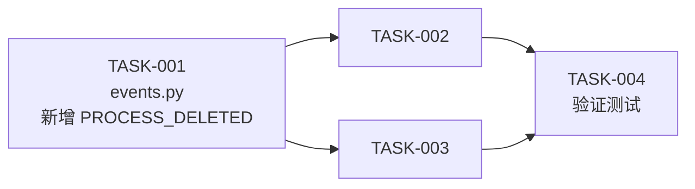

# TASK_EventBus集成_不锈钢网带跟单系统3.1.md

> 文档版本：v1.0
> 编制日期：2026-05-21
> 依据：DESIGN_EventBus集成.md（见架构方案）

---

## 一、任务拆分概览

本任务将 EventBus 事件驱动集成拆分为 **4 个原子任务**，每个任务独立可验证。

### 1.1 任务依赖图



### 1.2 任务清单

| 任务ID | 任务名称 | 优先级 | 预计工时 | 依赖任务 |
|--------|----------|--------|----------|----------|
| TASK-001 | events.py 新增 PROCESS_DELETED | P0 | 0.2h | 无 |
| TASK-002 | process_view.py 事件埋点 | P0 | 1.5h | TASK-001 |
| TASK-003 | main.py 启动初始化 | P0 | 0.3h | 无 |
| TASK-004 | 验证测试 | P0 | 1h | TASK-002, TASK-003 |

---

## 二、原子任务详情

---

### TASK-001: events.py 新增 PROCESS_DELETED 事件常量

**任务描述**：在 `core/events.py` 的 `EventType` 类中新增 `PROCESS_DELETED` 事件常量

#### 输入契约

| 前置依赖 | 输入数据 | 环境依赖 |
|----------|----------|----------|
| `core/events.py` 已存在 | 无 | Python 3.x |

#### 输出契约

| 输出数据 | 交付物 | 验收标准 |
|----------|--------|----------|
| 修改 `core/events.py` | `PROCESS_DELETED = 'process:deleted'` 新增到 EventType | `python -c "from core.events import EventType; print(EventType.PROCESS_DELETED)"` 输出 `process:deleted` |

#### 实现要求

在 `core/events.py` 的 `EventType` 类中，`# ==================== 工序相关事件 ====================` 区块（第 36-41 行）末尾追加一行：

```python
PROCESS_DELETED = 'process:deleted'
```

#### 验收标准

- [ ] `from core.events import EventType; EventType.PROCESS_DELETED` 返回 `'process:deleted'`
- [ ] 编译通过：`python -m py_compile core/events.py`

---

### TASK-002: process_view.py 事件埋点

**任务描述**：在 `views/process_view.py` 的 4 个关键方法中插入 `EventBus.publish()` 调用，使业务操作自动触发事件通知

#### 输入契约

| 前置依赖 | 输入数据 | 环境依赖 |
|----------|----------|----------|
| `core/event_bus.py`（已存在）<br/>`core/events.py`（含 EventType） | 无 | Python 3.x |

#### 输出契约

| 输出数据 | 交付物 | 验收标准 |
|----------|--------|----------|
| 修改 `views/process_view.py` | 4 个插入点完成 | 每个操作执行后对应的 EventBus.publish() 被调用 |

#### 实现要求

##### 插入点 1：`_add_process()` — `process:created`

在 `_add_process()` 的 `on_save` 回调中，第 1032-1036 行之间插入：

```python
# conn.commit() 之后 (line 1032)
# cursor.close() 之前 (line 1033)
# 获取新插入的 process_id
process_id = cursor.lastrowid
from core.event_bus import EventBus
EventBus.publish('process:created', {
    'process_id': process_id,
    'order_id': self.current_order_id,
    'production_id': prod['id'],
    'process_name': data.get('process_name', ''),
    'worker': worker,
    'process_seq': target_seq,
})
```

**位置说明**：`conn.commit()` (line 1032) 之后、`cursor.close()` (line 1033) 之前。

##### 插入点 2：`submit_report()` — `process:reported` / `process:started` / `process:completed`

在 `submit_report()` 中，第 732 行（`ProcessDAO.update_record(...)`）之后、第 734 行（表单清空）之前，插入事件发布逻辑。需先获取 old_status：

```python
old_status = target_record.get("status", "")
# 已有的: ProcessDAO.update_record(...)
# line 732 — update_record 调用
# ↓ 在此处插入 ↓
from core.event_bus import EventBus
from core.events import EventType
event_data = {
    'process_id': target_record['id'],
    'order_id': self.current_order_id,
    'process_name': proc_name,
    'quantity': qty,
    'qualified': qualified,
    'worker': worker,
    'status': status,
    'old_status': old_status,
}
EventBus.publish(EventType.PROCESS_REPORTED, event_data)
if old_status == ProcessStatus.PENDING.value and status in (ProcessStatus.IN_PROGRESS.value, ProcessStatus.COMPLETED.value):
    EventBus.publish(EventType.PROCESS_STARTED, event_data)
if status == ProcessStatus.COMPLETED.value:
    EventBus.publish(EventType.PROCESS_COMPLETED, {**event_data, 'completed_qty': new_total, 'planned_qty': total_qty})
```

**位置说明**：`ProcessDAO.update_record(...)` (line 732) 之后、表单清空代码（line 734）之前。注意在这段代码中 old_status 需要在 `ProcessDAO.update_record` 之前获取，所以需在 line 703-709（try/except 解析输入）之后、line 718（自动判断状态）之前捕获 old_status。

##### 插入点 3：`_quick_report()` — `process:reported` / `process:started` / `process:completed`

在 `_quick_report()` 的 `on_save` 回调中，第 906 行（`self.load_processes()`）之前插入：

```python
# 在 line 905（conn.commit() 相关的分支结束）之后
# self.load_processes() (line 906) 之前
from core.event_bus import EventBus
from core.events import EventType
event_data = {
    'process_id': target_record['id'],
    'order_id': fresh_record['order_id'],
    'process_name': proc_name,
    'quantity': qty,
    'qualified': qualified,
    'worker': data.get('worker', ''),
    'status': status,
    'old_status': old_status,
}
EventBus.publish(EventType.PROCESS_REPORTED, event_data)
if old_status == ProcessStatus.PENDING.value and status in (ProcessStatus.IN_PROGRESS.value, ProcessStatus.COMPLETED.value):
    EventBus.publish(EventType.PROCESS_STARTED, event_data)
if status == ProcessStatus.COMPLETED.value:
    EventBus.publish(EventType.PROCESS_COMPLETED, {**event_data, 'completed_qty': new_total, 'planned_qty': total_qty})
```

##### 插入点 4：`_delete_process()` — `process:deleted`

在第 1161 行（`conn.close()`）之后、第 1163 行（清空缓存）之前插入：

```python
# conn.close() (line 1161) 之后
# self._cached_records = None (line 1164) 之前
from core.event_bus import EventBus
from core.events import EventType
EventBus.publish(EventType.PROCESS_DELETED, {
    'process_id': record['id'],
    'order_id': record.get('order_id'),
    'process_name': record.get('process_name', ''),
})
```

#### 验收标准

- [ ] 添加工序后 -> EventBus 收到 `process:created` 事件
- [ ] 提交报工后 -> EventBus 收到 `process:reported` 事件
- [ ] 工序开始时（PENDING -> IN_PROGRESS）-> EventBus 收到 `process:started` 事件
- [ ] 工序完成时 -> EventBus 收到 `process:completed` 事件
- [ ] 删除工序后 -> EventBus 收到 `process:deleted` 事件
- [ ] 编译通过：`python -m py_compile views/process_view.py`
- [ ] 事件数据中包含 `process_id`、`order_id`、`process_name`

---

### TASK-003: main.py 启动初始化

**任务描述**：在 `main.py` 的 `main()` 函数中，在后台服务启动阶段调用 `init_container_listener()`

#### 输入契约

| 前置依赖 | 输入数据 | 环境依赖 |
|----------|----------|----------|
| `container_event_listener.py`（已存在）<br/>`main.py`（已存在） | 无 | Python 3.x |

#### 输出契约

| 输出数据 | 交付物 | 验收标准 |
|----------|--------|----------|
| 修改 `main.py` | 在 Phase 4（后台服务启动）中添加 `init_container_listener()` | 启动日志中出现 `[EventBus] ContainerEventListener 已初始化` |

#### 实现要求

在 `main.py` 的 `main()` 函数中，Phase 4（第 252-276 行，`# ─── 阶段4：启动后台服务 ───` 区块末尾、`_log_time("Services Started")` (line 276) 之前，追加：

```python
# 初始化容器事件监听器
try:
    from container_event_listener import init_container_listener
    init_container_listener()
    logger.info("[EventBus] ContainerEventListener 已初始化")
except Exception as e:
    logger.warning(f"[EventBus] ContainerEventListener 初始化失败: {e}")
```

#### 验收标准

- [ ] 应用启动后 `init_container_listener()` 被调用，不阻塞主流程
- [ ] 如果初始化失败，只记录 warning 不 crash
- [ ] 编译通过：`python -m py_compile main.py`

---

### TASK-004: 验证测试

**任务描述**：编写验证脚本，测试 EventBus 事件发布是否正确

#### 输入契约

| 前置依赖 | 输入数据 | 环境依赖 |
|----------|----------|----------|
| TASK-001, TASK-002, TASK-003 完成 | 无 | Python 3.x |

#### 输出契约

| 输出数据 | 交付物 | 验收标准 |
|----------|--------|----------|
| `scripts/test_eventbus_integration.py` | 验证脚本 | 所有测试用例通过 |

#### 实现要求

编写测试脚本 `scripts/test_eventbus_integration.py`，包含以下测试：

1. **测试 1**：EventType.PROCESS_DELETED 常量存在且值正确
2. **测试 2**：EventBus.publish 能被正确订阅和接收
3. **测试 3**：`init_container_listener()` 导入和调用不报错
4. **测试 4**：`process_view.py` 和 `main.py` 编译通过

#### 验收标准

- [ ] 所有 4 个测试用例通过
- [ ] `python scripts/test_eventbus_integration.py` 返回 0

---

## 三、执行顺序

```
TASK-001 (events.py)  →  并行执行 TASK-003 (main.py)
         ↓
    TASK-002 (process_view.py)
         ↓
    TASK-004 (验证测试)
```

TASK-001 和 TASK-003 **无依赖关系**，可以同时执行。
TASK-002 依赖 TASK-001（需要使用 EventType.PROCESS_DELETED）。
TASK-004 是所有任务的最终验证。

## 四、质量门控

- 每个任务完成后必须 `python -m py_compile <目标文件>` 确保编译通过
- TASK-002 完成后必须人工确认 4 个插入点位置正确
- TASK-004 验证脚本全部通过后，执行 `python -m py_compile views/process_view.py core/events.py main.py` 确认整体编译无异常
