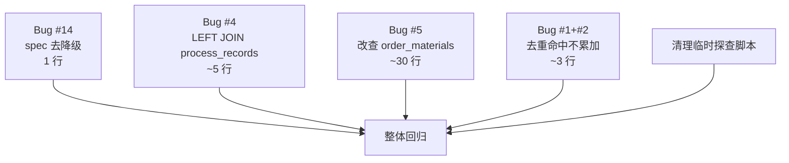

# TASK - P0 修复任务拆解

> 创建时间: 2026-06-18

---

## 任务依赖图



---

## 任务 T1 — Bug #14：spec 去降级

**输入契约**：
- 文件：`api/legacy_routes.py`
- 行：126
- 当前代码：`'spec': spec or product_name`

**输出契约**：
- 改为：`'spec': spec`
- 验收：dashboard.expectedOrders 中 spec 字段值不再等于 name 字段值

**实现约束**：
- 1 行修改
- 不影响 material/name 字段

**风险**：低

---

## 任务 T2 — Bug #4：LEFT JOIN process_records

**输入契约**：
- 文件：`core/container_center.py`（或相关 sub_steps 查询处）
- 改：get_sub_steps(order_no) 的 SQL

**输出契约**：
- 补 LEFT JOIN process_records
- 验收：sub_steps 返回的每条记录都有 process_name 字段（非空）

**实现约束**：
- 必须保留原查询的所有字段
- JOIN ON 子句：`pr.process_name = s.step_name AND pr.order_no = s.order_no AND pr.is_deleted = 0`
- 如果 LEFT JOIN 没有命中（process_name 为空），前端 fallback 到 step_name

**风险**：中（如 sub_steps 多重匹配会重复行）

---

## 任务 T3 — Bug #5：改查 order_materials

**输入契约**：
- 文件：`dispatch_center/_core.py:2498-2570`
- 当前 SQL 引用了不存在的字段（title/content/data_type）

**输出契约**：
- 改查 `order_materials` 表（有 spec/unit/required_qty/prepared_qty）
- 验收：GET /api/dispatch-center/material/requirements 返回 HTTP 200，spec/unit 字段不再全空

**实现约束**：
- 保留原 records 结构（order_no/material_name/spec/required_qty/prepared_qty/shortage_qty/unit/updated_at）
- 数据源改：`order_materials`（有 spec/unit 字段，16 条数据）
- 按 order_id 关联 production_orders.order_no → order_materials.order_id

**风险**：高（涉及完整 SQL 重写 + 字段映射）

---

## 任务 T5 — Bug #1+#2：去重命中不累加

**输入契约**：
- 文件：`storage/mysql_storage.py:1215-1219`
- 当前代码：
  ```python
  # 2. 累加 data_packages.completed_qty
  cur.execute(
      "UPDATE data_packages SET completed_qty = COALESCE(completed_qty, 0) + %s "
      "WHERE related_order=%s AND related_process=%s",
      (qty_delta, pkg_order, pkg_process))
  ```

**输出契约**：
- 改为：把累加 SQL 移进 `else: # 新增行` 分支内
- 验收：同一 order+step 重复报工 3 次（无 batch_no），data_packages.completed_qty = 第一次的 quantity

**实现约束**：
- 累加 SQL 必须在 INSERT 成功之后执行
- 不能影响 1 次 commit 的事务边界
- 保留 operator 合并逻辑

**风险**：中（已完成的原子事务边界需要重新测试）

---

## 任务 T6 — 清理临时探查脚本

**输入契约**：
- 5 个临时文件：_check_schema.py/.py2/.py3/.py4/.py5

**输出契约**：
- 删除所有 _check_schema*.py
- 验证目录无临时文件残留

**风险**：低

---

## 任务 T4 — 整体回归验证

**验证步骤**：
1. 重启 5008 服务（让代码生效）
2. 跑端到端报工测试：同一 order+step 重复 3 次
3. 验证 data_packages.completed_qty 不暴增
4. 验证 dashboard.sub_steps.processName 不为空
5. 验证 material/requirements 端点 HTTP 200
6. 验证 dashboard.expectedOrders.spec ≠ name

**通过标准**：
- 5 个验证项全部通过
- 完成度报告写入 ACCEPTANCE_P0修复.md
