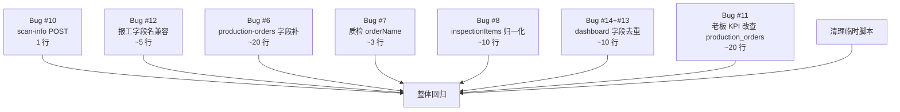

# TASK - P1+P2 修复任务拆解

> 创建时间: 2026-06-18

---

## 任务依赖图

---

## 任务 T1 - Bug #10 scan-info POST

**输入契约**：
- 文件：`api/legacy_routes.py`
- 行：209
- 当前代码：`@bp.route('/api/scan-info', methods=['GET'])`

**输出契约**：
- 改为：`methods=['GET', 'POST']`
- 兼容 GET (?code=X) 和 POST (form/code body)
- 验收：POST 返回 HTTP 200

**风险**：低

---

## 任务 T2 - Bug #12 报工字段名兼容

**输入契约**：
- 文件：`app.py`
- 行：273-303
- 当前代码：只接受 `step_name` + `operator`

**输出契约**：
- 改为：兼容 `step_name/process_name/process_code` + `operator/operator_name/worker`
- 验收：POST 用 `process_code + operator_name` 也能成功

**风险**：低

---

## 任务 T3 - Bug #6 production-orders 字段

**输入契约**：
- 文件：`api/legacy_routes.py`
- 行：700-740
- 当前代码：material/spec/planStart 全部硬编码 ''

**输出契约**：
- 改为：批量 JOIN production_orders → po_map，按 order_no 查
- material/spec/planStart/assignedTo/flowType/planEnd 全部从 po_map 取
- 验收：16 条生产订单都能返回补全的字段（material/spec 因为数据源缺失会空）

**风险**：中（涉及完整 production-orders 端点重构）

---

## 任务 T4 - Bug #7 质检 orderName

**输入契约**：
- 文件：`dispatch_center/_core.py`
- 行：7267-7298
- 当前代码：返回字段无 orderName

**输出契约**：
- 改为：records.append 加 `'orderName': r.get('order_no', '')`
- 验收：30 条质检记录全部 orderName 非空

**风险**：低

---

## 任务 T5 - Bug #8 inspectionItems 归一化

**输入契约**：
- 文件：`dispatch_center/_core.py`
- 行：7267-7298

**输出契约**：
- 改为：`_normalize_inspection_items(raw)` 函数
- 兼容 None / "a,b,c" / "['a','b']" / array
- 验收：30 条全部为 array 格式

**风险**：低

---

## 任务 T6 - Bug #14+#13 dashboard 字段去重

**输入契约**：
- 文件：`api/legacy_routes.py`
- 行：122-133（dashboard expectedOrders 构造）

**输出契约**：
- 改为：去掉 `order_no` 字段，material/spec 用真实字段（fallback to product_name）
- 验收：5 条 expectedOrders 不含 order_no/orderNo

**风险**：低

---

## 任务 T7 - Bug #11 老板 KPI

**输入契约**：
- 文件：`api/legacy_routes.py` + `storage/mysql_storage.py`
- 行：88-103

**输出契约**：
- 改：新增 `MySQLStorage.get_all_production_orders()` 方法
- 改 dashboard 计算 pending/processing/completed 查 production_orders
- 验收：KPI 反映真实订单数（processing=5，pending=0，completed=0）

**风险**：中

---

## 任务 T9 - 清理临时脚本

清理 `_verify_p1p2.py` 和其他临时文件

---

## 任务 T8 - 整体回归验证

**验证步骤**：
1. 杀掉所有旧 python 进程（避免端口冲突）
2. 重启 5003 + 5008
3. 跑 `_verify_p1p2.py` 验证 8 项
4. 至少 7/8 PASS

**通过标准**：
- 7+ 项验证通过
- 1 项 #6 数据建模缺陷（明确标注, 不算修复失败）
- 完成度报告写入 ACCEPTANCE_P1P2修复.md
