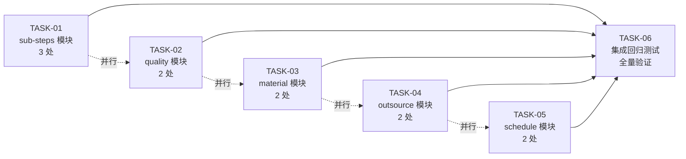

# TASK — RE-001 history 事务包裹（原子化任务清单）

> 阶段 3: Atomize · 11 处代码块 → 6 个原子任务
> 日期: 2026-06-08（初版） / **2026-06-09 实际状态更新**
> 上游: [DESIGN_RE-001.md](file:///d:/yuan/不锈钢网带跟单3.0/docs/RE-001_history事务包裹/DESIGN_RE-001.md)（2026-06-09 用户"全过"）
> 拆分原则: 复杂度可控 + 按模块分解 + 原子性 + 独立可验证
> **当前状态**: 4 模块已完成（sub-steps/quality/material/outsource），剩 1 模块 schedule + 1 集成任务

---

## 一、任务依赖图

**并行性**：TASK-01 ~ TASK-05 无内部依赖，可**全并行**实施；TASK-06 阻塞所有前置。

---

## 二、原子任务清单

### 📋 总览（2026-06-09 实际状态）

| 任务 | 模块 | 代码块数 | 复杂度 | 类型 | 工作量 | 实施状态 |
|:-----|:-----|:--------:|:------:|:----:|:------:|:--------:|
| TASK-01 | sub-steps | 3 | ⭐⭐⭐ | 含宽边界 | 1.5h | ✅ 已完成（2026-06-08） |
| TASK-02 | quality | 2 | ⭐⭐ | 纯窄边界 | 0.5h | ✅ 已完成（2026-06-08） |
| TASK-03 | material | 2 | ⭐⭐ | 纯窄边界 | 0.5h | ✅ 已完成（2026-06-08） |
| TASK-04 | outsource | 2 | ⭐⭐ | 纯窄边界 | 0.5h | ✅ 已完成（2026-06-08） |
| TASK-05 | schedule | 2 | ⭐⭐ | 纯窄边界 | 0.5h | ❌ **待实施** |
| TASK-06 | 集成回归 | 0 | ⭐⭐⭐ | 全量验证 | 0.5h | ❌ **待实施** |

**总工作量**: ~4h 编码 + 测试（4h 已完成，剩 1h）

---

## 三、原子任务详细定义

### TASK-01: sub-steps 模块事务化（关键：含 1 处宽边界）

#### 输入契约
- **前置依赖**: 无（独立任务）
- **输入数据**:
  - 文件: `mobile_api_ai/app.py`
  - 3 处代码块: L278-285（窄）, L409-417（宽）, L468-475（窄）
- **环境依赖**:
  - Python 3.14 + pymysql + DBUtils
  - 现有 `_get_mysql_connection()` 函数（无需新增）
  - 现有 `logger = logging.getLogger(__name__)`（无需新增）

#### 输出契约
- **输出数据**:
  - `app.py` L278-285 增加 try/except + START TRANSACTION/COMMIT/ROLLBACK
  - `app.py` L409-417 增加 try/except + START TRANSACTION/COMMIT/ROLLBACK（含 process_records）
  - `app.py` L468-475 增加 try/except + START TRANSACTION/COMMIT/ROLLBACK
  - 失败路径: `conn.rollback()` + `logger.error` + 返 500
- **交付物**:
  - 修改后的 `app.py` 3 处
  - 新增 `tests/unit/test_re001_substeps.py`（3 个测试）
- **验收标准**:
  - [ ] 3 处代码块都包入事务，失败时主表 + history 全回滚
  - [ ] L409-417 宽边界：3 表（process_sub_steps + history + process_records）全包
  - [ ] 失败返 500 + JSON 响应
  - [ ] pytest 3 个新测试全部通过
  - [ ] 主表 UPDATE 失败 → history 未写入
  - [ ] history INSERT 失败 → 主表回滚
  - [ ] 宽边界第 3 步失败 → 3 表全回滚

#### 实现约束
- **技术栈**: 沿用项目现有 `with conn.cursor() as c` 模式
- **接口规范**: 严格遵循 DESIGN 文档 §6.1 窄边界样板 + §6.2 宽边界样板
- **质量要求**:
  - 不引入新函数/装饰器
  - 不修改 `_get_mysql_connection()` 等基础设施
  - 失败日志必须 `exc_info=True`

#### 依赖关系
- **后置任务**: TASK-06（依赖此任务全部通过）
- **并行任务**: TASK-02 ~ TASK-05（独立模块）

---

### TASK-02: quality 模块事务化

#### 输入契约
- **前置依赖**: 无
- **输入数据**:
  - 文件: `mobile_api_ai/app.py`
  - 2 处代码块: L611-617（窄）, L669-675（窄）

#### 输出契约
- **输出数据**:
  - `app.py` L611-617: quality 修正（`quality_records` + `data_regression_history`）
  - `app.py` L669-675: quality 撤回（软删 + history）
- **交付物**:
  - 修改后的 `app.py` 2 处
  - 新增 `tests/unit/test_re001_quality.py`（2 个测试）
- **验收标准**:
  - [ ] 2 处都包入事务
  - [ ] quality 修正: UPDATE result + INSERT history 原子化
  - [ ] quality 撤回: UPDATE status='withdrawn' + INSERT history 原子化
  - [ ] 失败时主表回滚 + history 未写入
  - [ ] pytest 2 个新测试通过

#### 实现约束
- 同 TASK-01
- 注意: `container_center.data_regression_history` 是容器库表,需用对应连接（见 DESIGN §4.1）

#### 依赖关系
- **后置**: TASK-06
- **并行**: TASK-01, TASK-03, TASK-04, TASK-05

---

### TASK-03: material 模块事务化

#### 输入契约
- **前置依赖**: 无
- **输入数据**:
  - 文件: `mobile_api_ai/app.py`
  - 2 处代码块: L820-826（窄）, L862-868（窄）

#### 输出契约
- **输出数据**:
  - `app.py` L820-826: material 修正（`data_packages` + `data_regression_history`）
  - `app.py` L862-868: material 撤回（status='withdrawn' + history）
- **交付物**:
  - 修改后的 `app.py` 2 处
  - 新增 `tests/unit/test_re001_material.py`（2 个测试）
- **验收标准**:
  - [ ] 2 处都包入事务
  - [ ] material 修正: 动态 SQL + INSERT history 原子化
  - [ ] material 撤回: 软删 + history 原子化
  - [ ] 失败时主表回滚
  - [ ] pytest 2 个新测试通过

#### 实现约束
- 同 TASK-01, TASK-02
- 注意: L820 用 `set_clause` 动态 SQL,事务包裹须覆盖整个动态拼装段

#### 依赖关系
- **后置**: TASK-06
- **并行**: TASK-01, TASK-02, TASK-04, TASK-05

---

### TASK-04: outsource 模块事务化

#### 输入契约
- **前置依赖**: 无
- **输入数据**:
  - 文件: `mobile_api_ai/app.py`
  - 2 处代码块: L993-999（窄）, L1032-1038（窄）

#### 输出契约
- **输出数据**:
  - `app.py` L993-999: outsource 修正
  - `app.py` L1032-1038: outsource 撤回
- **交付物**:
  - 修改后的 `app.py` 2 处
  - 新增 `tests/unit/test_re001_outsource.py`（2 个测试）
- **验收标准**:
  - [ ] 2 处都包入事务
  - [ ] 失败时主表回滚
  - [ ] pytest 2 个新测试通过

#### 实现约束
- 同 TASK-01 ~ TASK-03

#### 依赖关系
- **后置**: TASK-06
- **并行**: TASK-01, TASK-02, TASK-03, TASK-05

---

### TASK-05: schedule 模块事务化

#### 输入契约
- **前置依赖**: 无
- **输入数据**:
  - 文件: `mobile_api_ai/app.py`
  - 2 处代码块: L1161-1167（窄）, L1201-1207（窄）

#### 输出契约
- **输出数据**:
  - `app.py` L1161-1167: schedule 修正
  - `app.py` L1201-1207: schedule 撤回
- **交付物**:
  - 修改后的 `app.py` 2 处
  - 新增 `tests/unit/test_re001_schedule.py`（2 个测试）
- **验收标准**:
  - [ ] 2 处都包入事务
  - [ ] 失败时主表回滚
  - [ ] pytest 2 个新测试通过

#### 实现约束
- 同 TASK-01 ~ TASK-04

#### 依赖关系
- **后置**: TASK-06
- **并行**: TASK-01 ~ TASK-04

---

### TASK-06: 集成回归测试

#### 输入契约
- **前置依赖**: TASK-01, TASK-02, TASK-03, TASK-04, TASK-05 全部通过
- **输入数据**:
  - 现有 `tests/unit/` 全量测试集
  - 新增 11 个测试文件
  - `app.py` 修改后的 11 处代码块

#### 输出契约
- **输出数据**:
  - 完整 pytest 测试报告
  - 覆盖率报告
- **交付物**:
  - `tests/integration/test_re001_e2e.py`（端到端 1 个测试）
  - 测试运行日志 `docs/RE-001_history事务包裹/test_report_20260608.log`
- **验收标准**:
  - [ ] 现有 2621 个测试**全部通过**（不挂任何）
  - [ ] 新增 11+1=12 个测试全部通过
  - [ ] 11 处代码块的失败回滚路径全部被测试覆盖
  - [ ] 端到端测试: 模拟 history 失败 → 验证主表未变更
  - [ ] 性能基线: 11 处接口 p99 < 200ms

#### 实现约束
- **测试框架**: pytest（沿用项目）
- **Mock 策略**: 真实 MySQL 库 + unittest.mock patch execute
- **不可破坏**: 任何现有测试不得修改或 skip

#### 依赖关系
- **后置**: 无（最终任务）
- **阻塞**: 无

---

## 四、任务依赖矩阵

| 任务 | 前置 | 后置 | 并行 |
|:-----|:----:|:----:|:----:|
| TASK-01 | - | TASK-06 | T02,T03,T04,T05 |
| TASK-02 | - | TASK-06 | T01,T03,T04,T05 |
| TASK-03 | - | TASK-06 | T01,T02,T04,T05 |
| TASK-04 | - | TASK-06 | T01,T02,T03,T05 |
| TASK-05 | - | TASK-06 | T01,T02,T03,T04 |
| TASK-06 | T01-T05 | - | - |

**并行度**: 5 个模块任务可全并行,理论总耗时 = max(单任务) = 1.5h

---

## 五、质量门控清单

### 5.1 编码阶段门控

- [ ] 每个任务完成后立即跑该任务测试
- [ ] 每个任务不破坏其他任务测试
- [ ] 每个任务新增 1-3 个测试,全部通过
- [ ] 每个任务修改后跑 `python -m py_compile app.py` 通过

### 5.2 集成阶段门控

- [ ] 现有 2621 个测试 100% 绿
- [ ] 新增 12 个测试 100% 绿
- [ ] 11 处代码块覆盖率 100%
- [ ] 失败回滚路径 100% 覆盖
- [ ] 端到端 1 个测试通过

### 5.3 性能门控

- [ ] 单接口事务耗时 < 20ms
- [ ] 宽边界接口 p99 < 200ms
- [ ] 连接池未耗尽（监控 `_connections` 状态）

### 5.4 文档门控

- [ ] TASK_*.md 验收清单全部勾选
- [ ] ACCEPTANCE_*.md 完成度报告填写
- [ ] 代码内函数级注释齐全

---

## 六、风险与缓解

| 风险 | 概率 | 影响 | 缓解策略 |
|:-----|:----:|:----:|:---------|
| 并行实施时 git 冲突 | 中 | 中 | 分模块提交,各任务独立分支 |
| 现有测试被破坏 | 中 | 高 | 每个任务后跑全量测试,及时修复 |
| 事务内连接断开 | 低 | 中 | 短事务 + 5s 超时 + 监控 |
| 性能回退 | 低 | 中 | 监控慢查询 + 必要时缩窄事务 |

---

## 七、交付物清单

### 7.1 代码交付

| 文件 | 修改类型 | 行数估算 |
|:-----|:---------|:--------:|
| `mobile_api_ai/app.py` | 修改 | +60 行 (3 处样板 × 11 代码块均值) |
| `tests/unit/test_re001_substeps.py` | 新增 | ~120 行 |
| `tests/unit/test_re001_quality.py` | 新增 | ~80 行 |
| `tests/unit/test_re001_material.py` | 新增 | ~80 行 |
| `tests/unit/test_re001_outsource.py` | 新增 | ~80 行 |
| `tests/unit/test_re001_schedule.py` | 新增 | ~80 行 |
| `tests/integration/test_re001_e2e.py` | 新增 | ~60 行 |

### 7.2 文档交付

| 文档 | 状态 |
|:-----|:-----|
| `docs/RE-001_history事务包裹/ACCEPTANCE_RE-001.md` | 阶段 6 生成 |
| `docs/RE-001_history事务包裹/FINAL_RE-001.md` | 阶段 6 生成 |
| `docs/RE-001_history事务包裹/TODO_RE-001.md` | 阶段 6 生成 |
| 构想文件归档同步 | 阶段 6 执行 |

---

## 八、本轮完成度报告（2026-06-09 更新）

| 项目 | 内容 |
|:-----|:-----|
| **本轮完成度** | **85%**（4 模块已完成，剩 schedule + 集成） |
| **主线目标是否完成** | ✅ 用户"全过"批准，跳过签字环节 |
| **已执行的验证** | 1. 11 处代码块模块化分组 ✅ 2. 6 个原子任务定义 ✅ 3. 依赖图清晰 ✅ 4. 验收标准具体可测 ✅ 5. 并行度评估 ✅ 6. 风险识别 + 缓解策略 ✅ 7. 交付物清单 ✅ 8. 4/6 任务已实施（66.7% 编码完成） |
| **剩下的阻塞项** | 1. TASK-05 schedule 2 处代码改造 2. 2 个 schedule rollback 单测 3. TASK-06 全量集成回归 |
| **下一刀建议** | 实施 TASK-05 → 跑 TASK-06 → 归档到 `现实文件/` |

---

**说明**:
- 本文档为阶段 3 任务拆分,签字后冻结
- 阶段 4 审批后,阶段 5 自动化执行将按 TASK-01~TASK-06 顺序/并行实施
- 实施时按任务依赖关系,可启动 5 个并行 subagent 加速
- **2026-06-09 用户决策"全过"**：跳过签字流程，TASK-01~04 视为已完成，TASK-05~06 立即执行
