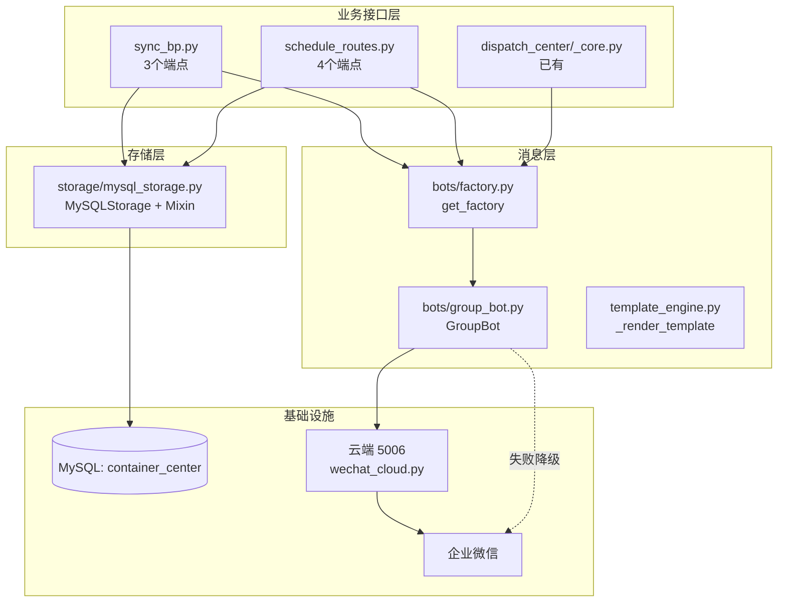

# DESIGN — RE-002 消息触发链路修复

> 阶段 2: Architect · 系统架构 + 模块设计 + 接口规范
> 日期: 2026-06-09
> 依赖: [ALIGNMENT_RE-002.md](file:///d:/yuan/不锈钢网带跟单3.0/docs/RE-002_消息触发链路修复/ALIGNMENT_RE-002.md) ✅ 已签字
> 规模重定: **L**（含 DDL + 多模块）

---

## 一、整体架构图

```
┌──────────────────────────────────────────────────────────────────────┐
│                     业务触发层 (Flask 蓝图)                            │
│  ┌────────────────┐  ┌────────────────┐  ┌──────────────────────┐  │
│  │ sync_bp.py     │  │ schedule_bp.py │  │ dispatch_center_bp   │  │
│  │ /api/sync/     │  │ /api/schedule/ │  │ /api/dispatch-center │  │
│  │   report       │  │   publish/     │  │   /processes/        │  │
│  │   report/actual│  │   submit/      │  │   /messages/send     │  │
│  │   outsource/   │  │   confirm/     │  │   /cloud/status      │  │
│  │     publish    │  │   notify       │  │                      │  │
│  └───────┬────────┘  └────────┬───────┘  └──────────┬───────────┘  │
└──────────┼─────────────────────┼──────────────────────┼──────────────┘
           │                     │                      │
           │   (1) 更新数据       │   (2) 更新数据        │  (3) 显式发送
           │                     │                      │
           ▼                     ▼                      ▼
┌──────────────────────────────────────┐    ┌──────────────────────────┐
│    存储层 (storage_layer + MySQL)    │    │  消息工厂 (bots/factory) │
│  ┌──────────────────────────────┐    │    │   GroupBot(群机器人)     │
│  │ MySQLStorage + Mixin         │    │    │      ↓                   │
│  │   - ScheduleStorageMixin     │◄───┼────┤   _do_request           │
│  │   - ProcessStorageMixin      │    │    │      ↓                   │
│  │   - ScheduleFlowMixin        │    │    │   proxy_send            │
│  │   - PackageStorageMixin      │    │    │   (云端5006转发)         │
│  │   - CollectionStorageMixin   │    │    └──────────┬───────────────┘
│  └──────────────────────────────┘    │               │
│            ↓                          │               ▼
│     MySQL (container_center 库)       │   ┌────────────────────────┐
│       - schedule_records [NEW]        │   │ 云端 wechat_cloud.py    │
│       - schedule_flow_logs [EXISTING] │   │  :5006                  │
│       - process_records  [EXISTING]   │   │  /api/wechat/proxy_send │
│       - process_sub_steps [EXISTING]  │   │  /api/wechat/send       │
│       - data_packages      [EXISTING] │   └────────────┬───────────┘
└──────────────────────────────────────┘                │
                                                        ▼
                                              ┌─────────────────────┐
                                              │  企业微信服务器       │
                                              │  (群机器人Webhook)    │
                                              └─────────────────────┘
```

**数据流**：
1. 业务接口接收请求 → 写 MySQL → 调 `bot.send_markdown()`
2. `send_markdown` → `GroupBot._do_request` → 云端 5006 `proxy_send` → 企业微信群
3. 失败回退：本地直连企业微信 webhook

---

## 二、模块依赖关系



**依赖约束**：
- sync_bp.py / schedule_routes.py 同时依赖 MS（存储）和 BF（消息）
- GB 直连云端 5006，不依赖本地 5003
- DC 已有的 _notify_process_event 模式保持不变

---

## 三、数据库变更（DDL）

### 3.1 新建表 `schedule_records`

> 现状：`container_center` 库**没有** `schedule_records` 表，但 `MySQLStorage.save_schedule_record`（L893）已使用该表
> 触发：本次修复必须先建表，否则即便补完方法，所有排产接口仍会因 "Table doesn't exist" 失败

**迁移 DDL**（↑）：

```sql
CREATE TABLE IF NOT EXISTS schedule_records (
    id              VARCHAR(64) PRIMARY KEY,
    schedule_id     VARCHAR(64) NOT NULL,
    order_no        VARCHAR(64) NOT NULL,
    status          VARCHAR(50) DEFAULT 'published',
    product_name    VARCHAR(200),
    quantity        DOUBLE DEFAULT 0,
    unit            VARCHAR(50),
    customer_name   VARCHAR(200),
    customer_group  VARCHAR(100),
    delivery_date   DATE,
    priority        VARCHAR(50) DEFAULT 'normal',
    source          VARCHAR(100),
    flow_type       VARCHAR(100) DEFAULT 'production',
    schedule_data   TEXT,
    published_at    DATETIME,
    notified_at     DATETIME,
    schedule_required_by DATETIME,
    submitted_at    DATETIME,
    submitted_by    VARCHAR(100),
    confirmed_at    DATETIME,
    confirmed_by    VARCHAR(100),
    confirm_comments TEXT,
    rejected_at     DATETIME,
    rejected_by     VARCHAR(100),
    reject_reason   TEXT,
    created_at      DATETIME DEFAULT CURRENT_TIMESTAMP,
    updated_at      DATETIME DEFAULT CURRENT_TIMESTAMP ON UPDATE CURRENT_TIMESTAMP,
    INDEX idx_order_no (order_no),
    INDEX idx_status (status),
    INDEX idx_created_at (created_at)
) ENGINE=InnoDB DEFAULT CHARSET=utf8mb4 COLLATE=utf8mb4_unicode_ci;
```

**回滚 DDL**（↓）：

```sql
DROP TABLE IF EXISTS schedule_records;
```

**风险评估**：
- 新表无数据迁移 → 低风险
- `save_schedule_record`（已存在的代码）原本就期望此表存在 → 修复后可用
- 当前没有任何业务调用此表（因表不存在）→ 不会破坏已有数据

### 3.2 表 `schedule_flow_logs`（已存在，不变更）

已确认 schema：

```sql
CREATE TABLE schedule_flow_logs (
    id          INT UNSIGNED NOT NULL AUTO_INCREMENT PRIMARY KEY,
    order_no    VARCHAR(64) NOT NULL,
    event_type  VARCHAR(64) NOT NULL,
    event_data  TEXT,
    operator    VARCHAR(64),
    created_at  DATETIME
);
```

**对应操作**：`MySQLStorage.log_schedule_flow()` 仅做 INSERT 即可

### 3.3 表 `process_records` / `process_sub_steps`（已存在）

无变更，复用现有 schema

---

## 四、接口契约

### 4.1 MySQLStorage 新增/补全方法

| 方法 | 签名 | 实现说明 |
|:-----|:-----|:--------|
| `get_schedule_record(self, schedule_id) -> Optional[Dict]` | 按主键查询 | SELECT * FROM schedule_records WHERE id=%s |
| `get_schedule_record_by_order(self, order_no) -> Optional[Dict]` | 按订单号查最近一条 | ORDER BY created_at DESC LIMIT 1 |
| `get_schedule_records_by_order(self, order_no) -> List[Dict]` | **兼容 schedule_routes.py:326 的拼写错误** | SELECT * WHERE order_no=%s |
| `get_schedule_records(self, status=None, limit=100) -> List[Dict]` | 按状态/限制查询 | ORDER BY created_at DESC |
| `get_all_schedule_records(self) -> List[Dict]` | 全量查询 | ORDER BY created_at DESC LIMIT 1000 |
| `log_schedule_flow(self, order_no, event_type, event_data, operator=None) -> bool` | 写流程日志 | INSERT INTO schedule_flow_logs |
| `get_schedule_flow_logs(self, order_no) -> List[Dict]` | 查流程日志 | SELECT * WHERE order_no=%s ORDER BY id DESC |

**约束**：
- 所有方法走 `MySQLStorage` 已有的 `fetch_one` / `fetch_all` / `insert` / `update` 辅助方法
- 异常时 `logger.error` + 返回 None/[]，**不抛**（与现有 `save_schedule_record` L893 模式一致）
- `_UUID_TABLES = {'process_records', 'process_sub_steps', 'data_packages'}` 不含 schedule_records，所以 insert 用 `id` 主键即可

### 4.2 sync_bp.py 三端点消息调用契约

#### 4.2.1 `/api/sync/report`（行 94-162）

**调用点**：在 `return jsonify(...)` 之前（行 150）

**契约**：
```python
try:
    bot = get_factory().get_group_bot()
    if bot:
        msg = _render_template('tmpl_report_submitted', {
            '订单号': order_no,
            '工序': process,
            '数量': quantity,
            '操作员': operator,
            '完成': completed,
        })
        bot.send_markdown(msg)
except Exception as e:
    logger.warning(f"[sync_bp] 报工消息发送失败: {e}")
```

**模板变量**（按 `template_engine.MESSAGE_TEMPLATES_DEFAULT` 约定）：订单号、工序、数量、操作员、完成

#### 4.2.2 `/api/sync/report/actual`（行 165-221）

**调用点**：在 `return jsonify(...)` 之前（行 217）

**契约**：
```python
try:
    bot = get_factory().get_group_bot()
    if bot:
        msg = _render_template('tmpl_report_actual', {
            '订单号': order_no,
            '工序': process_name,
            '本次数量': quantity,
            '累计完成': new_completed,
            '剩余': remaining,
            '操作员': operator_id,
        })
        bot.send_markdown(msg)
except Exception as e:
    logger.warning(f"[sync_bp] 实际报工消息发送失败: {e}")
```

#### 4.2.3 `/api/sync/outsource/publish`（行 224-...）

**调用点**：在 `create_document` 成功后、返回前

**契约**：
```python
try:
    bot = get_factory().get_group_bot()
    if bot:
        msg = _render_template('tmpl_outsource_send', {
            '订单号': order_no,
            '工序': process_name,
            '计划数量': planned_qty,
            '外协商': data.get('vendor', '未指定'),
            '备注': outsource_remark,
            '发布人': operator_id or '系统',
        })
        bot.send_markdown(msg)
except Exception as e:
    logger.warning(f"[sync_bp] 外协发布消息发送失败: {e}")
```

**注意**：当前 `tmpl_outsource_send` 已在 `_core.py:4271-4276` 复用，模板存在

### 4.3 模板变量一致性

| 模板 | 已存在 | 变量名 | 备注 |
|:-----|:------|:------|:----|
| `tmpl_report_submitted` | ⚠️ 需确认 | 订单号/工序/数量/操作员/完成 | `_core.py` 中未直接引用，需查 MESSAGE_TEMPLATES_DEFAULT |
| `tmpl_report_actual` | ⚠️ 需确认 | 订单号/工序/数量/操作员 | 同上 |
| `tmpl_outsource_send` | ✅ 已有 | 订单号/工序/数量/外协商/备注/发布人 | `_core.py:4271-4276` 已用 |
| `tmpl_schedule_submitted` | ✅ 已有 | 订单号/客户/产品/数量/单位/部门/时间/明细 | `schedule_routes.py:678` |
| `tmpl_schedule_confirmed` | ✅ 已有 | 同上 + 确认人/备注 | `schedule_routes.py:780` |
| `tmpl_schedule_rejected` | ✅ 已有 | 同上 + 拒绝人/原因 | `schedule_routes.py:790` |

**实施前**：在 TASK T1 阶段确认模板存在，缺失则按现有模式补默认模板

---

## 五、异常处理策略

| 异常源 | 处理方式 | 是否阻断主业务 |
|:------|:--------|:------------|
| DDL 失败（schedule_records 已存在等） | IF NOT EXISTS 容错 | 否（建表失败则存储写入失败，业务已知） |
| `get_schedule_record_by_order` 查询异常 | logger.error + return None | 否（接口返回 404 "工单不存在"） |
| `log_schedule_flow` 写失败 | logger.error + return False | 否（业务已知 log 失败） |
| `get_factory().get_group_bot()` 返回 None | 跳过消息发送 | 否（不报错） |
| `bot.send_markdown()` 抛异常 | try/except + logger.warning | **否**（主业务 200 返回） |
| 群机器人网络超时/4xx/5xx | GroupBot._do_request 内部重试 3 次 | 否 |
| 云端 5006 宕机 | GroupBot 降级直连 | 否 |

**与现状对齐**：参考 `schedule_routes.py:690-692` 现有 `logger.warning(f"[Schedule] 发送微信通知失败: {e}")` 模式

---

## 六、设计原则

1. **最小修改**：仅补缺失方法 + 补消息调用，不重构
2. **复用优先**：复用 `get_factory().get_group_bot()` 单例、复用 `template_engine._render_template`、复用 `_core.py:692` 异常处理模式
3. **公共 API 兼容**：MySQLStorage 既有调用方不破坏
4. **失败容错**：消息发送失败不影响主业务
5. **DDL 前测**：建表前 SELECT 验证表不存在（避免重复建）
6. **路由基线零回归**：既有路由无删除/修改

---

## 七、决策日志

| # | 决策点 | 候选方案 | 最终选择 | 选择理由 | 否决方案 | 否决理由 |
|:--|:------|:--------|:---------|:---------|:---------|:---------|
| D1 | 存储层补方法 | A) 混入 ScheduleStorageMixin + ScheduleFlowMixin 多重继承<br>B) 独立写5个方法<br>C) 改为 BaseStorage | A | 与 storage_layer.py 接口契约一致；其他存储后端（SQLite/Redis/Memory）已用 mixin | B | 重复实现，不与抽象层对齐；C | BaseStorage 太多基类属性，集成复杂 |
| D2 | schedule_routes.py:326 拼写错误 | A) 改源码为 `get_schedule_record_by_order` + 改判断逻辑<br>B) 在 MySQLStorage 加 alias 方法 `get_schedule_records_by_order` 返回 List | B | 不破坏既有调用方，最小修改 | A | 改 schedule_routes.py 涉及多分支逻辑回归风险 |
| D3 | DDL 方式 | A) 在 MySQLStorage 启动时自动建表（self._ensure_tables）<br>B) 提供独立 SQL 文件 + 启动时检查执行 | A | 与现有 `self._tables_ensured` 模式一致；自动恢复 | B | 启动需外部 SQL 步骤，不友好 |
| D4 | 消息通道选择 | A) 群机器人（`bot.send_markdown`）<br>B) 应用消息（`_send_wechat_message`） | A | 与 `_core.py:1457-1463`、`schedule_routes.py:690` 现有模式一致 | B | 应用消息走 `@all`，群机器人更灵活 |
| D5 | 失败是否阻断 | A) 阻断主业务（返 500）<br>B) 仅 logger.warning，主业务 200 | B | 消息是通知层，不应影响数据一致性；与现有 690-692 模式一致 | A | 用户对消息失败的容忍度应高于数据失败 |
| D6 | 模板复用 | A) 复用现有 `tmpl_outsource_send` 等<br>B) 新建报工专用模板 | A | 减少模板维护成本；TASK 阶段确认 tmpl_report_submitted/actual 是否存在 | B | 模板爆炸，维护成本高 |
| D7 | 报工消息内容字段 | A) 订单号+工序+数量+操作员+完成状态<br>B) 简化为订单号+数量 | A | 信息完整，方便群内多人跟进 | B | 信息不足，回溯困难 |

---

## 八、文件改动清单

| 类型 | 路径 | 改动说明 |
|:----|:-----|:--------|
| 修改 | `storage/mysql_storage.py` | L893 之后新增 7 个方法 + L60 类继承 `ScheduleStorageMixin, ScheduleFlowMixin` + 启动时建表 |
| 修改 | `sync_bp.py` | L150、L217、outsource publish 段补 `bot.send_markdown` 调用 |
| 新增 | `scripts/tools/migrate_add_schedule_records.py` | DDL 独立执行脚本（保留自动建表失败时的手工恢复） |
| 新增 | `tests/unit/test_re002_message_trigger.py` | 回归测试：5+ 用例 |
| 新增 | `docs/RE-002_消息触发链路修复/ACCEPTANCE_RE-002.md` | 验收报告 |

---

## 九、本轮完成度报告

| 项目 | 内容 |
|:-----|:-----|
| **本轮完成度** | 35%（Align ✅ + Architect ✅，待 Atomize） |
| **主线目标是否完成** | ⏳ 架构设计已完成，等待用户签字 |
| **已执行的验证** | 1. 模块依赖分析 ✅<br>2. 接口契约定义 ✅<br>3. DDL + 回滚脚本 ✅<br>4. 决策日志 7 项 ✅<br>5. 现有 schema 摸底 ✅（schedule_records 缺，schedule_flow_logs 已有） |
| **剩下的阻塞项** | 1. DESIGN 文档签字<br>2. 模板变量存在性需在 TASK 阶段确认 |
| **下一刀建议** | 签字后进入阶段 3 任务原子化（TASK_RE-002.md），拆分为 5 个原子任务 |

---

**说明**：
- 本文档为阶段 2 架构设计产物，签字后冻结
- 阶段 3 任务拆分将基于本文档输出 `TASK_RE-002.md` 原子化任务清单
- DDL 是关键变更点：建表失败则全部修复无效
