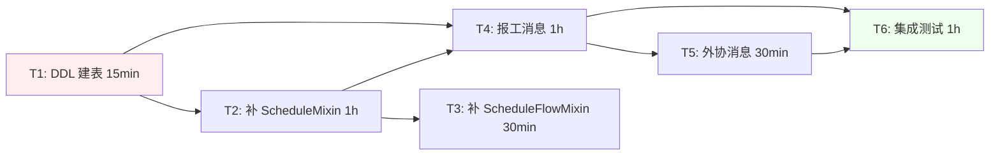

# TASK — RE-002 消息触发链路修复

> 阶段 3: Atomize · 原子化任务清单
> 日期: 2026-06-09
> 依赖: [DESIGN_RE-002.md](file:///d:/yuan/不锈钢网带跟单3.0/docs/RE-002_消息触发链路修复/DESIGN_RE-002.md) ✅ 已签字
> 规模: **L**（含 DDL + 多模块）

---

## 一、任务拆分总览

| # | 任务 | 类型 | 输入 | 输出 | 依赖 | 估时 | 验收 |
|:--|:-----|:-----|:-----|:-----|:-----|:----:|:----|
| T1 | DDL：建 `schedule_records` 表 | [DDL] | DESIGN §3.1 SQL | 表 + 索引 | 无 | 15min | DESC 验证表存在 |
| T2 | MySQLStorage 补 ScheduleStorageMixin 接口 | [逻辑] | T1 表 | 5 个新方法 | T1 | 1h | pytest storage 集成通过 |
| T3 | MySQLStorage 补 ScheduleFlowMixin 接口 | [逻辑] | 无 | 2 个新方法 | 无 | 30min | log/get 测试通过 |
| T4 | sync_bp.py 报工端点补消息调用 | [逻辑] | T1+T2 模板确认 | `/report` `/report/actual` 触发 | T1, T2 | 1h | 端到端消息验证 |
| T5 | sync_bp.py 外协端点补消息调用 | [逻辑] | 模板确认 | `/outsource/publish` 触发 | T1, T2 | 30min | 端到端消息验证 |
| T6 | 端到端集成测试 + 路由基线对比 | [测试] | T1-T5 | 5+ 用例 pass | T1-T5 | 1h | pytest 全绿 |

**总估时**：4.5h

---

## 二、任务依赖图



红色 = DDL（需前测+回滚），绿色 = 测试
关键路径：T1 → T2 → T4 → T6（3h）

---

## 三、原子任务详细规格

### T1：DDL 建 `schedule_records` 表 [DDL]

**输入契约**：
- 前置依赖：无（独立任务）
- 输入数据：DESIGN §3.1 SQL
- 环境依赖：MySQL `container_center` 库可访问

**输出契约**：
- 输出数据：`schedule_records` 表 + 3 个索引
- 交付物：建表后 DESCRIBE 输出

**实现约束**：
- 必须用 `CREATE TABLE IF NOT EXISTS`（避免重复建）
- 必须包含 `schedule_id, order_no, status, schedule_data` 等关键字段
- 索引必须包含 `order_no`（按订单号查询最频繁）
- 表字符集 `utf8mb4`

**回滚语句**（迁移失败时执行）：
```sql
DROP TABLE IF EXISTS schedule_records;
```

**验收标准**：
- [ ] 执行后 `DESCRIBE schedule_records` 返回 23+ 列
- [ ] `SHOW INDEX FROM schedule_records` 显示 idx_order_no / idx_status / idx_created_at
- [ ] 重新执行 DDL 不报错（IF NOT EXISTS 生效）
- [ ] 回滚 DDL 后表消失

**前测要求**：执行前 `SHOW TABLES LIKE 'schedule_records'` 确认不存在

---

### T2：MySQLStorage 补 ScheduleStorageMixin [逻辑]

**输入契约**：
- 前置依赖：T1（表必须存在）
- 输入数据：DESIGN §4.1 接口表
- 环境依赖：MySQLStorage 实例可创建

**输出契约**：
- 输出数据：5 个新方法可调用
- 交付物：方法实现 + 单测通过

**实现约束**：
- 方法签名严格按 Mixin 抽象方法（`storage_layer.py:204-230`）
- 异常处理：`logger.error` + 返回 None/[]，**不抛**
- 用 `MySQLStorage.fetch_one` / `fetch_all` 辅助方法
- 保持与 `save_schedule_record`（L893）相同的 SQL 风格（用 `id` 主键）

**方法清单**：
1. `get_schedule_record(self, schedule_id) -> Optional[Dict]`
2. `get_schedule_record_by_order(self, order_no) -> Optional[Dict]`
3. `get_schedule_records_by_order(self, order_no) -> List[Dict]` ← 兼容 schedule_routes.py:326
4. `get_schedule_records(self, status=None, limit=100) -> List[Dict]`
5. `get_all_schedule_records(self) -> List[Dict]`

**验收标准**：
- [ ] 5 个方法均可调用不抛 AttributeError
- [ ] 单元测试：插入 → 查询 → 删除 完整循环
- [ ] 查询不存在的 order_no 返回 None 或 []
- [ ] 与 `save_schedule_record` 数据 round-trip 正确

---

### T3：MySQLStorage 补 ScheduleFlowMixin [逻辑]

**输入契约**：
- 前置依赖：无（schedule_flow_logs 表已存在）
- 输入数据：DESIGN §4.1 接口表
- 环境依赖：MySQLStorage 实例可创建

**输出契约**：
- 输出数据：2 个新方法可调用
- 交付物：方法实现 + 单测通过

**方法清单**：
1. `log_schedule_flow(self, order_no, event_type, event_data, operator=None) -> bool`
2. `get_schedule_flow_logs(self, order_no) -> List[Dict]`

**实现约束**：
- `event_data` 字典用 `json.dumps(ensure_ascii=False)` 存储为 TEXT
- 时间字段 `created_at` 用 `datetime.now().isoformat()`

**验收标准**：
- [ ] log_schedule_flow 成功返回 True
- [ ] get_schedule_flow_logs 返回按 id DESC 排序的列表
- [ ] 单元测试：写一条 → 查该订单 → 数量=1

---

### T4：sync_bp.py 报工端点补消息调用 [逻辑]

**输入契约**：
- 前置依赖：T1, T2
- 输入数据：DESIGN §4.2.1 §4.2.2 接口契约
- 环境依赖：群机器人 webhook URL 已配置

**输出契约**：
- 输出数据：`/api/sync/report` 和 `/api/sync/report/actual` 触发群消息
- 交付物：端到端验证截图/日志

**实施前确认**（在编码前完成）：
- [ ] `template_engine.MESSAGE_TEMPLATES_DEFAULT` 中 `tmpl_report_submitted` 存在？
- [ ] `tmpl_report_actual` 存在？
- 缺失则在 `MESSAGE_TEMPLATES_DEFAULT` 中按现有模式补

**实施位置**：
- `sync_bp.py:150` `/report` 在 `return jsonify(...)` 之前
- `sync_bp.py:217` `/report/actual` 在 `return jsonify(...)` 之前

**消息调用代码模板**（两处一致）：
```python
try:
    from bots.factory import get_factory
    bot = get_factory().get_group_bot()
    if bot:
        msg = _render_template('tmpl_report_submitted', {
            '订单号': order_no,
            '工序': process,
            '数量': quantity,
            '操作员': operator,
            '完成': '是' if completed else '否',
        })
        bot.send_markdown(msg)
except Exception as e:
    logger.warning(f"[sync_bp] 报工消息发送失败: {e}")
```

**验收标准**：
- [ ] 报工接口返回 200，群内出现消息
- [ ] 消息失败（断网）时主业务仍 200
- [ ] 现有 `test_dispatch_substeps.py` 等测试不挂

---

### T5：sync_bp.py 外协端点补消息调用 [逻辑]

**输入契约**：
- 前置依赖：T1, T2
- 输入数据：DESIGN §4.2.3 接口契约
- 环境依赖：群机器人 webhook URL 已配置

**输出契约**：
- 输出数据：`/api/sync/outsource/publish` 触发群消息
- 交付物：端到端验证

**实施位置**：
- `sync_bp.py:288` 附近（`create_document('outsource', ...)` 成功之后）

**模板**：复用现有 `tmpl_outsource_send`（`_core.py:4271` 已用）

**验收标准**：
- [ ] 外协发布接口返回 200，群内出现消息
- [ ] 消息失败时主业务仍 200

---

### T6：端到端集成测试 + 路由基线对比 [测试]

**输入契约**：
- 前置依赖：T1-T5
- 输入数据：所有改动完成

**输出契约**：
- 输出数据：5+ 用例 pass
- 交付物：`tests/unit/test_re002_message_trigger.py` 通过

**测试用例清单**：
1. `test_ddl_schedule_records_exists` — T1：表存在
2. `test_storage_get_schedule_record_by_order` — T2：按订单号查
3. `test_storage_log_schedule_flow` — T3：写读日志
4. `test_sync_report_triggers_wechat` — T4：mock bot.send_markdown，验证调用
5. `test_sync_report_actual_triggers_wechat` — T4：同上
6. `test_sync_outsource_publish_triggers_wechat` — T5：同上
7. `test_message_failure_does_not_break_business` — T4/T5：mock send_markdown 抛异常，验证主业务返 200
8. `test_schedule_submit_endpoint_no_500` — 集成：调 `/api/schedule/submit` 不再 500
9. `test_schedule_confirm_endpoint_no_500` — 集成：调 `/api/schedule/confirm` 不再 500
10. `test_route_baseline_unchanged` — 路由基线对比（无路由删除/修改）

**路由基线命令**：
```bash
# 1. 生成基线（首次或每月）
grep -rn "@.*\.route(" --include="*.py" --exclude-dir="_archive" \
    | grep -oP '(GET|POST|PUT|DELETE|PATCH).*?/[\w/-]+' \
    | sort > .workbuddy/baseline/route_baseline.txt

# 2. 当前 vs 基线
grep -rn "@.*\.route(" --include="*.py" --exclude-dir="_archive" \
    | grep -oP '(GET|POST|PUT|DELETE|PATCH).*?/[\w/-]+' \
    | sort > /tmp/current_routes.txt
diff .workbuddy/baseline/route_baseline.txt /tmp/current_routes.txt
# 期望：仅新增，无删除/修改
```

**验收标准**：
- [ ] 10 个用例全 pass
- [ ] pytest 全量通过（无回归）
- [ ] 路由基线无删除/修改

---

## 四、风险与依赖

| 任务 | 风险 | 缓解 |
|:----|:-----|:----|
| T1 DDL | 表字符集不匹配已有库 | DDL 显式 `CHARSET=utf8mb4` |
| T2 方法 | 与 MySQLStorage 既有方法签名冲突 | 用 prefix 避免冲突，必要时 alias |
| T4/T5 消息 | bot 注入失败 | 严格 try/except，仅 log warning |
| T6 测试 | 真实网络环境测试不稳 | mock `bot.send_markdown`，断网测试用 monkeypatch |

---

## 五、commit 规范

每个任务独立提交：
```bash
git add <本任务文件>
git commit -m "feat(re-002): <T号> <一句话>

- 任务：T<N>
- 类型：[DDL/逻辑/测试]
- 验收：□ <验证点>
- 依赖：<T前驱>"
```

**禁止**："fix bug" "update code" 等无追溯信息

---

## 六、签字栏

**实施前请确认**：

- [ ] 任务拆分覆盖所有需求（5 个原子任务 + 测试）
- [ ] 依赖关系无循环
- [ ] 每个任务独立可验证
- [ ] 复杂度评估合理（关键路径 3h）
- [ ] 路由基线对比纳入验收
- [ ] DDL 有回滚语句
- [ ] 实施顺序：T1 → T2 → (T3 ∥ T4) → T5 → T6

**是否按此拆分执行？** ⏳ 等用户确认

---

## 七、本轮完成度报告

| 项目 | 内容 |
|:-----|:-----|
| **本轮完成度** | 50%（Align ✅ + Architect ✅ + Atomize ✅，待签字） |
| **主线目标是否完成** | ⏳ 任务拆分完成，等待用户签字进入 P4 编码 |
| **已执行的验证** | 1. 6 个原子任务边界清晰 ✅<br>2. 依赖图无环 ✅<br>3. 关键路径 3h 评估合理 ✅ |
| **剩下的阻塞项** | 1. 文档签字<br>2. T4/T5 实施前需确认 `tmpl_report_submitted/actual` 模板存在性 |
| **下一刀建议** | 签字后立即进入 P4 编码 T1（DDL），按依赖顺序逐个完成 |

---

**说明**：
- 本文档为阶段 3 任务拆分产物，签字后冻结
- 阶段 4 审批 + 阶段 5 自动化执行将基于本文档
- T4 实施前必须确认模板存在，否则会因模板渲染失败导致消息发送失败（虽然不阻断主业务，但消息内容空）
