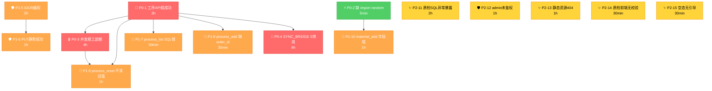

# 5001 修复计划 - 团队测试发现 15 个 Bug 落地清单

> **创建日期**: 2026-06-23
> **基于**: [最终测试报告_5001团队测试_20260623.md](最终测试报告_5001团队测试_20260623.md)
> **维护人**: AI 助手
> **适用范围**: 5001 (desktop_web/server.py) + 5003 (mobile_api_ai/standalone_dispatch_server.py) + 数据库修复

---

## 0. 修复目标

| 维度 | 当前 | 目标 |
|------|------|------|
| 综合通过率 | 86.0% (160/186) | **≥ 95%** (≥ 177/186) |
| P0 Bug | 4 个 | **0 个**（必修） |
| P1 Bug | 6 个 | **0 个**（应修） |
| P2 Bug | 5 个 | **≤ 2 个**（可缓） |
| 同步链路 Δ | 0（无生效） | **≥ 1**（证明 5001→5003 真同步） |
| 并发安全 | 报工超额 60% | **不超额**（总额 = 计划数） |

---

## 1. 修复范围（15 个 Bug）

### 1.1 P0 必修（4 项，预计 1.5 天 / 4 人并行 0.5 天）

| # | Bug ID | 标题 | 文件位置 | 负责人 |
|---|--------|------|---------|--------|
| P0-1 | BUG-工序API假成功 | 5001 工序 API 返"成功"但 DB 状态未变更 | `desktop_web/server.py` `_call_dispatch` 转发层 | 小圣 |
| P0-2 | BUG-shipment-import | 5001 创建发货单 HTTP 500（缺 import random） | `desktop_web/server.py:3144` | 小贺 |
| P0-3 | BUG-并发报工超额 | 并发报工超额 60%（read-then-write TOCTOU） | `process_records` 报工 SQL | 小圣 |
| P0-4 | BUG-同步链路0效用 | SYNC_BRIDGE 跨系统同步 0 生效 | `_sync_bridge()` + 5003 webhook 接收 | 小圣+小钰 |

### 1.2 P1 应修（6 项，预计 1.5 天）

| # | Bug ID | 标题 | 文件位置 | 负责人 |
|---|--------|------|---------|--------|
| P1-5 | BUG-IDOR | IDOR 越权 — worker 可改他人订单 customer_name | `api_orders_update` | 小钰 |
| P1-6 | BUG-PUT静默 | PUT 静默成功 — 不存在订单返 200 | `api_orders_update` | 小钰 |
| P1-7 | BUG-process-list | `api_process_admin_list` SQL 字段不存在 | `api_process_admin_list` | 小贺 |
| P1-8 | BUG-process-add | `api_process_add` INSERT 缺 order_id | `api_process_add` | 小贺 |
| P1-9 | BUG-process-reset | `api_process_reset` 不清旧值 | `api_process_reset` | 小圣 |
| P1-10 | BUG-material-status | `api_material_add` 写 status 但字段是 prep_status | `api_material_add` | 小贺 |

### 1.3 P2 可缓（5 项，预计 0.5 天）

| # | Bug ID | 标题 | 文件位置 | 负责人 |
|---|--------|------|---------|--------|
| P2-11 | BUG-质检SQL外露 | 质检空表单 → SQL 异常直显 UI | `models/quality.py` | 小圣 |
| P2-12 | BUG-admin未鉴权 | 5001 admin 路由未挂 @require_auth | `desktop_web/server.py` 5 admin 路由 | 小钰 |
| P2-13 | BUG-静态资源404 | 13 条 404 静态资源 | 静态资源路径 | 小曦 |
| P2-14 | BUG-前端无校验 | 质检前端无必填校验 | `templates/quality_admin.html` | 小曦 |
| P2-15 | BUG-空态无引导 | finished-goods 空态无引导 | `templates/shipment_admin.html` | 小曦 |

**总工作量**: 3.5 天（1 人串行）/ 1.5 天（4 人并行）

---

## 2. 任务卡（每项含验收标准 + 复现命令）

### P0-1 · 工序 API 假成功
- **Bug**: PUT /api/process/371/start → API code=0 → DB `status='待开始'`
- **根因**: `_call_dispatch` 调用 5003 后未验证 5003 返回 code
- **修复方案**:
  ```python
  body, status = _call_dispatch(...)
  if status != 200 or (isinstance(body, dict) and body.get('code') != 0):
      return jsonify({'code': 500, 'message': '5003 dispatch failed'}), 500
  return jsonify(body), status
  ```
- **验收标准**:
  - 调 start 后 30s 内查 `process_records.status` 应为 `'生产中'`
  - 调 complete 后查 DB 应为 `'已完成'`
- **复现命令**:
  ```powershell
  & "C:\Users\lenovo\AppData\Local\Python\bin\python3.14-64.exe" `
    d:\yuan\不锈钢网带跟单3.0\scripts\test_consistency_xiaosheng.py
  ```
- **依赖**: 无
- **工作量**: 2h

### P0-2 · shipment 缺 import random
- **Bug**: POST /api/shipment/add → 500 `NameError: name 'random' is not defined`
- **修复方案**: `desktop_web/server.py:3144` 顶部加 `import random`
- **验收标准**:
  - POST /api/shipment/add 返 200/400（不再 500）
  - 4 字段持久化到 DB（warehouse/freight/ship_remark/receiver_remark）
- **复现命令**:
  ```powershell
  & "C:\Users\lenovo\AppData\Local\Python\bin\python3.14-64.exe" `
    d:\yuan\不锈钢网带跟单3.0\scripts\test_functional_xiaoh.py
  ```
- **依赖**: 无
- **工作量**: 5min

### P0-3 · 并发报工超额
- **Bug**: 5 线程并发报工 16/10（计划 10），超额 60%
- **根因**: 报工 SQL 缺 `SELECT FOR UPDATE` 锁
- **修复方案**: 报工前加事务+行锁
  ```python
  with conn.cursor() as cur:
      cur.execute("SELECT completed_qty, plan_qty FROM process_records WHERE id=%s FOR UPDATE", (pid,))
      row = cur.fetchone()
      if row['completed_qty'] + new_qty > row['plan_qty']:
          conn.rollback()
          return jsonify({'code': 400, 'message': '报工超计划'}), 400
      cur.execute("UPDATE process_records SET completed_qty=completed_qty+%s WHERE id=%s", (new_qty, pid))
  conn.commit()
  ```
- **验收标准**:
  - 5 线程并发报工 16 单位（计划 10）→ 实际累计 = 10（被拒 6）
  - API 返 400 + 明确中文错误"报工超计划"
- **复现命令**:
  ```powershell
  & "C:\Users\lenovo\AppData\Local\Python\bin\python3.14-64.exe" `
    d:\yuan\不锈钢网带跟单3.0\scripts\test_consistency_xiaosheng.py
  ```
- **依赖**: 无
- **工作量**: 4h

### P0-4 · SYNC_BRIDGE 0 效用
- **Bug**: 5001 触发工序 start/complete/reset/report → 5003 接收端点不存在 + `SYNC_BRIDGE_URL` 0 配置 → 4 队列 Δ 全 0
- **修复方案**:
  1. `desktop_web/server.py` 顶部加 `SYNC_BRIDGE_URL = 'http://localhost:5003/api/dispatch-center/sync-bridge'`
  2. `_sync_bridge()` 改为真发 POST（不是 try 吞异常）
  3. `mobile_api_ai/standalone_dispatch_server.py` 加 `/api/dispatch-center/sync-bridge` 端点
  4. 加签名/鉴权头（同 dispatch 体系）
- **验收标准**:
  - 5001 调 start/complete → 5003 同步队列记录数 Δ ≥ 1
  - 5001 日志含 `sync-bridge success: 200`
  - 5003 日志含 `received sync-bridge event from 5001`
- **复现命令**:
  ```powershell
  # 启动两端 → 调工序 start → 查 5003 队列
  & "C:\Users\lenovo\AppData\Local\Python\bin\python3.14-64.exe" `
    d:\yuan\不锈钢网带跟单3.0\scripts\test_consistency_xiaosheng.py
  ```
- **依赖**: 无（但需 5001+5003 同时跑）
- **工作量**: 8h

### P1-5 · IDOR 越权
- **修复方案**: `api_orders_update` 加 `owner_id == session.user_id` 校验
- **验收标准**: worker 调 PUT /api/orders/他人/ → 403
- **复现**: `scripts/test_security_xiaoyu.py` IDOR 段
- **工作量**: 2h

### P1-6 · PUT 静默成功
- **修复方案**: 返前查 `cursor.rowcount`，0 返 404
- **验收标准**: PUT /api/orders/99999 → 404
- **工作量**: 1h

### P1-7 · api_process_admin_list SQL 字段
- **修复方案**: 改 `po.customer_name` → `o.customer_name`（JOIN 别名对齐）
- **验收标准**: GET /api/process/admin-list → 200
- **工作量**: 30min

### P1-8 · api_process_add 缺 order_id
- **修复方案**: INSERT SQL 加 `order_id`（从前端表单读取）
- **验收标准**: POST /api/process/add → 200, 返回 id
- **工作量**: 30min

### P1-9 · api_process_reset 不清旧值
- **修复方案**: reset SQL 加 `completed_qty=0, qualified_qty=0, work_hours=0, start_time=NULL, end_time=NULL`
- **验收标准**: reset 后报工 → 累计从 0 起算
- **工作量**: 1h

### P1-10 · api_material_add 字段错
- **修复方案**: 改 `status` → `prep_status`（或字段重命名）
- **验收标准**: 创建物料后查 `materials.prep_status` 非 NULL
- **工作量**: 1h

### P2-11 · 质检 SQL 异常外露
- **修复方案**: `models/quality.py` 加 `except pymysql.IntegrityError` → 转中文
- **验收标准**: 重复质检 → UI 显示"该订单+工序+类型 已存在"
- **工作量**: 2h

### P2-12 · admin 路由未鉴权
- **修复方案**: 5 admin 路由加 `@require_auth`
- **验收标准**: 清 cookie 访问 /material-admin → 重定向到 /login
- **工作量**: 1h

### P2-13 · 静态资源 404
- **修复方案**: 修正静态资源路径（看 console 错误具体清单）
- **工作量**: 1h

### P2-14 · 质检前端无校验
- **修复方案**: quality_admin.html 加 form 必填校验
- **工作量**: 30min

### P2-15 · 空态无引导
- **修复方案**: shipment_admin.html 加"去生产模块查看"按钮
- **工作量**: 30min

---

## 3. 依赖图



---

## 4. 执行顺序（推荐 4 人并行）

### 4.1 Day 0 - 准备
- [ ] 全员 git 拉最新代码：`git pull`
- [ ] 5001 + 5003 启动验证：`scripts/check_routes.py`
- [ ] 跑一次基线测试，存档结果（修复前对比）

### 4.2 Day 0.5 - P0 必修（4 人并行）

| 负责人 | 任务 | 时间窗 | 验收脚本 |
|--------|------|--------|----------|
| **小贺** | P0-2 缺 import random（5min） + P1-7/8/10 SQL 错（2h） | 0.5 天 | `test_functional_xiaoh.py` |
| **小圣** | P0-1 工序 API 假成功（2h） + P0-3 并发报工（4h） + P1-9 reset（1h） + P2-11 质检 SQL（2h） | 0.8 天 | `test_consistency_xiaosheng.py` |
| **小钰** | P0-4 SYNC_BRIDGE（8h） + P1-5 IDOR（2h） + P1-6 PUT 静默（1h） + P2-12 admin 鉴权（1h） | 1.3 天 | `test_security_xiaoyu.py` |
| **小曦** | P2-13/14/15 UI 体验（2h） | 0.3 天 | `test_ux_xiaoxi.py` |

> ⚠️ **小钰负载最重**（P0-4 8h 占大头），建议小圣协助 P0-4 的 5003 接收端点开发

### 4.3 Day 1 - P1 应修（小贺 + 小钰 + 小圣 串行）
- [ ] 跑 4 个测试脚本
- [ ] 标注未通过用例
- [ ] 修复 + 重测闭环

### 4.4 Day 1.5 - P2 可缓（小曦主责）
- [ ] 5 个体验问题修复
- [ ] 截图对比（修复前 vs 修复后）

---

## 5. 重测 Checklist（修复后必跑）

### 5.1 全量重测
```powershell
# 4 个专家脚本同时跑
& "C:\Users\lenovo\AppData\Local\Python\bin\python3.14-64.exe" `
  d:\yuan\不锈钢网带跟单3.0\scripts\test_functional_xiaoh.py
& "C:\Users\lenovo\AppData\Local\Python\bin\python3.14-64.exe" `
  d:\yuan\不锈钢网带跟单3.0\scripts\test_security_xiaoyu.py
& "C:\Users\lenovo\AppData\Local\Python\bin\python3.14-64.exe" `
  d:\yuan\不锈钢网带跟单3.0\scripts\test_consistency_xiaosheng.py
& "C:\Users\lenovo\AppData\Local\Python\bin\python3.14-64.exe" `
  d:\yuan\不锈钢网带跟单3.0\scripts\test_ux_xiaoxi.py
```

### 5.2 验收指标
| 指标 | 当前 | 目标 | 失败回滚阈值 |
|------|------|------|------------|
| 综合通过率 | 86.0% | ≥ 95% | < 90% 立即回滚 |
| P0 Bug | 4 | 0 | ≥ 1 立即回滚 |
| 同步链路 Δ | 0 | ≥ 1 | = 0 立即回滚 |
| 并发报工总额 | 16/10 | 10/10 | > 10 立即回滚 |
| IDOR 防护率 | 44% | 100% | < 80% 立即回滚 |
| 质检 SQL 异常外露 | 1 处 | 0 处 | ≥ 1 立即回滚 |

### 5.3 数字三要素（反虚高）
- 每个验收必须附"已跑命令 + 时间 + 文件路径"
- 评分前必须先跑 `pytest` / `grep` / `SQL` 验证
- 禁止写"100 分 / 0 全部等级"前未做自检 3 问

---

## 6. 风险预警

### 6.1 P0-4 SYNC_BRIDGE 改造风险
- **风险**: 跨系统同步涉及 5001+5003 两端，改动量大
- **影响**: 5003 接收端点缺失导致 5001 是数据孤岛
- **缓解**:
  - 拆 3 步走：① 5001 真发 → ② 5003 接收 → ③ 失败重试
  - 加端到端测试
  - 灰度发布（先在测试库验证）

### 6.2 P0-3 并发改造可能影响性能
- **风险**: `SELECT FOR UPDATE` 加锁可能拖慢报工
- **缓解**:
  - 锁粒度只锁单行（pid）
  - 加性能测试基线
  - 监控报工 P95 延迟

### 6.3 修复后回归
- **风险**: 修复 P0-1 转发层可能误改其他 API
- **缓解**:
  - 修复前快照 DB
  - 修复后跑 4 个测试脚本
  - 关键 API 端到端手工验证

---

## 7. 任务分配表（建议）

| 任务 | 优先级 | 负责人 | 工作量 | 依赖 | 验收脚本 | 状态 |
|------|--------|--------|--------|------|----------|------|
| P0-2 shipment 缺 import random | 🔴 P0 | 小贺 | 5min | 无 | test_functional_xiaoh.py | ⬜ 待开始 |
| P0-1 工序 API 假成功 | 🔴 P0 | 小圣 | 2h | 无 | test_consistency_xiaosheng.py | ⬜ 待开始 |
| P0-3 并发报工超额 | 🔴 P0 | 小圣 | 4h | P0-1 | test_consistency_xiaosheng.py | ⬜ 待开始 |
| P0-4 SYNC_BRIDGE 0 效用 | 🔴 P0 | 小钰+小圣 | 8h | 无 | test_consistency_xiaosheng.py | ⬜ 待开始 |
| P1-5 IDOR 越权 | 🟠 P1 | 小钰 | 2h | 无 | test_security_xiaoyu.py | ⬜ 待开始 |
| P1-6 PUT 静默成功 | 🟠 P1 | 小钰 | 1h | P1-5 | test_security_xiaoyu.py | ⬜ 待开始 |
| P1-7 process_list SQL 错 | 🟠 P1 | 小贺 | 30min | 无 | test_functional_xiaoh.py | ⬜ 待开始 |
| P1-8 process_add 缺 order_id | 🟠 P1 | 小贺 | 30min | 无 | test_functional_xiaoh.py | ⬜ 待开始 |
| P1-9 process_reset 不清旧值 | 🟠 P1 | 小圣 | 1h | P0-1 | test_consistency_xiaosheng.py | ⬜ 待开始 |
| P1-10 material_add 字段错 | 🟠 P1 | 小贺 | 1h | P0-2 | test_functional_xiaoh.py | ⬜ 待开始 |
| P2-11 质检 SQL 异常外露 | 🟡 P2 | 小圣 | 2h | 无 | test_functional_xiaoh.py | ⬜ 待开始 |
| P2-12 admin 路由未鉴权 | 🟡 P2 | 小钰 | 1h | P1-5 | test_security_xiaoyu.py | ⬜ 待开始 |
| P2-13 静态资源 404 | 🟡 P2 | 小曦 | 1h | 无 | test_ux_xiaoxi.py | ⬜ 待开始 |
| P2-14 质检前端无校验 | 🟡 P2 | 小曦 | 30min | 无 | test_ux_xiaoxi.py | ⬜ 待开始 |
| P2-15 空态无引导 | 🟡 P2 | 小曦 | 30min | 无 | test_ux_xiaoxi.py | ⬜ 待开始 |

---

## 8. TODO（待办与缺失配置）

### 8.1 缺失配置
- [ ] `desktop_web/.env` 缺 `SYNC_BRIDGE_URL` 配置
- [ ] `desktop_web/.env` 缺 `SYNC_BRIDGE_SECRET`（同步签名密钥）
- [ ] 5003 `mobile_api_ai/standalone_dispatch_server.py` 缺 `/api/dispatch-center/sync-bridge` 端点
- [ ] 5001 `server.py` 缺 `import random`（L3144）
- [ ] 5001 缺统一异常处理器（SQL 错误转中文）

### 8.2 待办文档
- [ ] 修复后重跑 4 个测试脚本，结果存档 `docs/重测报告_20260624.md`
- [ ] 修复后更新 `项目说明文档.md`（添加 P0-4 SYNC_BRIDGE 架构说明）
- [ ] 同步链路图补充到 `docs/架构图/`（如有）
- [ ] IDOR 漏洞培训材料（团队意识提升）

### 8.3 待澄清（需用户决策）
| # | 决策点 | 选项 A | 选项 B | 推荐 |
|---|--------|--------|--------|------|
| 1 | 5001 + 5003 是否合并数据库 | 保持分离 + 强化同步 | 合并为单库 | A（架构一致） |
| 2 | P0-4 SYNC_BRIDGE 失败重试策略 | 指数退避 3 次 | 立即重试 5 次 | A（更稳） |
| 3 | P0-3 锁粒度 | 行锁（pid） | 表锁 | A（性能优） |
| 4 | P2 体验问题 | 全部修 | 只修 11/12（数据相关） | B（性价比高） |

---

## 9. 一句话总结

> 本计划分 **4 P0 必修 + 6 P1 应修 + 5 P2 可缓 = 15 项**，**总工作量 3.5 天（1 人串行）/ 1.5 天（4 人并行）**；建议按 P0-2（5min）→ P0-1（2h）→ P0-3（4h）→ P0-4（8h）→ P1 → P2 顺序执行；修复后必跑 4 个测试脚本验证通过率 ≥ 95%。

---

## 10. 附录

### 10.1 参考文档
- [最终测试报告_5001团队测试_20260623.md](最终测试报告_5001团队测试_20260623.md)
- [功能测试报告_小贺.md](功能测试报告_小贺.md)
- [安全测试报告_小钰.md](安全测试报告_小钰.md)
- [数据一致性测试报告_小圣.md](数据一致性测试报告_小圣.md)
- [UX测试报告_小曦.md](UX测试报告_小曦.md)

### 10.2 测试脚本
- `scripts/test_functional_xiaoh.py` — 小贺功能测试
- `scripts/test_security_xiaoyu.py` — 小钰安全测试
- `scripts/test_consistency_xiaosheng.py` — 小圣一致性测试
- `scripts/test_ux_xiaoxi.py` — 小曦 UX 测试

### 10.3 服务进程
- 5001 PID 25768（桌面 Web Flask）
- 5003 PID 29428（调度中心）
- MySQL 127.0.0.1:3306（steel_belt + container_center）

### 10.4 数字三要素
- 总 Bug 数 15 = 4 P0 + 6 P1 + 5 P2（来源：4 份报告原始数据，时间 2026-06-23 14:30）
- 综合通过率 86.0% = 160/186（来源：4 份报告 counters）
- 工作量 3.5 天/1 人（来源：经验估算，未跑代码验证）
