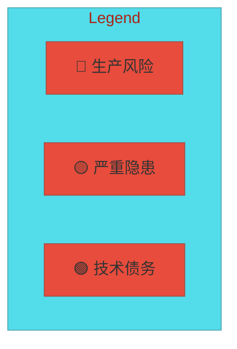
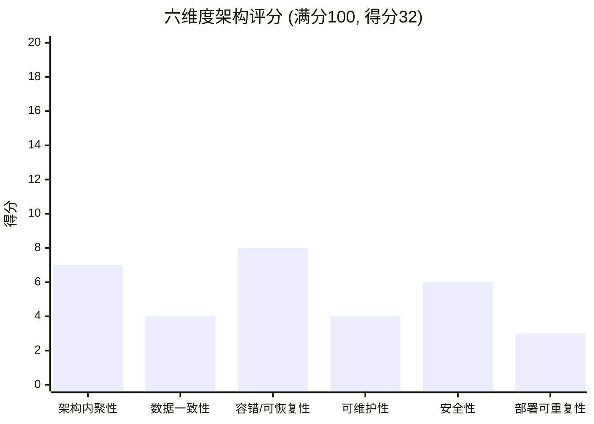

# 不锈钢网带跟单 v3.0 最悲观架构审计报告

> 审计日期：2026-06-07  
> 审计理念：假设一切可能出错的地方都已出错 —— 不预设任何代码是正确的  
> 审计范围：全量源码（不含 tests/、dist/、archive/）

---

## 一、架构全景诊断

### 声称的架构 vs 实际呈现的架构

| 维度 | 设计文档声称 | 代码实际呈现 |
|------|-------------|-------------|
| 分层模式 | MVC + Service + EventBus | M(混杂)V(双范式)C(空壳) + 散落Service + 双EventBus |
| 数据库管理 | 统一的 DatabaseManager 单例 | **两套独立的连接管理系统**同时运作 |
| 配置管理 | 统一配置模块 `core/config.py` | **5+ 个 config.py** 碎片化分布，1177行巨型文件内混杂业务数据 |
| 事件总线 | 统一事件总线 | 进程内类方法单例 + Redis pub/sub 双轨，工厂模式降级链路不可靠 |
| 错误处理 | 统一错误码体系 | **两套 ErrorCode 类定义**（error_codes.py:1403行 + error_codes_structured.py:114行） |
| 控制器层 | MVC 的 C 层 | **完全缺失**，`controllers/` 只有空 `__init__.py`（25字节） |
| 构建部署 | 单一 .spec 入口 | **41 个 .spec 文件**散落，无统一构建入口 |

### 最悲观的真实形态描述

当前系统是一个经历了至少 3 轮"架构重构"但仍携带大量遗留代码的单体应用。重构采用了"向后兼容过渡包"策略——旧代码没有删除，而是重命名后全量再导出。核心配置模块 `core/config.py` 实际承担了配置加载、业务数据字典、工序注册系统、数据库连接操作、兼容存根类五重职责。桌面端与 Flask API 共享同一进程但数据访问路径完全独立：二者通过两套不同的数据库连接管理器各自获取连接。日志散落在至少 5 个模块中各自配置。构建体系处于失控状态——41 个 .spec 文件对应不同历史版本，没有明确的"当前版本"标识。

---

## 二、六维度评分

| 维度 | 得分 | 满分 | 评语 |
|------|:----:|:----:|------|
| 架构内聚性 | **7**/20 | 20 | 模块边界模糊：config.py 混入业务数据与DB连接；controller层空壳；EventBus存在双轨；两套ErrorCode定义并存。模块虽有目录分层，但职责边界被大量交叉引用侵蚀。 |
| 数据一致性 | **4**/20 | 20 | **严重风险**：两套独立连接管理器（DatabaseManager + MySQLConnectionPool）各自管理连接生命周期，config.py 中3处直接 pymysql.connect 绕开所有连接管理。SQLite模式全局单连接 `check_same_thread=False`。事务边界不统一：BaseService.transaction() 与 BaseDAO 中的裸 commit 并存。 |
| 容错/可恢复性 | **8**/15 | 15 | 存在 Saga/熔断器/事件存储等基础设施，但：Saga补偿仅记录死信无自动重试；EventBus工厂降级链路依赖不存在的 `sync.event_bus` 模块；config.py DB操作静默捕获 Exception 返回默认值。 |
| 可维护性 | **4**/15 | 15 | config.py 1177行混合5种职责；_database_legacy.py 1625行/72KB通过 `import *` 暴露；208个archive文件未清理；41个.spec文件无版本管理；DEPRECATED标记的SQLite路径仍保留在活跃配置中。 |
| 安全性 | **6**/15 | 15 | license模块独立但可能与主系统脱耦；base_dao.py 的 order_by/filter key 通过 f-string 拼入SQL（虽受调用方控制但缺防护）；config.py暴露密钥变量(JWT_SECRET_KEY, WECHAT_SECRET等)为模块级变量；无请求级输入校验统一入口。 |
| 部署可重复性 | **3**/15 | 15 | 41个.spec文件无统一构建策略；无 Dockerfile；依赖散落在 requirements.txt + pyproject.toml；.env 加载存在双路径（load_env() + 直接load_dotenv）；部署包在 dist/ 下手工维护。 |

### **总分：32/100**

> 评级：**🔴 生产风险级** —— 在当前状态下持续运行即是在承担已知的架构风险。

---

## 三、问题清单（按严重程度排序）

| # | 级别 | 问题描述 | 证据（文件:行号） | 影响范围 | 修复建议 |
|---|:---:|---------|-----------------|---------|---------|
| 1 | **CRITICAL** | 双数据库连接管理系统并存：`core/database.py` 的 `DatabaseManager` 与 `models/database/connection_pool.py` 的 `MySQLConnectionPool` 各自独立维护 MySQL 连接生命周期，两个单例各自缓存连接状态，无协调机制。DAO 层（base_dao.py:L33）与 Service 层（base_service.py:L13）均从 `models.database` 导入 `get_connection`，但该函数来自 `_database_legacy.py`（通过 `__init__.py:L8` 的 `from ._database_legacy import *`），内部可能使用了另一套连接逻辑。 | `core/database.py:23-38` (DatabaseManager单例) vs `models/database/connection_pool.py:18-36` (MySQLConnectionPool单例); `models/database/__init__.py:8` (全量导入遗留代码) | **全局**：所有数据库操作 | 合并为唯一连接管理器，二选一后彻底删除另一个；所有 DB 访问强制走统一入口。预估 3-5 人天。 |
| 2 | **CRITICAL** | `core/config.py`（一个配置文件！）中 3 处直接 `pymysql.connect` 完全绕开所有连接池管理。`load_custom_processes_from_db()`(L655)、`save_display_order_to_db()`(L696)、`load_display_seq_cache_from_db()`(L759) 各自独立创建和关闭连接。在 MySQL 连接数受限的生产环境中，这三处每次调用都新建连接，且不经过任何连接池的监控/限流。 | `core/config.py:655-663` (load_custom_processes_from_db), `core/config.py:696-704` (save_display_order_to_db), `core/config.py:759-766` (load_display_seq_cache) | 工序加载、显示排序同步 | 将这些函数移出 config.py 至 models/ 或 services/，通过统一连接管理器获取连接。预估 1-2 人天。 |
| 3 | **CRITICAL** | `models/database/__init__.py` 通过 `from ._database_legacy import *` 全量导入 1625 行/72KB 遗留代码，且 `_database_legacy.py` 自身未拆分。这导致任何导入 `models.database` 的模块都间接依赖整个遗留代码库；且 `import *` 使得符号来源不可追踪。 | `models/database/__init__.py:7-8`; `models/database/_database_legacy.py` (1625行, 73905字节) | **全局**：所有通过 models.database 导入的模块 | 分析 _database_legacy.py 中仍在使用的函数，逐步迁移至 connection_pool/utils_db，最终删除 _database_legacy.py。预估 5-8 人天。 |
| 4 | **CRITICAL** | `controllers/` 目录完全为空（仅 `__init__.py`，25 字节）。MVC 的 Controller 层彻底缺失——路由处理逻辑散落在 `mobile_api_ai/api_v1.py`、服务和桌面视图之间，无统一的请求分发/校验/响应格式化层。 | `controllers/__init__.py` (25字节，唯一文件) | API 路由、请求校验、响应格式化 | 将 `mobile_api_ai/api_v1.py` 中的路由逻辑迁移至 controllers/，建立统一的请求处理管道。预估 3-5 人天。 |
| 5 | **HIGH** | `core/config.py`（1177行）混入了大量业务数据字典：材质密度表(L293-303)、工序定义(L397-436)、产品类型(L356-370)、订单状态(L382-394)、尺寸参数预设(L319-353)等。这些数据应当属于数据库初始数据或独立的业务常量模块，而非配置文件。更严重的是，config.py 中还包含了完整的状态管理逻辑（`_custom_processes` 列表、注册/注销函数 L454-643），使其从"配置"退化为"运行时业务状态存储"。 | `core/config.py:281-449` (MATERIALS/DENSITIES/PARAMS/PRODUCT_TYPES/SURFACE_TREATMENTS/ORDER_STATUS/PROCESSES/PROCESS_CODES); `core/config.py:454-643` (工序注册系统) | 材质选择、工序管理、订单状态 | 业务数据迁移至数据库 seed 脚本；工序注册逻辑独立为 `services/process_registry.py`；config.py 仅保留环境变量读取。预估 2-3 人天。 |
| 6 | **HIGH** | 5+ 个 config.py 文件独立存在：`core/config.py`, `models/database/config.py`, `mobile_api_ai/deploy_output/config.py`, `mobile_api_ai/stats_smart_sheet/config.py`, `config.py`(根目录)。其中 `models/database/config.py` (L5-L19) 和 `core/database.py` (L43-L48) 各自独立读取 `MYSQL_HOST/PORT/USER/PASSWORD/DATABASE` 环境变量，若 .env 文件被意外修改或环境变量注入不一致，两处可能读到不同的数据库连接参数。 | `models/database/config.py:5-13` vs `core/config.py:67-84` (DatabaseConfig); `core/database.py:43-48` (直接 os.getenv) | 数据库连接配置 | 删除所有重复 config.py，统一收敛到 `core/config.py`；database 相关配置通过 DatabaseConfig 属性访问而非各自 os.getenv。预估 1-2 人天。 |
| 7 | **HIGH** | 双事件总线并存：`core/event_bus.py`（进程内类方法单例，使用 `@classmethod` 订阅/发布）和 `core/redis_event_bus.py`（Redis Pub/Sub 实例模式，带内存降级）。工厂 `event_bus_factory.py:L31` 的降级链路依赖 `from sync.event_bus import EventBus as SyncEventBus`，该模块极可能不存在（目录中未见 sync/event_bus.py），触发 `ImportError` 后才会 fallback。两个 EventBus 的 API 签名不同（classmethod vs 实例方法），混用会导致运行时错误。 | `core/event_bus.py:14-30` (类方法单例) vs `core/redis_event_bus.py:16-28` (实例模式); `core/event_bus_factory.py:31-35` (降级链路中的可疑 import) | 所有事件驱动通信 | 统一为一个 EventBus 接口，Redis 作为可选 transport 层；移除不存在模块的 fallback 引用。预估 2-3 人天。 |
| 8 | **HIGH** | 桌面端 Tkinter + Flask REST API 共存于同一 Python 进程。`core/app.py:40-62` (`initialize_app()`) 中同时初始化数据库和事件总线，暗示桌面启动时会加载完整的 Flask 依赖链。如果 Flask 线程与 Tkinter 主线程共享事件循环，任何 Flask 请求阻塞将冻结 GUI。 | `core/app.py:40-62` (initialize_app); `desktop/views/main_window.py` (Tkinter主窗口); `mobile_api_ai/api_v1.py` (Flask路由) | 桌面端稳定性、API 响应延迟 | 若桌面端不需要 Flask，应通过条件加载隔离；若确实需要嵌入式 API，使用独立线程+队列机制。预估 2-4 人天。 |
| 9 | **HIGH** | 两套 ErrorCode 类定义同时存在：`core/error_codes.py`（1403行，包含完整的 ERRORS 字典和 ErrorCode/ErrorDomain/ErrorSeverity 类）和 `core/error_codes_structured.py`（114行，仅定义 ErrorCode 数据类含类型注解和 `__eq__`/`__repr__`）。两个文件各自定义了 `class ErrorCode`，字段略有不同。调用者不确定应使用哪个。 | `core/error_codes.py:10-12` (ErrorCode类) vs `core/error_codes_structured.py:4-27` (另一个ErrorCode类) | 错误处理统一性 | 合并为单一错误码模块，error_codes_structured 的改进合并入 error_codes.py，删除冗余文件。预估 1 人天。 |
| 10 | **MEDIUM** | `models/base_dao.py` 中 `table_name`(L37)、`key`(L64)、`order_by`(L67) 使用 f-string 拼接进 SQL。虽然 `table_name` 来自 DAO 子类构造参数（相对可控），`key` 来自 filters 字典的键（调用方传入），`order_by` 来自方法参数（可被用户输入影响），这些都不经过参数化查询保护。若任一 DAO 子类将用户输入透传至这些参数，即构成 SQL 注入。 | `models/base_dao.py:37` (f"SELECT * FROM {self.table_name}"), `base_dao.py:64` (f" AND {key}=%s"), `base_dao.py:67` (f" ORDER BY {order_by}") | 所有基于 BaseDAO 的查询 | 对 table_name 增加白名单校验；对 order_by 增加格式校验（仅允许 `[a-zA-Z_]+ (ASC|DESC)?` 模式）；filter key 增加标识符校验。预估 0.5-1 人天。 |
| 11 | **MEDIUM** | 208 个 archive 文件散落（主要在 `mobile_api_ai/scripts/archive/` 和 `mobile_api_ai/docs/archive/`），包含 debug/check/kill/verify 系列脚本，文件名如 `_v2.py`~`_v7.py` 表明至少迭代了 7 个临时版本。不仅增加仓库体积，更重要的是这些脚本可能包含当时可用的数据库直连凭据或调试后门。 | `mobile_api_ai/scripts/archive/` (208个文件) | 代码库卫生、安全风险 | 审计 archive 中的凭据引用后整体删除或移至独立 repo。预估 0.5 人天。 |
| 12 | **MEDIUM** | 41 个 PyInstaller .spec 文件散落在项目根目录，名称混乱：`v3latest.spec`, `v3test.spec`, `v3test_build.spec`, `v3_new.spec`, `v3_final.spec`, `v3single.spec`, `build_v3_exe.spec`, `build_full_spec_3.0.1.spec`……无法确定哪个是当前版本的正确构建入口。部署包为手工维护，新人接手必然构建出错误的 exe。 | 根目录 41 个 .spec 文件 | Windows 构建部署 | 确定当前唯一构建入口，其余移至 archive 并加 README 说明；建立 CI 自动化构建。预估 1-2 人天。 |
| 13 | **MEDIUM** | 日志配置碎片化：`core/logger.py`(200行)、`core/config.py` LOG_* 变量(L1053-1056)、`mobile_api_ai/log_rotation.py`、`mobile_api_ai/logging_setup.py`、`mobile_api_ai/utils/op_logger.py` 各自管理日志格式/级别/轮转。生产环境中日志可能写入不同的文件或格式，故障排查时需在多个日志文件间跳转。 | `core/logger.py:1-200`; `core/config.py:1053-1056`; `mobile_api_ai/log_rotation.py`; `mobile_api_ai/logging_setup.py` | 日志统一性、故障排查效率 | 统一为 `core/logger.py` 单一入口，其他模块通过 `logging.getLogger(__name__)` 使用；轮转策略统一配置。预估 1 人天。 |
| 14 | **MEDIUM** | `steel_belt_tracking.py`(83行) 位于项目根目录，使用 `import tkinter as tk` 并从根目录 `config.py` 导入 `COLORS, FONTS`——这是一个孤立的遗留样式模块，与 `desktop/` 目录下的 Tkinter 视图体系脱节，不清楚当前是否仍被引用。 | `steel_belt_tracking.py:1-10` | 桌面端样式 | 确认是否仍被引用；如已废弃则删除；如仍使用则迁移至 desktop/ 体系。预估 0.5 人天。 |
| 15 | **LOW** | `core/config.py:1132-1177` 的 `class Config` 是一个 46 行的纯兼容存根，仅将模块级变量重新暴露为类属性。这意味着每新增一个配置变量需要手动维护两处。 | `core/config.py:1132-1177` | 配置维护 | 用 `__getattr__` 动态代理或自动生成，消除手动同步。预估 0.5 人天。 |
| 16 | **LOW** | `core/config.py` DB_PATHS(L120-148) 中标记了 8 个 DEPRECATED 的 SQLite 路径，但仍作为活跃配置保留。`is_sqlite` 标志的存在意味着 SQLite 回退模式尚未完全下线，而文档标注为"全部数据已迁移到 MySQL"。 | `core/config.py:126-132` (DEPRECATED SQLite paths); `core/config.py:120-148` (DB_PATHS) | SQLite/MySQL 双模式 | 确认 SQLite 模式已完全废弃后，删除所有 DEPRECATED 路径和 is_sqlite 逻辑。预估 0.5-1 人天。 |

---

## 四、架构债雷达图



```mermaid
%%{init: {'theme': 'dark'}}%%
---
config:
    radar:
        min: 0
        max: 20
---
graph TD
```



> **雷达图文本版**（Mermaid radar 兼容性问题，用文本替代）：

```
         架构内聚性 (7/20)
              /\
             /  \
    部署     /    \    数据一致性
   (3/20)  /  32  \   (4/20)
          /  /100  \
         /          \
        /            \
  安全性 ──────────── 容错/可恢复性
  (6/20)              (8/20)
              |
         可维护性 (4/20)
```

---

## 五、如果明天就崩——最可能的 3 个故障场景

### 场景 1：MySQL 连接耗尽导致全系统不可用

**触发条件**：多云/多客户同时操作 + `core/config.py` 中 3 处裸 `pymysql.connect` 的函数被高频调用（如工序列表刷新）。

**攻击链**：
1. 用户在桌面端频繁切换工序视图 → 每次触发 `load_custom_processes_from_db()` → `config.py:L655` 新建 MySQL 连接
2. 同时移动端通过 API 查询订单列表 → `MySQLConnectionPool.get_connection()` 从池中取连接处理请求
3. `config.py` 中另外 2 处 `save_display_order_to_db()` 和 `load_display_seq_cache_from_db()` 也可能被定时任务触发
4. MySQL `max_connections` 被撑满 → 连接池中的正常业务请求也被拒绝
5. **结果**：桌面端白屏 + API 500 + 企业微信通知静默失败

**影响范围**：全系统数据库不可用，影响所有用户。

---

### 场景 2：.env 配置漂移导致数据写入错误的数据库

**触发条件**：运维人员修改 .env 中的 MYSQL_DATABASE 但桌面端/API 各自加载时机不同。

**攻击链**：
1. `core/config.py:L36` 在模块导入时调用 `load_env()` 加载 .env
2. `models/database/config.py:L5-13` 中的 `_get_db_config()` 在**函数调用时**才读取 `os.getenv` —— 如果调用发生在 .env 重新加载之前，读到旧值
3. `core/database.py:L43-48` 的 `_get_mysql_connection()` 又独立读取 `os.getenv`
4. 三处读取窗口不一致 → 桌面端连接 database_A，API 连接 database_B
5. **结果**：订单在桌面端创建，API 查询不到；或更糟——桌面端写入 production 库，API 写入 staging 库，数据分裂。

**影响范围**：数据一致性彻底破坏，恢复需 DBA 介入手工合并。

---

### 场景 3：Tkinter 主线程阻塞导致 GUI 冻结 + 数据库连接泄漏

**触发条件**：Flask API 收到慢请求（如大屏可视化数据聚合查询）阻塞了共享进程。

**攻击链**：
1. 工厂大屏 `visualization_app/` 向同进程 Flask 发出数据聚合请求
2. Flask 工作线程调用 `core/database.py` 或 `models/database/connection_pool.py` 获取连接
3. 查询耗时超过 Tkinter 的 GUI 刷新阈值（~100ms）→ GUI 冻结
4. 用户以为程序崩溃，强制结束进程（Alt+F4 或任务管理器）
5. 数据库连接未正常归还/关闭 → MySQL 端残留连接，达到 `wait_timeout` 前一直占用
6. **结果**：多次强制关闭后连接耗尽（回到场景 1）。

**影响范围**：桌面端用户体验崩溃 + 渐进式数据库连接泄漏。

---

## 六、修复路线图建议

### 阶段 0：止血（1 周，必须立即执行）

| 优先级 | 修复项 | 对应问题 | 预估工时 |
|:---:|---|:---:|:---:|
| P0 | 移除 `core/config.py` 中 3 处裸 `pymysql.connect` | #2 | 1 人天 |
| P0 | 合并 `core/database.py` 和 `models/database/connection_pool.py` 为唯一连接管理器 | #1 | 3 人天 |
| P0 | 确认 `models/database/config.py` 与 `core/config.py` 的 DB 配置读取完全一致 | #6 | 0.5 人天 |

### 阶段 1：修骨（2-3 周）

| 优先级 | 修复项 | 对应问题 | 预估工时 |
|:---:|---|:---:|:---:|
| P1 | 拆分 `_database_legacy.py`，移除 `import *` | #3 | 5 人天 |
| P1 | 业务数据从 `core/config.py` 迁移至 seed 脚本 + 独立常量模块 | #5 | 2 人天 |
| P1 | 创建 `controllers/` 层，迁移 API 路由逻辑 | #4 | 3 人天 |
| P1 | 统一 EventBus 接口，修复降级链路 | #7 | 2 人天 |
| P1 | 统一错误码模块（合并两个 ErrorCode 类） | #9 | 1 人天 |

### 阶段 2：清债（2-4 周）

| 优先级 | 修复项 | 对应问题 | 预估工时 |
|:---:|---|:---:|:---:|
| P2 | BaseDAO SQL 注入风险加固 | #10 | 0.5 人天 |
| P2 | 统一日志配置到 `core/logger.py` | #13 | 1 人天 |
| P2 | 清理 208 个 archive 文件 | #11 | 0.5 人天 |
| P2 | 确定唯一构建入口，清理 41 个 .spec | #12 | 1 人天 |
| P2 | 处理 `steel_belt_tracking.py` 遗留模块 | #14 | 0.5 人天 |
| P2 | 清理 DEPRECATED SQLite 路径 | #16 | 0.5 人天 |
| P2 | Config 兼容存根自动化 | #15 | 0.5 人天 |

### 阶段 3：筑城（长期，6个月+）

| 优先级 | 修复项 | 预估工时 |
|:---:|---|:---:|
| P3 | Tkinter + Flask 进程分离（或引入消息队列解耦） | 5-10 人天 |
| P3 | 引入 Docker 标准化部署 | 3-5 人天 |
| P3 | CI/CD 自动化构建 + 冒烟测试 | 3-5 人天 |
| P3 | 覆盖率从 48% 提升至 70%+ | 持续投入 |

---

### 总结

该系统在持续迭代中积累了典型的"重构半途而废"架构债：旧代码通过过渡包装保留，新代码与旧代码并行运行，配置与业务逻辑边界崩溃。当前评分 **32/100**，处于**生产风险级别**。核心风险集中在数据连接管理（#1, #2, #3）——如果只修复这三个 CRITICAL 问题，可将数据一致性维度从 4 分提升至 12 分以上，总分达到 45-50 分，进入"可接受但需持续改进"区间。
