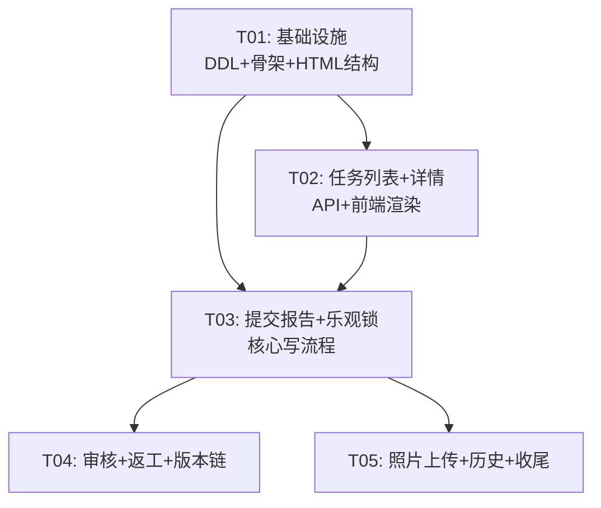

# 手机端质检报工系统 — 系统设计文档

> **项目**：不锈钢网带跟单3.0 / 手机端质检报工
> **技术栈**：Flask + Jinja2 模板 + 原生 JS（单文件 SPA）
> **端口**：5008
> **日期**：2026-04-29

---

## 1. 文件变更清单

| # | 路径 | 操作 | 说明 |
|---|------|------|------|
| 1 | `mobile_api_ai/api/quality_inspection.py` | **重写** | 完整 API 蓝图：任务列表、详情、判定、提交、审核、返工、历史、上传 |
| 2 | `mobile_api_ai/templates/cs_report.html` | **修改** | 新增质检报工页面、详情弹窗、审核页面、CSS/JS |
| 3 | `models/quality.py` (QualityDAO) | **修改** | 新增 `create_full_v2`、`submit_review`、`get_version_chain`、`get_by_id` 增强 |
| 4 | `mobile_api_ai/app.py` | **不改** | 已有 `quality_inspection` 蓝图注册（第82-83行），无需改动 |
| 5 | `mobile_api_ai/api/quality.py` | **不改** | 保留旧版 mock API 供桌面端兼容 |

---

## 2. API 端点清单

### 2.1 质检任务（前缀 `/api/quality-inspection`）

| 方法 | URL | 功能 | 说明 |
|------|-----|------|------|
| GET | `/tasks` | 任务列表 | 查 `data_packages` 表 `data_type=quality_inspection` |
| GET | `/tasks/<pkg_id>` | 任务详情 | 含检查项、规则匹配、流程时间线、版本链 |
| POST | `/evaluate` | 逐项判定 | `{measured_value, standard_value, tolerance}` → `{is_passed}` |
| POST | `/submit` | 提交报告 | 乐观锁+写DB+更新 data_packages+推调度中心 |
| GET | `/history` | 历史记录 | 支持 `?order_no=` 过滤 |
| GET | `/types` | 类型选项 | 检验类型/结果/处理方式枚举 |
| POST | `/review` | 审核操作 | `{record_id, action: approve/reject, comment}` |
| GET | `/review/pending` | 待审核列表 | `review_status='pending'` |
| POST | `/rework` | 创建返工任务 | 生成 parent_record_id 链的新 data_package |
| GET | `/versions/<record_id>` | 版本链 | 返回从当前记录到原始记录的全链 |
| POST | `/upload` | 照片上传 | multipart 上传，返回文件路径 |
| GET | `/photos/<path>` | 照片下载 | 静态文件服务 |

### 2.2 调度中心联动

| 方法 | URL | 功能 | 说明 |
|------|-----|------|------|
| POST | (调用 `dispatch_center.on_quality_record_completed`) | 流程推进 | 提交报告后异步调用，仅 result=合格 时推进 |

---

## 3. 数据模型

### 3.1 DDL 扩展脚本

```sql
-- quality_records 扩展字段
ALTER TABLE quality_records ADD COLUMN IF NOT EXISTS parent_record_id INT DEFAULT NULL COMMENT '父记录ID（返工链）';
ALTER TABLE quality_records ADD COLUMN IF NOT EXISTS rework_version INT DEFAULT 1 COMMENT '返工版本号';
ALTER TABLE quality_records ADD COLUMN IF NOT EXISTS review_status VARCHAR(20) DEFAULT 'pending' COMMENT '审核状态：pending/approved/rejected';
ALTER TABLE quality_records ADD COLUMN IF NOT EXISTS reviewed_by VARCHAR(50) DEFAULT '' COMMENT '审核人';
ALTER TABLE quality_records ADD COLUMN IF NOT EXISTS reviewed_at DATETIME DEFAULT NULL COMMENT '审核时间';
ALTER TABLE quality_records ADD COLUMN IF NOT EXISTS review_comment VARCHAR(500) DEFAULT '' COMMENT '审核意见';
ALTER TABLE quality_records ADD COLUMN IF NOT EXISTS attachment_paths TEXT COMMENT '附件路径JSON数组';
ALTER TABLE quality_records ADD COLUMN IF NOT EXISTS version INT DEFAULT 1 COMMENT '乐观锁版本号';
ALTER TABLE quality_records ADD COLUMN IF NOT EXISTS task_id VARCHAR(50) DEFAULT '' COMMENT '关联data_packages.id';
ALTER TABLE quality_records ADD COLUMN IF NOT EXISTS updated_at DATETIME DEFAULT CURRENT_TIMESTAMP ON UPDATE CURRENT_TIMESTAMP;

-- 索引
ALTER TABLE quality_records ADD INDEX IF NOT EXISTS idx_review_status (review_status);
ALTER TABLE quality_records ADD INDEX IF NOT EXISTS idx_parent_record (parent_record_id);
ALTER TABLE quality_records ADD INDEX IF NOT EXISTS idx_task_id (task_id);
```

### 3.2 数据流向

```
data_packages (container_center)
  ├─ quality_inspection 任务（调度中心下发）
  │
  ▼ (手机端质检)
quality_records (steel_belt)
  ├─ 主记录 (rework_version=1, parent_record_id=NULL)
  ├─ 返工记录 (rework_version=N, parent_record_id=上一版本)
  └─ 审核记录 (review_status=approved/rejected)
  │
  ▼ (明细)
quality_record_items
  └─ 逐项检查结果
```

---

## 4. 路由注册（已在 app.py 中）

```python
# app.py 第82-83行 — 已存在，无需改动
from mobile_api_ai.api.quality_inspection import bp as qi_bp
app.register_blueprint(qi_bp)
# qi_bp url_prefix = '/api/quality-inspection'
```

---

## 5. 前端实现计划（cs_report.html）

### 5.1 新增 HTML 区块

```html
<!-- 质检报工任务列表页 -->
<div id="quality-inspection-page" class="page">
  <div class="card">
    <div class="page-header">
      <div class="page-title">🔍 质检报工</div>
      <button class="header-btn" onclick="showQualityInspection()">🔄 刷新</button>
    </div>
    <div id="qi-task-list"><div class="loading">加载中...</div></div>
  </div>
</div>

<!-- 质检详情弹窗（Modal） -->
<div id="qi-detail-modal" class="modal-overlay">
  <div class="modal-card">
    <div class="modal-header">
      <span class="modal-title">质检详情</span>
      <span class="modal-close" onclick="closeQiDetail()">✕</span>
    </div>
    <div id="qi-detail-body"></div>
    <div id="qi-detail-footer"></div>
  </div>
</div>

<!-- 审核页 -->
<div id="qi-review-page" class="page">
  <div class="card">
    <div class="page-header">
      <div class="page-title">📝 质检审核</div>
      <button class="header-btn" onclick="showQiReview()">🔄 刷新</button>
    </div>
    <div id="qi-review-list"><div class="loading">加载中...</div></div>
  </div>
</div>
```

### 5.2 新增 JS 函数清单

| 函数名 | 触发方式 | 说明 |
|--------|----------|------|
| `showQualityInspection()` | 导航/分流入口 | 加载质检任务列表 `GET /api/tasks?page_route=quality_inspection` |
| `showQiDetail(pkgId)` | 点击任务卡片 | 弹窗加载任务详情 `GET /api/quality-inspection/tasks/<id>` |
| `closeQiDetail()` | 关闭按钮 | 关闭详情弹窗 |
| `renderQiDetail(data)` | showQiDetail 内部 | 渲染流程时间线+检查项表单+判定按钮 |
| `evaluateItem(itemName)` | 输入实测值后 | `POST /api/quality-inspection/evaluate` 实时判定 |
| `submitQiReport()` | 点击提交按钮 | 收集表单 → `POST /api/quality-inspection/submit` |
| `handleQiPhotoUpload(input)` | 选择照片 | `POST /api/quality-inspection/upload` FormData |
| `showQiReview()` | 导航栏 | 加载待审核列表 `GET /api/quality-inspection/review/pending` |
| `approveRecord(recordId)` | 审核页点击 | `POST /api/quality-inspection/review {action:'approve'}` |
| `rejectRecord(recordId)` | 审核页点击 | `POST /api/quality-inspection/review {action:'reject'}` |
| `requestRework(recordId)` | 审核拒绝后 | `POST /api/quality-inspection/rework` 创建返工任务 |
| `showQiHistory(orderNo)` | 历史入口 | `GET /api/quality-inspection/history?order_no=` |
| `showVersionChain(recordId)` | 详情页版本标签 | `GET /api/quality-inspection/versions/<id>` |

### 5.3 新增 CSS（插入 `<style>` 标签底部）

```css
/* 弹窗 */
.modal-overlay{position:fixed;top:0;left:0;width:100%;height:100%;background:rgba(0,0,0,0.6);z-index:200;display:none;justify-content:center;align-items:flex-start;padding-top:20px;overflow-y:auto;}
.modal-overlay.active{display:flex;}
.modal-card{background:white;color:#333;border-radius:16px;width:92%;max-width:500px;max-height:85vh;overflow-y:auto;margin-bottom:20px;}
.modal-header{display:flex;justify-content:space-between;align-items:center;padding:16px 20px;border-bottom:1px solid #eee;position:sticky;top:0;background:white;z-index:1;border-radius:16px 16px 0 0;}
.modal-title{font-size:17px;font-weight:bold;color:#2c3e50;}
.modal-close{font-size:22px;cursor:pointer;color:#999;padding:4px 8px;}

/* 检查项表单 */
.qi-item-row{display:flex;align-items:center;gap:8px;padding:10px 12px;background:#f8f9fa;border-radius:8px;margin:6px 0;font-size:13px;}
.qi-item-row input{width:80px;padding:8px;border:1px solid #ddd;border-radius:6px;font-size:13px;}
.qi-item-label{flex:1;font-weight:bold;color:#2c3e50;}
.qi-item-std{color:#888;font-size:12px;white-space:nowrap;}
.qi-item-result{width:50px;text-align:center;font-size:18px;}

/* 判定结果 */
.qi-pass{color:#27ae60;font-weight:bold;}
.qi-fail{color:#e74c3c;font-weight:bold;}
.qi-pending{color:#f39c12;}

/* 照片 */
.qi-photo-preview{display:flex;flex-wrap:wrap;gap:8px;margin:8px 0;}
.qi-photo-preview img{width:70px;height:70px;object-fit:cover;border-radius:6px;border:1px solid #ddd;}

/* 版本标签 */
.qi-version-badge{display:inline-block;background:#e3f2fd;color:#1976d2;padding:2px 8px;border-radius:10px;font-size:11px;margin-left:6px;}
.qi-rework-badge{display:inline-block;background:#fff3e0;color:#e65100;padding:2px 8px;border-radius:10px;font-size:11px;margin-left:6px;}
```

### 5.4 导航栏新增

在 `nav-bar` 中加入质检报工入口：
```html
<div class="nav-item" onclick="showQualityInspection()">
  <span class="nav-icon">🔍</span>质检报工
</div>
```

---

## 6. 后端 `quality_inspection.py` 蓝图设计

### 6.1 核心变更点（相对现有代码）

| 现有功能 | 新增/改 |
|----------|---------|
| `/tasks` 查 data_packages | **不变**，增加 status 过滤参数 |
| `/tasks/<id>` 详情+规则匹配 | **增强**，增加版本链、审核状态、附件 |
| `/evaluate` 逐项判定 | **增强**，支持 ≥/≤/±/范围/文本 五种判定 |
| `/submit` 写 DB | **增强**，增加乐观锁+照片路径+调度联动 |
| ❌ 无 | **新增** `/review`（审核批准/拒绝） |
| ❌ 无 | **新增** `/review/pending`（待审核列表） |
| ❌ 无 | **新增** `/rework`（创建返工任务） |
| ❌ 无 | **新增** `/versions/<id>`（版本链查询） |
| ❌ 无 | **新增** `/upload`（照片上传） |
| `/history` | **不变** |
| `/types` | **不变** |

### 6.2 submit 端点乐观锁逻辑

```python
@bp.route('/submit', methods=['POST'])
def submit_report():
    pkg_id = data.get('task_id', '')
    # 1. 乐观锁：SELECT status FROM data_packages WHERE id=%s
    #    - status IN ('quality_reported','quality_reviewed','completed') → 409 Conflict
    # 2. UPDATE data_packages SET status='quality_reported' WHERE id=%s AND status NOT IN (...)
    #    - affected_rows == 0 → 409 Conflict（并发冲突）
    # 3. QualityDAO.create_full_v2(...) 写入 quality_records
    # 4. 异步调用 dispatch_center.on_quality_record_completed()
```

### 6.3 审核端点设计

```python
@bp.route('/review', methods=['POST'])
def review_record():
    # action = 'approve' | 'reject'
    # 更新 quality_records.review_status, reviewed_by, reviewed_at, review_comment
    # 更新 data_packages.status → 'quality_reviewed' | 'quality_rejected'
    # 如果 reject → 允许前端触发 /rework 创建返工任务
```

### 6.4 返工端点设计

```python
@bp.route('/rework', methods=['POST'])
def rework_task():
    # 1. 查原 data_package → 复制 content 为新任务
    # 2. 新 data_package: data_type=quality_inspection, status=pending
    #    content.parent_record_id = 原 record_id
    #    content.rework_version = 原 record.rework_version + 1
    # 3. 插入 data_packages 表
    # 4. 返回新 task_id
```

---

## 7. 任务分解（T01–T05）

| ID | 任务名 | 涉及文件 | 依赖 | 优先级 |
|----|--------|----------|------|--------|
| T01 | 项目基础设施 | `models/sql/ddl_quality_extend.sql`（DDL脚本）, `mobile_api_ai/api/quality_inspection.py`（蓝图骨架+types/evaluate基础端点）, `mobile_api_ai/templates/cs_report.html`（新增 #qi-detail-modal HTML 结构 + CSS 样式 + 导航栏入口） | 无 | P0 |
| T02 | 质检任务列表+详情 | `mobile_api_ai/api/quality_inspection.py`（/tasks, /tasks/<id>完善）, `mobile_api_ai/templates/cs_report.html`（showQualityInspection, showQiDetail, renderQiDetail, closeQiDetail 函数）, `models/quality.py`（QualityDAO.get_by_id增强返回review状态） | T01 | P0 |
| T03 | 提交报告+乐观锁+调度联动 | `mobile_api_ai/api/quality_inspection.py`（/submit 完整实现含乐观锁+调度联动）, `mobile_api_ai/templates/cs_report.html`（evaluateItem, submitQiReport 函数）, `models/quality.py`（QualityDAO.create_full_v2 含 task_id/attachment_paths/version 字段） | T02 | P0 |
| T04 | 审核+返工+版本链 | `mobile_api_ai/api/quality_inspection.py`（/review, /review/pending, /rework, /versions）, `mobile_api_ai/templates/cs_report.html`（showQiReview, approveRecord, rejectRecord, requestRework, showVersionChain + #qi-review-page HTML）, `models/quality.py`（QualityDAO.submit_review, get_version_chain） | T03 | P1 |
| T05 | 照片上传+历史记录+UI收尾 | `mobile_api_ai/api/quality_inspection.py`（/upload, /history增强）, `mobile_api_ai/templates/cs_report.html`（handleQiPhotoUpload, showQiHistory, 照片预览HTML+CSS）, `models/quality.py`（微调） | T03 | P1 |

### 依赖关系图



---

## 8. Shared Knowledge（共享约定）

```
- 所有 API 返回格式: {code: 0, data: {...}} 成功; {code: -1, message: "..."} 失败
- 并发控制: 乐观锁基于 data_packages.status 判定，返回 code=409 表示冲突
- 调度联动: 仅 result=合格 时调用 on_quality_record_completed()
- data_packages 表在 container_center 库，quality_records 在 steel_belt 库
- 照片存储: /static/uploads/quality/ 目录，文件名 uuid.扩展名
- 版本号: 每次返工 rework_version+1，parent_record_id 形成链表
- 前端模式: 复用 showMaterial() → showMaterialDetail() → confirmMaterialTask() 的三段式
  对应: showQualityInspection() → showQiDetail() → submitQiReport()
- 用户信息: 从 cs_report.html 的 currentUser 全局变量获取
- 时间格式: ISO 8601 (datetime.isoformat())
- 审核权限: 手机端可审核（主管角色），桌面端审核后续适配
```
