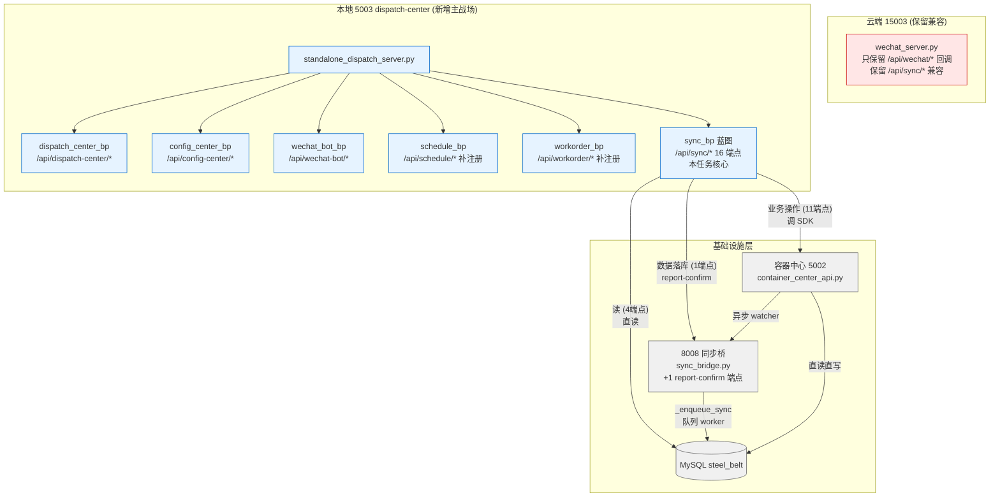
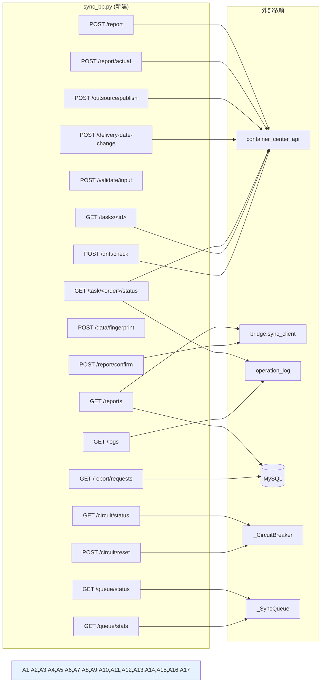
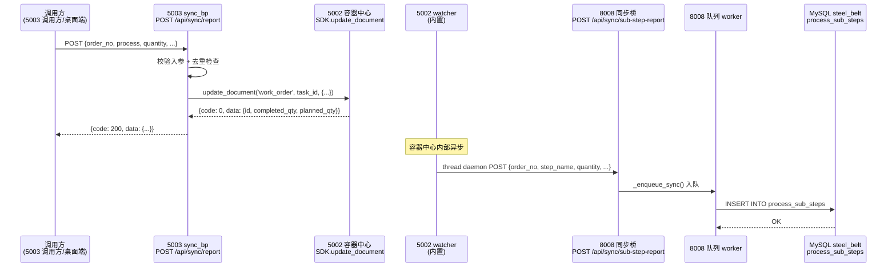
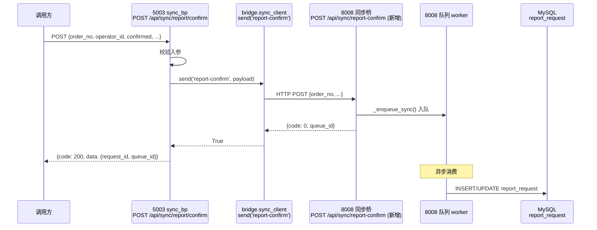
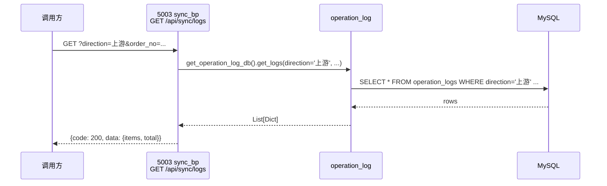

# DESIGN — 云端去除调度中心功能

> 阶段 2: Architect（架构阶段）· 系统架构 + 模块设计 + 接口契约
> 时间：2026-06-08
> 状态：已对齐

---

## 一、整体架构图



---

## 二、分层设计

### 2.1 服务进程层

| 进程 | 端口 | 状态 | 职责 |
|------|------|------|------|
| desktop | 5000 | 不变 | 桌面端主进程（含 8008 桥子服务） |
| container_center | 5002 | 不变 | 文档/包存储 |
| **dispatch_center** | **5003** | **改动** | 任务分发 + 排产 + 业务 API (本任务) |
| sync_bridge (子服务) | 8008 | 改 1 处 | 容器中心 → MySQL 异步落库 + report-confirm (本任务) |
| wechat_server (云端) | 15003 | 保留兼容 | 企业微信回调 + /api/sync/* 兼容保留 |

### 2.2 蓝图层

| 蓝图 | url_prefix | 端点数 | 注册位置 | 状态 |
|------|-----------|--------|----------|------|
| dispatch_center_bp | /api/dispatch-center/* | 14 | standalone_dispatch_server.py:90 | 已注册 |
| config_center_bp | /api/config-center/* | 1 | standalone_dispatch_server.py:104 | 已注册 |
| wechat_bot_bp | /api/wechat-bot/* | 1 | standalone_dispatch_server.py:95 | 已注册 |
| **schedule_bp** | /api/schedule/* | **9** | **本任务补注册** | **待注册** |
| **workorder_bp** | /api/workorder/* | **1** | **本任务补注册** | **待注册** |
| **sync_bp**（新建）| /api/sync/* | **16** | **本任务新建 + 注册** | **待创建** |

### 2.3 数据访问层

| 数据源 | 访问方式 | 用于哪些端点 |
|--------|---------|-------------|
| 容器中心 5002 SDK | `_get_container_center()` | report / report/actual / outsource/publish / delivery-date-change / task/<order>/status / tasks/<id> |
| 8008 同步桥 | `bridge.sync_client.send('report-confirm', ...)` | report/confirm |
| MySQL steel_belt（直读）| pymysql + .env | reports / logs / report/requests |

---

## 三、模块依赖关系图



---

## 四、接口契约定义

### 4.1 sync_bp 蓝图接口契约

#### 4.1.1 业务操作类（调容器中心 SDK）

```yaml
POST /api/sync/report:
  desc: 报工同步（改 work_order 文档）
  request: {order_no, process, quantity, operator, completed, force, timestamp}
  response: {code: 200|400|500, message, data: {task_id, completed_qty, planned_qty, remaining}}
  impl: 调容器中心 SDK .update_document('work_order', task_id, {...})

POST /api/sync/report/actual:
  desc: 实际报工（quantity 累加）
  request: {order_no, process_name, quantity, operator_id, completed}
  response: {code: 200, data: {new_completed, remaining}}
  impl: 调容器中心 SDK .update_document()，累加 quantity

POST /api/sync/outsource/publish:
  desc: 外协任务发布
  request: {order_no, process_name, planned_qty, process_seq, outsource_remark, operator_id}
  response: {code: 200, data: {id}, message: '外协任务已发布'}
  impl: 调容器中心 SDK .create_document('outsource', data) + .distribute()
  兼容性: 先 try request.json，再 try request.form

POST /api/sync/delivery-date-change:
  desc: 改交付日期
  request: {order_no, new_delivery_date, reason}
  response: {code: 200, data: {order_no, delivery_date}}
  impl: 调容器中心 SDK .update_document() 改 work_order
```

#### 4.1.2 业务配置/读类（内存计算）

```yaml
POST /api/sync/validate/input:
  desc: 订单号格式校验
  request: {order_no, field_name?}
  response: {code: 200|400, data: {valid: bool, normalized: str, pattern: '^ORD-\d{8,}$'}}

GET /api/sync/task/<order_no>/status:
  desc: 工单状态
  response: {code: 200|404|500, data: {order_no, tasks: [...], reports: [...], progress: {completed, total, percentage}}}
  F1 依赖: 读 operation_logs.direction='上游' 报工记录

GET /api/sync/tasks/<task_id>:
  desc: 任务详情
  response: {code: 200|404, data: <work_order 文档>}

POST /api/sync/drift/check:
  desc: 漂移检测（比对本地和容器中心）
  request: {order_no, fields: [...]}
  response: {code: 200, data: {drift_detected: bool, drifts: [{field, local_value, remote_value}]}}

POST /api/sync/data/fingerprint:
  desc: 数据指纹
  request: {order_no, fields: {step, quantity, operator, timestamp}}
  response: {code: 200, data: {fingerprint: 'sha256:...'}}
```

#### 4.1.3 熔断器/队列（内存单例）

```yaml
GET /api/sync/circuit/status:
  desc: 熔断器状态
  response: {code: 200, data: {state: 'closed|open|half-open', failure_count, last_failure_at, ...}}

POST /api/sync/circuit/reset:
  desc: 熔断器重置
  response: {code: 200, data: {state: 'closed'}}

GET /api/sync/queue/status:
  desc: 队列状态
  response: {code: 200, data: {size, oldest_age_seconds, ...}}

GET /api/sync/queue/stats:
  desc: 队列统计
  response: {code: 200, data: {enqueued, consumed, failed, retried, ...}}
```

#### 4.1.4 数据落库类（走 8008 桥 / 直读 MySQL）

```yaml
GET /api/sync/reports:
  desc: 报工记录列表
  query: {order_no?, operator_id?, start_date?, end_date?, limit?}
  response: {code: 200, data: {items: [...], total}}
  F1 依赖: 可选（若按 direction 过滤则需）

GET /api/sync/logs:
  desc: 操作日志
  query: {direction, operation_type, order_no, start_date, end_date, limit}
  response: {code: 200, data: {items: [...], total}}
  F1 依赖: 必须（direction='上游' 查询）

GET /api/sync/report/requests:
  desc: 报工请求列表
  query: {status, operator_id, limit}
  response: {code: 200, data: {items: [...], total}}
  F1 依赖: 必须（读 report_request 表关联 operation_logs）

POST /api/sync/report/confirm:
  desc: 报工确认收口
  request: {order_no, operator_id, confirmed, remark}
  response: {code: 200, data: {request_id, confirmed_at}}
  impl: 调 8008 /api/sync/report-confirm（走桥）
```

### 4.2 8008 同步桥新增接口契约

```yaml
POST /api/sync/report-confirm:
  desc: 报工确认收口（8008 新增端点）
  request: {order_no, operator_id, confirmed, remark, timestamp}
  response: {code: 0, message: '报工确认已入队', queue_id}
  impl: _enqueue_sync({...}) → 队列 worker 写 MySQL report_request 表
  复用: 沿用 sub-step-report 的 _enqueue_sync() 模式
```

### 4.3 错误码约定

| code | 含义 | 触发场景 |
|------|------|----------|
| 0 | 成功 | 200 |
| 1 / 1001 | 参数错误 | 400（业务级） |
| 400 | 通用参数错 | 400（Flask 400） |
| 404 | 资源不存在 | 404 |
| 409 | 业务冲突（如重复报工） | 409 |
| 500 | 服务端异常 | 500 |
| 1201 | JSON 解析失败 | 400（8008 约定） |
| 1202 | quantity 格式错 | 400（8008 约定） |
| 1404 | 接口不存在 | 404（8008 约定） |

---

## 五、数据流向图

### 5.1 报工数据流（最复杂）



### 5.2 报工确认数据流



### 5.3 读类数据流（reports/logs/requests）



---

## 六、异常处理策略

### 6.1 全局异常（已存在）

[standalone_dispatch_server.py:127-130](file:///D:/yuan/%E4%B8%8D%E9%94%90%E9%92%A2%E7%BD%91%E5%B8%A6%E8%B7%9F%E5%8D%953.0/mobile_api_ai/standalone_dispatch_server.py#L127-L130)：
```python
@app.errorhandler(Exception)
def handle_global_exception(e):
    logger.exception('[全局异常] %s %s: %s', request.method, request.path, e)
    return jsonify({'code': 500, 'message': str(e)}), 500
```
sync_bp 中不重复捕获 Exception，依赖全局 handler。

### 6.2 业务异常（按 jgs7 规范）

```python
# 模式：业务异常 → 显式 raise BusinessError
# 或：返回 jsonify + 4xx 状态码
# 禁止：except: pass / except Exception: pass
```

### 6.3 数据库异常

```python
# 必须用 context manager
@contextmanager
def _get_mysql_conn():
    from db_config import get_db_config
    import pymysql
    cfg = get_db_config()
    conn = pymysql.connect(**cfg, charset='utf8mb4', cursorclass=pymysql.cursors.DictCursor)
    try:
        yield conn
    finally:
        conn.close()

# 禁止裸 except
try:
    with _get_mysql_conn() as conn:
        ...
except pymysql.MySQLError as e:
    logger.exception('[sync_bp] MySQL 错误: %s', e)
    return jsonify({'code': 500, 'message': '数据库访问失败'}), 500
```

### 6.4 容器中心 SDK 异常

```python
# 调容器中心失败 → 返 500 + 明确错误信息
try:
    result = _get_container_center().update_document(...)
except Exception as e:
    logger.exception('[sync_bp] 容器中心调用失败: %s', e)
    return jsonify({'code': 500, 'message': f'容器中心调用失败: {e}'}), 500
```

### 6.5 8008 桥调用异常

```python
# bridge.sync_client.send() 失败 → 返 502（Bad Gateway）
from bridge.sync_client import send
ok = send('report-confirm', payload, timeout=5)
if not ok:
    return jsonify({'code': 502, 'message': '8008 同步桥调用失败'}), 502
```

---

## 七、设计原则

### 7.1 严格遵循

- **不引入**新依赖（用现有 requests / pymysql / flask / hashlib / re）
- **不动**容器中心 5002 / 桌面端 5000 / 8008 已有 4 端点
- **不删**wechat_server.py 中 /api/sync/* 端点（云端保留兼容）
- **不直写**MySQL（除 3 个读类端点）
- **不走**15003（已彻底解耦）

### 7.2 复用现有组件

- 容器中心 SDK 客户端（`_get_container_center()`）
- 8008 桥调用（`bridge.sync_client.send()`）
- MySQL 配置（`db_config.get_db_config()`）
- 操作日志（`operation_log.get_operation_log_db()`）
- 全局异常 handler
- Limiter 限流
- CORS 中间件

### 7.3 避免过度设计

- 不引入 CircuitBreaker 库（自己实现 50 行类）
- 不引入 Queue 库（用 Python list 单例）
- 不引入 ORM（用 pymysql 直查）
- 不引入配置中心（用 .env）
- 不拆分微服务（继续单进程多蓝图）

---

## 八、与现有架构对齐检查

| 检查项 | 状态 |
|--------|------|
| 蓝图风格 | ✅ 与 dispatch_center_bp 一致 |
| 错误码 | ✅ 与 wechat_server.py 一致 |
| 日志风格 | ✅ logger.exception() 模式 |
| 异常处理 | ✅ 沿用全局 handler |
| 限流 | ✅ 沿用全局 Limiter |
| CORS | ✅ 沿用 init_cors |
| 鉴权 | ✅ 沿用容器中心 require_api_key（按需） |
| 路径前缀 | ✅ 保留 /api/sync/* 与云端兼容 |

---

## 九、达成共识

DESIGN 文档完成，进入阶段 3: Atomize（生成 TASK 任务拆分）。
