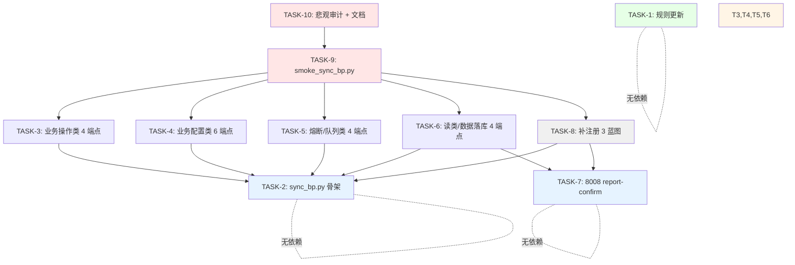

# TASK — 云端去除调度中心功能（任务原子化拆分）

> 阶段 3: Atomize（原子化阶段）· 任务拆分 + 输入/输出契约 + 依赖关系
> 时间：2026-06-08
> 状态：已对齐

---

## 一、原子任务总览

| ID | 任务 | 依赖 | 复杂度 | 估时 | 验收 |
|----|------|------|--------|------|------|
| TASK-1 | 规则更新 [wechat_server_cloud_only.md](file:///D:/yuan/.trae/rules/wechat_server_cloud_only.md) | 无 | 低 | 5min | 规则文件含"允许本地改动做迁移" |
| TASK-2 | 创建 [sync_bp.py](file:///D:/yuan/%E4%B8%8D%E9%94%90%E9%92%A2%E7%BD%91%E5%B8%A6%E8%B7%9F%E5%8D%953.0/mobile_api_ai/sync_bp.py) 骨架（蓝图 + 16 路由占位 + docstring） | 无 | 中 | 30min | 16 端点 405/501 状态 |
| TASK-3 | 实现业务操作类（4 端点：report/actual/outsource/delivery-date） | TASK-2 | 高 | 60min | 容器中心 5002 联通，调通后返 200 |
| TASK-4 | 实现业务配置类（6 端点：validate/status/tasks\<id\>/drift/fingerprint） | TASK-2 | 中 | 45min | 校验/计算逻辑正确 |
| TASK-5 | 实现熔断/队列类（4 端点：circuit x2 + queue x2） | TASK-2 | 中 | 30min | 内存单例读写 |
| TASK-6 | 实现读类/数据落库类（4 端点：reports/logs/requests/confirm） | TASK-2, TASK-7 | 高 | 60min | 走 8008 桥 + 直读 MySQL |
| TASK-7 | 8008 同步桥新增 [report-confirm](file:///D:/yuan/%E4%B8%8D%E9%94%90%E9%92%A2%E7%BD%91%E5%B8%A6%E8%B7%9F%E5%8D%953.0/mobile_api_ai/sync_bridge.py) 端点 | 无 | 中 | 20min | 8008 进程内 POST 返 200 |
| TASK-8 | 补注册 [schedule_bp / workorder_bp / sync_bp](file:///D:/yuan/%E4%B8%8D%E9%94%90%E9%92%A2%E7%BD%91%E5%B8%A6%E8%B7%9F%E5%8D%953.0/mobile_api_ai/standalone_dispatch_server.py) | TASK-2, TASK-7 | 低 | 10min | 5003 扫到 26 新端点 |
| TASK-9 | 写测试 [smoke_sync_bp.py](file:///D:/yuan/smoke_sync_bp.py) | TASK-8 | 中 | 30min | 26 端点全部非 404 |
| TASK-10 | 悲观审计 + ACCEPTANCE/FINAL/TODO 文档 | TASK-9 | 中 | 30min | 18 项 AC 全部通过 |

**总估时：~5h**

---

## 二、任务依赖图

---

## 三、原子任务详细定义

### TASK-1: 规则更新

**输入契约**：
- 前置依赖：无
- 输入数据：[wechat_server_cloud_only.md](file:///D:/yuan/.trae/rules/wechat_server_cloud_only.md) 当前内容
- 环境依赖：文本编辑器

**输出契约**：
- 输出数据：规则文件加 1 段"云端去除调度中心功能期间，允许本地改动做迁移"
- 交付物：[wechat_server_cloud_only.md](file:///D:/yuan/.trae/rules/wechat_server_cloud_only.md)
- 验收标准：grep "允许本地改动做迁移" 返 1 行

**实现约束**：
- 在文件末尾追加段落，不动已有内容
- 标注"仅限云端去除调度中心功能任务期间"

**依赖关系**：
- 后置任务：TASK-2, TASK-3
- 并行任务：无

---

### TASK-2: 创建 sync_bp.py 骨架

**输入契约**：
- 前置依赖：无
- 输入数据：DESIGN § 4.1 接口契约
- 环境依赖：mobile_api_ai/ 目录存在

**输出契约**：
- 输出数据：sync_bp.py 蓝图 + 16 路由占位（每个函数只返 501 Not Implemented）
- 交付物：[sync_bp.py](file:///D:/yuan/%E4%B8%8D%E9%94%90%E9%92%A2%E7%BD%91%E5%B8%A6%E8%B7%9F%E5%8D%953.0/mobile_api_ai/sync_bp.py)
- 验收标准：16 端点 405（GET 改 POST 时）/ 501（功能未实现）

**实现约束**：
- Blueprint 名称 sync_bp，url_prefix /api/sync
- 16 函数全部含 docstring（功能/参数/返回值/异常）
- 不引入新依赖
- logger 命名 'sync_bp'

**依赖关系**：
- 后置任务：TASK-3, TASK-4, TASK-5, TASK-6, TASK-8
- 并行任务：TASK-1, TASK-7

---

### TASK-3: 业务操作类 4 端点

**输入契约**：
- 前置依赖：TASK-2
- 输入数据：DESIGN § 4.1.1 接口契约
- 环境依赖：容器中心 5002 启动

**输出契约**：
- 输出数据：4 端点完整实现 + 容器中心 SDK 调用
- 交付物：sync_bp.py 中 4 函数
- 验收标准：curl POST 各端点返 200 或 500（容器中心业务级），非 404/501

**实现约束**：
- 调 `_get_container_center()` 或容器中心 SDK 客户端
- 复用 [container_center_api.py:2250](file:///D:/yuan/%E4%B8%8D%E9%94%90%E9%92%A2%E7%BD%91%E5%B8%A6%E8%B7%9F%E5%8D%953.0/mobile_api_ai/container_center_api.py#L2250) 模式
- /outsource/publish 先 try request.json，再 try request.form

**依赖关系**：
- 后置任务：TASK-9
- 并行任务：TASK-4, TASK-5

---

### TASK-4: 业务配置类 6 端点

**输入契约**：
- 前置依赖：TASK-2
- 输入数据：DESIGN § 4.1.2 接口契约
- 环境依赖：MySQL 启动（仅 GET /task/&lt;order&gt;/status 需读 operation_logs）

**输出契约**：
- 输出数据：6 端点完整实现
- 交付物：sync_bp.py 中 6 函数
- 验收标准：curl 各端点返 200 或 400/500（非 404/501）

**实现约束**：
- validate/input 用正则 `^ORD-\d{8,}$`
- status 端点读容器中心 + 读 MySQL（**F1 阻塞**，F1 修复前返 500）
- drift/fingerprint 内存计算

**依赖关系**：
- 后置任务：TASK-9
- 并行任务：TASK-3, TASK-5

---

### TASK-5: 熔断/队列类 4 端点

**输入契约**：
- 前置依赖：TASK-2
- 输入数据：DESIGN § 4.1.3 接口契约
- 环境依赖：无

**输出契约**：
- 输出数据：4 端点完整实现
- 交付物：sync_bp.py 中 4 函数
- 验收标准：curl 各端点返 200

**实现约束**：
- 自实现 _CircuitBreaker 类（约 50 行）
- 自实现 _SyncQueue 单例（Python list + threading.Lock）
- 不引入新库

**依赖关系**：
- 后置任务：TASK-9
- 并行任务：TASK-3, TASK-4

---

### TASK-6: 读类/数据落库类 4 端点

**输入契约**：
- 前置依赖：TASK-2, TASK-7
- 输入数据：DESIGN § 4.1.4 接口契约
- 环境依赖：8008 同步桥启动 + MySQL 启动

**输出契约**：
- 输出数据：4 端点完整实现
- 交付物：sync_bp.py 中 4 函数
- 验收标准：curl 各端点返 200 或 500（F1 阻塞前）

**实现约束**：
- report/confirm 调 `bridge.sync_client.send('report-confirm', ...)`
- reports/logs/requests 直读 MySQL（用 @contextmanager 封装的 get_db_cursor）
- **F1 阻塞项**明确标 `logger.warning('[F1] direction 列缺失，需云端修复')`

**依赖关系**：
- 后置任务：TASK-9
- 并行任务：TASK-3, TASK-4, TASK-5

---

### TASK-7: 8008 同步桥新增 report-confirm

**输入契约**：
- 前置依赖：无
- 输入数据：DESIGN § 4.2 接口契约
- 环境依赖：sync_bridge.py / sync_bridge_server.py

**输出契约**：
- 输出数据：sync_bridge.py 中新增 1 端点
- 交付物：[sync_bridge.py](file:///D:/yuan/%E4%B8%8D%E9%94%90%E9%92%A2%E7%BD%91%E5%B8%A6%E8%B7%9F%E5%8D%953.0/mobile_api_ai/sync_bridge.py)
- 验收标准：8008 进程内 POST /api/sync/report-confirm 返 `{code: 0, queue_id}`

**实现约束**：
- 沿用 sub-step-report 的 `_enqueue_sync()` 模式
- 写 report_request 表（schema 若不存在则 _init_db 兼容创建）
- 8008 已有 4 端点 0 改动

**依赖关系**：
- 后置任务：TASK-6, TASK-8
- 并行任务：TASK-1, TASK-2

---

### TASK-8: 补注册 3 蓝图

**输入契约**：
- 前置依赖：TASK-2, TASK-7
- 输入数据：standalone_dispatch_server.py:90-107 当前内容
- 环境依赖：schedule_bp / workorder_bp / sync_bp 已存在

**输出契约**：
- 输出数据：standalone_dispatch_server.py 增加 3 个 try/except 注册块
- 交付物：[standalone_dispatch_server.py](file:///D:/yuan/%E4%B8%8D%E9%94%90%E9%92%A2%E7%BD%91%E5%B8%A6%E8%B7%9F%E5%8D%953.0/mobile_api_ai/standalone_dispatch_server.py)
- 验收标准：5003 进程内 scan_5003.py 扫到 26 个新端点（9 schedule + 1 workorder + 16 sync）

**实现约束**：
- 在 :90 之后、`@app.route('/favicon.ico')` 之前插入
- 3 个独立 try/except（一个失败不影响其他）
- logger.info() 标识成功

**依赖关系**：
- 后置任务：TASK-9
- 并行任务：无

---

### TASK-9: 写测试 smoke_sync_bp.py

**输入契约**：
- 前置依赖：TASK-3, TASK-4, TASK-5, TASK-6, TASK-8
- 输入数据：DESIGN § 4 接口契约
- 环境依赖：5003 启动 + 容器中心 5002 启动 + 8008 启动 + MySQL 启动

**输出契约**：
- 输出数据：[smoke_sync_bp.py](file:///D:/yuan/smoke_sync_bp.py) 测试脚本
- 交付物：~150 行测试代码
- 验收标准：26 个端点全部非 404（200/400/405/500 都算通过），3 真重复端点仍 404

**实现约束**：
- 沿用 [scan_5003.py](file:///D:/yuan/scan_5003.py) 风格
- 区分 PASS（200/400/405）/ WARN（500 因 F1）/ FAIL（404）
- 给出汇总报告

**依赖关系**：
- 后置任务：TASK-10
- 并行任务：无

---

### TASK-10: 悲观审计 + 文档

**输入契约**：
- 前置依赖：TASK-9
- 输入数据：所有改动文件
- 环境依赖：所有服务运行

**输出契约**：
- 输出数据：
  - [ACCEPTANCE_云端去除调度中心功能.md](file:///D:/yuan/%E4%B8%8D%E9%94%90%E9%92%A2%E7%BD%91%E5%B8%A6%E8%B7%9F%E5%8D%953.0/docs/%E4%BA%91%E7%AB%AF%E5%8E%BB%E9%99%A4%E8%B0%83%E5%BA%A6%E4%B8%AD%E5%BF%83%E5%8A%9F%E8%83%BD/ACCEPTANCE_%E4%BA%91%E7%AB%AF%E5%8E%BB%E9%99%A4%E8%B0%83%E5%BA%A6%E4%B8%AD%E5%BF%83%E5%8A%9F%E8%83%BD.md)
  - [FINAL_云端去除调度中心功能.md](file:///D:/yuan/%E4%B8%8D%E9%94%90%E9%92%A2%E7%BD%91%E5%B8%A6%E8%B7%9F%E5%8D%953.0/docs/%E4%BA%91%E7%AB%AF%E5%8E%BB%E9%99%A4%E8%B0%83%E5%BA%A6%E4%B8%AD%E5%BF%83%E5%8A%9F%E8%83%BD/FINAL_%E4%BA%91%E7%AB%AF%E5%8E%BB%E9%99%A4%E8%B0%83%E5%BA%A6%E4%B8%AD%E5%BF%83%E5%8A%9F%E8%83%BD.md)
  - [TODO_云端去除调度中心功能.md](file:///D:/yuan/%E4%B8%8D%E9%94%90%E9%92%A2%E7%BD%91%E5%B8%A6%E8%B7%9F%E5%8D%953.0/docs/%E4%BA%91%E7%AB%AF%E5%8E%BB%E9%99%A4%E8%B0%83%E5%BA%A6%E4%B8%AD%E5%BF%83%E5%8A%9F%E8%83%BD/TODO_%E4%BA%91%E7%AB%AF%E5%8E%BB%E9%99%A4%E8%B0%83%E5%BA%A6%E4%B8%AD%E5%BF%83%E5%8A%9F%E8%83%BD.md)
  - 同步到 d:\yuan\现实文件\云端去除调度中心功能\
- 验收标准：18 项 AC 全部有 PASS 证据

**实现约束**：
- 悲观审计对照 DESIGN/TASK 逐行核验
- 完成度报告格式按 jgs6.md 规范
- TODO 必须明确"待云端修复"项

**依赖关系**：
- 后置任务：无（终态）
- 并行任务：无

---

## 四、质量门控

| 检查项 | 状态 |
|--------|------|
| 任务覆盖完整需求 | ✅ 16 端点 + 3 蓝图注册 + 1 端点 8008 + 1 规则 |
| 依赖关系无循环 | ✅ 无循环 |
| 每个任务可独立验证 | ✅ 每任务有 AC |
| 复杂度评估合理 | ✅ 单任务 < 60min |

---

## 五、达成共识

TASK 拆分完成，进入阶段 4: Approve（等待用户审批）。
