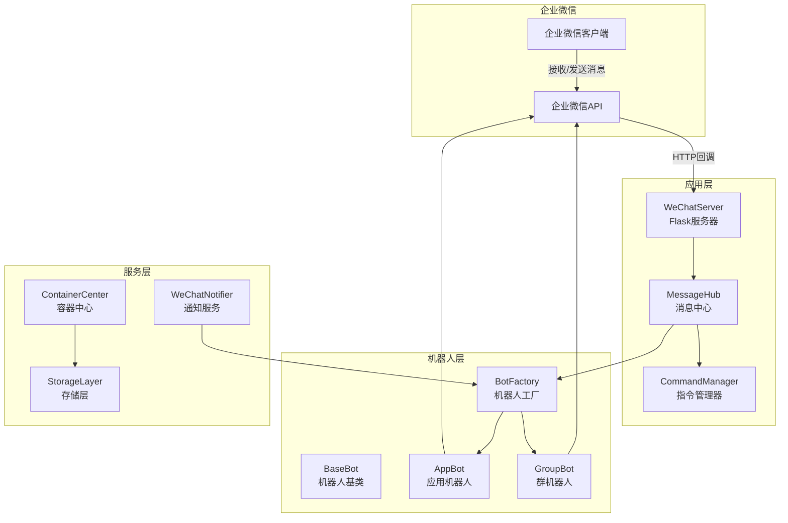
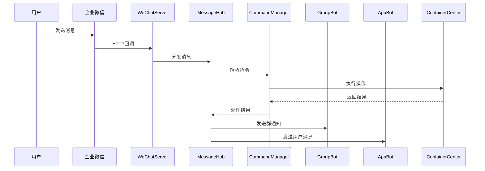

# DESIGN_企业微信应用机器人.md

## 项目名称
企业微信应用机器人

---

## 一、整体架构

### 1.1 架构图



### 1.2 模块关系图



---

## 二、分层设计

### 2.1 目录结构

```
mobile_api_ai/
├── bots/
│   ├── __init__.py
│   ├── base.py              # 机器人基类
│   ├── factory.py           # 机器人工厂
│   ├── group_bot.py         # 群机器人
│   ├── app_bot.py          # 应用机器人
│   └── message_hub.py       # 消息中心
├── commands/
│   ├── __init__.py
│   ├── base.py              # 指令基类
│   ├── manager.py           # 指令管理器
│   ├── report_cmd.py        # 报工指令
│   ├── query_cmd.py         # 查询指令
│   └── task_cmd.py          # 任务指令
├── services/
│   ├── __init__.py
│   ├── notifier.py          # 通知服务
│   └── session.py            # 会话管理
├── wechat_server.py         # Flask服务器（重构）
├── wechat_work_bot_v2.py    # 旧版（兼容）
└── integration/
    └── wechat_notifier.py   # 旧版通知（兼容）
```

### 2.2 各层职责

| 层级 | 职责 |
|------|------|
| **bots** | 机器人实现，消息发送和接收 |
| **commands** | 指令解析和执行 |
| **services** | 通知服务、会话管理 |
| **wechat_server** | Flask路由、回调处理 |

---

## 三、核心组件

### 3.1 BotFactory（机器人工厂）

```python
class BotFactory:
    """统一创建和管理机器人实例"""

    @staticmethod
    def create_group_bot(webhook_url: str) -> GroupBot
    @staticmethod
    def create_app_bot(corp_id: str, agent_id: str, secret: str) -> AppBot
    @staticmethod
    def get_default_bot() -> BaseBot
```

### 3.2 BaseBot（机器人基类）

```python
class BaseBot:
    """机器人基类"""

    def send_text(self, content: str, **kwargs) -> bool
    def send_markdown(self, content: str, **kwargs) -> bool
    def send_news(self, articles: List[Dict], **kwargs) -> bool
    def send_image(self, image_path: str, **kwargs) -> bool
```

### 3.3 MessageHub（消息中心）

```python
class MessageHub:
    """消息路由和分发中心"""

    def dispatch(self, message: Dict) -> Dict
    def register_handler(self, bot_type: str, handler: Callable)
    def broadcast(self, content: str, bot_type: str = 'group')
```

### 3.4 CommandManager（指令管理器）

```python
class CommandManager:
    """指令解析和执行管理器"""

    def register(self, command: str, handler: Callable)
    def parse(self, text: str) -> ParsedCommand
    def execute(self, parsed: ParsedCommand, context: Dict) -> CommandResult
```

---

## 四、接口契约

### 4.1 机器人接口

| 方法 | 输入 | 输出 | 说明 |
|------|------|------|------|
| `send_text` | content: str, target: str | bool | 发送文本消息 |
| `send_markdown` | content: str, target: str | bool | 发送Markdown |
| `send_news` | articles: List, target: str | bool | 发送图文消息 |
| `receive` | request: Request | Dict | 接收并解析消息 |

### 4.2 指令接口

| 指令 | 格式 | 说明 |
|------|------|------|
| `报工` | `报工 订单号 工序 数量 [状态]` | 提交报工 |
| `查询` | `查询 订单号` | 查询订单状态 |
| `任务` | `任务` | 获取我的任务列表 |
| `确认` | `确认 任务ID` | 确认任务 |
| `完成` | `完成 任务ID 数量` | 完成任务 |
| `帮助` | `帮助` | 显示帮助信息 |

### 4.3 通知服务接口

```python
class WeChatNotifier:
    def notify_new_task(self, task: Task) -> bool
    def notify_task_assigned(self, task: Task, operator_id: str) -> bool
    def notify_task_completed(self, task: Task) -> bool
    def notify_low_stock(self, material: Dict) -> bool
```

---

## 五、数据流向

### 5.1 消息接收流程

```
企业微信 ──HTTP回调──> /api/wechat/hook
                            │
                            ▼
                      MessageHub.dispatch()
                            │
          ┌─────────────────┼─────────────────┐
          ▼                 ▼                 ▼
    GroupBot处理      AppBot处理       CommandManager
          │                 │                 │
          ▼                 ▼                 ▼
    群通知发送       用户消息发送      指令执行
                                              │
                                              ▼
                                    ContainerCenter
                                              │
                                              ▼
                                    存储层/容器池
```

### 5.2 消息发送流程

```
业务系统 ──> NotificationService ──> MessageHub
                                            │
                    ┌───────────────────────┼───────────────────────┐
                    ▼                       ▼                       ▼
              GroupBot.send()         AppBot.send()           其他Bot
                    │                       │                       │
                    ▼                       ▼                       ▼
            企业微信群推送           企业微信用户推送          备用通道
```

---

## 六、异常处理

### 6.1 异常分类

| 异常类型 | 处理策略 |
|----------|----------|
| 网络超时 | 重试3次，间隔2秒 |
| Token失效 | 自动刷新Token |
| 频率限制 | 队列+延迟发送 |
| 参数错误 | 日志记录+返回错误信息 |

### 6.2 降级策略

```python
# 降级顺序：AppBot -> GroupBot -> 日志
try:
    app_bot.send_text(...)
except Exception:
    try:
        group_bot.send_text(...)
    except Exception:
        logger.error("企业微信消息发送失败")
```

---

## 七、配置管理

### 7.1 环境变量

```bash
# 企业微信应用配置
WECHAT_CORP_ID=your_corp_id
WECHAT_AGENT_ID=your_agent_id
WECHAT_SECRET=your_secret
WECHAT_TOKEN=your_token
WECHAT_AES_KEY=your_aes_key

# 企业微信群机器人
WECHAT_WORK_BOT_URL=https://qyapi.weixin.qq.com/cgi-bin/webhook/send?key=xxx

# 通知开关
ENABLE_WECHAT_NOTIFY=true
NOTIFY_ON_TASK_ASSIGNED=true
NOTIFY_ON_TASK_COMPLETED=true
NOTIFY_ON_LOW_STOCK=false
```

---

**文档版本**: v1.0
**创建日期**: 2026-05-02
