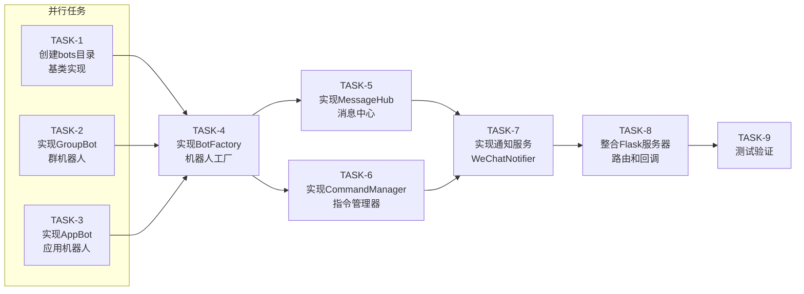

# TASK_企业微信应用机器人.md

## 项目名称
企业微信应用机器人

---

## 一、任务依赖图

---

## 二、原子任务清单

### TASK-1: 创建bots目录和基类

**输入契约**:
- 前置依赖: 无
- 输入数据: 无
- 环境依赖: Python 3.8+, requests库

**输出契约**:
- 交付物: `bots/base.py`, `bots/__init__.py`
- 验收标准:
  - [x] BaseBot类定义完成
  - [x] 包含send_text, send_markdown, send_news, send_image方法
  - [x] 包含receive方法（框架）

**实现约束**:
- 技术栈: Python, requests
- 接口规范: 遵循现有项目规范
- 质量要求: 方法为抽象方法或抛出NotImplementedError

---

### TASK-2: 实现GroupBot群机器人

**输入契约**:
- 前置依赖: TASK-1
- 输入数据: webhook_url配置
- 环境依赖: requests库

**输出契约**:
- 交付物: `bots/group_bot.py`
- 验收标准:
  - [x] 继承BaseBot
  - [x] send_text实现群发送
  - [x] send_markdown实现
  - [x] send_news实现
  - [x] 异常处理完善

**实现约束**:
- 技术栈: Python, requests
- 接口规范: 继承BaseBot
- 质量要求: 超时5秒，失败返回False

---

### TASK-3: 实现AppBot应用机器人

**输入契约**:
- 前置依赖: TASK-1
- 输入数据: corp_id, agent_id, secret配置
- 环境依赖: requests库

**输出契约**:
- 交付物: `bots/app_bot.py`
- 验收标准:
  - [x] 继承BaseBot
  - [x] get_access_token自动刷新
  - [x] send_text_to_user实现
  - [x] send_text_to_group实现
  - [x] send_markdown实现
  - [x] send_news实现

**实现约束**:
- 技术栈: Python, requests
- 接口规范: 继承BaseBot
- 质量要求: Token自动刷新，异常处理完善

---

### TASK-4: 实现BotFactory机器人工厂

**输入契约**:
- 前置依赖: TASK-1, TASK-2, TASK-3
- 输入数据: 无
- 环境依赖: bots模块

**输出契约**:
- 交付物: `bots/factory.py`
- 验收标准:
  - [x] create_group_bot静态方法
  - [x] create_app_bot静态方法
  - [x] get_default_bot静态方法
  - [x] 单例模式实现

**实现约束**:
- 技术栈: Python
- 接口规范: 工厂模式
- 质量要求: 线程安全

---

### TASK-5: 实现MessageHub消息中心

**输入契约**:
- 前置依赖: TASK-4
- 输入数据: 无
- 环境依赖: bots模块

**输出契约**:
- 交付物: `bots/message_hub.py`
- 验收标准:
  - [x] dispatch消息分发方法
  - [x] register_handler注册处理器
  - [x] broadcast广播消息
  - [x] 消息格式化

**实现约束**:
- 技术栈: Python
- 接口规范: 消息发布-订阅模式
- 质量要求: 消息队列，异步处理

---

### TASK-6: 实现CommandManager指令管理器

**输入契约**:
- 前置依赖: TASK-4
- 输入数据: 无
- 环境依赖: 无

**输出契约**:
- 交付物: `commands/manager.py`
- 验收标准:
  - [x] register注册指令
  - [x] parse解析指令
  - [x] execute执行指令
  - [x] 报工指令识别
  - [x] 查询指令识别
  - [x] 任务指令识别
  - [x] 帮助指令识别

**实现约束**:
- 技术栈: Python, re(正则)
- 接口规范: 指令模式
- 质量要求: 支持指令别名

---

### TASK-7: 实现WeChatNotifier通知服务

**输入契约**:
- 前置依赖: TASK-5, TASK-6
- 输入数据: ContainerCenter实例
- 环境依赖: bots模块, storage_layer

**输出契约**:
- 交付物: `services/notifier.py`
- 验收标准:
  - [x] notify_new_task新任务通知
  - [x] notify_task_assigned任务分配通知
  - [x] notify_task_completed任务完成通知
  - [x] notify_low_stock库存预警通知
  - [x] 配置开关控制

**实现约束**:
- 技术栈: Python
- 接口规范: 服务类
- 质量要求: 降级处理，失败不影响主流程

---

### TASK-8: 整合Flask服务器

**输入契约**:
- 前置依赖: TASK-7
- 输入数据: 无
- 环境依赖: Flask

**输出契约**:
- 交付物: `wechat_server.py`
- 验收标准:
  - [x] /api/wechat/hook 回调接口
  - [x] /api/wechat/send 发送接口
  - [x] /api/wechat/verify 验证接口
  - [x] 签名验证
  - [x] 消息解密（如需要）

**实现约束**:
- 技术栈: Flask, pycryptodome
- 接口规范: RESTful风格
- 质量要求: 返回格式统一

---

### TASK-9: 测试验证

**输入契约**:
- 前置依赖: TASK-8
- 输入数据: .env配置
- 环境依赖: 网络连接

**输出契约**:
- 交付物: `test_wechat_bot.py`
- 验收标准:
  - [x] 发送文本消息测试
  - [x] 发送Markdown测试
  - [x] 发送图文消息测试
  - [x] 接收消息测试
  - [x] 指令解析测试

**实现约束**:
- 技术栈: Python, unittest/pytest
- 接口规范: 测试框架
- 质量要求: 全部测试通过

---

## 三、任务汇总

| 任务ID | 名称 | 依赖 | 复杂度 | 并行性 |
|--------|------|------|--------|--------|
| TASK-1 | 创建bots目录和基类 | - | 低 | 独立 |
| TASK-2 | 实现GroupBot | TASK-1 | 低 | 并行 |
| TASK-3 | 实现AppBot | TASK-1 | 低 | 并行 |
| TASK-4 | 实现BotFactory | TASK-1,2,3 | 中 | 依赖 |
| TASK-5 | 实现MessageHub | TASK-4 | 中 | 依赖 |
| TASK-6 | 实现CommandManager | TASK-4 | 中 | 并行 |
| TASK-7 | 实现通知服务 | TASK-5,6 | 中 | 依赖 |
| TASK-8 | 整合Flask服务器 | TASK-7 | 中 | 依赖 |
| TASK-9 | 测试验证 | TASK-8 | 低 | 依赖 |

---

## 四、质量门控

- [x] 任务覆盖完整需求
- [x] 依赖关系无循环
- [x] 每个任务可独立验证
- [x] 复杂度评估合理

---

**文档版本**: v1.0
**创建日期**: 2026-05-02
