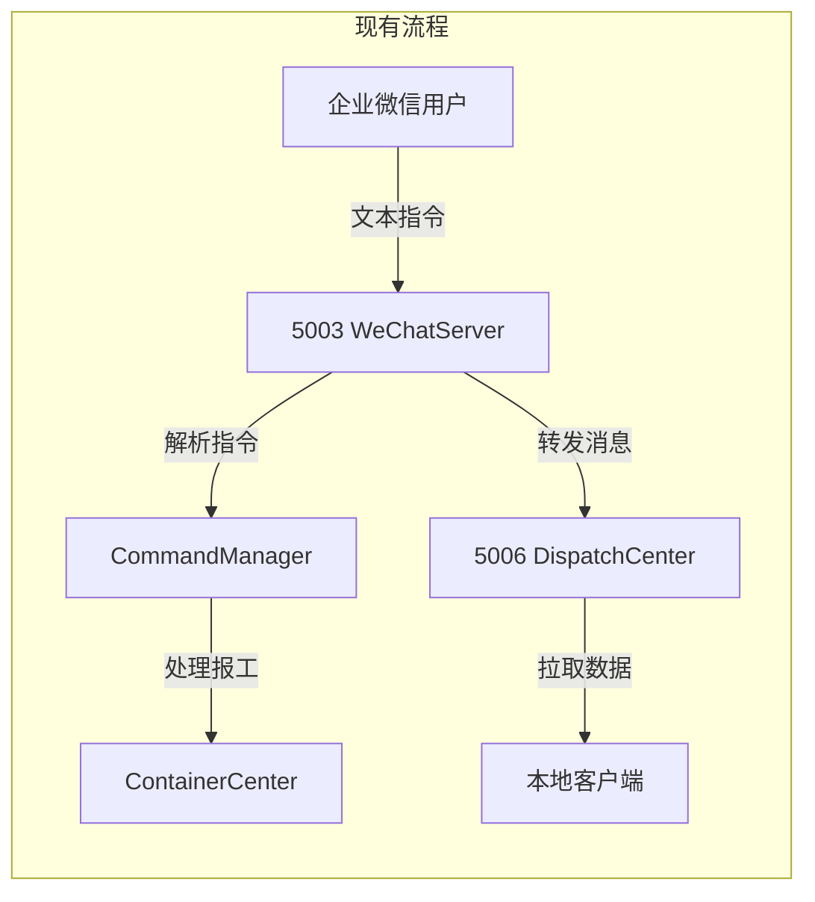

# ALIGNMENT_企业微信扫码报工.md

## 项目名称
企业微信扫码报工

---

## 一、项目上下文分析

### 1.1 现有项目结构

| 模块 | 说明 |
|------|------|
| `wechat_server.py` (端口5003) | 企业微信应用机器人Flask服务器，处理消息收发、指令解析、回调路由 |
| `wechat_cloud.py` (云端服务器) | 云端独立服务，接收微信回调、维护消息队列、**提供二维码解码能力** |
| `wechat_server_handlers.py` | 云端轮询消息处理器，`handle_image_message` 处理已解码的二维码数据 |
| `cloud_config.json` | 云端连接配置（cloud_host、api_key） |
| `dispatch_center.py` (端口5006) | 调度中心，任务派发、消息路由到本地客户端 |
| `container_center_v5.py` | 容器中心（任务池），持久化任务数据 |
| `bots/app_bot.py` | 企业微信应用机器人，负责发送消息到企业微信 |
| `commands/report_cmd.py` | 报工指令解析器，支持多种格式的报工输入 |
| `commands/manager.py` | 指令管理器，注册和路由所有指令 |
| `api/scan.py` | 扫码API，已有二维码解析逻辑（从容器获取数据） |
| `report_request_manager.py` | 报工请求管理器，管理报工请求状态 |

### 1.2 现有实现问题

| 问题 | 说明 |
|------|------|
| **图片消息未处理** | `wechat_server_handlers.py` 中 `handle_image_message` 为空实现，无任何图片处理逻辑 |
| **无扫码报工功能** | 当前报工完全依赖手动输入工单号和指令，无二维码识别能力 |
| **工序依赖手动输入** | 用户必须手动输入工序名称，容易出错且效率低 |
| **无工单校验闭环** | 报工前无工单有效性自动校验机制 |
| **二维码能力未利用** | 系统中工单已生成二维码，但微信端无扫码上报通道 |

### 1.3 技术栈

| 组件 | 技术 |
|------|------|
| 后端框架 | Flask |
| 企业微信API | 企微应用机器人 API |
| 二维码识别 | **云端侧**：`pyzbar` + `PIL/Pillow` 部署在 `wechat_cloud.py` 所在服务器 |
| 消息格式 | 文本、图片、Markdown |
| 存储 | SQLite（复用 storage_layer / container_center） |
| 图片存储 | **云端侧**：临时目录（部署在云服务器）；5003侧无需管理图片文件 |

### 1.4 现有数据流分析



---

## 二、需求理解

### 2.1 原始需求

> "增加企业微信报工扫描功能：微信端指令报工扫码后，服务器端5003给出回复上传二维码，微信端上传二维码照片，服务器端自动识别二维码内信息编号，对应工单号完整格式比对合格后发送微信端进行下一步操作，微信端输入后续指令后，服务器端对信息进行拼接路由转发给5006，本地端拉取信息进行后续操作。"

### 2.2 需求边界确认

| 功能点 | 范围 | 说明 |
|--------|------|------|
| 扫码指令触发 | 用户在微信端输入"扫码报工"等关键词触发 | 由指令管理器扩展识别 |
| 二维码图片上传 | 用户拍摄/选择二维码照片上传到企业微信 | 企业微信原生支持图片消息 |
| 二维码图片接收与转发 | 5003接收图片消息，提取MediaId | `handle_image_message` 中获取媒体ID |
| 二维码识别解析 | **云端侧**接收图片，解码二维码内容 | 云服务器（`wechat_cloud.py`）下载媒体文件，使用 pyzbar + PIL 解码 |
| 解码结果回传 | 云端将解码结果写入队列数据，5003轮询获取 | 云端队列消息中携带 `qr_decoded` 字段 |
| 工单号完整比对 | 提取二维码内容中的编号，与工单号格式做完整比对 | 复用 data_boundary 校验逻辑 |
| 交互引导 | 识别成功后引导用户输入工序、数量等信息 | 会话状态机管理 |
| 信息拼接转发 | 收集完整报工信息后，路由转发到5006 | 复用现有 forward 逻辑 |
| 本地端拉取 | 本地客户端从5006拉取信息进行后续操作 | 现有 dispatch_center 机制 |

### 2.3 不在本次范围

| 功能点 | 原因 |
|--------|------|
| 生成二维码 | 工单二维码由主软件生成，不归本模块负责 |
| 企业微信小程序扫码 | 已有小程序开发方案文档 |
| 批量扫码 | 一次只处理一个二维码 |
| 二维码防伪/验签 | 如需请单独提出 |

---

## 三、需求理解

### 3.1 对现有项目的理解

1. **5003 WeChatServer** 已实现：
   - 消息接收（文本/图片/语音/事件）
   - 指令解析和执行（CommandManager）
   - 报工流程（report_cmd + report_request_manager）
   - 消息转发到5006（/api/forward）
   - 云端混合模式（通过 cloud_poller 轮询云端消息）

2. **wechat_cloud.py（云端服务器）** 已实现：
   - 企业微信回调接收（`/api/wechat/hook`）
   - 消息队列（deque 维护，5003轮询消费）
   - 消息ACK追踪（WechatMessageStore）
   - 云端备份存储
   - **二维码解码能力待新增**（接收图片消息后下载并解码）

3. **图片消息处理** 现在为空：
   ```python
   # wechat_server_handlers.py - 云端轮询消息处理
   def handle_image_message(data):
       pic_url = data.get('PicUrl', '')
       media_id = data.get('MediaId', '')
       from_user = data.get('FromUserName', '')
       logger.info(f'[图片消息] from={from_user}, media_id={media_id}')
       # 无后续处理
   ```

4. **api/scan.py** 已有基础：
   - `parse_qr_data()`: 解析二维码数据格式
   - `find_task_in_container()`: 在容器中查找对应任务
   - 需改造为微信端扫码调用

5. **现有报工流程**：
   - 用户输入 `报工 WO0001 编织 50`
   - 5003解析 → 创建报工请求 → 回调主软件 → 主软件处理 → 返回结果
   - 扫码报工将替代手动输入工单号环节

### 3.2 架构设计原则

| 原则 | 说明 |
|------|------|
| 会话驱动 | 扫码报工是多轮交互，使用会话状态机管理每个用户的状态 |
| 无侵入 | 不影响现有手动报工流程，扫码报工为新增通道 |
| **云端解码** | **二维码解码功能固化在云端（`wechat_cloud.py`），5003侧仅接收解码结果，不依赖本地解码库** |
| 图片自动清理 | 云端侧临时图片按规则自动清理，不堆积 |
| 渐进式引导 | 每步只要求用户输入必要信息，降低使用门槛 |

---

## 四、核心交互流程

### 4.1 用户交互流程

```
Step 1: 用户输入 "扫码报工" 或 "扫一扫"
         ↓
Step 2: 服务器5003回复 "请上传工单二维码照片"
         ↓
Step 3: 用户拍摄/选择二维码照片并发送
         ↓
Step 4: 企业微信回调 → **云端服务器 wechat_cloud.py** 接收图片
         ↓
Step 5: **云端**下载媒体文件 → pyzbar解码二维码 → 提取编号
         ↓
Step 6: 解码结果写入云端消息队列，携带 `qr_decoded` 字段
         ↓
Step 7: **5003轮询**获取消息，`handle_image_message` 收到已解码数据
         ↓
Step 8: 格式比对 → 失败 → 回复 "二维码无效，请重新上传"
         ↓ 成功
Step 9: 回复 "工单WO0001已识别，请输入工序名称"
         ↓
Step 10: 用户输入 "编织" (或选择系统提示的工序)
         ↓
Step 11: 回复 "工单WO0001，工序编织，请输入数量"
         ↓
Step 12: 用户输入 "50"
         ↓
Step 13: 5003拼接完整信息，转发5006
         ↓
Step 14: 回复 "报工请求已提交！工单WO0001，编织，50件"
```

### 4.2 关键决策点

| 决策点 | 方案 | 理由 |
|--------|------|------|
| 二维码解码位置 | **云端侧**（`wechat_cloud.py`）使用 pyzbar + PIL | 解码与微信回调同侧，减少跨网络图片传输；5003侧零依赖 |
| 解码结果传递 | 云端队列数据携带 `qr_decoded` 字段供5003消费 | 通过现有消息队列机制传递，不改通信架构 |
| 会话存储 | 5003侧 内存 Dict + 超时清理 | 轻量无需Redis |
| 图片下载 | **云端侧**通过企业微信媒体ID下载 | 企业微信API标准方案，云端直接下行 |
| 工单格式校验 | 5003侧 复用 data_boundary.validate_order_no | 与现有系统一致 |
| 工序输入方式 | 手动输入 + 可选列表 | 灵活且简单 |

---

## 五、验收标准

### 5.1 功能验收

| 验收项 | 标准 |
|--------|------|
| 扫码指令触发 | 输入"扫码报工"等关键词，服务器回复上传二维码提示 |
| 二维码图片上传 | 用户发送图片，服务器正确接收 |
| 二维码识别 | 识别二维码中工单编号，准确率≥95% |
| 工单格式校验 | 识别出的编号通过完整格式比对 |
| 交互引导 | 逐步引导用户输入工序、数量 |
| 信息转发5006 | 完整报工信息成功转发到5006 |
| 错误处理 | 无效二维码、超时等场景有明确提示 |

### 5.2 非功能验收

| 验收项 | 标准 |
|--------|------|
| 图片处理时间 | 云端从接收到解码完成 ≤3秒（含下载+解码） |
| 会话超时 | 超过5分钟未操作自动清除会话 |
| 图片自动清理 | **云端侧**临时图片24小时内清理；5003侧不存储图片 |
| 兼容现有流程 | 手动报工功能不受影响 |
| 代码规范 | 遵循项目现有规范 |

---

## 六、疑问澄清

| 问题 | 建议方案 |
|------|----------|
| **二维码中编码内容格式** | 假设为工单号完整格式，如 `WO202605001`，含 `WO` 前缀 |
| **工序来源** | 用户手动输入；可考虑后续从容器获取该工单的工序列表供选择 |
| **图片/媒体文件获取** | **云端侧**通过企业微信 `media/get` API 获取临时素材文件 |
| **云端是否需要新增API端点** | `wechat_cloud.py` 中 `handle_image_message` 分支新增二维码解码逻辑 |
| **5003如何获取解码结果** | 云端队列消息的数据字典中新增 `qr_decoded` 字段，5003轮询时直接获取 |
| **是否需要支持其他扫码** | 本次仅支持工单二维码扫码报工，其他场景后续扩展 |
| **云端与5003通信方式** | 沿用现有的云端消息队列（deque）+ 5003轮询机制，不做架构改动 |

---

**文档版本**: v1.0
**创建日期**: 2026-05-11
