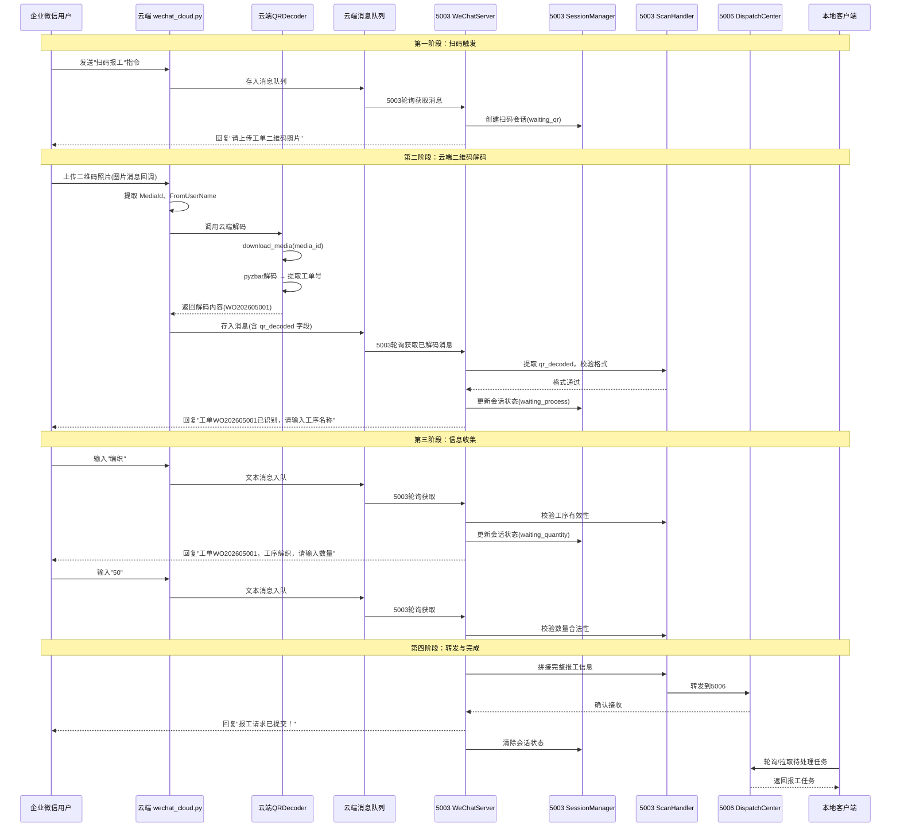
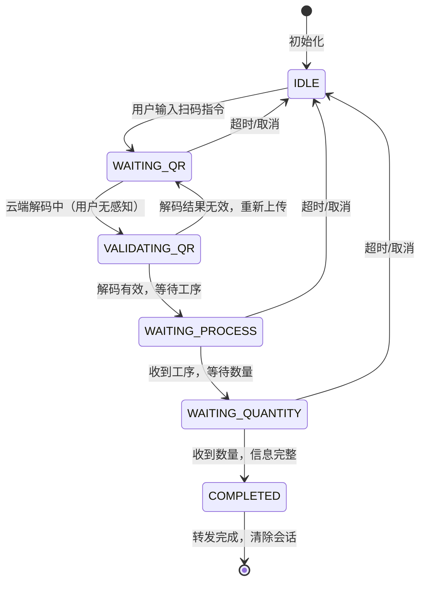
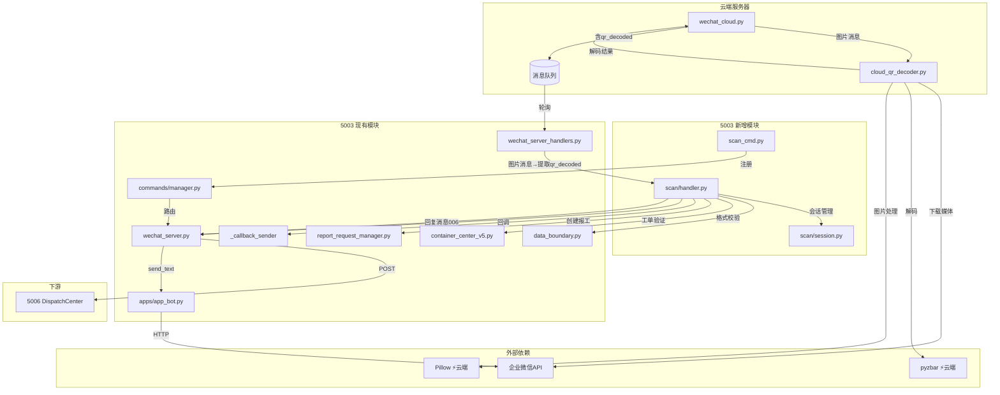

# DESIGN_企业微信扫码报工.md

## 项目名称
企业微信扫码报工

---

## 一、整体架构

### 1.1 架构图

```mermaid
graph TB
    subgraph 企业微信
        WX[企业微信客户端]
        WXAPI[企业微信API]
    end

    subgraph 云端服务器（独立部署）
        WC[wechat_cloud.py<br/>云端服务]
        CQR[CloudQRDecoder<br/>云端二维码解码器]
        MQ[(消息队列 deque)]
        CM[cloud_matching<br/>云端匹配]
    end

    subgraph 5003 应用服务器
        WS[WeChatServer]
        SH[ScanHandler<br/>扫码处理器]
        SM[SessionManager<br/>会话管理器]
        CMG[CommandManager<br/>指令管理器]
        CC[ContainerCenter<br/>容器中心]
    end

    subgraph 调度中心 5006
        DC[DispatchCenter<br/>调度中心]
        FM[ForwardManager<br/>转发管理]
    end

    subgraph 本地端
        LC[LocalClient<br/>本地客户端]
    end

    WX -->|1.发送指令"扫码报工"| WXAPI
    WXAPI -->|2.HTTP回调| WC
    WC -->|3.存入队列| MQ
    MQ -->|4.轮询消费| WS
    WS -->|5.识别扫码指令| CMG
    WS -->|6.回复上传二维码| WXAPI
    WXAPI -->|7.显示提示| WX

    WX -->|8.上传二维码照片| WXAPI
    WXAPI -->|9.图片消息回调| WC
    WC -->|10.下载媒体文件| WXAPI
    WXAPI -->|11.返回图片数据| WC
    WC -->|12.解码二维码| CQR
    CQR -->|13.解码结果| WC
    WC -->|14.携带qr_decoded入队| MQ
    MQ -->|15.轮询获取含解码结果的消息| WS
    WS -->|16.提取qr_decoded| SH
    SH -->|17.校验工单格式| WS

    WS -->|18a.格式合格→回复下一步| WXAPI
    WS -->|18b.格式不合格→回复重新上传| WXAPI

    WX -->|19.输入工序/数量| WXAPI
    WXAPI -->|20.文本消息回调| WC
    WC -->|21.存入队列| MQ
    MQ -->|22.轮询消费| WS
    WS -->|23.会话状态机处理| SM
    SM -->|24.逐步收集信息| WS

    WS -->|25.拼接完整信息| SH
    SH -->|26.转发报工请求| DC
    DC -->|27.存储待处理| FM
    LC -->|28.轮询拉取| DC
```

### 1.2 时序图



---

## 二、分层设计

### 2.1 新增/修改目录结构

```
├── [云端侧] wechat_cloud.py                    # 改造：新增二维码解码处理分支
├── [云端侧] cloud_qr_decoder.py               # 新增：云端二维码解码器模块
│
├── [5003侧] scan/
│   ├── __init__.py
│   ├── handler.py           # ScanHandler - 扫码业务处理器（接收已解码数据）
│   └── session.py           # SessionManager - 会话状态管理器
│
├── [5003侧] commands/
│   ├── scan_cmd.py          # 新增：扫码指令（扩展指令管理器）
│   └── ...                  # 现有指令不变
│
├── [5003侧] wechat_server_handlers.py          # 改造：处理携带有 qr_decoded 的图片消息
│
└── [共用] api/
    └── scan.py              # 改造：与微信端扫码互通
```

### 2.2 各层职责

| 部署位置 | 模块 | 职责 |
|----------|------|------|
| **云端侧** | `wechat_cloud.py` | 接收微信回调；图片消息分支触发二维码解码；将解码结果写入队列 |
| **云端侧** | `cloud_qr_decoder.py` | 二维码解码核心：下载微信媒体文件、PIL解码、pyzbar识别、提取工单号 |
| **5003侧** | `scan/handler.py` | 扫码业务编排：从已解码数据中提取信息、校验、会话管理、转发 |
| **5003侧** | `scan/session.py` | 会话状态机：管理每个用户的多轮交互状态 |
| **5003侧** | `commands/scan_cmd.py` | 扫码指令：触发扫码报工流程 |
| **5003侧** | `wechat_server_handlers.py` | 接收云端队列中已含 `qr_decoded` 的图片消息，路由到 ScanHandler |

### 2.3 会话状态定义



会话状态常量定义：

| 状态 | 值 | 说明 |
|------|-----|------|
| `IDLE` | `idle` | 空闲状态，无活跃会话 |
| `WAITING_QR` | `waiting_qr` | 等待用户上传二维码图片 |
| `VALIDATING_QR` | `validating_qr` | 云端正在解码（5003侧等待轮询结果） |
| `WAITING_PROCESS` | `waiting_process` | 等待用户输入工序名称 |
| `WAITING_QUANTITY` | `waiting_quantity` | 等待用户输入数量 |
| `COMPLETED` | `completed` | 信息收集完成，待转发 |

---

## 三、核心组件设计

### 3.1 云端侧：CloudQRDecoder（二维码解码器）

部署在 `wechat_cloud.py` 同侧，作为独立模块 `cloud_qr_decoder.py`。

```python
class CloudQRDecoder:
    """
    云端二维码解码器（运行在 wechat_cloud.py 所在服务器）

    职责：
    - 通过企业微信 media_id 下载图片（云端直接调用企业微信API）
    - 使用 pyzbar + PIL 本地解码
    - 提取工单编号
    - 清理临时图片文件

    与5003的解耦：解码结果通过云端消息队列的 qr_decoded 字段传递，
    5003侧不需要任何图片处理能力和解码库。
    """

    # 临时图片存储目录（云服务器本地）
    TEMP_IMAGE_DIR = 'temp_qr_images'

    # 图片保留时间（小时）
    IMAGE_RETENTION_HOURS = 24

    def __init__(self, corp_id: str, agent_id: str, secret: str)
        """
        初始化云端解码器

        Args:
            corp_id: 企业ID（用于获取access_token下载媒体）
            agent_id: 应用AgentID
            secret: 应用Secret
        """

    def download_media(self, media_id: str) -> Optional[str]
        """
        通过企业微信 media/get API 下载图片

        Args:
            media_id: 企业微信媒体文件ID

        Returns:
            str: 本地临时文件路径，失败返回 None
        """

    def decode_qr(self, image_path: str) -> Optional[str]
        """
        解码本地图片中的二维码

        Args:
            image_path: 图片本地路径

        Returns:
            str: 解码后的文本内容，失败返回 None
        """

    def extract_order_no(self, decoded_text: str) -> Optional[str]
        """
        从解码文本中提取工单号

        支持格式：
        - WO:WO202605001
        - ORD:ORD202605001
        - WO202605001（简写）
        - 纯数字（后4位）

        Args:
            decoded_text: 二维码解码后的原始文本

        Returns:
            str: 提取的工单号，无法识别返回None
        """

    def cleanup_temp_images(self)
        """清理过期的临时图片文件（定时任务调用）"""
```

**云端解码流程**：

```
微信图片回调
    → wechat_cloud.py 提取 MediaId
    → CloudQRDecoder.download_media(media_id) → 本地临时文件
    → CloudQRDecoder.decode_qr(image_path) → pyzbar解码 → 文本
    → CloudQRDecoder.extract_order_no(text) → 工单号
    → 解码结果写入消息队列（携带 qr_decoded 和 order_no 字段）
    → 5003轮询消费
```

### 3.2 5003侧：SessionManager（会话管理器）

```python
class SessionManager:
    """
    扫码报工会话管理器（运行在5003侧）

    管理每个用户的多轮交互状态，支持：
    - 创建/更新/清除会话
    - 超时自动清理
    - 状态查询
    """

    # 会话超时时间（秒）
    SESSION_TIMEOUT = 300  # 5分钟

    # 清理间隔（秒）
    CLEANUP_INTERVAL = 60  # 1分钟

    def create_session(self, user_id: str) -> dict
        """创建新的扫码会话，初始状态 WAITING_QR"""

    def get_session(self, user_id: str) -> Optional[dict]
        """获取用户的当前会话"""

    def update_session(self, user_id: str, updates: dict) -> bool
        """更新会话状态和数据"""

    def clear_session(self, user_id: str)
        """清除用户的会话"""

    def is_in_scan(self, user_id: str) -> bool
        """判断用户是否在扫码报工流程中"""

    def cleanup_expired(self)
        """清理超时会话（定时任务）"""
```

**会话数据结构**：

```python
session = {
    'user_id': 'YuanGangBiao',         # 企业微信用户ID
    'state': 'waiting_qr',             # 当前状态
    'created_at': 1712345678.0,        # 创建时间戳
    'updated_at': 1712345678.0,        # 最后更新时间戳
    'data': {
        'order_no': None,              # 云端解码后的工单号
        'process': None,               # 工序名称
        'quantity': None,              # 数量
        'media_id': '',                # 原始媒体ID（仅记录）
    }
}
```

> 注意：5003侧会话中 **不存储图片文件路径**，图片只在云端侧临时保存。

### 3.3 5003侧：ScanHandler（扫码处理器）

```python
class ScanHandler:
    """
    扫码报工业务处理器（运行在5003侧）

    编排整个扫码报工流程，接收云端已解码的 qr_decoded 数据，
    协调会话管理器、指令管理器、容器中心等组件。

    与云端解码器的边界：
    - 云端负责：图片下载、二维码解码、提取工单号
    - 5003负责：工单格式校验、会话管理、业务引导、转发5006
    """

    def __init__(self, session_manager, command_manager,
                 container_center, app_bot)

    def handle_scan_command(self, user_id: str) -> str
        """处理扫码指令，创建会话，返回回复消息"""

    def handle_qr_decoded(self, user_id: str,
                          qr_data: dict) -> str
        """
        处理云端已解码的二维码数据

        Args:
            user_id: 企业微信用户ID
            qr_data: 云端解码结果，包含:
                - order_no: 工单号
                - decoded_text: 原始解码文本
                - success: 是否解码成功

        Returns:
            str: 回复给用户的消息
        """

    def handle_process_input(self, user_id: str, process: str) -> str
        """处理工序输入，校验并更新会话，返回回复消息"""

    def handle_quantity_input(self, user_id: str, quantity: int) -> str
        """处理数量输入，拼接完整信息，转发5006，返回回复消息"""

    def handle_cancel(self, user_id: str) -> str
        """处理取消操作，清除会话，返回回复消息"""

    def _validate_order_no(self, order_no: str) -> ValidationResult
        """校验工单号格式（复用 data_boundary）"""

    def _forward_to_5006(self, report_data: dict) -> bool
        """转发完整报工信息到5006调度中心"""

    def _build_report_data(self, session: dict) -> dict
        """拼接完整的报工数据"""

    def _is_user_in_scan_session(self, user_id: str) -> bool
        """判断用户是否在扫码报工会话中（用于消息路由拦截）"""
```

### 3.4 5003侧：ScanCommand（扫码指令）

扩展 `commands/manager.py`，注册新的扫码指令：

```python
class ScanCommand(BaseCommand):
    """
    扫码报工指令

    触发扫码报工流程：
    - 扫码报工
    - 扫一扫
    - 扫码
    - scan

    触发后回复提示用户上传二维码照片，
    后续图片消息由云端 side 解码后进入会话处理。
    """

    TRIGGER_KEYWORDS = ['扫码报工', '扫一扫', '扫码', 'scan', 'saoma']

    def parse(self, text: str) -> ParsedCommand
    def execute(self, parsed: ParsedCommand, context: dict) -> CommandResult
```

### 3.5 云端侧：wechat_cloud.py 图片消息改造

```python
# 在 wechat_cloud.py 的微信回调处理分支中新增二维码解码逻辑

def wechat_callback():
    """微信回调处理（已有逻辑，改造图片消息分支）"""
    # ... 现有解密、解析逻辑 ...
    msg_type = parsed_message.get('MsgType', '')

    if msg_type == 'image':
        # 新增：二维码解码分支
        media_id = parsed_message.get('MediaId', '')
        from_user = parsed_message.get('FromUserName', '')

        # 调用云端解码器
        decoder = CloudQRDecoder(corp_id, agent_id, secret)
        image_path = decoder.download_media(media_id)
        if image_path:
            decoded_text = decoder.decode_qr(image_path)
            order_no = decoder.extract_order_no(decoded_text) if decoded_text else None
            # 解码结果写入消息数据
            parsed_message['qr_decoded'] = {
                'success': order_no is not None,
                'decoded_text': decoded_text or '',
                'order_no': order_no or '',
            }
        else:
            parsed_message['qr_decoded'] = {
                'success': False,
                'decoded_text': '',
                'order_no': '',
            }

        # 清理临时图片
        if image_path:
            decoder.cleanup_temp_images()

    # 消息入队（携带 qr_decoded）
    message_queue.append(parsed_message)
```

### 3.6 5003侧：wechat_server_handlers.py 改造

```python
# 在 handle_image_message 中处理云端已解码的数据

def handle_image_message(data):
    """
    处理图片消息（从云端轮询获取，已含 qr_decoded 字段）

    Args:
        data: 云端消息字典，可能包含:
            - PicUrl, MediaId, FromUserName (原始字段)
            - qr_decoded: 云端解码结果（新增）
                - success: bool
                - decoded_text: str
                - order_no: str
    """
    from_user = data.get('FromUserName', '')
    qr_decoded = data.get('qr_decoded', None)

    if not qr_decoded:
        logger.info(f'[图片消息] from={from_user}，无解码数据，按普通图片处理')
        return

    # 路由到 ScanHandler
    if _wechat_handler and hasattr(_wechat_handler, 'scan_handler'):
        handler = _wechat_handler.scan_handler
        reply = handler.handle_qr_decoded(from_user, qr_decoded)
        if reply and _wechat_handler.app_bot:
            _wechat_handler.app_bot.send_text(reply, user_id=from_user)
```

---

## 四、接口契约

### 4.1 云端消息队列数据格式（核心接口）

云端消息队列中，图片消息的数据结构扩展 `qr_decoded` 字段：

```json
{
    "MsgType": "image",
    "FromUserName": "YuanGangBiao",
    "MediaId": "3W8xQp9K2m5N7vB1",
    "PicUrl": "https://...",
    "MsgId": "1234567890",
    "CreateTime": "1712345678",

    "qr_decoded": {
        "success": true,
        "decoded_text": "WO:WO202605001",
        "order_no": "WO202605001"
    }
}
```

解码失败时：

```json
{
    "MsgType": "image",
    "FromUserName": "YuanGangBiao",
    "MediaId": "3W8xQp9K2m5N7vB1",
    "qr_decoded": {
        "success": false,
        "decoded_text": "",
        "order_no": ""
    }
}
```

### 4.2 企业内部接口

#### WeChatServer（5003）改造路由

| 位置 | 说明 |
|------|------|
| `wechat_server_handlers.py` → `handle_image_message` | **新增实现**：从 `data.qr_decoded` 提取解码结果，路由到 ScanHandler |
| `commands/manager.py` | **注册新指令**：`ScanCommand` 处理"扫码报工"关键词 |
| `wechat_server.py` → `WechatMessageHandler.handle` | **改造**：在文本消息处理前添加扫码会话拦截（会话中的非扫码指令路由到 ScanHandler） |

#### 云端 wechat_cloud.py 改造

| 位置 | 说明 |
|------|------|
| `wechat_callback()` 中 `msg_type == 'image'` 分支 | **新增**：调用 CloudQRDecoder 解码，将结果写入 `qr_decoded` 字段 |

#### 转发到5006的接口

| 项目 | 值 |
|------|-----|
| 方法 | `POST` |
| 路径 | `http://127.0.0.1:5006/api/forward` |
| Content-Type | `application/json` |

**请求体**（扫码报工转发数据，与手动报工格式对齐）：

```json
{
    "type": "scan_report",
    "source": "wechat_scan",
    "msg_id": "wx_scan_1712345678",
    "order_no": "WO202605001",
    "process": "编织",
    "quantity": 50,
    "operator": "YuanGangBiao",
    "operator_name": "袁刚标",
    "timestamp": "2026-05-11T09:30:00",
    "scan_source": true,
    "report_data": {
        "order_no": "WO202605001",
        "process": "编织",
        "quantity": 50,
        "completed": false
    }
}
```

### 4.3 企业微信交互接口

#### 下行消息（5003 → 企业微信）

| 场景 | 消息类型 | 内容示例 |
|------|----------|----------|
| 扫码触发响应 | text | "请上传工单二维码照片" |
| 二维码解码失败 | text | "❌ 无法识别二维码，请重新上传清晰的工单二维码照片" |
| 工单识别成功 | text | "✅ 已识别工单 WO202605001，请输入工序名称（如：编织、裁剪）" |
| 工序确认 | text | "✅ 工序：编织，请输入报工数量" |
| 完成通知 | text | "✅ 报工请求已提交！\n工单：WO202605001\n工序：编织\n数量：50件\n正在等待主软件确认..." |
| 取消成功 | text | "已取消扫码报工" |
| 超时提示 | text | "⏰ 扫码报工已超时，请重新发送"扫码报工"开始" |

#### 上行消息（企业微信 → 云端 → 5003）

| 场景 | 消息类型 | 内容 |
|------|----------|------|
| 触发扫码 | text | "扫码报工" / "扫一扫" / "扫码" |
| 上传二维码 | image | 图片消息，含 MediaId（云端解码后写入 qr_decoded） |
| 输入工序 | text | 工序名称，如"编织" |
| 输入数量 | text | 数字，如"50" |
| 取消操作 | text | "取消" / "Cancel" |

### 4.4 模块间接口

#### 云端 CloudQRDecoder 内部接口

```python
# 下载媒体文件（云端 → 企业微信API）
image_path = cloud_qr_decoder.download_media(media_id: str) -> Optional[str]

# 解码二维码（云端本地）
decoded_text = cloud_qr_decoder.decode_qr(image_path: str) -> Optional[str]

# 提取工单号（云端本地）
order_no = cloud_qr_decoder.extract_order_no(decoded_text: str) -> Optional[str]
```

#### 5003 ScanHandler 接口

```python
# 处理已解码的二维码数据（接收云端结果）
reply = scan_handler.handle_qr_decoded(
    user_id: str,
    qr_data: {
        'success': bool,
        'decoded_text': str,
        'order_no': str
    }
) -> str
```

#### 5003 SessionManager 接口

```python
session = session_manager.create(user_id: str) -> dict
session = session_manager.get(user_id: str) -> Optional[dict]
session_manager.update(user_id: str, state: str, data: dict) -> bool
session_manager.clear(user_id: str)
in_scan = session_manager.is_in_scan(user_id: str) -> bool
```

---

## 五、数据流向图

### 5.1 完整数据流（云端解码版）

```mermaid
flowchart TD
    subgraph 用户端
        A[用户输入"扫码报工"]
        F[用户上传二维码照片]
        V[用户输入"编织"]
        AB[用户输入"50"]
    end

    subgraph 云端 wechat_cloud.py
        A2[接收回调存入队列]
        F2[接收图片消息回调]
        F3[CloudQRDecoder\n下载媒体]
        F4[pyzbar解码]
        F5[提取工单号]
        F6[写入qr_decoded入队]
    end

    subgraph 5003
        B[轮询消费]
        C[CommandManager\n识别扫码指令]
        D[SessionManager\n创建会话]
        G[轮询获取\n含qr_decoded消息]
        H{解码成功?}
        I[回复重新上传]
        J[提取工单号]
        K[data_boundary\n校验格式]
        L{格式通过?}
        M[容器中心验证\n工单存在]
        N{工单有效?}
        O[回复"工单不存在"]
        P[更新会话\nstate=waiting_process]
        Q[回复"请输入工序"]
        W[接收文本]
        X{是否在\nwaiting_process?}
        Y[按普通指令处理]
        Z[记录工序\nstate=waiting_quantity]
        AA[回复"请输入数量"]
        AC[接收文本]
        AD{是否在\nwaiting_quantity?}
        AE[记录数量]
        AF[拼接完整报工数据]
        AG[转发POST到\n5006/api/forward]
    end

    subgraph 5006/本地
        AH{转发成功?}
        AI[回复"报工已提交"]
        AJ[回复"提交失败"]
        AK[清除会话]
        AL[本地客户端轮询]
        AM[返回待处理任务]
        AN[执行报工]
    end

    A --> A2 --> B --> C --> D --> Q
    F --> F2 --> F3 --> F4 --> F5 --> F6
    F6 --> G --> H
    H -->|否| I
    H -->|是| J --> K --> L
    L -->|否| I
    L -->|是| M --> N
    N -->|否| O
    N -->|是| P --> Q

    V --> W --> X
    X -->|否| Y
    X -->|是| Z --> AA

    AB --> AC --> AD
    AD -->|否| Y
    AD -->|是| AE --> AF --> AG --> AH
    AH -->|是| AI --> AK
    AH -->|否| AJ
    AL --> AM --> AN
```

### 5.2 消息类型扩展

| 类型标识 | 说明 | 处理位置 |
|----------|------|----------|
| `wechat_message` | 普通微信文本消息（已有） | 5003 CommandManager |
| `image` + `qr_decoded` | 含云端解码结果的图片消息（新增） | 5003 ScanHandler |
| `scan_report` | 扫码报工转发（新增） | 5006 DispatchCenter |

---

## 六、异常处理策略

### 6.1 异常场景处理

| 异常场景 | 异常位置 | 处理方式 | 用户提示 |
|----------|----------|----------|----------|
| 云端图片下载失败 | 云端 | 写入 `qr_decoded.success=false`，5003提示重试 | "图片下载失败，请重新上传" |
| 二维码解码失败 | 云端 | 写入 `qr_decoded.success=false`，不清除会话 | "无法识别二维码，请确保照片清晰，重新拍摄上传" |
| 二维码内容非工单号 | 云端 | `extract_order_no` 返回 None，`success=false` | "该二维码不是有效的工单二维码，请重新上传" |
| 工单号格式不匹配 | 5003 | data_boundary 校验失败，不清除会话 | "二维码中的工单号格式不正确" |
| 工单在系统中不存在 | 5003 | 容器中心查询无记录，清除会话 | "该工单在系统中不存在，请联系管理员" |
| 用户中途取消 | 5003 | 清除会话 | "已取消扫码报工" |
| 会话超时 | 5003 | 定时清理任务自动清除 | "操作超时，请重新发送'扫码报工'开始" |
| 转发5006失败 | 5003 | 提示系统繁忙，保留会话 | "系统繁忙，请稍后重试" |
| 云端队列满 | 云端 | 丢弃最早消息，记录告警 | 5003轮询不到消息，用户可重试 |
| 工序为空/无效 | 5003 | 提示重新输入，不清除会话 | "工序名称不能为空，请输入有效工序" |
| 数量格式错误 | 5003 | 提示重新输入，不清除会话 | "请输入有效数字" |
| 数量超过计划量 | 5003 | 提示超出范围，不清除会话 | "报工数量超出计划量（计划500件），请重新输入" |

### 6.2 降级策略

| 场景 | 降级方案 |
|------|----------|
| **云端** pyzbar 库缺失 | 云端回退：`qr_decoded.success=false`，5003提示用户手动输入工单号 |
| **云端** 企业微信媒体API不可用 | 云端回退：`qr_decoded.success=false`，5003提示稍后重试 |
| 容器中心不可用 | 5003提示"系统维护中，请稍后"，不清除会话 |
| 云端服务不可用 | 5003轮询超时，提示用户稍后重试，保留会话 |

---

## 七、新增依赖

### 7.1 云端侧依赖（部署在云服务器）

| 依赖包 | 用途 | 安装位置 | 安装命令 |
|--------|------|----------|----------|
| `pyzbar` | 二维码解码 | **云端侧** `wechat_cloud.py` 所在服务器 | `pip install pyzbar` |
| `Pillow` | 图片处理 | **云端侧** `wechat_cloud.py` 所在服务器 | `pip install Pillow` |

### 7.2 5003侧（零新增依赖）

| 模块 | 说明 |
|------|------|
| 5003侧 | **不需要** pyzbar、Pillow 等任何图片解码库 |
| 5003侧 | 二维码解码结果直接从云端队列数据的 `qr_decoded` 字段获取 |

> 注：Windows下 pyzbar 需要预装 ZBar 库，可通过 `pip install pyzbar` 自动安装。此依赖仅部署在云服务器，5003侧不受影响。

---

## 八、关键技术细节

### 8.1 云端图片获取与解码（云端侧 wechat_cloud.py）

企业微信图片消息中携带 `MediaId`，云端通过企业微信API下载：

```python
def download_and_decode_qr(media_id: str, access_token: str) -> dict:
    """
    云端下载图片并解码二维码

    Args:
        media_id: 企业微信媒体文件ID
        access_token: 企业微信access_token

    Returns:
        dict: {'success': bool, 'decoded_text': str, 'order_no': str}
    """
    # 1. 下载图片
    url = f"https://qyapi.weixin.qq.com/cgi-bin/media/get?access_token={access_token}&media_id={media_id}"
    temp_path = f"temp_qr_{int(time.time())}_{media_id[-8:]}.jpg"

    try:
        resp = requests.get(url, stream=True, timeout=15)
        if resp.status_code != 200:
            return {'success': False, 'decoded_text': '', 'order_no': ''}

        with open(temp_path, 'wb') as f:
            for chunk in resp.iter_content(chunk_size=8192):
                f.write(chunk)

        # 2. 解码二维码
        from PIL import Image
        from pyzbar.pyzbar import decode

        image = Image.open(temp_path)
        results = decode(image)
        if not results:
            return {'success': False, 'decoded_text': '', 'order_no': ''}

        decoded_text = results[0].data.decode('utf-8')

        # 3. 提取工单号
        order_no = extract_order_no_from_qr(decoded_text)

        return {
            'success': order_no is not None,
            'decoded_text': decoded_text,
            'order_no': order_no or ''
        }

    except Exception:
        return {'success': False, 'decoded_text': '', 'order_no': ''}
    finally:
        # 4. 清理临时文件
        if os.path.exists(temp_path):
            os.remove(temp_path)
```

### 8.2 云端二维码内容提取

```python
def extract_order_no_from_qr(decoded_text: str) -> Optional[str]:
    """
    从二维码解码文本中提取工单号

    支持格式：
    - "WO:WO202605001" → WO202605001
    - "ORD:ORD202605001" → ORD202605001
    - "WO202605001" → WO202605001
    - 纯数字/其他 → 直接返回

    Args:
        decoded_text: 二维码原始解码文本

    Returns:
        str: 提取的工单号
    """
    text = decoded_text.strip()

    if text.startswith('WO:'):
        return text[3:]
    elif text.startswith('ORD:'):
        return text[4:]
    elif text.upper().startswith('WO'):
        return text
    else:
        return text
```

### 8.3 与现有报工流程的集成

扫码报工的完整数据在收集完成后，通过以下方式与现有报工流程对接：

1. **直接调用** `report_request_manager.create_request()` 创建报工请求
2. **复用** `_callback_sender.send()` 发送回调到主软件
3. **同时转发** 完整数据到5006，供本地客户端轮询

这样扫码报工和手动报工最终汇入同一条处理管道，实现流程复用。

### 8.4 云端与5003的解耦边界

```
┌──────────────────────────────────────────────────────────┐
│                    云端服务器                              │
│  ┌─────────────────────┐    ┌─────────────────────────┐  │
│  │ 接收微信回调         │    │ CloudQRDecoder           │  │
│  │ - 文本→直接入队      │───▶│ - 下载媒体文件            │  │
│  │ - 图片→触发解码      │    │ - pyzbar 解码            │  │
│  │ - 事件→忽略         │    │ - 提取工单号              │  │
│  └─────────┬───────────┘    └───────────┬─────────────┘  │
│            │                            │               │
│            ▼                            ▼               │
│  ┌────────────────────────────────────────────────────┐  │
│  │              消息队列 (deque)                       │  │
│  │  {text消息} | {image消息 + qr_decoded字段}          │  │
│  └──────────────────────┬─────────────────────────────┘  │
└─────────────────────────┼────────────────────────────────┘
                          │ 轮询（HTTP long-polling）
┌─────────────────────────┼────────────────────────────────┐
│                   5003 应用服务器                          │
│  ┌──────────────────────▼──────────────────────────────┐ │
│  │  wechat_server_handlers.py                          │ │
│  │  - handle_text_message → ScanHandler会话拦截        │ │
│  │  - handle_image_message → 提取 qr_decoded 字段      │ │
│  │                       → ScanHandler.handle_qr_decoded│ │
│  └──────────────────────┬──────────────────────────────┘ │
│                         │                                │
│  ┌──────────────────────▼──────────────────────────────┐ │
│  │  ScanHandler (5003侧)                               │ │
│  │  - 格式校验(data_boundary)                          │ │
│  │  - 工单验证(ContainerCenter)                        │ │
│  │  - 会话状态管理(SessionManager)                     │ │
│  │  - 信息拼接转发(5006)                               │ │
│  └─────────────────────────────────────────────────────┘ │
└──────────────────────────────────────────────────────────┘
```

**解耦关键点**：
- 云端负责图片下载和二维码解码，5003不需要任何图片处理能力
- 云端在消息队列中写入 `qr_decoded` 字段，5003通过该字段获取解码结果
- 云端和5003都不需要修改现有通信架构，完全复用消息队列机制
- 5003侧新增 `scan/` 模块处理业务逻辑，不涉及图片文件操作

---

## 九、接口完整汇总

### 9.1 内部接口清单

| 接口 | 方向 | 协议 | 说明 |
|------|------|------|------|
| 云端 → 企业微信API | 出站 | HTTPS | 下载媒体文件（media/get） |
| 云端 → 云端队列 | 内部 | 内存deque | 写入含 `qr_decoded` 的消息 |
| 云端队列 → 5003 | 跨服务 | HTTP轮询 | 5003轮询消费云端消息 |
| 5003 → 5006 | 出站 | HTTP | 转发扫码报工数据 |
| 5003 → ContainerCenter | 内部调用 | Python API | 验证工单、获取工序 |
| 5003 → data_boundary | 内部调用 | Python API | 格式校验 |
| 5003 → report_request_manager | 内部调用 | Python API | 创建报工请求 |

### 9.2 外部依赖接口

| 接口 | 调用方 | 用途 | 频率 |
|------|--------|------|------|
| 企业微信 `media/get` | **云端** | 下载用户上传的图片 | 每次扫码 |
| 企业微信 `message/send` | 5003 | 发送回复消息 | 每次交互 |

---

## 十、潜在瓶颈与扩展考虑

### 10.1 潜在瓶颈

| 瓶颈 | 位置 | 说明 | 缓解措施 |
|------|------|------|----------|
| 图片解码性能 | 云端 | 大图片解码耗时 | 解码前压缩图片，限制最大分辨率 |
| 临时文件堆积 | 云端 | 图片长期不清理 | 及时清理（finally 块删除）+ 定时清理兜底 |
| 云端消息队列溢出 | 云端 | deque 最大5000条 | 超限时丢弃最早消息，记录告警 |
| 5003轮询延迟 | 5003 | 轮询间隔影响实时性 | 配置合理轮询间隔（建议≤1秒） |
| 企业微信API限流 | 云端 | 媒体文件下载频次限制 | 云端添加重试机制和退避策略 |

### 10.2 扩展考虑

| 场景 | 扩展方案 |
|------|----------|
| 支持其他实体二维码 | 云端 `extract_order_no` 扩展逻辑，支持订单号、物料码等 |
| 批量扫码 | 5003侧扩展会话状态机，支持批量模式下重复扫码-录入 |
| 扫码排产确认 | 复用扫码识别逻辑，状态机切换为排产确认模式 |
| 云端解码API化 | 将云端解码能力封装为独立API（`POST /api/qr/decode`），供其他模块调用 |
| Web管理端查看扫码记录 | 云端侧新增扫码日志表，记录每次扫码操作 |

---

## 十一、模块依赖关系



---

**文档版本**: v2.0（云端解码架构）
**创建日期**: 2026-05-11
**更新说明**: 二维码图片识别功能从5003本地迁移到云端（`wechat_cloud.py` + `cloud_qr_decoder.py`），5003侧零图片依赖
