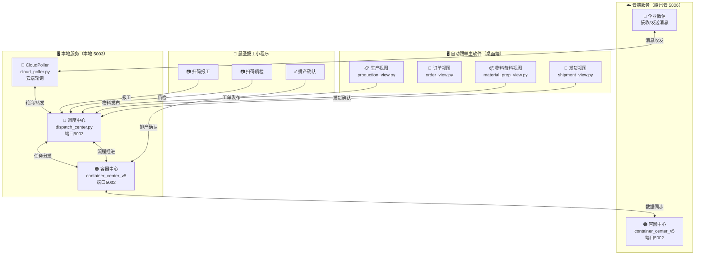
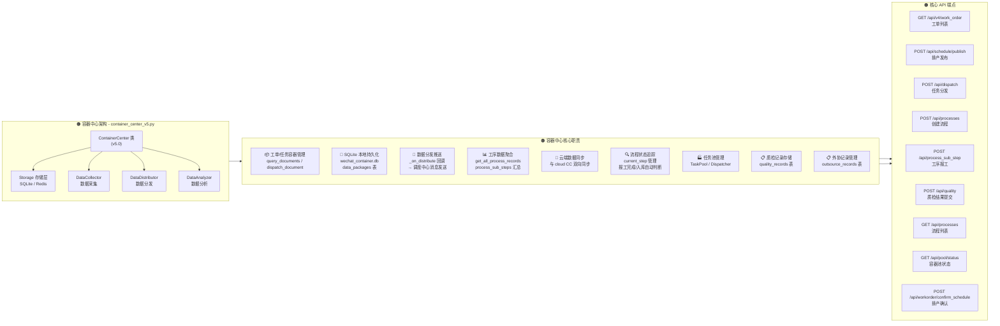
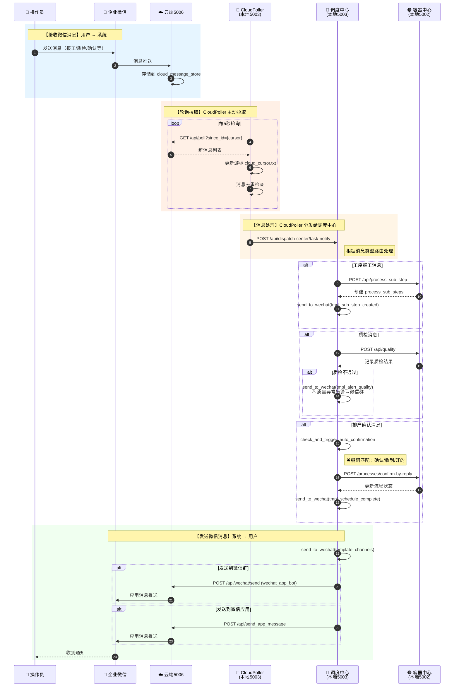
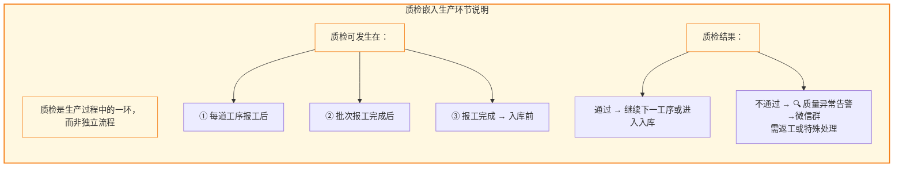

# 全流程架构图 - 从订单到发货（含质检环节）

## 图例说明

| 符号 | 含义 |
|------|------|
| 🔵 实体 | 外部参与者或系统 |
| 🟢 主流程节点 | 工单生命周期的核心阶段 |
| 🟡 事件/通知 | 触发的事件或微信通知 |
| 🟠 容器中心 | Container Center 职责范围 |
| 🔴 调度中心 | Dispatch Center 职责范围 |
| 📱 微信 | 企业微信通知链路 |

---

## 一、整体系统架构



---

## 二、主业务流程（含质检生产环节）

```mermaid
flowchart TD
    START([🎯 起点：自动跟单主软件建立订单])

    %% === 阶段一：订单 ===
    subgraph STAGE1["📋 阶段一：订单创建"]
        direction LR
        O1[📝 桌面端建立订单<br/>order_view.py<br/>→ MySQL orders 表]
        O2{订单已确认?}
        O1 --> O2
        O2 -->|否| O3[等待]
        O2 -->|是| O4[✅ 订单已确认<br/>Event: order:confirmed]
    end

    STAGE1 --> STAGE2

    %% === 阶段二：工单发布 ===
    subgraph STAGE2["📋 阶段二：工单发布"]
        direction LR
        W1[🖥️ 生产视图<br/>点击"发布任务"]
        W2[📡 POST /processes<br/>dispatch_center.py]
        W3[🟠 创建 process_records<br/>steps = 工单发布节点]
        W4[🔴 匹配流程模板<br/>不锈钢网带→production<br/>不锈钢丝→production]
        W5[📋 工序任务入容器池<br/>ContainerCenter<br/>dispatch_document]
        W6[🟡 tmpl_task_assigned<br/>📢 新任务通知→微信群]
        W1 --> W2 --> W3 --> W4 --> W5 --> W6
    end

    STAGE2 --> STAGE3

    %% === 阶段三：排产确认 ===
    subgraph STAGE3["📋 阶段三：晨圣报工排产确认"]
        direction LR
        S1[📱 晨圣报工小程序<br/>扫码确认排产]
        S2A[📡 POST /api/workorder<br/>/confirm_schedule]
        S2B[📡 POST /processes<br/>/confirm-by-reply<br/>微信回复"确认"关键词]
        S3[🟠 更新 process_records<br/>current_step → confirmed<br/>status → scheduled]
        S4[🟡 tmpl_schedule_complete<br/>✅ 排产完成确认→微信群]
        S5[📡 Event: production:confirmed<br/>AutoPublishService<br/>自动发布任务到容器池]
        S1 --> S2A
        S1 --> S2B
        S2A --> S3
        S2B --> S3
        S3 --> S4
        S3 --> S5
    end

    STAGE3 --> STAGE4

    %% === 阶段四：物料管理 ===
    subgraph STAGE4["📋 阶段四：物料计算与查询"]
        direction LR
        M1[🧮 物料计算<br/>MaterialPublishService<br/>计算用料需求]
        M2[📡 POST /material/requirements<br/>dispatch_center.py]
        M3[🟠 用料需求入容器池<br/>dispatch_document type=material]
        M4[🟡 tmpl_material_shortage<br/>⚠️ 物料短缺→微信群]
        M5[📦 物料到货查询<br/>tmpl_material_arrival<br/> 库存预警]
        M1 --> M2 --> M3 --> M4
        M4 --> M5
    end

    STAGE4 --> STAGE5

    %% === 阶段五：工序 ===
    subgraph STAGE5["📋 阶段五：工序计算与发布"]
        direction LR
        P1[🧮 工序计算<br/>根据 product_type<br/>匹配工序规则<br/>例：编织→链板冲压→整形校直→包装]
        P2[📋 更新 process_records.steps<br/>current_step 管理]
        P3[🖥️ 桌面端发布工序<br/>点击"发送"]
        P4[📡 POST /process-tasks/send]
        P5[🟠 工序任务入容器池]
        P6[🟡 tmpl_task_assigned<br/>📢 工序任务通知→微信群]
        P7[🟡 tmpl_process_start<br/>🚀 流程已启动→微信群]
        P1 --> P2 --> P3 --> P4 --> P5
        P5 --> P6
        P5 --> P7
    end

    STAGE5 --> STAGE6

    %% === 阶段六：生产+报工+质检 ===
    subgraph STAGE6["📋 阶段六：生产报工与质检（一体化循环）"]
        direction LR
        R0[🟠 开始生产<br/>status → in_production]
        R0 --> R1

        subgraph REPORT_LOOP["报工循环（可多次报工）"]
            direction LR
            R1[📱 晨圣报工小程序<br/>📷 扫码选择工序]
            R2[📡 POST /api/v1/report<br/>record_id + quantity]
            R3[🟠 创建 process_sub_steps<br/>step_name / batch_no / quantity]
            R4[🟠 current_step +1]
            R5[🟡 tmpl_sub_step_created<br/>📋 报工通知<br/>→ 微信应用消息<br/>含：工序/数量/报工人]
            R1 --> R2 --> R3 --> R4 --> R5
        end

        R5 --> QC_GATE

        subgraph QC_STEP["质检环节（生产过程中嵌入）"]
            direction TB
            QC_GATE{需要质检?}
            QC_GATE -->|是| Q1[📱 晨圣报工小程序<br/>📷 扫码质检]
            Q1 --> Q2[📡 POST /api/quality]
            Q3{质检结果<br/>passed?}
            Q4[🟡 tmpl_alert_quality<br/>🔍 质量异常告警→微信群]
            Q5[🟠 记录质检结果<br/>quality_records 表]
            Q3 -->|不通过| Q4 --> Q5
            Q3 -->|通过| Q5
        end

        QC_GATE -->|否| SKIP_QC[跳过质检]

        REPORT_LOOP --> QC_GATE
        QC_STEP --> MORE_REPORT

        MORE_REPORT{还有未完成的工序?}
        MORE_REPORT -->|是| R1
        MORE_REPORT -->|否| QC_CHECK
    end

    STAGE6 --> STAGE7

    %% === 阶段七：报工完成 ===
    subgraph STAGE7["📋 阶段七：报工完成"]
        direction LR
        C1{completed_qty<br/>≥ order_qty?}
        C2[🟡 Event: process:completed<br/>报工完成]
        C3[🟡 tmpl_process_advance<br/>📍 工序全部完成→微信群]
        C1 -->|否| C4[继续报工]
        C1 -->|是| C2 --> C3
        C4 -.-> R1
    end

    STAGE7 --> STAGE8

    %% === 阶段八：成品入库 ===
    subgraph STAGE8["📋 阶段八：成品入口/入库"]
        direction LR
        WH1{自动入库<br/>还是手动?}
        WH2[🤖 自动判断<br/>触发自动入库]
        WH3[🖥️ 手动点击<br/>"确认入库"]
        WH4[🟠 current_step → warehousing<br/>成品入库]
        WH5[🟡 tmpl_warehousing_notify<br/>📥 入库通知→微信群]
        WH1 -->|自动| WH2
        WH1 -->|手动| WH3
        WH2 --> WH4
        WH3 --> WH4
        WH4 --> WH5
    end

    STAGE8 --> STAGE9

    %% === 阶段九：发货 ===
    subgraph STAGE9["📋 阶段九：发货"]
        direction LR
        SH1[🖥️ 发货视图<br/>shipment_view.py<br/>点击"发货"]
        SH2[📡 确认发货<br/>orders 表<br/>status → shipped]
        SH3[🟡 tmpl_process_complete<br/>🎉 流程已完成→微信群]
        SH4[🟠 同步到云端<br/>ContainerCenter → CC_CLOUD]
        SH1 --> SH2 --> SH3
        SH2 --> SH4
    end

    STAGE9 --> END([✅ 订单完结])

    %% 样式
    classDef stage fill:#e3f2fd,stroke:#1565c0,stroke-width:2px
    classDef event fill:#fff3e0,stroke:#e65100,stroke-width:1.5px
    classDef cc fill:#e8f5e9,stroke:#2e7d32,stroke-width:2px
    classDef dc fill:#fce4ec,stroke:#c62828,stroke-width:2px
    classDef wechat fill:#f3e5f5,stroke:#7b1fa2,stroke-width:1.5px
    classDef decision fill:#fff8e1,stroke:#f9a825,stroke-width:1.5px
    classDef qcStep fill:#fff8e1,stroke:#f57f17,stroke-width:2px,stroke-dasharray:5,5
    classDef loop fill:#f1f8e9,stroke:#33691e,stroke-width:1.5px

    class STAGE1,STAGE2,STAGE3,STAGE4,STAGE5,STAGE6,STAGE7,STAGE8,STAGE9 stage
    class O4,W6,S4,M4,M5,P6,P7,C2,C3,WH5,SH3 event
    class CC_LOCAL,CC_CLOUD cc
    class CP,DC dc
    class WEWORK,MINI_SCAN,MINI_QC,MINI_CONFIRM wechat
    class O2,S1,C1,QC_GATE,WH1,MORE_REPORT decision
    class QC_STEP qcStep
    class REPORT_LOOP loop
```

---

## 三、流程状态映射（质检嵌入生产流程）

```mermaid
flowchart LR
    subgraph PRODUCTION_FLOW["🟢 生产流程（含质检）"]
        direction TB
        PF1["① 工单发布<br/>published | 计划部"]
        PF2["② 已排产<br/>confirmed | 计划部"]
        PF3["③ 生产中<br/>in_production | 生产部"]
        PF4_1["报工<br/>sub_step | 操作员"]
        PF4_2{"④ 质检<br/>quality_qc<br/>质检员<br/>⚠️质检嵌入生产" fill:#fff8e1,stroke:#f57f17,stroke-width:2px"]
        PF4_3["继续报工"]
        PF5["⑤ 报工完成<br/>report_complete | 自动"]
        PF6["⑥ 成品入库<br/>warehousing | 库存管理"]
        PF7["⑦ 发货<br/>shipped | 仓库"]
        PF8["⑧ 确认收货<br/>received | 客户"]
    end

    PF1 --> PF2 --> PF3
    PF3 --> PF4_1
    PF4_1 --> PF4_2
    PF4_2 -->|"通过"| PF4_3
    PF4_2 -->|"不通过"| PF4_3
    PF4_3 -->|"还有工序"| PF4_1
    PF4_3 -->|"工序完成"| PF5
    PF5 --> PF6 --> PF7 --> PF8

    style PF4_2 fill:#fff8e1,stroke:#f57f17,stroke-width:2px
    style PRODUCTION_FLOW fill:#e3f2fd,stroke:#1565c0,stroke-width:2px
```

---

## 四、容器中心职责（Container Center）



---

## 五、调度中心职责（Dispatch Center）

```mermaid
flowchart LR
    subgraph DC_ARCH["🔴 调度中心架构 - dispatch_center.py"]
        direction TB
        DC["DispatchContext 类<br/>单例 + 双检锁"]
        DC --> CC_CLIENT["ContainerCenterClient<br/>HTTP 客户端（云端）"]
        DC --> CC_LOCAL["ContainerCenter 实例<br/>本地 SQLite"]
        DC --> CP["CloudPoller<br/>云端轮询器"]
        DC --> CACHE["DispatchDataCache<br/>数据缓存"]
    end

    DC_ARCH --> DC_RESP

    subgraph DC_RESP["🔴 调度中心核心职责"]
        direction TB
        D1[📋 流程编排<br/>advanceProcess / confirmProcess<br/>rejectProcess]
        D2[📱 微信消息发送<br/>send_to_wechat<br/>微信群 + 应用消息]
        D3[👥 任务分配<br/>assignTask / reassignTask<br/>操作员管理]
        D4[🔁 事件驱动<br/>trigger_process_confirmation<br/>自动确认关键词回复]
        D5[📝 消息模板管理<br/>模板 CRUD / 默认重置<br/>模板变量替换]
        D6[⚙️ 流程匹配规则<br/>match_flow_type<br/>按 product_type 匹配流程]
        D7[🛠️ 报修/反馈管理<br/>repair_categories<br/>outsource_records]
        D8[📊 统计与告警<br/>stats / alerts<br/>dispatch_log]
    end

    subgraph DC_WECHAT["🔴 微信通知模板（质检相关）"]
        direction TB
        T1[tmpl_task_assigned<br/>任务分配通知]
        T2[tmpl_schedule_complete<br/>排产完成确认]
        T3[tmpl_material_shortage<br/>物料短缺预警]
        T4[tmpl_process_advance<br/>流程推进通知]
        T5[tmpl_process_complete<br/>流程完成通知]
        T6[tmpl_sub_step_created<br/>工序报工通知]
        T7[tmpl_alert_quality<br/>🔍 质量异常告警 ⚠️]
        T8[tmpl_warehousing_notify<br/>入库通知]
    end

    DC_RESP --> DC_WECHAT
```



---

## 六、微信消息发送链路



---

## 七、质检嵌入流程说明


