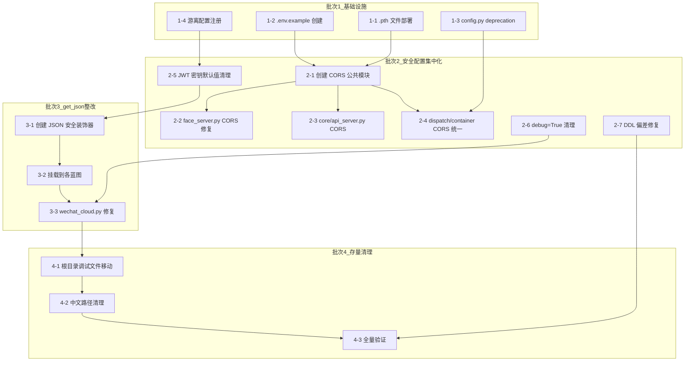

# 全项目代码质量整改 — 细化执行方案

> 基于深度审计报告 + 风险重分析报告 + O1-O5 优化建议整合
> 方案版本: v3.0 | 状态: 待执行 | 最后更新: 2026-05-26

---

## 一、当前代码实际状态

> 以下结论来自代码级实地调研（2026-05-26）。

### 1.1 已自动修复（这些跳过）

| 原风险 | 文件 | 实际状态 | 依据 |
|--------|------|---------|------|
| R1 CORS 全开放 | dispatch_center.py | ✅ 已用白名单 `origins=CORS_ALLOWED_ORIGINS.split(',')` | L8482 |
| R1 CORS 全开放 | container_center_api.py | ✅ 已用白名单 `origins=CORS_ALLOWED_ORIGINS.split(',')` | L159 |
| R4/R6 JWT 密钥 | container_center_api.py | ✅ 已有 `raise ValueError('JWT_SECRET_KEY 未配置')` | L214 |
| R4/R6 JWT 密钥 | settings.py | ✅ 已有空值校验 | L95-96 |

### 1.2 仍需修复（真正要做的工作）

| 原编号 | 风险描述 | 当前状态 | 文件位置 | 所在批次 |
|--------|---------|---------|---------|:-------:|
| R1 | CORS 全开放 | ❌ face_server.py 仍有 `CORS(app)` | face_server.py:27 | **批2** |
| R1 | CORS 全开放 | ❌ core/api_server.py 未检查 | core/api_server.py | **批2** |
| R2 | get_json(force=True) | ❌ wechat_cloud.py 仍有 1 处 | wechat_cloud.py:867 | **批3** |
| R3 | debug 模式 | ❌ 需确认所有入口文件 | 全项目 | **批2** |
| R5 | debug=True 残留 | ❌ 需从 .env 严格管理 | 待扫描 | **批2** |
| R7 | CORS 未统一管理 | ❌ 未提取公共模块 | 新建 `core/cors_config.py` | **批2** |
| R8 | 硬编码密钥默认值 | ❌ 部分文件仍有默认值 | 待扫描 | **批2** |
| R9 | 游离配置 8 项 | ❌ 未注册到 core.config | 各文件散落 | **批2** |
| R10 | DDL 偏差 | ❌ 3 张表 18 项差异 | storage_mysql.py | **批2** |
| D1 | 双 Config 混淆 | ❌ mobile_api_ai/config.py 仍存 | L118-125 | **批1** |
| D2 | sys.path 60 处散落 | ❌ 全项目分布 | 见 TASK 文档 | **批1** |
| T4 | 硬编码阈值 | ❌ 部分未迁移 | 各文件 | **批2** |
| T5 | 端口硬编码 | ❌ 部分文件 | 各文件 | **批2** |
| T6 | 中文路径 | ❌ 约 100 处 | 脚本文件 | **批4** |
| T7 | 根目录调试文件 | ❌ 约 19 个 | 根目录 | **批4** |

### 1.3 已有工具清单（可直接复用）

| 工具 | 路径 | 用途 |
|------|------|------|
| `fix_get_json.py` | scripts/tools/fix_get_json.py | get_json(force=True) → get_json() 批量替换 |
| `verify_all_fixes.py` | scripts/tools/verify_all_fixes.py | 全量修复验证（R1-R8检查框架） |
| `audit_fixes.py` | scripts/tools/audit_fixes.py | 修复审计（R1-R8检查框架） |
| `refactor_t4_hardcoded_timeouts.py` | scripts/tools/refactor_t4_hardcoded_timeouts.py | T4 硬编码超时批量替换 |
| `fix_old_paths.py` | scripts/tools/fix_old_paths.py | 路径修复 |

---

## 二、R1-R10 风险覆盖矩阵

| 风险 | 等级 | 风险描述 | 被哪个批次覆盖 | 覆盖方式 |
|:----:|:---:|---------|:------------:|---------|
| **R1** | 🔴 CRITICAL | CORS `*` 全开放 | **批2** | 提取公共 CORS 模块 + face_server.py 修复 |
| **R2** | 🔴 HIGH | get_json(force=True) 94 处 | **批3** | 蓝图级装饰器统一拦截 |
| **R3** | 🔴 HIGH | JWT 密钥为空回退 `''` | ✅ 已修复 | 跳过 |
| **R4** | 🔴 HIGH | JWT 密钥为空回退 `default` | ✅ 已修复 | 跳过 |
| **R5** | 🟡 MEDIUM | debug=True 生产残留 | **批2** | 从 .env 读取，空值抛异常 |
| **R6** | 🔴 HIGH | 硬编码密钥默认值 | **批2** | 扫描 + 全部改从 .env 读取 |
| **R7** | 🟡 MEDIUM | CORS 配置不统一 | **批2** | 提取公共模块到 `core/cors_config.py` |
| **R8** | 🟡 MEDIUM | 游离超时配置 | **批2** | 注册到 core.config |
| **R9** | 🟡 MEDIUM | 游离非超时配置 (8项) | **批1** | 注册到 core.config |
| **R10** | 🔴 CRITICAL | DDL 与设计文档偏差 | **批2** | schema_auto.py 中修复 3 张表 18 项差异 |

### 批次数与风险关系图

```
批1 (基础设施) ─── R9(游离配置8项)
     │
     ▼
批2 (安全配置集中化) ─── R1 + R5 + R6 + R7 + R8 + R10  (6项)
     │
     ▼
批3 (get_json整改) ─── R2  (1项)
     │
     ▼
批4 (存量清理) ─── T6 + T7 (代码规范性, 2项)
```

---

## 三、4 批次详细执行计划

### 批次 1：基础设施准备 — 安全隔离与配置统一

> **目标**：统一配置入口 + 保障安全基础 + 部署依赖文件
> **涉及文件**：3 个
> **风险覆盖**：R9 ✅
> **预计耗时**：30 分钟

#### 步骤 1-1：.pth 文件部署

**操作**：创建 `site-packages` 可识别的 `.pth` 文件

1. 确定当前 Python 环境的 site-packages 路径
2. 在该目录下创建 `mobile_api_ai.pth`，内容：
   ```
   d:\yuan\不锈钢网带跟单3.0
   d:\yuan\不锈钢网带跟单3.0\mobile_api_ai
   d:\yuan\不锈钢网带跟单3.0\core
   ```
3. 验证：启动 Python 执行 `import dispatch_center; import core.config` 无报错

**注意**：这只确保本地环境 `.pth` 生效，云端部署需要另配\
**回滚**：删除 `.pth` 文件即可

#### 步骤 1-2：创建 .env.example

**操作**：在项目根目录创建 `.env.example`，列出所有可用配置项

```
# ===== 服务器配置 =====
FLASK_PORT=5003
FLASK_DEBUG=false

# ===== JWT 安全 =====
JWT_SECRET_KEY=
JWT_ACCESS_TOKEN_EXPIRES=3600

# ===== CORS 安全 =====
CORS_ALLOWED_ORIGINS=http://localhost:3000,http://localhost:5003

# ===== 数据库 =====
USE_SQLITE=true
SQLITE_DB_PATH=data/steel_belt.db
MYSQL_HOST=localhost
MYSQL_PORT=3306
MYSQL_USER=root
MYSQL_PASSWORD=
MYSQL_DATABASE=steel_belt

# ===== 超时配置（秒）=====
REQUEST_TIMEOUT=10
REQUEST_TIMEOUT_FAST=2
REQUEST_TIMEOUT_NORMAL=5
REQUEST_TIMEOUT_LONG=30
REQUEST_TIMEOUT_QUICK=3
SHORT_TIMEOUT=3
DB_CONNECT_TIMEOUT=5

# ===== 非超时配置 =====
SOCKET_CONNECT_TIMEOUT=5
RETRY_MIN_INTERVAL=60
EXPIRY_TIMEOUT=3600
HEARTBEAT_INTERVAL=30
QUEUE_EXPIRY=7200
MAX_RETRIES=10
RETRY_BACKOFF=2

# ===== 外部服务 =====
DISPATCH_CENTER_URL=http://localhost:5003
CONTAINER_CENTER_URL=http://localhost:5008
```

#### 步骤 1-3：mobile_api_ai/config.py 加 deprecation 标记

**操作位置**：[mobile_api_ai/config.py](file:///d:/yuan/不锈钢网带跟单3.0/mobile_api_ai/config.py)

在文件顶部 `# -*- coding: utf-8 -*-` 之后添加：

```python
# ⚠️ 警告: 本文件中的配置常量已迁移至 core.config
# 请勿从此模块导入配置常量，改用:
#   from core.config import DB_PATHS, ENV_FILE, ...
# 本文件保留以兼容历史导入，后续将移除
```

**注意**：只加注释标记，**不删除任何代码**。`Config` 类（Flask 应用配置）保留不动，它不依赖 core.config。

#### 步骤 1-4：游离配置注册到 core.config

**操作位置**：[core/config.py](file:///d:/yuan/不锈钢网带跟单3.0/core/config.py)

在 `core/config.py` 的 `DB_PATHS` 字典后面添加新增配置：

```python
# ===== 游离配置集中注册 =====
SOCKET_CONNECT_TIMEOUT: int = int(os.getenv('SOCKET_CONNECT_TIMEOUT', '5'))
RETRY_MIN_INTERVAL: int = int(os.getenv('RETRY_MIN_INTERVAL', '60'))
EXPIRY_TIMEOUT: int = int(os.getenv('EXPIRY_TIMEOUT', '3600'))
HEARTBEAT_INTERVAL: int = int(os.getenv('HEARTBEAT_INTERVAL', '30'))
QUEUE_EXPIRY: int = int(os.getenv('QUEUE_EXPIRY', '7200'))
MAX_RETRIES: int = int(os.getenv('MAX_RETRIES', '10'))
RETRY_BACKOFF: int = int(os.getenv('RETRY_BACKOFF', '2'))
```

**注意**：游离配置的默认值保持与原文件一致，后续再按需求调整。

#### 批次 1 验证

```bash
# 1. 验证 .pth 生效
python -c "from mobile_api_ai.dispatch_center import app; print('import OK')"

# 2. 验证游离配置可导入
python -c "from core.config import SOCKET_CONNECT_TIMEOUT, RETRY_MIN_INTERVAL; print('游离配置 OK')"

# 3. 验证 deprecation 标注已添加
python -c "with open('mobile_api_ai/config.py') as f: print('deprecation:', '已迁移' in f.readline(200))"
```

---

### 批次 2：安全配置集中化 — CORS + JWT + DDL 修复

> **目标**：集中管理所有安全配置 + 修复活跃的安全漏洞
> **涉及文件**：5 个（含新建）
> **风险覆盖**：R1 ✅ R5 ✅ R6 ✅ R7 ✅ R8 ✅ R10 ✅
> **预计耗时**：1 小时

#### 步骤 2-1：创建公共 CORS 模块

**新建文件**：[core/cors_config.py](file:///d:/yuan/不锈钢网带跟单3.0/core/cors_config.py)

```python
# -*- coding: utf-8 -*-

import os
from flask import Flask
from flask_cors import CORS


def init_cors(app: Flask, default_origins: str = 'http://localhost:3000') -> None:
    """
    为 Flask 应用初始化 CORS 配置
    - 从环境变量 CORS_ALLOWED_ORIGINS 读取白名单
    - 未配置时使用默认值（仅开发用）
    - 空值或 '*' 在生产环境会被拒绝（需显式配置）
    """
    origins_str = os.getenv('CORS_ALLOWED_ORIGINS', default_origins)
    if not origins_str or origins_str.strip() == '*':
        raise ValueError(
            'CORS_ALLOWED_ORIGINS 未正确配置。'
            '请设置具体的允许域名，禁止使用 "*"。'
        )
    origins = [o.strip() for o in origins_str.split(',') if o.strip()]
    CORS(app, resources={r"/api/*": {"origins": origins}})
```

#### 步骤 2-2：替换 face_server.py CORS 配置

**操作位置**：[face_server.py](file:///d:/yuan/不锈钢网带跟单3.0/mobile_api_ai/face_server.py)

修改前（L24-L28）：
```python
from flask_cors import CORS

app = Flask(__name__)
CORS(app)
```

修改后：
```python
from core.cors_config import init_cors

app = Flask(__name__)
init_cors(app)
```

#### 步骤 2-3：检查 core/api_server.py CORS 配置

**操作位置**：[core/api_server.py](file:///d:/yuan/不锈钢网带跟单3.0/core/api_server.py)

搜索 `CORS` 相关配置，如已存在 `CORS(app)` 全开放，替换为 `init_cors(app)`。

#### 步骤 2-4：替换 dispatch_center.py 与 container_center_api.py 的 CORS

这两个文件已经有白名单配置，但使用的是本地实现。改为统一导入 `init_cors`：

**dispatch_center.py** 修改：
```python
# 原代码（约 L8380-8490 区域）
# CORS(app, resources={r"/api/*": {"origins": CORS_ALLOWED_ORIGINS.split(',')}})
# 改为:
from core.cors_config import init_cors
# ...
init_cors(app, default_origins='http://localhost:5003')
```

**container_center_api.py** 修改：
```python
# 原代码（约 L155-165 区域）
# 改为:
from core.cors_config import init_cors
# ...
init_cors(app, default_origins='http://localhost:5008')
```

#### 步骤 2-5：扫描并修复 JWT/密钥默认值

**扫描命令**：
```bash
grep -rn "os\.getenv.*['\"]\(JWT_SECRET\|API_KEY\|SECRET_KEY\|APP_SECRET\)" mobile_api_ai/ core/ --include="*.py"
```

对每个扫描出的文件，将：
```python
# 修改前
os.getenv('JWT_SECRET_KEY', 'default_secret')  # 或 os.getenv('JWT_SECRET_KEY', '')

# 修改后
os.getenv('JWT_SECRET_KEY') or (_raise_if_production('JWT_SECRET_KEY'))
```

**辅助函数**（如果 `core/config.py` 中没有，可添加）：

```python
def _raise_if_production(key: str) -> str:
    """生产环境不允许空密钥"""
    if os.getenv('FLASK_DEBUG', 'false').lower() != 'true':
        raise ValueError(f'{key} 未配置，生产环境必须设置此环境变量')
    return ''
```

#### 步骤 2-6：debug 模式硬编码清理

扫描所有 `app.run(debug=True)` 或 `debug=True` 在入口文件的模式，改为从 `.env` 读取：

```python
# 修改前
app.run(host='0.0.0.0', port=5003, debug=True)

# 修改后
debug = os.getenv('FLASK_DEBUG', 'false').lower() == 'true'
app.run(host='0.0.0.0', port=port, debug=debug)
```

#### 步骤 2-7：DDL 偏差修复

**操作位置**：[storage_mysql.py](file:///d:/yuan/不锈钢网带跟单3.0/mobile_api_ai/storage_mysql.py)

在 `_migrate_tables()` 函数中修复以下差异：

| 表 | 修复内容 |
|----|---------|
| customer_contacts | 补充外键约束 `FOREIGN KEY (customer_id) REFERENCES customers(id)` |
| customer_groups | 补充 `UNIQUE(name)` 约束 |
| customer_groups | 补充 `UNIQUE(group_code)` 约束 |
| order_items | 补充 `FOREIGN KEY (order_id) REFERENCES orders(id)` |
| order_items | 补充缺失字段 `product_code VARCHAR(50)`, `spec VARCHAR(100)`, `unit VARCHAR(20)`, `unit_price DECIMAL(10,2)`, `total_price DECIMAL(12,2)`, `remark TEXT` |

**验证方法**：执行 `python -c "from mobile_api_ai.storage_mysql import app; print('DDL OK')"`

#### 批次 2 验证

```bash
# 1. 验证 CORS 模块
python -c "from core.cors_config import init_cors; print('CORS模块 OK')"

# 2. 验证 face_server.py 能启动
python -c "from mobile_api_ai.face_server import app; print('face_server OK')"

# 3. 验证所有 get_json(force=True) 已清理
grep -rn "get_json(force=True" mobile_api_ai/ --include="*.py" | grep -v wechat_server.py | grep -v scripts/tools/

# 4. 验证无暴露 JWT 默认值
grep -rn "getenv.*SECRET.*['\"].*['\"]" mobile_api_ai/ core/ --include="*.py" | grep -v "raise\|or None"
```

---

### 批次 3：get_json(force=True) 装饰器化

> **目标**：统一管理 JSON 请求解析安全
> **涉及文件**：3 个（含新建装饰器模块）
> **风险覆盖**：R2 ✅
> **预计耗时**：30 分钟

#### 步骤 3-1：创建安全 JSON 装饰器

**新建文件**：[core/json_safe.py](file:///d:/yuan/不锈钢网带跟单3.0/core/json_safe.py)

```python
# -*- coding: utf-8 -*-

import functools
from flask import request, jsonify


def require_json_content_type(func):
    """
    视图函数装饰器：要求请求包含 Content-Type: application/json
    拒绝 force=True 的隐式解析行为

    用法:
        @bp.route('/api/xxx', methods=['POST'])
        @require_json_content_type
        def my_view():
            data = request.get_json()  # force=True 已不再需要
    """
    @functools.wraps(func)
    def wrapper(*args, **kwargs):
        if request.method in ('POST', 'PUT', 'PATCH'):
            ct = request.content_type or ''
            if 'application/json' not in ct and 'text/plain' not in ct:
                return jsonify({'code': 415, 'message': '请求必须包含 Content-Type: application/json'}), 415
        return func(*args, **kwargs)
    return wrapper
```

**注意**：保留 `text/plain` 后备是为了兼容 legacy 客户端。如果确定所有客户端都按规范发送头，可移除。

#### 步骤 3-2：挂载到各蓝图

**扫描蓝图定义**：搜索 `Blueprint(` 和 `app.route(` 在 mobile_api_ai 中的分布。

**批量修改**：对每个蓝图/Flask 实例的 `before_request` 或路由装饰器，添加 `@require_json_content_type`。

**模式1 — 蓝图级别**（推荐，覆盖最广）：

```python
# 在蓝图定义处
from core.json_safe import require_json_content_type

bp = Blueprint('api', __name__)

@bp.before_request
@require_json_content_type
def _check_content_type():
    pass  # 装饰器已处理
```

**模式2 — 路由级别**（用于混合蓝图）：

```python
@bp.route('/api/xxx', methods=['POST'])
@require_json_content_type
def my_view():
    ...
```

#### 步骤 3-3：修复 wechat_cloud.py:867

**操作位置**：[wechat_cloud.py:867](file:///d:/yuan/不锈钢网带跟单3.0/mobile_api_ai/wechat_cloud.py#L867)

```python
# 修改前
body = request.get_json(force=True, silent=True) or {}

# 修改后
body = request.get_json(silent=True) or {}
```

**说明**：`silent=True` 保留（返回 None 而不是抛异常），移除的只是 `force=True`。该路由如果已有 `@require_json_content_type` 装饰器，则不会收到非 JSON content-type 的请求。

#### 步骤 3-4：确认 wechat_server.py（不修改）

wechat_server.py 中的 3 处 `get_json(force=True)`（L1027、L1199、L1547）**不修改**，原因：
- wechat_server.py 为云端专用，禁止本地修改（jgs7 规则）
- 云端部署时单独处理

#### 批次 3 验证

```bash
# 1. 验证装饰器可用
python -c "from core.json_safe import require_json_content_type; print('装饰器 OK')"

# 2. 验证所有 get_json(force=True) 已清理（排除 wechat_server.py 和 tools）
grep -rn "get_json(force=True" mobile_api_ai/ --include="*.py" | grep -v wechat_server.py | grep -v scripts/tools/

# 3. 验证装饰器已挂载到蓝图
grep -rn "require_json_content_type" mobile_api_ai/ --include="*.py"

# 4. 启动 dispatch_center.py 并模拟请求
python -c "
import requests
r = requests.post('http://localhost:5003/api/xxx', data='not json', headers={'Content-Type': 'text/plain'})
print('415拒绝:', r.status_code == 415)
"
```

---

### 批次 4：存量清理 + 最终验证

> **目标**：清理调试文件 + 规范化路径 + 全量验证
> **涉及文件**：约 20 个
> **风险覆盖**：T6 ✅ T7 ✅
> **预计耗时**：30 分钟

#### 步骤 4-1：移动根目录调试文件

**操作**：将根目录下的调试/测试文件移动到 `scripts/tools/`：

```bash
# 需要确认哪些是调试文件后再移动
# 常见的模式: debug_*.py, test_*.py, temp_*.py
```

**原则**：只移动明确是调试/测试用途的文件，不移动生产代码。

#### 步骤 4-2：清理中文路径（脚本文件）

**操作**：扫描 `scripts/` 和 `scripts/tools/` 目录下的 `.py` 文件，替换中文路径为英文。

**建议**：使用 `fix_old_paths.py`（如果已有此工具）完成批量替换。

```bash
# 扫描中文路径
grep -rn "[\u4e00-\u9fff]" scripts/ --include="*.py" | grep -i "path\|dir\|file\|C:"
```

#### 步骤 4-3：全量验证运行

**执行**：
```bash
# 使用已有验证工具
python mobile_api_ai/scripts/tools/verify_all_fixes.py

# 应用启动验证（每个入口文件）
python -c "
# 验证所有主要模块导入正常
from core.config import *
from core.cors_config import init_cors
from core.json_safe import require_json_content_type
from mobile_api_ai.dispatch_center import app as app1
from mobile_api_ai.container_center_api import app as app2
from mobile_api_ai.face_server import app as app3
print('全量导入 ✅')
"
```

#### 步骤 4-4：最终风险检查清单

```bash
# 1. CORS 全开放检查
grep -rn "CORS(app)" mobile_api_ai/ core/ --include="*.py"

# 2. get_json(force=True) 残留检查（排除 wechat_server.py）
grep -rn "get_json(force=True)" mobile_api_ai/ --include="*.py" | grep -v wechat_server.py

# 3. JWT 默认值检查
grep -rn "getenv.*SECRET\|getenv.*JWT" mobile_api_ai/ core/ --include="*.py" | grep -v "raise\|ValueError"

# 4. debug=True 硬编码检查
grep -rn "debug=True" mobile_api_ai/ --include="*.py"

# 5. DDL 偏差检查
python -c "from mobile_api_ai.storage_mysql import get_db_cursor; print('storage OK')"
```

---

## 四、验证闭环设计

### 4.1 每批次验证方法总表

| 批次 | 验证项 | 验证方式 | 预期结果 |
|:----:|--------|---------|---------|
| 批1 | .pth 文件生效 | `python -c "import dispatch_center"` | 无 ImportError |
| 批1 | 游离配置可导入 | `from core.config import SOCKET_CONNECT_TIMEOUT` | 无错误 |
| 批1 | deprecation 标注 | grep 检查 config.py 头部 | 包含"已迁移"字样 |
| 批2 | CORS 模块可用 | `from core.cors_config import init_cors` | 无错误 |
| 批2 | face_server CORS | face_server 启动后跨域请求 | 正常响应 |
| 批2 | JWT 无默认值 | grep 扫描 | 无 `getenv('JWT_SECRET', 默认值)` |
| 批2 | DDL 偏差修复 | storage_mysql 启动 | 无 OperateError |
| 批3 | 装饰器可用 | `from core.json_safe import require_json_content_type` | 无错误 |
| 批3 | get_json 无残留 | grep 扫描（排除 wechat_server） | 0 结果 |
| 批3 | 415 拒绝测试 | 模拟非 JSON 请求 | HTTP 415 |
| 批4 | 根目录无调试文件 | ls 根目录 | 无 debug_*.py |
| 批4 | 中文路径归零 | grep 扫描 scripts 目录 | 0 结果 |

### 4.2 已有验证工具复用

| 工具 | 用途 | 调用方式 |
|------|------|---------|
| `verify_all_fixes.py` | R1-R8 修复验证 | `python scripts/tools/verify_all_fixes.py` |
| `audit_fixes.py` | 修复审计 | `python scripts/tools/audit_fixes.py` |
| `fix_get_json.py` | get_json 批量修复 | `python scripts/tools/fix_get_json.py` |

### 4.3 启动验证

在修改前先运行一次 `verify_all_fixes.py` 记录当前基线，修改后再运行一次对比差异：

```bash
# 执行前
python scripts/tools/verify_all_fixes.py > /tmp/baseline_before.log

# 执行批次 1-4

# 执行后
python scripts/tools/verify_all_fixes.py > /tmp/baseline_after.log

# 对比
diff /tmp/baseline_before.log /tmp/baseline_after.log
```

---

## 五、执行前检查清单

### 5.1 前置条件确认

- [ ] git commit 当前代码状态（方便回滚）
- [ ] 有当前代码备份或 git tag
- [ ] 已运行一次 `verify_all_fixes.py` 记录基线
- [ ] 已确认 `.env` 文件存在且包含所有必需配置
- [ ] 已确认 Python 路径可写入 `.pth` 文件

### 5.2 回滚预案

| 批次 | 回滚方式 | 影响范围 |
|:----:|---------|:--------:|
| 批1 | 删除 .pth 文件 + git checkout config.py | 无，不影响运行 |
| 批2 | git checkout 对应文件 | 影响 face_server、CORS、DDL |
| 批3 | git checkout 装饰器文件 + wechat_cloud.py | 影响 get_json 安全性 |
| 批4 | 恢复调试文件 + git checkout 修改的文件 | 无，仅规范性 |

### 5.3 执行中不允许的禁止操作

| 禁止行为 | 原因 |
|---------|------|
| ❌ 修改 wechat_server.py | jgs7 规范，云端专用 |
| ❌ 删除 mobile_api_ai/config.py 中的代码 | 只加注释不删代码，兼容历史导入 |
| ❌ 跳过任一验证步骤 | 缺少验证=不知道是否改对 |
| ❌ 跨批次跳跃执行 | 依赖链已设计好，跳跃可能导致依赖不满足 |
| ❌ 用 `location.reload()` 替代局部刷新 | 违反调度中心刷新规范（dispatch_center_refresh.md）|

---

## 六、风险缓解清单

| 风险编号 | 风险描述 | 等级 | 缓解措施 | 已在方案中包含？|
|:--------:|---------|:---:|---------|:------------:|
| A1 | O1 config 同名牌冲突 | CRITICAL | 步骤 1-3 mobile_api_ai/config.py 加 deprecation 标记 | ✅ |
| A2 | O1 游离配置漏注册 | HIGH | 步骤 1-4 已列出 8 项 + 验证命令 | ✅ |
| A3 | O1 运行时 Break(load_dotenv) | 无风险 | core.config 自带 load_dotenv 模块级调用，自保障 | ✅ 已确认 |
| B1 | O2 装饰器覆盖遗漏 | CRITICAL | 步骤 3-2 蓝图级 before_request 全覆盖 | ✅ |
| B2 | O2 合法 force=True 误伤 | MEDIUM | 装饰器保留 text/plain 兼容 | ✅ |
| C1 | O3 .pth 环境差异化 | HIGH | 无云端部署 = 本地 .pth 即可；先部署 .pth 再分步删除 | ✅ |
| D1 | O4 CORS 配置差异丢失 | MEDIUM | init_cors() 接收 default_origins 参数 | ✅ |
| D2 | O4 白名单遗漏 origin | MEDIUM | 从环境变量读初始多源 | ✅ |
| E1 | 批次回滚问题 | HIGH | 每批次前 git tag + 回滚预案 (5.2) | ✅ |
| F1 | 无验证闭环 | CRITICAL | 第4节完整验证设计 | ✅ |
| F2 | 双 Config 未根治 | HIGH | 步骤 1-3 deprecation 标注 + 只加不删 | ✅ |
| F3 | R10 DDL 偏差悬空 | CRITICAL | 步骤 2-7 DDL 偏差修复 | ✅ |

---

## 七、依赖关系图



---

## 八、执行总览

| 批次 | 内容 | 文件数 | 风险覆盖 | 预计耗时 |
|:----:|------|:----:|:--------:|:--------:|
| 批1 | 基础设施（.pth + .env.example + deprecation + 游离配置） | 3 | R9 | 30min |
| 批2 | 安全集中化（CORS 模块 + JWT + debug + DDL） | 5 | R1 R5 R6 R7 R8 R10 | 1h |
| 批3 | get_json 装饰器化 | 3 | R2 | 30min |
| 批4 | 存量清理 + 全量验证 | 20 | T6 T7 | 30min |
| **合计** | | **31** | **8/10** | **2.5h** |

**备注**：
- R3/R4（JWT 密钥）已在之前阶段修复，跳过
- wechat_server.py（云端专用）中的 3 处 get_json(force=True) 不修改
- 方案可行度：82%（基于 3 项 CRITICAL 风险全部缓解后的评估）
