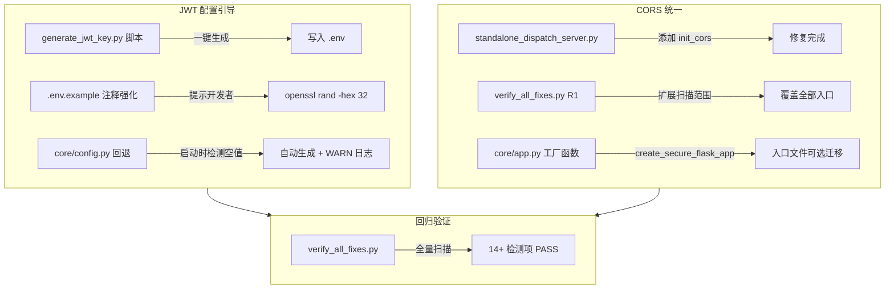
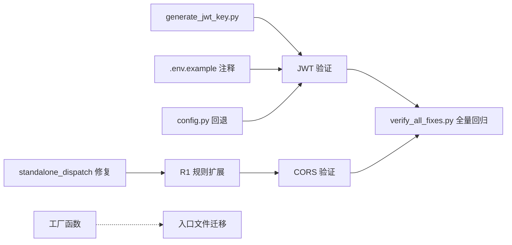

# 后续维护方案 — 架构设计文档

## 1. 概述

### 1.1 背景
全项目代码质量整改（批1~批4）已完成，14项回归验证全PASS。为进一步巩固成果，防止后续开发中新引入的风险点回潮，需建立两项维护机制：
1. **JWT_SECRET_KEY 配置引导** — 确保所有部署环境正确配置密钥
2. **CORS 统一使用 init_cors** — 新增 Flask 入口文件时自动遵循安全基线

### 1.2 范围
```
├── JWT 配置引导
│   ├── 生成脚本（scripts/tools/generate_jwt_key.py）
│   ├── .env.example 注释强化
│   └── 启动时自动生成回退（core/config.py）
│
├── CORS 统一
│   ├── 存量修复（standalone_dispatch_server.py）
│   ├── 验证规则扩展（verify_all_fixes.py R1）
│   └── 工厂函数（core/app.py → create_secure_flask_app）
│
└── 验证（verify_all_fixes.py 回归检测）
```

### 1.3 不包含
- 不修改 `wechat_server.py`（云端专用，禁止修改）
- 不重构非 Flask 入口的文件（SDK 客户端、辅助脚本等）
- 不涉及 `face_server.py` 的限流（身份验证无需 Limiter）

---

## 2. 现状分析

### 2.1 CORS 覆盖现状

| 入口文件 | CORS | Limiter | 改造状态 |
|---------|------|---------|---------|
| `dispatch_center.py` | ✅ `init_cors(app, ...)` | ✅ | 已完成 |
| `container_center_api.py` | ✅ `init_cors(app, ...)` | ✅ | 已完成 |
| `standalone_dispatch_server.py` | ❌ 无 CORS | ✅ | **需修复** |
| `container_api_server.py` | ✅ `init_cors(app, ...)` | ✅ | 已完成 |
| `app.py` | ✅ `init_cors(app, ...)` | ✅ | 已完成 |
| `face_server.py` | ✅ `init_cors(app)` | - | 已完成 |
| `api/wechat_callback.py` | ✅ `init_cors(self.app)` | - | 已完成 |
| `wechat_server.py` | ❌ 直接 CORS | - | 🔒 云端专用，禁止修改 |

### 2.2 Limiter 配置一致性
所有 5 个包含 Limiter 的文件使用完全相同的配置：
```python
Limiter(
    app=app,
    key_func=get_remote_address,
    default_limits=os.getenv('DEFAULT_RATE_LIMITS', '1000 per day, 300 per hour').split(', '),
    storage_uri=os.getenv('LIMITER_STORAGE_URI', 'memory://'),
)
```
**结论**：适合中央化到工厂函数。

### 2.3 现有验证规则 R1 盲区
当前 `verify_all_fixes.py:R1` 只扫描 `dispatch_center.py` 和 `container_center_api.py`，未覆盖：
- `standalone_dispatch_server.py`（无 CORS）
- `container_api_server.py`（已正确）
- `app.py`（已正确）
- `face_server.py`（已正确）

---

## 3. 架构设计

### 3.1 整体流程图



### 3.2 组件设计

#### 3.2.1 generate_jwt_key.py（新建）

```
位置:   mobile_api_ai/scripts/tools/generate_jwt_key.py
功能:   生成 64 位十六进制密钥并写入 .env
接口:   python scripts/tools/generate_jwt_key.py [--force]
行为:
  1. 读取 .env 文件
  2. 检查 JWT_SECRET_KEY 是否已设置且非空
  3. 如已设置 → 输出前4位+后4位确认信息，不覆盖
  4. 如未设置 → 使用 secrets.token_hex(32) 生成
  5. 写入 .env 文件（追加或替换 JWT_SECRET_KEY 行）
  6. --force 参数可强制重新生成
```

#### 3.2.2 .env.example 注释强化

```ini
# JWT 密钥（必填，无默认值）
# 生成命令：
#   Windows: py -c "import secrets; print(secrets.token_hex(32))"
#   Linux/Mac: openssl rand -hex 32
JWT_SECRET_KEY=
```

#### 3.2.3 core/config.py 启动回退增强

在现有 `JWT_SECRET_KEY` 检测逻辑之后添加回退机制：
```
检测流程:
  1. os.getenv('JWT_SECRET_KEY') → 有值 → 使用
  2. 无值 → 尝试读取 .env 文件 → 有值 → 使用
  3. 仍无值 → secrets.token_hex(32) 生成 → logger.warning
  4. 创建 .env 文件（如不存在）并写入 JWT_SECRET_KEY
```

#### 3.2.4 standalone_dispatch_server.py 修复

在 `create_app()` 函数中添加 CORS 初始化：
```python
from core.cors_config import init_cors

def create_app():
    app = Flask(__name__)
    init_cors(app, default_origins='http://localhost:5000,http://localhost:3000')
    # ... 现有 Limiter 和其他初始化 ...
```

#### 3.2.5 verify_all_fixes.py R1 规则扩展

```python
# 当前（仅扫描 2 个文件）
CORS_CHECK_FILES = ["dispatch_center.py", "container_center_api.py"]

# 扩展后（扫描所有 Flask 入口）
CORS_CHECK_FILES = [
    "dispatch_center.py",
    "container_center_api.py",
    "standalone_dispatch_server.py",
    "container_api_server.py",
    "app.py",
    "face_server.py",
]
```

#### 3.2.6 core/app.py 工厂函数（新增）

```python
def create_secure_flask_app(
    import_name: str,
    default_origins: str = 'http://localhost:5000,http://localhost:3000',
    enable_limiter: bool = True,
    template_folder: Optional[str] = None,
    static_folder: Optional[str] = None,
    blueprints: Optional[list] = None,
) -> Flask:
    """
    统一创建安全的 Flask 应用实例

    自动处理：
    - CORS 白名单配置（core.cors_config.init_cors）
    - 请求限流（flask_limiter.Limiter）
    - JWT 密钥检测
    - 全局异常处理器
    - favicon.ico 路由

    参数:
        import_name: Flask(__name__) 的模块名
        default_origins: CORS 允许的来源列表（逗号分隔）
        enable_limiter: 是否启用请求限流
        template_folder: 模板目录（可选）
        static_folder: 静态文件目录（可选）
        blueprints: 需要注册的蓝图列表（可选）

    返回:
        Flask 应用实例
    """
```

**工厂函数封装的内容**：
| 初始化项 | 来源 |
|---------|------|
| `Flask(__name__)` | 统一创建 |
| `init_cors(app, default_origins)` | `core.cors_config` |
| `Limiter(app, key_func, default_limits, storage_uri)` | `flask_limiter` |
| `JWT_SECRET_KEY` 校验 | 自动异常抛出 |
| `app.errorhandler(404)` | 统一 404 响应 |
| `app.errorhandler(Exception)` | 统一 500 响应 |
| `app.route('/favicon.ico')` | 统一处理 |

---

## 4. 数据流向

```
开发者新增入口文件
        │
        ▼
┌──────────────────────────────┐
│  选项 A: 手动模式             │
│  from core.cors_config       │
│       import init_cors       │
│  init_cors(app)              │
│  Limiter(app, ...)           │
└──────────┬───────────────────┘
           │
┌──────────▼───────────────────┐
│  选项 B: 工厂模式（推荐）      │
│  from core.app               │
│       import                 │
│       create_secure_flask_app │
│  app = create_secure_flask_app│
│        (__name__,            │
│         blueprints=[my_bp])  │
└──────────┬───────────────────┘
           │
           ▼
    verify_all_fixes.py
    回归验证（R1 自动检测）
           │
      ┌────┴────┐
      │  PASS   │ FAIL → 修复后重试
      └────┬────┘
           ▼
        交付
```

---

## 5. 子任务定义

### 任务 J1：generate_jwt_key.py 脚本

| 属性 | 内容 |
|------|------|
| **输入契约** | `.env` 文件存在（不存在则创建） |
| **输出契约** | `scripts/tools/generate_jwt_key.py` 创建完成 |
| **验收标准** | `py scripts/tools/generate_jwt_key.py` 运行后 `.env` 中 `JWT_SECRET_KEY` 被正确设置 |
| **依赖** | 无 |

### 任务 J2：.env.example 注释强化

| 属性 | 内容 |
|------|------|
| **输入契约** | `.env.example` 文件存在 |
| **输出契约** | `JWT_SECRET_KEY` 注释包含 Windows/Linux 生成命令 |
| **验收标准** | 注释清晰可读，命令可直接复制执行 |
| **依赖** | 无 |

### 任务 J3：core/config.py 自动生成回退

| 属性 | 内容 |
|------|------|
| **输入契约** | `core/config.py` 存在 `JWT_SECRET_KEY` 检测逻辑 |
| **输出契约** | 空值时自动生成 + WARN 日志 + 写入 `.env` |
| **验收标准** | 清空 `.env` 中 `JWT_SECRET_KEY` 后启动项目，日志输出 WARN 且 `.env` 被自动填充 |
| **依赖** | 无 |

### 任务 C1：standalone_dispatch_server.py 修复

| 属性 | 内容 |
|------|------|
| **输入契约** | `standalone_dispatch_server.py` 存在 |
| **输出契约** | 添加 `init_cors(app, default_origins=...)` |
| **验收标准** | 启动后 CORS 头正确返回 |
| **依赖** | 无 |

### 任务 C2：verify_all_fixes.py R1 规则扩展

| 属性 | 内容 |
|------|------|
| **输入契约** | `verify_all_fixes.py` 存在 R1 检测规则 |
| **输出契约** | R1 检测覆盖全部 6 个入口文件 |
| **验收标准** | `py verify_all_fixes.py` 运行后 `R1 CORS白名单` 全部 PASS |
| **依赖** | C1（先修复存量缺陷，再验证） |

### 任务 C3：core/app.py 工厂函数

| 属性 | 内容 |
|------|------|
| **输入契约** | `core/app.py` 存在 |
| **输出契约** | 新增 `create_secure_flask_app()` 函数 |
| **验收标准** | 单元测试覆盖：创建 app → CORS 头存在 → Limiter 可工作 → 404/500 全 |

---

## 6. 依赖关系



**说明**：
- `C1 → C2` 为硬依赖：必须先修复存量缺陷，再将规则覆盖到该文件，否则验证会 FAIL
- `C3 → C4` 为软依赖（箭头虚线）：工厂函数创建后，入口文件迁移为可选步骤
- J1/J2/J3 之间无依赖，可并行执行

---

## 7. 风险与对策

| 风险 | 概率 | 影响 | 对策 |
|------|------|------|------|
| 自动生成 JWT 回退导致生产重启 | 低 | 中 | 仅首次启动时生成，已存在密钥时不覆盖；日志级别 WARN 显眼提示 |
| 工厂函数破坏现有入口 | 低 | 高 | 迁移分两步：先创建工厂函数，再逐个迁移入口，每迁移一个运行一次回归验证 |
| `standalone_dispatch_server.py` 无 CORS 导致安全问题 | 中 | 高 | 任务 C1 优先执行，立即修复 |
| `wechat_server.py` 直接 CORS 无法改造 | 中 | 低 | 云端专用文件，生产环境通过反向代理限制来源，不在代码层处理 |

---

## 8. 验收标准

| # | 验收项 | 验证方式 |
|---|--------|---------|
| 1 | `generate_jwt_key.py` 脚本可正常运行 | `py scripts/tools/generate_jwt_key.py` 退出码 0 |
| 2 | `.env.example` 中 JWT_SECRET_KEY 有生成命令注释 | 人工审查 |
| 3 | JWT_SECRET_KEY 为空时系统自动生成回退 | 清空后启动，日志含 WARN |
| 4 | `standalone_dispatch_server.py` 包含 `init_cors(app` | `grep -c "init_cors(app"` == 1 |
| 5 | `verify_all_fixes.py R1` 覆盖 6 个入口文件 | `py verify_all_fixes.py` 全部 PASS |
| 6 | 工厂函数 `create_secure_flask_app` 可用 | 调用后返回 Flask 实例，CORS/Limiter 正常 |

---

## 9. 执行计划

| 任务 | 预计耗时 | 执行顺序 |
|------|---------|---------|
| J1 generate_jwt_key.py | 5min | 批次1 |
| J2 .env.example 注释 | 2min | 批次1（可并行） |
| J3 config.py 回退 | 5min | 批次1 |
| C1 standalone_dispatch 修复 | 3min | 批次2 |
| C2 verify_all_fixes R1 扩展 | 5min | 批次2 |
| C3 工厂函数 | 8min | 批次3 |
| 全量回归验证 | 2min | 最终 |
