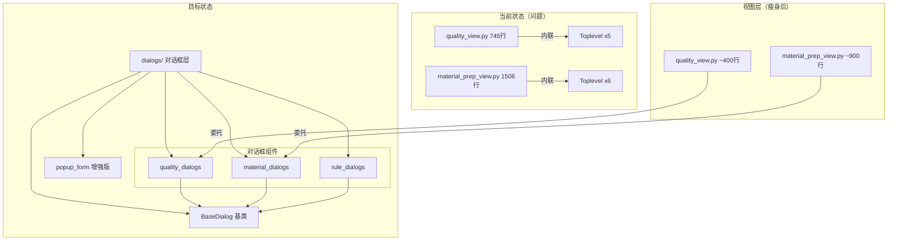

# View 层内联对话框重构方案

## 1. 现状分析

### 1.1 总体数据

| 指标 | 数值 |
|------|:----:|
| 视图文件总数 | 27 个 |
| 视图总代码行数 | 11,460 行 |
| 内联 `Toplevel()` 对话框 | 64 个 |
| 受影响视图文件 | 15+ 个 |
| 前5大视图行数占比 | 5个文件占 **47%** (5,382行) |

### 1.2 已有对话框基础设施（使用不足）

`views/dialogs/` 目录已提供：

| 模块 | 功能 | 被引用次数 |
|------|------|:---------:|
| `popup_form()` | 通用表单弹窗 | 2个视图使用 |
| `alert()` | 信息提示弹窗 | 多个视图使用 |
| `confirm()` | 确认弹窗 | 多个视图使用 |
| `show_detail()` | 订单详情弹窗 | 少量使用 |
| `manage_custom_types_dialog()` | 自定义类型管理 | 1个视图使用 |
| `PlaceholderEntry` | 带占位符输入框 | 全局使用 |

**问题**：仅有 `process_view.py` 和 `shipment_view.py` 2个视图使用 `popup_form`，其余视图全部自写 `tk.Toplevel()`。

### 1.3 典型内联对话框分布（以 quality_view.py 为例）

| 方法 | 行数 | 问题 |
|------|:---:|------|
| `_open_task_compile()` | ~250 行 | 含子对话框、直接使用 `get_connection()` |
| `add_record()` | ~140 行 | 使用 `popup_form` 但混入原始连接操作+内联确认框 |
| `_open_qc_form()` | ~180 行 | 复杂动态表单，完全内联 |
| `_show_completion_confirm()` | ~60 行 | 可复用模式，完全内联 |
| `_view_detail()` | ~20 行 | ✅ 已用 `alert()` |
| `_delete_record()` | ~15 行 | ✅ 已用 `confirm()` |

### 1.4 核心问题

```
问题层级：
┌─────────────────────────────────────────────┐
│ 1. 代码膨胀：内联对话框占每个视图 40-50% 代码 │
│ 2. 不可测试：对话框逻辑与视图耦合，无法独立测试│
│ 3. 重复代码：窗口创建/居中/关闭模式重复64次   │
│ 4. 直接SQL：部分对话框直接使用 get_connection()│
│ 5. 风格不一：各视图对话框 UI 细节有差异       │
└─────────────────────────────────────────────┘
```

---

## 2. 目标架构

### 2.1 设计分层

```
views/
├── quality_view.py          ← 瘦身后的视图（~400行）
├── material_prep_view.py    ← 瘦身后的视图（~900行）
├── ...
└── dialogs/                 ← 增强的对话框层
    ├── __init__.py              (导出所有对话框类)
    ├── base.py                  (通用工具函数：popup_form, alert...)
    ├── widgets.py               (自定义组件)
    ├── quality_dialogs.py       (质检相关对话框)      ← 新增
    │   ├── QualityTaskCompileDialog
    │   ├── QualityRecordFormDialog
    │   └── CompletionConfirmDialog
    ├── material_dialogs.py      (备料相关对话框)      ← 新增
    ├── process_dialogs.py       (工序相关对话框)      ← 新增
    └── rule_dialogs.py          (规则相关对话框)      ← 新增
```

### 2.2 对话框类型分类

| 类型 | 描述 | 提取策略 |
|------|------|---------|
| **简单确认** | `confirm()`, `alert()` | ✅ 已有，无需改动 |
| **标准表单** | `popup_form()` | ✅ 已有，扩充字段类型支持 |
| **复杂表单** | 动态字段/依赖联动/分段表单 | 提取为独立 Dialog 类 |
| **查阅详情** | `show_detail()` | ✅ 已有，增加数据加载支持 |
| **管理面板** | 多标签/列表+编辑 | 提取为独立 Dialog 类 |

---

## 3. 子任务拆分

### Phase 1：基础设施加固（2个任务）

**Task 1.1：增强 `base.py` `popup_form()`**
- 添加字段类型 `grid_combo`（联动下拉框）
- 添加字段类型 `checkgroup`（复选框组）
- 添加字段类型 `attachment`（文件选择+大小校验）
- 添加字段配置验证装饰器

**Task 1.2：新增抽象对话框基类 `BaseDialog`**
- 封装 Toplevel 创建、居中定位、模态设置、销毁清理
- 提供 `build_ui()` / `collect_data()` / `validate()` 模板方法
- 统一绑定 Enter/Escape 快捷键
- 支持窗口位置/大小持久化

### Phase 2：核心对话框提取（3个任务）

**Task 2.1：提取 `quality_dialogs.py`**（从 quality_view.py）
- `QualityTaskCompileDialog` ← `_open_task_compile` (~250行)
- `QualityRecordFormDialog` ← `_open_qc_form` (~180行)
- `CompletionConfirmDialog` ← `_show_completion_confirm` (~60行)

**Task 2.2：提取 `material_dialogs.py`**（从 material_prep_view.py）
- 分析 1,506 行中的 6 个内联对话框，识别通用模式
- 提取为独立 Dialog 类

**Task 2.3：提取 `rule_dialogs.py`**（从 quality_rule_view.py + material_rules_view.py）
- 规则编辑相关对话框集中管理

### Phase 3：清理 DAO 层连接管理（1个任务）

**Task 3.1：使 `get_connection_context()` 成为 DAO 层的标准入口**
- 修改 `BaseDAO` 中所有方法使用 `with get_connection_context()`
- 消除 `conn = get_connection()` / `conn.close()` 模式
- 消除视图中直接调用 `get_connection()` 的模式

---

## 4. 详细接口契约

### 4.1 `BaseDialog` 抽象基类

```python
class BaseDialog:
    """
    对话框抽象基类
    
    模板方法：
        build_ui()       # 子类实现：构建UI内容
        validate()       # 子类实现：数据验证，返回 (bool, error_msg)
        on_confirm()     # 子类实现：确认回调
        on_cancel()      # 子类实现：取消回调
        on_close()       # 子类实现：关闭清理
        
    提供的功能：
        - Toplevel 创建与模态设置
        - 窗口居中与大小持久化
        - Enter → 确认 / Escape → 取消
        - grab_set / grab_release 管理
        - 窗口配置保存（window_config.json）
    """
```

### 4.2 质检对话框

```python
class QualityTaskCompileDialog(BaseDialog):
    """质检任务编制对话框"""
    def __init__(self, parent, orders_data, ...):
        ...
    
    def build_ui(self):
        # 工单选择 + 工序联动 + 质检项目勾选
        pass
    
    def validate(self):
        # 必填项检查
        pass


class QualityRecordFormDialog(BaseDialog):
    """质检内容填写对话框"""
    def __init__(self, parent, record_id, values, ...):
        ...
    
    def build_ui(self):
        # 动态字段：质检项逐行显示 + 勾选框 + 输入框
        pass


class CompletionConfirmDialog(BaseDialog):
    """终检完成确认对话框"""
    def __init__(self, parent, order_id, order_info, on_confirm, on_cancel):
        ...
```

### 4.3 依赖关系

```
Phase 1 Tasks:
  Task 1.1 ← 无依赖
  Task 1.2 ← 无依赖
  (Task 1.1 和 Task 1.2 可并行)

Phase 2 Tasks:
  Task 2.1 ← 依赖 Task 1.2
  Task 2.2 ← 依赖 Task 1.2
  Task 2.3 ← 依赖 Task 1.2
  (Task 2.1/2.2/2.3 可并行)

Phase 3 Tasks:
  Task 3.1 ← 无依赖（可独立进行）
```

---

## 5. 实施计划

| 阶段 | 任务 | 工作量 | 涉及文件 | 交付物 |
|------|------|:-----:|---------|--------|
| **P1** | 1.1 增强 popup_form | 小 | base.py | 新增字段类型 |
| **P1** | 1.2 BaseDialog 基类 | 中 | dialogs/base.py | BaseDialog 类 |
| **P2** | 2.1 quality_dialogs | 中 | quality_view.py → quality_dialogs.py | 3个Dialog类 |
| **P2** | 2.2 material_dialogs | 大 | material_prep_view.py → material_dialogs.py | 6个Dialog类 |
| **P2** | 2.3 rule_dialogs | 中 | quality_rule_view.py / material_rules_view.py | 对话框提取 |
| **P3** | 3.1 连接管理 | 中 | base_dao.py + 各DAO | 统一上下文管理器 |

### 预估收益

| 指标 | 重构前 | 重构后 | 改善 |
|------|:-----:|:-----:|:----:|
| quality_view.py | 745 行 | ~400 行 | -46% |
| material_prep_view.py | 1,506 行 | ~900 行 | -40% |
| 内联 Toplevel 数 | 64 个 | 0 个 | -100% |
| 对话框可测试性 | ❌ 不可测 | ✅ 可独立测试 | — |

---

## 6. 架构图



---

## 7. 验收标准

| # | 标准 | 验证方式 |
|---|------|---------|
| 1 | 所有视图 UI 功能与原版完全一致 | 逐功能手工测试 |
| 2 | 对话框创建代码零重复 | grep "Toplevel" views/*.py = 0 |
| 3 | 每个 Dialog 类可独立导入 | `from views.dialogs.quality_dialogs import ...` |
| 4 | DAO 层全部使用上下文管理器 | grep "get_connection(" models/*.py = 0 |
| 5 | 视图层全部使用 `popup_form` 或 Dialog 类 | 无裸 Toplevel |
| 6 | 窗口位置/大小可保存恢复 | 关闭再打开对话框验证 |
| 7 | 所有入口、出口、路由、页面文件名、目录名使用英文 | 路径无中文字符 |
