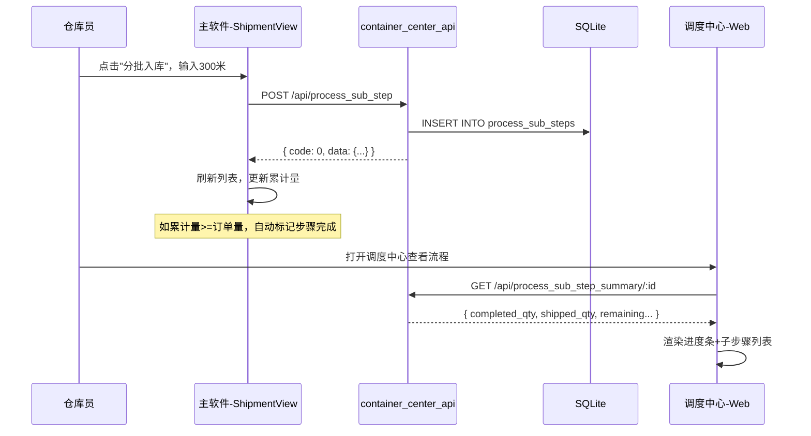

# DESIGN - 分批入库/发货架构设计

## 整体架构

```mermaid
graph TB
    subgraph 主软件（桌面端）
        SM[ShipmentView] -- 分批入库/分批发货 --> API
        FP[FinishedProductStatsView] -- 查累计量 --> API
        OR[OrderDetailView] -- 查进度 --> API
    end

    subgraph 后端API
        API[container_center_api.py] -- POST /api/process_sub_steps --> DB
        API -- GET /api/process_sub_steps/:id --> DB
        API -- GET /api/process/sub_step_summary/:id --> DB
    end

    subgraph 数据库
        DB[(orders.db)]
        DB --> PR[process_records 表]
        DB --> PSS[process_sub_steps 表 (新增)]
    end

    subgraph 调度中心（Web）
        DC[dispatch_center.js] -- 加载子步骤 --> API
        DC -- 展示进度条/明细 --> UI
    end

    subgraph 构想文件
        CF[d:\yuan\构想文件\分批入库发货\]
    end
```

## 数据库设计

### 新增表: process_sub_steps

```sql
CREATE TABLE IF NOT EXISTS process_sub_steps (
    id          TEXT PRIMARY KEY,        -- UUID
    process_id  TEXT NOT NULL,           -- 关联 process_records.id
    order_no    TEXT NOT NULL,           -- 订单号（冗余便于查询）
    step_name   TEXT NOT NULL,           -- '完工入库' 或 '发货'
    batch_no    TEXT NOT NULL,           -- 批次号: STK-20260514-001 / SHP-20260514-001
    quantity    REAL NOT NULL DEFAULT 0, -- 本次入库/发货数量
    operator    TEXT DEFAULT '',         -- 操作人
    remark      TEXT DEFAULT '',         -- 备注
    created_at  TEXT NOT NULL            -- 操作时间
)
```

### 扩展字段 (可选): process_records 表
无需新增字段，累计量通过 `SUM(quantity) WHERE process_id=? AND step_name='完工入库'` 实时计算，避免数据冗余。

## API 接口设计

### 1. 创建子步骤（分批入库/发货）

```
POST /api/process_sub_step
Body: {
    "process_id": "uuid",      -- 关联流程记录ID
    "order_no": "ORD-001",     -- 订单号
    "step_name": "完工入库",    -- 步骤名称: 完工入库/发货
    "quantity": 300,           -- 本次数量
    "operator": "张三",        -- 操作人
    "remark": "首批入库"       -- 备注(可选)
}
Response: {
    "code": 0,
    "data": { "id": "uuid", "batch_no": "STK-20260514-001", ... }
}
```

### 2. 查询子步骤列表

```
GET /api/process_sub_steps/<process_id>
Response: {
    "code": 0,
    "data": [
        { "id": "...", "step_name": "完工入库", "batch_no": "STK-...", "quantity": 300, ... },
        { "id": "...", "step_name": "完工入库", "batch_no": "STK-...", "quantity": 400, ... }
    ]
}
```

### 3. 查询步骤汇总

```
GET /api/process_sub_step_summary/<process_id>
Response: {
    "code": 0,
    "data": {
        "order_qty": 1000,
        "completed_qty": 700,     -- 累计入库数
        "shipped_qty": 0,         -- 累计发货数
        "completed_remaining": 300, -- 待入库数
        "shipped_remaining": 1000,  -- 待发货数
        "is_completed_done": false, -- 入库是否已完成
        "is_shipped_done": false    -- 发货是否已完成
    }
}
```

## 前端组件设计

### 主软件（Tkinter 桌面端）

#### ShipmentView - 成品库存 Tab

```
┌──────────────────────────────────────────────────────────┐
│  成品库存列表                                             │
│  ┌──────┬──────┬──────┬──────┬──────┬──────┬──────────┐ │
│  │订单号 │产品名│订单量│已入库│待入库│进度  │操作      │ │
│  ├──────┼──────┼──────┼──────┼──────┼──────┼──────────┤ │
│  │ORD01 │网带  │1000  │ 700  │ 300  │ ████ │[分批入库]│ │
│  │ORD02 │网带  │500   │ 500  │  0   │ ████ │查看明细  │ │
│  └──────┴──────┴──────┴──────┴──────┴──────┴──────────┘ │
│                                                          │
│  [分批入库对话框]                                        │
│  订单: ORD-001  订单量: 1000  已入库: 700  可入库: 300   │
│  ┌─────────────────┐                                    │
│  │ 本次入库数量: [___300___]                            │
│  │ 备注: [_____________]                                │
│  │ [确认入库] [取消]                                    │
│  └─────────────────┘                                    │
└──────────────────────────────────────────────────────────┘
```

#### ShipmentView - 发货管理 Tab

```
┌──────────────────────────────────────────────────────────┐
│  发货单列表                                              │
│  ┌──────┬──────┬──────┬──────┬──────┬──────┬──────────┐ │
│  │订单号 │订单量│已发货│待发货│进度  │操作             │ │
│  ├──────┼──────┼──────┼──────┼──────┼──────────────────┤ │
│  │ORD01 │1000  │ 400  │ 600  │ ████ │[分批发货] 查看发货│ │
│  └──────┴──────┴──────┴──────┴──────┴──────────────────┘ │
│                                                          │
│  [分批发货对话框]                                        │
│  订单: ORD-001  订单量: 1000  已发货: 400  可发货: 600  │
│  ┌─────────────────┐                                    │
│  │ 本次发货数量: [___200___]                            │
│  │ 收货方: [_____________]                              │
│  │ 备注: [_____________]                                │
│  │ [确认发货] [取消]                                    │
│  └─────────────────┘                                    │
└──────────────────────────────────────────────────────────┘
```

#### 子步骤明细对话框
点击"查看明细"弹出对话框显示该订单的所有子步骤。

### 调度中心（Web）

#### 流程详情 - 子步骤展示

修改 `dispatch_center.js` 中的 `showProcessDetail` 函数，在步骤列表下方增加子步骤明细区域。

```
┌─ 完工入库 ────────────────────────────────────────────┐
│  进度: ████████████████░░░░░░  700/1000             │
│  ┌─────────────────────────────────────────────────┐ │
│  │ 批次号        数量  操作人  时间       备注     │ │
│  │ STK-001      300   张三   05-12  首批入库       │ │
│  │ STK-002      400   张三   05-13  第二批         │ │
│  └─────────────────────────────────────────────────┘ │
│  [点击查看全部子步骤]                                 │
└──────────────────────────────────────────────────────┘

┌─ 发货 ────────────────────────────────────────────────┐
│  进度: ██████████░░░░░░░░░░░░  400/1000             │
│  ┌─────────────────────────────────────────────────┐ │
│  │ SHP-001      200   李四   05-15  发A客户        │ │
│  │ SHP-002      200   李四   05-16  发B客户        │ │
│  └─────────────────────────────────────────────────┘ │
└──────────────────────────────────────────────────────┘
```

## 数据流向



## 变更文件清单

| 文件 | 变更类型 | 说明 |
|------|----------|------|
| `mobile_api_ai/container_center_api.py` | 修改 | 新增3个子步骤 API 端点 |
| `mobile_api_ai/static/js/dispatch_center.js` | 修改 | 流程详情增加子步骤展示 |
| `views/shipment_view.py` | 修改 | 分批入库/发货UI |
| `views/finished_product_stats_view.py` | 修改 | 显示入库/发货进度 |
| `mobile_api_ai/storage_layer.py` | 无需修改 | 累计量通过SQL聚合查询 |
