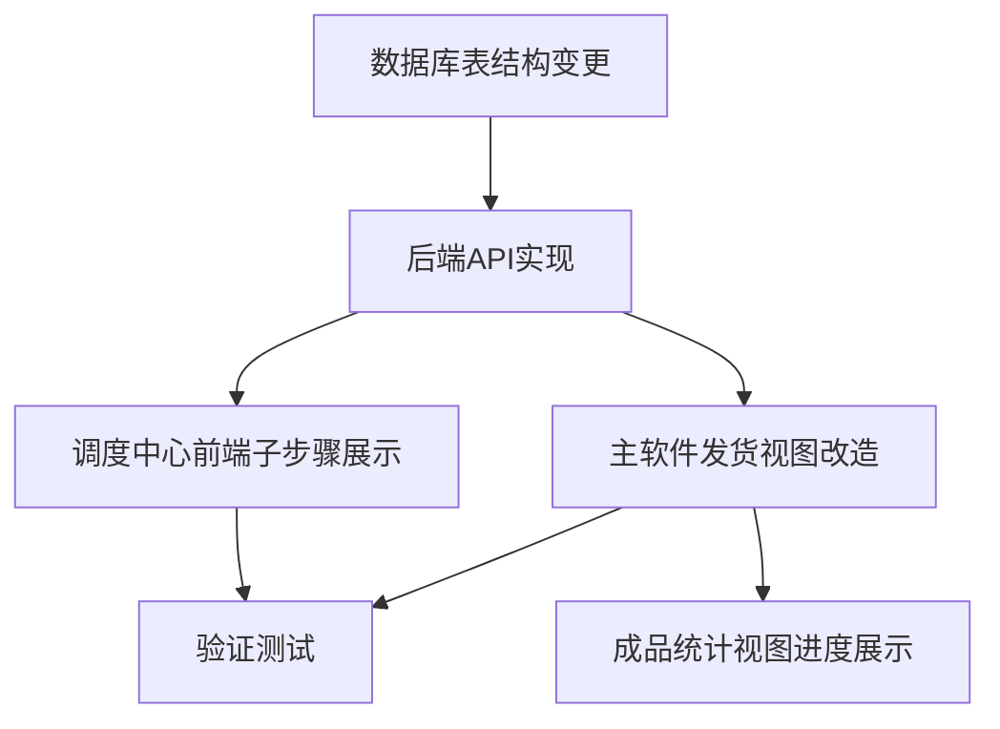

# TASK - 分批入库/发货实现任务

## 依赖关系图

## 任务列表

### T1: 数据库表结构变更
- **输入：** 无（数据库初始化脚本）
- **输出：** `process_sub_steps` 表创建
- **验收：** 数据库中存在 `process_sub_steps` 表，字段完整
- **文件：** `mobile_api_ai/app.py` (或其他初始化入口)

### T2: 后端API实现
- **输入：** T1
- **输出：** 3个API端点
- **验收：** curl 测试创建/查询正常
- **文件：** `mobile_api_ai/container_center_api.py`
- **端点：**
  1. `POST /api/process_sub_step` — 创建子步骤
  2. `GET /api/process_sub_steps/<process_id>` — 子步骤列表
  3. `GET /api/process_sub_step_summary/<process_id>` — 步骤汇总

### T3: 调度中心前端子步骤展示
- **输入：** T2
- **输出：** 流程详情页显示子步骤列表和进度条
- **验收：** 调度中心流程详情页子步骤区域显示正确
- **文件：** `mobile_api_ai/static/js/dispatch_center.js`

### T4: 主软件发货视图改造
- **输入：** T2
- **输出：** ShipmentView 增加分批入库/发货功能
- **验收：** 可创建分批入库/发货记录，累计量正确更新
- **文件：** `views/shipment_view.py`

### T5: 成品统计视图进度展示
- **输入：** T2
- **输出：** 成品统计显示入库/发货进度
- **验收：** 成品统计列表显示累计量和进度条
- **文件：** `views/finished_product_stats_view.py`

### T6: 验证测试
- **输入：** T3, T4, T5
- **输出：** 全链路测试通过
- **验收：**
  - 主软件分批入库 → 调度中心可见子步骤
  - 主软件分批发货 → 调度中心可见子步骤
  - 累计量达到订单量后步骤自动完成
  - 成品统计进度显示正确
