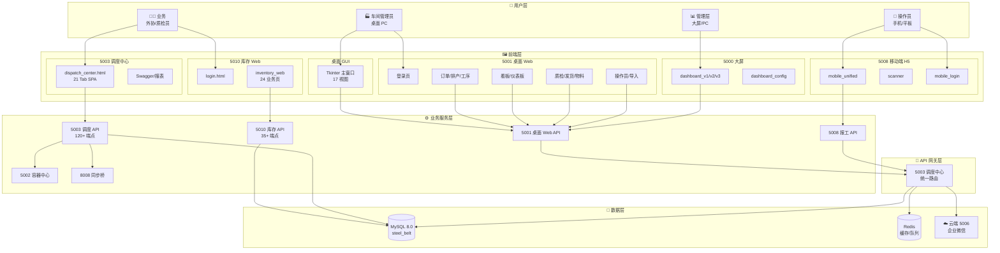
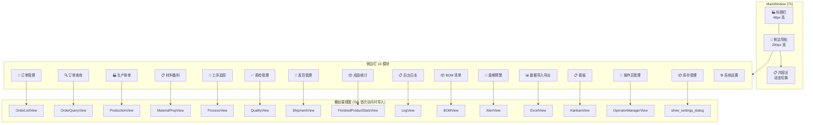
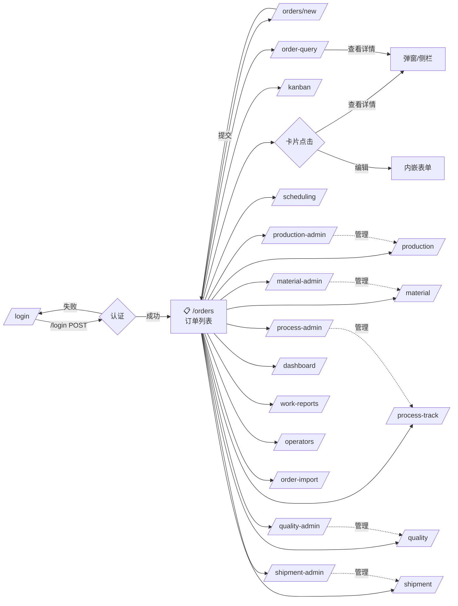
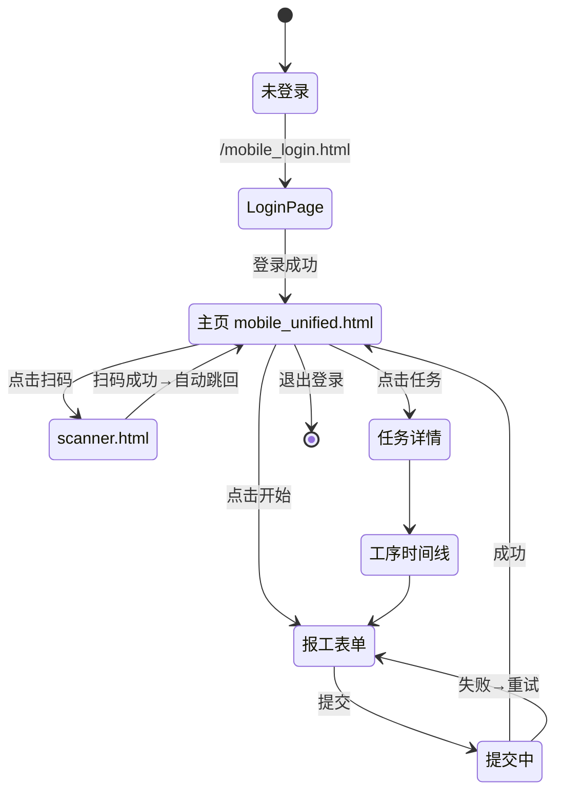
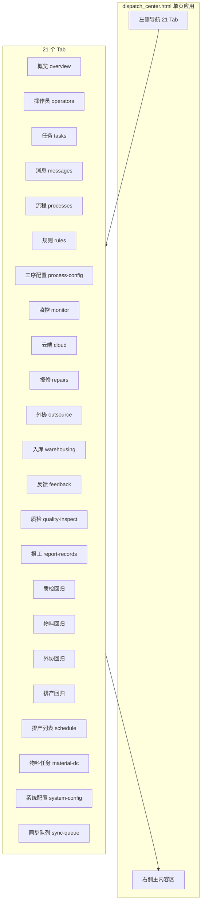
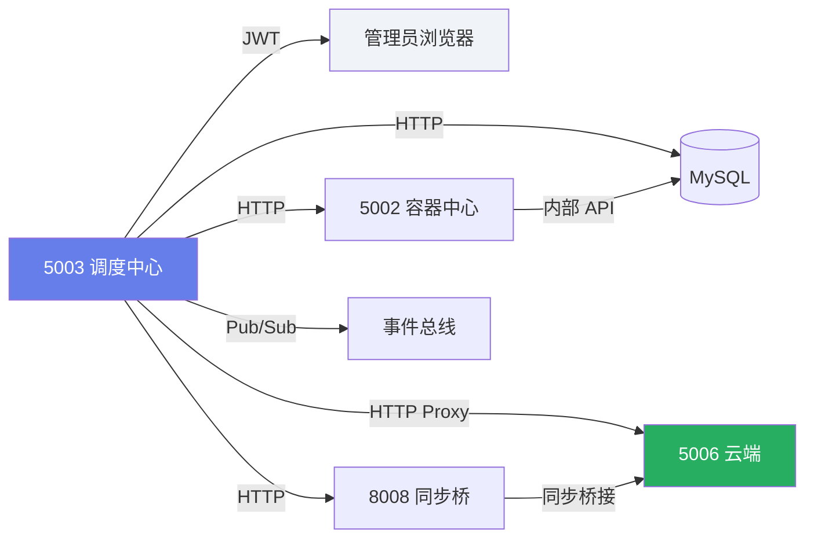
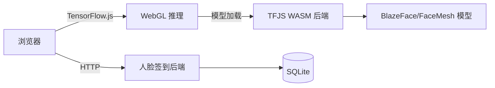
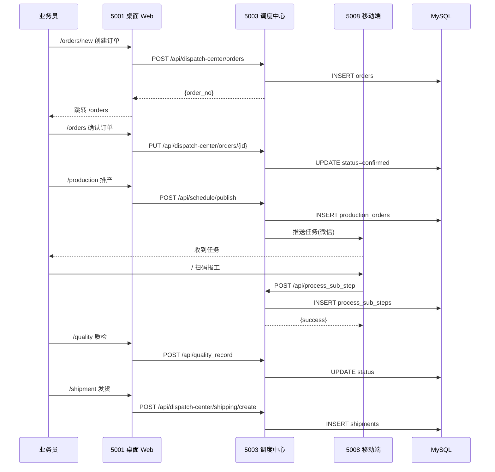
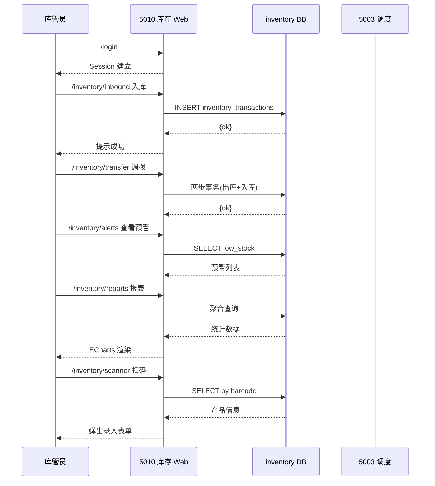

# 不锈钢网带跟单 3.0 — 前端架构与功能详解

> **版本**: v1.0
> **生成日期**: 2026-06-28
> **配套文档**: [FRONTEND_PAGES.md](./FRONTEND_PAGES.md) — 页面清单速查
> **图表工具**: Mermaid (GitHub/VS Code 预览兼容)

---

## 一、系统总体架构

### 1.1 多端口服务总览



### 1.2 端口职责矩阵

| 端口 | 角色 | 前端形态 | 主要使用方 | 数据来源 |
|:----:|:----:|:---------|:----------:|:---------|
| 5000 | 展示大屏 | ECharts HTML | 管理层 | 直连 DB |
| 5001 | 业务操作 | HTML+Bootstrap | 业务员 | 经 5003 调度 |
| 5002 | 容器监控 | 内部 API + 代理 | 系统 | 独立 DB |
| 5003 | 调度中枢 | SPA + API | 管理员 | 调度 DB + 缓存 |
| 5008 | 移动报工 | Mobile H5 | 操作员 | 直连 + 调度 |
| 5010 | 库存管理 | Bootstrap 5 | 库管员 | inventory DB |

---

## 二、桌面端 GUI (Tkinter) 架构

### 2.1 主窗口结构



### 2.2 GUI 视图详细功能

| # | 视图 | 类名 | 主要功能 | 关键交互 | 数据 DAO |
|:-:|:-----|:-----|:---------|:---------|:---------|
| 1 | 订单列表 | `OrderListView` | 订单卡片网格 + 多维筛选 | 拖拽排序、右键菜单、批量选择 | `OrderDAO` |
| 1a | 新建订单 | `NewOrderDialog` | 动态字段表单(规格/材质/数量等) | 模板选择、实时校验、物料预览 | `OrderDAO.create` |
| 1b | 订单编辑 | `OrderFormDialog` | 同上,回显数据 | 状态机校验、修改日志 | `OrderDAO.update` |
| 1c | 导入预览 | `ImportPreviewDialog` | Excel→DataFrame→表格预览 | 字段映射、冲突标记 | `OrderDAO.batch_create` |
| 1d | 订单确认 | `show_order_confirm` | 关键信息二次确认 + 状态流转 | 确认→confirmed | `OrderDAO.confirm` |
| 2 | 订单查询 | `OrderQueryView` | 多条件组合 + 高级筛选 | 收藏查询、导出结果 | `OrderDAO.search` |
| 3 | 生产排单 | `ProductionView` | 工单列表 + 拖拽排序优先级 | 计划时间轴、分配操作员 | `ProductionDAO` |
| 4 | 材料备料 | `MaterialPrepView` | 物料需求清单 + 备料状态 | 标记到货、批量确认 | `InventoryDAO` |
| 5 | 工序追踪 | `ProcessView` | 工序任务列表 + 甘特图 | 推进/回退、转派 | `ProcessDAO` |
| 6 | 质检管理 | `QualityView` | 质检任务 + 结果录入 | 合格/不合格 + 图片附件 | `QualityDAO` |
| 7 | 发货管理 | `ShipmentView` | 发货单 + 物流跟踪 | 打印发货单、签收确认 | `ShipmentDAO` |
| 8 | 成品统计 | `FinishedProductStatsView` | 成品数量/工时/良率 | 时间范围筛选、图表 | `ProductionStatsDAO` |
| 9 | 后台日志 | `LogView` | 操作日志检索 + 导出 | 按人/时间/类型筛选 | `OperationLogDAO` |
| 10 | BOM 清单 | `BOMView` | 物料清单编辑 + 多级展开 | 拖拽排序、导入 | `BOMDAO` |
| 11 | 逾期预警 | `AlertView` | 逾期订单列表 + 弹窗提醒 | 一键联系、延期申请 | `OrderDAO.overdue` |
| 12 | 数据导入导出 | `ExcelView` | 模板下载 + 上传导入 | 字段映射、错误行标记 | 多 DAO |
| 13 | 看板 | `KanbanView` | 7 列状态看板 | 卡片点击→详情、拖拽改状态 | `OrderDAO` + `ProductionDAO` |
| 14 | 操作员管理 | `OperatorManagerView` | 操作员 CRUD + 批量导入 | 角色分配、密码重置 | `OperatorDAO` |
| 15 | 系统设置 | `show_settings_dialog` | 系统参数配置 | 数据库连接、消息推送 | `Config` |

---

## 三、桌面端 Web (5001) 架构

### 3.1 页面导航流程



### 3.2 页面功能详解

#### 3.2.1 登录页 `/login` — [login.html](file:///d:/yuan/%E4%B8%8D%E9%94%90%E9%92%A2%E7%BD%91%E5%B8%A6%E8%B7%9F%E5%8D%953.0/desktop_web/templates/login.html)

| 功能点 | 说明 |
|:-------|:-----|
| 账号密码输入 | 用户名 + 密码(密码字段) |
| CSRF 防护 | 隐藏 token + Session 校验 |
| 登录失败提示 | 脱敏错误信息(避免账号枚举) |
| 失败计数 | 5 次锁定,记录到登录日志 |
| 记住登录 | Session.permanent = True |
| 登录成功 | 重定向 `/orders`,Session 写入 |

#### 3.2.2 订单列表 `/orders` — [orders.html](file:///d:/yuan/%E4%B8%8D%E9%94%90%E9%92%A2%E7%BD%91%E5%B8%A6%E8%B7%9F%E5%8D%953.0/desktop_web/templates/orders.html)

| 功能点 | 说明 |
|:-------|:-----|
| 卡片网格视图 | 类似 Tkinter OrderListView,每张卡片显示订单号/客户/产品/规格/数量/交期 |
| 紧急度色条 | 卡片顶部 3px 颜色条(绿/黄/红) |
| 多维筛选 | 订单状态、产品类型、客户、日期范围 |
| 全文搜索 | 搜索框支持订单号/客户名 |
| 卡片点击 | 跳转 `/orders?search=订单号` |
| 新建订单 | 顶部 ➕ 按钮→`/orders/new` |
| 批量操作 | 多选后批量确认/取消/导出 |
| 实时刷新 | 自动 30 秒轮询 |

#### 3.2.3 看板 `/kanban` — [kanban.html](file:///d:/yuan/%E4%B8%8D%E9%94%90%E9%92%A2%E7%BD%91%E5%B8%A6%E8%B7%9F%E5%8D%953.0/desktop_web/templates/kanban.html)

| 功能点 | 说明 |
|:-------|:-----|
| 11 列状态看板 | 待确认/待排产/待发布/已发布/已排产/生产中/质检中/已完成/待发货/已发货/已取消 |
| 列统计 | 每列顶部色块 + 计数徽章 |
| 卡片要素 | 订单号、客户、产品、规格、数量、交期 |
| 紧急度标识 | 顶部色条 + 交期文字颜色 |
| 点击跳转 | 卡片→`/orders?search=订单号` |
| 顶部汇总 | 总订单数 + 各状态小圆点 |
| 刷新按钮 | 手动重新拉取数据 |
| 加载遮罩 | fetch 中显示 spinner |

#### 3.2.4 新建订单 `/orders/new` — [order_new.html](file:///d:/yuan/%E4%B8%8D%E9%94%90%E9%92%A2%E7%BD%91%E5%B8%A6%E8%B7%9F%E5%8D%953.0/desktop_web/templates/order_new.html)

| 功能点 | 说明 |
|:-------|:-----|
| 顶部基础信息区 | 产品类型 + 自动生成订单号 |
| 可折叠分组 | 订单信息 / 规格参数 / 材质参数 / 表面处理 / 客户信息 / 附件 |
| 动态字段 | 根据产品类型加载对应参数网格 |
| 必填项校验 | 红星标识 + 提交时聚焦错误字段 |
| 实时物料预览 | 提交前显示预计物料用量 |
| 附件上传 | PDF/图片附件多文件 |
| 模板选择 | 从历史模板一键填充 |
| 订单号预览 | 顶部蓝色 chip 显示即将生成的订单号 |

#### 3.2.5 订单查询 `/order-query`

| 功能点 | 说明 |
|:-------|:-----|
| 多条件组合 | 订单号/客户/产品/状态/日期/数量范围 |
| 结果表格 | 表格视图 + 分页(20/50/100) |
| 行内操作 | 查看/编辑/打印/作废 |
| 详情面板 | 右侧抽屉显示完整信息 |
| 导出 | 导出当前筛选结果为 Excel |
| 高级筛选 | SQL-like 条件构造 |

#### 3.2.6 生产排单 `/production`、`/scheduling`、`/production-admin`

| 路由 | 模板 | 区别 |
|:-----|:-----|:-----|
| `/production` | production.html | 生产人员视角:看自己的工单 |
| `/scheduling` | 同上 | 排产人员视角:全部工单 + 拖拽分配 |
| `/production-admin` | production_admin.html | 管理员:批量操作 + 模板 + 规则 |

| 功能点 | 说明 |
|:-------|:-----|
| 工单列表 | 表格 + 优先级色条 |
| 优先级拖拽 | 拖动改优先级(数字) |
| 计划时间 | 甘特条形可视化 |
| 分配操作员 | 下拉选择 |
| 批量发布 | 多选→批量状态变更 |
| 状态机 | pending→publish→in_progress→completed |

#### 3.2.7 工序追踪 `/process-track` — [process_track.html](file:///d:/yuan/%E4%B8%8D%E9%94%90%E9%92%A2%E7%BD%91%E5%B8%A6%E8%B7%9F%E5%8D%953.0/desktop_web/templates/process_track.html)

| 功能点 | 说明 |
|:-------|:-----|
| 工序列表 | 全部订单的工序汇总 |
| 时间线详情 | 点击订单号→底部甘特图 |
| 工序状态 | 待开始/进行中/已完成/异常 |
| 进度条 | 完成数量/计划数量 |
| 操作员 | 显示当前工序负责人 |
| 历史时间线 | 单订单工序推进历史 |

#### 3.2.8 质检管理 `/quality`、`/quality-admin`

| 功能点 | 说明 |
|:-------|:-----|
| 质检任务列表 | 待检/已分发/已上报/合格/不合格 |
| 结果录入 | 合格/不合格二选 + 备注 |
| 图片附件 | 上传质检照片 |
| 退回操作 | 不合格→回退到上道工序 |
| 规则配置(admin) | 质检项模板、阈值、自动判定规则 |

#### 3.2.9 发货管理 `/shipment`、`/shipment-admin`

| 功能点 | 说明 |
|:-------|:-----|
| 待发货列表 | 已完工未发货订单 |
| 创建发货单 | 选择订单 + 物流公司 + 单号 |
| 打印发货单 | A4 模板,带二维码 |
| 物流跟踪 | 调用 `query-tracking` API 轮询 |
| 确认收货 | 客户确认后状态变更为已完成 |
| 物流公司管理(admin) | 添加/禁用/优先级 |

#### 3.2.10 物料管理 `/material`、`/material-admin`

| 功能点 | 说明 |
|:-------|:-----|
| 物料需求清单 | 按订单汇总所需物料 |
| 备料状态 | 待备/备齐/已发 |
| 批量确认 | 多选→批量标记完成 |
| 计算器 | 输入规格→自动算物料用量 |
| 历史记录 | 物料变更轨迹 |
| 模板应用(admin) | 标准产品类型批量套用模板 |

#### 3.2.11 操作员管理 `/operators` — [operators.html](file:///d:/yuan/%E4%B8%8D%E9%94%90%E9%92%A2%E7%BD%91%E5%B8%A6%E8%B7%9F%E5%8D%953.0/desktop_web/templates/operators.html)

| 功能点 | 说明 |
|:-------|:-----|
| 列表 | 表格 + 角色筛选 |
| 新建/编辑 | 表单 + 密码强度校验 |
| 批量导入 | Excel 上传 + 预览 + 错误行标记 |
| 导出 | 当前筛选条件 → Excel |
| 模板下载 | `api/operators/template` |
| 统计 | 单人报工量、合格率 |
| 启停用 | 软删除(is_active) |

#### 3.2.12 其他页面

| 路由 | 功能要点 |
|:-----|:---------|
| `/dashboard` | 关键指标卡片(订单数/产值/良率) |
| `/work-reports` | 报工历史 + 失败重试按钮 |
| `/order-import` | Excel 上传 + 字段映射 + 预览 |

---

## 四、移动端 H5 (5008) 架构

### 4.1 页面状态机



### 4.2 移动端页面功能

#### 4.2.1 登录页 `/mobile_login.html` — [mobile_login.html](file:///d:/yuan/%E4%B8%8D%E9%94%90%E9%92%A2%E7%BD%91%E5%B8%A6%E8%B7%9F%E5%8D%953.0/mobile_api_ai/templates/mobile_login.html)

| 功能点 | 说明 |
|:-------|:-----|
| 企业微信 OAuth | 通过 corp_userid 一键登录 |
| 操作员选择 | 备选列表(测试环境) |
| Remember Me | localStorage 存 user_id |
| 自动跳转 | 登录成功→`/` |
| 安全加固 | 删除硬编码后门(2026-06-28 修复) |

#### 4.2.2 统一报工主页 `/` — [mobile_unified.html](file:///d:/yuan/%E4%B8%8D%E9%94%90%E9%92%A2%E7%BD%91%E5%B8%A6%E8%B7%9F%E5%8D%953.0/mobile_api_ai/templates/mobile_unified.html)

| 功能点 | 说明 |
|:-------|:-----|
| 顶部用户卡片 | 显示当前操作员 + 部门 + 工号 |
| 扫码按钮 | 大绿色按钮→调用摄像头(html5-qrcode) |
| 任务列表 | 我的任务卡片(待开始/进行中/已完成 Tab) |
| 工序时间线 | 圆点+连线展示工序推进 |
| 报工表单 | 工序名 + 数量 + 批次号 + 备注 |
| 质检录入 | 合格/不合格按钮 + 分类勾选 |
| 进度条 | 已完成数量 / 计划数量 |
| 底部导航 | 首页/任务/我的 三 Tab |
| 适配 | iPhone 安全区、横屏防溢出 |
| 离线缓存 | localStorage 暂存未提交报工 |

#### 4.2.3 扫码页 `/scanner` — [scanner.html](file:///d:/yuan/%E4%B8%8D%E9%94%90%E9%92%A2%E7%BD%91%E5%B8%A6%E8%B7%9F%E5%8D%953.0/mobile_api_ai/templates/scanner.html)

| 功能点 | 说明 |
|:-------|:-----|
| 摄像头调用 | html5-qrcode.min.js(后置优先) |
| 二维码/条码 | 支持 QR/Code128/EAN |
| 扫码反馈 | 成功动画 + 提示音 |
| 手动输入 | 备用文本框(无摄像头场景) |
| 自动提交 | 扫码成功→自动 POST `/api/wechat/pool/report` |

#### 4.2.4 移动端 API 资源

| 蓝图 | 前缀 | 端点 |
|:-----|:-----|:-----|
| `auth.bp` | `/api/auth` | login/verify |
| `scan.bp` | `/api/scan` | scan-info |
| `process.bp` | `/api/process_sub_step` | 新建/撤回/历史 |
| `quality.bp` | `/api/quality_record` | 新建/撤回/历史 |
| `message.bp` | `/api/message` | 接收/已读 |
| `approval.bp` | `/api/approval` | 审批流 |
| `health.bp` | `/api/health` | 健康检查 |

---

## 五、调度中心 (5003) 架构

### 5.1 单页应用结构



### 5.2 调度中心 Tab 详细功能

| Tab | 主功能 | 关键操作 | 数据源 |
|:----|:-------|:---------|:-------|
| **概览** | 4 大卡片:待处理/进行中/已完成/逾期 + 图表 | 跳转对应 Tab | `/api/dispatch-center/status` |
| **操作员** | 列表 + 部门绑定 + 微信 userid | 增删改、批量导入 | `/api/dispatch-center/operators` |
| **任务调度** | 任务列表 + 分配/转派/取消 | 单条/批量操作 | `/api/dispatch-center/tasks` |
| **消息调度** | 微信消息模板编辑 + 发送历史 | 模板 CRUD、测试发送 | `/api/dispatch-center/messages/*` |
| **流程编排** | 工序推进/拒绝/回退 | 状态机操作 | `/api/dispatch-center/processes` |
| **规则配置** | 流程匹配规则 | JSON 规则编辑 | `/api/dispatch-center/rules` |
| **工序配置** | 工序名称/部门映射 | CRUD | `/api/dispatch-center/process-names` |
| **监控告警** | 实时服务状态 + 告警列表 | 静默、升级 | `/api/health` + 内部 |
| **云端配置** | API Key + 企业微信 | 测试连接 | `/api/dispatch-center/global-config` |
| **报修管理** | 报修记录 + 完成 | 状态流转 | `/api/dispatch-center/repair-records` |
| **外协管理** | 外协发出/接收/完成 | 状态流转 | `/api/dispatch-center/outsource-records` |
| **成品入库** | 入库确认 | 批量确认 | `/api/dispatch-center/pending-warehousing` |
| **反馈管理** | 用户反馈列表 | 回复、关闭 | `/api/dispatch-center/feedback` |
| **质检管理** | 质检记录 + 结果 | 合格/不合格 | `/api/dispatch-center/quality-records` |
| **报工记录** | 报工历史 + 详情 | 撤回、查询 | `/api/dispatch-center/report-records` |
| **质检回归** | 质检回退数据 | 回退操作 | `/api/dispatch-center/quality-regression` |
| **物料回归** | 物料回退数据 | 回退操作 | `/api/dispatch-center/material-regression` |
| **外协回归** | 外协回退数据 | 回退操作 | `/api/dispatch-center/outsource-regression` |
| **排产回归** | 排产回退数据 | 回退操作 | `/api/dispatch-center/schedule-regression` |
| **排产列表** | 排产任务 | 排产确认/撤回 | `/api/schedule/*` |
| **物料任务** | 物料任务管理 | 确认、撤回 | `/api/dispatch-center/material/requirements` |
| **系统配置** | 系统级参数 | 全局配置 | `/api/config-center/*` |
| **同步队列** | 失败队列管理 | 重试、清空 | `/api/sync-queue/list` |

### 5.3 调度中心架构拓扑



---

## 六、容器中心 (5002) 架构

### 6.1 页面结构

```mermaid
graph TB
    Root[/'/']
    Config[/'/config'/]
    AlertRules[/'/alert-rules'/]
    
    Root --> UC[unified_container.html]
    Config --> UC
    AlertRules --> AR[alert_rules.html<br/>legacy]
    
    UC --> Stats[统计 API]
    UC --> Operators[操作员配置]
    UC --> Commands[命令队列]
    UC --> FlowLogs[流程日志]
    
    Stats -->|代理| CCAPI[5003 container-stats]
```

### 6.2 容器中心页面功能

| 页面 | 路由 | 功能要点 |
|:-----|:-----|:---------|
| 容器中心主面板 | `/` | 容器状态总览 + 操作员配置 + 命令队列 |
| 容器配置 | `/config` | 操作员/部门/告警阈值配置 |
| 告警规则 | `/alert-rules` | 阈值规则 CRUD |

---

## 七、库存管理 (5010) 架构

### 7.1 侧边栏导航分组

```mermaid
graph TB
    Base[inventory/base.html<br/>统一布局] --> Nav
    
    subgraph Nav["侧边栏 7 个分组 22 项"]
        N1[概览]
        N2[出入库]
        N3[台账]
        N4[数据]
        N5[业务]
        N6[分析]
        N7[系统]
    end
    
    N1 --> D1[/inventory/dashboard/]
    N2 --> D2a[/inventory/inbound/]
    N2 --> D2b[/inventory/outbound/]
    N2 --> D2c[/inventory/batch/]
    N3 --> D3a[/inventory/stock/]
    N3 --> D3b[/inventory/alerts/]
    N3 --> D3c[/inventory/products/]
    N4 --> D4a[/inventory/suppliers/]
    N4 --> D4b[/inventory/categories/]
    N4 --> D4c[/inventory/base/]
    N4 --> D4d[/inventory/warehouses/]
    N5 --> D5a[/inventory/stocktake/]
    N5 --> D5b[/inventory/transfer/]
    N5 --> D5c[/inventory/scanner/]
    N6 --> D6a[/inventory/reports/]
    N6 --> D6b[/inventory/notifications/]
    N7 --> D7a[/inventory/backup/]
    N7 --> D7b[/inventory/export/]
    N7 --> D7c[/inventory/recycle-bin/]
    N7 --> D7d[/inventory/settings/]
```



### 7.2 库存页面详细功能

#### 7.2.1 首页概览 `/inventory/dashboard` — [dashboard.html](file:///d:/yuan/%E4%B8%8D%E9%94%90%E9%92%A2%E7%BD%91%E5%B8%A6%E8%B7%9F%E5%8D%953.0/mobile_api_ai/inventory_web/templates/inventory/dashboard.html)

| 功能点 | 说明 |
|:-------|:-----|
| 6 个统计卡 | 总条目/低库存/今日入库/今日出库/本月入库量/本月出库量 |
| 仓库库存分布 | 各仓库库存量排名 |
| 最近预警 | 时间倒序 10 条 |
| 最近出入库 | 时间倒序 10 条 |

#### 7.2.2 入库 `/inventory/inbound` — [inbound.html](file:///d:/yuan/%E4%B8%8D%E9%94%90%E9%92%A2%E7%BD%91%E5%B8%A6%E8%B7%9F%E5%8D%953.0/mobile_api_ai/inventory_web/templates/inventory/inbound.html)

| 功能点 | 说明 |
|:-------|:-----|
| 选择仓库 | 必填,下拉 |
| 选择产品 | 支持搜索 / 条码扫描 |
| 输入数量 | 支持小数 + 单位切换 |
| 关联订单 | 可选,关联到订单 |
| 备注 | 文本框 |
| 提交 | AJAX POST `/inventory/api/inbound/do` |
| 历史记录 | 底部表格显示今日入库 |
| 扫码快捷录入 | 顶部大按钮→`/inventory/scanner` |

#### 7.2.3 出库 `/inventory/outbound`(复用 inbound 模板)

| 功能点 | 说明 |
|:-------|:-----|
| 与入库对称 | 选择仓库/产品/数量 |
| 库存校验 | 提交前检查当前库存 |
| 关联领料单 | 关联到材料备料单 |
| 退库支持 | 数量为负表示退库 |

#### 7.2.4 批量操作 `/inventory/batch` — [batch.html](file:///d:/yuan/%E4%B8%8D%E9%94%90%E9%92%A2%E7%BD%91%E5%B8%A6%E8%B7%9F%E5%8D%953.0/mobile_api_ai/inventory_web/templates/inventory/batch.html)

| 功能点 | 说明 |
|:-------|:-----|
| Excel 导入 | 多行入库/出库一次性提交 |
| 模板下载 | 标准模板(产品/仓库/数量/单价) |
| 错误预览 | 提交前标记错误行 |
| 事务保证 | 全部成功或全部回滚 |

#### 7.2.5 库存台账 `/inventory/stock` — [stock_list.html](file:///d:/yuan/%E4%B8%8D%E9%94%90%E9%92%A2%E7%BD%91%E5%B8%A6%E8%B7%9F%E5%8D%953.0/mobile_api_ai/inventory_web/templates/inventory/stock_list.html)

| 功能点 | 说明 |
|:-------|:-----|
| 表格视图 | 产品/规格/仓库/数量/单位/安全库存 |
| 多维筛选 | 仓库/分类/库存范围/关键字 |
| 低库存高亮 | 红色背景标记 |
| 行内操作 | 调整库存/查看历史 |
| 导出 | 导出当前结果为 Excel |

#### 7.2.6 预警分析 `/inventory/alerts` — [alerts.html](file:///d:/yuan/%E4%B8%8D%E9%94%90%E9%92%A2%E7%BD%91%E5%B8%A6%E8%B7%9F%E5%8D%953.0/mobile_api_ai/inventory_web/templates/inventory/alerts.html)

| 功能点 | 说明 |
|:-------|:-----|
| 预警列表 | 低于安全库存的物料 |
| 阈值设置 | 弹窗设置每个产品的安全库存 |
| 一键补货 | 生成采购建议单 |
| 告警规则 | 自定义规则(数量/时间/供应商) |

#### 7.2.7 商品管理 `/inventory/products` — [products.html](file:///d:/yuan/%E4%B8%8D%E9%94%90%E9%92%A2%E7%BD%91%E5%B8%A6%E8%B7%9F%E5%8D%953.0/mobile_api_ai/inventory_web/templates/inventory/products.html)

| 功能点 | 说明 |
|:-------|:-----|
| 商品 CRUD | 新建/编辑/软删除 |
| 多规格支持 | 同名商品不同规格 |
| 价格历史 | 采购价/销售价变化 |
| 图片上传 | 商品图片 |

#### 7.2.8 供应商管理 `/inventory/suppliers` — [suppliers.html](file:///d:/yuan/%E4%B8%8D%E9%94%90%E9%92%A2%E7%BD%91%E5%B8%A6%E8%B7%9F%E5%8D%953.0/mobile_api_ai/inventory_web/templates/inventory/suppliers.html)

| 功能点 | 说明 |
|:-------|:-----|
| 供应商 CRUD | 联系人/电话/地址 |
| 评级 | A/B/C/D 分级 |
| 采购历史 | 关联入库记录 |
| 合同附件 | 上传合同 PDF |

#### 7.2.9 抽盘 `/inventory/stocktake` — [stocktake.html](file:///d:/yuan/%E4%B8%8D%E9%94%90%E9%92%A2%E7%BD%91%E5%B8%A6%E8%B7%9F%E5%8D%953.0/mobile_api_ai/inventory_web/templates/inventory/stocktake.html)

| 功能点 | 说明 |
|:-------|:-----|
| 创建盘点单 | 选择仓库 + 抽盘范围 |
| 录入实盘数 | 与系统数对比 |
| 自动差异 | 显示盈亏数量 |
| 调整确认 | 一键提交调整 |
| 审批流 | 重大差异需要审批 |

#### 7.2.10 调拨 `/inventory/transfer` — [transfer.html](file:///d:/yuan/%E4%B8%8D%E9%94%90%E9%92%A2%E7%BD%91%E5%B8%A6%E8%B7%9F%E5%8D%953.0/mobile_api_ai/inventory_web/templates/inventory/transfer.html)

| 功能点 | 说明 |
|:-------|:-----|
| 创建调拨单 | 源仓库 + 目标仓库 + 产品 + 数量 |
| 出库/入库两步 | 源仓库确认出 + 目标仓库确认入 |
| 在途状态 | 已发未收 |
| 取消 | 调拨中可取消 |

#### 7.2.11 扫码录入 `/inventory/scanner` — [scanner.html](file:///d:/yuan/%E4%B8%8D%E9%94%90%E9%92%A2%E7%BD%91%E5%B8%A6%E8%B7%9F%E5%8D%953.0/mobile_api_ai/inventory_web/templates/inventory/scanner.html)

| 功能点 | 说明 |
|:-------|:-----|
| 摄像头扫码 | html5-qrcode(与 5008 同源) |
| 自动填表 | 扫码→自动选择产品 + 弹出数量输入 |
| 快速入库 | 无订单关联直接入 |
| 关联入库 | 关联到指定订单/领料单 |

#### 7.2.12 统计报表 `/inventory/reports` — [reports.html](file:///d:/yuan/%E4%B8%8D%E9%94%90%E9%92%A2%E7%BD%91%E5%B8%A6%E8%B7%9F%E5%8D%953.0/mobile_api_ai/inventory_web/templates/inventory/reports.html)

| 功能点 | 说明 |
|:-------|:-----|
| 库存趋势图 | ECharts 折线图(按时间) |
| 出入库流量 | 双向柱状图 |
| Top 高/低库存 | 排名表 |
| 分类分布 | 饼图 |
| 自定义时段 | 时间范围筛选 |

#### 7.2.13 通知中心 `/inventory/notifications` — [notifications.html](file:///d:/yuan/%E4%B8%8D%E9%94%90%E9%92%A2%E7%BD%91%E5%B8%A6%E8%B7%9F%E5%8D%953.0/mobile_api_ai/inventory_web/templates/inventory/notifications.html)

| 功能点 | 说明 |
|:-------|:-----|
| 通知列表 | 系统/审批/预警 三类 |
| 未读徽章 | 顶部铃铛红点 |
| 一键已读 | 单条/全部 |
| 跳转 | 点击通知→对应业务页 |

#### 7.2.14 数据备份 `/inventory/backup` — [backup.html](file:///d:/yuan/%E4%B8%8D%E9%94%90%E9%92%A2%E7%BD%91%E5%B8%A6%E8%B7%9F%E5%8D%953.0/mobile_api_ai/inventory_web/templates/inventory/backup.html)

| 功能点 | 说明 |
|:-------|:-----|
| 备份列表 | 时间倒序,大小/类型 |
| 立即备份 | 创建新备份(全量/增量) |
| 下载 | 下载备份文件 |
| 恢复 | 选择备份→一键恢复 |
| 删除 | 软删除(可恢复) |

#### 7.2.15 导出打印 `/inventory/export` — [export.html](file:///d:/yuan/%E4%B8%8D%E9%94%90%E9%92%A2%E7%BD%91%E5%B8%A6%E8%B7%9F%E5%8D%953.0/mobile_api_ai/inventory_web/templates/inventory/export.html)

| 功能点 | 说明 |
|:-------|:-----|
| 多格式导出 | Excel/CSV/PDF |
| 自定义列 | 勾选要导出的字段 |
| 打印模板 | A4 模板 |
| 打印预览 | 实时预览打印效果 |

#### 7.2.16 打印预览 `/inventory/print/preview` — [print_preview.html](file:///d:/yuan/%E4%B8%8D%E9%94%90%E9%92%A2%E7%BD%91%E5%B8%A6%E8%B7%9F%E5%8D%953.0/mobile_api_ai/inventory_web/templates/inventory/print_preview.html)

| 功能点 | 说明 |
|:-------|:-----|
| A4 模板 | 含公司 logo + 单号 + 二维码 |
| 多类型 | 出库单/入库单/盘点单/调拨单 |
| 直接打印 | 调用 window.print() |

#### 7.2.17 基础数据 `/inventory/base` — [base_data.html](file:///d:/yuan/%E4%B8%8D%E9%94%90%E9%92%A2%E7%BD%91%E5%B8%A6%E8%B7%9F%E5%8D%953.0/mobile_api_ai/inventory_web/templates/inventory/base_data.html)

| 功能点 | 说明 |
|:-------|:-----|
| 单位管理 | 米/千克/件 等 |
| 规格管理 | 通用规格字典 |
| 类别管理 | 产品类别树形结构 |
| 颜色/材质 | 自定义属性 |

#### 7.2.18 分类管理 `/inventory/categories` — [categories.html](file:///d:/yuan/%E4%B8%8D%E9%94%90%E9%92%A2%E7%BD%91%E5%B8%A6%E8%B7%9F%E5%8D%953.0/mobile_api_ai/inventory_web/templates/inventory/categories.html)

| 功能点 | 说明 |
|:-------|:-----|
| 树形结构 | 多级分类(最多 3 级) |
| 拖拽排序 | 拖动改变顺序 |
| CRUD | 增删改 |

#### 7.2.19 仓库管理 `/inventory/warehouses` — [warehouses.html](file:///d:/yuan/%E4%B8%8D%E9%94%90%E9%92%A2%E7%BD%91%E5%B8%A6%E8%B7%9F%E5%8D%953.0/mobile_api_ai/inventory_web/templates/inventory/warehouses.html)

| 功能点 | 说明 |
|:-------|:-----|
| 仓库 CRUD | 名称/地址/管理员 |
| 启用/停用 | 软删除 |
| 仓库统计 | 库存量/品类数 |

#### 7.2.20 系统设置 `/inventory/settings` — [settings.html](file:///d:/yuan/%E4%B8%8D%E9%94%90%E9%92%A2%E7%BD%91%E5%B8%A6%E8%B7%9F%E5%8D%953.0/mobile_api_ai/inventory_web/templates/inventory/settings.html)

| 功能点 | 说明 |
|:-------|:-----|
| 安全库存规则 | 全局/分类/产品 三级覆盖 |
| 预警阈值 | 数量/金额 |
| 邮件/微信通知 | 开关 |
| 系统参数 | 单号前缀、打印模板 |

#### 7.2.21 回收站 `/inventory/recycle-bin` — [recycle_bin.html](file:///d:/yuan/%E4%B8%8D%E9%94%90%E9%92%A2%E7%BD%91%E5%B8%A6%E8%B7%9F%E5%8D%953.0/mobile_api_ai/inventory_web/templates/inventory/recycle_bin.html)

| 功能点 | 说明 |
|:-------|:-----|
| 已删除项 | 软删除的产品/入库/出库 |
| 恢复 | 一键恢复 |
| 永久删除 | 双重确认 |

#### 7.2.22 BOM 清单 `/inventory/bom` — [bom.html](file:///d:/yuan/%E4%B8%8D%E9%94%90%E9%92%A2%E7%BD%91%E5%B8%A6%E8%B7%9F%E5%8D%953.0/mobile_api_ai/inventory_web/templates/inventory/bom.html)

| 功能点 | 说明 |
|:-------|:-----|
| BOM 树 | 多层级展开 |
| 关联产品 | 父项→子项 比例 |
| 用量计算 | 输入生产数量→自动算物料需求 |

#### 7.2.23 操作日志 `/inventory/logs` — [logs.html](file:///d:/yuan/%E4%B8%8D%E9%94%90%E9%92%A2%E7%BD%91%E5%B8%A6%E8%B7%9F%E5%8D%953.0/mobile_api_ai/inventory_web/templates/inventory/logs.html)

| 功能点 | 说明 |
|:-------|:-----|
| 操作记录 | 用户/IP/时间/动作/详情 |
| 多维筛选 | 按人/时间/类型 |
| 导出 | Excel |

#### 7.2.24 库存登录 `/login` — [login.html](file:///d:/yuan/%E4%B8%8D%E9%94%90%E9%92%A2%E7%BD%91%E5%B8%A6%E8%B7%9F%E5%8D%953.0/mobile_api_ai/templates/login.html)

| 功能点 | 说明 |
|:-------|:-----|
| 密码登录 | admin 密码 + bcrypt 哈希 |
| 失败锁定 | 5 次锁定 |
| Session | Flask Session |
| CSRF | meta token |

---

## 八、大屏展示 (5000) 架构

### 8.1 版本对比

| 版本 | 路由 | 特点 |
|:-----|:-----|:-----|
| v1 | `/v1` | 深蓝经典版,大字号,适合远观 |
| v2 | `/v2` | 进度卡片版,横向进度条 |
| v3(默认) | `/`、`/v3` | 紧凑卡片版,信息密度高 |
| 配置 | `/config` | 数据源/刷新频率 |

### 8.2 大屏页面功能

| 路由 | 模板 | 功能要点 |
|:-----|:-----|:---------|
| `/` | `dashboard_v3.html` | 默认 v3,生产监控大屏 |
| `/v1` | `dashboard_v1.html` | 深蓝经典版 |
| `/v2` | `dashboard_v2.html` | 进度卡片版 |
| `/v3` | `dashboard_v3.html` | 紧凑卡片版 |
| `/config` | `dashboard_config.html` | 配置页 |

#### v3 主面板功能要点

| 模块 | 功能 |
|:-----|:-----|
| 顶部 KPI | 今日订单/在制/待发货/良率 |
| 订单状态分布 | 饼图/柱状图 |
| 工序进度 | 横向进度条 |
| 工时统计 | 当日/当月 |
| 良率趋势 | 折线图 |
| 实时刷新 | 5 秒轮询 `/api/dashboard_data` |

---

## 九、人脸签到架构

### 9.1 技术栈



### 9.2 页面功能

| 路由 | 模板 | 功能要点 |
|:-----|:-----|:---------|
| `/face/` | `face_checkin/index.html` | 摄像头人脸识别 + 打卡 |
| `/face/admin/` | `face_checkin/admin/index.html` | 签到记录管理后台 |

#### 主页功能

| 功能点 | 说明 |
|:-------|:-----|
| 摄像头调用 | `getUserMedia` 申请权限 |
| 人脸检测 | BlazeFace 模型(轻量) |
| 人脸比对 | 提取特征向量 → cosine similarity |
| 打卡提交 | 拍照 + 特征 + 时间戳 |
| 离线降级 | 无网络时存 IndexedDB |

#### 管理后台功能

| 功能点 | 说明 |
|:-------|:-----|
| 登录 | admin/admin(首次设置) |
| 签到记录 | 表格 + 时间范围 |
| 导出 | Excel |
| 人脸库 | 上传/删除员工人脸 |
| 阈值调整 | 相似度阈值 |

---

## 十、Swagger 文档 / 报表中心

### 10.1 Swagger

| 路由 | 功能 |
|:-----|:-----|
| `/api/swagger/` | Swagger UI(交互式 API 文档) |
| `/api/swagger/openapi.json` | OpenAPI 规范 JSON |
| `/api/swagger/summary` | 端点摘要 |

### 10.2 报表中心

| 路由 | 模板 | 功能 |
|:-----|:-----|:-----|
| `/api/reports/page` | `reports_dashboard.html` | 报表管理主页 |

**子功能**: 报表定义(Definitions)、Profile、Schedule(定时)、Outputs(输出文件)

---

## 十一、页面间数据流

### 11.1 订单全生命周期



### 11.2 库存全流程



---

## 十二、技术栈汇总

| 形态 | 技术栈 | 模板引擎 | UI 框架 | 通信 |
|:-----|:-------|:---------|:--------|:-----|
| Tkinter GUI | Python 3.14 + tkinter | — | ttk | 直连 DAO |
| 桌面 Web(5001) | Flask + Jinja2 | Jinja2 | 原生 CSS + Bootstrap | fetch + JSON |
| 移动端 H5(5008) | Flask + Jinja2 | Jinja2 | 原生 CSS + 适配 | fetch + JSON |
| 调度中心(5003) | Flask + Jinja2(SPA) | Jinja2 | 原生 CSS | fetch + JSON |
| 容器中心(5002) | Flask + Jinja2 | Jinja2 | 原生 CSS | fetch + JSON |
| 库存 Web(5010) | Flask + Jinja2 | Jinja2 | Bootstrap 5 + Icons | fetch + JSON |
| 大屏(5000) | Flask + Jinja2 | Jinja2 | 原生 + ECharts | fetch + JSON |
| 人脸签到 | Flask + Jinja2 | Jinja2 | TensorFlow.js | fetch + JSON |

---

## 十三、跨页面公共组件

| 组件 | 位置 | 复用页面 |
|:-----|:-----|:---------|
| `shared.js` | `desktop_web/static/js/shared.js` | 5001 所有页面(getToken/showUser/escapeHtml/logout) |
| `renderNav()` | shared.js | 5001 所有页面顶部导航 |
| `base.html` | `inventory/templates/inventory/base.html` | 5010 所有库存页(侧边栏 + 顶栏) |
| `toast-container` | base.html | 5010 全局 toast |
| `csrf-token` meta | base.html | 5010 AJAX 请求携带 |
| `dark.css` | inventory_web/static | 5010 主题 |

---

## 十四、安全与权限分层

| 端口 | 鉴权方式 | CSRF | 限流 |
|:----:|:---------|:-----|:----:|
| 5000 | 无(大屏公开) | — | — |
| 5001 | Session + require_auth | verify_csrf_token | — |
| 5003 | JWT | JWT 中间件 | Limiter 1000/天,300/时 |
| 5008 | X-User-Id header | — | — |
| 5010 | Session + admin 密码 | CSRF meta token | 5 次锁定 |
| 8008 | API Key | — | — |

---

## 十五、构建产物与历史归档

### 15.1 构建产物(待清理)

```
temp_inventory_build/库存管理系统/xref-库存管理系统.html  ← 历史构建
final_inventory_build/库存管理系统/xref-库存管理系统.html ← 历史构建
```

### 15.2 已归档模板

```
mobile_api_ai/archive/templates/cs_report.html  ← 客服报表(归档)
```

### 15.3 死页面/未绑定模板

| 文件 | 状态 |
|:-----|:----:|
| `mobile_api_ai/templates/config_center.html` | 未绑定 |
| `mobile_api_ai/templates/template_manage.html` | 未绑定 |
| `mobile_api_ai/templates/container_dashboard.html` | 被 unified_container 替代 |
| `mobile_api_ai/templates/container_config.html` | 未绑定 |
| `mobile_api_ai/static/admin_audit.html` | 静态(需手动访问) |

---

## 十六、架构演进建议

1. **统一 SPA 框架**: 5003 已是 SPA 模式,可考虑将 5001/5008 迁移至 Vue/React + Vite
2. **死模板清理**: 14.2/15.3 节列出的死页面建议清理
3. **重复模板合并**: 5001 与 5008 部分功能重叠,可共享组件库
4. **大屏升级**: v1/v2 仅为对比保留,可考虑归档至 `archive/templates/`
5. **构建产物归档**: `temp_inventory_build/` 与 `final_inventory_build/` 建议移至 `.gitignore` 或归档目录

---

**文档结束**