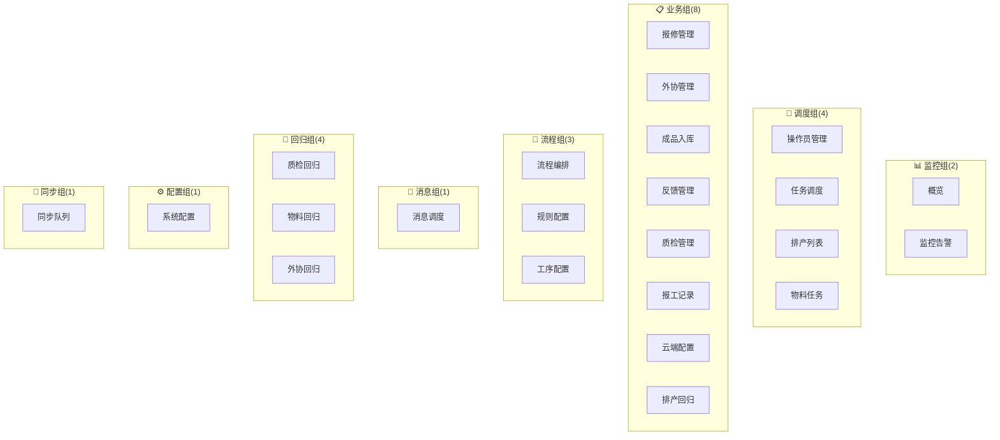

# 调度中心 — 功能与页面布局

> **版本**: v1.0(精简版)
> **生成日期**: 2026-06-28
> **服务端口**: 5003
> **入口**: [mobile_api_ai/standalone_dispatch_server.py](file:///d:/yuan/%E4%B8%8D%E9%94%90%E9%92%A2%E7%BD%91%E5%B8%A6%E8%B7%9F%E5%8D%953.0/mobile_api_ai/standalone_dispatch_server.py)
> **页面数**: 1 个主页面 + **23 个 Tab**
> **目标用户**: 系统管理员、业务主管、车间主任
> **配套文档**: [ARCHITECTURE.md](./ARCHITECTURE.md) — 如需 API 详情请查阅架构文档

---

## 一、系统定位与设计理念

### 1.1 系统定位

调度中心是不锈钢网带跟单系统的**中枢控制台**,面向系统管理员和业务主管,提供以下核心能力:

- 📊 **全局监控**: 一站式查看所有业务流程的实时状态
- 🎯 **任务调度**: 任务的分配、转派、取消、优先级管理
- 📋 **流程编排**: 业务规则的配置与调整
- 🔧 **回退管理**: 质检/物料/外协/排产回退操作
- ⚙️ **系统配置**: 全局参数、消息模板、操作员绑定

### 1.2 设计理念

```
┌────────────────────────────────────────────┐
│  📊 全局视角    🎯 任务驱动    ⚡ 即时响应  │
│  🔧 配置灵活    🔄 状态可控    📡 监控到位  │
└────────────────────────────────────────────┘
```

- **单页应用(SPA)**: 23 个 Tab 同框呈现,切换无刷新
- **数据驱动**: 所有 Tab 通过异步加载,实时更新
- **分级配色**: 不同 Tab 用不同左边色条标识(紧急度/类型)
- **集中控制**: 一切调度操作集中在此,避免分散

---

## 二、整体页面布局

### 2.1 主页面布局结构

```
┌─────────────────────────────────────────────────────────────────────┐
│ 🏭 调度中心        Dispatch Center                  ●●● 🔔 ● ● ●  │
├─────────┬───────────────────────────────────────────────────────────┤
│         │                                                           │
│ 概览    │                                                           │
│ 👥操作员│                                                           │
│ 任务调度│              Tab 内容区                                    │
│ 消息调度│           (动态切换 23 个 Tab)                             │
│ 流程编排│                                                           │
│ 规则配置│                                                           │
│ 📋工序配置                                                           │
│ 监控告警│                                                           │
│ ☁️云端配置                                                           │
│ 报修管理│                                                           │
│ 外协管理│                                                           │
│ 📦成品入库                                                           │
│ 📋反馈管理                                                           │
│ ✅质检管理                                                           │
│ 📋报工记录                                                           │
│ 🔬质检回归│                                                           │
│ 📦物料回归│                                                           │
│ 🔄外协回归│                                                           │
│ 📅排产回归│                                                           │
│ 📅排产列表│                                                           │
│ 📦物料任务│                                                           │
│ ⚙系统配置│                                                           │
│ 📡同步队列│                                                           │
│         │                                                           │
└─────────┴───────────────────────────────────────────────────────────┘
```

| 区域 | 宽度 | 高度 | 作用 |
|:-----|:----:|:----:|:-----|
| 顶部 Header | 100% | 60px | 标题 + 通知 + 用户 |
| 左侧 Sidebar | 220px | 自适应 | 23 个 Tab 导航 |
| 主内容区 | 自适应 | 自适应 | Tab 内容动态切换 |

### 2.2 侧边栏设计规范

#### 视觉规范

- 宽度: 220px
- 背景: `#2c3e50` 深色
- 选中态: 左侧 3px 蓝色条 + 白字
- 未选中: 浅灰字
- 4 个 Tab 有特殊左边色条标识回归/同步:

| Tab | 色条 | 含义 |
|:----|:----:|:-----|
| 🔬 质检回归 | `#9b59b6` 紫 | 质检回退 |
| 📦 物料回归 | `#e67e22` 橙 | 物料回退 |
| 🔄 外协回归 | `#1abc9c` 青 | 外协回退 |
| 📅 排产回归 | `#3498db` 蓝 | 排产回退 |
| 📡 同步队列 | `#e74c3c` 红 | 同步失败 |

#### 23 个 Tab 导航分组



---

## 三、23 个 Tab 详细布局

### 3.1 Tab 索引

| # | Tab ID | 名称 | 功能域 | 特殊标识 |
|:-:|:-------|:-----|:------:|:---------|
| 1 | `overview` | 概览 | 监控 | 默认 Tab |
| 2 | `operators` | 操作员管理 | 调度 | — |
| 3 | `tasks` | 任务调度 | 调度 | — |
| 4 | `messages` | 消息调度 | 消息 | — |
| 5 | `processes` | 流程编排 | 流程 | — |
| 6 | `rules` | 规则配置 | 流程 | — |
| 7 | `process-config` | 工序配置 | 流程 | — |
| 8 | `monitor` | 监控告警 | 监控 | — |
| 9 | `cloud` | 云端配置 | 业务 | — |
| 10 | `repairs` | 报修管理 | 业务 | — |
| 11 | `outsource` | 外协管理 | 业务 | — |
| 12 | `warehousing` | 成品入库 | 业务 | — |
| 13 | `feedback` | 反馈管理 | 业务 | — |
| 14 | `quality-inspect` | 质检管理 | 业务 | — |
| 15 | `report-records` | 报工记录 | 业务 | — |
| 16 | `quality-regression` | 质检回归 | 回归 | 🟣 紫色条 |
| 17 | `material-regression` | 物料回归 | 回归 | 🟠 橙色条 |
| 18 | `outsource-regression` | 外协回归 | 回归 | 🟢 青色条 |
| 19 | `schedule-regression` | 排产回归 | 回归 | 🔵 蓝色条 |
| 20 | `schedule` | 排产列表 | 调度 | — |
| 21 | `material-dc` | 物料任务 | 调度 | — |
| 22 | `system-config` | 系统配置 | 配置 | — |
| 23 | `sync-queue` | 同步队列 | 同步 | 🔴 红色条 |

---

### 3.2 概览 `overview`(默认 Tab)

#### 功能定位

调度中心首页,提供全局核心指标、操作员负载、容器中心概览,让管理员一眼掌握全局状态。

#### 页面布局

```
┌─────────────────────────────────────────────────────────────────────┐
│  📊 概览                                                            │
├─────────────────────────────────────────────────────────────────────┤
│                                                                     │
│  ┌────────┬────────┬────────┬────────┬────────┬────────┬────────┐  │
│  │待处理  │ 进行中  │今日完成│超时任务│完成率  │活跃流程│待入库   │  │
│  │  18    │  25    │   42   │   3   │  88%  │   12   │   7    │  │ ← 7 大统计卡
│  │(橙色) │(蓝色) │(绿色) │(红色) │(蓝色) │(蓝色) │(橙色)   │  │   (warning/danger/...)
│  └────────┴────────┴────────┴────────┴────────┴────────┴────────┘  │
│                                                                     │
│  ┌───── 操作员负载 ─────────────────────────────────────────────┐ │
│  │  张三(计划部)  [▓▓▓▓▓░░░] 5/8                              │ │
│  │  李四(生产部)  [▓▓▓░░░░░] 3/8                              │ │ ← 操作员任务负载
│  │  王五(质检部)  [▓▓▓▓▓▓░] 6/8                              │ │   (进度条 + 计数)
│  │  ...                                                        │ │
│  └─────────────────────────────────────────────────────────────┘ │
│                                                                     │
│  ┌───── 容器中心概览 ───────────────────────────────────────────┐ │
│  │  待处理:12   已分配:18   已确认:25   已完成:60              │ │ ← 容器状态汇总
│  │  已过期:3    总数:118                                       │ │
│  └─────────────────────────────────────────────────────────────┘ │
│                                                                     │
│  [🔄 刷新]  [📋 查看详情]                                          │
└─────────────────────────────────────────────────────────────────────┘
```

#### 关键功能

| 功能 | 描述 |
|:-----|:-----|
| 7 大统计卡 | 待处理/进行中/今日完成/超时/完成率/活跃流程/待入库 |
| 操作员负载 | 各操作员当前任务数 + 进度条 |
| 容器中心概览 | 实时容器流转状态汇总 |
| 待入库卡片 | 可点击跳转至 warehousing Tab |
| 快速刷新 | 右下角刷新按钮 |

#### 视觉规范

| 指标 | 颜色 | 含义 |
|:-----|:-----|:-----|
| 待处理 | `#e67e22` 橙 | 待办 |
| 进行中 | `#3498db` 蓝 | 执行 |
| 今日完成 | `#27ae60` 绿 | 已完成 |
| 超时任务 | `#e74c3c` 红 | 逾期警告 |
| 完成率 | `#3498db` 蓝 | 百分比 |
| 活跃流程 | `#3498db` 蓝 | 数量 |
| 待入库 | `#e67e22` 橙 | 提示 |

---

### 3.3 操作员管理 `operators`

#### 功能定位

管理系统所有操作员,包括基础信息、角色权限、部门绑定。

#### 页面布局

```
┌─────────────────────────────────────────────────────────────────────┐
│  👥 操作员管理                                       [+ 新增] [导入] │
├─────────────────────────────────────────────────────────────────────┤
│                                                                     │
│  🔍 搜索  │ 角色 [全部 ▼] │ 部门 [全部 ▼] │ 状态 [启用 ▼]         │
│                                                                     │
│  ┌───────────────────────────────────────────────────────────────┐│
│  │ 工号   │姓名 │角色    │部门   │电话       │状态 │报工量│操作   ││
│  ├───────────────────────────────────────────────────────────────┤│
│  │ OP001 │张三 │管理员  │管理部 │138-0001   │  ✓  │ 120 │编辑启停││
│  │ OP002 │李四 │工人    │生产部 │138-0002   │  ✓  │  95 │编辑启停││
│  │ OP003 │王五 │质检员  │质检部 │138-0003   │  ✓  │  78 │编辑启停││
│  │ OP004 │赵六 │工人    │生产部 │138-0004   │  ✗  │   0 │编辑启停││
│  └───────────────────────────────────────────────────────────────┘│
│                                                                     │
│  ◀ 1 2 3 ▶                                                         │
└─────────────────────────────────────────────────────────────────────┘
```

#### 关键功能

| 功能 | 描述 |
|:-----|:-----|
| 操作员列表 | 表格视图,展示所有人员 |
| 新增/编辑 | 弹窗表单,含部门绑定 |
| 启停切换 | 一键启停用(软删除) |
| 批量导入 | Excel 上传 + 预览 |
| 报工量统计 | 当日报工数,便于评估 |
| 多维筛选 | 角色/部门/状态 |

---

### 3.4 任务调度 `tasks`

#### 功能定位

调度中心核心 Tab,管理所有任务的分配、转派、优先级、取消。

#### 页面布局

```
┌─────────────────────────────────────────────────────────────────────┐
│  📋 任务调度           派发模式:[☑ 全员派发] [选择部门 ▼]           │
├─────────────────────────────────────────────────────────────────────┤
│                                                                     │
│  状态 [全部 ▼] 操作员 [全部 ▼] 类型 [全部 ▼]   [🔄 刷新]           │
│                                                                     │
│  ┌──────────────────────────────────────────────────────────────┐  │
│  │ # │ 订单号      │ 类型  │ 操作员 │ 状态     │ 创建时间  │ 操作│  │
│  ├──────────────────────────────────────────────────────────────┤  │
│  │ 1 │ GSB001     │ 报工  │ 张三   │ 待处理   │ 14:30   │[分配]│  │
│  │ 2 │ GSB001     │ 质检  │ 李四   │ 已分配   │ 14:25   │[转派]│  │
│  │ 3 │ GSB002     │ 物料  │ 王五   │ 进行中   │ 13:50   │[详情]│  │
│  │ 4 │ GSB003     │ 审批  │ -     │ ⚠ 超时  │ 12:00   │[升级]│  │ ← 超时红色
│  └──────────────────────────────────────────────────────────────┘  │
│                                                                     │
│  批量操作: [☑ 全选] [取消] [转派] [升级]                            │
└─────────────────────────────────────────────────────────────────────┘
```

#### 关键功能

| 功能 | 描述 |
|:-----|:-----|
| 派发模式 | 全员派发 / 选择部门 |
| 任务列表 | 表格 + 颜色标识(超时红色) |
| 单条操作 | 分配/转派/取消/升级 |
| 批量操作 | 多选后批量处理 |
| 实时刷新 | 自动 + 手动 |
| 超时高亮 | 超过 SLA 的任务红色标识 |

#### 任务状态色板

| 状态 | 颜色 | 含义 |
|:-----|:-----|:-----|
| 待处理 | 灰 | 新建未分配 |
| 已分配 | 蓝 | 已分给操作员 |
| 进行中 | 橙 | 操作员已接收 |
| 已完成 | 绿 | 已上报 |
| 超时 | 红 | 超过 SLA 未完成 |
| 已取消 | 暗灰 | 手动取消 |

---

### 3.5 消息调度 `messages`

#### 功能定位

管理微信消息模板,提供 6 大类消息分类(任务/流程/告警/物料/排产/其他),支持测试发送。

#### 页面布局

```
┌─────────────────────────────────────────────────────────────────────┐
│  💬 消息调度                                          [+ 新模板]    │
├─────────────────────────────────────────────────────────────────────┤
│                                                                     │
│  模板分类 Tab                                                        │
│  [全部] [📋 任务类] [🔧 流程类] [⚠️ 告警类]                       │
│  [📦 物料类] [📅 排产类] [📂 其他]                                 │
│                                                                     │
│  ┌──────────────────────────────────────────────────────────────┐  │
│  │ 模板名称     │ 分类 │ 触发场景   │ 状态 │ 操作              │  │
│  ├──────────────────────────────────────────────────────────────┤  │
│  │ 任务分配通知 │ 任务 │ 任务分配   │ 启用 │[编辑][测试][禁用] │  │
│  │ 工序完成通知 │ 流程 │ 工序完成   │ 启用 │[编辑][测试][禁用] │  │
│  │ 库存预警通知 │ 告警 │ 库存不足   │ 启用 │[编辑][测试][禁用] │  │
│  │ ...                                                        │  │
│  └──────────────────────────────────────────────────────────────┘  │
│                                                                     │
│  ┌── 快捷发送 Tab ────────────────────────────────────────────┐   │
│  │ [📋 任务] [🔧 流程] [⚠️ 告警] [📦 物料] [📅 排产] [📂 其他]│   │
│  │                                                             │   │
│  │ 收件人: [选择操作员 ▼]   模板: [任务分配通知 ▼]            │   │
│  │ 内容: 订单号 {order_no} 已分配给您,请及时处理。             │   │
│  │ [📤 发送测试]                                              │   │
│  └─────────────────────────────────────────────────────────────┘   │
└─────────────────────────────────────────────────────────────────────┘
```

#### 关键功能

| 功能 | 描述 |
|:-----|:-----|
| 6 大分类 | 任务/流程/告警/物料/排产/其他 |
| 模板 CRUD | 新建/编辑/删除/启停用 |
| 变量插入 | 编辑器支持 `{order_no}` 等变量 |
| 测试发送 | 选择操作员 → 测试模板 |
| 快速发送 | 临时消息(不存模板) |

---

### 3.6 流程编排 `processes`

#### 功能定位

可视化编排业务流转规则,支持流程的启动、推进、拒绝、回退。

#### 页面布局

```
┌─────────────────────────────────────────────────────────────────────┐
│  🔧 流程编排                                          [+ 新建流程]  │
├─────────────────────────────────────────────────────────────────────┤
│                                                                     │
│  流程列表                                                           │
│  ┌──────────────────────────────────────────────────────────────┐  │
│  │ 流程 ID    │ 名称        │ 节点数 │ 状态  │ 创建时间 │ 操作   │  │
│  ├──────────────────────────────────────────────────────────────┤  │
│  │ F001       │ 订单处理流  │   5   │ 启用 │ 06-20 │[编辑][禁用]│  │
│  │ F002       │ 报工流转    │   3   │ 启用 │ 06-21 │[编辑][禁用]│  │
│  │ F003       │ 质检流程    │   4   │ 启用 │ 06-22 │[编辑][禁用]│  │
│  └──────────────────────────────────────────────────────────────┘  │
│                                                                     │
│  ── 流程编辑器(展开) ──                                            │
│                                                                     │
│  ●━━━━━●━━━━━●━━━━━●━━━━━○                                       │
│  接单  切边  焊接  组装  发货                                       │
│  条件:数量>0  条件:无缺陷  条件:审核通过                            │
│                                                                     │
│  [+ 添加节点] [+ 添加条件]                                          │
└─────────────────────────────────────────────────────────────────────┘
```

#### 关键功能

| 功能 | 描述 |
|:-----|:-----|
| 流程 CRUD | 新建/编辑/启停用 |
| 可视化编辑 | 节点连线可视化 |
| 条件判断 | 每个节点可设置条件 |
| 流程版本 | 支持多版本并存 |

---

### 3.7 规则配置 `rules`

#### 功能定位

配置调度规则的匹配条件与触发动作,是任务自动分发的核心。

#### 页面布局

```
┌─────────────────────────────────────────────────────────────────────┐
│  ⚙️ 规则配置                                          [+ 新建规则]  │
├─────────────────────────────────────────────────────────────────────┤
│                                                                     │
│  调度规则列表                                                       │
│  ┌──────────────────────────────────────────────────────────────┐  │
│  │ 规则 ID │ 名称        │ 优先级 │ 匹配条件 │ 触发动作 │ 状态 │  │
│  ├──────────────────────────────────────────────────────────────┤  │
│  │ R001   │ 焊接工序分配│  高    │ 工序=焊接│ 分配给张三│ 启用 │  │
│  │ R002   │ 质检自动通知│  中    │ 工序完成 │ 推送质检员│ 启用 │  │
│  │ R003   │ 库存预警    │  高    │ 库存<50  │ 通知库管员│ 启用 │  │
│  └──────────────────────────────────────────────────────────────┘  │
│                                                                     │
│  ── 规则详情(展开) ──                                              │
│  名称: [焊接工序分配]                                              │
│  优先级: [高 ▼]                                                    │
│  匹配条件: 工序 = "焊接"                                          │
│  触发动作: 分配给 [张三 ▼]                                        │
│  [保存] [取消]                                                      │
└─────────────────────────────────────────────────────────────────────┘
```

---

### 3.8 工序配置 `process-config`

#### 功能定位

配置工序基础信息、微信推送、部门绑定。

#### 页面布局

```
┌─────────────────────────────────────────────────────────────────────┐
│  📋 工序配置                                          [+ 新建工序]  │
├─────────────────────────────────────────────────────────────────────┤
│                                                                     │
│  ┌──── 微信推送配置 ─────────────────────────────────────────┐   │
│  │ 工序名 │ 微信模板 │ 触发时机        │ 操作              │   │
│  │ 切边   │ 工序完成  │ 工序完成时      │ [编辑][删除]      │   │
│  │ 焊接   │ 工序完成  │ 工序完成时      │ [编辑][删除]      │   │
│  │ 组装   │ 工序完成  │ 工序完成时      │ [编辑][删除]      │   │
│  └─────────────────────────────────────────────────────────────┘   │
│                                                                     │
│  ┌──── 工序部门绑定 ─────────────────────────────────────────┐   │
│  │ 工序名 │ 部门   │ 负责人 │ 操作                         │   │
│  │ 切边   │ 生产部 │ 张三   │ [编辑][删除]                 │   │
│  │ 焊接   │ 焊工组 │ 李四   │ [编辑][删除]                 │   │
│  └─────────────────────────────────────────────────────────────┘   │
└─────────────────────────────────────────────────────────────────────┘
```

---

### 3.9 监控告警 `monitor`

#### 功能定位

实时监控系统状态、服务健康、调度日志。

#### 页面布局

```
┌─────────────────────────────────────────────────────────────────────┐
│  🩺 监控告警                                          [🔄 刷新]    │
├─────────────────────────────────────────────────────────────────────┤
│                                                                     │
│  服务状态                                                           │
│  ┌──────────────────────────────────────────────────────────────┐  │
│  │ 服务名称        │ 端口 │ 状态  │ CPU   │ 内存   │ 响应时间 │  │
│  ├──────────────────────────────────────────────────────────────┤  │
│  │ 调度中心       │ 5003 │  ● 正常 │ 25%  │ 40%   │ 12ms    │  │
│  │ 容器中心       │ 5002 │  ● 正常 │ 18%  │ 35%   │ 8ms     │  │
│  │ 报工系统       │ 5008 │  ● 正常 │ 32%  │ 45%   │ 15ms    │  │
│  │ 库存系统       │ 5010 │  ⚠ 警告 │ 65%  │ 78%   │ 120ms   │  │ ← 警告黄色
│  │ 大屏           │ 5000 │  ● 正常 │ 10%  │ 20%   │ 5ms     │  │
│  └──────────────────────────────────────────────────────────────┘  │
│                                                                     │
│  ── 调度日志(最新 50 条) ──                                       │
│  ┌──────────────────────────────────────────────────────────────┐  │
│  │ 14:30:25 │ INFO  │ 任务分发 GSB001 → 张三                  │  │
│  │ 14:25:10 │ WARN  │ 任务 GSB003 超时(>30min)              │  │
│  │ 14:20:05 │ INFO  │ 模板发送:任务分配通知                   │  │
│  │ ...                                                        │  │
│  └──────────────────────────────────────────────────────────────┘  │
│                                                                     │
│  [📥 导出日志]                                                      │
└─────────────────────────────────────────────────────────────────────┘
```

#### 关键功能

| 功能 | 描述 |
|:-----|:-----|
| 服务状态总览 | 5 大服务实时状态 |
| 性能指标 | CPU/内存/响应时间 |
| 日志滚动 | 最新 50 条调度日志 |
| 日志导出 | 下载为 .log 文件 |
| 警告高亮 | ⚠ 黄色标识 |

---

### 3.10 云端配置 `cloud`

#### 功能定位

配置云端通信参数,提供连接状态、消息轮询、使用说明。

#### 页面布局

```
┌─────────────────────────────────────────────────────────────────────┐
│  ☁️ 云端配置                                                        │
├─────────────────────────────────────────────────────────────────────┤
│                                                                     │
│  ┌──── 连接状态 ──────────────────────────────────────────────┐   │
│  │ ● 状态:已连接云端 5006   延迟:32ms    上次心跳:14:30:00     │   │
│  │ [🔌 测试连接] [🔄 重连]                                    │   │
│  └─────────────────────────────────────────────────────────────┘   │
│                                                                     │
│  ┌──── API 配置 ──────────────────────────────────────────────┐   │
│  │ 云端地址: [https://api.example.com          ]               │   │
│  │ API Key:  [*************************       ] [👁 显示]     │   │
│  │ 企业微信: ✓ 已配置   Corp ID: ww123456                     │   │
│  │ [💾 保存配置]                                              │   │
│  └─────────────────────────────────────────────────────────────┘   │
│                                                                     │
│  ┌──── 📨 轮询消息 ──────────────────────────────────────────┐   │
│  │ [⏸ 暂停] [▶ 启动]   轮询间隔:30s                          │   │
│  │ 待处理:5  已处理:128  失败:2                                │   │
│  │ [📋 查看详情]                                              │   │
│  └─────────────────────────────────────────────────────────────┘   │
│                                                                     │
│  ┌──── 📋 使用说明 ──────────────────────────────────────────┐   │
│  │ 1. 配置 API Key 后方可通信                                  │   │
│  │ 2. 建议轮询间隔 30s                                        │   │
│  │ 3. 失败消息会自动入死信表                                   │   │
│  └─────────────────────────────────────────────────────────────┘   │
└─────────────────────────────────────────────────────────────────────┘
```

#### 关键功能

| 功能 | 描述 |
|:-----|:-----|
| 连接状态 | 实时延迟 + 心跳检测 |
| 测试连接 | 一键测试连通性 |
| API Key 配置 | 安全存储(脱敏显示) |
| 轮询控制 | 启动/暂停轮询器 |
| 使用说明 | 内嵌帮助文档 |

---

### 3.11 报修管理 `repairs`

#### 功能定位

管理设备故障报修,包括报修种类配置、报修记录跟踪。

#### 页面布局

```
┌─────────────────────────────────────────────────────────────────────┐
│  🔧 报修管理                                          [+ 新增报修] │
├─────────────────────────────────────────────────────────────────────┤
│                                                                     │
│  报修记录                                                           │
│  ┌──────────────────────────────────────────────────────────────┐  │
│  │ 编号 │ 设备      │ 故障       │ 报修人 │ 状态     │ 操作    │  │
│  ├──────────────────────────────────────────────────────────────┤  │
│  │ R001 │ 焊接机 A │ 电流不稳   │ 张三  │ 处理中   │[详情]   │  │
│  │ R002 │ 切割机 B │ 刀片磨损   │ 李四  │ 已完成   │[详情]   │  │
│  │ R003 │ 包装机 C │ 控制失灵   │ 王五  │ 待处理   │[分配]   │  │
│  └──────────────────────────────────────────────────────────────┘  │
│                                                                     │
│  ── 报修种类配置(底部) ──                                          │
│  种类:机械故障 / 电气故障 / 软件故障 / 其他                        │
└─────────────────────────────────────────────────────────────────────┘
```

---

### 3.12 外协管理 `outsource`

#### 功能定位

管理外协订单的全流程:发出、生产、质检、收回。

#### 页面布局

```
┌─────────────────────────────────────────────────────────────────────┐
│  🔗 外协管理                                          [+ 新建外协]  │
├─────────────────────────────────────────────────────────────────────┤
│                                                                     │
│  状态 Tab: [全部] [发出] [生产中] [已收回] [已归档]                │
│                                                                     │
│  ┌──────────────────────────────────────────────────────────────┐  │
│  │ 编号   │ 订单号    │ 工序      │ 外协商  │ 状态    │ 操作   │  │
│  ├──────────────────────────────────────────────────────────────┤  │
│  │ OS001 │ GSB001   │ 表面处理  │ XX加工厂 │ 🟡生产中│[详情]  │  │
│  │ OS002 │ GSB003   │ 热处理    │ YY热处理 │ 🟢已收回│[详情]  │  │
│  └──────────────────────────────────────────────────────────────┘  │
│                                                                     │
│  ── 外协配置(底部) ──                                              │
│  外协商管理: + 添加外协商 [列表]                                    │
└─────────────────────────────────────────────────────────────────────┘
```

---

### 3.13 成品入库 `warehousing`

#### 功能定位

管理待入库订单,确认后入成品库。

#### 页面布局

```
┌─────────────────────────────────────────────────────────────────────┐
│  📦 成品入库                                          [🔄 刷新]    │
├─────────────────────────────────────────────────────────────────────┤
│                                                                     │
│  待入库订单(7)                                                     │
│  ┌──────────────────────────────────────────────────────────────┐  │
│  │ 订单号      │ 产品      │ 数量  │ 完成工序 │ 操作           │  │
│  ├──────────────────────────────────────────────────────────────┤  │
│  │ GSB20260628-001 │ 乙型网带 │ 100米 │ 6/6 ✓  │[📦 确认入库]  │  │
│  │ GSB20260628-002 │ 螺旋网带 │ 50米  │ 5/6    │[查看进度]     │  │
│  │ GSB20260627-005 │ 人字形   │ 80米  │ 6/6 ✓  │[📦 确认入库]  │  │
│  └──────────────────────────────────────────────────────────────┘  │
└─────────────────────────────────────────────────────────────────────┘
```

---

### 3.14 反馈管理 `feedback`

#### 功能定位

查看和处理用户提交的反馈意见。

#### 页面布局

```
┌─────────────────────────────────────────────────────────────────────┐
│  📋 反馈管理                                          [🔄 刷新]    │
├─────────────────────────────────────────────────────────────────────┤
│                                                                     │
│  状态: [全部 ▼]  类型: [全部 ▼]                                   │
│                                                                     │
│  ┌──────────────────────────────────────────────────────────────┐  │
│  │ 编号 │ 提交人 │ 类型    │ 内容       │ 状态  │ 操作         │  │
│  ├──────────────────────────────────────────────────────────────┤  │
│  │ F001 │ 张三  │ BUG    │ 报工报错  │ 待回复 │[回复][关闭] │  │
│  │ F002 │ 李四  │ 建议   │ 增加导出  │ 已回复 │[查看]       │  │
│  │ F003 │ 王五  │ 咨询   │ 流程问题  │ 已关闭 │[查看]       │  │
│  └──────────────────────────────────────────────────────────────┘  │
└─────────────────────────────────────────────────────────────────────┘
```

---

### 3.15 质检管理 `quality-inspect`

#### 功能定位

查询和管理质检记录,联动质检 V2 详情。

#### 页面布局

```
┌─────────────────────────────────────────────────────────────────────┐
│  ✅ 质检管理                                          [🔄 刷新]    │
├─────────────────────────────────────────────────────────────────────┤
│                                                                     │
│  结果: [全部 ▼] 类型: [全部 ▼] 时间: [近 7 天 ▼]                  │
│                                                                     │
│  ┌──────────────────────────────────────────────────────────────┐  │
│  │ 订单号      │ 工序  │ 检验员 │ 结果    │ 时间    │ 操作     │  │
│  ├──────────────────────────────────────────────────────────────┤  │
│  │ GSB001     │ 焊接  │ 李四  │ ✓ 合格  │ 14:30  │[详情]   │  │
│  │ GSB002     │ 组装  │ 王五  │ ✗ 不合格│ 13:15  │[详情][回退]│  │
│  │ GSB003     │ 终检  │ 赵六  │ ✓ 合格  │ 12:00  │[详情]   │  │
│  └──────────────────────────────────────────────────────────────┘  │
│                                                                     │
│  统计:合格 12 / 不合格 2 / 待复检 0                                │
└─────────────────────────────────────────────────────────────────────┘
```

---

### 3.16 报工记录 `report-records`

#### 功能定位

查询所有报工记录,支持撤回操作(管理员)。

#### 页面布局

```
┌─────────────────────────────────────────────────────────────────────┐
│  📋 报工记录                                          [🔄 刷新]    │
├─────────────────────────────────────────────────────────────────────┤
│                                                                     │
│  操作员 [全部 ▼] 工序 [全部 ▼] 时间 [今日 ▼]  [🔍 搜索]          │
│                                                                     │
│  ┌──────────────────────────────────────────────────────────────┐  │
│  │ 订单号   │ 工序 │ 数量 │ 操作员 │ 时间   │ 状态 │ 操作    │  │
│  ├──────────────────────────────────────────────────────────────┤  │
│  │ GSB001  │ 焊接 │ 10米 │ 张三  │ 14:30 │ 正常 │[详情]   │  │
│  │ GSB002  │ 切边 │ 50米 │ 李四  │ 14:25 │ 正常 │[撤回]   │  │
│  │ GSB003  │ 组装 │ 30米 │ 王五  │ 13:50 │ 已撤回│[详情]   │  │
│  └──────────────────────────────────────────────────────────────┘  │
│                                                                     │
│  统计:今日 25 单   已撤回 2 单                                       │
└─────────────────────────────────────────────────────────────────────┘
```

---

### 3.17 质检回归 `quality-regression`(🟣)

#### 功能定位

将质检结果回退到上一步,适用于质检误判场景。

#### 页面布局

```
┌─────────────────────────────────────────────────────────────────────┐
│  🔬 质检回归                                          [🔄 刷新]    │
├─────────────────────────────────────────────────────────────────────┤
│                                                                     │
│  ⚠️ 警告:回归操作不可逆,请谨慎使用                                 │
│                                                                     │
│  ┌──────────────────────────────────────────────────────────────┐  │
│  │ 订单号   │ 工序 │ 原结果  │ 提交人 │ 时间   │ 操作         │  │
│  ├──────────────────────────────────────────────────────────────┤  │
│  │ GSB001  │ 焊接 │ ✓ 合格  │ 李四  │ 14:30 │[↩️ 回退][查看]│  │
│  │ GSB002  │ 组装 │ ✗ 不合格│ 王五  │ 13:15 │[↩️ 回退][查看]│  │
│  └──────────────────────────────────────────────────────────────┘  │
│                                                                     │
│  [📥 导出回退日志]                                                  │
└─────────────────────────────────────────────────────────────────────┘
```

#### 关键功能

- 颜色标识: 紫色左边条 `#9b59b6`
- 回退确认: 弹窗二次确认
- 完整日志: 记录谁、何时、回退原因

---

### 3.18 物料回归 `material-regression`(🟠)

类似质检回归,针对物料状态回退。颜色:橙色 `#e67e22`

```
┌─────────────────────────────────────────────────────────────────────┐
│  📦 物料回归                                          [🔄 刷新]    │
├─────────────────────────────────────────────────────────────────────┤
│  ⚠️ 警告:回归操作不可逆                                            │
│  ┌──────────────────────────────────────────────────────────────┐  │
│  │ 订单号 │ 物料   │ 原状态 │ 当前 │ 操作                   │  │
│  │ GSB001 │ 不锈钢丝 │ 已出库 │ 缺料 │[↩️ 回退]             │  │
│  │ GSB002 │ 链条   │ 已确认 │ 待确认│[↩️ 回退]             │  │
│  └──────────────────────────────────────────────────────────────┘  │
└─────────────────────────────────────────────────────────────────────┘
```

---

### 3.19 外协回归 `outsource-regression`(🟢)

```
┌─────────────────────────────────────────────────────────────────────┐
│  🔄 外协回归                                          [🔄 刷新]    │
├─────────────────────────────────────────────────────────────────────┤
│  ┌──────────────────────────────────────────────────────────────┐  │
│  │ 编号  │ 订单号 │ 工序     │ 原状态 │ 操作                  │  │
│  │ OS001 │ GSB001 │ 表面处理 │ 已收回 │[↩️ 回退][查看]        │  │
│  └──────────────────────────────────────────────────────────────┘  │
└─────────────────────────────────────────────────────────────────────┘
```

---

### 3.20 排产回归 `schedule-regression`(🔵)

```
┌─────────────────────────────────────────────────────────────────────┐
│  📅 排产回归                                          [🔄 刷新]    │
├─────────────────────────────────────────────────────────────────────┤
│  ┌──────────────────────────────────────────────────────────────┐  │
│  │ 工单号 │ 订单号 │ 原状态  │ 操作                          │  │
│  │ W001  │ GSB001 │ 已发布  │[↩️ 回退][查看]                │  │
│  │ W002  │ GSB002 │ 已排产  │[↩️ 回退][查看]                │  │
│  └──────────────────────────────────────────────────────────────┘  │
└─────────────────────────────────────────────────────────────────────┘
```

---

### 3.21 排产列表 `schedule`

#### 功能定位

查看所有排产任务,支持发布/撤回/排产日期调整。

#### 页面布局

```
┌─────────────────────────────────────────────────────────────────────┐
│  📅 排产列表                                          [+ 新建排产] │
├─────────────────────────────────────────────────────────────────────┤
│                                                                     │
│  状态: [全部 ▼]  时间: [本周 ▼]                                    │
│                                                                     │
│  ┌──────────────────────────────────────────────────────────────┐  │
│  │ 工单号 │ 订单号   │ 开始日期  │ 工期  │ 状态    │ 操作      │  │
│  ├──────────────────────────────────────────────────────────────┤  │
│  │ W001  │ GSB001  │ 2026-06-29│ 5天  │ 待发布  │[发布][编辑]│  │
│  │ W002  │ GSB002  │ 2026-06-30│ 3天  │ 已发布  │[撤回]     │  │
│  │ W003  │ GSB003  │ 2026-07-01│ 7天  │ 已排产  │[详情]     │  │
│  └──────────────────────────────────────────────────────────────┘  │
└─────────────────────────────────────────────────────────────────────┘
```

---

### 3.22 物料任务 `material-dc`

#### 功能定位

调度中心专属的物料任务管理,提供缺料清单和补料/退料操作。

#### 页面布局

```
┌─────────────────────────────────────────────────────────────────────┐
│  📦 物料任务                                          [🔄 刷新]    │
├─────────────────────────────────────────────────────────────────────┤
│                                                                     │
│  状态 Tab: [全部] [待确认] [缺料] [已确认] [已到货] [已出库]        │
│                                                                     │
│  ┌──────────────────────────────────────────────────────────────┐  │
│  │ 订单号 │ 物料     │ 需求 │ 状态 │ 操作                    │  │
│  ├──────────────────────────────────────────────────────────────┤  │
│  │ GSB001 │ 不锈钢丝 │ 100kg│ 缺料 │[补料][退料][确认]      │  │
│  │ GSB002 │ 链条    │ 50根 │ 已到货│[出库]                  │  │
│  └──────────────────────────────────────────────────────────────┘  │
│                                                                     │
│  ⚠️ 缺料订单:2                                                     │
└─────────────────────────────────────────────────────────────────────┘
```

---

### 3.23 系统配置 `system-config`

#### 功能定位

系统级全局配置,采用左侧分类 + 右侧配置的二级布局。

#### 页面布局

```
┌─────────────────────────────────────────────────────────────────────┐
│  ⚙️ 系统配置                                                        │
├──────────┬──────────────────────────────────────────────────────────┤
│ 分类      │  ── 通用设置 ──                                          │
│ 通用     │                                                          │
│ 安全     │  系统名称: [不锈钢网带跟单系统 v3.0       ]              │
│ 消息     │  系统 Logo: [📎 上传]                                     │
│ 数据库   │  默认主题: [浅色 ▼]                                       │
│ 缓存     │                                                          │
│ 集成     │  ── 业务规则 ──                                          │
│ 高级     │  订单自动确认: [☑ 启用]   超时时间: [30 分钟 ▼]           │
│          │  库存预警:    [☑ 启用]   阈值: [50 件]                  │
│          │                                                          │
│          │  [💾 保存配置]                                            │
└──────────┴──────────────────────────────────────────────────────────┘
```

#### 配置分类

| 分类 | 包含项 |
|:-----|:-------|
| 通用 | 系统名称、Logo、主题 |
| 安全 | 密码策略、Session 时长 |
| 消息 | 微信推送开关、模板 |
| 数据库 | 连接配置、备份策略 |
| 缓存 | TTL、失效策略 |
| 集成 | 第三方系统对接 |
| 高级 | 性能调优、调试选项 |

#### 关键功能

- 二级导航: 左侧分类 + 右侧配置
- 即时保存: 修改后立即生效
- 配置导入/导出: JSON 格式

---

### 3.24 同步队列 `sync-queue`(🔴)

#### 功能定位

查看同步失败的消息队列,提供手动重推和清空操作。

#### 页面布局

```
┌─────────────────────────────────────────────────────────────────────┐
│  📡 同步队列                                          [🔄 刷新]    │
├─────────────────────────────────────────────────────────────────────┤
│                                                                     │
│  队列统计                                                           │
│  ┌────────┬────────┬────────┬────────┐                            │
│  │ 待重试 │ 失败  │ 死信  │ 今日成功│                            │
│  │   5    │   2   │   1   │  128   │                            │
│  └────────┴────────┴────────┴────────┘                            │
│                                                                     │
│  ┌──────────────────────────────────────────────────────────────┐  │
│  │  ID  │ 类型    │ 目标     │ 失败原因       │ 次数 │ 操作   │  │
│  ├──────────────────────────────────────────────────────────────┤  │
│  │ 001  │ 报工    │ 8008同步 │ 连接超时       │  3   │[重试]  │  │
│  │ 002  │ 质检    │ 8008同步 │ 数据格式错误   │  5   │[重试][删除]│
│  │ 003  │ 通知    │ 云端5006 │ 鉴权失败       │  10  │[查看][删除]│
│  └──────────────────────────────────────────────────────────────┘  │
│                                                                     │
│  [🔄 全部重试] [🗑 清空死信]                                        │
└─────────────────────────────────────────────────────────────────────┘
```

#### 关键功能

| 功能 | 描述 |
|:-----|:-----|
| 队列统计 | 待重试/失败/死信/今日成功 |
| 单条重试 | 手动重推失败项 |
| 全部重试 | 一键重推所有待重试项 |
| 清空死信 | 删除永久失败项 |
| 失败原因 | 详细错误信息 |

---

## 四、底部状态栏

```
┌─────────────────────────────────────────────────────────────────────┐
│  ✓ 已连接数据库  │ 服务:5003 在线  │ 用户:管理员  │ 2026-06-28 14:30│
└─────────────────────────────────────────────────────────────────────┘
```

| 元素 | 状态 |
|:-----|:-----|
| 数据库 | 绿色 ✓ / 红色 ✗ |
| 服务 | 端口 5003 心跳状态 |
| 用户 | 当前登录用户 |
| 时间 | 实时时钟 |

---

## 五、通用 UI 组件库

### 5.1 统计卡片

```html
<div class="card">
  <div class="label">待处理任务</div>
  <div class="value warning">18</div>
</div>
```

| 状态 | value 颜色 | CSS 类 |
|:-----|:----------|:------|
| 警告 | 橙 `#e67e22` | `.warning` |
| 主要 | 蓝 `#3498db` | `.primary` |
| 成功 | 绿 `#27ae60` | `.success` |
| 危险 | 红 `#e74c3c` | `.danger` |

### 5.2 进度条

```html
<div class="progress">
  <div class="progress-fill" style="width: 60%"></div>
</div>
```

样式: 高度 12px,圆角 6px,填充色渐变

### 5.3 表格

- 表头背景: `#f8f9fa`
- 行高: 38px
- Hover: `#f0f4f8`
- 选中: 左侧 3px 蓝条

### 5.4 按钮

| 类型 | 颜色 | 用途 |
|:-----|:-----|:-----|
| 主按钮 | `#667eea` | 提交/确认 |
| 成功 | `#27ae60` | 入库/通过 |
| 警告 | `#f39c12` | 撤回/编辑 |
| 危险 | `#e74c3c` | 删除/禁用 |
| 次要 | `#95a5a6` | 取消 |

### 5.5 标签徽章

```html
<span class="badge badge-warning">待处理</span>
<span class="badge badge-success">已完成</span>
<span class="badge badge-danger">已超时</span>
```

### 5.6 弹窗

- 遮罩: `rgba(0,0,0,0.4)`
- 卡片: 白底圆角 8px
- 标题 + 内容 + 操作按钮组
- ESC 关闭 / 点击遮罩关闭

### 5.7 加载动画

```css
.spinner {
  border: 4px solid #f3f3f3;
  border-top: 4px solid #3498db;
  border-radius: 50%;
  animation: spin 1s linear infinite;
}
```

---

## 六、视觉规范

### 6.1 配色方案

| 角色 | 色值 | 用途 |
|:-----|:-----|:-----|
| 主色 Primary | `#667eea` | 主按钮、强调 |
| 深色 Sidebar | `#2c3e50` | 侧边栏背景 |
| 成功 Success | `#27ae60` | 完成、通过 |
| 警告 Warning | `#f39c12` / `#e67e22` | 提醒、超时 |
| 危险 Danger | `#e74c3c` | 错误、阻塞 |
| 信息 Info | `#3498db` | 一般信息 |

### 6.2 Tab 特殊色条

| Tab | 色条 | 色值 |
|:----|:----:|:-----|
| 质检回归 | 🟣 | `#9b59b6` |
| 物料回归 | 🟠 | `#e67e22` |
| 外协回归 | 🟢 | `#1abc9c` |
| 排产回归 | 🔵 | `#3498db` |
| 同步队列 | 🔴 | `#e74c3c` |

### 6.3 字体规范

| 用途 | 大小 | 字重 |
|:-----|:-----|:-----|
| Header H1 | 20-24px | 600 |
| Tab 标题 | 16px | 600 |
| 表格头 | 13px | 500 |
| 表格内容 | 13px | 400 |
| 大数字(KPI) | 28-36px | 700 |

### 6.4 间距规范

| 级别 | 值 | 用途 |
|:-----|:---|:-----|
| xs | 4px | 标签内间距 |
| sm | 8px | 表格行内间距 |
| md | 12px | 卡片内间距 |
| lg | 16px | 区块间距 |
| xl | 24px | Tab 内边距 |

---

## 七、核心交互模式

### 7.1 Tab 切换

```javascript
function switchTab(tabId) {
  // 1. 移除所有 Tab 激活态
  document.querySelectorAll('.sidebar-item').forEach(item => 
    item.classList.remove('active'));
  document.querySelectorAll('.tab-content').forEach(content => 
    content.classList.remove('active'));
  
  // 2. 激活选中 Tab
  document.querySelector(`[onclick*="${tabId}"]`).classList.add('active');
  document.getElementById(`tab-${tabId}`).classList.add('active');
  
  // 3. 触发对应加载函数
  if (typeof loadFunctions[tabId] === 'function') {
    loadFunctions[tabId]();
  }
}
```

### 7.2 任务分配流程

```
管理员在「任务调度」Tab 看到待处理任务
   ↓ 选择任务(点击行)
   ↓ 点击[分配]按钮
   ↓ 弹出操作员选择弹窗
   ↓ 选择操作员(支持搜索)
   ↓ 点击[确认分配]
   ↓ 任务状态变为"已分配"
   ↓ 自动发送微信通知给操作员
   ↓ 任务出现在操作员手机端
```

### 7.3 回退操作流程

```
在「质检回归」Tab 选择记录
   ↓ 点击[↩️ 回退]按钮
   ↓ 弹出二次确认弹窗:"回退不可逆,确认?"
   ↓ 填写回退原因(必填)
   ↓ 点击[确认回退]
   ↓ 系统将质检结果重置为待修改
   ↓ 写入回退日志
   ↓ 通知相关人员
```

### 7.4 模板测试发送

```
在「消息调度」Tab 选择模板
   ↓ 点击[测试]按钮
   ↓ 弹出测试对话框
   ↓ 选择测试接收人
   ↓ 预览模板内容
   ↓ 点击[📤 发送]
   ↓ 显示"已发送"+接收人微信收到消息
```

---

## 八、用户场景举例

### 场景 1:管理员监控全局

1. 打开 `http://localhost:5003/api/dispatch-center/`
2. 默认进入「概览」Tab
3. 查看 7 大统计卡 + 操作员负载
4. 发现"超时任务:3" → 点击进入「任务调度」
5. 看到红色超时任务 → 批量选择 → 点击[升级]
6. 任务被升级到更高优先级

### 场景 2:调度员分配任务

1. 进入「任务调度」Tab
2. 看到 18 个待处理任务
3. 选择"焊接工序"任务 → 点击[分配]
4. 弹窗选择"张三(焊接部)"
5. 确认分配 → 任务变"已分配"
6. 张三手机端立即收到微信通知

### 场景 3:配置新工序

1. 进入「工序配置」Tab
2. 点击 [+ 新建工序]
3. 填写工序名"包装"+ 微信模板选择
4. 绑定部门"包装部"+ 负责人"赵六"
5. 保存 → 新工序出现在列表

### 场景 4:处理回退请求

1. 操作员发起"质检结果有误,申请回退"
2. 管理员进入「质检回归」Tab
3. 找到对应记录(紫色左边条)
4. 点击[↩️ 回退]
5. 弹窗确认 + 填写原因
6. 确认 → 质检状态重置
7. 系统自动通知质检员重新录入

### 场景 5:排查同步失败

1. 收到"同步异常"告警
2. 进入「同步队列」Tab(红色左边条)
3. 看到 5 个待重试 + 2 个失败
4. 选择某条记录 → 查看失败原因
5. 若"连接超时" → 点击[🔄 重试]
6. 若"数据格式错误" → 修复数据后重试
7. 重试成功 → 移出队列

### 场景 6:配置系统参数

1. 进入「系统配置」Tab
2. 左侧选择"安全"分类
3. 修改密码策略:最低 10 位 + 大小写
4. 修改 Session 时长:2 小时
5. 点击保存 → 立即生效

---

## 九、设计原则

### 9.1 集中控制

- 所有调度操作集中于此
- 不分散到各个子模块
- 管理员一站式管理

### 9.2 状态可视

- 颜色编码统一
- 进度条 + 数字双标识
- 重要 Tab 用色条区分

### 9.3 操作可逆

- 4 类回退 Tab 专设
- 所有操作写日志
- 二次确认防误操作

### 9.4 数据透明

- 概览页全维度
- 操作员负载可见
- 队列统计实时

### 9.5 异常可见

- 监控 Tab 服务健康
- 同步队列失败醒目
- 日志可导出排查

---

## 十、文档交叉引用

| 维度 | 文档 |
|:-----|:-----|
| 页面清单 | [FRONTEND_PAGES.md](./FRONTEND_PAGES.md) |
| 架构与功能(含 API) | [ARCHITECTURE.md](./ARCHITECTURE.md) |
| 多维度排列 | [PAGE_ARRANGEMENT.md](./PAGE_ARRANGEMENT.md) |
| 视图与截图 | [PAGE_VIEWS.md](./PAGE_VIEWS.md) |
| 手机报工(功能+布局) | [MOBILE_REPORTING.md](./MOBILE_REPORTING.md) |
| **调度中心(功能+布局)** | **本文档** |

---

**文档结束**