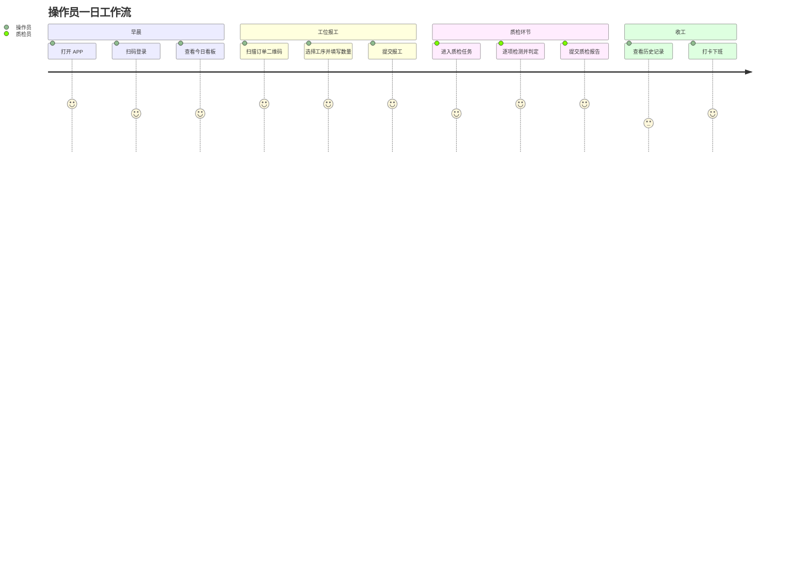
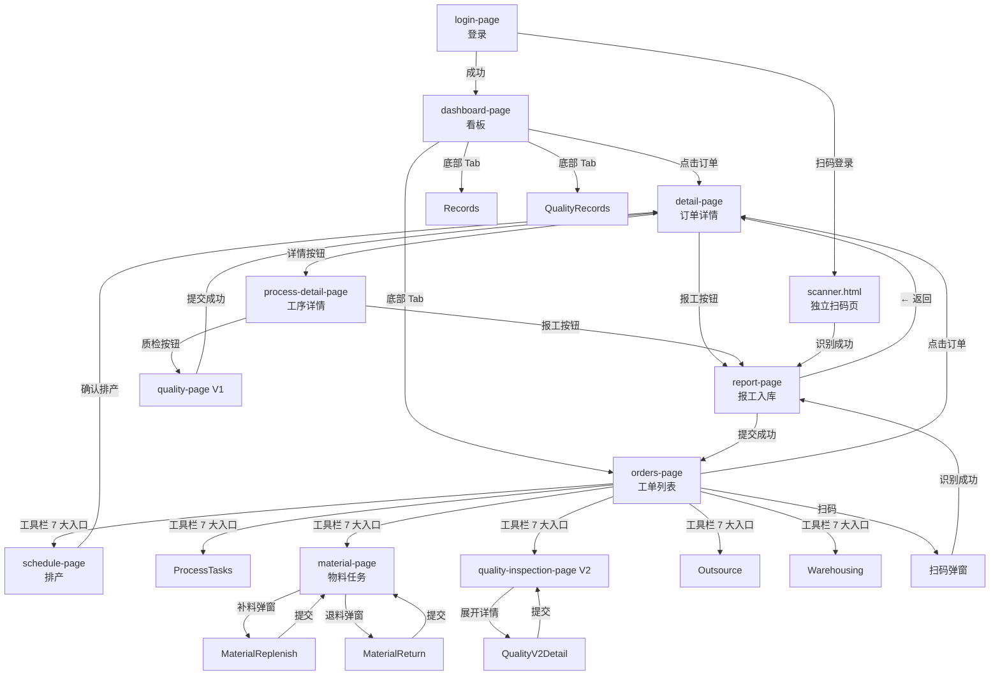

# 手机报工系统 — 功能与页面布局

> **版本**: v2.0(精简版)
> **生成日期**: 2026-06-28
> **服务端口**: 5008
> **入口**: [mobile_api_ai/app.py](file:///d:/yuan/%E4%B8%8D%E9%94%90%E9%92%A2%E7%BD%91%E5%B8%A6%E8%B7%9F%E5%8D%953.0/mobile_api_ai/app.py)
> **页面数**: 3 个主页面 + 16 个子页面
> **目标用户**: 车间操作员(手机/平板)
> **配套文档**: [ARCHITECTURE.md](./ARCHITECTURE.md) — 如需 API 详情请查阅架构文档

---

## 一、系统定位与用户旅程

### 1.1 系统定位

手机报工系统是不锈钢网带跟单系统的**移动端入口**,面向车间一线操作员,提供扫码报工、质检录入、物料确认、外协管理、成品入库、排产确认等核心业务的移动化操作界面。

**设计目标**:
- 📱 触控优先(最小 44px 触控目标)
- 📷 摄像头集成(一键扫码)
- 🔄 离线可用(关键操作可缓存)
- ⚡ 简洁高效(3 步内完成报工)

### 1.2 用户旅程总览



---

## 二、3 个主页面总览

### 2.1 [mobile_login.html](file:///d:/yuan/%E4%B8%8D%E9%94%90%E9%92%A2%E7%BD%91%E5%B8%A6%E8%B7%9F%E5%8D%953.0/mobile_api_ai/templates/mobile_login.html) — 企业微信登录页

#### 功能定位

登录入口,通过企业微信 OAuth 一键登录;测试环境支持工号/姓名手动输入。

#### 页面布局

```
┌────────────────────────────┐
│                            │
│     ┌──────────────────┐   │
│     │                  │   │
│     │   🏭 企业微信登录   │   │
│     │                  │   │
│     │   ⏳ 加载中...     │   │
│     │                  │   │
│     │   [输入工号/姓名]  │   │  ← 仅测试环境
│     │   [    登 录    ]  │   │
│     │                  │   │
│     └──────────────────┘   │
│                            │
└────────────────────────────┘
```

#### 关键功能

| 功能 | 描述 |
|:-----|:-----|
| 企业微信 OAuth | 通过 corp_userid 自动登录(主流程) |
| 备用登录 | 工号/姓名手动输入(测试/无企业微信环境) |
| 登录态存储 | localStorage 存 user_id + token |
| 失败提示 | 红色错误信息 + 错误码 |
| 安全加固 | 删除硬编码后门,强制 OAuth |

#### 交互细节

- 自动跳转: 加载完成自动调用 OAuth 接口
- Loading 状态: 旋转 spinner + "加载中..."
- 成功动画: 绿色对勾 + 跳转主页
- 失败提示: 红色"登录失败,请重试"

---

### 2.2 [scanner.html](file:///d:/yuan/%E4%B8%8D%E9%94%90%E9%92%A2%E7%BD%91%E5%B8%A6%E8%B7%9F%E5%8D%953.0/mobile_api_ai/templates/scanner.html) — 独立扫码页

#### 功能定位

独立的全屏扫码页面,提供摄像头二维码/条码识别,识别后自动跳转到对应任务的报工/确认界面。

#### 页面布局

```
┌────────────────────────────┐
│ ← 扫码                       │
├────────────────────────────┤
│                            │
│   ┌────────────────────┐   │
│   │                    │   │
│   │                    │   │
│   │    ┌────────┐      │   │  ← 摄像头预览区
│   │    │ 取景框 │      │   │
│   │    │        │      │   │
│   │    └────────┘      │   │
│   │                    │   │
│   │                    │   │
│   └────────────────────┘   │
│                            │
│   将二维码/条码对准框内       │
│                            │
│   [📝 手动输入工单号]         │  ← 备用入口
│                            │
│   ─── 扫码历史 ───         │
│   • GSB20260628-001 14:30  │
│   • GSB20260627-003 13:15  │
│                            │
└────────────────────────────┘
```

#### 关键功能

| 功能 | 描述 |
|:-----|:-----|
| 摄像头调用 | `navigator.mediaDevices.getUserMedia()` 后置摄像头 |
| 二维码识别 | 纯 JS 实时识别,每帧扫描 |
| 取景框提示 | 半透明遮罩 + 中央方框 |
| 手动输入 | 备用文本框(无摄像头场景) |
| 任务确认 | 扫码后显示任务详情,可确认/取消 |
| 报工字段 | 数量 + 工序(可选) + 备注 |
| 历史记录 | 本地缓存最近 10 次扫码 |
| 自动停止 | 扫码成功后自动关闭摄像头 |

#### 扫码格式支持

- `WO:WO202604001` — 标准工单号
- `ORD:ORD202604001` — 标准订单号
- `WO202604001` — 简写格式(自动识别)

#### 交互细节

| 状态 | 视觉反馈 |
|:-----|:---------|
| 申请权限中 | spinner + "加载中..." |
| 权限被拒 | 红色提示 + 重试按钮 |
| 扫描中 | 取景框闪烁 + 状态文字 |
| 识别成功 | 振动反馈 + 跳转任务页 |
| 识别失败 | 红色提示 + 持续扫描 |
| 网络错误 | 离线缓存 + 稍后重试 |

---

### 2.3 [mobile_unified.html](file:///d:/yuan/%E4%B8%8D%E9%94%90%E9%92%A2%E7%BD%91%E5%B8%A6%E8%B7%9F%E5%8D%953.0/mobile_api_ai/templates/mobile_unified.html) — 统一报工 SPA

#### 功能定位

整个手机报工系统的**核心页面**,采用单页应用(SPA)架构,包含 16 个子页面,通过底部导航栏和工具栏按钮实现快速切换。

#### 整体布局结构

```
┌────────────────────────────────┐
│  ☰  📊 生产看板        🔄 刷新  │  ← 顶部导航栏(48px)
├────────────────────────────────┤
│                                │
│   紧急订单(3)                  │  ← 主体内容区(动态切换)
│   ┌────────────────────┐      │
│   │ 🔴 GSB20260628-001 │      │  ← 红色紧急标识
│   │    明天到期 - 100米  │      │
│   └────────────────────┘      │
│                                │
│   今日统计                     │
│   ┌─────┬─────┬─────┐         │  ← 3 列统计卡片
│   │ 5   │ 12  │ 3   │         │
│   │任务 │完成 │待办 │         │
│   └─────┴─────┴─────┘         │
│                                │
│   工具栏                       │
│   ┌─────┬─────┬─────┐         │  ← 2 行 4 列按钮
│   │📷扫码│📋排产│🔧工序│📦物料 │     (彩色入口)
│   ├─────┼─────┼─────┼─────┤    │
│   │🔍质检│🔗外协│📦入库│       │
│   └─────┴─────┴─────┴─────┘    │
│                                │
├────────────────────────────────┤
│ 📊看板 │📝工单 │📋记录 │✅质检 │🚪 │  ← 底部导航 5 Tab
└────────────────────────────────┘
```

#### 底部导航 5 Tab

| Tab | 图标 | 功能 |
|:----|:----:|:-----|
| 看板 | 📊 | 统计总览、紧急订单 |
| 工单 | 📝 | 订单列表、报工入口 |
| 记录 | 📋 | 报工历史、撤回 |
| 质检 | ✅ | 质检记录、V2 完整版 |
| 退出 | 🚪 | 退出登录 |

#### 顶部固定栏

- 左侧: 汉堡菜单(展开完整功能菜单)
- 中间: 当前页标题
- 右侧: 刷新按钮 / 通知铃铛

---

## 三、16 个子页面详细布局

### 3.1 子页面索引

| # | 子页面 | 中文名称 | 主要功能 |
|:-:|:-------|:---------|:---------|
| 1 | login-page | 简易登录 | 测试环境登录入口 |
| 2 | dashboard-page | 生产看板 | 4 大统计 + 紧急订单 |
| 3 | orders-page | 工单列表 | 订单卡片 + 筛选 |
| 4 | detail-page | 订单详情 | 订单字段展示 |
| 5 | process-detail-page | 工序详情 | 子工序 + 报工按钮 |
| 6 | report-page | 报工入库 | **核心:报工表单** |
| 7 | quality-page | 质检上报 V1 | 质检结果录入 |
| 8 | records-page | 报工记录 | 历史报工列表 |
| 9 | production-page | 生产工单 | 工单管理 |
| 10 | quality-records-page | 质检记录 | 质检历史 |
| 11 | workers-page | 人员管理 | 操作员列表 |
| 12 | schedule-page | 排产任务 | 排产确认 |
| 13 | process-tasks-page | 工序任务 | 工序任务列表 |
| 14 | warehousing-page | 成品入库 | 入库确认 |
| 15 | material-page | 物料任务 | **完整:物料 7 态流转** |
| 16 | outsource-page | 外协任务 | 外协管理 |
| 17 | quality-inspection-page | 质检任务 V2 | **完整:5 步质检流** |

---

### 3.2 生产看板 `dashboard-page`

#### 功能定位

系统首页,提供当日核心数据展示,让操作员快速掌握工作优先级。

#### 页面布局

```
┌────────────────────────────────┐
│ 📊 生产看板              🔄 刷新 │
├────────────────────────────────┤
│                                │
│  今日统计                       │
│  ┌──────────┬──────────┐       │
│  │ 总订单 5 │ 待生产 3 │       │  ← 2x2 统计网格
│  │   ▲ 12% │   ▼ 3%  │       │
│  ├──────────┼──────────┤       │
│  │ 已完成12 │ 进行中 8 │       │
│  │   ▲ 5%  │   ▲ 8%  │       │
│  └──────────┴──────────┘       │
│                                │
│  🚨 紧急订单(2)                │
│  ┌────────────────────┐      │
│  │ 🔴 GSB20260628-001 │      │  ← 红色左边框
│  │    明天到期 · 100米  │      │
│  └────────────────────┘      │
│  ┌────────────────────┐      │
│  │ 🔴 GSB20260628-003 │      │
│  │    当天到期 · 50米   │      │
│  └────────────────────┘      │
│                                │
│  📅 预期交付(3)                │
│  ┌────────────────────┐      │
│  │ 🔵 GSB20260627-005 │      │  ← 蓝色左边框
│  │    后天到期 · 80米   │      │
│  └────────────────────┘      │
│                                │
└────────────────────────────────┘
```

#### 关键功能

| 功能 | 描述 |
|:-----|:-----|
| 4 大统计卡 | 总订单 / 待生产 / 已完成 / 进行中 |
| 紧急订单列表 | 红色标识 + 倒计时文字 |
| 预期交付列表 | 蓝色标识 + 日期显示 |
| 一键跳转 | 点击订单卡片 → 订单详情 |
| 自动刷新 | 30 秒自动更新 |

#### 视觉规范

- 紧急订单: 🔴 红色左边框 3px
- 预期交付: 🔵 蓝色左边框 3px
- 统计数字: 24px 粗体,带变化趋势箭头(▲▼)
- 卡片: 白底圆角 8px,阴影 0 1px 3px

---

### 3.3 工单列表 `orders-page`

#### 功能定位

所有工单的列表视图,支持多维筛选和快速报工入口。

#### 页面布局

```
┌────────────────────────────────┐
│ 📝 工单列表     🔍筛选 │📷扫码  │
├────────────────────────────────┤
│                                │
│  [搜索框:订单号/客户]            │
│                                │
│  工具栏(7 大入口)              │
│  ┌─────┬─────┬─────┬─────┐   │
│  │📷扫码│📋排产│🔧工序│📦物料 │  ← 第 1 行
│  ├─────┼─────┼─────┼─────┤   │
│  │🔍质检│🔗外协│📦入库│       │  ← 第 2 行
│  └─────┴─────┴─────┴─────┘   │
│                                │
│  订单卡片列表                   │
│  ┌────────────────────┐      │
│  │ GSB20260628-001    │      │
│  │ ─────────────────  │      │
│  │ 客户:上海机械厂     │      │
│  │ 产品:乙型网带 B-500 │      │
│  │ 数量:100米          │      │
│  │ 交期:🔴 明天到期     │      │
│  │                    │      │
│  │ 进度: ▓▓▓░░░ 60%   │      │
│  │ [📝 报工入库]      │      │  ← 快捷入口
│  │ [📋 订单详情]      │      │
│  └────────────────────┘      │
│                                │
│  ┌────────────────────┐      │
│  │ GSB20260628-002    │      │
│  │ ...                │      │
│  └────────────────────┘      │
│                                │
└────────────────────────────────┘
```

#### 关键功能

| 功能 | 描述 |
|:-----|:-----|
| 搜索框 | 订单号 / 客户名 / 产品名 |
| 7 大入口 | 扫码 / 排产 / 工序 / 物料 / 质检 / 外协 / 入库 |
| 订单卡片 | 完整订单信息 + 进度条 |
| 快捷按钮 | 报工入库 / 订单详情 |
| 紧急度色 | 🟢🟡🔴 三色边框 |
| 进度条 | 完成数量 / 总数量 |

#### 工具栏 7 大入口颜色规范

| 按钮 | 颜色 | 跳转页面 |
|:-----|:-----|:---------|
| 📷 扫码 | `#667eea` 主色 | 打开扫码弹窗 |
| 📋 排产 | `#9b59b6` 紫 | 排产任务页 |
| 🔧 工序 | `#2980b9` 蓝 | 工序任务页 |
| 📦 物料 | `#f39c12` 橙 | 物料任务页 |
| 🔍 质检 | `#3498db` 蓝 | 质检任务页 |
| 🔗 外协 | `#e67e22` 橙 | 外协任务页 |
| 📦 入库 | `#27ae60` 绿 | 成品入库页 |

#### 卡片颜色边框

| 紧急度 | 颜色 | 含义 |
|:-------|:-----|:-----|
| 🟢 正常 | `#27ae60` | 交期 > 7 天 |
| 🟡 临近 | `#f39c12` | 交期 3-7 天 |
| 🔴 紧急 | `#e74c3c` | 交期 < 3 天 / 已逾期 |

---

### 3.4 订单详情 `detail-page`

#### 功能定位

单个订单的完整信息展示,作为报工入口的桥梁。

#### 页面布局

```
┌────────────────────────────────┐
│ ← 订单详情                      │
├────────────────────────────────┤
│                                │
│  GSB20260628-001               │
│  ─────────────────             │
│  状态: 🔵 已确认               │
│  客户: 上海机械厂              │
│  产品: 乙型网带 B-500          │
│  规格: 500mm                   │
│  材质: SUS304                  │
│  数量: 100米                   │
│  交期: 2026-06-29              │
│  业务员: 张三                  │
│                                │
│  工序进度                       │
│  ●━━━━━●━━━━━●━━━━━○          │
│  接单  切边  焊接  组装          │  ← 时间线
│  ✓    ✓    进行中 待开始        │
│                                │
│  [📝 报工入库]                  │  ← 主操作按钮
│  [📋 订单详情]                  │
│                                │
└────────────────────────────────┘
```

#### 关键功能

| 功能 | 描述 |
|:-----|:-----|
| 订单信息 | 完整字段展示(客户/产品/规格/材质等) |
| 工序时间线 | 圆点+连线可视化推进 |
| 状态徽章 | 7 色订单状态色板 |
| 报工入口 | 一键进入报工表单 |
| 返回导航 | 顶部 ← 返回工单列表 |

---

### 3.5 工序详情 `process-detail-page`

#### 功能定位

订单下各工序的详细列表,可对每个工序发起报工。

#### 页面布局

```
┌────────────────────────────────┐
│ ← 工序详情                      │
├────────────────────────────────┤
│                                │
│  GSB20260628-001 工序列表        │
│                                │
│  ┌────────────────────┐      │
│  │ 🔧 切边             │      │
│  │ 计划:100米 已完成:100│      │
│  │ ▓▓▓▓▓▓▓▓▓▓ 100%  ✓│      │  ← 已完成(绿)
│  │ 操作员:张三         │      │
│  │ [已完结]            │      │
│  └────────────────────┘      │
│                                │
│  ┌────────────────────┐      │
│  │ 🔧 焊接             │      │
│  │ 计划:100米 已完成:60│      │
│  │ ▓▓▓▓▓▓░░░░ 60%     │      │  ← 进行中(蓝)
│  │ 操作员:李四         │      │
│  │ [📝 报工]          │      │  ← 可操作
│  └────────────────────┘      │
│                                │
│  ┌────────────────────┐      │
│  │ 🔧 组装             │      │
│  │ 计划:100米 已完成:0 │      │
│  │ ░░░░░░░░░░ 0%      │      │  ← 待开始(灰)
│  │ [未开始]           │      │
│  └────────────────────┘      │
│                                │
└────────────────────────────────┘
```

#### 关键功能

| 功能 | 描述 |
|:-----|:-----|
| 工序列表 | 按工序显示进度 + 操作员 |
| 进度可视化 | 圆点 + 进度条 |
| 状态色 | 完成(绿)/进行中(蓝)/待开始(灰) |
| 报工按钮 | 未完结工序可点击报工 |

---

### 3.6 报工入库 `report-page`(核心页)

#### 功能定位

**整个手机报工系统的核心页面**,操作员通过此页提交每道工序的完成数量。

#### 页面布局

```
┌────────────────────────────────┐
│ ← 报工入库                      │
├────────────────────────────────┤
│                                │
│  订单: GSB20260628-001         │
│  工序: 🔧 焊接                  │
│  计划: 100米                    │
│                                │
│  ┌────────────────────┐      │
│  │  报工数量           │      │
│  │  ┌──────────────┐  │      │
│  │  │              │  │      │
│  │  │     10.5     │  │      │  ← 大输入框
│  │  │              │  │      │
│  │  └──────────────┘  │      │
│  │  米                  │      │
│  └────────────────────┘      │
│                                │
│  批次号: AUTO-20260628-xxx    │  ← 自动生成
│                                │
│  操作员: 张三                  │  ← 自动填充
│                                │
│  备注: [可选填写]              │
│                                │
│  ┌────────────────────┐      │
│  │   ✓  提 交 报 工    │      │  ← 主按钮(绿)
│  └────────────────────┘      │
│                                │
└────────────────────────────────┘
```

#### 关键功能

| 功能 | 描述 |
|:-----|:-----|
| 订单号显示 | 顶部 banner 显示当前报工订单 |
| 工序选择 | 下拉/单选,显示工序名 |
| 数量输入 | 大号数字输入框 + 单位 |
| 批次号 | 自动生成(订单+工序+操作员+时间) |
| 操作员 | 自动填充登录用户 |
| 备注 | 可选文本框 |
| 提交按钮 | 绿色大按钮,主操作 |
| 24h 撤回 | 已提交记录可在 24h 内撤回 |

#### 报工交互流程

```
1. 进入报工页(扫码自动跳转 / 手动选择)
   ↓
2. 系统预填订单号 + 工序 + 操作员
   ↓
3. 用户填写数量(必须 > 0)
   ↓
4. 点击"提交报工"
   ↓
5. 前端校验 + 后端校验
   ↓
6. 提交中... (loading 状态)
   ↓
7. 成功: Toast 提示 + 自动返回
   失败: 红色错误 + 保留表单可重试
```

#### 撤回交互

- 已提交记录列表项带"撤回"按钮
- 限制: 24h 内 + 同操作员
- 撤回后写历史记录(revert_reason='self_withdraw')

---

### 3.7 质检上报 V1 `quality-page`

#### 功能定位

简化版质检录入,适合快速标注合格/不合格。

#### 页面布局

```
┌────────────────────────────────┐
│ ← 质检上报                      │
├────────────────────────────────┤
│                                │
│  订单: GSB20260628-001         │
│  工序: 🔧 焊接                  │
│                                │
│  检验类型                       │
│  ┌─────┬─────┬─────┐         │
│  │首检 │巡检 │终检 │         │  ← 3 选 1
│  └─────┴─────┴─────┘         │
│                                │
│  检验结果                       │
│  ┌─────────┬─────────┐       │
│  │ ✓ 合格   │ ✗ 不合格 │       │  ← 大按钮 2 选 1
│  │  (绿)    │   (红)   │       │
│  └─────────┴─────────┘       │
│                                │
│  检验员: 张三                  │
│  时间: 14:30:25                │
│                                │
│  备注: [可选]                  │
│                                │
│  [✓ 提交质检]                  │
│                                │
└────────────────────────────────┘
```

#### 关键功能

| 功能 | 描述 |
|:-----|:-----|
| 检验类型 | 首检 / 巡检 / 终检(三选一) |
| 检验结果 | 合格 / 不合格(二选一大按钮) |
| 联动调度 | 不合格时自动触发调度中心流程 |
| 备注 | 可选文本 |

---

### 3.8 报工记录 `records-page`

#### 功能定位

展示当前操作员的所有历史报工记录,支持查看详情和撤回。

#### 页面布局

```
┌────────────────────────────────┐
│ ← 报工记录                      │
├────────────────────────────────┤
│                                │
│  [筛选:今日 ▼] [全部工序 ▼]   │
│                                │
│  ┌────────────────────┐      │
│  │ GSB20260628-001    │      │
│  │ 🔧 焊接 +10米       │      │
│  │ ⏰ 14:30:25         │      │
│  │ 👤 张三              │      │
│  │ [撤回(24h内)]      │      │  ← 24h 内可撤回
│  └────────────────────┘      │
│                                │
│  ┌────────────────────┐      │
│  │ GSB20260628-001    │      │
│  │ 🔧 切边 +50米       │      │
│  │ ⏰ 14:25:10         │      │
│  │ 👤 张三              │      │
│  │ [撤回(24h内)]      │      │
│  └────────────────────┘      │
│                                │
│  ...                           │
│                                │
└────────────────────────────────┘
```

#### 关键功能

| 功能 | 描述 |
|:-----|:-----|
| 时间筛选 | 今日 / 本周 / 本月 / 自定义 |
| 工序筛选 | 全部工序下拉 |
| 记录卡片 | 订单号 + 工序 + 数量 + 时间 + 操作员 |
| 撤回功能 | 24h 内可撤回(写历史) |
| 滚动加载 | 上拉加载更多 |

---

### 3.9 生产工单 `production-page`

#### 功能定位

查看生产工单列表,跟踪每张工单的执行情况。

#### 页面布局

```
┌────────────────────────────────┐
│ 🏭 生产工单                    │
├────────────────────────────────┤
│                                │
│  筛选:[全部状态 ▼]            │
│                                │
│  工单列表                       │
│  ┌────────────────────┐      │
│  │ 工单 P001          │      │
│  │ 订单 GSB20260628-001│      │
│  │ 工序:焊接           │      │
│  │ 计划 100 / 完成 60   │      │
│  │ ▓▓▓▓▓▓░░░░ 60%    │      │
│  │ [📋 详情]          │      │
│  └────────────────────┘      │
│                                │
└────────────────────────────────┘
```

---

### 3.10 质检记录 `quality-records-page`

#### 功能定位

查看历史质检记录,跟踪合格/不合格分布。

#### 页面布局

```
┌────────────────────────────────┐
│ ← 质检记录                      │
├────────────────────────────────┤
│                                │
│  统计:合格 12 / 不合格 2       │
│                                │
│  记录列表                       │
│  ┌────────────────────┐      │
│  │ GSB20260628-001    │      │
│  │ ✓ 合格 终检         │      │
│  │ 张三 · 14:30        │      │
│  └────────────────────┘      │
│  ┌────────────────────┐      │
│  │ GSB20260627-003    │      │
│  │ ✗ 不合格 首检       │      │
│  │ 李四 · 13:15        │      │
│  └────────────────────┘      │
│                                │
└────────────────────────────────┘
```

---

### 3.11 人员管理 `workers-page`

#### 功能定位

查看当前车间所有操作员信息(只读)。

#### 页面布局

```
┌────────────────────────────────┐
│ 👥 人员管理                    │
├────────────────────────────────┤
│                                │
│  操作员列表                     │
│  ┌────────────────────┐      │
│  │ 👤 张三            │      │
│  │ 工号:OP001         │      │
│  │ 角色:工人           │      │
│  │ 部门:生产部         │      │
│  │ 今日报工:5 单       │      │
│  └────────────────────┘      │
│                                │
│  ┌────────────────────┐      │
│  │ 👤 李四            │      │
│  │ ...                │      │
│  └────────────────────┘      │
│                                │
└────────────────────────────────┘
```

---

### 3.12 排产任务 `schedule-page`

#### 功能定位

查看待确认的排产任务,确认后进入生产。

#### 页面布局

```
┌────────────────────────────────┐
│ ← 排产任务                      │
├────────────────────────────────┤
│                                │
│  待确认排产(3)                 │
│  ┌────────────────────┐      │
│  │ GSB20260628-005    │      │
│  │ 计划 6/29 开始      │      │
│  │ 工期 5 天           │      │
│  │ [✓ 确认排产]       │      │  ← 大绿色按钮
│  └────────────────────┘      │
│                                │
│  ┌────────────────────┐      │
│  │ GSB20260628-006    │      │
│  │ ...                │      │
│  └────────────────────┘      │
│                                │
└────────────────────────────────┘
```

---

### 3.13 工序任务 `process-tasks-page`

#### 功能定位

从容器中心获取分配的工序任务列表。

#### 页面布局

```
┌────────────────────────────────┐
│ ← 工序任务                      │
├────────────────────────────────┤
│                                │
│  [🔍 搜索订单]  [📷 扫码]      │
│                                │
│  我的任务列表                   │
│  ┌────────────────────┐      │
│  │ GSB20260628-001    │      │
│  │ 🔧 焊接 +100米     │      │
│  │ [📝 报工]          │      │
│  └────────────────────┘      │
│                                │
└────────────────────────────────┘
```

---

### 3.14 成品入库 `warehousing-page`

#### 功能定位

成品完成后,操作员通过此页确认入库。

#### 页面布局

```
┌────────────────────────────────┐
│ ← 成品入库                      │
├────────────────────────────────┤
│                                │
│  待入库列表                     │
│  ┌────────────────────┐      │
│  │ GSB20260628-001    │      │
│  │ 乙型网带 100米      │      │
│  │ 已完成所有工序 ✓    │      │
│  │ [📦 确认入库]       │      │  ← 大绿色按钮
│  └────────────────────┘      │
│                                │
│  ┌────────────────────┐      │
│  │ GSB20260627-005    │      │
│  │ ...                │      │
│  └────────────────────┘      │
│                                │
└────────────────────────────────┘
```

---

### 3.15 物料任务 `material-page`(完整功能)

#### 功能定位

物料全流程管理:确认 → 到货 → 出库 → 退料/补料,覆盖物料状态机的 7 个状态。

#### 页面布局

```
┌────────────────────────────────┐
│ ← 物料任务            🔄 刷新   │
├────────────────────────────────┤
│                                │
│  物料状态 Tab                   │
│  [全部] [待确认] [已确认]      │
│  [已到货] [已出库] [缺料]      │
│                                │
│  物料列表                       │
│  ┌────────────────────┐      │
│  │ 📦 不锈钢丝 Φ3mm   │      │
│  │ 订单:GSB20260628-001│      │
│  │ 需求:100kg          │      │
│  │ 状态:🟡 待确认       │      │
│  │ [✓ 确认]           │      │
│  └────────────────────┘      │
│  ┌────────────────────┐      │
│  │ 📦 链条 1寸         │      │
│  │ 订单:GSB20260628-001│      │
│  │ 需求:50根           │      │
│  │ 状态:🔵 已确认       │      │
│  │ [📥 到货]          │      │
│  └────────────────────┘      │
│  ┌────────────────────┐      │
│  │ 📦 网带 B-500       │      │
│  │ 订单:GSB20260628-002│      │
│  │ 需求:30米           │      │
│  │ 状态:🟢 已到货       │      │
│  │ [📤 出库] [🔄 补料]│      │
│  │ [↩️ 退料]          │      │
│  └────────────────────┘      │
│                                │
└────────────────────────────────┘
```

#### 7 态物料状态机

```
待确认 → 已确认 → 已到货 → 已出库
   ↑         ↑         ↑
   └─ 缺料 ←─┴─────────┘
   ↑
   └─ 退料 ←─(任意状态)
```

#### 关键功能

| 功能 | 描述 |
|:-----|:-----|
| 状态 Tab 筛选 | 7 个状态快速切换 |
| 物料卡片 | 物料名 + 订单 + 数量 + 状态 |
| 确认按钮 | 待确认 → 已确认 |
| 到货按钮 | 已确认 → 已到货 |
| 出库按钮 | 已到货/已确认 → 已出库 |
| 补料弹窗 | 录入补料数量 + 备注 |
| 退料弹窗 | 录入退料数量 + 原因 |

#### 弹窗交互

- 点击补料/退料 → 弹出数量输入弹窗
- 弹窗含:数字输入 + 单位 + 备注 + 提交/取消
- 提交后列表自动刷新

---

### 3.16 外协任务 `outsource-page`

#### 功能定位

外协发出、接收、完成的全流程管理。

#### 页面布局

```
┌────────────────────────────────┐
│ ← 外协任务            🔄 刷新   │
├────────────────────────────────┤
│                                │
│  外协状态 Tab                   │
│  [全部] [发出] [生产中]        │
│  [已收回] [已归档]              │
│                                │
│  外协列表                       │
│  ┌────────────────────┐      │
│  │ 🔗 外协单 OS001    │      │
│  │ 订单:GSB20260628-001│      │
│  │ 工序:表面处理       │      │
│  │ 外协商:XX 加工厂    │      │
│  │ 状态:🟡 生产中      │      │
│  │ [展开详情 ▼]       │      │
│  └────────────────────┘      │
│                                │
└────────────────────────────────┘
```

---

### 3.17 质检任务 V2 `quality-inspection-page`(完整版)

#### 功能定位

完整版质检录入,支持 5 步状态机、判定模式、返工版本链、照片上传。

#### 页面布局

```
┌────────────────────────────────┐
│ ← 质检任务                      │
├────────────────────────────────┤
│                                │
│  5 步流程进度条                  │
│  ●━━━━━●━━━━━○━━━━━○━━━━━○     │
│  接收  检测  提交  审核  完成    │
│                                │
│  订单: GSB20260628-001         │
│                                │
│  工序 Tab                       │
│  [焊接✓] [组装] [终检]        │  ← 多工序切换
│                                │
│  模式切换                       │
│  [⚡ 判定] [📝 记录]           │
│                                │
│  ── 检查项(3) ──              │
│                                │
│  ▼ 外观                         │
│  ┌────────────────────┐      │
│  │ 焊缝均匀性          │      │
│  │ 标准:无缺陷 ±无     │      │
│  │ 实测: [        ]   │      │
│  │          ✅ 合格    │      │  ← 自动判定
│  └────────────────────┘      │
│  ┌────────────────────┐      │
│  │ 表面光洁度          │      │
│  │ 标准:镜面 ±无       │      │
│  │ 实测: [有瑕疵  ]   │      │
│  │          ❌ 不合格  │      │
│  └────────────────────┘      │
│                                │
│  ▼ 尺寸                         │
│  ...                           │
│                                │
│  ── 整体判定 ──                 │
│  ┌─────────┬─────────┐       │
│  │ ✓ 合格  │ ✗ 不合格 │       │  ← 整体结果
│  └─────────┴─────────┘       │
│                                │
│  不良描述: [        ]          │
│  不良数量: [0] 件              │
│  处理方式: [返工 ▼]            │
│                                │
│  📷 照片附件 [上传]            │
│                                │
│  [✓ 提交报告]                  │
│                                │
└────────────────────────────────┘
```

#### 5 步状态机

```
接收任务(quality_received)
   ↓ 接收
逐项检测(quality_measured)
   ↓ 检测完成
提交报告(quality_reported)
   ↓ 提交
审核确认(quality_reviewed)
   ↓ 审核通过
完成(completed)
```

#### 关键功能

| 功能 | 描述 |
|:-----|:-----|
| 5 步流程条 | 可视化当前所处阶段 |
| 多工序 Tab | 同一订单多个工序分别提交 |
| 判定/记录双模式 | ⚡自动判定 vs 📝人工记录 |
| 公差判定 | 支持 ≥/≤/± 三种公差 |
| 自动判定引擎 | 实时显示单项合格/不合格 |
| 整体判定 | 3 选 1(合格/不合格/待复检) |
| 不良描述 | 不合格时必填 |
| 照片附件 | 支持 jpg/png, ≤10MB |
| 返工链 | 最多 3 次返工 |
| 审核流 | 提交后由质检主管审核 |

#### 公差判定规则

| 公差 | 示例 | 判定 |
|:-----|:-----|:-----|
| `无` | 标准 5.0 | 实测 = 5.0 |
| `≥10` | 实测 ≥ 10 | 通过 |
| `≤5` | 实测 ≤ 5 | 通过 |
| `±0.5` | 标准 10.0 | 9.5 ≤ 实测 ≤ 10.5 |

---

## 四、底部导航栏

```
┌─────────────────────────────────────────────┐
│                                             │
│   📊看板    📝工单    📋记录    ✅质检    🚪退出  │
│                                             │
└─────────────────────────────────────────────┘
```

| Tab | 图标 | 跳转页 |
|:----|:----:|:-------|
| 1 | 📊 | dashboard-page(看板) |
| 2 | 📝 | orders-page(工单列表) |
| 3 | 📋 | records-page(报工记录) |
| 4 | ✅ | quality-records-page(质检记录) |
| 5 | 🚪 | 退出登录 |

#### 视觉规范

- 高度: 60px
- 选中态: 蓝色图标 + 蓝色文字
- 未选中: 灰色图标 + 灰色文字
- 底栏位置: 固定底部,带安全区适配

---

## 五、通用 UI 组件库

### 5.1 统计卡片

```html
<div class="stat-card">
  <div class="stat-value">5</div>
  <div class="stat-label">今日任务</div>
</div>
```

样式:
- 卡片: 白底圆角 8px
- 数字: 24px 粗体
- 标签: 11px 灰色
- 网格: `grid-template-columns: repeat(3, 1fr)`

### 5.2 状态徽章

| 状态 | 颜色 | 样式 |
|:-----|:-----|:-----|
| 待确认 | 灰 `#95a5a6` | 圆角 10px 文字 |
| 已确认 | 蓝 `#3498db` | 圆角 10px 文字 |
| 生产中 | 橙 `#e67e22` | 圆角 10px 文字 |
| 质检中 | 紫 `#9b59b6` | 圆角 10px 文字 |
| 已完成 | 绿 `#27ae60` | 圆角 10px 文字 |
| 已打包 | 青 `#16a085` | 圆角 10px 文字 |
| 已发货 | 深 `#2c3e50` | 圆角 10px 文字 |

### 5.3 进度条

```html
<div class="progress-bar">
  <div class="progress-fill" style="width: 60%"></div>
  <div class="progress-text">60%</div>
</div>
```

样式:
- 背景: `#ecf0f1`
- 填充: 渐变 `#667eea → #764ba2`
- 高度: 14px
- 圆角: 8px

### 5.4 Toast 提示

| 类型 | 颜色 | 显示时间 |
|:-----|:-----|:---------|
| 成功 | 绿底白字 | 3 秒 |
| 错误 | 红底白字 | 5 秒 |
| 警告 | 橙底白字 | 3 秒 |
| 信息 | 蓝底白字 | 3 秒 |

### 5.5 弹窗

- 半透明遮罩 `rgba(0,0,0,0.4)`
- 卡片: 白底圆角 8px
- 标题 + 内容 + 操作按钮
- 关闭: ✕ 按钮 / 点击遮罩 / 按返回键

### 5.6 底部 Tab 栏

- 高度: 60px(含安全区)
- 5 个等宽 Tab
- 选中态: 蓝色 + 蓝字
- 未选中: 灰色 + 灰字

### 5.7 顶部导航栏

- 高度: 48px
- 左: ← 返回 / 汉堡菜单
- 中: 页面标题
- 右: 刷新 / 通知 / 更多

### 5.8 工具栏 7 大入口按钮

| 颜色 | 用途 | 对应页面 |
|:-----|:-----|:---------|
| `#667eea` 主色 | 扫码 | 全屏扫码弹窗 |
| `#9b59b6` 紫 | 排产 | schedule-page |
| `#2980b9` 蓝 | 工序 | process-tasks-page |
| `#f39c12` 橙 | 物料 | material-page |
| `#3498db` 蓝 | 质检 | quality-inspection-page |
| `#e67e22` 深橙 | 外协 | outsource-page |
| `#27ae60` 绿 | 入库 | warehousing-page |

---

## 六、页面导航流程图

### 6.1 完整页面跳转关系



### 6.2 子页面返回逻辑

| 来源 | 返回按钮位置 | 目标 |
|:-----|:-------------|:-----|
| detail-page | 顶部 ← | orders-page |
| process-detail-page | 顶部 ← | detail-page |
| report-page | 顶部 ← | detail-page |
| quality-page | 顶部 ← | detail-page |
| records-page | 顶部 ← | dashboard-page |
| quality-records-page | 顶部 ← | dashboard-page |
| schedule-page | 顶部 ← | dashboard-page |
| material-page | 顶部 ← | dashboard-page |
| outsource-page | 顶部 ← | dashboard-page |
| quality-inspection-page | 顶部 ✕ | dashboard-page |

---

## 七、视觉规范

### 7.1 配色方案

| 角色 | 色值 | 用途 |
|:-----|:-----|:-----|
| 主色 Primary | `#667eea` | 主按钮、强调 |
| 成功 Success | `#27ae60` | 完成、通过 |
| 警告 Warning | `#f39c12` / `#e67e22` | 提醒、超时 |
| 危险 Danger | `#e74c3c` | 错误、阻塞 |
| 信息 Info | `#3498db` | 一般信息 |
| 次要 Secondary | `#95a5a6` | 次要按钮 |
| 紫色 Special | `#9b59b6` | 质检 |

### 7.2 字体规范

| 用途 | 大小 | 字重 |
|:-----|:-----|:-----|
| H1 标题 | 18-20px | 600 |
| H2 标题 | 16-18px | 600 |
| 正文 | 14-15px | 400 |
| 辅助文字 | 12-13px | 400 |
| 大数字(KPI) | 24-32px | 700 |
| 按钮 | 14-15px | 500 |

### 7.3 间距规范

| 级别 | 值 | 用途 |
|:-----|:---|:-----|
| xs | 4px | 标签内间距 |
| sm | 8px | 组件内间距 |
| md | 12px | 卡片小间距 |
| lg | 16px | 卡片间距 |
| xl | 24px | 区块间距 |

### 7.4 圆角规范

| 级别 | 值 | 用途 |
|:-----|:---|:-----|
| sm | 4px | 小标签 |
| md | 6-8px | 按钮、输入框、卡片 |
| lg | 12px | 大卡片、弹窗 |

### 7.5 阴影规范

| 级别 | 值 | 用途 |
|:-----|:---|:-----|
| sm | `0 1px 3px rgba(0,0,0,0.05)` | 卡片底 |
| md | `0 4px 8px rgba(0,0,0,0.08)` | 悬浮卡片 |
| lg | `0 8px 32px rgba(0,0,0,0.15)` | 弹窗 |

---

## 八、移动端适配要点

### 8.1 触控目标

```css
input, select, button, textarea {
  min-height: 44px;  /* iOS 最小触控 */
}
```

### 8.2 安全区适配

```css
.container {
  padding: 15px;
  padding-bottom: calc(80px + env(safe-area-inset-bottom, 0px));
}
.nav-bar {
  padding-bottom: calc(10px + env(safe-area-inset-bottom, 10px));
}
```

### 8.3 触控反馈

```css
button:active, .btn-action:active {
  transform: scale(0.97);
  transition: transform 0.1s;
}
```

### 8.4 防止溢出

```css
body { overflow-x: hidden; }
.card { overflow-x: hidden; word-break: break-all; }
```

### 8.5 弹窗滚动

```css
body.modal-open { overflow: hidden; }
.modal-content { max-height: 90vh; overflow-y: auto; }
```

### 8.6 小屏适配

```css
@media (max-width: 360px) {
  .stat-value { font-size: 22px; }
  .stat-label { font-size: 11px; }
  .btn-grid { grid-template-columns: 1fr; }
}
```

---

## 九、核心交互模式

### 9.1 扫码报工完整流程

```
[用户在工位]
   ↓ 打开手机 → 主页
   ↓ 点击"📷扫码"工具栏按钮
[扫码弹窗]
   ↓ 申请摄像头权限 → 显示取景框
   ↓ 对准订单二维码
[识别成功]
   ↓ 自动跳转报工表单(预填订单+工序)
   ↓ 操作员填写数量
   ↓ 点击"✓ 提交报工"
[Loading]
   ↓ 后端校验 → 写入数据库 → 同步桌面端
[成功]
   ↓ Toast: "报工成功"
   ↓ 振动反馈 + 音效
   ↓ 返回工单列表
```

### 9.2 物料 7 态流转

```
[物料需求创建]
   ↓ 物料任务列表显示
[🟡 待确认]
   ↓ 操作员点击"✓ 确认"
[🔵 已确认]
   ↓ 操作员点击"📥 到货"
[🟢 已到货]
   ↓ 操作员点击"📤 出库"
[⚫ 已出库]
   
特殊路径:
[🟡 待确认] → 库存不足 → [🔴 缺料]
[任意状态] → 点击"↩️ 退料" → [⚪ 已退料]
[任意状态] → 点击"🔄 补料" → 数量 +1,状态不变
```

### 9.3 质检 V2 完整流程

```
[订单工序完成]
   ↓ 自动生成质检任务
[🟡 接收任务]
   ↓ 检验员接收
[🔵 逐项检测]
   ↓ 填写实测值
[⚡ 判定模式] 或 [📝 记录模式]
   ↓ 自动判定 / 人工记录
[整体判定]
   ↓ 合格 / 不合格 / 待复检
   ↓ 不合格 → 必填不良描述
[🟢 提交报告]
   ↓ 独立线程通知 8008
[🟣 审核确认]
   ↓ 通过 → 完成
   ↓ 拒绝 → 重置为待修改
[⚫ 完成]

返工路径(≤3次):
[提交报告] → 不合格 → [🟠 返工] → [🟡 接收任务] 循环
```

---

## 十、用户场景举例

### 场景 1:车间操作员扫码报工

1. 打开 APP → 自动登录
2. 在订单页点击"📷扫码"
3. 对准工位上的二维码
4. 自动跳到报工表单(订单+工序已预填)
5. 输入数量(如 10 米)
6. 点击"提交报工"
7. 显示"报工成功",返回订单页

### 场景 2:质检员录入质检结果

1. 打开 APP → 自动登录
2. 点击底部"✅质检"Tab
3. 进入质检任务列表
4. 选择订单 → 展开工序详情
5. 切换"⚡判定"模式
6. 逐项填写实测值,系统自动判定 ✅❌
7. 选整体结果(合格/不合格)
8. 不合格时填写不良描述
9. 上传质检照片
10. 点击"提交报告"

### 场景 3:物料员处理物料

1. 打开 APP → 自动登录
2. 点击工具栏"📦物料"
3. 进入物料任务页(默认显示待确认)
4. 点击"✓确认"将物料标记为已确认
5. 物料到货后,点击"📥到货"
6. 点击"📤出库"完成物料发放
7. 缺料时点击"🔄补料"录入补充数量

### 场景 4:操作员撤回误报

1. 打开 APP → 自动登录
2. 点击底部"📋记录"Tab
3. 找到误报工记录(24h 内)
4. 点击"撤回"按钮
5. 确认撤回 → 写历史记录
6. 列表自动更新

---

## 十一、设计原则

### 11.1 简洁优先

- 3 步内完成核心操作
- 关键按钮(提交/确认)用大尺寸 + 主色
- 减少文字说明,用图标 + 颜色表达

### 11.2 防误操作

- 危险操作(撤回/退料)需二次确认
- 必填字段用红星标识
- 提交前显示摘要

### 11.3 反馈及时

- 操作即时反馈(Toast + 振动)
- Loading 状态明确(spinner + 文字)
- 失败信息具体(错误码 + 解决方案)

### 11.4 离线友好

- localStorage 缓存关键数据
- 网络断开时显示离线提示
- 关键操作(扫码)本地识别

---

## 十二、文档交叉引用

| 维度 | 文档 |
|:-----|:-----|
| 页面清单 | [FRONTEND_PAGES.md](./FRONTEND_PAGES.md) |
| 架构与功能(含 API) | [ARCHITECTURE.md](./ARCHITECTURE.md) |
| 多维度排列 | [PAGE_ARRANGEMENT.md](./PAGE_ARRANGEMENT.md) |
| 视图与截图 | [PAGE_VIEWS.md](./PAGE_VIEWS.md) |
| **手机报工(功能+布局)** | **本文档** |

---

**文档结束**