# 不锈钢网带跟单 3.0 — 页面排列图

> **版本**: v1.0
> **生成日期**: 2026-06-28
> **配套文档**:
> - [FRONTEND_PAGES.md](./FRONTEND_PAGES.md) — 页面清单速查
> - [ARCHITECTURE.md](./ARCHITECTURE.md) — 架构与功能详解
>
> **排列维度**: 业务流程 / 用户角色 / 使用频次 / 页面类型 / 访问入口

---

## 一、按业务流程排列(订单全生命周期)

### 1.1 主业务流(订单从创建到归档)

```mermaid
graph LR
    subgraph L1["① 创建与录入"]
        A1[订单列表 5001]
        A2[新建订单 5001]
        A3[订单导入 5001]
    end
    
    subgraph L2["② 查询与确认"]
        B1[订单查询 5001]
        B2[订单详情 弹窗]
        B3[订单确认 5001]
    end
    
    subgraph L3["③ 排产与发布"]
        C1[生产排单 5001]
        C2[调度中心-任务 5003]
        C3[工序发布 5001]
    end
    
    subgraph L4["④ 物料准备"]
        D1[材料备料 GUI/5001]
        D2[库存-入库 5010]
        D3[物料计算 5001]
    end
    
    subgraph L5["⑤ 工序生产"]
        E1[工序追踪 5001]
        E2[移动扫码报工 5008]
        E3[调度-流程编排 5003]
    end
    
    subgraph L6["⑥ 质检"]
        F1[质检管理 5001]
        F2[质检上报 5008]
        F3[调度-质检 5003]
    end
    
    subgraph L7["⑦ 成品入库"]
        G1[成品统计 GUI]
        G2[库存-入库 5010]
        G3[调度-入库确认 5003]
    end
    
    subgraph L8["⑧ 发货"]
        H1[发货管理 5001]
        H2[物流跟踪 5001]
        H3[调度-发货 5003]
    end
    
    subgraph L9["⑨ 归档与分析"]
        I1[看板 5001/GUI]
        I2[大屏展示 5000]
        I3[统计报表 5003/5010]
    end
    
    L1 --> L2 --> L3 --> L4 --> L5 --> L6 --> L7 --> L8 --> L9
```

### 1.2 流程-页面映射表

| 阶段 | 阶段名称 | 涉及页面 | 入口端口 |
|:----:|:---------|:---------|:---------|
| ① | 创建与录入 | `/orders`、`/orders/new`、`/order-import`、GUI 订单列表+新建 | 5001 / GUI |
| ② | 查询与确认 | `/order-query`、`/orders`(详情)、订单确认对话框 | 5001 / GUI |
| ③ | 排产与发布 | `/production`、`/scheduling`、`/production-admin`、调度中心任务 Tab | 5001 / 5003 |
| ④ | 物料准备 | GUI 材料备料、`/material`、`/material-admin`、`/inventory/inbound` | GUI / 5001 / 5010 |
| ⑤ | 工序生产 | `/process-track`、`/process-admin`、移动端报工、调度流程编排 | 5001 / 5008 / 5003 |
| ⑥ | 质检 | `/quality`、`/quality-admin`、移动端质检、调度质检 | 5001 / 5008 / 5003 |
| ⑦ | 成品入库 | GUI 成品统计、`/inventory/inbound`、调度入库 | GUI / 5010 / 5003 |
| ⑧ | 发货 | `/shipment`、`/shipment-admin`、调度发货 | 5001 / 5003 |
| ⑨ | 归档与分析 | `/kanban`、大屏 `/`、`/v1`、`/v2`、`/v3`、调度报表 | 5001 / GUI / 5000 / 5003 |

### 1.3 辅助业务流程(库存、外协、报修)

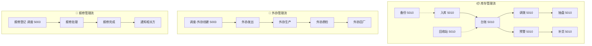

---

## 二、按用户角色排列

### 2.1 角色 → 页面映射

```mermaid
graph TB
    subgraph Roles["👥 用户角色"]
        P1[🏭 业务员<br/>销售/跟单]
        P2[👷 车间操作员<br/>手机报工]
        P3[📦 库管员<br/>库存管理]
        P4[🔍 质检员<br/>质检管理]
        P5[🔧 车间主任<br/>排产管理]
        P6[👨‍💼 管理员<br/>系统配置]
        P7[📊 管理层<br/>大屏监控]
        P8[🤝 外协对接<br/>外部协作]
        P9[👤 人事<br/>操作员管理]
    end
    
    P1 -->|5001| W_Orders[订单/查询/导入]
    P1 -->|5001| W_Customers[客户管理*]
    P1 -->|5001| W_Kanban[看板]
    
    P2 -->|5008| M_Login[移动登录]
    P2 -->|5008| M_Home[报工主页]
    P2 -->|5008| M_Scan[扫码]
    
    P3 -->|5010| I_All[24 个库存页]
    P3 -->|GUI| G_Inventory[库存视图]
    
    P4 -->|5001| W_Quality[质检管理]
    P4 -->|5008| M_Quality[质检上报]
    P4 -->|5003| DC_Quality[调度-质检]
    
    P5 -->|5001| W_Production[生产排单]
    P5 -->|5001| W_Process[工序追踪]
    P5 -->|5003| DC_Schedule[调度-排产]
    P5 -->|5003| DC_Tasks[调度-任务]
    
    P6 -->|5003| DC_All[调度中心 23 Tab]
    P6 -->|5001| W_Admin[*admin 系列]
    P6 -->|GUI| G_All[所有 GUI 视图]
    
    P7 -->|5000| D_Big[大屏 v1/v2/v3]
    P7 -->|5001| W_Dashboard[仪表板]
    P7 -->|5003| DC_Overview[调度-概览]
    
    P8 -->|5003| DC_Outsource[调度-外协]
    
    P9 -->|5001| W_Operators[操作员管理]
    P9 -->|5003| DC_Operators[调度-操作员]
```

### 2.2 角色 → 页面权限矩阵

| 角色 | 主用端口 | 页面权限 | 权限等级 |
|:-----|:---------|:---------|:--------:|
| 🏭 业务员 | 5001 | 订单全部 + 看板 + 仪表板 + 报工记录 | 普通 |
| 👷 车间操作员 | 5008 | 移动端 3 页 + 扫码 | 最低 |
| 📦 库管员 | 5010 | 库存 24 页 + GUI 库存视图 | 普通 |
| 🔍 质检员 | 5001/5008/5003 | 质检页面 + 移动端质检 | 普通 |
| 🔧 车间主任 | 5001/5003 | 生产排单 + 工序 + 调度(部分) | 高级 |
| 👨‍💼 系统管理员 | 5003/全部 | 全部 77 页面 | 最高 |
| 📊 管理层 | 5000 | 大屏 + 仪表板 + 报表 | 只读 |
| 🤝 外协对接 | 5003 | 调度-外协 Tab | 受限 |
| 👤 人事 | 5001/5003 | 操作员管理 | 受限 |

---

## 三、按使用频次排列

### 3.1 频次梯度

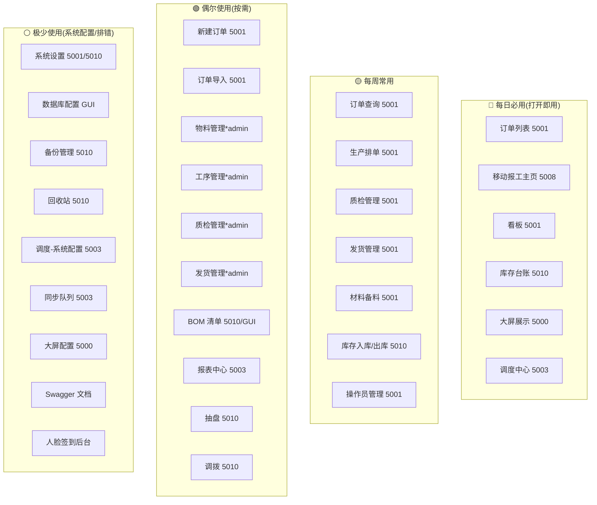

### 3.2 频次对照表

| 频次 | 数量 | 典型页面 | 进入方式 |
|:----:|:----:|:---------|:---------|
| 🔴 每日必用 | 6 | 订单列表、移动报工、看板、库存台账、大屏、调度中心 | 直接打开 |
| 🟡 每周常用 | 7 | 订单查询、生产排单、质检、发货、材料备料、库存出入库、操作员 | Tab 切换 |
| 🟢 偶尔使用 | 10 | 新建/导入订单、各 admin 页、BOM、报表、抽盘、调拨 | 按需访问 |
| ⚪ 极少使用 | 9 | 系统设置、数据库、备份、回收站、调度配置、同步队列、大屏配置、Swagger、人脸后台 | 仅维护时 |

---

## 四、按页面类型排列

### 4.1 类型分布

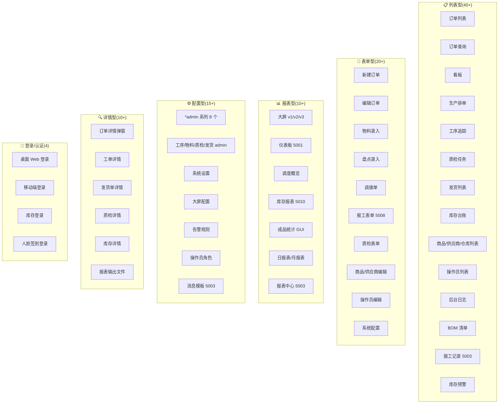

### 4.2 类型详细分布表

| 页面类型 | 数量 | 占比 | 主要分布 |
|:---------|:----:|:----:|:---------|
| 📋 列表型 | 42 | 54% | 5001 订单/排产/质检、5010 库存、5003 调度 |
| 📝 表单型 | 14 | 18% | 5001 新建/编辑、5008 报工 |
| 📊 报表型 | 9 | 12% | 5000 大屏、5001 仪表板、5003 报表 |
| ⚙️ 配置型 | 8 | 10% | 5001 admin、5003 系统配置 |
| 🔍 详情型 | 3 | 4% | 各页面弹窗/抽屉 |
| 🔐 登录型 | 1 | 1% | 5001 登录页 |
| **合计** | **77** | 100% | — |

---

## 五、按访问入口排列(用户视角)

### 5.1 入口汇总

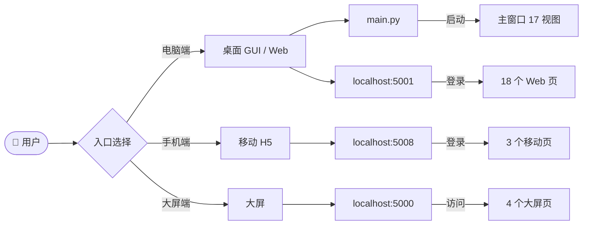

### 5.2 入口 → 页面映射

| 入口 | URL/命令 | 登录前 | 登录后首页 | 页面总数 |
|:-----|:---------|:-------|:----------|:--------:|
| **桌面 GUI** | `python main.py` | 主窗口(订单列表) | — | 17 |
| **桌面 Web** | `http://localhost:5001` | `/login` | `/orders` | 18 |
| **移动端** | `http://localhost:5008` | `/mobile_login.html` | `/`(主页) | 3 |
| **调度中心** | `http://localhost:5003/api/dispatch-center/` | `/` | `/api/dispatch-center/` | 1 SPA(23 Tab) |
| **容器中心** | `http://localhost:5002` | `/` | — | 3 |
| **库存管理** | `http://localhost:5010` | `/login` | `/inventory/dashboard` | 25 |
| **大屏** | `http://localhost:5000` | `/` | — | 4 |
| **人脸签到** | `http://localhost:5008/face/` | `/face/` | — | 2 |
| **Swagger** | `http://localhost:5008/api/swagger/` | — | — | 1 |

---

## 六、按端口 + 业务域排列(矩阵视图)

### 6.1 业务域 × 端口矩阵

| 业务域 \ 端口 | 5000 大屏 | 5001 桌面 Web | 5003 调度 | 5008 移动 | 5010 库存 | GUI 桌面 |
|:-------------|:---------:|:-------------:|:---------:|:---------:|:---------:|:--------:|
| **订单管理** | — | ●●● | ● | — | — | ●●● |
| **生产排产** | — | ●●● | ●●● | — | — | ●● |
| **工序追踪** | — | ●●● | ●● | ●●● | — | ●● |
| **物料备料** | — | ●●● | ●● | — | — | ●● |
| **质检管理** | — | ●●● | ●● | ●● | — | ●● |
| **发货物流** | — | ●●● | ●● | — | — | ●● |
| **库存台账** | — | — | — | — | ●●● | ● |
| **BOM 清单** | — | — | — | — | ●● | ●● |
| **操作员** | — | ●●● | ●● | — | — | ●● |
| **系统配置** | — | ● | ●●● | — | ●● | ●●● |
| **数据监控** | ●●● | ●● | ●●● | — | ● | ●● |
| **签到打卡** | — | — | — | ● | — | — |

> ●●● = 高频主入口 / ●● = 中频辅助 / ● = 低频管理

### 6.2 业务域主入口速查

| 业务域 | 主入口 | 次入口 |
|:-------|:-------|:-------|
| 订单管理 | 5001 `/orders` | GUI 订单列表 |
| 生产排产 | 5001 `/production` | 5003 调度任务 |
| 工序追踪 | 5008 移动端报工 | 5001 `/process-track` |
| 物料备料 | 5001 `/material` | GUI 材料备料 |
| 质检管理 | 5001 `/quality` | 5008 移动端 |
| 发货物流 | 5001 `/shipment` | 5003 调度发货 |
| 库存台账 | 5010 `/inventory/dashboard` | 5010 `/inventory/stock` |
| BOM | 5010 `/inventory/bom` | GUI BOM |
| 操作员 | 5001 `/operators` | 5003 调度操作员 |
| 系统配置 | 5003 调度中心 | 5001 admin 系列 |
| 数据监控 | 5000 大屏 | 5001 `/dashboard` |
| 签到打卡 | 5008 `/face/` | — |

---

## 七、按重要度排列(P0/P1/P2)

### 7.1 重要度分级

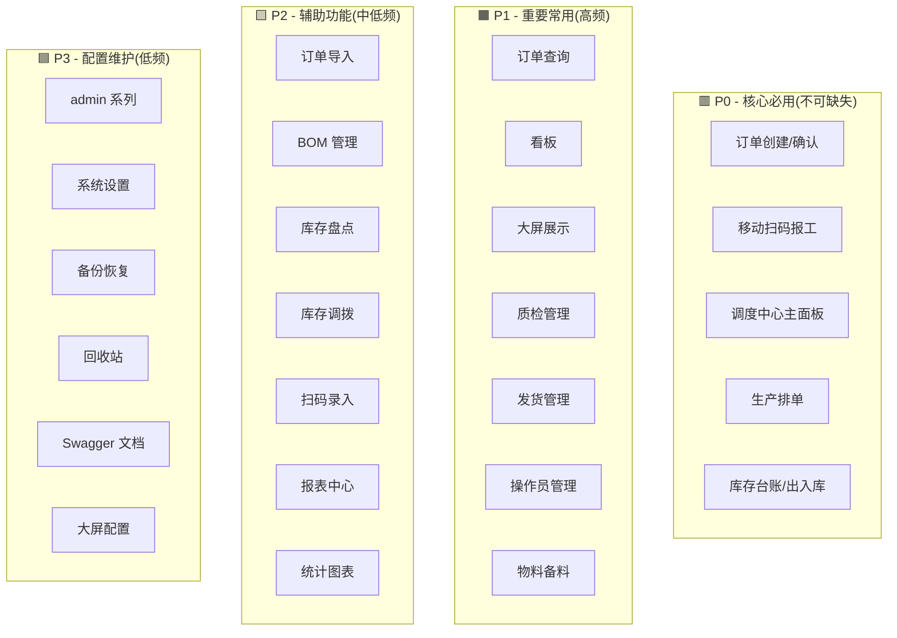

### 7.2 重要度详细表

| 重要度 | 数量 | 典型页面 | SLA 要求 |
|:------:|:----:|:---------|:---------|
| 🟥 P0 | 5 类 | 订单创建、移动报工、调度、排产、库存核心 | 99.9% |
| 🟧 P1 | 7 类 | 查询、看板、大屏、质检、发货、操作员、备料 | 99.5% |
| 🟨 P2 | 7 类 | 导入、BOM、盘点、调拨、扫码、报表 | 99% |
| 🟦 P3 | 6 类 | admin、设置、备份、回收站、Swagger、大屏配置 | 95% |

---

## 八、按移动端友好度排列

### 8.1 移动适配分级

| 级别 | 页面 | 适配说明 |
|:-----|:-----|:---------|
| 🟢 **原生移动端** | 5008 全部 3 页 | Touch 优化 + 安全区 |
| 🟡 **移动可用** | 5001 看板、登录、订单列表 | 自适应布局 |
| 🟠 **PC 优先** | 5001 大部分页面 | 横屏可用,触屏体验差 |
| 🔴 **仅 PC** | 5000 大屏、5003 调度、5010 库存 | 桌面专属 |

### 8.2 移动端推荐入口

| 用户 | 推荐入口 | 备选 |
|:-----|:---------|:-----|
| 车间操作员 | 5008 移动端 ✅ | — |
| 业务员出差 | 5001 响应式 | — |
| 库管员 | 5010(Pad 横屏) | — |
| 管理层 | 5000 大屏 | 5001 仪表板 |

---

## 九、页面关系依赖图

### 9.1 上下游依赖

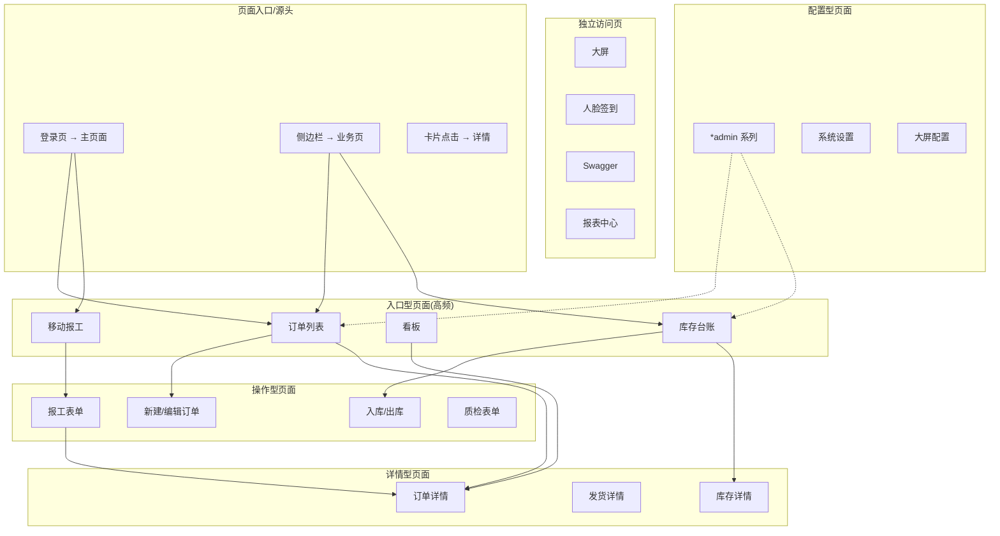

### 9.2 跳转关系热力

| 来源页面 | 主要跳转目标 | 跳转方式 |
|:---------|:-------------|:---------|
| 登录页 | 主页 | 自动 |
| 订单列表 | 详情/编辑/看板 | 卡片点击 |
| 看板 | 订单列表 | 卡片点击 |
| 新建订单 | 订单列表 | 提交后 |
| 报工主页 | 扫码/工序详情 | 按钮 |
| 库存台账 | 详情/调整 | 行点击 |
| 仪表板 | 调度中心 | 链接 |
| 调度中心 | 各 Tab | 侧边栏 |

---

## 十、按学习曲线排列(新用户上手顺序)

### 10.1 推荐学习路径

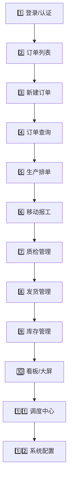

### 10.2 角色上手路径

| 角色 | 推荐学习顺序 | 预计时长 |
|:-----|:-------------|:--------:|
| 业务员 | 登录→订单列表→新建订单→订单查询→看板 | 2 小时 |
| 车间操作员 | 移动登录→扫码→报工主页→工序提交 | 30 分钟 |
| 库管员 | 库存登录→首页概览→台账→入库/出库→调拨/盘点 | 3 小时 |
| 质检员 | 登录→质检管理→移动质检→质检详情 | 1.5 小时 |
| 车间主任 | 登录→生产排单→工序追踪→调度任务 | 4 小时 |
| 系统管理员 | 全模块精通 + 调度中心 + 配置 + Swagger | 16+ 小时 |

---

## 十一、横向对比矩阵(双形态对照)

### 11.1 桌面 GUI vs 桌面 Web(5001)对照

| 功能 | GUI(Tkinter) | Web(5001) | 状态 |
|:-----|:-------------|:----------|:-----|
| 订单管理 | ✅ OrderListView | ✅ /orders | 同步 |
| 订单查询 | ✅ OrderQueryView | ✅ /order-query | 同步 |
| 生产排单 | ✅ ProductionView | ✅ /production | 同步 |
| 材料备料 | ✅ MaterialPrepView | ✅ /material | 同步 |
| 工序追踪 | ✅ ProcessView | ✅ /process-track | 同步 |
| 质检管理 | ✅ QualityView | ✅ /quality | 同步 |
| 发货管理 | ✅ ShipmentView | ✅ /shipment | 同步 |
| 成品统计 | ✅ FinishedProductStatsView | ❌ | GUI 独有 |
| 后台日志 | ✅ LogView | ❌ | GUI 独有 |
| BOM | ✅ BOMView | ❌(5010 有) | 分散 |
| 看板 | ✅ KanbanView | ✅ /kanban | 同步 |
| 操作员 | ✅ OperatorManagerView | ✅ /operators | 同步 |
| 系统设置 | ✅ SettingsDialog | ⚠️ /inventory/settings | 分散 |

### 11.2 Web 各端口功能对照

| 功能域 | 5001 桌面 Web | 5003 调度 | 5008 移动 | 5010 库存 |
|:-------|:--------------|:----------|:----------|:----------|
| 订单 CRUD | ✅ 完整 | ✅ 监控 | ❌ | ❌ |
| 工序报工 | ❌ | ✅ 监控 | ✅ 完整 | ❌ |
| 库存管理 | ❌ | ❌ | ❌ | ✅ 完整 |
| 系统配置 | ⚠️ admin | ✅ 完整 | ❌ | ⚠️ 局部 |
| 数据分析 | ✅ 仪表板 | ✅ 报表 | ❌ | ✅ 库存报表 |

---

## 十二、按异常处理路径排列

### 12.1 异常响应页

| 异常类型 | 处理页面 | 路径 |
|:---------|:---------|:-----|
| 登录失败 | 登录页(密码错误提示) | `/login` |
| 账号锁定 | 登录页(锁定提示) | `/login` |
| CSRF 失败 | 通用错误页 | 各页面 |
| 接口 404 | 调度中心 404 | 5003 |
| 接口 500 | 通用错误提示 | 各页面 |
| 网络断开 | Toast 提示 | 各页面 |

### 12.2 排错专用页

| 场景 | 入口 |
|:-----|:-----|
| 数据库错误 | GUI `error_lookup_view.py` |
| 同步失败 | 5003 `/api/dispatch-center/sync-queue` |
| 消息失败 | 5003 调度-同步队列 |
| 库存差异 | 5010 `/inventory/stocktake` |

---

## 十三、按权限边界排列

### 13.1 权限分层

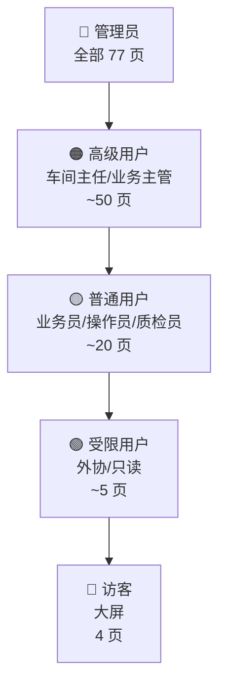

### 13.2 权限对照表

| 角色 | 可访问页面数 | 主要限制 |
|:-----|:-------------|:---------|
| 🔴 管理员 | 77 | 无 |
| 🟠 高级用户 | ~50 | 仅本部门数据 |
| 🟡 普通用户 | ~20 | 仅本职能模块 |
| 🟢 受限用户 | ~5 | 限定 Tab/页面 |
| 🔵 访客 | 4 | 大屏只读 |

---

## 十四、排列速查总表

### 14.1 全部 77 页索引(按端口 + 业务域)

| 端口 | 业务域 | 页面 | 类型 | 频次 | 重要度 |
|:----:|:------|:-----|:----:|:----:|:------:|
| 5000 | 数据监控 | `/` (dashboard_v3) | 报表 | 日 | P1 |
| 5000 | 数据监控 | `/v1` | 报表 | 偶 | P3 |
| 5000 | 数据监控 | `/v2` | 报表 | 偶 | P3 |
| 5000 | 配置 | `/config` | 配置 | 极 | P3 |
| 5001 | 认证 | `/login` | 登录 | 日 | P0 |
| 5001 | 订单 | `/orders` | 列表 | 日 | P0 |
| 5001 | 订单 | `/orders/new` | 表单 | 日 | P0 |
| 5001 | 订单 | `/order-query` | 列表 | 周 | P1 |
| 5001 | 订单 | `/order-import` | 表单 | 偶 | P2 |
| 5001 | 看板 | `/kanban` | 列表 | 日 | P1 |
| 5001 | 看板 | `/dashboard` | 报表 | 日 | P1 |
| 5001 | 生产 | `/production` | 列表 | 周 | P1 |
| 5001 | 生产 | `/scheduling` | 列表 | 周 | P1 |
| 5001 | 生产 | `/production-admin` | 配置 | 偶 | P2 |
| 5001 | 物料 | `/material` | 列表 | 周 | P1 |
| 5001 | 物料 | `/material-admin` | 配置 | 偶 | P2 |
| 5001 | 工序 | `/process-track` | 列表 | 日 | P1 |
| 5001 | 工序 | `/process-admin` | 配置 | 偶 | P2 |
| 5001 | 质检 | `/quality` | 列表 | 周 | P1 |
| 5001 | 质检 | `/quality-admin` | 配置 | 偶 | P2 |
| 5001 | 发货 | `/shipment` | 列表 | 周 | P1 |
| 5001 | 发货 | `/shipment-admin` | 配置 | 偶 | P2 |
| 5001 | 报工 | `/work-reports` | 列表 | 周 | P1 |
| 5001 | 操作员 | `/operators` | 列表 | 周 | P1 |
| 5002 | 容器 | `/` | 报表 | 日 | P1 |
| 5002 | 容器 | `/config` | 配置 | 偶 | P2 |
| 5002 | 容器 | `/alert-rules` | 配置 | 偶 | P2 |
| 5003 | 调度 | `/api/dispatch-center/` | SPA | 日 | P0 |
| 5008 | 报工 | `/` | 主页 | 日 | P0 |
| 5008 | 报工 | `/scanner` | 工具 | 日 | P0 |
| 5008 | 认证 | `/mobile_login.html` | 登录 | 日 | P0 |
| 5010 | 认证 | `/login` | 登录 | 日 | P0 |
| 5010 | 库存 | `/inventory/dashboard` | 报表 | 日 | P1 |
| 5010 | 库存 | `/inventory/stock` | 列表 | 日 | P0 |
| 5010 | 库存 | `/inventory/inbound` | 表单 | 日 | P0 |
| 5010 | 库存 | `/inventory/outbound` | 表单 | 日 | P0 |
| 5010 | 库存 | `/inventory/batch` | 表单 | 周 | P1 |
| 5010 | 库存 | `/inventory/alerts` | 列表 | 日 | P1 |
| 5010 | 库存 | `/inventory/products` | 列表 | 周 | P1 |
| 5010 | 库存 | `/inventory/suppliers` | 列表 | 周 | P1 |
| 5010 | 库存 | `/inventory/categories` | 配置 | 偶 | P2 |
| 5010 | 库存 | `/inventory/base` | 配置 | 偶 | P2 |
| 5010 | 库存 | `/inventory/warehouses` | 列表 | 周 | P1 |
| 5010 | 库存 | `/inventory/stocktake` | 流程 | 偶 | P2 |
| 5010 | 库存 | `/inventory/transfer` | 流程 | 偶 | P2 |
| 5010 | 库存 | `/inventory/scanner` | 工具 | 偶 | P2 |
| 5010 | 库存 | `/inventory/reports` | 报表 | 周 | P2 |
| 5010 | 库存 | `/inventory/notifications` | 列表 | 日 | P1 |
| 5010 | 库存 | `/inventory/backup` | 配置 | 极 | P3 |
| 5010 | 库存 | `/inventory/export` | 工具 | 周 | P2 |
| 5010 | 库存 | `/inventory/recycle-bin` | 列表 | 极 | P3 |
| 5010 | 库存 | `/inventory/settings` | 配置 | 极 | P3 |
| 5010 | 库存 | `/inventory/bom` | 列表 | 周 | P1 |
| 5010 | 库存 | `/inventory/logs` | 列表 | 周 | P1 |
| 5010 | 库存 | `/inventory/print/preview` | 工具 | 周 | P2 |
| GUI | 订单 | 订单列表 OrderListView | 列表 | 日 | P0 |
| GUI | 订单 | 新建订单对话框 | 表单 | 日 | P0 |
| GUI | 订单 | 订单编辑对话框 | 表单 | 日 | P0 |
| GUI | 订单 | 订单导入预览 | 表单 | 偶 | P2 |
| GUI | 订单 | 订单确认对话框 | 表单 | 日 | P0 |
| GUI | 订单 | 订单查询 | 列表 | 周 | P1 |
| GUI | 生产 | 生产排单 | 列表 | 周 | P1 |
| GUI | 物料 | 材料备料 | 列表 | 周 | P1 |
| GUI | 工序 | 工序追踪 | 列表 | 日 | P1 |
| GUI | 质检 | 质检管理 | 列表 | 周 | P1 |
| GUI | 发货 | 发货管理 | 列表 | 周 | P1 |
| GUI | 统计 | 成品统计 | 报表 | 周 | P1 |
| GUI | 日志 | 后台日志 | 列表 | 偶 | P2 |
| GUI | BOM | BOM 清单 | 列表 | 周 | P1 |
| GUI | 预警 | 逾期预警 | 列表 | 日 | P1 |
| GUI | 导入导出 | 数据导入导出 | 工具 | 偶 | P2 |
| GUI | 看板 | 看板 | 列表 | 日 | P1 |
| GUI | 操作员 | 操作员管理 | 列表 | 周 | P1 |
| GUI | 设置 | 系统设置 | 配置 | 极 | P3 |
| Face | 签到 | `/face/` | 主页 | 日 | P2 |
| Face | 签到 | `/face/admin/` | 后台 | 周 | P3 |
| Swagger | 文档 | `/api/swagger/` | 文档 | 极 | P3 |
| 报表 | 报表 | `/api/reports/page` | 配置 | 偶 | P2 |

### 14.2 统计汇总

| 维度 | 数据 |
|:-----|:-----|
| 总页面数 | **77** |
| 端口数 | **6**(5000/5001/5003/5008/5010/GUI) + 2 附加(face/swagger) |
| 业务域数 | **12** |
| P0 核心页 | **9** |
| P1 重要页 | **~30** |
| P2 辅助页 | **~25** |
| P3 配置页 | **~13** |
| 日均访问 | **~15 页** |
| 周均访问 | **~40 页** |

---

## 十五、排列组合决策树

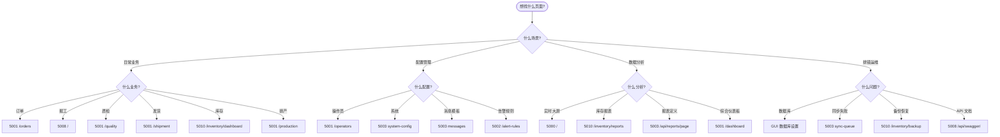

---

## 十六、排列速查矩阵

| 业务场景 | 推荐页面 | 备选页面 |
|:---------|:---------|:---------|
| 今天有哪些新订单 | 5001 /orders | GUI 订单列表 |
| 排产待发布 | 5001 /scheduling | 5003 任务 Tab |
| 操作员扫码报工 | 5008 / | 5008 /scanner |
| 库存低于预警 | 5010 /inventory/alerts | 5010 通知中心 |
| 看实时生产情况 | 5000 大屏 v3 | 5001 /kanban |
| 客户催货 | 5001 /order-query | 5001 订单详情 |
| 质检不合格 | 5001 /quality | 5003 质检回归 |
| 发货物流查询 | 5001 /shipment | 5003 发货 Tab |
| 月度统计 | 5010 /inventory/reports | 5003 报表中心 |
| 排产延期 | 5003 调度-排产 | GUI 看板 |

---

**文档结束**

> **提示**: 本文档从 13 个维度对 77 个页面进行排列,涵盖了开发、运维、培训、决策等不同视角。如需特定维度的深度分析,请参考配套的 [FRONTEND_PAGES.md](./FRONTEND_PAGES.md) 与 [ARCHITECTURE.md](./ARCHITECTURE.md)。