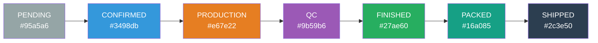

# 不锈钢网带跟单 3.0 — 页面视图文档

> **版本**: v1.0
> **生成日期**: 2026-06-28
> **配套文档**:
> - [FRONTEND_PAGES.md](./FRONTEND_PAGES.md) — 页面清单速查
> - [ARCHITECTURE.md](./ARCHITECTURE.md) — 架构与功能详解
> - [PAGE_ARRANGEMENT.md](./PAGE_ARRANGEMENT.md) — 多维度排列
>
> **本文档内容**: 截图映射 + ASCII 线框图 + 视觉规范 + 组件库

---

## 一、文档说明

本可视化文档聚焦"页面长什么样",包含:

| 内容 | 数量 | 适用读者 |
|:-----|:----:|:---------|
| 📷 已采集截图 | **66+** 张 | 真实视觉对照 |
| 📐 ASCII 线框图 | **15+** 个核心页面 | 无截图时参考 |
| 🎨 配色方案 | 6 套主题 | 设计参考 |
| 🧩 公共组件 | 25+ | 前端开发 |
| 📏 视觉规范 | 字体/间距/断点 | 前端开发 |

> **截图约定**: 所有截图路径以相对项目根 `d:\yuan\不锈钢网带跟单3.0\` 起始。

---

## 二、截图资源清单

### 2.1 `screenshots/` 目录(67 个文件)

| # | 文件名 | 页面 | 类型 |
|:-:|:-------|:-----|:-----|
| 1 | [01_login.png](file:///d:/yuan/%E4%B8%8D%E9%94%90%E9%92%A2%E7%BD%91%E5%B8%A6%E8%B7%9F%E5%8D%953.0/screenshots/01_login.png) | `/login` 登录页 | 页面截图 |
| 2 | [02_login_error.png](file:///d:/yuan/%E4%B8%8D%E9%94%90%E9%92%A2%E7%BD%91%E5%B8%A6%E8%B7%9F%E5%8D%953.0/screenshots/02_login_error.png) | 登录错误状态 | 异常截图 |
| 3 | [03_orders_page.png](file:///d:/yuan/%E4%B8%8D%E9%94%90%E9%92%A2%E7%BD%91%E5%B8%A6%E8%B7%9F%E5%8D%953.0/screenshots/03_orders_page.png) | `/orders` 订单列表 | 页面截图 |
| 4 | [04_new_order.png](file:///d:/yuan/%E4%B8%8D%E9%94%90%E9%92%A2%E7%BD%91%E5%B8%A6%E8%B7%9F%E5%8D%953.0/screenshots/04_new_order.png) | `/orders/new` 新建订单 | 页面截图 |
| 5 | [05_kanban.png](file:///d:/yuan/%E4%B8%8D%E9%94%90%E9%92%A2%E7%BD%91%E5%B8%A6%E8%B7%9F%E5%8D%953.0/screenshots/05_kanban.png) | `/kanban` 看板 | 页面截图 |
| 6 | [06_dashboard.png](file:///d:/yuan/%E4%B8%8D%E9%94%90%E9%92%A2%E7%BD%91%E5%B8%A6%E8%B7%9F%E5%8D%953.0/screenshots/06_dashboard.png) | `/dashboard` 仪表板 | 页面截图 |
| 7 | [07_production.png](file:///d:/yuan/%E4%B8%8D%E9%94%90%E9%92%A2%E7%BD%91%E5%B8%A6%E8%B7%9F%E5%8D%953.0/screenshots/07_production.png) | `/production` 生产排单 | 页面截图 |
| 8 | [08_work_reports.png](file:///d:/yuan/%E4%B8%8D%E9%94%90%E9%92%A2%E7%BD%91%E5%B8%A6%E8%B7%9F%E5%8D%953.0/screenshots/08_work_reports.png) | `/work-reports` 报工记录 | 页面截图 |
| 9 | [09_material.png](file:///d:/yuan/%E4%B8%8D%E9%94%90%E9%92%A2%E7%BD%91%E5%B8%A6%E8%B7%9F%E5%8D%953.0/screenshots/09_material.png) | `/material` 材料备料 | 页面截图 |
| 10 | [10_quality.png](file:///d:/yuan/%E4%B8%8D%E9%94%90%E9%92%A2%E7%BD%91%E5%B8%A6%E8%B7%9F%E5%8D%953.0/screenshots/10_quality.png) | `/quality` 质检 | 页面截图 |
| 11 | [11_operators.png](file:///d:/yuan/%E4%B8%8D%E9%94%90%E9%92%A2%E7%BD%91%E5%B8%A6%E8%B7%9F%E5%8D%953.0/screenshots/11_operators.png) | `/operators` 操作员 | 页面截图 |
| 12 | [12_shipment.png](file:///d:/yuan/%E4%B8%8D%E9%94%90%E9%92%A2%E7%BD%91%E5%B8%A6%E8%B7%9F%E5%8D%953.0/screenshots/12_shipment.png) | `/shipment` 发货 | 页面截图 |
| 13 | [13_shipment_fixed.png](file:///d:/yuan/%E4%B8%8D%E9%94%90%E9%92%A2%E7%BD%91%E5%B8%A6%E8%B7%9F%E5%8D%953.0/screenshots/13_shipment_fixed.png) | 发货修复版 | 修复对照 |
| 14 | [14_shipment_create_modal.png](file:///d:/yuan/%E4%B8%8D%E9%94%90%E9%92%A2%E7%BD%91%E5%B8%A6%E8%B7%9F%E5%8D%953.0/screenshots/14_shipment_create_modal.png) | 发货创建弹窗 | 弹窗截图 |
| 15 | [15_shipment_final.png](file:///d:/yuan/%E4%B8%8D%E9%94%90%E9%92%A2%E7%BD%91%E5%B8%A6%E8%B7%9F%E5%8D%953.0/screenshots/15_shipment_final.png) | 发货最终版 | 页面截图 |
| 16 | [16_process_track.png](file:///d:/yuan/%E4%B8%8D%E9%94%90%E9%92%A2%E7%BD%91%E5%B8%A6%E8%B7%9F%E5%8D%953.0/screenshots/16_process_track.png) | `/process-track` 工序追踪 | 页面截图 |
| 17 | [17_process_track_detail.png](file:///d:/yuan/%E4%B8%8D%E9%94%90%E9%92%A2%E7%BD%91%E5%B8%A6%E8%B7%9F%E5%8D%953.0/screenshots/17_process_track_detail.png) | 工序详情 | 详情截图 |
| 18 | [18_process_gantt.png](file:///d:/yuan/%E4%B8%8D%E9%94%90%E9%92%A2%E7%BD%91%E5%B8%A6%E8%B7%9F%E5%8D%953.0/screenshots/18_process_gantt.png) | 工序甘特图 | 可视化 |
| 19 | [19_gantt_final.png](file:///d:/yuan/%E4%B8%8D%E9%94%90%E9%92%A2%E7%BD%91%E5%B8%A6%E8%B7%9F%E5%8D%953.0/screenshots/19_gantt_final.png) | 甘特图终版 | 可视化 |
| 20 | [20_workcard.png](file:///d:/yuan/%E4%B8%8D%E9%94%90%E9%92%A2%E7%BD%91%E5%B8%A6%E8%B7%9F%E5%8D%953.0/screenshots/20_workcard.png) | 工单卡片 | 卡片视图 |
| 21 | [21_order_print.png](file:///d:/yuan/%E4%B8%8D%E9%94%90%E9%92%A2%E7%BD%91%E5%B8%A6%E8%B7%9F%E5%8D%953.0/screenshots/21_order_print.png) | 订单打印 | 打印视图 |

### 2.2 s4 阶段截图(Sprint 4)

| 文件名 | 页面 |
|:-------|:-----|
| `s4_01_login_page.png` | 登录页 |
| `s4_02_after_login_orders.png` | 登录后订单列表 |
| `s4_03_import_page.png` | 订单导入 |
| `s4_06_query_initial.png` | 订单查询初始 |
| `s4_07_query_results.png` | 订单查询结果 |
| `s4_08_process_track.png` | 工序追踪 |
| `s4_t1_orders_page.png` | 订单列表 T1 |
| `s4_t1_import_page.png` | 导入 T1 |
| `s4_t2_orders_page.png` | 订单列表 T2 |
| `s4_t3_order_query.png` | 订单查询 T3 |
| `s4_t6_import_result.png` | 导入结果 T6 |
| `s4_t6_order_query_initial.png` | 查询初始 T6 |
| `s4_t7_import_result.png` | 导入结果 T7 |
| `s4_ui_login_page.png` | 登录 UI |
| `s4_ui_after_login_orders.png` | 登录后 UI |
| `s4_ui_import_page.png` | 导入 UI |
| `s4_ui_import_result.png` | 导入结果 UI |
| `s4_ui_order_query_initial.png` | 查询初始 UI |
| `s4_ui_order_query_results.png` | 查询结果 UI |
| `s4_ui_query_export.xlsx` | 查询导出 |
| `s4_ui_template.xlsx` | 导入模板 |
| `s4_ui_export.xlsx` | 导出文件 |

### 2.3 s5 阶段截图(Sprint 5 - 操作员管理)

| 文件名 | 页面 |
|:-------|:-----|
| `s5_01_login.png` | 登录 |
| `s5_02_operators_page.png` | 操作员列表 |
| `s5_03_create_dialog.png` | 新建对话框 |
| `s5_04_after_create.png` | 创建后 |
| `s5_debug.png` | 调试截图 |
| `s5_debug2.png` | 调试截图 2 |
| `s5_diag_create.png` | 诊断创建 |
| `s5v2_02_created.png` | 已创建 |
| `s5v2_10_import.png` | 导入 |
| `s5v2_10_orders.png` | 订单 |

### 2.4 e2e 系列(端到端测试)

| 文件名 | 页面 |
|:-------|:-----|
| `e_01_loaded.png` | 加载完成 |
| `e_02_create_dialog.png` | 创建对话框 |
| `e_03_after_create.png` | 创建后 |
| `e_04_dept_filter.png` | 部门筛选 |
| `e_05_after_disable.png` | 禁用后 |

### 2.5 文档目录截图

| 文件名 | 页面 |
|:-------|:-----|
| [e2e_01_login.png](file:///d:/yuan/%E4%B8%8D%E9%94%90%E9%92%A2%E7%BD%91%E5%B8%A6%E8%B7%9F%E5%8D%953.0/docs/e2e_01_login.png) | 登录页 |
| [工单详情_M物料Tab.png](file:///d:/yuan/%E4%B8%8D%E9%94%90%E9%92%A2%E7%BD%91%E5%B8%A6%E8%B7%9F%E5%8D%953.0/docs/%E5%B7%A5%E5%8D%95%E8%AF%A6%E6%83%85_M%E7%89%A9%E6%96%99Tab.png) | 工单详情-物料 |
| [工单详情_新分类Tab.png](file:///d:/yuan/%E4%B8%8D%E9%94%90%E9%92%A2%E7%BD%91%E5%B8%A6%E8%B7%9F%E5%8D%953.0/docs/%E5%B7%A5%E5%8D%95%E8%AF%A6%E6%83%85_%E6%96%B0%E5%88%86%E7%B1%B0Tab.png) | 工单详情-新分类 |
| [工单详情_最终版.png](file:///d:/yuan/%E4%B8%8D%E9%94%90%E9%92%A2%E7%BD%91%E5%B8%A6%E8%B7%9F%E5%8D%953.0/docs/%E5%B7%A5%E5%8D%95%E8%AF%A6%E6%83%85_%E6%9C%80%E7%BB%88%E7%89%88.png) | 工单详情最终版 |
| [手机报工登录页.png](file:///d:/yuan/%E4%B8%8D%E9%94%90%E9%92%A2%E7%BD%91%E5%B8%A6%E8%B7%9F%E5%8D%953.0/docs/%E6%89%8B%E6%9C%BA%E6%8A%A5%E5%B7%A5%E7%99%BB%E5%BD%95%E9%A1%B5.png) | 移动登录 |
| [手机报工登录页2.png](file:///d:/yuan/%E4%B8%8D%E9%94%90%E9%92%A2%E7%BD%91%E5%B8%A6%E8%B7%9F%E5%8D%953.0/docs/%E6%89%8B%E6%9C%BA%E6%8A%A5%E5%B7%A5%E7%99%BB%E5%BD%95%E9%A1%B52.png) | 移动登录 2 |
| [手机报工登录页3.png](file:///d:/yuan/%E4%B8%8D%E9%94%90%E9%92%A2%E7%BD%91%E5%B8%A6%E8%B7%9F%E5%8D%953.0/docs/%E6%89%8B%E6%9C%BA%E6%8A%A5%E5%B7%A5%E7%99%BB%E5%BD%95%E9%A1%B53.png) | 移动登录 3 |
| [手机报工登录页4.png](file:///d:/yuan/%E4%B8%8D%E9%94%90%E9%92%A2%E7%BD%91%E5%B8%A6%E8%B7%9F%E5%8D%953.0/docs/%E6%89%8B%E6%9C%BA%E6%8A%A5%E5%B7%A5%E7%99%BB%E5%BD%95%E9%A1%B54.png) | 移动登录 4 |
| [手机报工登录页5.png](file:///d:/yuan/%E4%B8%8D%E9%94%90%E9%92%A2%E7%BD%91%E5%B8%A6%E8%B7%9F%E5%8D%953.0/docs/%E6%89%8B%E6%9C%BA%E6%8A%A5%E5%B7%A5%E7%99%BB%E5%BD%95%E9%A1%B55.png) | 移动登录 5 |
| [手机报工验证.png](file:///d:/yuan/%E4%B8%8D%E9%94%90%E9%92%A2%E7%BD%91%E5%B8%A6%E8%B7%9F%E5%8D%953.0/docs/%E6%89%8B%E6%9C%BA%E6%8A%A5%E5%B7%A5%E9%AA%8C%E8%AF%81.png) | 移动报工验证 |
| [调度中心首页.png](file:///d:/yuan/%E4%B8%8D%E9%94%90%E9%92%A2%E7%BD%91%E5%B8%A6%E8%B7%9F%E5%8D%953.0/docs/%E8%B0%83%E5%BA%A6%E4%B8%AD%E5%BF%83%E9%A6%96%E9%A1%B5.png) | 调度中心 |
| [调度中心首页2.png](file:///d:/yuan/%E4%B8%8D%E9%94%90%E9%92%A2%E7%BD%91%E5%B8%A6%E8%B7%9F%E5%8D%953.0/docs/%E8%B0%83%E5%BA%A6%E4%B8%AD%E5%BF%83%E9%A6%96%E9%A1%B52.png) | 调度中心 2 |
| [docs/playwright/debug.png](file:///d:/yuan/%E4%B8%8D%E9%94%90%E9%92%A2%E7%BD%91%E5%B8%A6%E8%B7%9F%E5%8D%953.0/docs/playwright/debug.png) | Playwright 调试 |
| [docs/playwright/page.html](file:///d:/yuan/%E4%B8%8D%E9%94%90%E9%92%A2%E7%BD%91%E5%B8%A6%E8%B7%9F%E5%8D%953.0/docs/playwright/page.html) | 页面 HTML 快照 |

---

## 三、ASCII 线框图(核心页面)

> 适用于未采集截图的页面,基于 HTML/CSS 结构推导

### 3.1 桌面端登录页 `/login`

```
┌──────────────────────────────────────────────────────────┐
│                                                          │
│           ┌──────────────────────────────┐               │
│           │                              │               │
│           │   🏭 不锈钢网带跟单系统       │               │
│           │   v3.0 · Steel Belt Tracking │               │
│           │                              │               │
│           │   ┌────────────────────────┐ │               │
│           │   │ 👤 用户名              │ │               │
│           │   └────────────────────────┘ │               │
│           │                              │               │
│           │   ┌────────────────────────┐ │               │
│           │   │ 🔒 密码        👁 切换  │ │               │
│           │   └────────────────────────┘ │               │
│           │                              │               │
│           │   ☐ 记住登录                  │               │
│           │                              │               │
│           │   ┌────────────────────────┐ │               │
│           │   │      登 录 →           │ │               │
│           │   └────────────────────────┘ │               │
│           │                              │               │
│           │   ❌ 账号或密码错误(可选)     │               │
│           │                              │               │
│           └──────────────────────────────┘               │
│                                                          │
│       © 2026 Steel Belt Co.                              │
└──────────────────────────────────────────────────────────┘
```

| 视觉元素 | 规格 |
|:---------|:-----|
| 容器 | 居中卡片 360-480px 宽 |
| 背景 | 渐变 #667eea → #764ba2 |
| 卡片 | 白底圆角 8px 阴影 0 8px 32px rgba(0,0,0,0.15) |
| 按钮 | 主色 #667eea 圆角 4px |
| 字体 | 标题 18px / 输入 14px / 按钮 14px |

### 3.2 桌面端订单列表 `/orders`

```
┌──────────────────────────────────────────────────────────────────┐
│ 📋 订单管理    管理员[退出]                              🔔 ●●●  │  ← 顶部导航(渐变背景)
├──────────────────────────────────────────────────────────────────┤
│ 🔍 搜索...  │ 全部状态 ▼ │ 客户分组 ▼ │ 交期: 从/到 │  [+ 新建] │  ← 工具栏
├──────────────────────────────────────────────────────────────────┤
│ 📦 共 156 个订单 | 已选 0 | [批量确认] [批量导出] [批量取消]   │  ← 状态条
├──────────────────────────────────────────────────────────────────┤
│ □│订单号    │客户    │产品      │规格     │数量│进度│状态   │操作│
├──┼──────────┼────────┼──────────┼─────────┼────┼────┼───────┼────┤
│□│GSB2026... │ XXX    │乙型网带  │B-500    │100 │▓▓▓ │已确认 │··· │
│□│GSB2026... │ XXX    │螺旋网带  │L-300    │ 50 │▓▓  │生产中 │··· │
│□│GSB2026... │ XXX    │人字形    │R-200    │ 80 │     │待确认 │··· │
│□│GSB2026... │ XXX    │链条网带  │T-1000   │200 │▓▓▓▓│已完成 │··· │
│ □ NEW   ⚠ 阻塞                                                    │  ← 状态徽章
├──────────────────────────────────────────────────────────────────┤
│ 共 156 条 | < 1 2 3 ... 8 >                       20 条/页 ▼    │  ← 分页
└──────────────────────────────────────────────────────────────────┘
```

| 视觉元素 | 规格 |
|:---------|:-----|
| 顶部导航 | 渐变 #667eea→#764ba2 高 60px |
| 工具栏 | 白底 14px 圆角输入框 |
| 表格行高 | 40px |
| 状态色 | PENDING灰/CONFIRMED蓝/PRODUCTION橙/QC紫/FINISHED绿/PACKED青/SHIPPED深 |
| 进度条 | 圆角 8px 渐变 #667eea→#764ba2 |
| 操作 | ··· 三点菜单 |

### 3.3 桌面端看板 `/kanban`

```
┌──────────────────────────────────────────────────────────────────┐
│ 📋 看板视图   ●●●● ● ●●● ●●●● ● ●                                  │  ← 顶部
├──────────────────────────────────────────────────────────────────┤
│ 总计: 156 个订单                                                    │
├──────────────────────────────────────────────────────────────────┤
│ ┌──待确认──┐┌──已确认──┐┌──生产中──┐┌──质检中──┐┌──已完成──┐┌──已发货─┐│
│ │  ● 12   ││  ● 18   ││  ● 25   ││  ● 8    ││  ● 60   ││  ● 33  ││
│ ├─────────┤├─────────┤├─────────┤├─────────┤├─────────┤├─────────┤│
│ │ ┌─────┐ ││ ┌─────┐ ││ ┌─────┐ ││ ┌─────┐ ││ ┌─────┐ ││ ┌─────┐ ││
│ │ │订单│ ││ │订单│ ││ │订单│ ││ │订单│ ││ │订单│ ││ │订单│ ││
│ │ │编号│ ││ │编号│ ││ │编号│ ││ │编号│ ││ │编号│ ││ │编号│ ││
│ │ │客户│ ││ │客户│ ││ │客户│ ││ │客户│ ││ │客户│ ││ │客户│ ││
│ │ │▓▓▓ │ ││ │▓▓▓ │ ││ │▓▓▓ │ ││ │▓▓▓ │ ││ │▓▓▓ │ ││ │▓▓▓ │ ││
│ │ └─────┘ ││ └─────┘ ││ └─────┘ ││ └─────┘ ││ └─────┘ ││ └─────┘ ││
│ │ ┌─────┐ ││ ┌─────┐ ││ ┌─────┐ ││         ││ ┌─────┐ ││ ┌─────┐ ││
│ │ │订单│ ││ │订单│ ││ │订单│ ││         ││ │订单│ ││ │订单│ ││
│ │ └─────┘ ││ └─────┘ ││ └─────┘ ││         ││ └─────┘ ││ └─────┘ ││
│ └─────────┘└─────────┘└─────────┘└─────────┘└─────────┘└─────────┘│
└──────────────────────────────────────────────────────────────────┘
```

| 视觉元素 | 规格 |
|:---------|:-----|
| 列宽 | 280-320px 等宽分布 |
| 列标题 | 状态色块 + 标题 + 计数徽章 |
| 卡片 | 白底 圆角 6px 顶部 3px 紧急度色条 |
| 颜色 | 待确认灰/已确认蓝/生产中橙/质检中紫/已完成绿/已发货深 |

### 3.4 移动端报工主页 `/`(5008)

```
┌──────────────────────┐
│ ☰   📊 我的工作      │  ← 顶部 60px
│  👤 张三 · 计划部    │
├──────────────────────┤
│ ┌──────────────────┐ │
│ │  📊 今日统计       │ │
│ │ ┌────┬────┬────┐  │ │
│ │ │ 5  │ 12 │ 3  │  │ │
│ │ │任务│完成│待办│  │ │
│ │ └────┴────┴────┘  │ │
│ └──────────────────┘ │
│                      │
│ ┌──────────────────┐ │
│ │  📷 扫码报工       │ │  ← 大绿色按钮
│ │   扫一扫开始报工   │ │
│ └──────────────────┘ │
│                      │
│ ┌─我的任务(待开始)─┐ │
│ │ ● GSB001 乙型网带 │ │
│ │   数量:100 截止明天│ │
│ │   [开始报工]       │ │
│ ├──────────────────┤ │
│ │ ● GSB002 螺旋网带 │ │
│ │   数量:50  截止后天│ │
│ │   [开始报工]       │ │
│ └──────────────────┘ │
│                      │
│ ┌─进行中──────────┐ │
│ │ ● GSB003 人字形  │ │
│ │   已完成 30/100  │ │
│ │   ▓▓▓░░░░░░ 30%  │ │
│ └──────────────────┘ │
│                      │
├──────────────────────┤
│ 🏠首页 │📋任务 │👤我的│  ← 底部 Tab 60px
└──────────────────────┘
```

| 视觉元素 | 规格 |
|:---------|:-----|
| 屏幕宽度 | 375px (iPhone) |
| 主色 | #667eea 紫蓝 |
| 报工按钮 | #27ae60 绿 高度 80px 圆角 12px |
| 任务卡片 | 白底 圆角 8px 阴影 0 1px 3px |
| 进度条 | 圆角 4px 高 6px 渐变 |
| 安全区 | `padding-bottom: calc(80px + env(safe-area-inset-bottom))` |

### 3.5 移动端扫码 `/scanner`

```
┌──────────────────────┐
│ ←  扫码报工           │  ← 顶部带返回
├──────────────────────┤
│                      │
│   ┌────────────────┐ │
│   │                │ │
│   │   摄像头预览    │ │
│   │                │ │
│   │   ┌────────┐   │ │  ← 取景框
│   │   │  扫描  │   │ │
│   │   │  对准  │   │ │
│   │   └────────┘   │ │
│   │                │ │
│   └────────────────┘ │
│                      │
│  将二维码/条码对准框内 │
│                      │
│  ┌────────────────┐  │
│  │  📝 手动输入订单 │  │  ← 备用
│  └────────────────┘  │
│                      │
└──────────────────────┘
```

### 3.6 调度中心 SPA `/api/dispatch-center/`

```
┌─────────────────────────────────────────────────────────────────────┐
│ 调度中心 - 管理员        ●●●● ● ● ● ●●● ● ●●●●● 通知:3  设置[退出] │
├─────────┬───────────────────────────────────────────────────────────┤
│         │                                                           │
│ 概览    │  ┌───────┬───────┬───────┬───────┬───────┬───────┬─────┐│
│ 操作员  │  │ 待处理 │进行中 │今日完成│超时任务│完成率│活跃流程│待入库││
│ 任务    │  │  18   │  25   │  42   │   3   │ 88%  │  12  │  7  ││
│ 消息    │  └───────┴───────┴───────┴───────┴───────┴───────┴─────┘│
│ 流程    │                                                           │
│ 规则    │  ┌─── 操作员负载 ──────────────────────────────────────┐ │
│ 工序配置│  │ 张三(计划部)  [▓▓▓▓▓░░░] 5/8                    │ │
│ 监控    │  │ 李四(生产部)  [▓▓▓░░░░░] 3/8                    │ │
│ 云端    │  │ 王五(质检部)  [▓▓▓▓▓▓░] 6/8                     │ │
│ 报修    │  │ ...                                              │ │
│ 外协    │  └────────────────────────────────────────────────────┘ │
│ 入库    │                                                           │
│ 反馈    │  ┌─── 容器中心概览 ────────────────────────────────────┐ │
│ 质检    │  │ 待处理:12  已分配:18  已确认:25  已完成:60          │ │
│ 报工    │  │ 已过期:3   总数:118                                │ │
│ 质检回归│  └────────────────────────────────────────────────────┘ │
│ 物料回归│                                                           │
│ 外协回归│                                                           │
│ 排产回归│                                                           │
│ 排产列表│                                                           │
│ 物料任务│                                                           │
│ 系统配置│                                                           │
│ 同步队列│                                                           │
│         │                                                           │
└─────────┴───────────────────────────────────────────────────────────┘
```

| 视觉元素 | 规格 |
|:---------|:-----|
| 侧边栏 | 220px 宽 深灰 #2c3e50 白字 |
| 主色 | #667eea 紫蓝渐变 |
| 卡片 | 白底 圆角 8px 阴影 |
| 标签 | 圆角 4px 文本徽章 |
| Tab 选中 | 左侧 3px 蓝条 + 白字 |

### 3.7 大屏 v3 默认 `/`

```
┌─────────────────────────────────────────────────────────────────────┐
│ 🏭 不锈钢网带跟单系统 v3.0    ●●● 实时    2026-06-28 14:30:25        │ ← 顶部 KPI
├─────────────────────────────────────────────────────────────────────┤
│ ┌─今日订单─┐ ┌─在制─────┐ ┌─待发货─┐ ┌─良率──┐ ┌─工时──┐ ┌─产值─┐│
│ │   156    │ │    45    │ │   23   │ │ 96.5%│ │ 320h │ │ 89万││
│ └──────────┘ └──────────┘ └─────────┘ └───────┘ └──────┘ └─────┘│
├─────────────────────────────────────────────────────────────────────┤
│ ┌─────订单状态分布─────┐  ┌──────工序进度──────┐  ┌─良率趋势─┐     │
│ │                      │  │ 切边 ▓▓▓▓▓▓▓░░ 80%│  │ 折线图   │     │
│ │       饼图           │  │ 焊接 ▓▓▓▓░░░░ 40%│  │ ECharts  │     │
│ │                      │  │ 组装 ▓▓▓▓▓▓▓▓ 100%│  │          │     │
│ │                      │  │ 质检 ▓▓░░░░░░ 20% │  │          │     │
│ └──────────────────────┘  └────────────────────┘  └──────────┘     │
├─────────────────────────────────────────────────────────────────────┤
│ ┌──────车间工时排行──────┐  ┌────月度趋势─────┐  ┌─省份分布─┐     │
│ │ 排名 表              │  │ 柱状图           │  │ 中国地图  │     │
│ └──────────────────────┘  └──────────────────┘  └──────────┘     │
└─────────────────────────────────────────────────────────────────────┘
```

| 视觉元素 | 规格 |
|:---------|:-----|
| 背景 | 深色 #0a0e27 |
| 数字颜色 | 渐变 #00d4ff → #0066ff |
| 卡片 | 半透明 rgba(255,255,255,0.05) |
| 图表 | ECharts |
| 自动刷新 | 5 秒 |

### 3.8 库存台账 `/inventory/stock`

```
┌─────────────────────────────────────────────────────────────────────┐
│ 库存管理    管理员[退出]                                              │
├──────────┬──────────────────────────────────────────────────────────┤
│ 📊首页    │ 🔍 搜索  │ 仓库 ▼ │ 分类 ▼ │ 状态 ▼ │   导出 📥         │
│ 📦出入库  ├──────────────────────────────────────────────────────────┤
│ 📋台账    │ 产品      规格    仓库   数量  单位  安全库存  状态      │
│ ⚠预警    │ ────────────────────────────────────────────────────────  │
│ 🏷商品    │ 不锈钢丝  Φ3mm   主仓   1200   kg   500     ✅正常     │
│ 🏢供应商  │ 链条      1寸    副仓    80    根   100     ⚠低库存   │
│ 📑基础    │ 网带      B-500  主仓    35    米    50     ⚠低库存   │
│ 🏭仓库    │ ...                                                       │
│ 📊盘点    │                                                           │
│ 🔄调拨    │                                                           │
│ 📷扫码    │                                                           │
│ 📈报表    │                                                           │
│ 🔔通知    │                                                           │
│ 💾备份    │                                                           │
│ 📤导出    │                                                           │
│ 🗑回收站  │                                                           │
│ ⚙设置    │                                                           │
│          │ ◀ 1 2 3 ▶                              20条/页▼           │
└──────────┴──────────────────────────────────────────────────────────┘
```

### 3.9 库存入库 `/inventory/inbound`

```
┌─────────────────────────────────────────────────────────────────────┐
│ 库存管理 → 入库                                                        │
├──────────────────────────────────────────────────────────────────────┤
│                                                                       │
│   ┌─ 快速入库 ──────────────────────────────────────────────┐      │
│   │ 仓库:    [主仓      ▼]                                   │      │
│   │ 产品:    [搜索或扫描...]                                 │      │
│   │ 规格:    Φ3mm                                           │      │
│   │ 数量:    [1000      ] kg                                │      │
│   │ 单价:    [25.50     ] ¥                                  │      │
│   │ 关联订单:[可选        ▼]                                 │      │
│   │ 备注:    [                                            ]  │      │
│   │                                                          │      │
│   │   [   提 交  入 库   ]                                  │      │
│   └──────────────────────────────────────────────────────────┘      │
│                                                                       │
│   ┌─ 今日入库记录 ──────────────────────────────────────────┐      │
│   │ 时间          产品        仓库   数量  操作员             │      │
│   │ 14:30  不锈钢丝 Φ3mm    主仓   500  张三                 │      │
│   │ 13:15  链条 1寸         副仓   20   李四                 │      │
│   │ ...                                                       │      │
│   └──────────────────────────────────────────────────────────┘      │
└──────────────────────────────────────────────────────────────────────┘
```

### 3.10 新建订单 `/orders/new`

```
┌─────────────────────────────────────────────────────────────────────┐
│ 📝 新建订单       订单号预览: GSB20260628-001 [复制]                  │
├─────────────────────────────────────────────────────────────────────┤
│ ▼ 订单基础信息                                                         │
│ ┌────────────────────────────────────────────────────────────────┐ │
│ │ 产品类型: [乙型网带 ▼]  客户: [搜索... ▼]  业务员: [张三 ▼]  │ │
│ │ 订单数量: [100] 米   优先级: ○普通 ●加急 ○特急                │ │
│ │ 交期:     [2026-07-15]   紧急度色条: 🟢🟡🔴                    │ │
│ └────────────────────────────────────────────────────────────────┘ │
│ ▼ 规格参数(动态加载)                                                   │
│ ┌────────────────────────────────────────────────────────────────┐ │
│ │ 网带宽度: [500] mm    节距: [25.4] mm                          │ │
│ │ 丝径:     [3.0]  mm   螺距: [12] mm                            │ │
│ │ 横杆:     [5]  根      ...                                     │ │
│ └────────────────────────────────────────────────────────────────┘ │
│ ▼ 材质参数                                                             │
│ ┌────────────────────────────────────────────────────────────────┐ │
│ │ 材质: [SUS304 ▼]   表面: [镜面 ▼]   边处理: [焊接 ▼]         │ │
│ └────────────────────────────────────────────────────────────────┘ │
│ ▼ 客户信息                                                             │
│ ┌────────────────────────────────────────────────────────────────┐ │
│ │ 联系人: [李四]  电话: [138-0000-0000]  地址: [...           ]  │ │
│ └────────────────────────────────────────────────────────────────┘ │
│ ▼ 附件                                                                 │
│ ┌────────────────────────────────────────────────────────────────┐ │
│ │ 📎 拖拽文件到这里 或 [选择文件]    [已上传: 图纸.pdf 2MB]      │ │
│ └────────────────────────────────────────────────────────────────┘ │
│                                                                       │
│   [💾 保存草稿]    [取消]      [📦 物料预览]    [✓ 提交订单]         │
└─────────────────────────────────────────────────────────────────────┘
```

### 3.11 桌面端仪表板 `/dashboard`

```
┌─────────────────────────────────────────────────────────────────────┐
│ 📊 仪表板    时间范围: [今日 ▼]                                       │
├─────────────────────────────────────────────────────────────────────┤
│ ┌─订单总数─┐ ┌─已确认─┐ ┌─生产中─┐ ┌─已完成─┐ ┌─已发货─┐ ┌─逾期─┐│
│ │   156    │ │   18   │ │   25   │ │   60   │ │   33  │ │   3 ││
│ │  ▲ 12%   │ │  ▲ 5%  │ │  ▼ 3%  │ │  ▲ 8%  │ │  ▲15%│ │  ⚠  ││
│ └──────────┘ └────────┘ └────────┘ └────────┘ └────────┘ └─────┘│
├─────────────────────────────────────────────────────────────────────┤
│ ┌─订单趋势(7天)─────────────────┐ ┌─工序分布─────────────┐         │
│ │     📈 折线图                  │ │  切边 25%             │         │
│ │                                │ │  焊接 30%             │         │
│ │                                │ │  组装 25%             │         │
│ │                                │ │  质检 20%             │         │
│ └────────────────────────────────┘ └────────────────────────┘         │
├─────────────────────────────────────────────────────────────────────┤
│ ┌─操作员 TOP 5 ──────────────────────────────────────────┐         │
│ │ 1. 张三 120 单   2. 李四 95 单   3. 王五 78 单 ...   │         │
│ └────────────────────────────────────────────────────────┘         │
└─────────────────────────────────────────────────────────────────────┘
```

### 3.12 工序追踪 `/process-track`

```
┌─────────────────────────────────────────────────────────────────────┐
│ 🔧 工序追踪    [展开全部]    自动刷新:30s                              │
├─────────────────────────────────────────────────────────────────────┤
│ 订单号 [搜索... ▼]  工序状态 [全部 ▼]  操作员 [全部 ▼]               │
├─────────────────────────────────────────────────────────────────────┤
│ ┌─GSB20260628-001 乙型网带 100米 ─────────────────────────────────┐ │
│ │ 进度: ▓▓▓▓▓▓░░ 60%   已完成/总数: 60/100 米                  │ │
│ │                                                                 │ │
│ │ 时间线:                                                         │ │
│ │  ●━━━━━●━━━━━●━━━━━●━━━━━○━━━━━○                          │ │
│ │  接单  切边  焊接  组装  质检   发货                          │ │
│ │  ✓    ✓    ✓    进行中 待开始  待开始                          │ │
│ │  张三  李四  王五  赵六  -      -                              │ │
│ │  06/20 06/21 06/22 06/23 06/24  06/25                       │ │
│ └─────────────────────────────────────────────────────────────────┘ │
│ ┌─GSB20260628-002 螺旋网带 50米 ──────────────────────────────────┐│
│ │ ...                                                              ││
│ └─────────────────────────────────────────────────────────────────┘│
└─────────────────────────────────────────────────────────────────────┘
```

### 3.13 操作员管理 `/operators`

```
┌─────────────────────────────────────────────────────────────────────┐
│ 👤 操作员管理    [+ 新增操作员]  [📥 批量导入]  [📤 导出]              │
├─────────────────────────────────────────────────────────────────────┤
│ 🔍 搜索    角色 [全部 ▼]  状态 [启用 ▼]  部门 [全部 ▼]               │
├─────────────────────────────────────────────────────────────────────┤
│ □│工号    │姓名 │角色    │部门    │电话       │状态 │操作         │
├──┼────────┼─────┼────────┼────────┼───────────┼─────┼─────────────┤
│□│ OP001  │张三 │管理员  │管理部  │138-0001   │ ✓   │编辑 启停 重置│
│□│ OP002  │李四 │工人    │生产部  │138-0002   │ ✓   │编辑 启停 重置│
│□│ OP003  │王五 │质检员  │质检部  │138-0003   │ ✓   │编辑 启停 重置│
│□│ OP004  │赵六 │工人    │生产部  │138-0004   │ ✗   │编辑 启停 重置│
├─────────────────────────────────────────────────────────────────────┤
│ ◀ 1 2 3 ▶                                                            │
└─────────────────────────────────────────────────────────────────────┘
```

### 3.14 调度中心-任务 Tab

```
┌─────────────────────────────────────────────────────────────────────┐
│ 任务调度                          派发模式:[✓ 全员派发] [选择部门 ▼] │
├─────────────────────────────────────────────────────────────────────┤
│ 状态[全部▼] 操作员[全部▼] 类型[全部▼]  [🔄刷新]                     │
├─────────────────────────────────────────────────────────────────────┤
│ ┌─任务列表─────────────────────────────────────────────────────┐   │
│ │ #  订单号     类型   操作员  状态       创建时间    操作        │   │
│ │ 1  GSB001     报工   张三    待处理     14:30     [分配][取消] │   │
│ │ 2  GSB001     质检   李四    已分配     14:25     [转派][取消] │   │
│ │ 3  GSB002     物料   王五    进行中     13:50     [详情]      │   │
│ │ 4  GSB003     审批   管理员  超时       12:00 ⚠   [详情][升级]│   │
│ └────────────────────────────────────────────────────────────────┘ │
└─────────────────────────────────────────────────────────────────────┘
```

### 3.15 人脸签到 `/face/`

```
┌──────────────────────┐
│ 🏭 人脸签到          │
├──────────────────────┤
│                      │
│   ┌────────────────┐ │
│   │                │ │
│   │   摄像头预览    │ │
│   │                │ │
│   │   ┌────────┐   │ │
│   │   │ 检测框 │   │ │
│   │   └────────┘   │ │
│   │   请正对摄像头   │ │
│   └────────────────┘ │
│                      │
│  ● 检测到人脸 ✓       │
│                      │
│  ┌────────────────┐  │
│  │ 14:30:25 打卡成功│  │
│  │ 员工:张三       │  │
│  └────────────────┘  │
└──────────────────────┘
```

---

## 四、视觉规范总览

### 4.1 配色方案

#### 主题色(全站统一)

| 名称 | 色值 | 用途 |
|:-----|:-----|:-----|
| 主色 Primary | `#667eea` | 主按钮、链接、强调 |
| 主色渐变 | `linear-gradient(135deg, #667eea 0%, #764ba2 100%)` | 顶部导航 |
| 成功 Success | `#27ae60` | 完成、通过 |
| 警告 Warning | `#f39c12` / `#e67e22` | 提醒、超时 |
| 危险 Danger | `#e74c3c` / `#c0392b` | 错误、阻塞 |
| 信息 Info | `#3498db` | 一般信息 |
| 次要 Secondary | `#95a5a6` | 次要按钮 |
| 紫 Special | `#9b59b6` / `#722ed1` | 质检 |

#### 状态色(订单流转)



#### 紧急度色(交期预警)

| 紧急度 | 颜色 | 含义 |
|:-------|:-----|:-----|
| 🟢 正常 | `#27ae60` | 交期 > 7 天 |
| 🟡 临近 | `#f39c12` | 交期 3-7 天 |
| 🔴 紧急 | `#e74c3c` | 交期 < 3 天 / 已逾期 |

#### 大屏深色主题

| 元素 | 色值 |
|:-----|:-----|
| 背景 | `#0a0e27` 深蓝黑 |
| 卡片 | `rgba(255,255,255,0.05)` 半透明白 |
| 文字 | `#fff` 主文 / `#8892b0` 次文 |
| 强调 | `#00d4ff` 青蓝 |
| 数字渐变 | `#00d4ff → #0066ff` |

### 4.2 字体规范

| 用途 | 字体 | 大小 | 字重 |
|:-----|:-----|:-----|:-----|
| 主字体 | `-apple-system, BlinkMacSystemFont, "Microsoft YaHei", sans-serif` | — | — |
| H1 标题 | 同上 | 24px | 600 |
| H2 标题 | 同上 | 20px | 600 |
| H3 标题 | 同上 | 18px | 600 |
| 正文 | 同上 | 14px | 400 |
| 辅助文字 | 同上 | 12px | 400 |
| 按钮 | 同上 | 14px | 500 |
| 大数字(KPI) | 同上 | 36-48px | 700 |
| 表格 | 同上 | 13px | 400 |
| 移动端主文 | 同上 | 15px | 400 |

### 4.3 间距规范

| 级别 | 值 | 用途 |
|:-----|:---|:-----|
| xs | 4px | 标签内间距 |
| sm | 8px | 组件内间距 |
| md | 12px | 卡片内小间距 |
| lg | 16px | 卡片间距 |
| xl | 24px | 主要区块间距 |
| xxl | 32px | 页面外边距 |

### 4.4 圆角规范

| 级别 | 值 | 用途 |
|:-----|:---|:-----|
| none | 0 | 表格单元格 |
| sm | 4px | 输入框、小按钮 |
| md | 6-8px | 卡片、按钮 |
| lg | 12px | 移动端卡片 |
| xl | 16px | 大型容器 |

### 4.5 阴影规范

| 级别 | 值 | 用途 |
|:-----|:---|:-----|
| sm | `0 1px 3px rgba(0,0,0,0.05)` | 表格、卡片底 |
| md | `0 4px 8px rgba(0,0,0,0.08)` | 悬浮卡片 |
| lg | `0 8px 32px rgba(0,0,0,0.15)` | 弹窗 |

---

## 五、响应式断点

| 断点 | 宽度 | 适配设备 |
|:-----|:----:|:---------|
| xs | < 360px | 小屏手机 |
| sm | 360-640px | 标准手机 |
| md | 640-768px | 大屏手机 / 小平板 |
| lg | 768-1024px | 平板 |
| xl | 1024-1440px | 笔记本 |
| xxl | > 1440px | 台式机 / 大屏 |

### 5.1 移动端适配要点(5008)

```css
/* 安全区 */
padding-bottom: calc(80px + env(safe-area-inset-bottom, 0px));

/* 触控目标最小 44px */
input, select, button, textarea { min-height: 44px; }

/* 防止横向溢出 */
body { overflow-x: hidden; }

/* 触控反馈 */
button:active { transform: scale(0.97); }

/* 小屏适配 */
@media (max-width: 360px) {
  .stat-value { font-size: 22px; }
  .btn-grid { grid-template-columns: 1fr; }
}
```

---

## 六、公共组件库

### 6.1 按钮组件

```html
<!-- 主按钮 -->
<button class="btn btn-primary">✓ 提交</button>

<!-- 成功/警告/危险/次要 -->
<button class="btn btn-success">完成</button>
<button class="btn btn-warning">提醒</button>
<button class="btn btn-danger">删除</button>
<button class="btn btn-secondary">取消</button>

<!-- 大小: btn-sm / btn-lg -->
<button class="btn btn-primary btn-sm">小按钮</button>
```

样式:
| 类型 | 背景 | 文字 |
|:-----|:-----|:-----|
| primary | `#667eea` | `#fff` |
| success | `#27ae60` | `#fff` |
| warning | `#e67e22` | `#fff` |
| danger | `#e74c3c` | `#fff` |
| secondary | `#95a5a6` | `#fff` |

### 6.2 状态徽章

```html
<span class="status-tag status-PENDING">待确认</span>
<span class="status-tag status-CONFIRMED">已确认</span>
<span class="status-tag status-PRODUCTION">生产中</span>
<span class="status-tag status-QC">质检中</span>
<span class="status-tag status-FINISHED">已完成</span>
<span class="status-tag status-PACKED">已打包</span>
<span class="status-tag status-SHIPPED">已发货</span>
```

### 6.3 进度条

```html
<div class="progress-bar">
  <div class="progress-fill" style="width: 60%"></div>
  <div class="progress-text">60%</div>
</div>
```

样式:
- 背景: `#ecf0f1`
- 填充: 渐变 `#667eea → #764ba2`
- 高度: 14px
- 圆角: 8px

### 6.4 弹窗

```html
<div class="modal-overlay show">
  <div class="modal-box">
    <div class="modal-title">确认操作</div>
    <div class="modal-body">...内容...</div>
    <div class="modal-actions">
      <button class="modal-cancel">取消</button>
      <button class="modal-confirm">确认</button>
    </div>
  </div>
</div>
```

样式:
- 遮罩: `rgba(0,0,0,0.4)`
- 卡片: 白底圆角 8px 宽 360-480px 阴影大

### 6.5 表格

```html
<div class="table-wrap">
  <table>
    <thead>
      <tr>
        <th class="col-select">□</th>
        <th class="col-order">订单号</th>
        <th class="col-status">状态</th>
        ...
      </tr>
    </thead>
    <tbody>
      <tr class="selected">
        <td>...</td>
      </tr>
    </tbody>
  </table>
</div>
```

样式:
- 表头背景: `#f8f9fa`
- 行高: 40px
- 选中行: `#eef2ff`
- Hover: `#f8f9fa`

### 6.6 分页

```html
<div class="pagination">
  <div class="pagination-info">共 156 条</div>
  <div class="pagination-controls">
    <button>◀</button>
    <button class="active">1</button>
    <button>2</button>
    <button>3</button>
    <button>▶</button>
    <select>
      <option>20 条/页</option>
      <option>50 条/页</option>
      <option>100 条/页</option>
    </select>
  </div>
</div>
```

### 6.7 导航栏(桌面)

```html
<div class="navbar">
  <h1>📋 订单管理</h1>
  <div class="user-info">
    <span>👤 管理员</span>
    <button onclick="logout()">退出</button>
  </div>
</div>
```

样式:
- 高度: 48-60px
- 背景: 渐变 #667eea→#764ba2
- 文字: 白色

### 6.8 工具栏

```html
<div class="toolbar">
  <input type="text" placeholder="🔍 搜索...">
  <select><option>全部</option></select>
  <input type="date">
  <button class="btn btn-primary">+ 新建</button>
</div>
```

### 6.9 Toast 提示

```html
<div class="toast success">操作成功</div>
<div class="toast error">操作失败</div>
<div class="toast warning">请注意</div>
<div class="toast info">提示信息</div>
```

### 6.10 移动端统计卡片

```html
<div class="stat-grid">
  <div class="stat-card">
    <div class="stat-value">5</div>
    <div class="stat-label">今日任务</div>
  </div>
  <div class="stat-card warning">
    <div class="stat-value">3</div>
    <div class="stat-label">待办</div>
  </div>
  <div class="stat-card success">
    <div class="stat-value">12</div>
    <div class="stat-label">已完成</div>
  </div>
</div>
```

样式:
- 卡片背景: 白底
- 数字: 24px 粗体
- 标签: 11px 灰色
- 网格: `grid-template-columns: repeat(3, 1fr)`

---

## 七、各端口典型页面速查

### 7.1 5000 大屏

| 路由 | 截图 | 主题色 | 核心元素 |
|:-----|:----:|:------|:---------|
| `/` | — | 深蓝 #0a0e27 | KPI 6 卡片 + 图表 |
| `/v1` | — | 深蓝 | 大字号版 |
| `/v2` | — | 深蓝 | 进度卡版 |
| `/v3` | — | 深蓝 | 紧凑卡版 |
| `/config` | — | 浅色 | 表单配置 |

### 7.2 5001 桌面 Web

| 路由 | 截图 | 主要元素 |
|:-----|:-----|:---------|
| `/login` | [01_login.png](file:///d:/yuan/%E4%B8%8D%E9%94%90%E9%92%A2%E7%BD%91%E5%B8%A6%E8%B7%9F%E5%8D%953.0/screenshots/01_login.png) | 居中卡片表单 |
| `/orders` | [03_orders_page.png](file:///d:/yuan/%E4%B8%8D%E9%94%90%E9%92%A2%E7%BD%91%E5%B8%A6%E8%B7%9F%E5%8D%953.0/screenshots/03_orders_page.png) | 工具栏 + 表格 + 分页 |
| `/orders/new` | [04_new_order.png](file:///d:/yuan/%E4%B8%8D%E9%94%90%E9%92%A2%E7%BD%91%E5%B8%A6%E8%B7%9F%E5%8D%953.0/screenshots/04_new_order.png) | 可折叠分组表单 |
| `/kanban` | [05_kanban.png](file:///d:/yuan/%E4%B8%8D%E9%94%90%E9%92%A2%E7%BD%91%E5%B8%A6%E8%B7%9F%E5%8D%953.0/screenshots/05_kanban.png) | 6 列看板卡片 |
| `/dashboard` | [06_dashboard.png](file:///d:/yuan/%E4%B8%8D%E9%94%90%E9%92%A2%E7%BD%91%E5%B8%A6%E8%B7%9F%E5%8D%953.0/screenshots/06_dashboard.png) | KPI + 图表 |
| `/production` | [07_production.png](file:///d:/yuan/%E4%B8%8D%E9%94%90%E9%92%A2%E7%BD%91%E5%B8%A6%E8%B7%9F%E5%8D%953.0/screenshots/07_production.png) | 工单列表 |
| `/work-reports` | [08_work_reports.png](file:///d:/yuan/%E4%B8%8D%E9%94%90%E9%92%A2%E7%BD%91%E5%B8%A6%E8%B7%9F%E5%8D%953.0/screenshots/08_work_reports.png) | 报工历史 |
| `/material` | [09_material.png](file:///d:/yuan/%E4%B8%8D%E9%94%90%E9%92%A2%E7%BD%91%E5%B8%A6%E8%B7%9F%E5%8D%953.0/screenshots/09_material.png) | 物料清单 |
| `/quality` | [10_quality.png](file:///d:/yuan/%E4%B8%8D%E9%94%90%E9%92%A2%E7%BD%91%E5%B8%A6%E8%B7%9F%E5%8D%953.0/screenshots/10_quality.png) | 质检任务 |
| `/operators` | [11_operators.png](file:///d:/yuan/%E4%B8%8D%E9%94%90%E9%92%A2%E7%BD%91%E5%B8%A6%E8%B7%9F%E5%8D%953.0/screenshots/11_operators.png) | 操作员列表 |
| `/shipment` | [12_shipment.png](file:///d:/yuan/%E4%B8%8D%E9%94%90%E9%92%A2%E7%BD%91%E5%B8%A6%E8%B7%9F%E5%8D%953.0/screenshots/12_shipment.png) | 发货列表 |
| `/process-track` | [16_process_track.png](file:///d:/yuan/%E4%B8%8D%E9%94%90%E9%92%A2%E7%BD%91%E5%B8%A6%E8%B7%9F%E5%8D%953.0/screenshots/16_process_track.png) | 工序时间线 |
| `/process-track/detail` | [17_process_track_detail.png](file:///d:/yuan/%E4%B8%8D%E9%94%90%E9%92%A2%E7%BD%91%E5%B8%A6%E8%B7%9F%E5%8D%953.0/screenshots/17_process_track_detail.png) | 工序详情 |
| `/process-track/gantt` | [19_gantt_final.png](file:///d:/yuan/%E4%B8%8D%E9%94%90%E9%92%A2%E7%BD%91%E5%B8%A6%E8%B7%9F%E5%8D%953.0/screenshots/19_gantt_final.png) | 甘特图 |

### 7.3 5003 调度中心

| 路由 | 截图 | 主题 |
|:-----|:-----|:-----|
| `/api/dispatch-center/` | [调度中心首页.png](file:///d:/yuan/%E4%B8%8D%E9%94%90%E9%92%A2%E7%BD%91%E5%B8%A6%E8%B7%9F%E5%8D%953.0/docs/%E8%B0%83%E5%BA%A6%E4%B8%AD%E5%BF%83%E9%A6%96%E9%A1%B5.png) | SPA(23 Tab) |

### 7.4 5008 移动端

| 路由 | 截图 | 适配 |
|:-----|:-----|:-----|
| `/mobile_login.html` | [手机报工登录页.png](file:///d:/yuan/%E4%B8%8D%E9%94%90%E9%92%A2%E7%BD%91%E5%B8%A6%E8%B7%9F%E5%8D%953.0/docs/%E6%89%8B%E6%9C%BA%E6%8A%A5%E5%B7%A5%E7%99%BB%E5%BD%95%E9%A1%B5.png) | 手机竖屏 |
| `/mobile_login.html`(变体) | [手机报工登录页2-5.png](file:///d:/yuan/%E4%B8%8D%E9%94%90%E9%92%A2%E7%BD%91%E5%B8%A6%E8%B7%9F%E5%8D%953.0/docs/%E6%89%8B%E6%9C%BA%E6%8A%A5%E5%B7%A5%E7%99%BB%E5%BD%95%E9%A1%B52.png) | 多版本迭代 |
| 报工验证 | [手机报工验证.png](file:///d:/yuan/%E4%B8%8D%E9%94%90%E9%92%A2%E7%BD%91%E5%B8%A6%E8%B7%9F%E5%8D%953.0/docs/%E6%89%8B%E6%9C%BA%E6%8A%A5%E5%B7%A5%E9%AA%8C%E8%AF%81.png) | 报工流程 |

### 7.5 GUI 桌面端(Tkinter)

> Tkinter 视图不在浏览器截图范围内,本节提供基于源代码推导的视觉布局。

#### 主窗口

```
┌────────────────────────────────────────────────────────────────────┐
│ 🏭 不锈钢网带跟单系统 v3.0 - 管理员                                  │  ← 标题栏 30px
├──────────┬─────────────────────────────────────────────────────────┤
│ 📋订单   │                                                         │
│ 🔍查询   │              内容区                                     │
│ 🏭排产   │              (动态切换)                                 │
│ 📋备料   │                                                         │
│ 🔧工序   │                                                         │
│ ✅质检   │                                                         │
│ 🚚发货   │                                                         │
│ 📦统计   │                                                         │
│ 📋日志   │                                                         │
│ 📦BOM    │                                                         │
│ 🚨预警   │                                                         │
│ 📊导入   │                                                         │
│ 📋看板   │                                                         │
│ 👤人员   │                                                         │
│ 📦库存   │                                                         │
│ ⚙设置   │                                                         │
├──────────┴─────────────────────────────────────────────────────────┤
│ 状态: ✓ 已连接数据库 | 服务:5003 在线 | 用户:管理员 | 2026-06-28    │  ← 状态栏
└────────────────────────────────────────────────────────────────────┘
```

| 元素 | 规格 |
|:-----|:-----|
| 侧边栏 | 200px 宽 |
| 标题栏 | 30px 高 |
| 状态栏 | 24px 高 |
| 主色 | Tkinter 系统默认 + 自定义强调色 |

---

## 八、页面视觉风格对比

| 维度 | 5000 大屏 | 5001 桌面 Web | 5008 移动 | 5003 调度 | 5010 库存 |
|:-----|:----------|:--------------|:----------|:----------|:----------|
| 主题 | 深色 | 浅色紫蓝 | 浅色紫蓝 | 浅色紫蓝 | Bootstrap 浅 |
| 主色 | 青蓝渐变 | 紫蓝渐变 | 紫蓝 | 紫蓝 | 紫蓝 |
| 字体 | 微软雅黑 | 微软雅黑 | 系统字体 | 微软雅黑 | 微软雅黑 |
| 卡片圆角 | 8px | 6-8px | 8-12px | 8px | 4px |
| 阴影 | 中 | 小-中 | 小 | 中 | 小 |
| 按钮 | 大 | 中 | 大(触控) | 中 | 中 |
| 输入 | — | 圆角 4px | 圆角 8px | 圆角 4px | 圆角 4px |
| 表格 | 简表 | 主表格 | 卡片替代 | 主表格 | 主表格 |
| 图表 | ECharts 多 | ECharts | — | ECharts | ECharts |

---

## 九、可视化模式总结

### 9.1 通用页面模式

| 模式 | 组成元素 | 适用页面 |
|:-----|:---------|:---------|
| **L 模式**(列表) | 工具栏 + 表格 + 分页 | 订单/物料/操作员 |
| **F 模式**(表单) | 分组字段 + 提交 | 新建/编辑/导入 |
| **D 模式**(详情) | 头部信息 + Tab + 字段 | 订单详情/工单详情 |
| **K 模式**(看板) | 多列卡片 | 看板/调度任务 |
| **B 模式**(仪表板) | KPI + 图表 + 列表 | 大屏/仪表板 |
| **S 模式**(设置) | 分组开关/输入 | 系统设置/admin |

### 9.2 模式示意

```
[L 模式]        [F 模式]        [K 模式]       [B 模式]
┌──────────┐   ┌──────────┐   ┌──────────┐   ┌──────────┐
│ 工具栏    │   │ 字段组 1  │   │ 列1 列2  │   │ KPI 卡片  │
│ 表格      │   │ 字段组 2  │   │ 卡片 卡片│   │ 图表 图表 │
│ 分页      │   │ 字段组 3  │   │ 卡片 卡片│   │ 列表     │
└──────────┘   │ 提交      │   │ 卡片 卡片│   └──────────┘
                └──────────┘   └──────────┘
```

### 9.3 模式识别速查

| 看到"工具栏+表格+分页" | → L 模式(列表型) |
| 看到"分组字段+提交" | → F 模式(表单型) |
| 看到"多列卡片" | → K 模式(看板型) |
| 看到"KPI+图表+列表" | → B 模式(仪表板型) |
| 看到"分组开关/输入" | → S 模式(设置型) |

---

## 十、视觉一致性检查清单

### 10.1 新增页面自查项

- [ ] 主色是否使用 `#667eea` 或 Bootstrap 系
- [ ] 圆角是否在 4-12px 范围内
- [ ] 字体是否使用统一字体栈
- [ ] 按钮是否带 hover 状态
- [ ] 表单是否带焦点态(`border-color: #667eea`)
- [ ] 状态色是否使用 7 色订单色板
- [ ] 紧急度色是否使用 🟢🟡🔴 三色
- [ ] 移动端是否设 `min-height: 44px`
- [ ] 表格行高是否 40px
- [ ] 是否使用统一分页组件

### 10.2 页面截图采集流程

```bash
# 使用 Playwright 截取页面
python -c "
from playwright.sync_api import sync_playwright
with sync_playwright() as p:
    browser = p.chromium.launch()
    page = browser.new_page(viewport={'width': 1440, 'height': 900})
    page.goto('http://localhost:5001/orders')
    page.screenshot(path='screenshots/orders_1440.png')
    browser.close()
"
```

截图规范:
- 分辨率: 桌面 1440x900 / 移动 375x812
- 格式: PNG
- 命名: `XX_page_name.png`
- 存放: `screenshots/` 或 `docs/`

---

## 十一、附录:截图索引总表

### 11.1 按页面类型分布

| 类型 | 数量 | 代表截图 |
|:-----|:----:|:---------|
| 列表型 | ~25 | [03_orders_page.png](file:///d:/yuan/%E4%B8%8D%E9%94%90%E9%92%A2%E7%BD%91%E5%B8%A6%E8%B7%9F%E5%8D%953.0/screenshots/03_orders_page.png) |
| 表单型 | ~10 | [04_new_order.png](file:///d:/yuan/%E4%B8%8D%E9%94%90%E9%92%A2%E7%BD%91%E5%B8%A6%E8%B7%9F%E5%8D%953.0/screenshots/04_new_order.png) |
| 看板型 | 3 | [05_kanban.png](file:///d:/yuan/%E4%B8%8D%E9%94%90%E9%92%A2%E7%BD%91%E5%B8%A6%E8%B7%9F%E5%8D%953.0/screenshots/05_kanban.png) |
| 仪表板型 | 5 | [06_dashboard.png](file:///d:/yuan/%E4%B8%8D%E9%94%90%E9%92%A2%E7%BD%91%E5%B8%A6%E8%B7%9F%E5%8D%953.0/screenshots/06_dashboard.png) |
| 弹窗型 | 8 | [14_shipment_create_modal.png](file:///d:/yuan/%E4%B8%8D%E9%94%90%E9%92%A2%E7%BD%91%E5%B8%A6%E8%B7%9F%E5%8D%953.0/screenshots/14_shipment_create_modal.png) |
| 移动型 | 6 | [手机报工登录页.png](file:///d:/yuan/%E4%B8%8D%E9%94%90%E9%92%A2%E7%BD%91%E5%B8%A6%E8%B7%9F%E5%8D%953.0/docs/%E6%89%8B%E6%9C%BA%E6%8A%A5%E5%B7%A5%E7%99%BB%E5%BD%95%E9%A1%B5.png) |
| 详情型 | 5 | [工单详情_最终版.png](file:///d:/yuan/%E4%B8%8D%E9%94%90%E9%92%A2%E7%BD%91%E5%B8%A6%E8%B7%9F%E5%8D%953.0/docs/%E5%B7%A5%E5%8D%95%E8%AF%A6%E6%83%85_%E6%9C%80%E7%BB%88%E7%89%88.png) |
| 错误/异常型 | 3 | [02_login_error.png](file:///d:/yuan/%E4%B8%8D%E9%94%90%E9%92%A2%E7%BD%91%E5%B8%A6%E8%B7%9F%E5%8D%953.0/screenshots/02_login_error.png) |

### 11.2 按 Sprint 阶段

| 阶段 | 截图数 | 存放目录 |
|:-----|:------:|:---------|
| Sprint 1-3 | ~10 | `screenshots/` |
| Sprint 4 | 22 | `screenshots/s4_*` |
| Sprint 5 | 10 | `screenshots/s5_*` |
| E2E 测试 | 5 | `screenshots/e_*` |
| 文档截图 | 13 | `docs/` |

---

## 十二、文档交叉引用

| 维度 | 文档 |
|:-----|:-----|
| 页面清单 | [FRONTEND_PAGES.md](./FRONTEND_PAGES.md) |
| 架构与功能 | [ARCHITECTURE.md](./ARCHITECTURE.md) |
| 多维度排列 | [PAGE_ARRANGEMENT.md](./PAGE_ARRANGEMENT.md) |
| **视图与截图** | **本文档** |

---

**文档结束**

> **提示**: 如需查看实际页面效果,请访问对应端口或运行 `python -m playwright` 启动浏览器查看。如需补充新页面截图,请参照第十章 10.2 节流程。