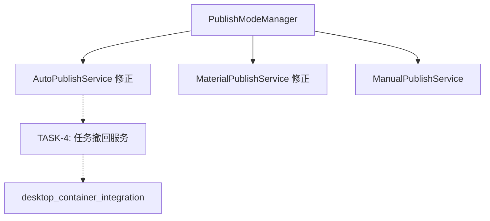

# -*- coding: utf-8 -*-
"""
任务文档 - 发布模式修正与任务撤回功能

创建时间: 2026-05-07
阶段: 阶段3 - Atomize
"""

TASK_CONTENT = """
================================================================================
                     任务文档
        发布模式修正与任务撤回功能
================================================================================

一、任务依赖图 (Mermaid)
--------------------------------------------------------------------------------

二、任务清单
--------------------------------------------------------------------------------

TASK-1: 修正 AutoPublishService 发布模式检查
TASK-2: 修正 MaterialPublishService 发布模式检查
TASK-3: 创建 task_recall_service.py 任务撤回服务
TASK-4: 创建单元测试
TASK-5: 更新文档

三、详细任务定义
--------------------------------------------------------------------------------

================================================================================
TASK-1: 修正 AutoPublishService 发布模式检查
================================================================================

输入契约:
  - 无新输入，修改现有逻辑

输出契约:
  - should_auto_publish 增加模式检查

依赖关系:
  - 前置任务: 无
  - 并行任务: 无

验收标准:
  - should_auto_publish 在手动模式下返回 False
  - handle_production_confirmed 在手动模式下不自动发布

================================================================================
TASK-2: 修正 MaterialPublishService 发布模式检查
================================================================================

输入契约:
  - 无新输入，修改现有逻辑

输出契约:
  - handle_material_prepared 增加模式检查

依赖关系:
  - 前置任务: 无
  - 并行任务: 无

验收标准:
  - handle_material_prepared 在手动模式下不自动发布
  - 在自动模式下正常自动发布

================================================================================
TASK-3: 创建 task_recall_service.py 任务撤回服务
================================================================================

输入契约:
  - task_id: 任务ID (str)

输出契约:
  - 返回: bool (成功/失败)
  - 事件: TASK_RECALLED

依赖关系:
  - 前置任务: 无
  - 并行任务: 无

验收标准:
  - recall_task 方法能撤回指定任务
  - get_recallable_statuses 返回可撤回状态列表
  - can_recall 正确判断任务是否可撤回
  - 撤回成功后发送事件通知

================================================================================
TASK-4: 创建单元测试
================================================================================

输入契约:
  - 测试文件

输出契约:
  - 测试覆盖率100%

依赖关系:
  - 前置任务: TASK-1, TASK-2, TASK-3
  - 并行任务: 无

验收标准:
  - test_auto_publish_mode.py 覆盖修正后的逻辑
  - test_material_publish_mode.py 覆盖修正后的逻辑
  - test_task_recall_service.py 覆盖撤回服务
  - 所有测试通过

================================================================================

四、验收总览
--------------------------------------------------------------------------------

| 任务 | 功能模块 | 验收项数 | 状态 |
|------|----------|----------|------|
| TASK-1 | AutoPublishService 修正 | 2 | 待开发 |
| TASK-2 | MaterialPublishService 修正 | 2 | 待开发 |
| TASK-3 | TaskRecallService | 4 | 待开发 |
| TASK-4 | 单元测试 | 3个文件 | 待开发 |

================================================================================
"""

if __name__ == '__main__':
    print(TASK_CONTENT)
