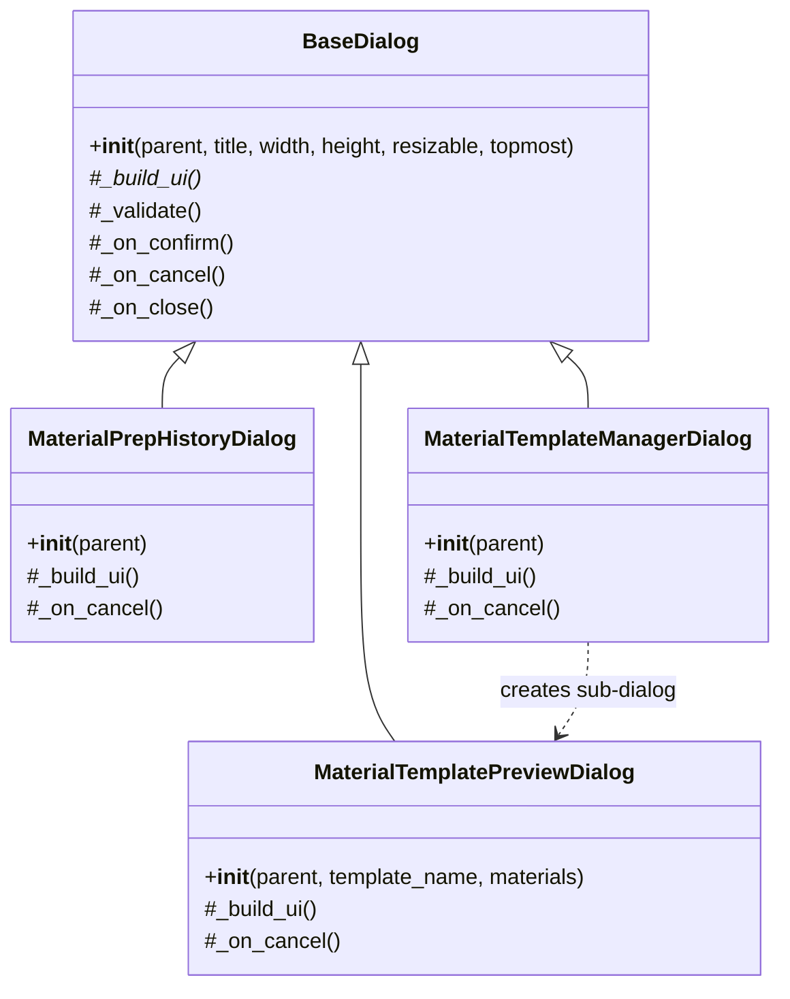

# 备料对话框提取 — 设计文档

## 架构图



## 数据流向

```
material_prep_view.py                material_dialogs.py
┌─────────────────────┐             ┌──────────────────────────────┐
│ show_history()       │ ──委托──>  │ MaterialPrepHistoryDialog    │
│   def show_history() │             │   _build_ui() → Treeview     │
│     win = Toplevel   │             │   加载 history 数据           │
│     ...              │             └──────────────────────────────┘
└─────────────────────┘
┌─────────────────────┐             ┌──────────────────────────────┐
│ _manage_templates()  │ ──委托──>  │ MaterialTemplateManagerDialog│
│   win = Toplevel     │             │   _build_ui() → Treeview     │
│   template CRUD      │             │   右键菜单: 重命名/删除/预览  │
└─────────────────────┘             └──────────────────────────────┘
                                               │
                                               │ 双击预览
                                               ▼
                                        ┌──────────────────────────────┐
                                        │ MaterialTemplatePreviewDialog│
                                        │   预览物料列表                │
                                        └──────────────────────────────┘
```

## 接口设计

### MaterialPrepHistoryDialog
```
__init__(parent)                 → MaterialPrepHistoryDialog instance
_build_ui()                      → 创建 Treeview + 加载数据 + 关闭按钮
_on_cancel()                     → self.window.destroy()
```

### MaterialTemplateManagerDialog
```
__init__(parent)                 → MaterialTemplateManagerDialog instance  
_build_ui()                      → 创建 Treeview + 右键菜单(重命名/删除/预览)
_on_cancel()                     → self.window.destroy()
内部函数:
  refresh_templates()            → 刷新 Treeview 数据
  on_rename()                    → popup_form 重命名
  on_delete()                    → confirm 删除
  on_preview()                   → 打开 MaterialTemplatePreviewDialog
  show_context_menu(event)       → 右键菜单
```

### MaterialTemplatePreviewDialog
```
__init__(parent, template_name, materials)  → MaterialTemplatePreviewDialog
_build_ui()                      → 创建预览 Treeview + 关闭按钮
_on_cancel()                     → self.window.destroy()
```

## 模块依赖

```
material_dialogs.py
  ├── BaseDialog        (from views.dialogs.base)
  ├── alert             (from views.dialogs)
  ├── popup_form        (from views.dialogs)
  ├── get_connection    (from models.database)
  ├── get_all_templates, get_template, delete_template, rename_template
  │                     (from utils.material_templates)
  ├── COLORS, FONTS     (from config)
  └── setup_resizable_window (from utils.window_manager)
```

## 异常处理策略
- 数据库查询失败：记录 logger 异常，弹出 alert 提示
- 模板操作失败：记录 logger 异常，弹出 alert 提示
