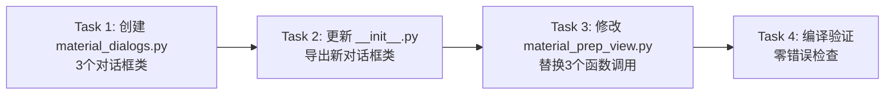

# 备料对话框提取 — 子任务

## 任务依赖图

## Task 1: 创建 material_dialogs.py

**输入契约**：
- `views/dialogs/` 目录已存在
- `BaseDialog` 基类已实现
- 熟悉 `quality_dialogs.py` 的代码风格

**输出契约**：
- 文件位置：`views/dialogs/material_dialogs.py`
- 包含 3 个类：
  1. `MaterialPrepHistoryDialog` — 历史记录对话框
  2. `MaterialTemplateManagerDialog` — 模板管理对话框
  3. `MaterialTemplatePreviewDialog` — 模板预览对话框

**验收标准**：
- 3 个类均继承 `BaseDialog`
- 内部逻辑与原有 `material_prep_view.py` 保持一致
- 无硬编码路径/密码/API密钥
- 导入路径正确

## Task 2: 更新 __init__.py

**输入契约**：
- `views/dialogs/__init__.py` 已存在
- Task 1 已完成

**输出契约**：
- `__init__.py` 新增 `material_dialogs` 的导入和导出

**验收标准**：
- `from views.dialogs.material_dialogs import MaterialPrepHistoryDialog` 可成功导入

## Task 3: 修改 material_prep_view.py

**输入契约**：
- Task 1-2 已完成
- `material_prep_view.py` 完整代码

**修改点**：
| 函数 | 替换为 |
|------|--------|
| `show_history()` | 创建 `MaterialPrepHistoryDialog(self)` |
| `_manage_templates()` | 创建 `MaterialTemplateManagerDialog(self)` |
| 内联 `template_preview` | 创建 `MaterialTemplatePreviewDialog(...)` |

**注意**：
- `_manage_templates()` 内部的 `on_preview()` 函数中，原 `template_preview` 通过 `tk.Toplevel(win)` 创建子窗口，要改为 `MaterialTemplatePreviewDialog(parent, template_name, materials)`
- 删除原有 3 个函数的 Toplevel 创建代码

**验收标准**：
- `material_prep_view.py` 中 Toplevel 从 5 个减至 2 个
- UI 功能与原版完全一致

## Task 4: 编译验证

**输入契约**：
- Task 1-3 已完成

**输出契约**：
- 4 个文件零诊断通过：`material_dialogs.py`、`__init__.py`、`material_prep_view.py`、`base.py`

**验收标准**：
- VSCode GetDiagnostics 零错误
- 无导入错误、无语法错误
