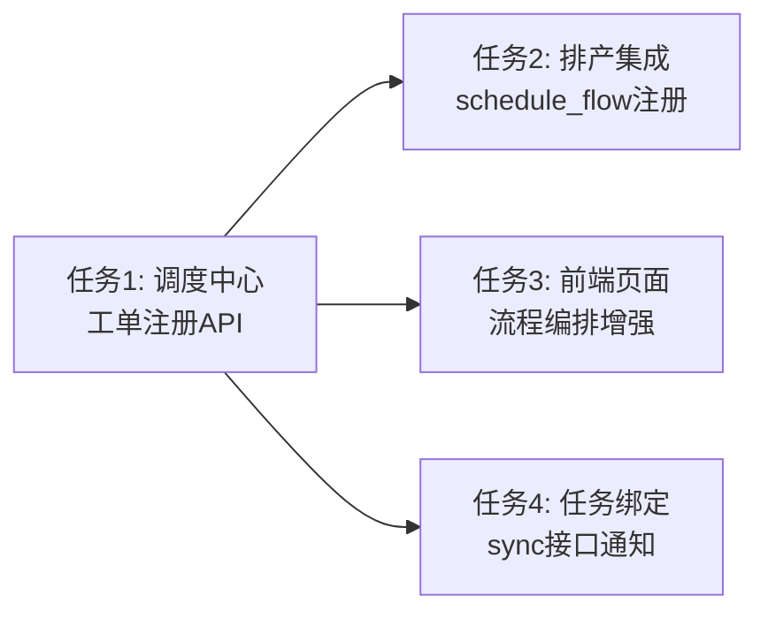

# CONSENSUS - 工单信息绑定至调度中心流程编排

## 需求描述

主软件（不锈钢自动跟单系统3.0版）订单排产任务发布后，在**调度中心的流程编排位置**增加工单信息。当物料需求发布后，数据绑定在该工单下面；工序任务和质检任务也归类到该订单下。

## 验收标准

1. 排产发布成功后，调度中心流程编排自动创建工单记录（含工单号、客户、产品、数量、工序）
2. 调度中心流程编排页面可查看所有已注册工单及关联信息
3. 物料需求、工序任务、质检任务都关联到对应工单（通过 related_order 字段）
4. 工单包含：工单号、客户名、产品、数量、状态、关联任务列表（物料/工序/质检分类）
5. 流程编排页面可查看工单下的所有关联任务及其完成状态
6. 系统降级：调度中心不可用时，排产发布不受影响

## 技术实现方案

### 涉及文件（4个）

| 文件 | 修改内容 | 优先级 |
|------|---------|--------|
| dispatch_center.py | 新增工单注册API + 流程数据模型增强（order_no、customer、task列表等字段） | P0 |
| schedule_flow.py | 排产发布后自动调用调度中心工单注册API | P0 |
| dispatch_center.html | 流程编排标签页增强：显示工单信息+关联任务列表 | P1 |
| wechat_server.py | sync/task接口完成后通知调度中心更新任务计数 | P1 |

### 数据流向

```
排产发布 → 调度中心流程编排创建工单(dipatch_center_data.json) →
物料/工序/质检任务(sync/task)设置related_order →
调度中心查询时从容器中心检索关联任务
```

### 关键设计决策

1. **持久化方式**：增强 dispatch_center_data.json 中 processes 数组，添加工单字段（order_no、customer_name、task_count等）
2. **工单绑定机制**：使用现有 DataPackage.related_order 字段，无需修改数据容器模型
3. **排产集成方式**：schedule_flow.py 发布排产后 HTTP 调用调度中心工单注册API（127.0.0.1:5000），3秒超时降级
4. **任务查询机制**：调度中心查询工单详情时，通过容器中心 storage.get_packages() 按 related_order 过滤获取关联任务
5. **幂等设计**：相同工单号重复注册返回已有流程ID

## 技术约束

- 不修改现有的排产发布业务逻辑
- 不修改现有的任务同步业务逻辑
- 不修改数据容器（container_center_v5.py）的数据模型
- 保持与现有UI风格一致
- 所有新增API返回格式统一为 {code, message, data}

## 任务定义（4个原子任务）

1. **调度中心工单注册API** → dispatch_center.py 新增工单注册/查询/统计接口，流程数据模型增强
2. **排产集成** → schedule_flow.py 排产发布后自动注册工单到调度中心
3. **前端页面增强** → dispatch_center.html 流程编排标签页显示工单信息+关联任务
4. **任务绑定** → wechat_server.py sync/task接口完成后通知调度中心更新计数

## 任务依赖图



## 执行计划

按依赖顺序执行：T1 → T2,T3,T4(并行)

| 阶段 | 任务 | 预计产出 |
|------|------|---------|
| 第1步 | T1: 调度中心工单注册API | dispatch_center.py 新增API + 数据模型增强 |
| 第2步 | T2: 排产集成 | schedule_flow.py 修改 |
| 第2步 | T3: 前端页面增强 | dispatch_center.html 修改 |
| 第2步 | T4: 任务绑定 | wechat_server.py 修改 |

## 风险与应对

| 风险 | 影响 | 应对 |
|------|------|------|
| 调度中心未启动 | 工单注册失败 | 降级运行，不阻塞排产 |
| dispatch_center_data.json 损坏 | 工单数据丢失 | 启动时自动备份，使用空列表初始化 |
| 工单号重复 | 数据冲突 | 幂等设计，返回已有记录 |
| 容器中心不可用 | 任务列表为空 | 降级显示，不影响流程编排展示 |
