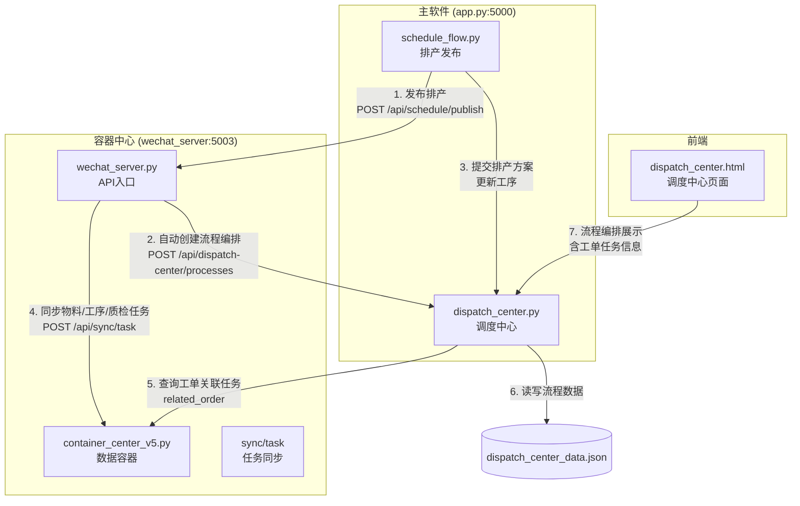
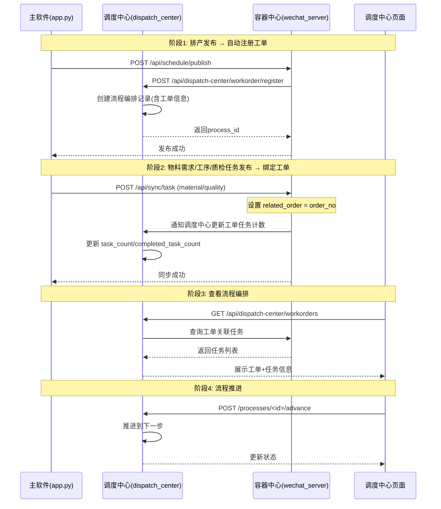

# DESIGN - 工单信息绑定至调度中心流程编排

## 一、整体架构图



## 二、核心概念

调度中心流程编排（流程编排位置）是本次修改的核心位置。现有的流程编排已包含：
- **生产流程**：工单发布→排产制定→排产确认→生产执行→报工完成→质检审核→完工入库
- **物料采购流程**：物料需求→库存检查→采购审批→采购下单→到货入库→领料出库
- **质检流程**：来料检验→过程检验→完工检验→出具报告

**本次新增功能**：
1. 排产发布时自动在流程编排创建工单记录
2. 物料需求、工序任务、质检任务自动绑定到该工单
3. 流程编排页面可查看工单下的所有关联任务
4. 工单状态随流程步骤推进自动更新

## 三、数据模型

### 3.1 流程数据增强（dispatch_center_data.json → processes）

现有 `processes` 数组中每个流程条目增强以下字段：

```json
{
    "id": "流程ID",
    "order_no": "原始订单号",
    "order_no": "工单号(wo-xxx)",
    "customer_name": "客户名称",
    "customer_group": "客户群组",
    "product_name": "产品名称",
    "quantity": 1000,
    "unit": "米",
    "delivery_date": "2024-12-31",
    "priority": "normal",
    "status": "created|in_progress|completed",
    "flow_type": "production|material_purchase|quality",
    "current_step": 0,
    "steps": [...],
    "task_count": 5,
    "completed_task_count": 2,
    "material_tasks": [],    // 关联的物料任务列表
    "process_tasks": [],     // 关联的工序任务列表
    "quality_tasks": [],     // 关联的质检任务列表
    "created_at": "",
    "updated_at": ""
}
```

## 四、API接口定义

### 4.1 工单注册接口（由排产发布时自动调用）

**POST** `/api/dispatch-center/workorder/register`

**请求体：**
```json
{
    "order_no": "wo-20240511-001",
    "order_no": "ORD-2024-001",
    "customer_name": "上海机械厂",
    "customer_group": "华东区",
    "product_name": "不锈钢网带",
    "quantity": 1000,
    "unit": "米",
    "delivery_date": "2024-12-31",
    "priority": "normal",
    "flow_type": "production",
    "processes": [
        {"name": "编织", "quantity": 1000, "unit": "米"},
        {"name": "质检", "quantity": 1000, "unit": "米"}
    ]
}
```

**响应体：**
```json
{
    "code": 0,
    "message": "工单注册成功，流程已创建",
    "data": {
        "process_id": "a1b2c3d4",
        "order_no": "wo-20240511-001",
        "status": "created",
        "current_step": 0
    }
}
```

### 4.2 工单列表（流程编排列表增强）

**GET** `/api/dispatch-center/workorders?status=created&flow_type=production`

直接在 `/api/dispatch-center/processes` 基础上增强，返回原有流程数据 + 任务统计信息。

**响应体：**
```json
{
    "code": 0,
    "data": [
        {
            "id": "a1b2c3d4",
            "order_no": "wo-20240511-001",
            "customer_name": "上海机械厂",
            "product_name": "不锈钢网带",
            "quantity": 1000,
            "unit": "米",
            "status": "in_progress",
            "flow_type": "production",
            "current_step": 2,
            "task_count": 5,
            "completed_task_count": 2,
            "created_at": "2024-05-11T10:30:00"
        }
    ]
}
```

### 4.3 工单详情（含关联任务）

**GET** `/api/dispatch-center/workorder/<order_no>`

**响应体：**
```json
{
    "code": 0,
    "data": {
        "process": {
            "id": "a1b2c3d4",
            "order_no": "wo-20240511-001",
            "customer_name": "上海机械厂",
            "status": "in_progress",
            "flow_type": "production",
            "current_step": 2,
            "steps": [...]
        },
        "tasks": {
            "material": [
                {"id": "PKG001", "title": "领料-不锈钢丝", "status": "completed"}
            ],
            "process": [
                {"id": "PKG002", "title": "编织-1000米", "status": "in_progress"}
            ],
            "quality": [
                {"id": "PKG003", "title": "质检-编织工序", "status": "pending"}
            ]
        },
        "stats": {
            "total_tasks": 5,
            "completed_tasks": 2
        }
    }
}
```

### 4.4 工单统计

**GET** `/api/dispatch-center/workorder/stats`

**响应体：**
```json
{
    "code": 0,
    "data": {
        "total_orders": 15,
        "created": 3,
        "in_progress": 5,
        "completed": 7,
        "total_tasks": 67,
        "completed_tasks": 23
    }
}
```

### 4.5 更新工单工序信息

**PUT** `/api/dispatch-center/workorder/<order_no>/processes`

**请求体：**
```json
{
    "processes": [
        {"name": "编织", "worker": "张三", "start": "01-20", "end": "01-21"},
        {"name": "质检", "worker": "赵六", "start": "01-22", "end": "01-23"}
    ]
}
```

## 五、数据流向图



## 六、模块变更清单

| 文件 | 变更类型 | 说明 |
|------|---------|------|
| dispatch_center.py | 修改 | 新增工单注册/查询API，增强流程带工单信息 |
| schedule_flow.py | 修改 | 排产发布后调用调度中心工单注册API |
| dispatch_center.html | 修改 | 流程编排标签页增强：显示工单信息+关联任务 |
| wechat_server.py | 修改 | sync/task接口完成后通知调度中心更新计数 |

## 七、异常处理策略

| 场景 | 处理方式 |
|------|---------|
| 调度中心不可用 | 排产降级运行，不阻塞业务 |
| 工单已存在 | 幂等设计，返回已有流程ID |
| 任务绑定失败 | 不影响任务同步，记录日志 |
| JSON文件存储异常 | 记录日志，尝试恢复 |
