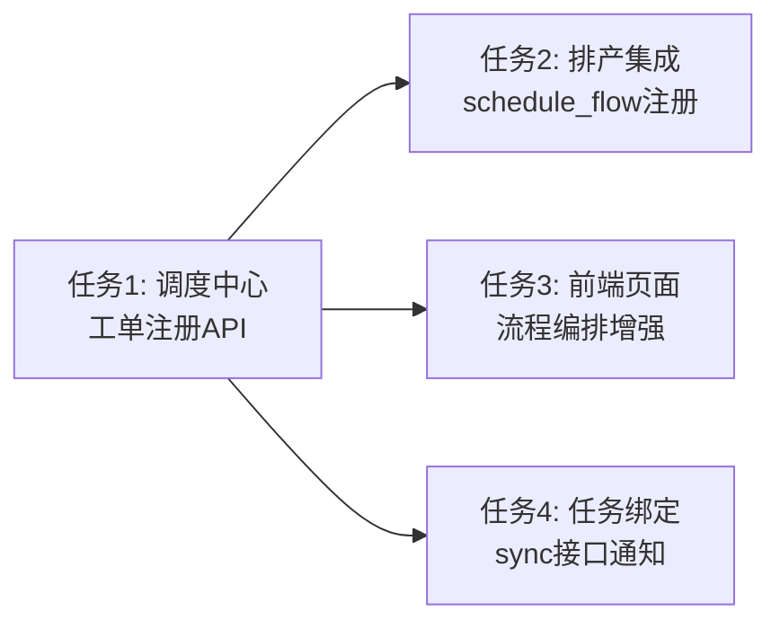

# TASK - 工单信息绑定至调度中心流程编排 - 原子任务拆分

## 任务依赖图



---

## 任务1: 调度中心工单注册API

### 输入契约
- **前置依赖**: 无
- **输入数据**: DESIGN_工单绑定.md 中的 API 定义和数据模型
- **环境依赖**: dispatch_center.py 现有架构（数据管理方式、容器中心访问等）

### 实现内容
在 [dispatch_center.py](file:///d:/yuan/不锈钢网带跟单3.0/mobile_api_ai/dispatch_center.py) 中：

#### 1.1 数据模型增强

扩展 `DISPATCH_RULES_DEFAULT` 或数据管理逻辑，使 `dispatch_center_data.json` 中 `processes` 数组的每个条目支持以下增强字段：

```python
# 现有 processes 中每个条目的增强字段：
{
    # ... 现有字段 (id, order_no, product_name, quantity, status, flow_type, steps, ...)
    
    # 新增字段：
    "order_no": "wo-20240511-001",  # 工单号
    "customer_name": "上海机械厂",         # 客户名称
    "customer_group": "华东区",           # 客户群组
    "unit": "米",                         # 单位
    "delivery_date": "2024-12-31",        # 交货日期
    "priority": "normal",                 # 优先级
    "task_count": 5,                      # 总任务数
    "completed_task_count": 2,            # 已完成任务数
    "material_tasks": [],                 # 关联的物料任务列表
    "process_tasks": [],                  # 关联的工序任务列表
    "quality_tasks": []                   # 关联的质检任务列表
}
```

#### 1.2 新增API端点

**① POST** `/api/dispatch-center/workorder/register` - 工单注册

- 接收排产发布传递的工单信息
- 在 `dispatch_center_data.json` 的 `processes` 中创建一条新的流程记录
- 自动创建流程步骤（根据 flow_type 使用 PROCESS_FLOW_TEMPLATES）
- 幂等设计：相同 order_no 返回已有流程ID（不重复创建）
- **请求体：**
```json
{
    "order_no": "wo-xxx",
    "order_no": "ORD-xxx",
    "customer_name": "客户名",
    "customer_group": "客户群",
    "product_name": "产品名",
    "quantity": 1000,
    "unit": "米",
    "delivery_date": "2024-12-31",
    "priority": "normal",
    "flow_type": "production",
    "processes": [{"name": "编织", "quantity": 1000}]
}
```
- **响应体：** `{"code": 0, "message": "工单注册成功", "data": {"process_id": "xxx", "order_no": "wo-xxx", "status": "created"}}`

**② GET** `/api/dispatch-center/workorders` - 工单列表（增强现有 `/processes`）

- 可直接增强现有 `list_processes` 路由，增加更多过滤参数
- 支持 `status`、`flow_type` 过滤（现有已支持）
- 返回数据包含新增字段（order_no, customer_name, task_count, completed_task_count 等）
- 不需要新建路由，在 `/api/dispatch-center/processes` 基础上增强

**③ GET** `/api/dispatch-center/workorder/<order_no>` - 工单详情

- 根据 order_no 查找对应的 process
- 从容器中心(`_get_container_center().storage.get_packages()`)查询 `related_order=order_no` 的所有任务
- 按数据类型分组：物料(material)、工序(process)、质检(quality)
- **响应体：**
```json
{
    "code": 0,
    "data": {
        "process": { "id": "xxx", "order_no": "wo-xxx", "status": "in_progress", ... },
        "tasks": {
            "material": [{"id": "PKG001", "title": "领料-不锈钢丝", "status": "completed", ...}],
            "process": [{"id": "PKG002", "title": "编织-1000米", "status": "in_progress", ...}],
            "quality": [{"id": "PKG003", "title": "质检", "status": "pending", ...}]
        },
        "stats": {"total_tasks": 5, "completed_tasks": 2}
    }
}
```

**④ GET** `/api/dispatch-center/workorder/stats` - 工单统计

- 从 `dispatch_center_data.json` 统计所有 process 的状态
- **响应体：**
```json
{
    "code": 0,
    "data": {
        "total_orders": 15,
        "created": 3,
        "in_progress": 5,
        "completed": 7,
        "total_tasks": 67,
        "completed_tasks": 23
    }
}
```

**⑤ PUT** `/api/dispatch-center/workorder/<order_no>/processes` - 更新工单工序信息

- 更新 process 中的工序列表信息（如排产方案确定后更新工序负责人和起止时间）
- **请求体：**
```json
{
    "processes": [
        {"name": "编织", "worker": "张三", "start": "01-20", "end": "01-21"},
        {"name": "质检", "worker": "赵六", "start": "01-22", "end": "01-23"}
    ]
}
```

**⑥ POST** `/api/dispatch-center/workorder/update-task-count` - 更新工单任务计数（由 sync 接口调用）

- 接收 order_no 和变更类型
- 更新 process 中的 task_count 和 completed_task_count
- **请求体：**
```json
{
    "order_no": "wo-xxx",
    "action": "add" | "complete" | "remove",
    "task_type": "material" | "process" | "quality"
}
```

### 输出契约
- **交付物**: dispatch_center.py 修改，新增工单注册/查询/统计/计数更新等API
- **验收标准**:
  - POST /workorder/register 可正常创建工单流程记录
  - 相同工单号重复注册返回已有记录（幂等）
  - GET /workorders 返回工单列表含增强字段
  - GET /workorder/<no> 返回工单详情及关联任务（按物料/工序/质检分组）
  - GET /workorder/stats 统计信息准确
  - PUT /workorder/<no>/processes 可更新工序信息
  - POST /workorder/update-task-count 可更新任务计数
  - 容器中心不可用时，查询任务列表降级返回空列表

### 实现约束
- 复用现有 `_load_json_data()` 和 `_save_json_data()` 操作 dispatch_center_data.json
- 使用 `_get_container_center().storage.get_packages()` 查询关联任务
- 容器中心访问失败时降级（try/except，返回空任务列表）
- 所有新增API添加 `@dispatch_center_bp.route` 装饰器
- API返回格式统一为 {code, message, data}

---

## 任务2: 排产集成 - schedule_flow 注册工单

### 输入契约
- **前置依赖**: 任务1完成（工单注册API可用）
- **输入数据**: schedule_flow.py 的排产发布数据（order_no, customer_name, product_name 等）
- **环境依赖**: schedule_flow.py, app.py（调度中心运行在 port 5000）

### 实现内容
修改 [schedule_flow.py](file:///d:/yuan/不锈钢网带跟单3.0/mobile_api_ai/schedule_flow.py)：

在 `api_publish_order()` 函数中，创建排产记录成功后，增加调用调度中心工单注册逻辑：

1. 排产发布成功（阶段2）后，通过 `requests.post` 调用本地调度中心工单注册API：
   - URL: `http://127.0.0.1:5000/api/dispatch-center/workorder/register`
   - 传递工单完整信息（order_no, customer_name, customer_group, product_name, quantity, unit, delivery_date, priority, flow_type, processes）
   - 设置3秒超时
   - 容器中心不可用时降级处理（仅记录日志，不阻塞排产主流程）

2. 排产提交时（阶段3）调用更新工序API：
   - URL: `http://127.0.0.1:5000/api/dispatch-center/workorder/<order_no>/processes`
   - 传递排产方案中确定的工序信息（名称、负责人、起止时间）

### 输出契约
- **交付物**: schedule_flow.py 修改，排产发布时自动注册工单到调度中心
- **验收标准**:
  - 排产发布成功后自动在调度中心创建工单流程记录
  - 调度中心不可用时排产正常进行（降级）
  - 排产提交时更新工单的工序信息
  - 日志记录工单注册结果

### 实现约束
- 使用 `requests` 模块进行 HTTP 调用（已存在于 schedule_flow.py 中）
- 添加超时控制（3秒超时）
- 不修改现有排产流程的业务逻辑
- 降级处理：异常时 `logger.warning` 记录，不抛出异常

---

## 任务3: 前端页面 - 流程编排标签增强

### 输入契约
- **前置依赖**: 任务1完成（工单查询API可用）
- **输入数据**: dispatch_center.html 现有流程编排标签页
- **环境依赖**: dispatch_center.html, dispatch_center.py

### 实现内容
修改 [dispatch_center.html](file:///d:/yuan/不锈钢网带跟单3.0/mobile_api_ai/templates/dispatch_center.html)：

#### 3.1 流程编排列表增强

在 `#tab-processes` 中的流程列表表格增强：

- 增加列：工单号(order_no)、客户名(customer_name)、任务数(task_count/completed_task_count)
- 状态列增加显示进度（已完成/总任务数）
- 增加"查看详情"按钮，点击弹出工单详情弹窗

#### 3.2 工单详情弹窗

新增工单详情弹窗（modal），包含：

- **基本信息区**：工单号、客户名、客户群、产品名、数量、单位、交货日期、优先级、状态
- **流程进度区**：显示流程步骤及当前进度（步骤名称、负责人、状态标签）
- **任务列表区**：按三类分标签页展示
  - 物料任务标签：任务ID、标题、状态、更新时间
  - 工序任务标签：同上
  - 质检任务标签：同上
- **统计概要**：总任务数、已完成数、完成率

#### 3.3 统计卡片

在流程编排列表上方新增统计卡片（与现有样式一致）：

- 总工单数
- 进行中工单数（in_progress）
- 已完成工单数（completed）
- 总任务数 / 已完成任务数

### 输出契约
- **交付物**: dispatch_center.html 流程编排标签页增强
- **验收标准**:
  - 流程列表显示工单号和客户名
  - 列表显示任务完成进度
  - 点击查看详情弹出完整工单信息
  - 工单详情弹窗可按物料/工序/质检查看关联任务
  - 统计卡片数据正确
  - 后端API不可用时友好提示

### 实现约束
- 使用现有CSS样式，保持UI风格一致
- JavaScript 使用 fetch API 调用后端接口
- 不引入额外前端框架
- 使用现有 modal 弹窗模式

---

## 任务4: 任务绑定 - sync接口关联工单

### 输入契约
- **前置依赖**: 任务1完成（调度中心工单计数更新API可用）
- **输入数据**: wechat_server.py 现有 sync/task 和 sync/report 接口
- **环境依赖**: wechat_server.py

### 实现内容
修改 [wechat_server.py](file:///d:/yuan/不锈钢网带跟单3.0/mobile_api_ai/wechat_server.py)：

#### 4.1 sync/task 接口增强

在现有的 sync/task 处理逻辑中，同步任务成功后，如果任务数据中包含 `order_no` 或 `related_order`：

1. 通知调度中心更新工单任务计数（action: "add"）
2. 通过 HTTP 调用调度中心的 `/api/dispatch-center/workorder/update-task-count`
3. 发送给 `127.0.0.1:5000`，3秒超时
4. 失败时降级记录日志，不阻塞任务同步

#### 4.2 sync/report 接口增强

在现有的 sync/report 处理逻辑中，报工完成后：

1. 如果报工数据关联了工单，通知调度中心更新完成计数（action: "complete"）
2. 同样调用 `/api/dispatch-center/workorder/update-task-count`
3. 失败时降级记录日志

### 输出契约
- **交付物**: wechat_server.py 修改，sync接口完成后通知调度中心更新计数
- **验收标准**:
  - sync/task 同步后工单任务计数增加
  - sync/report 完成后工单完成计数增加
  - 调度中心不可用时同步流程不受影响
  - 日志记录通知结果

### 实现约束
- 不修改现有的任务同步业务逻辑
- 仅在现有逻辑基础上增加通知调用
- 使用 `requests` 模块（确认 wechat_server.py 中已导入 `requests`）
- 异常降级：警告日志记录，不抛出异常
