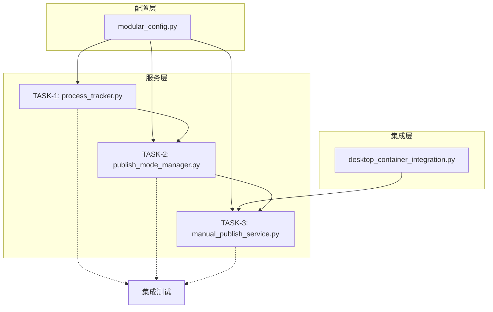

# -*- coding: utf-8 -*-
"""
任务文档 - 工序追踪与手动/自动发布切换

创建时间: 2026-05-07
阶段: 阶段3 - Atomize
"""

TASK_CONTENT = """
================================================================================
                     任务文档
        工序追踪与手动/自动发布切换功能
================================================================================

一、任务依赖图 (Mermaid)
--------------------------------------------------------------------------------

二、任务清单
--------------------------------------------------------------------------------

TASK-1: 创建 process_tracker.py 工序追踪器
TASK-2: 创建 publish_mode_manager.py 发布模式管理器
TASK-3: 创建 manual_publish_service.py 手动发布服务
TASK-4: 创建单元测试
TASK-5: 更新 modular_config.json 配置

三、详细任务定义
--------------------------------------------------------------------------------

================================================================================
TASK-1: 创建 process_tracker.py 工序追踪器
================================================================================

输入契约:
  - order_no: 订单号 (str)
  - process_name: 工序名称 (str)
  - status: 状态 (str: pending/in_progress/completed)
  - operator_id: 操作员ID (str)
  - **kwargs: 扩展参数

输出契约:
  - 返回: bool (成功/失败)
  - 事件: PROCESS_TRACKED

依赖关系:
  - 前置任务: 无
  - 并行任务: 无

验收标准:
  - track_process方法能正确记录工序状态
  - get_order_processes能返回订单所有工序
  - get_current_process能返回当前进行中的工序
  - 事件通知正确发送

================================================================================
TASK-2: 创建 publish_mode_manager.py 发布模式管理器
================================================================================

输入契约:
  - mode: 模式 ('manual' 或 'auto')

输出契约:
  - 返回: bool (设置成功/失败)
  - 事件: MODE_CHANGED

依赖关系:
  - 前置任务: 无
  - 并行任务: 无

验收标准:
  - set_mode能正确切换模式
  - get_mode能返回当前模式
  - is_manual_mode/is_auto_mode判断正确
  - 模式变更触发事件通知
  - 无效模式抛出ValueError

================================================================================
TASK-3: 创建 manual_publish_service.py 手动发布服务
================================================================================

输入契约:
  - order_no: 订单号 (str)
  - process_name: 工序名称 (str)
  - **kwargs: 扩展参数

输出契约:
  - 返回: bool 或 List[str]
  - 依赖: desktop_container_integration.py

依赖关系:
  - 前置任务: TASK-2 (建议)
  - 并行任务: 无

验收标准:
  - publish_single能发布单个工序任务
  - publish_batch能批量发布工序任务
  - get_publishable_processes返回可发布工序列表
  - 模式为auto时拒绝手动发布

================================================================================
TASK-4: 创建单元测试
================================================================================

输入契约:
  - 三个模块的测试文件

输出契约:
  - 测试覆盖率: 核心方法100%

依赖关系:
  - 前置任务: TASK-1, TASK-2, TASK-3
  - 并行任务: 无

验收标准:
  - test_process_tracker.py 覆盖ProcessTracker
  - test_publish_mode_manager.py 覆盖PublishModeManager
  - test_manual_publish_service.py 覆盖ManualPublishService
  - 所有测试通过

================================================================================
TASK-5: 更新 modular_config.json 配置
================================================================================

输入契约:
  - 新增 manual_publish 和 process_tracker 配置节

输出契约:
  - 配置文件更新

依赖关系:
  - 前置任务: 无
  - 并行任务: 无

验收标准:
  - manual_publish配置节正确添加
  - process_tracker配置节正确添加
  - 默认值合理

================================================================================

四、验收总览
--------------------------------------------------------------------------------

| 任务 | 功能模块 | 验收项数 | 状态 |
|------|----------|----------|------|
| TASK-1 | ProcessTracker | 4 | 待开发 |
| TASK-2 | PublishModeManager | 5 | 待开发 |
| TASK-3 | ManualPublishService | 4 | 待开发 |
| TASK-4 | 单元测试 | 3个文件 | 待开发 |
| TASK-5 | 配置文件 | 2个配置节 | 待开发 |

================================================================================
"""

if __name__ == '__main__':
    print(TASK_CONTENT)
