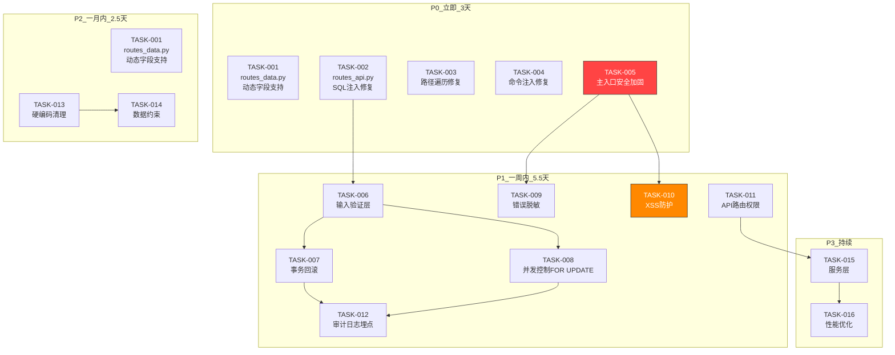

# TASK_库存系统安全加固.md

> 文档版本：v2.0
> 编制日期：2026-06-02
> 依据：`mobile_api_ai/代码审查报告/库存管理系统应对方案_修订版_2026-06-02.md`
> 前置文档：`mobile_api_ai/代码审查报告/库存管理系统严格测评报告_2026-05-30.md`

---

## 一、任务拆分概览

本任务将库存系统安全加固与代码修复拆分为 **16 个原子任务**，按优先级分 P0-P3 四个阶段，每个任务独立可验证。

### 1.1 任务依赖图



### 1.2 任务清单

| 任务ID | 任务名称 | 优先级 | 预计工时 | 依赖任务 | 涉及文件 |
|--------|----------|--------|----------|----------|----------|
| **P0 — 立即修复** | | | **2.5天** | | |
| ~~TASK-001~~ | ~~routes_data.py SQL 注入修复~~ | ~~P0~~ | ~~0.5天~~ | ~~无~~ | ~~routes_data.py~~ |
| TASK-002 | routes_api.py SQL 注入修复 | P0 | 0.5天 | 无 | routes_api.py |
| TASK-003 | 路径遍历漏洞修复（中文文件名兼容） | P0 | 0.5天 | 无 | routes_system.py |
| TASK-004 | 子进程命令注入修复 | P0 | 0.5天 | 无 | routes_system.py |
| TASK-005 | inventory_api_server.py 安全加固（含 _get_conn 硬编码） | **P0** | 1.5天 | 无 | inventory_api_server.py, templates/login.html |
| **P1 — 一周内加固** | | | **5.5天** | | |
| TASK-006 | 输入验证层（v2.1：返回转换后的值） | P1 | 1天 | TASK-002 | db_utils.py, routes_core.py, routes_api.py |
| TASK-007 | 事务回滚处理（仅 stock_in/stock_out） | P1 | 1天 | TASK-006 | routes_core.py |
| TASK-008 | 并发控制（inbound_do/outbound_do/batch_do FOR UPDATE） | P1 | 1天 | TASK-006 | routes_core.py |
| TASK-009 | 错误信息脱敏 | P1 | 0.5天 | TASK-005 | routes_core.py, routes_system.py, inventory_api_server.py |
| TASK-010 | XSS/HTML 注入防护 | **P1** | 0.5天 | TASK-005 | inventory_api_server.py, templates/*.html |
| TASK-011 | API 路由权限控制 | P1 | 0.5天 | 无 | inventory_api_server.py |
| TASK-012 | 写操作审计日志埋点 | P1 | 1天 | TASK-007, TASK-008 | db_utils.py, routes_core.py, routes_data.py, routes_api.py |
| **P2 — 一月内完善** | | | **3天** | | |
| TASK-001 | routes_data.py 动态字段支持（功能增强） | P2 | 0.5天 | 无 | routes_data.py |
| TASK-013 | 业务硬编码清理 | P2 | 0.5天 | 无 | routes_core.py |
| TASK-014 | 数据完整性约束 | P2 | 0.5天 | TASK-013 | routes_core.py |
| TASK-017 | 登录接口速率限制（防暴力破解） | P2 | 0.5天 | TASK-005 | inventory_api_server.py |
| TASK-018 | inventory_config.json 文件权限保护 | P2 | 0.5天 | TASK-002 | routes_api.py |
| **P3 — 持续演进** | | | **持续** | | |
| TASK-015 | 引入服务层 | P3 | 持续 | 无（弱依赖TASK-011） | 新建 services/ 目录 |
| TASK-016 | 性能优化 | P3 | 持续 | 无（部分可独立执行） | 多处 |

---

## 二、P0 — 立即修复（3天）

---

### TASK-001: routes_data.py 动态字段支持（功能增强，P2）

> **本任务为功能增强，非漏洞修复。** 经源代码核查，`routes_data.py:80` 的 `base_add` 函数字段名为硬编码的 `code, name, contact`，表名来自白名单字典，均无 SQL 注入风险。本任务是在此基础上添加动态字段白名单支持，提升接口灵活性。

**任务描述**：为 `inventory_web/routes_data.py` 的 `base_add` 函数添加动态字段白名单支持，使接口可按需写入 `phone`、`address` 等额外字段。

#### 输入契约

| 前置依赖 | 输入数据 | 环境依赖 |
|----------|----------|----------|
| 无 | 修订版方案 T1-R 代码段 | Python 3.x, Flask, PyMySQL |

#### 输出契约

| 输出数据 | 交付物 | 验收标准 |
|----------|--------|----------|
| 修改 `inventory_web/routes_data.py` | `base_add` 函数支持动态字段，`logger` 已导入 | 1. `logger` 导入无 NameError<br/>2. 字段名通过白名单校验<br/>3. `ALLOWED_FIELDS` 命名统一（与 T002 一致） |

#### 实现要求

1. 在文件头部导入 `from .db_utils import query, execute, logger`
2. 定义 `ALLOWED_COLUMNS_BASE = {'code', 'name', 'contact', 'phone', 'address', 'remark'}`（命名与 T002 `ALLOWED_UPDATE_COLUMNS` 统一）
3. 字段名筛选：`fields = [k for k in data.keys() if k in ALLOWED_COLUMNS_BASE]`
4. 异常处理：`logger.exception()` 记录堆栈，返回脱敏信息
5. **行为变更说明**：新接口会写入用户提交的合法额外字段（如 `phone`, `address`），原接口只插入 `code, name, contact` 三个固定字段。仅提交 `code, name, contact` 的请求行为完全一致。

#### 验收标准

- [ ] `from .db_utils import ... logger` 已添加，无 ImportError
- [ ] 所有字段名经过白名单 `ALLOWED_COLUMNS_BASE` 校验
- [ ] 非法字段被拒绝（返回 400 `"没有有效字段"`）
- [ ] 异常时 `logger.exception()` 记录完整堆栈，返回 `'新增失败'` 而非 `str(e)`
- [ ] 原有 `code, name, contact` 字段功能不变

---

### TASK-002: routes_api.py SQL 注入修复

**任务描述**：修复 `inventory_web/routes_api.py:8-14` `api_update` 函数中列名拼接 SQL 注入问题。添加 `logger` 导入。

#### 输入契约

| 前置依赖 | 输入数据 | 环境依赖 |
|----------|----------|----------|
| `inventory_web/routes_api.py` 已存在 | 修订版方案 T2-R 代码段 | Python 3.x, Flask, PyMySQL |

#### 输出契约

| 输出数据 | 交付物 | 验收标准 |
|----------|--------|----------|
| 修改 `inventory_web/routes_api.py` | `api_update` 重构完成，`logger` 已导入 | 1. 各实体有独立白名单<br/>2. 白名单外字段被拒绝<br/>3. 同时审查 `api_delete` |

#### 实现要求

1. 在文件头部导入 `from .db_utils import execute, logger`
2. 定义 `ALLOWED_UPDATE_COLUMNS` 字典，为 `product`, `supplier`, `warehouse`, `category` 分别定义可更新字段白名单
3. 字段名筛选：`fields = [k for k in data.keys() if k in allowed]`
4. 异常处理：`logger.exception()` 记录堆栈，返回脱敏信息
5. 同步审查 `api_delete` 函数确认无类似问题

#### 验收标准

- [ ] `from .db_utils import ... logger` 已添加
- [ ] 每个实体类型有独立的可更新字段白名单
- [ ] 白名单外字段被拒绝（返回 400）
- [ ] `api_delete` 已确认无 SQL 注入风险
- [ ] 异常时返回脱敏信息而非 `str(e)`

---

### TASK-003: 路径遍历漏洞修复（v2.1 中文文件名兼容）

**任务描述**：修复 `inventory_web/routes_system.py:36-50` `backup_restore` 函数中 `filename` 参数未校验的路径遍历问题。

> **v2.1 重大变更**：原方案使用 `secure_filename` 预校验，对中文文件名 `备份_20260101.sql` 会返回空字符串 `""`，导致**所有中文备份文件无法恢复**。本版本**移除 `secure_filename` 预校验**，仅使用 `realpath` 路径越界检查（realpath 本身已处理 `../` 等穿越）。

#### 输入契约

| 前置依赖 | 输入数据 | 环境依赖 |
|----------|----------|----------|
| 无 | 修订版方案 T3-R 代码段（修订） | Python 3.x, Flask |

#### 输出契约

| 输出数据 | 交付物 | 验收标准 |
|----------|--------|----------|
| 修改 `inventory_web/routes_system.py` | `backup_restore` 加入路径校验 | 1. 路径越界检查<br/>2. 过滤含 `..` 或绝对路径前缀的非法名<br/>3. 文件存在性检查<br/>4. 支持中文文件名 |

#### 实现要求（v2.1 修订）

1. **移除** `from werkzeug.utils import secure_filename`（**不导入，避免误导开发者使用**）
2. 拒绝含 `..` 或绝对路径前缀的非法名：
   ```python
   if '..' in filename or filename.startswith('/') or filename.startswith('\\'):
       return jsonify({'ok': False, 'msg': '非法文件名'}), 400
   ```
3. 路径越界检查：
   ```python
   backup_dir = os.path.join(PROJECT_ROOT, 'inventory_backups')
   filepath = os.path.join(backup_dir, filename)
   real_backup = os.path.realpath(backup_dir)
   real_path = os.path.realpath(filepath)
   if not real_path.startswith(real_backup + os.sep):
       return jsonify({'ok': False, 'msg': '文件路径越界'}), 400
   ```
4. 文件不存在时返回 404

#### 验收标准

- [ ] **不再使用** `secure_filename`（避免中文文件名误判）
- [ ] 含 `..` 的文件名（如 `../../etc/passwd`）被拒绝（返回 400）
- [ ] 绝对路径文件名（如 `/etc/passwd`）被拒绝（返回 400）
- [ ] 路径越界校验生效：`real_path.startswith(real_backup + os.sep)`
- [ ] 文件不存在返回 404 而非 500
- [ ] **中文文件名**（如 `备份_20260101.sql`）可正常恢复（关键回归测试）

---

### TASK-004: 子进程命令注入修复

**任务描述**：修复 `inventory_web/routes_system.py:28` 中 `mysqldump` 子进程调用时 host/user 参数未校验的问题。

#### 输入契约

| 前置依赖 | 输入数据 | 环境依赖 |
|----------|----------|----------|
| `inventory_web/routes_system.py` 已存在 | 修订版方案 T4-R 代码段 | Python 3.x, re 模块 |

#### 输出契约

| 输出数据 | 交付物 | 验收标准 |
|----------|--------|----------|
| 修改 `inventory_web/routes_system.py` | MySQL 参数增加正则校验 | 1. host/user 通过 `^[a-zA-Z0-9.\-_]+$` 校验<br/>2. 非法参数返回 400 |

#### 实现要求

1. 定义 `_validate_mysql_param(name, value, pattern)` 函数
2. 对 `os.getenv("MYSQL_HOST")` 和 `os.getenv("MYSQL_USER")` 取值进行正则校验
3. 校验失败抛出 `ValueError` 或返回 400

#### 验收标准

- [ ] host 参数经过正则 `^[a-zA-Z0-9.\-_]+$` 校验
- [ ] user 参数经过正则 `^[a-zA-Z0-9.\-_]+$` 校验
- [ ] 非法参数（如含 `;`、`|`、`&` 等）返回 400
- [ ] `mysqldump` 子进程不会执行注入命令

---

### TASK-005: inventory_api_server.py 安全加固

**任务描述**：对库存系统主入口 `inventory_api_server.py`（端口 5010）进行安全加固，解决 **6 类问题**（v2.1 升级）：硬编码密码、硬编码 secret_key、XSS 漏洞、异常信息泄露、Session Cookie 安全配置、_get_conn 硬编码默认值。

#### 输入契约

| 前置依赖 | 输入数据 | 环境依赖 |
|----------|----------|----------|
| 无 | 修订版方案 T10-R 代码段<br/>修订版方案 T14-R 部分内容 | Python 3.x, Flask, Jinja2 |

#### 输出契约

| 输出数据 | 交付物 | 验收标准 |
|----------|--------|----------|
| 修改 `inventory_api_server.py` | 6 类安全问题全部修复 | 1. 不设密码启动失败<br/>2. 不设 secret_key 启动失败<br/>3. 登录页模板化<br/>4. 异常脱敏<br/>5. 安全头生效<br/>6. _get_conn 硬编码消除 |

#### 实现要求

**子任务 5.1：删除硬编码默认值**
- `ADMIN_PASSWORD = os.getenv('INVENTORY_ADMIN_PASSWORD')` — 不提供默认值，未设置时 `raise RuntimeError`
- `app.secret_key = os.getenv('FLASK_SECRET_KEY')` — 不提供默认值，未设置时 `raise RuntimeError`

**子任务 5.2：登录页模板化（修复 XSS）**
- **模板路径**：`mobile_api_ai/templates/login.html`（`inventory_api_server.py` 在 `mobile_api_ai/` 目录运行，Flask 默认从当前目录 `templates/` 加载）
- **第一步**：如 `mobile_api_ai/templates/` 目录不存在则创建
- **第二步**：将 L44-58 内联 HTML 改为 `render_template('login.html')`
- post 请求密码错误时 `render_template('login.html', error='密码错误')`

**子任务 5.3：异常信息脱敏**
- 替换所有 `return jsonify(..., 'message': str(e))` 为：
  ```python
  logger.exception(f"[endpoint] 错误")
  return jsonify({'code': 500, 'message': '服务器内部错误'}), 500
  ```
- 替换位置：L76 (inventory_query), L109 (inventory_inbound), L136 (inventory_outbound), L151 (inventory_alert)

**子任务 5.4：安全响应头 + Session Cookie 安全配置（v2.1 环境适配）**
```python
@app.after_request
def set_security_headers(response):
    response.headers['X-Content-Type-Options'] = 'nosniff'
    response.headers['X-Frame-Options'] = 'DENY'
    return response

# Session Cookie 安全配置（环境适配）
app.config['SESSION_COOKIE_HTTPONLY'] = True
# SameSite 根据部署环境动态设置（避免 HTTP 开发环境下无法登录）
app.config['SESSION_COOKIE_SAMESITE'] = 'Lax'
app.config['SESSION_COOKIE_SECURE'] = os.getenv('FLASK_ENV') == 'production'
# 仅 HTTPS 生产环境启用 Secure 标志
```

**子任务 5.5（v2.1 新增）：_get_conn 硬编码消除**
- 消除 `MYSQL_USER='root'` 和 `INVENTORY_DB_NAME='inventory_db'` 硬编码默认值
- 创建专门的 MySQL 应用用户（最小权限：仅 inventory_db 的 CRUD）
- 改造：
  ```python
  def _get_conn():
      user = os.getenv('MYSQL_USER')
      db_name = os.getenv('INVENTORY_DB_NAME')
      if not user or not db_name:
          raise RuntimeError("环境变量 MYSQL_USER 和 INVENTORY_DB_NAME 必须设置")
      return pymysql.connect(
          host=os.getenv('MYSQL_HOST', 'localhost'),
          port=int(os.getenv('MYSQL_PORT', 3306)),
          user=user,  # 无默认值，未设置时启动失败
          password=os.getenv('MYSQL_PASSWORD', ''),
          database=db_name,  # 无默认值，未设置时启动失败
          charset='utf8mb4', autocommit=False)
  ```
- 配套需要运维创建 MySQL 专用用户 `inventory_app` 并授予 `inventory_db` 库的 SELECT/INSERT/UPDATE/DELETE 权限

#### 验收标准

- [ ] 环境变量 `INVENTORY_ADMIN_PASSWORD` 未设置时，启动立即报错退出
- [ ] **v2.3 新增**：环境变量 `FLASK_SECRET_KEY` 未设置时启动失败（**且长度 ≥32 + 复杂度 ≥3 类**）
- [ ] 登录页使用 `render_template('login.html')`，无内联 HTML
- [ ] 模板文件路径正确：`mobile_api_ai/templates/login.html`
- [ ] 模板中的用户输入使用 Jinja2 默认转义（`{{ }}`），不使用 `|safe`
- [ ] 所有 `str(e)` 替换为 `logger.exception()` + 脱敏消息
- [ ] 响应头 `X-Content-Type-Options: nosniff` 生效
- [ ] **v2.3 修订**：响应头 `X-Frame-Options: SAMEORIGIN`（替代 DENY，更灵活）
- [ ] **v2.3 新增**：`Content-Security-Policy: frame-ancestors 'self'` 已设置
- [ ] `SESSION_COOKIE_HTTPONLY = True` 已配置
- [ ] `SESSION_COOKIE_SAMESITE = 'Lax'` 已配置
- [ ] `SESSION_COOKIE_SECURE` 仅在 FLASK_ENV=production 时为 True
- [ ] `MYSQL_USER` 无默认值，未设置时启动失败
- [ ] `INVENTORY_DB_NAME` 无默认值，未设置时启动失败
- [ ] **v2.3 新增**：配套 MySQL 应用用户 GRANT 脚本（DDL 权限回收 + 90 天密码过期）

---

## 三、P1 — 一周内加固（5天）

---

### TASK-006: 输入验证层

**任务描述**：创建统一输入验证工具函数 `validate_required`，补全所有 POST/PATCH 路由的参数校验。使用 try-int/float 转换替代 isinstance 解决 B-4 代码缺陷。

#### 输入契约

| 前置依赖 | 输入数据 | 环境依赖 |
|----------|----------|----------|
| 无 | 修订版方案 T8-R 代码段 | Python 3.x |

#### 输出契约

| 输出数据 | 交付物 | 验收标准 |
|----------|--------|----------|
| 修改 `db_utils.py` | `validate_required` 函数 | 1. 类型校验兼容字符串数字<br/>2. 所有 POST/PATCH 路由有校验<br/>3. 校验失败返回 400 |

#### 实现要求

**子任务 6.1：db_utils.py 添加 `validate_required`（v2.1 升级）**

> **重要变更**：原版 `validate_required` 只校验不转换，会导致字符串 `"5"` 校验通过但 SQL 报错。本版本**校验后同时返回转换后的值**，调用方应使用 `converted[field]` 而非 `data[field]`。

```python
def validate_required(data, fields, types=None):
    """验证必填字段并转换类型
    返回：(errors: list[str], converted: dict)
      - errors: 错误信息列表（缺失/类型错误），空表示通过
      - converted: 转换后的字段字典，供调用方直接使用
    """
    errors = []
    converted = {}
    for field in fields:
        if field not in data or data[field] is None:
            errors.append(f"缺少必填字段: {field}")
            continue
        val = data[field]
        if types and field in types:
            expected = types[field]
            # 尝试转换类型（兼容字符串数字）
            if expected is int:
                try:
                    converted[field] = int(val)
                except (ValueError, TypeError):
                    errors.append(f"{field} 必须是整数")
            elif expected is float:
                try:
                    converted[field] = float(val)
                except (ValueError, TypeError):
                    errors.append(f"{field} 必须是数字")
            elif not isinstance(val, expected):
                errors.append(f"{field} 类型不正确")
            else:
                converted[field] = val
        else:
            converted[field] = val
    return errors, converted
```

**子任务 6.2：补全校验的路由**
- `routes_core.py`: `stock_in`, `stock_out`, `inbound_do`, `outbound_do`
- `routes_api.py`: `stock_adjust`, `api_update`（已完成白名单后，可接入 validate_required 做类型校验）
- **调用方契约**：路由必须使用 `converted[field]` 而非 `data[field]`，例如：
  ```python
  errors, c = validate_required(data, ['id', 'qty'], {'id': int, 'qty': (int, float)})
  if errors:
      return jsonify({'ok': False, 'msg': '; '.join(errors)}), 400
  c.execute("UPDATE inventory SET current_qty = current_qty + %s WHERE id = %s",
            (c['qty'], c['id']))  # ← 注意使用 c['qty']，不是 data['qty']
  ```

#### 验收标准

- [ ] `validate_required` 返回 `(errors, converted)` 二元组
- [ ] 字符串 `"5"` 通过 int 类型校验，且 `converted['qty'] == 5`（int 类型）
- [ ] 字符串 `"5.5"` 通过 float 类型校验，且 `converted['qty'] == 5.5`（float 类型）
- [ ] 缺失必填字段返回 400 + 明确缺失字段名
- [ ] 类型错误返回 400 + 明确类型要求
- [ ] 调用方使用 `converted[field]` 而非 `data[field]`，类型安全
- [ ] `routes_core.py` 的 4 个路由已添加校验
- [ ] `routes_api.py` 的 `stock_adjust` 和 `api_update` 已添加校验
- [ ] `routes_data.py` 的 `product_add`/`supplier_add`/`category_add` **必须**（v2.3 升级：原"不强制"）添加 `validate_required` 校验
- [ ] `routes_data.py` 的 `base_add` **必须**添加 `validate_required` 校验
- [ ] **v2.3 新增**：字段长度限制生效（code ≤ 50, name ≤ 100）
- [ ] **v2.3 新增**：code 字符限制生效（仅字母数字下划线）
- [ ] **v2.3 新增**：错误信息聚合（`'; '.join(errors)`）
- [ ] **v2.3 新增**：SQL 参数全部使用 `converted[field]`（非 `data[field]`）

---

### TASK-007: 事务回滚处理

**任务描述**：对 `inventory_web/routes_core.py` 中 `stock_in` 和 `stock_out` 添加 try-except-rollback 模式，确保异常时数据完整回滚。

**源代码现状**（routes_core.py 实测）：

| 函数 | 当前实现 | 是否需要改 |
|------|---------|----------|
| `stock_in` (L57-69) | `try: ... conn.commit() / finally: conn.close()` — **缺少 except** | ✅ **需改造**：补 try-except-rollback |
| `stock_out` (L72-84) | `try: ... conn.commit() / finally: conn.close()` — **缺少 except** | ✅ **需改造**：补 try-except-rollback |
| `inbound_do` (L100-118) | 已有 try-except-rollback | ✅ **无需改**（TASK-009 仅处理 str(e)）|
| `outbound_do` (L133-147) | 已有 try-except-rollback | ✅ **无需改** |
| `batch_do` (L157-180) | 已有 try-except-rollback | ✅ **无需改**（TASK-009 仅处理 str(e)）|

#### 输入契约

| 前置依赖 | 输入数据 | 环境依赖 |
|----------|----------|----------|
| TASK-006 已完成 | 修订版方案 T5-R 代码段 | Python 3.x, PyMySQL |

#### 输出契约

| 输出数据 | 交付物 | 验收标准 |
|----------|--------|----------|
| 修改 `inventory_web/routes_core.py` | `stock_in` 和 `stock_out` 添加事务保护 | 1. try-except-rollback 模式<br/>2. 异常时自动回滚<br/>3. 参数校验前置 |

#### 实现要求

1. `stock_in` 改造：try → conn.cursor() → 2 个 SQL → conn.commit() → except: conn.rollback() + logger.exception() + return jsonify(脱敏) → finally: conn.close()
2. `stock_out` 改造：同上
3. `batch_do`/**已无需改造**（前轮方案误判为缺 rollback，实测已存在）
4. 所有异常使用 `logger.exception()` 记录，返回 `'msg': '入库失败'` / `'出库失败'` 脱敏信息

#### 验收标准

- [ ] `stock_in` 异常时 `conn.rollback()` 被调用
- [ ] `stock_out` 异常时 `conn.rollback()` 被调用
- [ ] `batch_do` 代码未被修改（实测已有 rollback，避免无意义改动）
- [ ] 日志中记录了异常堆栈
- [ ] 成功时正常 commit，数据持久化
- [ ] 客户端收到脱敏消息，不含 `str(e)`

---

### TASK-008: 并发控制（web 端 inbound_do/outbound_do FOR UPDATE）

**任务描述**：为 `inventory_web/routes_core.py` 的 `inbound_do` 和 `outbound_do` 添加 `SELECT ... FOR UPDATE` 悲观锁。

**目标函数选择依据**（基于源码分析）：

| 函数 | 风险等级 | 原因 |
|------|---------|------|
| `stock_in`/`stock_out` (L57-84) | 🟢 低 | 单个已知 `id` 的 `UPDATE` 操作，原子性由 MySQL 自动保证 |
| `inbound_do` (L100-118) | 🔴 高 | `WHERE product_id=%s AND warehouse_id=%s` 复合条件，存在并发丢失更新风险 |
| `outbound_do` (L133-147) | 🔴 高 | 同上，且 `GREATEST(0, current_qty-%s)` 数学防护不防并发丢失更新 |
| `batch_do` (L157-180) | 🔴 高 | 循环内无锁，并发时各事务可能读到相同 current_qty |

**API 端参考实现**（inventory_api_server.py:148-151）：
```python
c.execute("""SELECT current_qty FROM inventory
             WHERE product_id=%s AND warehouse_id=%s FOR UPDATE""",
          (product_id, warehouse_id))
```

#### 输入契约

| 前置依赖 | 输入数据 | 环境依赖 |
|----------|----------|----------|
| TASK-006 已完成 | 修订版方案 T6-R 代码段 | Python 3.x, MySQL InnoDB |

#### 输出契约

| 输出数据 | 交付物 | 验收标准 |
|----------|--------|----------|
| 修改 `inventory_web/routes_core.py` | `inbound_do`/`outbound_do`/`batch_do` 加 FOR UPDATE | 1. FOR UPDATE 加锁<br/>2. 超时 5 秒<br/>3. 出库检查库存 |

#### 实现要求

1. 在事务开始后执行 `SET SESSION innodb_lock_wait_timeout = 5`
2. 加锁查询：`SELECT current_qty FROM inventory WHERE product_id=%s AND warehouse_id=%s FOR UPDATE`
3. 出库时检查库存充足：`if current_qty < qty: conn.rollback(); return 400`
4. 更新库存：`UPDATE inventory SET current_qty = current_qty + %s WHERE product_id=%s AND warehouse_id=%s`

#### 验收标准

- [ ] `inbound_do` 使用 `FOR UPDATE` 加行级锁
- [ ] `outbound_do` 使用 `FOR UPDATE` 加行级锁
- [ ] `batch_do` 循环体内每个事务 `FOR UPDATE`
- [ ] **v2.3 新增**：`batch_do` 的 items 按 `product_id` 升序排序（防死锁）
- [ ] **v2.3 新增**：连接池复用场景下，`SET SESSION innodb_lock_wait_timeout = 5` 仍生效
- [ ] 锁等待超时设置为 5 秒
- [ ] 出库时库存不足返回 400 + `'库存不足'`
- [ ] 并发测试下库存数据一致（无超卖）

---

### TASK-009: 错误信息脱敏

**任务描述**：替换所有 `return jsonify(..., 'msg': str(e))` 模式，改为 `logger.exception()` + 脱敏消息。

#### 输入契约

| 前置依赖 | 输入数据 | 环境依赖 |
|----------|----------|----------|
| TASK-005 已完成（inventory_api_server.py 的异常已修） | 修订版方案 T7-R 检查清单 | Python 3.x |

#### 输出契约

| 输出数据 | 交付物 | 验收标准 |
|----------|--------|----------|
| 修改 `routes_core.py`, `routes_system.py`, `inventory_api_server.py` | 全部 `str(e)` 替换完成 | 1. 无 `str(e)` 返回客户端<br/>2. 日志记录完整堆栈 |

#### 实现要求

检查并替换以下位置的 `str(e)`：

| 文件 | 行数 | 替换模式 |
|------|------|---------|
| `routes_core.py` | L140, L158, L175 | `logger.exception(...)` + `'msg': '操作失败'` |
| `routes_system.py` | L47, L62 | `logger.exception(...)` + `'msg': '备份操作失败'` |
| `inventory_api_server.py` | 已在 TASK-005 中修复 | — |

#### 验收标准

- [ ] `routes_core.py` 中无 `str(e)` 暴露给客户端
- [ ] `routes_system.py` 中无 `str(e)` 暴露给客户端
- [ ] 所有异常通过 `logger.exception()` 记录到日志文件
- [ ] 客户端收到通用错误消息，不包含文件路径、Python 调用栈等敏感信息

---

### TASK-010: XSS/HTML 注入防护

**任务描述**：为 inventory 系统添加全面的 XSS 防护，包括安全响应头和模板安全检查。

#### 输入契约

| 前置依赖 | 输入数据 | 环境依赖 |
|----------|----------|----------|
| TASK-005 已完成（登录页模板化） | 修订版方案 T14-R 安全头代码 | Python 3.x, Flask |

#### 输出契约

| 输出数据 | 交付物 | 验收标准 |
|----------|--------|----------|
| 修改 `inventory_api_server.py` | `add_security_headers` | 1. 安全头生效<br/>2. 模板无 `|safe` 滥用<br/>3. CSP 配置 |

#### 实现要求

1. 在 `inventory_api_server.py` 添加 `add_security_headers`：
   ```python
   @app.after_request
   def add_security_headers(response):
       response.headers['X-XSS-Protection'] = '1; mode=block'
       response.headers['Content-Security-Policy'] = "default-src 'self' https://cdn.bootcdn.net; style-src 'self' 'unsafe-inline' https://cdn.bootcdn.net; script-src 'self' https://cdn.bootcdn.net"
       response.headers['X-Content-Type-Options'] = 'nosniff'
       return response
   ```
2. 搜索 `inventory_web/templates/` 下所有 `|safe` 和 `Markup(` 用法
3. 不必要的 `|safe` 移除，必需的对外部输入做 `escape()`
4. **补充检查**：`products.html` 中存在 `onclick="editRow('product',{{ p.id }},{name:'{{ p.name }}',spec:'{{ p.spec or '' }}'})"` 模式（Jinja2 变量直接嵌入 JS 字符串字面量），需确认 `p.name`/`p.spec` 来源可信（数据库已有输入校验），否则需对模板变量做 `|escape` 处理。

#### 验收标准

- [ ] `X-XSS-Protection: 1; mode=block` 在响应头中
- [ ] `Content-Security-Policy` 在响应头中
- [ ] 模板文件夹中无不必要的 `|safe` 过滤器
- [ ] 搜索关键词回显使用 Jinja2 默认转义

---

### TASK-011: API 路由权限控制

**任务描述**：为 `/api/` 开头的路由增加权限控制。当前 `check_auth` 将 `/api/` 放入白名单，API 路由可直接访问。修改 `check_auth` 移除 `/api/` 白名单。

#### 输入契约

| 前置依赖 | 输入数据 | 环境依赖 |
|----------|----------|----------|
| 无 | 修订版方案 T9-R 方案 B | Python 3.x, Flask |

#### 输出契约

| 输出数据 | 交付物 | 验收标准 |
|----------|--------|----------|
| 修改 `inventory_api_server.py` | `check_auth` 白名单移除 `/api/` | 1. 未登录访问 `/api/` 返回 401<br/>2. 已登录正常访问 |

#### 实现要求

方案 B（轻量）实现：
```python
@app.before_request
def check_auth():
    path = request.path
    if path.startswith('/login') or path.startswith('/logout') or path == '/':
        return None
    if path.startswith('/static/'):
        return None
    if not session.get('logged_in'):
        if request.is_json or path.startswith('/inventory/api/'):
            return jsonify({'ok': False, 'msg': '未登录'}), 401
        return redirect('/login')
    return None
```

**`save_settings` 接口处理方案**：
`routes_api.py` 的 `save_settings`（L54-63）原将数据库密码明文写入 `inventory_config.json`，且该接口位于 `/inventory/api/settings`，被 `check_auth` 保护（需登录）。TASK-011 执行后：
- 若用户已登录：`save_settings` 正常工作（行为不变）
- 若用户未登录：`save_settings` 返回 401（安全提升）
- **后续安排**（P3）：将密码改为环境变量读取，移除明文写文件功能

#### 验收标准

- [ ] 未登录状态下访问 `/inventory/api/...` 返回 401 JSON
- [ ] 未登录状态下访问 `/inventory/dashboard` 重定向到 `/login`
- [ ] 已登录状态下所有路由正常访问
- [ ] 登录页 `/login` 免认证

---

### TASK-012: 写操作审计日志埋点

**任务描述**：在关键写操作中调用 `log_operation` 函数记录审计日志。`operation_logs` 表和日志页面已存在，本任务仅做埋点。

#### 输入契约

| 前置依赖 | 输入数据 | 环境依赖 |
|----------|----------|----------|
| TASK-007, TASK-008 已完成 | 修订版方案 T13-R 埋点清单 | Python 3.x, PyMySQL |

#### 输出契约

| 输出数据 | 交付物 | 验收标准 |
|----------|--------|----------|
| 修改 `db_utils.py`, `routes_core.py`, `routes_data.py`, `routes_api.py` | 12 处写操作添加埋点 | 1. 所有增删改有日志<br/>2. 包含操作人/时间/数据快照 |

#### 实现要求

**子任务 12.1：确认/新增 `log_operation` 函数**

在 `db_utils.py` 中确认或新增：

```python
def log_operation(cursor, operation_type, entity_type, entity_id, operator='system', detail=None):
    import json
    sql = """INSERT INTO operation_logs
             (operation_type, entity_type, entity_id, operator, detail, create_time)
             VALUES (%s, %s, %s, %s, %s, NOW())"""
    cursor.execute(sql, (operation_type, entity_type, entity_id, operator,
                         json.dumps(detail, ensure_ascii=False) if detail else None))
```

**子任务 12.2：按以下清单逐个添加埋点**

| 文件 | 函数 | 操作类型 | 实体类型 | 所在位置 |
|------|------|---------|---------|---------|
| routes_core.py | `stock_in` | stock_in | inventory | commit 之前 |
| routes_core.py | `stock_out` | stock_out | inventory | commit 之前 |
| routes_core.py | `inbound_do` | inbound | inventory | commit 之前 |
| routes_core.py | `outbound_do` | outbound | inventory | commit 之前 |
| routes_core.py | `batch_do` | batch | inventory | commit 之前 |
| routes_data.py | `base_add` | create | warehouse/category/supplier | execute 后 |
| routes_data.py | `product_add` | create | product | execute 后 |
| routes_data.py | `supplier_add` | create | supplier | execute 后 |
| routes_data.py | `category_add` | create | category | execute 后 |
| routes_api.py | `api_update` | update | 按实体 | execute 后 |
| routes_api.py | `api_delete` | delete | 按实体 | execute 后 |
| routes_api.py | `stock_adjust` | adjust | inventory | execute 后 |

#### 验收标准

- [ ] `log_operation` 函数在 `db_utils.py` 中可被导入
- [ ] 所有 12 处写操作用 `cursor.execute(log_operation, ...)` 记录审计日志
- [ ] `operation_logs` 表中有对应的操作记录
- [ ] 日志页面可查看到新增的审计记录

---

## 四、P2 — 一月内完善（2天）

---

### TASK-013: 业务硬编码清理

**任务描述**：将 `routes_core.py:108` 的 `safety_stock=0, max_stock=999999` 从硬编码改为环境变量读取。

#### 输入契约

| 前置依赖 | 输入数据 | 环境依赖 |
|----------|----------|----------|
| 无 | 修订版方案 T11-R 代码段 | Python 3.x |

#### 输出契约

| 输出数据 | 交付物 | 验收标准 |
|----------|--------|----------|
| 修改 `inventory_web/routes_core.py` | 硬编码值改为环境变量 | 1. 环境变量读取<br/>2. 有合理默认值 |

#### 实现要求

```python
DEFAULT_SAFETY_STOCK = int(os.getenv('INVENTORY_SAFETY_STOCK', '0'))
DEFAULT_MAX_STOCK = int(os.getenv('INVENTORY_MAX_STOCK', '999999'))
```

将所有使用 `safety_stock=0` 和 `max_stock=999999` 的位置替换为上述常量。

#### 验收标准

- [ ] `safety_stock=0` 被 `DEFAULT_SAFETY_STOCK` 替代
- [ ] `max_stock=999999` 被 `DEFAULT_MAX_STOCK` 替代
- [ ] `INVENTORY_SAFETY_STOCK` 环境变量可覆盖默认值
- [ ] `INVENTORY_MAX_STOCK` 环境变量可覆盖默认值

---

### TASK-014: 数据完整性约束

**任务描述**：添加 `validate_qty` 业务数量校验函数，确保入库/出库数量符合业务规则。

#### 输入契约

| 前置依赖 | 输入数据 | 环境依赖 |
|----------|----------|----------|
| TASK-013 已完成 | 修订版方案 T12-R 代码段 | Python 3.x |

#### 输出契约

| 输出数据 | 交付物 | 验收标准 |
|----------|--------|----------|
| 修改 `inventory_web/routes_core.py` | `validate_qty` 函数 | 1. 数量 > 0<br/>2. 出库检查库存 |

#### 实现要求

```python
def validate_qty(qty, field_name='数量'):
    try:
        qty_val = float(qty)
    except (ValueError, TypeError):
        return f'{field_name}必须是数字'
    if qty_val <= 0:
        return f'{field_name}必须大于0'
    max_stock = int(os.getenv('INVENTORY_MAX_STOCK', '999999'))
    if qty_val > max_stock:
        return f'{field_name}超出合理范围'
    return None
```

在 `stock_in`/`stock_out` 中调用此函数。

#### 验收标准

- [ ] 入库数量 <= 0 时返回错误
- [ ] 出库数量 <= 0 时返回错误
- [ ] 非数字数量返回类型错误
- [ ] 数量超过 `INVENTORY_MAX_STOCK` 时返回错误
- [ ] **v2.3 修订**：`INVENTORY_MAX_STOCK` 无默认值，未设置时启动失败
- [ ] **v2.3 修订**：`INVENTORY_MAX_STOCK` 非整数时启动失败

---

### TASK-017: 登录接口速率限制（v2.1 新增，防暴力破解）

**任务描述**：为 `inventory_api_server.py` 的 `/login` 接口添加速率限制，防止密码暴力破解。

**问题现状**：方案 T10-R 已识别"无速率限制"为 HIGH 风险，但**未列入 TASK 跟踪**。本任务补上。

#### 输入契约

| 前置依赖 | 输入数据 | 环境依赖 |
|----------|----------|----------|
| TASK-005 已完成 | 登录接口源码 | Python 3.x, Flask |

#### 输出契约

| 输出数据 | 交付物 | 验收标准 |
|----------|--------|----------|
| 修改 `inventory_api_server.py` | 登录接口加速率限制 | 1. 同一 IP 5次失败后锁定<br/>2. 锁定时间可配置 |

#### 实现要求

**方案 A（推荐，零依赖）**：使用内存字典记录失败次数

```python
from collections import defaultdict
import time

_login_attempts = defaultdict(list)  # {ip: [timestamp, ...]}
MAX_ATTEMPTS = 5
LOCKOUT_SECONDS = 300  # 5分钟

def _is_rate_limited(ip):
    now = time.time()
    attempts = [t for t in _login_attempts[ip] if now - t < LOCKOUT_SECONDS]
    _login_attempts[ip] = attempts
    return len(attempts) >= MAX_ATTEMPTS

def _record_attempt(ip, success):
    if success:
        _login_attempts.pop(ip, None)
    else:
        _login_attempts[ip].append(time.time())

@app.route('/login', methods=['POST'])
def login_page():
    ip = request.remote_addr
    if _is_rate_limited(ip):
        return render_template('login.html', error='登录失败次数过多，请5分钟后再试'), 429
    # ... 原有校验逻辑 ...
    if pwd == ADMIN_PASSWORD:
        _record_attempt(ip, True)
        session['logged_in'] = True
        return redirect('/inventory/dashboard')
    _record_attempt(ip, False)
    return render_template('login.html', error='密码错误'), 401
```

#### 验收标准

- [ ] 同一 IP 连续 5 次登录失败后，第 6 次返回 429
- [ ] 锁定 5 分钟内持续返回 429
- [ ] 5 分钟后自动解锁
- [ ] 成功登录后失败计数清零
- [ ] 失败计数在内存中（重启服务后清零，**多实例部署需升级为 Redis**）
- [ ] **v2.3 升级**：默认内存后端可用（无依赖）
- [ ] **v2.3 升级**：设置 `REDIS_URL` 自动切换 Redis 后端
- [ ] **v2.3 升级**：多 worker 部署测试：5 个 worker × 1 次 = 仍能锁定

---

### TASK-018: inventory_config.json 文件权限保护（v2.1 新增）

**任务描述**：在 `routes_api.py` 的 `save_settings` 函数中，写入 `inventory_config.json` 后设置文件权限为 0o600（仅当前用户可读写）。

**问题现状**：方案搁置栏提到 `save_settings` 明文密码写入文件的风险，但**没有任何缓解措施**。本任务添加最小可行的文件权限保护。

#### 输入契约

| 前置依赖 | 输入数据 | 环境依赖 |
|----------|----------|----------|
| TASK-002 已完成 | 现有 `save_settings` 函数 | Python 3.x, os 模块 |

#### 输出契约

| 输出数据 | 交付物 | 验收标准 |
|----------|--------|----------|
| 修改 `routes_api.py` | `save_settings` 写文件后设置权限 0o600 | 1. 文件权限 -rw-------<br/>2. 其他用户无法读取 |

#### 实现要求

```python
# 在 save_settings 函数中，文件写入后添加：
import os
import stat

cfg_path = os.path.join(PROJECT_ROOT, 'inventory_config.json')
with open(cfg_path, 'w', encoding='utf-8') as f:
    json.dump(config, f, ensure_ascii=False, indent=2)
# v2.1 新增：限制文件权限为 0o600
os.chmod(cfg_path, stat.S_IRUSR | stat.S_IWUSR)
```

**限制说明**：
- Windows 系统下 `os.chmod` 仅能设置只读标志，无法完全等同 Linux 0o600
- Windows 实际效果：`S_IWUSR` 不可写，`S_IRUSR` 可读——其他用户仍可读取
- **生产环境建议**：在 Windows 服务器上使用 NTFS ACL 限制配置文件访问（超出本任务范围）

#### 验收标准

- [ ] Linux/macOS 下 `inventory_config.json` 权限为 `-rw-------`
- [ ] **v2.3 升级**：Windows 下 NTFS ACL 限制生效（PowerShell 脚本 + Python 平台分支）
- [ ] **v2.3 升级**：`save_settings` 拒绝写密码字段（返回 400 "请使用环境变量"）
- [ ] 文件仍可被应用正常读取（功能不变）

---

## 五、P3 — 持续演进

---

### TASK-015: 引入服务层

**任务描述**：将业务逻辑从 Flask 路由中抽离到 `services/` 目录，实现关注点分离。

#### 输入契约

| 前置依赖 | 输入数据 | 环境依赖 |
|----------|----------|----------|
| TASK-011 已完成 | 无 | Python 3.x |

#### 输出契约

| 输出数据 | 交付物 | 验收标准 |
|----------|--------|----------|
| 新建 `services/` 目录 | `stock_service.py`, `backup_service.py` | 1. 业务逻辑从路由抽离<br/>2. 路由只做参数处理和响应 |

#### 实现要求

```
inventory_web/
├── services/
│   ├── __init__.py
│   ├── stock_service.py    # 库存业务逻辑
│   └── backup_service.py   # 备份业务逻辑
├── routes/
│   ├── core.py
│   ├── data.py
│   ├── api.py
│   └── system.py
├── db_utils.py
├── auth.py
└── __init__.py
```

#### 验收标准

- [ ] `stock_service.py` 包含库存相关业务函数
- [ ] `backup_service.py` 包含备份相关业务函数
- [ ] 路由函数只处理请求解析、参数校验和响应返回
- [ ] 现有功能不受影响

---

### TASK-016: 性能优化

**任务描述**：优化 inventory 系统性能，减少数据库查询次数，添加必要索引。

#### 输入契约

| 前置依赖 | 输入数据 | 环境依赖 |
|----------|----------|----------|
| TASK-015 已完成 | 无 | MySQL |

#### 输出契约

| 输出数据 | 交付物 | 验收标准 |
|----------|--------|----------|
| 优化 SQL 查询和索引 | Dashboard 查询合并，索引添加 | Dashboard SQL 调用减少 50% |

#### 实现要求

1. Dashboard 页面的 8 次查询合并为更少的查询
2. 为 `product_id`, `warehouse_id`, `created_at` 添加索引
3. 分析慢查询并优化

#### 验收标准

- [ ] Dashboard 页面 SQL 调用次数减少 50%
- [ ] 常用查询使用索引
- [ ] 页面加载时间显著改善

---

## 六、执行顺序建议

### 6.1 推荐的执行批次

| 批次 | 包含任务 | 执行策略 |
|------|---------|---------|
| **批次1（P0-止血）** | TASK-001, TASK-002, TASK-003, TASK-004, TASK-005 | **可并行执行**（无依赖关系），5 个任务各自独立 |
| **批次2（P1-基础）** | TASK-006 | 单任务执行，为后续事务/并发提供输入校验 |
| **批次3（P1-核心）** | TASK-007, TASK-008, TASK-009, TASK-010, TASK-011 | TASK-007/TASK-008 依赖 TASK-006，TASK-009/TASK-010 依赖 TASK-005，TASK-011 可独立 |
| **批次4（P1-收尾）** | TASK-012 | 依赖 TASK-007, TASK-008，放在 P1 最后 |
| **批次5（P2）** | TASK-013, TASK-014 | TASK-014 依赖 TASK-013 |
| **批次6（P3）** | TASK-015, TASK-016 | TASK-016 依赖 TASK-015 |

### 6.2 快速验证命令

```bash
# P0 验证 — 编译检查
python -m py_compile mobile_api_ai/inventory_web/routes_core.py
python -m py_compile mobile_api_ai/inventory_web/routes_data.py
python -m py_compile mobile_api_ai/inventory_web/routes_api.py
python -m py_compile mobile_api_ai/inventory_web/routes_system.py
python -m py_compile mobile_api_ai/inventory_api_server.py

# P0 验证 — 启动测试（需先设置环境变量）
set INVENTORY_ADMIN_PASSWORD=test123
set FLASK_SECRET_KEY=test-secret-key-2026
python mobile_api_ai/inventory_api_server.py --port 5010

# SQL 注入检查
grep -n "SET.*%s\|VALUES.*%s\|WHERE.*%s" mobile_api_ai/inventory_web/routes_data.py | head -20

# 路径越界检查
grep -n "realpath\|secure_filename" mobile_api_ai/inventory_web/routes_system.py

# logger 导入检查
grep -n "from .db_utils import" mobile_api_ai/inventory_web/routes_data.py
grep -n "from .db_utils import" mobile_api_ai/inventory_web/routes_api.py
```

---

## 七、改动文件总清单

| 文件 | 涉及任务 | 改动类型 |
|------|---------|---------|
| `inventory_api_server.py` | TASK-005, TASK-009, TASK-010, TASK-011 | **改造**（4 项变更） |
| `inventory_web/routes_core.py` | TASK-007, TASK-008, TASK-009, TASK-012, TASK-013, TASK-014 | 改造（6 项变更） |
| `inventory_web/routes_data.py` | TASK-001, TASK-009, TASK-012 | 改造（含 +import logger） |
| `inventory_web/routes_api.py` | TASK-002, TASK-009, TASK-012 | 改造（含 +import logger） |
| `inventory_web/routes_system.py` | TASK-003, TASK-004, TASK-009 | 改造 |
| `inventory_web/db_utils.py` | TASK-006, TASK-012 | 扩展（新增函数） |
| `inventory_web/auth.py` | TASK-011 | **新增**（可选，方案 A） |
| `inventory_web/templates/login.html` | TASK-005, TASK-010 | **新增** |
| `inventory_web/templates/*.html` | TASK-010 | 检查（移除 `|safe`） |
