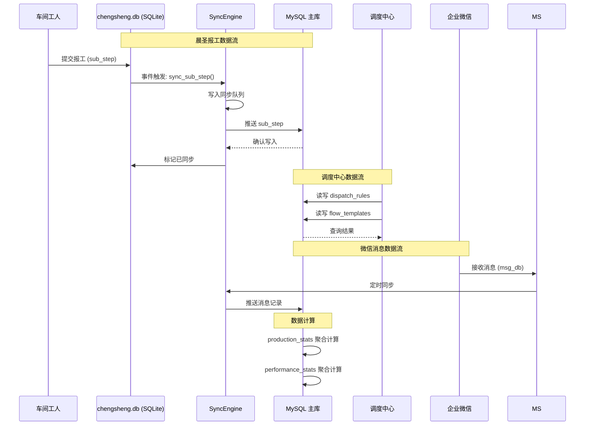
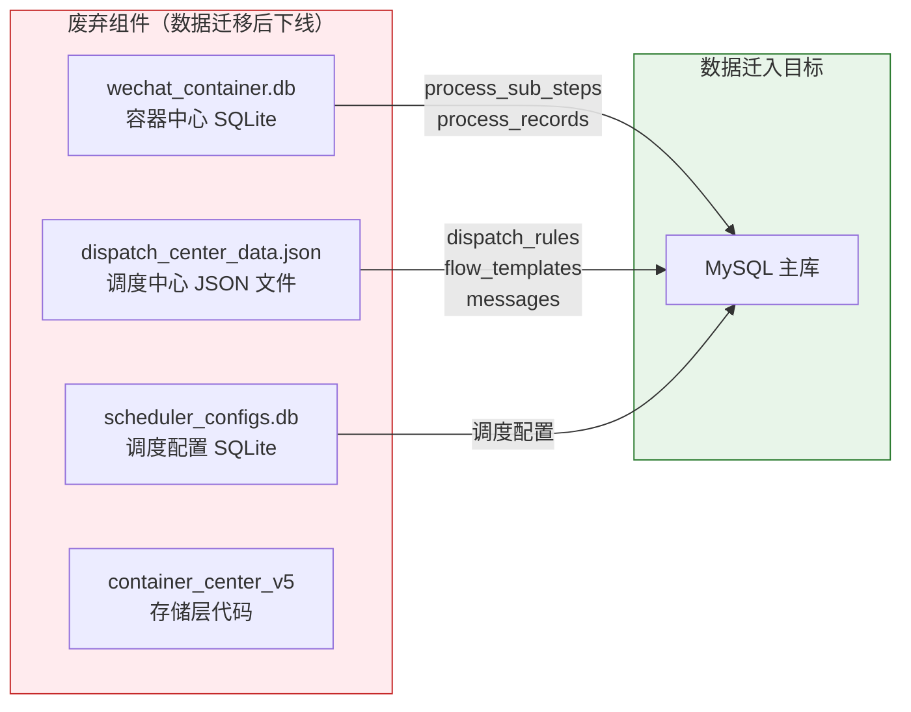
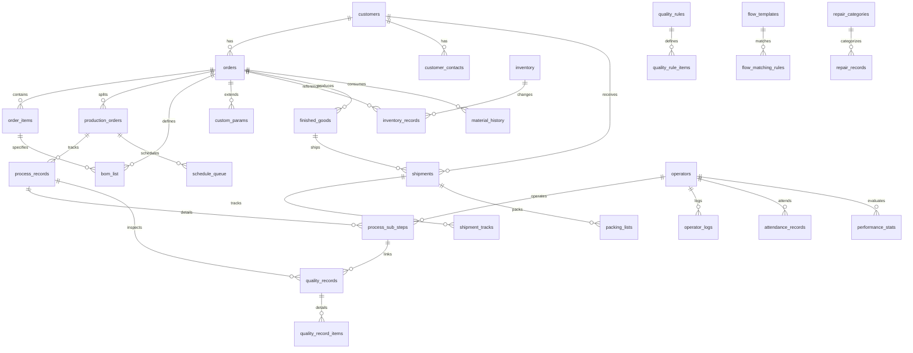
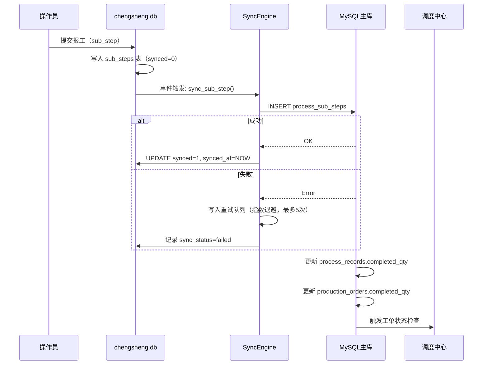

# DESIGN: 数据库架构优化 — 详细设计

## 1. 整体架构

### 1.1 目标架构图

```mermaid
graph TB
    subgraph MySQL["MySQL 主库 (steel_belt)"]
        CM[客户管理<br/>customers<br/>customer_contacts<br/>customer_groups]
        OM[订单管理<br/>orders, order_items<br/>bom_list, material_rules<br/>custom_params, order_templates<br/>order_logs]
        PM[生产管理<br/>production_orders<br/>processes, process_records<br/>process_sub_steps<br/>schedule_queue, production_stats<br/>process_calc_rules]
        IM[库存管理<br/>inventory, inventory_records<br/>material_history<br/>material_densities<br/>material_templates]
        QM[质量管理<br/>quality_records<br/>quality_record_items<br/>quality_rules<br/>quality_rule_items<br/>quality_templates]
        FM[完工管理<br/>finished_goods, shipments<br/>shipment_tracks, packing_lists]
        OPM[运营管理<br/>operators, operator_logs<br/>attendance_records<br/>performance_stats<br/>alert_records, status_logs, operation_logs]
        DM[调度分发<br/>dispatch_rules<br/>flow_templates<br/>flow_matching_rules<br/>sync_error_log]
        TMM[模板消息<br/>message_templates<br/>message_logs<br/>notification_queue]
        RM[报修管理<br/>repair_categories<br/>repair_records]
        FBM[反馈管理<br/>feedback_records]
        SCM[系统配置<br/>system_configs<br/>audit_logs]
    end

    subgraph SQLite["SQLite 本地缓存层"]
        CS[chengsheng.db<br/>报工离线缓存<br/>sub_steps 缓存<br/>workers 缓存]
        MS[msg_db/<br/>微信消息存储<br/>按月分库]
    end

    subgraph Sync["同步引擎 SyncEngine"]
        SE[统一同步调度器<br/>事件触发 + 定时补传<br/>指数退避重试<br/>同步状态追踪]
    end

    CS -->|单向同步| SE
    MS -->|定时同步| SE
    SE -->|写入| MySQL

    style MySQL fill:#e1f5fe,stroke:#01579b
    style SQLite fill:#fff3e0,stroke:#e65100
    style Sync fill:#e8f5e9,stroke:#2e7d32
```



### 1.2 数据流架构图



### 1.3 废弃组件



---

## 2. 详细表结构定义

### 2.1 约定

```
类型约定:
  MySQL: INT UNSIGNED AUTO_INCREMENT = INT UNSIGNED NOT NULL AUTO_INCREMENT
  MySQL: VARCHAR(n)                   = VARCHAR(n) NOT NULL
  MySQL: DATETIME                     = DATETIME DEFAULT CURRENT_TIMESTAMP
  SQLite: INTEGER PRIMARY KEY AUTOINCREMENT = INTEGER PRIMARY KEY AUTOINCREMENT NOT NULL
  SQLite: TEXT NOT NULL               = TEXT NOT NULL

审计字段（所有核心表必须包含）:

  8 字段全集（可修改的核心业务表）:
    created_at    DATETIME DEFAULT CURRENT_TIMESTAMP,
    updated_at    DATETIME DEFAULT CURRENT_TIMESTAMP ON UPDATE CURRENT_TIMESTAMP,
    created_by    VARCHAR(64) DEFAULT '',
    updated_by    VARCHAR(64) DEFAULT '',
    is_deleted    TINYINT(1) DEFAULT 0,
    deleted_at    DATETIME,
    deleted_by    VARCHAR(64) DEFAULT '',
    version       INT DEFAULT 1

  豁免分类（按表类型裁剪审计字段）— 覆盖全部 50 张表:

  【日志表】仅 required: created_at
    适用表：audit_logs, operator_logs, message_logs,
           inventory_records, material_history,
           shipment_tracks, attendance_records,
           status_logs, order_logs, operation_logs,
           alert_records                                    (共 11 张)

  【队列表】仅 required: created_at
    适用表：sync_error_log, notification_queue,
           schedule_queue                                   (共 3 张)

  【计算统计表】仅 required: created_at
    适用表：performance_stats, production_stats             (共 2 张)

  【引用/查找表】required: created_at, updated_at
    适用表：customer_groups, repair_categories,
           quality_templates, order_templates,
           material_rules, material_templates,
           material_densities, quality_rules,
           process_calc_rules, processes                    (共 10 张)

  【明细/子表】required: created_at, updated_at, is_deleted
    适用表：order_items, custom_params,
           packing_lists, bom_list,
           customer_contacts,
           quality_record_items, quality_rule_items         (共 7 张)

  【完整核心表】必须包含 8 字段全集
    适用表：customers, production_orders,
           orders, inventory,
           quality_records, finished_goods,
           shipments, feedback_records,
           dispatch_rules, flow_templates,
           flow_matching_rules, message_templates,
           repair_records, system_configs,
           process_sub_steps, process_records,
           operators                                        (共 17 张)

  字段全集定义：
    created_at    DATETIME DEFAULT CURRENT_TIMESTAMP,
    updated_at    DATETIME DEFAULT CURRENT_TIMESTAMP ON UPDATE CURRENT_TIMESTAMP,
    created_by    VARCHAR(64) DEFAULT '',
    updated_by    VARCHAR(64) DEFAULT '',
    is_deleted    TINYINT(1) DEFAULT 0,
    deleted_at    DATETIME,
    deleted_by    VARCHAR(64) DEFAULT '',
    version       INT DEFAULT 1

  合计：11 + 3 + 2 + 10 + 7 + 17 = 50 张 ✅

命名规范:
  ✅ snake_case: order_no, order_no, customer_id, delivery_date
  ✅ 状态值用英文枚举: 'pending', 'confirmed', 'in_production', 'completed'
  ✅ 布尔值用 TINYINT(1): is_deleted, is_active, is_urgent
```

---

### 2.2 客户管理 (3 表)

#### customers — 客户表

```sql
CREATE TABLE customers (
    id              INT UNSIGNED AUTO_INCREMENT PRIMARY KEY,
    customer_no     VARCHAR(32) NOT NULL UNIQUE,        -- 客户编号，如 CUST-202605001
    name            VARCHAR(128) NOT NULL,               -- 客户名称
    short_name      VARCHAR(64) DEFAULT '',              -- 客户简称
    customer_group  VARCHAR(64) DEFAULT '',              -- 客户分组
    contact_person  VARCHAR(64) DEFAULT '',              -- 联系人
    phone           VARCHAR(32) DEFAULT '',              -- 联系电话
    email           VARCHAR(128) DEFAULT '',             -- 邮箱
    address         VARCHAR(256) DEFAULT '',             -- 地址
    payment_method  VARCHAR(32) DEFAULT '',              -- 结算方式
    invoice_type    VARCHAR(32) DEFAULT '',              -- 发票类型
    credit_limit    DECIMAL(12,2) DEFAULT 0,             -- 信用额度
    status          VARCHAR(16) DEFAULT 'active',        -- active/inactive
    remark          TEXT,
    -- 审计字段
    created_at      DATETIME DEFAULT CURRENT_TIMESTAMP,
    updated_at      DATETIME DEFAULT CURRENT_TIMESTAMP ON UPDATE CURRENT_TIMESTAMP,
    created_by      VARCHAR(64) DEFAULT '',
    updated_by      VARCHAR(64) DEFAULT '',
    is_deleted      TINYINT(1) DEFAULT 0,
    deleted_at      DATETIME,
    deleted_by      VARCHAR(64) DEFAULT '',
    version         INT DEFAULT 1
);
CREATE INDEX idx_customers_group ON customers(customer_group);
CREATE INDEX idx_customers_status ON customers(status);
```

#### customer_contacts — 客户联系人表

```sql
CREATE TABLE customer_contacts (
    id              INT UNSIGNED AUTO_INCREMENT PRIMARY KEY,
    customer_id     INT UNSIGNED NOT NULL,
    name            VARCHAR(64) NOT NULL,
    position        VARCHAR(64) DEFAULT '',              -- 职位
    phone           VARCHAR(32) DEFAULT '',
    email           VARCHAR(128) DEFAULT '',
    is_primary      TINYINT(1) DEFAULT 0,                -- 是否主联系人
    remark          TEXT,
    created_at      DATETIME DEFAULT CURRENT_TIMESTAMP,
    updated_at      DATETIME DEFAULT CURRENT_TIMESTAMP ON UPDATE CURRENT_TIMESTAMP,
    created_by      VARCHAR(64) DEFAULT '',
    updated_by      VARCHAR(64) DEFAULT '',
    is_deleted      TINYINT(1) DEFAULT 0,
    deleted_at      DATETIME,
    deleted_by      VARCHAR(64) DEFAULT '',
    version         INT DEFAULT 1,
    FOREIGN KEY (customer_id) REFERENCES customers(id)
);
CREATE INDEX idx_contacts_customer ON customer_contacts(customer_id);
```

#### customer_groups — 客户分组表

```sql
CREATE TABLE customer_groups (
    id              INT UNSIGNED AUTO_INCREMENT PRIMARY KEY,
    group_name      VARCHAR(64) NOT NULL UNIQUE,         -- 分组名称
    group_desc      VARCHAR(256) DEFAULT '',
    sort_order      INT DEFAULT 0,
    created_at      DATETIME DEFAULT CURRENT_TIMESTAMP,
    updated_at      DATETIME DEFAULT CURRENT_TIMESTAMP ON UPDATE CURRENT_TIMESTAMP
);
```

---

### 2.3 订单管理 (7 表)

#### orders — 订单主表

```sql
CREATE TABLE orders (
    id              INT UNSIGNED AUTO_INCREMENT PRIMARY KEY,
    order_no        VARCHAR(32) NOT NULL UNIQUE,         -- 订单编号 ORD-YYYYMMDDXXXX
    customer_id     INT UNSIGNED,                        -- 客户ID（关联 customers）
    customer_name   VARCHAR(128) NOT NULL,               -- 客户名称（冗余，便于查询）
    salesperson     VARCHAR(64) DEFAULT '',               -- 业务员
    contact_person  VARCHAR(64) DEFAULT '',               -- 联系人
    contact_phone   VARCHAR(32) DEFAULT '',               -- 联系电话
    order_date      DATE NOT NULL,                        -- 下单日期
    delivery_date   DATE,                                 -- 交货日期
    priority_level  VARCHAR(16) DEFAULT 'normal',         -- normal/urgent/emergency
    status          VARCHAR(24) DEFAULT 'pending',        -- pending/confirmed/in_production/completed/cancelled
    total_qty       DECIMAL(12,2) DEFAULT 0,              -- 订单总数量
    total_amount    DECIMAL(12,2) DEFAULT 0,              -- 订单总金额
    order_source    VARCHAR(32) DEFAULT '',               -- 订单来源
    payment_method  VARCHAR(32) DEFAULT '',
    invoice_type    VARCHAR(32) DEFAULT '',
    invoice_status  VARCHAR(16) DEFAULT 'uninvoiced',
    invoice_no      VARCHAR(64) DEFAULT '',
    cancel_reason   TEXT,
    remark          TEXT,
    extra_data      TEXT,                                 -- 少量真正的扩展JSON数据
    -- 审计字段
    created_at      DATETIME DEFAULT CURRENT_TIMESTAMP,
    updated_at      DATETIME DEFAULT CURRENT_TIMESTAMP ON UPDATE CURRENT_TIMESTAMP,
    created_by      VARCHAR(64) DEFAULT '',
    updated_by      VARCHAR(64) DEFAULT '',
    is_deleted      TINYINT(1) DEFAULT 0,
    deleted_at      DATETIME,
    deleted_by      VARCHAR(64) DEFAULT '',
    version         INT DEFAULT 1,
    FOREIGN KEY (customer_id) REFERENCES customers(id)
);
CREATE INDEX idx_orders_customer ON orders(customer_id);
CREATE INDEX idx_orders_status ON orders(status);
CREATE INDEX idx_orders_date ON orders(order_date);
CREATE INDEX idx_orders_delivery ON orders(delivery_date);
CREATE INDEX idx_orders_priority ON orders(priority_level);
```

#### order_items — 订单明细表

```sql
CREATE TABLE order_items (
    id              INT UNSIGNED AUTO_INCREMENT PRIMARY KEY,
    order_id        INT UNSIGNED NOT NULL,
    item_no         INT DEFAULT 0,                       -- 行号
    product_name    VARCHAR(256) NOT NULL,                -- 产品名称
    material        VARCHAR(128) DEFAULT '',              -- 材料
    spec            VARCHAR(256) DEFAULT '',              -- 规格
    length          DECIMAL(10,2) DEFAULT 0,              -- 长度
    width           DECIMAL(10,2) DEFAULT 0,              -- 宽度
    unit            VARCHAR(16) DEFAULT '件',             -- 单位
    quantity        DECIMAL(12,2) NOT NULL,               -- 数量
    unit_price      DECIMAL(10,2) DEFAULT 0,              -- 单价
    amount          DECIMAL(12,2) DEFAULT 0,              -- 金额
    delivery_date   DATE,
    remark          TEXT,
    created_at      DATETIME DEFAULT CURRENT_TIMESTAMP,
    updated_at      DATETIME DEFAULT CURRENT_TIMESTAMP ON UPDATE CURRENT_TIMESTAMP,
    is_deleted      TINYINT(1) DEFAULT 0,
    FOREIGN KEY (order_id) REFERENCES orders(id)
);
CREATE INDEX idx_items_order ON order_items(order_id);
```

#### bom_list — BOM物料清单表

```sql
CREATE TABLE bom_list (
    id              INT UNSIGNED AUTO_INCREMENT PRIMARY KEY,
    order_id        INT UNSIGNED NOT NULL,
    item_id         INT UNSIGNED,                        -- 关联订单明细
    material_name   VARCHAR(128) NOT NULL,
    material_spec   VARCHAR(256) DEFAULT '',
    density         DECIMAL(10,4) DEFAULT 0,             -- 密度
    unit            VARCHAR(16) DEFAULT '',
    quantity        DECIMAL(12,4) NOT NULL,               -- 用量
    loss_rate       DECIMAL(5,2) DEFAULT 0,              -- 损耗率 %
    total_required  DECIMAL(12,4) DEFAULT 0,              -- 总需求量
    remark          TEXT,
    created_at      DATETIME DEFAULT CURRENT_TIMESTAMP,
    updated_at      DATETIME DEFAULT CURRENT_TIMESTAMP ON UPDATE CURRENT_TIMESTAMP,
    is_deleted      TINYINT(1) DEFAULT 0,
    FOREIGN KEY (order_id) REFERENCES orders(id),
    FOREIGN KEY (item_id) REFERENCES order_items(id)
);
CREATE INDEX idx_bom_order ON bom_list(order_id);
```

#### material_rules — 物料规则表

```sql
CREATE TABLE material_rules (
    id              INT UNSIGNED AUTO_INCREMENT PRIMARY KEY,
    rule_name       VARCHAR(128) NOT NULL,
    product_type    VARCHAR(64) DEFAULT '',               -- 产品类型
    material_type   VARCHAR(64) DEFAULT '',               -- 物料类型
    density         DECIMAL(10,4) DEFAULT 0,
    formula         TEXT,                                 -- 计算公式
    params          TEXT,                                 -- 参数JSON
    remark          TEXT,
    created_at      DATETIME DEFAULT CURRENT_TIMESTAMP,
    updated_at      DATETIME DEFAULT CURRENT_TIMESTAMP ON UPDATE CURRENT_TIMESTAMP,
    is_deleted      TINYINT(1) DEFAULT 0,
    version         INT DEFAULT 1
);
```

#### custom_params — 自定义参数表 (替代 extra_params.custom_params)

```sql
CREATE TABLE custom_params (
    id              INT UNSIGNED AUTO_INCREMENT PRIMARY KEY,
    order_id        INT UNSIGNED NOT NULL,
    param_name      VARCHAR(64) NOT NULL,                 -- 参数名
    param_value     VARCHAR(256) DEFAULT '',              -- 参数值
    param_type      VARCHAR(32) DEFAULT 'text',           -- text/number/select
    sort_order      INT DEFAULT 0,
    remark          TEXT,
    created_at      DATETIME DEFAULT CURRENT_TIMESTAMP,
    updated_at      DATETIME DEFAULT CURRENT_TIMESTAMP ON UPDATE CURRENT_TIMESTAMP,
    is_deleted      TINYINT(1) DEFAULT 0,
    FOREIGN KEY (order_id) REFERENCES orders(id)
);
CREATE INDEX idx_custom_params_order ON custom_params(order_id);
```

#### order_templates — 订单模板表

```sql
CREATE TABLE order_templates (
    id              INT UNSIGNED AUTO_INCREMENT PRIMARY KEY,
    template_name   VARCHAR(128) NOT NULL,
    template_type   VARCHAR(32) DEFAULT '',               -- 模板类型
    product_type    VARCHAR(64) DEFAULT '',
    material        VARCHAR(128) DEFAULT '',
    spec            VARCHAR(256) DEFAULT '',
    params          TEXT,                                 -- 默认参数JSON
    is_active       TINYINT(1) DEFAULT 1,
    created_at      DATETIME DEFAULT CURRENT_TIMESTAMP,
    updated_at      DATETIME DEFAULT CURRENT_TIMESTAMP ON UPDATE CURRENT_TIMESTAMP,
    created_by      VARCHAR(64) DEFAULT '',
    updated_by      VARCHAR(64) DEFAULT '',
    is_deleted      TINYINT(1) DEFAULT 0
);
```

---

#### order_logs — 订单日志表

```sql
CREATE TABLE order_logs (
    id              INT UNSIGNED AUTO_INCREMENT PRIMARY KEY,
    order_id        INT UNSIGNED NOT NULL,
    action_type     VARCHAR(32) NOT NULL,                 -- create/update/delete/status_change
    field_name      VARCHAR(64) DEFAULT '',               -- 变更字段名
    old_value       TEXT,
    new_value       TEXT,
    operator        VARCHAR(64) DEFAULT '',
    remark          TEXT,
    created_at      DATETIME DEFAULT CURRENT_TIMESTAMP,
    FOREIGN KEY (order_id) REFERENCES orders(id)
);
CREATE INDEX idx_ol_order ON order_logs(order_id, created_at);
CREATE INDEX idx_ol_action ON order_logs(action_type);
```

---

### 2.4 生产管理 (7 表)

#### production_orders — 生产工单表

```sql
CREATE TABLE production_orders (
    id              INT UNSIGNED AUTO_INCREMENT PRIMARY KEY,
    order_no   VARCHAR(32) NOT NULL UNIQUE,          -- 工单编号 WO-YYYYMMNNN
    order_id        INT UNSIGNED NOT NULL,                -- 关联订单
    item_id         INT UNSIGNED,                         -- 关联订单明细
    product_name    VARCHAR(256) NOT NULL,
    material        VARCHAR(128) DEFAULT '',
    spec            VARCHAR(256) DEFAULT '',
    quantity        DECIMAL(12,2) NOT NULL,               -- 计画数量
    completed_qty   DECIMAL(12,2) DEFAULT 0,              -- 完成数量
    unit            VARCHAR(16) DEFAULT '件',
    priority        VARCHAR(16) DEFAULT 'normal',         -- normal/urgent/emergency
    status          VARCHAR(24) DEFAULT 'pending',        -- pending/in_production/completed/paused/cancelled
    plan_start      DATETIME,                             -- 计画开始
    plan_end        DATETIME,                             -- 计画结束
    actual_start    DATETIME,                             -- 实际开始
    actual_end      DATETIME,                             -- 实际结束
    assigned_to     VARCHAR(64) DEFAULT '',               -- 指派给
    process_flow    TEXT,                                 -- 工序流程 JSON
    current_step    INT DEFAULT 0,                        -- 当前工序步骤
    remark          TEXT,
    -- 审计字段
    created_at      DATETIME DEFAULT CURRENT_TIMESTAMP,
    updated_at      DATETIME DEFAULT CURRENT_TIMESTAMP ON UPDATE CURRENT_TIMESTAMP,
    created_by      VARCHAR(64) DEFAULT '',
    updated_by      VARCHAR(64) DEFAULT '',
    is_deleted      TINYINT(1) DEFAULT 0,
    deleted_at      DATETIME,
    deleted_by      VARCHAR(64) DEFAULT '',
    version         INT DEFAULT 1,
    FOREIGN KEY (order_id) REFERENCES orders(id)
);
CREATE INDEX idx_po_order ON production_orders(order_id);
CREATE INDEX idx_po_status ON production_orders(status);
CREATE INDEX idx_po_priority ON production_orders(priority);
CREATE INDEX idx_po_plan_start ON production_orders(plan_start);
```

#### processes — 工序定义表

```sql
CREATE TABLE processes (
    id              INT UNSIGNED AUTO_INCREMENT PRIMARY KEY,
    process_name    VARCHAR(64) NOT NULL,                 -- 工序名称
    process_key     VARCHAR(32) NOT NULL UNIQUE,          -- 工序标识符，如 cutting, weaving
    sort_order      INT DEFAULT 0,                        -- 排序
    process_type    VARCHAR(32) DEFAULT 'production',     -- production/quality/material
    description     VARCHAR(256) DEFAULT '',
    is_active       TINYINT(1) DEFAULT 1,
    created_at      DATETIME DEFAULT CURRENT_TIMESTAMP,
    updated_at      DATETIME DEFAULT CURRENT_TIMESTAMP ON UPDATE CURRENT_TIMESTAMP
);
```

#### process_records — 工序记录表

```sql
CREATE TABLE process_records (
    id              INT UNSIGNED AUTO_INCREMENT PRIMARY KEY,
    order_no   VARCHAR(32) NOT NULL,                 -- 工单号
    order_no        VARCHAR(32) NOT NULL,                 -- 订单号
    order_id        INT UNSIGNED,                         -- 订单ID
    product_name    VARCHAR(256) DEFAULT '',
    process_name    VARCHAR(64) NOT NULL,                 -- 工序名称
    process_seq     INT DEFAULT 0,                        -- 工序序号
    planned_qty     DECIMAL(12,2) DEFAULT 0,              -- 计画数量
    completed_qty   DECIMAL(12,2) DEFAULT 0,              -- 完成数量
    qualified_qty   DECIMAL(12,2) DEFAULT 0,              -- 合格数量
    scrap_qty       DECIMAL(12,2) DEFAULT 0,              -- 报废数量
    rework_qty      DECIMAL(12,2) DEFAULT 0,              -- 返工数量
    unit            VARCHAR(16) DEFAULT '件',
    status          VARCHAR(24) DEFAULT 'pending',        -- pending/in_progress/completed/rejected/skipped
    worker          VARCHAR(64) DEFAULT '',               -- 操作人
    work_hours      DECIMAL(6,2) DEFAULT 0,               -- 工时
    machine_no      VARCHAR(64) DEFAULT '',               -- 机台编号
    batch_no        VARCHAR(64) DEFAULT '',               -- 批次号
    shift           VARCHAR(16) DEFAULT '',               -- 班次
    standard_minutes DECIMAL(6,2) DEFAULT 0,              -- 标准工时(分钟)
    efficiency      DECIMAL(5,2) DEFAULT 0,               -- 效率 %
    planned_start   DATETIME,
    planned_end     DATETIME,
    actual_start    DATETIME,
    actual_end      DATETIME,
    actual_pause_minutes INT DEFAULT 0,                   -- 实际暂停分钟数
    pause_count     INT DEFAULT 0,                        -- 暂停次数
    remark          TEXT,
    record_date     DATE,                                 -- 记录日期
    -- 审计字段
    created_at      DATETIME DEFAULT CURRENT_TIMESTAMP,
    updated_at      DATETIME DEFAULT CURRENT_TIMESTAMP ON UPDATE CURRENT_TIMESTAMP,
    created_by      VARCHAR(64) DEFAULT '',
    updated_by      VARCHAR(64) DEFAULT '',
    is_deleted      TINYINT(1) DEFAULT 0,
    deleted_at      DATETIME,
    deleted_by      VARCHAR(64) DEFAULT '',
    version         INT DEFAULT 1
);
CREATE INDEX idx_pr_work_order ON process_records(order_no);
CREATE INDEX idx_pr_order_no ON process_records(order_no);
CREATE INDEX idx_pr_status ON process_records(status);
CREATE INDEX idx_pr_record_date ON process_records(record_date);
CREATE INDEX idx_pr_worker ON process_records(worker);
```

#### process_sub_steps — 工序子步骤表（报工明细）

```sql
CREATE TABLE process_sub_steps (
    id              INT UNSIGNED AUTO_INCREMENT PRIMARY KEY,
    uuid            VARCHAR(36) NOT NULL UNIQUE,          -- 全局UUID，用于同步去重
    process_id      INT UNSIGNED NOT NULL,                -- 关联 process_records.id
    process_record_id INT UNSIGNED,                       -- 关联 process_records（冗余）
    order_no        VARCHAR(32) NOT NULL,
    order_no   VARCHAR(32) DEFAULT '',
    step_name       VARCHAR(64) NOT NULL,                 -- 步骤名称
    batch_no        VARCHAR(64) NOT NULL,                 -- 批次号
    quantity        DECIMAL(12,2) NOT NULL DEFAULT 0,     -- 数量
    qualified_qty   DECIMAL(12,2) DEFAULT 0,              -- 合格数量
    operator        VARCHAR(64) DEFAULT '',               -- 操作员
    operator_id     INT UNSIGNED,                         -- 关联 operators.id
    equipment_name  VARCHAR(128) DEFAULT '',              -- 设备名称
    remark          TEXT,
    record_date     DATE,                                 -- 报工日期
    source          VARCHAR(32) DEFAULT 'chengsheng',     -- 来源系统
    synced          TINYINT(1) DEFAULT 0,                 -- 是否已同步
    synced_at       DATETIME,
    -- 审计字段
    created_at      DATETIME DEFAULT CURRENT_TIMESTAMP,
    updated_at      DATETIME DEFAULT CURRENT_TIMESTAMP ON UPDATE CURRENT_TIMESTAMP,
    created_by      VARCHAR(64) DEFAULT '',
    updated_by      VARCHAR(64) DEFAULT '',
    is_deleted      TINYINT(1) DEFAULT 0,
    deleted_at      DATETIME,
    deleted_by      VARCHAR(64) DEFAULT '',
    version         INT DEFAULT 1,
    FOREIGN KEY (process_id) REFERENCES process_records(id)
);
CREATE INDEX idx_pss_process ON process_sub_steps(process_id);
CREATE INDEX idx_pss_order_no ON process_sub_steps(order_no);
CREATE INDEX idx_pss_work_order ON process_sub_steps(order_no);
CREATE INDEX idx_pss_operator ON process_sub_steps(operator);
CREATE INDEX idx_pss_record_date ON process_sub_steps(record_date);
CREATE INDEX idx_pss_synced ON process_sub_steps(synced);
CREATE UNIQUE INDEX idx_pss_uuid ON process_sub_steps(uuid);
```

#### schedule_queue — 排产队列表

```sql
CREATE TABLE schedule_queue (
    id              INT UNSIGNED AUTO_INCREMENT PRIMARY KEY,
    order_no   VARCHAR(32) NOT NULL,
    order_id        INT UNSIGNED NOT NULL,
    priority        INT DEFAULT 0,                        -- 优先级（数值越小越优先）
    plan_start      DATETIME,
    plan_end        DATETIME,
    status          VARCHAR(16) DEFAULT 'queued',         -- queued/scheduled/in_production/completed
    machine_no      VARCHAR(64) DEFAULT '',
    assigned_to     VARCHAR(64) DEFAULT '',
    remark          TEXT,
    created_at      DATETIME DEFAULT CURRENT_TIMESTAMP,
    updated_at      DATETIME DEFAULT CURRENT_TIMESTAMP ON UPDATE CURRENT_TIMESTAMP,
    FOREIGN KEY (order_id) REFERENCES orders(id)
);
CREATE INDEX idx_sq_status ON schedule_queue(status);
CREATE INDEX idx_sq_priority ON schedule_queue(priority, plan_start);
```

#### production_stats — 生产统计表

```sql
CREATE TABLE production_stats (
    id              INT UNSIGNED AUTO_INCREMENT PRIMARY KEY,
    stat_date       DATE NOT NULL,                        -- 统计日期
    stat_type       VARCHAR(32) NOT NULL,                 -- daily/monthly/quarterly
    order_id        INT UNSIGNED,
    order_no   VARCHAR(32) DEFAULT '',
    product_name    VARCHAR(256) DEFAULT '',
    planned_qty     DECIMAL(12,2) DEFAULT 0,
    completed_qty   DECIMAL(12,2) DEFAULT 0,
    qualified_qty   DECIMAL(12,2) DEFAULT 0,
    scrap_qty       DECIMAL(12,2) DEFAULT 0,
    rework_qty      DECIMAL(12,2) DEFAULT 0,
    total_hours     DECIMAL(8,2) DEFAULT 0,
    efficiency      DECIMAL(5,2) DEFAULT 0,
    worker_count    INT DEFAULT 0,
    created_at      DATETIME DEFAULT CURRENT_TIMESTAMP,
    UNIQUE KEY uk_stats (stat_date, stat_type, order_id)
);
CREATE INDEX idx_ps_date ON production_stats(stat_date, stat_type);
```

#### process_calc_rules — 工序计算规则表

```sql
CREATE TABLE process_calc_rules (
    id              INT UNSIGNED AUTO_INCREMENT PRIMARY KEY,
    rule_name       VARCHAR(128) NOT NULL,
    process_key     VARCHAR(32) NOT NULL,
    formula         TEXT NOT NULL,
    params          TEXT,
    description     VARCHAR(256) DEFAULT '',
    is_active       TINYINT(1) DEFAULT 1,
    created_at      DATETIME DEFAULT CURRENT_TIMESTAMP,
    updated_at      DATETIME DEFAULT CURRENT_TIMESTAMP ON UPDATE CURRENT_TIMESTAMP
);
```

---

### 2.5 库存管理 (5 表)

#### inventory — 库存表

```sql
CREATE TABLE inventory (
    id              INT UNSIGNED AUTO_INCREMENT PRIMARY KEY,
    material_name   VARCHAR(128) NOT NULL,
    material_spec   VARCHAR(256) DEFAULT '',
    material_type   VARCHAR(64) DEFAULT '',
    unit            VARCHAR(16) DEFAULT '',
    quantity        DECIMAL(12,4) DEFAULT 0,              -- 当前库存
    min_quantity    DECIMAL(12,4) DEFAULT 0,              -- 最低库存预警
    max_quantity    DECIMAL(12,4) DEFAULT 0,              -- 最高库存
    location        VARCHAR(128) DEFAULT '',              -- 库位
    batch_no        VARCHAR(64) DEFAULT '',               -- 批次号
    supplier        VARCHAR(128) DEFAULT '',
    status          VARCHAR(16) DEFAULT 'normal',         -- normal/low_stock/overstock
    remark          TEXT,
    created_at      DATETIME DEFAULT CURRENT_TIMESTAMP,
    updated_at      DATETIME DEFAULT CURRENT_TIMESTAMP ON UPDATE CURRENT_TIMESTAMP,
    created_by      VARCHAR(64) DEFAULT '',
    updated_by      VARCHAR(64) DEFAULT '',
    is_deleted      TINYINT(1) DEFAULT 0,
    deleted_at      DATETIME,
    deleted_by      VARCHAR(64) DEFAULT '',
    version         INT DEFAULT 1
);
CREATE INDEX idx_inv_material ON inventory(material_name, material_spec);
CREATE INDEX idx_inv_status ON inventory(status);
CREATE INDEX idx_inv_batch ON inventory(batch_no);
```

#### inventory_records — 库存变动记录表

```sql
CREATE TABLE inventory_records (
    id              INT UNSIGNED AUTO_INCREMENT PRIMARY KEY,
    inventory_id    INT UNSIGNED NOT NULL,
    change_type     VARCHAR(16) NOT NULL,                 -- in/out/adjust
    quantity        DECIMAL(12,4) NOT NULL,               -- 变动数量（正数入库，负数出库）
    before_qty      DECIMAL(12,4) DEFAULT 0,
    after_qty       DECIMAL(12,4) DEFAULT 0,
    reference_type  VARCHAR(32) DEFAULT '',               -- order/production/return
    reference_no    VARCHAR(64) DEFAULT '',               -- 关联单号
    operator        VARCHAR(64) DEFAULT '',
    remark          TEXT,
    created_at      DATETIME DEFAULT CURRENT_TIMESTAMP,
    created_by      VARCHAR(64) DEFAULT '',
    FOREIGN KEY (inventory_id) REFERENCES inventory(id)
);
CREATE INDEX idx_ir_inventory ON inventory_records(inventory_id);
CREATE INDEX idx_ir_created ON inventory_records(created_at);
CREATE INDEX idx_ir_ref ON inventory_records(reference_type, reference_no);
```

#### material_history — 物料使用历史表

```sql
CREATE TABLE material_history (
    id              INT UNSIGNED AUTO_INCREMENT PRIMARY KEY,
    order_id        INT UNSIGNED NOT NULL,
    order_no   VARCHAR(32) DEFAULT '',
    material_name   VARCHAR(128) NOT NULL,
    batch_no        VARCHAR(64) DEFAULT '',
    quantity        DECIMAL(12,4) NOT NULL,
    unit            VARCHAR(16) DEFAULT '',
    usage_type      VARCHAR(16) DEFAULT 'consume',        -- consume/return/scrap
    operator        VARCHAR(64) DEFAULT '',
    remark          TEXT,
    created_at      DATETIME DEFAULT CURRENT_TIMESTAMP,
    FOREIGN KEY (order_id) REFERENCES orders(id)
);
CREATE INDEX idx_mh_order ON material_history(order_id);
CREATE INDEX idx_mh_material ON material_history(material_name);
```

#### material_densities — 物料密度表

```sql
CREATE TABLE material_densities (
    id              INT UNSIGNED AUTO_INCREMENT PRIMARY KEY,
    material_name   VARCHAR(128) NOT NULL,
    density         DECIMAL(10,4) NOT NULL,
    unit            VARCHAR(16) DEFAULT 'g/cm3',
    is_active       TINYINT(1) DEFAULT 1,
    created_at      DATETIME DEFAULT CURRENT_TIMESTAMP,
    updated_at      DATETIME DEFAULT CURRENT_TIMESTAMP ON UPDATE CURRENT_TIMESTAMP
);
CREATE UNIQUE INDEX idx_md_material ON material_densities(material_name);
```

#### material_templates — 物料模板表

```sql
CREATE TABLE material_templates (
    id              INT UNSIGNED AUTO_INCREMENT PRIMARY KEY,
    template_name   VARCHAR(128) NOT NULL,
    material_name   VARCHAR(128) NOT NULL,
    spec            VARCHAR(256) DEFAULT '',
    density         DECIMAL(10,4) DEFAULT 0,
    unit            VARCHAR(16) DEFAULT '',
    params          TEXT,
    is_active       TINYINT(1) DEFAULT 1,
    created_at      DATETIME DEFAULT CURRENT_TIMESTAMP,
    updated_at      DATETIME DEFAULT CURRENT_TIMESTAMP ON UPDATE CURRENT_TIMESTAMP,
    is_deleted      TINYINT(1) DEFAULT 0
);
```

---

### 2.6 质量管理 (5 表)

#### quality_records — 质检记录主表

```sql
CREATE TABLE quality_records (
    id              INT UNSIGNED AUTO_INCREMENT PRIMARY KEY,
    order_no        VARCHAR(32) NOT NULL,
    order_no   VARCHAR(32) DEFAULT '',
    sub_step_id     INT UNSIGNED,                        -- 关联报工子步骤
    product_name    VARCHAR(256) DEFAULT '',
    inspection_type VARCHAR(32) NOT NULL,                 -- incoming/process/final/outgoing
    result          VARCHAR(16) DEFAULT 'pending',        -- pending/pass/fail/conditional_pass
    inspector       VARCHAR(64) DEFAULT '',
    inspection_date DATETIME,
    defect_qty      DECIMAL(12,2) DEFAULT 0,
    total_qty       DECIMAL(12,2) DEFAULT 0,
    defect_rate     DECIMAL(5,2) DEFAULT 0,               -- 缺陷率 %
    handling_method VARCHAR(64) DEFAULT '',               -- rework/scrap/return/use_as_is
    remark          TEXT,
    created_at      DATETIME DEFAULT CURRENT_TIMESTAMP,
    updated_at      DATETIME DEFAULT CURRENT_TIMESTAMP ON UPDATE CURRENT_TIMESTAMP,
    created_by      VARCHAR(64) DEFAULT '',
    updated_by      VARCHAR(64) DEFAULT '',
    is_deleted      TINYINT(1) DEFAULT 0,
    deleted_at      DATETIME,
    deleted_by      VARCHAR(64) DEFAULT '',
    version         INT DEFAULT 1,
    FOREIGN KEY (sub_step_id) REFERENCES process_sub_steps(id)
);
CREATE INDEX idx_qr_order ON quality_records(order_no);
CREATE INDEX idx_qr_work_order ON quality_records(order_no);
CREATE INDEX idx_qr_result ON quality_records(result);
CREATE INDEX idx_qr_inspection_date ON quality_records(inspection_date);
```

#### quality_record_items — 质检明细表

```sql
CREATE TABLE quality_record_items (
    id              INT UNSIGNED AUTO_INCREMENT PRIMARY KEY,
    quality_id      INT UNSIGNED NOT NULL,
    item_name       VARCHAR(128) NOT NULL,                -- 检验项目
    standard_value  VARCHAR(128) DEFAULT '',              -- 标准值
    actual_value    VARCHAR(128) DEFAULT '',              -- 实测值
    deviation       DECIMAL(10,4) DEFAULT 0,              -- 偏差
    result          VARCHAR(16) DEFAULT 'pending',        -- pass/fail/na
    remark          TEXT,
    created_at      DATETIME DEFAULT CURRENT_TIMESTAMP,
    updated_at      DATETIME DEFAULT CURRENT_TIMESTAMP ON UPDATE CURRENT_TIMESTAMP,
    is_deleted      TINYINT(1) DEFAULT 0,
    FOREIGN KEY (quality_id) REFERENCES quality_records(id)
);
CREATE INDEX idx_qri_quality ON quality_record_items(quality_id);
```

#### quality_rules — 质检规则表

```sql
CREATE TABLE quality_rules (
    id              INT UNSIGNED AUTO_INCREMENT PRIMARY KEY,
    rule_name       VARCHAR(128) NOT NULL,
    product_type    VARCHAR(64) DEFAULT '',
    process_key     VARCHAR(32) DEFAULT '',
    inspection_type VARCHAR(32) NOT NULL,
    is_active       TINYINT(1) DEFAULT 1,
    created_at      DATETIME DEFAULT CURRENT_TIMESTAMP,
    updated_at      DATETIME DEFAULT CURRENT_TIMESTAMP ON UPDATE CURRENT_TIMESTAMP
);
```

#### quality_rule_items — 质检规则明细表

```sql
CREATE TABLE quality_rule_items (
    id              INT UNSIGNED AUTO_INCREMENT PRIMARY KEY,
    rule_id         INT UNSIGNED NOT NULL,
    item_name       VARCHAR(128) NOT NULL,
    standard_value  VARCHAR(128) DEFAULT '',
    upper_limit     VARCHAR(64) DEFAULT '',
    lower_limit     VARCHAR(64) DEFAULT '',
    unit            VARCHAR(32) DEFAULT '',
    sort_order      INT DEFAULT 0,
    created_at      DATETIME DEFAULT CURRENT_TIMESTAMP,
    updated_at      DATETIME DEFAULT CURRENT_TIMESTAMP ON UPDATE CURRENT_TIMESTAMP,
    is_deleted      TINYINT(1) DEFAULT 0,
    FOREIGN KEY (rule_id) REFERENCES quality_rules(id)
);
CREATE INDEX idx_qri_rule ON quality_rule_items(rule_id);
```

#### quality_templates — 质检模板表

```sql
CREATE TABLE quality_templates (
    id              INT UNSIGNED AUTO_INCREMENT PRIMARY KEY,
    template_name   VARCHAR(128) NOT NULL,
    product_type    VARCHAR(64) DEFAULT '',
    inspection_type VARCHAR(32) NOT NULL,
    items           TEXT,                                 -- 检验项目JSON
    is_active       TINYINT(1) DEFAULT 1,
    created_at      DATETIME DEFAULT CURRENT_TIMESTAMP,
    updated_at      DATETIME DEFAULT CURRENT_TIMESTAMP ON UPDATE CURRENT_TIMESTAMP
);
```

---

### 2.7 完工管理 (4 表)

#### finished_goods — 成品入库表

```sql
CREATE TABLE finished_goods (
    id              INT UNSIGNED AUTO_INCREMENT PRIMARY KEY,
    order_id        INT UNSIGNED NOT NULL,
    order_no   VARCHAR(32) DEFAULT '',
    product_name    VARCHAR(256) NOT NULL,
    spec            VARCHAR(256) DEFAULT '',
    quantity        DECIMAL(12,2) NOT NULL,
    unit            VARCHAR(16) DEFAULT '件',
    batch_no        VARCHAR(64) DEFAULT '',
    warehouse_location VARCHAR(128) DEFAULT '',
    status          VARCHAR(16) DEFAULT 'stored',         -- stored/shipped
    remark          TEXT,
    created_at      DATETIME DEFAULT CURRENT_TIMESTAMP,
    updated_at      DATETIME DEFAULT CURRENT_TIMESTAMP ON UPDATE CURRENT_TIMESTAMP,
    created_by      VARCHAR(64) DEFAULT '',
    updated_by      VARCHAR(64) DEFAULT '',
    is_deleted      TINYINT(1) DEFAULT 0,
    deleted_at      DATETIME,
    deleted_by      VARCHAR(64) DEFAULT '',
    version         INT DEFAULT 1,
    FOREIGN KEY (order_id) REFERENCES orders(id)
);
CREATE INDEX idx_fg_order ON finished_goods(order_id);
CREATE INDEX idx_fg_status ON finished_goods(status);
```

#### shipments — 发货单表

```sql
CREATE TABLE shipments (
    id              INT UNSIGNED AUTO_INCREMENT PRIMARY KEY,
    shipment_no     VARCHAR(32) NOT NULL UNIQUE,          -- 发货单号 SHP-YYYYMMDDXXXX
    order_id        INT UNSIGNED NOT NULL,
    customer_id     INT UNSIGNED,
    ship_date       DATE NOT NULL,
    total_qty       DECIMAL(12,2) NOT NULL,
    total_amount    DECIMAL(12,2) DEFAULT 0,
    carrier         VARCHAR(64) DEFAULT '',               -- 承运方
    tracking_no     VARCHAR(128) DEFAULT '',              -- 物流单号
    consignee       VARCHAR(128) DEFAULT '',              -- 收货人
    consignee_phone VARCHAR(32) DEFAULT '',
    consignee_addr  VARCHAR(256) DEFAULT '',
    status          VARCHAR(16) DEFAULT 'pending',        -- pending/shipped/delivered/returned
    remark          TEXT,
    created_at      DATETIME DEFAULT CURRENT_TIMESTAMP,
    updated_at      DATETIME DEFAULT CURRENT_TIMESTAMP ON UPDATE CURRENT_TIMESTAMP,
    created_by      VARCHAR(64) DEFAULT '',
    updated_by      VARCHAR(64) DEFAULT '',
    is_deleted      TINYINT(1) DEFAULT 0,
    deleted_at      DATETIME,
    deleted_by      VARCHAR(64) DEFAULT '',
    version         INT DEFAULT 1,
    FOREIGN KEY (order_id) REFERENCES orders(id),
    FOREIGN KEY (customer_id) REFERENCES customers(id)
);
CREATE INDEX idx_shp_order ON shipments(order_id);
CREATE INDEX idx_shp_date ON shipments(ship_date);
CREATE INDEX idx_shp_status ON shipments(status);
```

#### shipment_tracks — 物流跟踪表

```sql
CREATE TABLE shipment_tracks (
    id              INT UNSIGNED AUTO_INCREMENT PRIMARY KEY,
    shipment_id     INT UNSIGNED NOT NULL,
    track_time      DATETIME NOT NULL,
    location        VARCHAR(128) DEFAULT '',
    status_desc     VARCHAR(256) DEFAULT '',
    operator        VARCHAR(64) DEFAULT '',
    created_at      DATETIME DEFAULT CURRENT_TIMESTAMP,
    FOREIGN KEY (shipment_id) REFERENCES shipments(id)
);
CREATE INDEX idx_st_shipment ON shipment_tracks(shipment_id);
```

#### packing_lists — 装箱清单表

```sql
CREATE TABLE packing_lists (
    id              INT UNSIGNED AUTO_INCREMENT PRIMARY KEY,
    shipment_id     INT UNSIGNED NOT NULL,
    finished_goods_id INT UNSIGNED,
    product_name    VARCHAR(256) NOT NULL,
    quantity        DECIMAL(12,2) NOT NULL,
    package_qty     INT DEFAULT 1,                        -- 件数
    package_type    VARCHAR(32) DEFAULT '',               -- 包装类型
    net_weight      DECIMAL(10,2) DEFAULT 0,
    gross_weight    DECIMAL(10,2) DEFAULT 0,
    remark          TEXT,
    created_at      DATETIME DEFAULT CURRENT_TIMESTAMP,
    updated_at      DATETIME DEFAULT CURRENT_TIMESTAMP ON UPDATE CURRENT_TIMESTAMP,
    is_deleted      TINYINT(1) DEFAULT 0,
    FOREIGN KEY (shipment_id) REFERENCES shipments(id)
);
```

---

### 2.8 运营管理 (8 表)

#### operators — 操作员表

```sql
CREATE TABLE operators (
    id              INT UNSIGNED AUTO_INCREMENT PRIMARY KEY,
    username        VARCHAR(64) NOT NULL UNIQUE,
    name            VARCHAR(64) NOT NULL,                  -- 姓名
    role            VARCHAR(32) DEFAULT 'worker',          -- admin/supervisor/worker
    phone           VARCHAR(32) DEFAULT '',
    wechat_userid   VARCHAR(64) DEFAULT '',               -- 企业微信ID
    is_active       TINYINT(1) DEFAULT 1,
    skill_tags      VARCHAR(256) DEFAULT '',              -- 技能标签
    created_at      DATETIME DEFAULT CURRENT_TIMESTAMP,
    updated_at      DATETIME DEFAULT CURRENT_TIMESTAMP ON UPDATE CURRENT_TIMESTAMP,
    created_by      VARCHAR(64) DEFAULT '',
    updated_by      VARCHAR(64) DEFAULT '',
    is_deleted      TINYINT(1) DEFAULT 0,
    deleted_at      DATETIME,
    deleted_by      VARCHAR(64) DEFAULT '',
    version         INT DEFAULT 1
);
CREATE INDEX idx_op_role ON operators(role);
CREATE INDEX idx_op_wechat ON operators(wechat_userid);
```

#### operator_logs — 操作员日志表

```sql
CREATE TABLE operator_logs (
    id              INT UNSIGNED AUTO_INCREMENT PRIMARY KEY,
    operator_id     INT UNSIGNED NOT NULL,
    action_type     VARCHAR(32) NOT NULL,                 -- login/logout/report/assign
    target_type     VARCHAR(32) DEFAULT '',               -- order/production/process
    target_id       VARCHAR(64) DEFAULT '',
    detail          TEXT,
    ip_address      VARCHAR(64) DEFAULT '',
    created_at      DATETIME DEFAULT CURRENT_TIMESTAMP,
    FOREIGN KEY (operator_id) REFERENCES operators(id)
);
CREATE INDEX idx_ol_operator ON operator_logs(operator_id, created_at);
CREATE INDEX idx_ol_action ON operator_logs(action_type);
```

#### attendance_records — 考勤记录表

```sql
CREATE TABLE attendance_records (
    id              INT UNSIGNED AUTO_INCREMENT PRIMARY KEY,
    operator_id     INT UNSIGNED NOT NULL,
    work_date       DATE NOT NULL,
    check_in        DATETIME,
    check_out       DATETIME,
    work_hours      DECIMAL(4,2) DEFAULT 0,
    status          VARCHAR(16) DEFAULT 'present',        -- present/absent/late/early_leave
    remark          TEXT,
    created_at      DATETIME DEFAULT CURRENT_TIMESTAMP,
    FOREIGN KEY (operator_id) REFERENCES operators(id),
    UNIQUE KEY uk_attendance (operator_id, work_date)
);
CREATE INDEX idx_att_date ON attendance_records(work_date);
```

#### performance_stats — 绩效统计表

```sql
CREATE TABLE performance_stats (
    id              INT UNSIGNED AUTO_INCREMENT PRIMARY KEY,
    operator_id     INT UNSIGNED NOT NULL,
    stat_date       DATE NOT NULL,
    stat_type       VARCHAR(16) DEFAULT 'daily',          -- daily/weekly/monthly
    total_hours     DECIMAL(6,2) DEFAULT 0,
    total_qty       DECIMAL(12,2) DEFAULT 0,
    qualified_qty   DECIMAL(12,2) DEFAULT 0,
    efficiency      DECIMAL(5,2) DEFAULT 0,
    defect_rate     DECIMAL(5,2) DEFAULT 0,
    task_count      INT DEFAULT 0,
    score           DECIMAL(5,2) DEFAULT 0,
    created_at      DATETIME DEFAULT CURRENT_TIMESTAMP,
    FOREIGN KEY (operator_id) REFERENCES operators(id),
    UNIQUE KEY uk_perf (operator_id, stat_date, stat_type)
);
```

---

#### alert_records — 告警记录表

```sql
CREATE TABLE alert_records (
    id              INT UNSIGNED AUTO_INCREMENT PRIMARY KEY,
    alert_type      VARCHAR(32) NOT NULL,                 -- inventory/product/quality/process
    alert_level     VARCHAR(16) DEFAULT 'info',           -- info/warning/critical
    title           VARCHAR(256) NOT NULL,
    content         TEXT,
    source_type     VARCHAR(32) DEFAULT '',
    source_id       VARCHAR(64) DEFAULT '',
    handler         VARCHAR(64) DEFAULT '',
    handled_at      DATETIME,
    status          VARCHAR(16) DEFAULT 'pending',
    remark          TEXT,
    created_at      DATETIME DEFAULT CURRENT_TIMESTAMP
);
CREATE INDEX idx_al_status ON alert_records(status);
CREATE INDEX idx_al_type ON alert_records(alert_type);
CREATE INDEX idx_al_created ON alert_records(created_at);
```

#### status_logs — 状态变更日志表

```sql
CREATE TABLE status_logs (
    id              INT UNSIGNED AUTO_INCREMENT PRIMARY KEY,
    source_type     VARCHAR(32) NOT NULL,                 -- order/production/process/shipment
    source_id       INT UNSIGNED NOT NULL,
    field_name      VARCHAR(64) DEFAULT 'status',
    from_status     VARCHAR(32) DEFAULT '',
    to_status       VARCHAR(32) NOT NULL,
    operator        VARCHAR(64) DEFAULT '',
    remark          TEXT,
    created_at      DATETIME DEFAULT CURRENT_TIMESTAMP
);
CREATE INDEX idx_sl_source ON status_logs(source_type, source_id, created_at);
CREATE INDEX idx_sl_status ON status_logs(to_status);
```

#### operation_logs — 操作日志表

```sql
CREATE TABLE operation_logs (
    id              INT UNSIGNED AUTO_INCREMENT PRIMARY KEY,
    module          VARCHAR(32) NOT NULL,                 -- order/production/quality/inventory
    operation       VARCHAR(64) NOT NULL,                 -- create/update/delete/import/export
    description     TEXT,
    operator        VARCHAR(64) DEFAULT '',
    ip_address      VARCHAR(64) DEFAULT '',
    request_method  VARCHAR(16) DEFAULT '',
    request_url     VARCHAR(256) DEFAULT '',
    duration_ms     INT DEFAULT 0,
    result          VARCHAR(16) DEFAULT 'success',
    remark          TEXT,
    created_at      DATETIME DEFAULT CURRENT_TIMESTAMP
);
CREATE INDEX idx_op_module ON operation_logs(module, created_at);
CREATE INDEX idx_op_operator ON operation_logs(operator);
```

---

### 2.9 调度分发 (4 表)

#### dispatch_rules — 调度规则表（替代 JSON rules）

```sql
CREATE TABLE dispatch_rules (
    id              INT UNSIGNED AUTO_INCREMENT PRIMARY KEY,
    rule_key        VARCHAR(64) NOT NULL UNIQUE,          -- 规则键名
    display_name    VARCHAR(128) NOT NULL,                -- 显示名称
    rule_type       VARCHAR(32) NOT NULL,                 -- string/number/boolean/select
    rule_value      TEXT NOT NULL,                        -- 规则值
    default_value   TEXT,
    description     VARCHAR(256) DEFAULT '',
    sort_order      INT DEFAULT 0,
    is_active       TINYINT(1) DEFAULT 1,
    created_at      DATETIME DEFAULT CURRENT_TIMESTAMP,
    updated_at      DATETIME DEFAULT CURRENT_TIMESTAMP ON UPDATE CURRENT_TIMESTAMP,
    created_by      VARCHAR(64) DEFAULT '',
    updated_by      VARCHAR(64) DEFAULT '',
    is_deleted      TINYINT(1) DEFAULT 0,
    deleted_at      DATETIME,
    deleted_by      VARCHAR(64) DEFAULT '',
    version         INT DEFAULT 1
);
CREATE INDEX idx_dr_type ON dispatch_rules(rule_type);
```

#### flow_templates — 流程模板表（替代 JSON PROCESS_FLOW_TEMPLATES）

```sql
CREATE TABLE flow_templates (
    id              INT UNSIGNED AUTO_INCREMENT PRIMARY KEY,
    template_id     VARCHAR(64) NOT NULL UNIQUE,          -- 模板标识，如 'production', 'material_purchase'
    template_name   VARCHAR(128) NOT NULL,                -- 模板名称
    flow_type       VARCHAR(32) NOT NULL,                 -- 流程类型
    steps           TEXT NOT NULL,                        -- 步骤定义 JSON
    message_templates TEXT,                               -- 绑定的消息模板ID JSON
    is_builtin      TINYINT(1) DEFAULT 0,                 -- 是否内置模板
    is_active       TINYINT(1) DEFAULT 1,
    sort_order      INT DEFAULT 0,
    remark          VARCHAR(256) DEFAULT '',
    created_at      DATETIME DEFAULT CURRENT_TIMESTAMP,
    updated_at      DATETIME DEFAULT CURRENT_TIMESTAMP ON UPDATE CURRENT_TIMESTAMP,
    created_by      VARCHAR(64) DEFAULT '',
    updated_by      VARCHAR(64) DEFAULT '',
    is_deleted      TINYINT(1) DEFAULT 0,
    deleted_at      DATETIME,
    deleted_by      VARCHAR(64) DEFAULT '',
    version         INT DEFAULT 1
);
CREATE INDEX idx_ft_type ON flow_templates(flow_type);
```

#### flow_matching_rules — 流程匹配规则表（替代 JSON flow_matching_rules）

```sql
CREATE TABLE flow_matching_rules (
    id              INT UNSIGNED AUTO_INCREMENT PRIMARY KEY,
    rule_name       VARCHAR(128) NOT NULL,
    priority        INT DEFAULT 0,
    match_conditions TEXT NOT NULL,                       -- 匹配条件 JSON
    template_id     VARCHAR(64) NOT NULL,                 -- 关联 flow_templates.template_id
    target_chat_id  VARCHAR(64) DEFAULT '',               -- 目标群聊
    is_active       TINYINT(1) DEFAULT 1,
    sort_order      INT DEFAULT 0,
    remark          VARCHAR(256) DEFAULT '',
    created_at      DATETIME DEFAULT CURRENT_TIMESTAMP,
    updated_at      DATETIME DEFAULT CURRENT_TIMESTAMP ON UPDATE CURRENT_TIMESTAMP,
    created_by      VARCHAR(64) DEFAULT '',
    updated_by      VARCHAR(64) DEFAULT '',
    is_deleted      TINYINT(1) DEFAULT 0,
    deleted_at      DATETIME,
    deleted_by      VARCHAR(64) DEFAULT '',
    version         INT DEFAULT 1
);
CREATE INDEX idx_fmr_priority ON flow_matching_rules(priority);
```

#### sync_error_log — 同步错误日志表

```sql
CREATE TABLE sync_error_log (
    id              INT UNSIGNED AUTO_INCREMENT PRIMARY KEY,
    table_name      VARCHAR(64) NOT NULL,
    record_id       INT UNSIGNED,
    action          VARCHAR(16) DEFAULT '',
    payload         TEXT,
    error_type      VARCHAR(64) DEFAULT '',
    error_message   TEXT,
    retry_count     INT DEFAULT 0,
    resolved        TINYINT(1) DEFAULT 0,
    resolved_at     DATETIME,
    resolver        VARCHAR(64) DEFAULT '',
    remark          TEXT,
    created_at      DATETIME DEFAULT CURRENT_TIMESTAMP
);
CREATE INDEX idx_sel_table ON sync_error_log(table_name);
CREATE INDEX idx_sel_resolved ON sync_error_log(resolved);
```

---

### 2.10 模板消息 (3 表)

#### message_templates — 消息模板表（替代 JSON templates）

```sql
CREATE TABLE message_templates (
    id              INT UNSIGNED AUTO_INCREMENT PRIMARY KEY,
    template_id     VARCHAR(64) NOT NULL UNIQUE,          -- 模板标识
    template_name   VARCHAR(128) NOT NULL,
    template_type   VARCHAR(32) DEFAULT 'text',           -- text/card/news
    title           VARCHAR(256) DEFAULT '',
    content         TEXT NOT NULL,
    variables       TEXT,                                 -- 变量定义JSON
    is_builtin      TINYINT(1) DEFAULT 0,
    is_active       TINYINT(1) DEFAULT 1,
    sort_order      INT DEFAULT 0,
    created_at      DATETIME DEFAULT CURRENT_TIMESTAMP,
    updated_at      DATETIME DEFAULT CURRENT_TIMESTAMP ON UPDATE CURRENT_TIMESTAMP,
    created_by      VARCHAR(64) DEFAULT '',
    updated_by      VARCHAR(64) DEFAULT '',
    is_deleted      TINYINT(1) DEFAULT 0,
    deleted_at      DATETIME,
    deleted_by      VARCHAR(64) DEFAULT '',
    version         INT DEFAULT 1
);
CREATE INDEX idx_mt_type ON message_templates(template_type);
```

#### message_logs — 消息发送日志表（替代 JSON messages）

```sql
CREATE TABLE message_logs (
    id              INT UNSIGNED AUTO_INCREMENT PRIMARY KEY,
    msg_id          VARCHAR(64),                          -- 微信消息ID
    template_id     VARCHAR(64),
    target_type     VARCHAR(32) NOT NULL,                 -- user/group
    target_id       VARCHAR(64) NOT NULL,                 -- 用户ID或群ID
    title           VARCHAR(256) DEFAULT '',
    content         TEXT,
    msg_type        VARCHAR(16) DEFAULT 'text',           -- text/card/news
    status          VARCHAR(16) DEFAULT 'sent',           -- sent/delivered/failed
    error_msg       TEXT,
    related_type    VARCHAR(32) DEFAULT '',               -- 关联业务类型
    related_id      VARCHAR(64) DEFAULT '',               -- 关联业务ID
    created_at      DATETIME DEFAULT CURRENT_TIMESTAMP,
    sent_at         DATETIME
);
CREATE INDEX idx_ml_target ON message_logs(target_id);
CREATE INDEX idx_ml_status ON message_logs(status);
CREATE INDEX idx_ml_created ON message_logs(created_at);
CREATE INDEX idx_ml_related ON message_logs(related_type, related_id);
```

#### notification_queue — 通知队列表

```sql
CREATE TABLE notification_queue (
    id              INT UNSIGNED AUTO_INCREMENT PRIMARY KEY,
    target_type     VARCHAR(32) NOT NULL,                 -- user/group
    target_id       VARCHAR(64) NOT NULL,
    title           VARCHAR(256) DEFAULT '',
    content         TEXT NOT NULL,
    msg_type        VARCHAR(16) DEFAULT 'text',
    priority        INT DEFAULT 0,
    status          VARCHAR(16) DEFAULT 'pending',        -- pending/sending/sent/failed
    retry_count     INT DEFAULT 0,
    max_retries     INT DEFAULT 3,
    error_msg       TEXT,
    created_at      DATETIME DEFAULT CURRENT_TIMESTAMP,
    sent_at         DATETIME
);
CREATE INDEX idx_nq_status ON notification_queue(status, priority);
```

---

### 2.11 报修管理 (2 表)

#### repair_categories — 维修类别表

```sql
CREATE TABLE repair_categories (
    id              INT UNSIGNED AUTO_INCREMENT PRIMARY KEY,
    category_name   VARCHAR(128) NOT NULL UNIQUE,
    category_desc   VARCHAR(256) DEFAULT '',
    sort_order      INT DEFAULT 0,
    is_active       TINYINT(1) DEFAULT 1,
    created_at      DATETIME DEFAULT CURRENT_TIMESTAMP,
    updated_at      DATETIME DEFAULT CURRENT_TIMESTAMP ON UPDATE CURRENT_TIMESTAMP
);
```

#### repair_records — 维修记录表

```sql
CREATE TABLE repair_records (
    id              INT UNSIGNED AUTO_INCREMENT PRIMARY KEY,
    category_id     INT UNSIGNED,
    equipment_name  VARCHAR(128) NOT NULL,
    fault_desc      TEXT NOT NULL,
    reporter        VARCHAR(64) DEFAULT '',
    report_date     DATETIME,
    severity        VARCHAR(16) DEFAULT 'normal',         -- low/normal/high/emergency
    status          VARCHAR(16) DEFAULT 'reported',       -- reported/in_progress/completed/closed
    assigned_to     VARCHAR(64) DEFAULT '',
    repair_desc     TEXT,
    repair_date     DATETIME,
    completed_by    VARCHAR(64) DEFAULT '',
    remark          TEXT,
    created_at      DATETIME DEFAULT CURRENT_TIMESTAMP,
    updated_at      DATETIME DEFAULT CURRENT_TIMESTAMP ON UPDATE CURRENT_TIMESTAMP,
    created_by      VARCHAR(64) DEFAULT '',
    updated_by      VARCHAR(64) DEFAULT '',
    is_deleted      TINYINT(1) DEFAULT 0,
    deleted_at      DATETIME,
    deleted_by      VARCHAR(64) DEFAULT '',
    version         INT DEFAULT 1,
    FOREIGN KEY (category_id) REFERENCES repair_categories(id)
);
CREATE INDEX idx_rr_status ON repair_records(status);
CREATE INDEX idx_rr_reporter ON repair_records(reporter);
```

---

### 2.12 反馈管理 (1 表)

#### feedback_records — 反馈记录表

```sql
CREATE TABLE feedback_records (
    id              INT UNSIGNED AUTO_INCREMENT PRIMARY KEY,
    feedback_type   VARCHAR(32) DEFAULT 'general',        -- general/suggestion/complaint
    content         TEXT NOT NULL,
    submitter       VARCHAR(64) DEFAULT '',
    contact_info    VARCHAR(128) DEFAULT '',
    source          VARCHAR(32) DEFAULT '',               -- wechat/web/app
    status          VARCHAR(16) DEFAULT 'pending',        -- pending/processing/resolved/closed
    handler         VARCHAR(64) DEFAULT '',
    handle_result   TEXT,
    handle_date     DATETIME,
    remark          TEXT,
    created_at      DATETIME DEFAULT CURRENT_TIMESTAMP,
    updated_at      DATETIME DEFAULT CURRENT_TIMESTAMP ON UPDATE CURRENT_TIMESTAMP,
    created_by      VARCHAR(64) DEFAULT '',
    updated_by      VARCHAR(64) DEFAULT '',
    is_deleted      TINYINT(1) DEFAULT 0,
    deleted_at      DATETIME,
    deleted_by      VARCHAR(64) DEFAULT '',
    version         INT DEFAULT 1
);
CREATE INDEX idx_fb_status ON feedback_records(status);
CREATE INDEX idx_fb_type ON feedback_records(feedback_type);
```

---

### 2.13 系统配置 (2 表)

#### system_configs — 系统配置表

```sql
CREATE TABLE system_configs (
    id              INT UNSIGNED AUTO_INCREMENT PRIMARY KEY,
    config_key      VARCHAR(128) NOT NULL UNIQUE,
    config_value    TEXT,
    config_type     VARCHAR(32) DEFAULT 'string',         -- string/number/boolean/json
    description     VARCHAR(256) DEFAULT '',
    is_encrypted    TINYINT(1) DEFAULT 0,                 -- 是否加密存储
    is_active       TINYINT(1) DEFAULT 1,
    created_at      DATETIME DEFAULT CURRENT_TIMESTAMP,
    updated_at      DATETIME DEFAULT CURRENT_TIMESTAMP ON UPDATE CURRENT_TIMESTAMP,
    created_by      VARCHAR(64) DEFAULT '',
    updated_by      VARCHAR(64) DEFAULT '',
    is_deleted      TINYINT(1) DEFAULT 0,
    deleted_at      DATETIME,
    deleted_by      VARCHAR(64) DEFAULT '',
    version         INT DEFAULT 1
);
```

#### audit_logs — 审计日志总表

```sql
CREATE TABLE audit_logs (
    id              INT UNSIGNED AUTO_INCREMENT PRIMARY KEY,
    table_name      VARCHAR(64) NOT NULL,                 -- 操作表名
    record_id       INT UNSIGNED,                         -- 操作记录ID
    action_type     VARCHAR(16) NOT NULL,                 -- INSERT/UPDATE/DELETE
    old_values      TEXT,                                 -- 旧值 JSON
    new_values      TEXT,                                 -- 新值 JSON
    operator        VARCHAR(64) DEFAULT '',
    ip_address      VARCHAR(64) DEFAULT '',
    remark          TEXT,
    created_at      DATETIME DEFAULT CURRENT_TIMESTAMP
);
CREATE INDEX idx_al_table ON audit_logs(table_name, record_id);
CREATE INDEX idx_al_action ON audit_logs(action_type);
CREATE INDEX idx_al_operator ON audit_logs(operator);
CREATE INDEX idx_al_created ON audit_logs(created_at);
```

---

## 3. 核心 ER 关系图



---

## 4. 接口契约

### 4.1 统一 DAO 接口规范

所有 DAO 类遵循以下接口模式：

```python
class BaseDAO(ABC):
    """基础 DAO 抽象类"""

    @abstractmethod
    def get_by_id(self, id: int) -> Optional[Dict]: ...

    @abstractmethod
    def list(self, filters: Dict = None, page: int = 1, size: int = 20) -> Dict:
        """返回 {'items': [...], 'total': N, 'page': N, 'size': N}""" ...

    @abstractmethod
    def create(self, data: Dict) -> int: ...

    @abstractmethod
    def update(self, id: int, data: Dict) -> bool: ...

    @abstractmethod
    def delete(self, id: int, soft: bool = True) -> bool:
        """默认软删除，soft=False 时物理删除""" ...
```

### 4.2 状态枚举定义

```python
# enums.py
from enum import Enum

class OrderStatus(str, Enum):
    PENDING = 'pending'
    CONFIRMED = 'confirmed'
    IN_PRODUCTION = 'in_production'
    COMPLETED = 'completed'
    CANCELLED = 'cancelled'

class ProductionStatus(str, Enum):
    PENDING = 'pending'
    IN_PRODUCTION = 'in_production'
    PAUSED = 'paused'
    COMPLETED = 'completed'
    CANCELLED = 'cancelled'

class ProcessStatus(str, Enum):
    PENDING = 'pending'
    IN_PROGRESS = 'in_progress'
    COMPLETED = 'completed'
    REJECTED = 'rejected'
    SKIPPED = 'skipped'

class QualityResult(str, Enum):
    PENDING = 'pending'
    PASS = 'pass'
    FAIL = 'fail'
    CONDITIONAL_PASS = 'conditional_pass'

class InventoryChange(str, Enum):
    IN = 'in'
    OUT = 'out'
    ADJUST = 'adjust'

class Priority(str, Enum):
    NORMAL = 'normal'
    URGENT = 'urgent'
    EMERGENCY = 'emergency'

class SyncStatus(str, Enum):
    PENDING = 'pending'
    SYNCING = 'syncing'
    SYNCED = 'synced'
    FAILED = 'failed'
```

### 4.3 同步接口

```python
class SyncEngine:
    """统一同步引擎"""

    def push(self, table: str, records: List[Dict]) -> SyncResult: ...
    def push_one(self, table: str, record: Dict) -> SyncResult: ...
    def get_pending(self, table: str, limit: int = 100) -> List[Dict]: ...
    def mark_synced(self, table: str, ids: List[int]) -> bool: ...

class SyncResult:
    success: bool
    synced_count: int
    failed_count: int
    errors: List[str]
```

---

## 5. 数据流向图

### 5.1 报工数据流（核心流程）



### 5.2 同步队列表

SQLite 端的同步状态跟踪：

```sql
CREATE TABLE sync_queue (
    id              INTEGER PRIMARY KEY AUTOINCREMENT,
    table_name      TEXT NOT NULL,                        -- 表名
    record_id       INTEGER NOT NULL,                     -- 记录ID
    action          TEXT NOT NULL,                        -- insert/update/delete
    payload         TEXT,                                 -- 数据JSON
    status          TEXT DEFAULT 'pending',               -- pending/syncing/synced/failed
    retry_count     INTEGER DEFAULT 0,
    max_retries     INTEGER DEFAULT 5,
    error_msg       TEXT,
    created_at      TEXT DEFAULT (datetime('now')),
    updated_at      TEXT DEFAULT (datetime('now'))
);
CREATE INDEX idx_sq_status ON sync_queue(status);
CREATE INDEX idx_sq_created ON sync_queue(created_at);
```

---

## 6. 异常处理策略

### 6.1 分层异常处理

```python
class DatabaseError(Exception):
    """数据库操作基类异常"""
    def __init__(self, message: str, table: str = '', record_id: int = 0):
        self.table = table
        self.record_id = record_id
        super().__init__(message)

class ConnectionError(DatabaseError):
    """连接异常 - 触发重试"""
    pass

class DataConflictError(DatabaseError):
    """数据冲突（version不匹配）"""
    pass

class IntegrityError(DatabaseError):
    """数据完整性违反（外键、唯一约束）"""
    pass
```

### 6.2 重试策略

| 异常类型 | 重试次数 | 间隔策略 | 最终处理 |
|---------|---------|---------|---------|
| ConnectionError | 5 | 指数退避 1s/2s/4s/8s/16s | 写入 sync_error_log |
| DataConflictError | 3 | 固定 5s | 记录冲突，人工处理 |
| IntegrityError | 0 | 不重试 | 记录错误，人工处理 |
| TimeoutError | 3 | 指数退避 2s/4s/8s | 写入 sync_error_log |

### 6.3 同步错误日志表

DDL 定义见 [§2.9 调度分发 → sync_error_log](#29-调度分发-4-表)。本节仅做异常策略引用，不在多处维护 DDL 副本。

### 6.4 Phase 间回滚策略

每个 Phase 上线前需准备回滚方案，确保上线出现问题时能快速恢复：

| Phase | 变更内容 | 回滚方案 |
|-------|---------|---------|
| Phase 0 | /status 增强 + 待入库功能 | 回退 dispatch_center.py / .html / .js 到上一版本；MySQL 无结构变更，无需回滚数据 |
| Phase 1 | DDL 创建新表 + BaseDAO | DDL 执行 `DROP TABLE IF EXISTS` 删除新增表（新表无业务数据，安全）；BaseDAO 代码回退 |
| Phase 2 | JSON→DB 迁移 | 保留原始 JSON 文件备份；DB 写入失败时删除已迁移数据，切回 JSON 读取；回滚命令：`git revert <commit>` |
| Phase 3 | 报修/反馈/配置表 | DB 写入失败时删除相关表数据，切回 JSON/scheduler_configs.db 读取 |
| Phase 4 | process_sub_steps 迁移 | **迁移前全量备份** wechat_container.db；首次迁移仅做**双写验证**（MySQL + SQLite 并存一周），确认无误后废弃 SQLite；回滚命令：`git revert <commit>` + `mv wechat_container.db.bak wechat_container.db` |
| Phase 5 | SyncEngine + EventBus 替换 | EventBus 保留为新接口适配层，不立即删除；`SyncEngine` 使用功能开关控制切换：`feature_flag: sync_engine_enabled`；回滚时关闭开关即可恢复 EventBus |
| Phase 6 | 字段重命名 + 状态值迁移 | 每步迁移前执行 `CREATE TABLE _backup AS SELECT * FROM target_table`；迁移失败的字段回退命令：`RENAME TABLE target_table TO _failed, _backup TO target_table` |
| Phase 7 | 代码清理 | 清理前确保所有依赖已移除；代码回退使用 `git revert`，数据库清理使用备份恢复 |

**通用回滚原则：**
1. 每个 Phase 上线前必须保留上一版本的完整备份（代码 + 数据）
2. 回滚窗口：上线后 **72 小时** 内可回滚
3. 回滚操作统一记录到 `audit_logs`，注明回滚原因和时间
4. 跨 Phase 回滚（如已执行 Phase 2 和 Phase 3 后需要回滚）需逐个 Phase 逆序回滚

### 6.5 路径统一管理约束

#### 6.5.1 问题现状

当前代码库存在 75+ 处硬编码路径，分散在 dispatch_center.py、container_center_api.py、wechat_server.py、schedule_flow.py 等 20+ 文件中：

| 分类 | 数量 | 严重等级 |
|:----:|:----:|:--------:|
| 绝对路径硬编码 (scripts/) | 34+ 处 | CRITICAL |
| 数据库文件名硬编码 | 15+ 处 | HIGH |
| 配置文件路径硬编码 | 10+ 处 | MEDIUM |
| .env 路径硬编码 | 6 处 | MEDIUM |
| 前端 IP/URL 硬编码 | 2 处 | MEDIUM |

#### 6.5.2 核心方案

所有路径收敛到 `config.py`，通过单一配置类 + 环境变量覆盖机制管理：

```python
# config.py — 统一路径管理（新建）
from pathlib import Path
import os

BASE_DIR = Path(__file__).resolve().parent

# 数据库路径
DB_PATHS = {
    'chengsheng': os.getenv('CHENGSHENG_DB_PATH', str(BASE_DIR / 'chengsheng.db')),
    'wechat_container': os.getenv('WECHAT_CONTAINER_DB_PATH', str(BASE_DIR / 'wechat_container.db')),
    'dispatch_data': os.getenv('DISPATCH_DATA_PATH', str(BASE_DIR / 'dispatch_center_data.json')),
    'cloud_config': os.getenv('CLOUD_CONFIG_PATH', str(BASE_DIR / 'cloud_config.json')),
    'enterprise_structure': os.getenv('ENTERPRISE_STRUCTURE_PATH', str(BASE_DIR / 'enterprise_structure.json')),
    'msg_db_dir': os.getenv('MSG_DB_DIR', str(BASE_DIR / 'msg_db')),
    'scheduler_configs': os.getenv('SCHEDULER_CONFIGS_PATH', str(BASE_DIR / 'scheduler_configs.db')),
}

# 目录路径
DIR_PATHS = {
    'scripts': os.getenv('SCRIPTS_DIR', str(BASE_DIR / 'scripts')),
    'tools': os.getenv('TOOLS_DIR', str(BASE_DIR / 'scripts/tools')),
    'logs': os.getenv('LOGS_DIR', str(BASE_DIR / 'logs')),
    'templates': os.getenv('TEMPLATES_DIR', str(BASE_DIR / 'templates')),
}

# 外部 URL
EXTERNAL_URLS = {
    'cdndomain': os.getenv('CDN_DOMAIN', 'https://cdndomain.com'),
}
```

#### 6.5.3 改造要求

1. **新建 `config.py`** 统一路径配置类
2. **所有文件**中 `wechat_container.db`、`chengsheng.db`、`dispatch_center_data.json`、`cloud_config.json`、`enterprise_structure.json` 等路径引用改为 `DB_PATHS['xxx']`
3. **所有文件**中 `scripts/`、`scripts/tools/` 等目录引用改为 `DIR_PATHS['xxx']`
4. **环境变量** `.env` 路径改为 `DIR_PATHS['tools'] + '/.env'`
5. **前端** IP 地址改为从后端 API 动态获取

以上改造纳入 Phase 2 JSON→DB 迁移流程中同步执行。

---


## 7. 表变更对照

### 7.1 MySQL 新增表（21 张）

| 表名 | 来源 | 说明 |
|------|------|------|
| `customer_contacts` | 新增 | 客户联系人 |
| `customer_groups` | 新增 | 客户分组 |
| `order_items` | 新增（拆分自 orders） | 订单明细 |
| `custom_params` | 新增（替代 extra_params） | 自定义参数 |
| `quality_templates` | 新增 | 质检模板 |
| `packing_lists` | 新增 | 装箱清单 |
| `attendance_records` | 新增 | 考勤记录 |
| `performance_stats` | 新增 | 绩效统计 |
| `dispatch_rules` | 迁移自 JSON | 调度规则 |
| `flow_templates` | 迁移自 JSON | 流程模板 |
| `flow_matching_rules` | 迁移自 JSON | 流程匹配规则 |
| `message_templates` | 迁移自 JSON | 消息模板 |
| `message_logs` | 迁移自 JSON | 消息日志 |
| `notification_queue` | 新增 | 通知队列 |
| `repair_categories` | 迁移自 JSON | 维修类别 |
| `repair_records` | 迁移自 JSON | 维修记录 |
| `feedback_records` | 迁移自 JSON | 反馈记录 |
| `system_configs` | 合并自 scheduler_configs.db | 系统配置 |
| `audit_logs` | 新增 | 审计日志 |
| `process_sub_steps` | 迁移自容器中心 + chengsheng | 工序子步骤 |
| `sync_error_log` | 新增 | 同步错误日志 |

### 7.2 MySQL 已有表（29 张，结构优化）

| 表名 | 变更内容 |
|------|---------|
| `customers` | 已存在，新增 contact_person 等字段 |
| `orders` | 已存在，拆分明细到 order_items，extra_params 拆分 |
| `production_orders` | 已存在，补充审计字段 |
| `processes` | 已存在，基本不变 |
| `process_records` | 已存在，统一字段命名 |
| `bom_list` | 已存在，基本不变 |
| `material_rules` | 已存在，基本不变 |
| `order_templates` | 已存在，基本不变 |
| `material_templates` | 已存在，基本不变 |
| `inventory` | 已存在，补充审计字段 |
| `inventory_records` | 已存在，基本不变 |
| `material_history` | 已存在，基本不变 |
| `material_densities` | 已存在，基本不变 |
| `quality_records` | 已存在，统一字段命名 |
| `quality_record_items` | 已存在，基本不变 |
| `quality_rules` | 已存在，基本不变 |
| `finished_goods` | 已存在，基本不变 |
| `shipments` | 已存在，基本不变 |
| `shipment_tracks` | 已存在，基本不变 |
| `operators` | 已存在，补充审计字段 |
| `operator_logs` | 已存在，基本不变 |
| `schedule_queue` | 已存在，基本不变 |
| `production_stats` | 已存在，基本不变 |
| `process_calc_rules` | 已存在，基本不变 |
| `alert_records` | 已存在，保留不动 |
| `status_logs` | 已存在，保留不动 |
| `order_logs` | 已存在，可合并到 audit_logs |
| `operation_logs` | 已存在，可合并到 audit_logs |

---

## 8. Phase 0: 成品入库确认推进 — 调度中心快速见效

### 8.1 概述

在调度中心概览页新增"待入库确认"卡片，展示处于 `report_complete` 状态的工单数量，点击卡片弹窗查看工单列表并支持一键确认入库，将状态推进至 `warehousing`。

**定位**：独立于数据库架构主体改造，利用现有 MySQL `process_records` 表直接实现，1-2天可上线。

**桌面端关系**：不修改 `main_window.py` / `finished_product_stats_view.py`，成品统计入口保持不变。

**inventory_manager_complete.py 关系**：仅做状态流转（`report_complete → warehousing`），不涉及独立库存系统的 MySQL `inventory_db`。

### 8.2 架构图

```mermaid
graph TB
    subgraph "调度中心 (port:5003)"
        DC_OVERVIEW["概览页卡片区"]
        DC_CARD["待入库确认卡片"]
        DC_MODAL["待入库工单弹窗"]
        DC_STATUS_API["/status (增强)"]
        DC_WAREHOUSING_API["/pending-warehousing"]
        DC_CONFIRM_API["/workorder/status"]
    end

    subgraph "数据库层"
        MYSQL[("MySQL steel_belt<br/>process_records 表")]
    end

    subgraph "桌面端 (不变)"
        MAIN["main_window.py"]
        FPSV["finished_product_stats_view.py<br/>成品统计图表"]
    end

    DC_CARD -->|显示数量| DC_STATUS_API
    DC_CARD -->|点击| DC_MODAL
    DC_MODAL -->|加载列表| DC_WAREHOUSING_API
    DC_MODAL -->|确认入库| DC_CONFIRM_API
    DC_WAREHOUSING_API -->|SELECT status='report_complete'| MYSQL
    DC_CONFIRM_API -->|UPDATE status='warehousing'| MYSQL
    DC_STATUS_API -->|SELECT COUNT(*)| MYSQL
    FPSV -.->|读取成品数据（独立通道）| MYSQL
```

### 8.3 接口设计

#### 8.3.1 /status 接口增强

**位置**：`dispatch_center.py` 中 `get_status()` 函数

**变更**：在 summary 对象中增加 `pending_warehousing` 字段

```python
# get_status() 中追加
try:
    conn = pymysql.connect(**MYSQL_CFG, connect_timeout=3)
    c = conn.cursor()
    c.execute("SELECT COUNT(*) FROM process_records WHERE status='report_complete'")
    summary['pending_warehousing'] = c.fetchone()[0]
    conn.close()
except Exception:
    summary['pending_warehousing'] = 0
```

**响应格式**：
```json
{
  "code": 0,
  "data": {
    "summary": {
      "pending_orders": 12,
      "active_orders": 8,
      "today_completed": 5,
      "overdue_orders": 2,
      "completion_rate": 75.0,
      "active_processes": 3,
      "pending_warehousing": 5
    }
  }
}
```

#### 8.3.2 待入库列表接口

```
GET /api/dispatch-center/pending-warehousing
```

```python
@dispatch_center_bp.route('/api/dispatch-center/pending-warehousing', methods=['GET'])
def dispatch_pending_warehousing():
    """获取待入库工单列表"""
    try:
        conn = pymysql.connect(**MYSQL_CFG, cursorclass=DictCursor, connect_timeout=3)
        c = conn.cursor()
        c.execute("""
            SELECT order_no, product_name, spec, quantity, updated_at
            FROM process_records
            WHERE status = 'report_complete'
            ORDER BY updated_at ASC
        """)
        rows = c.fetchall()
        conn.close()
        data = [{
            'order_no': r['order_no'],
            'product_name': r.get('product_name', ''),
            'spec': r.get('spec', ''),
            'quantity': r.get('quantity', ''),
            'report_time': r.get('updated_at', '')
        } for r in rows]
        return jsonify({'code': 0, 'data': data})
    except Exception as e:
        logger.error(f'获取待入库工单列表失败: {e}')
        return jsonify({'code': 500, 'message': str(e)})
```

#### 8.3.3 确认入库接口（复用已有）

```
POST /workorder/status
Body: { "order_no": "WO20260522001", "status": "warehousing" }
```

**逻辑**：已有接口，`dispatch_center.py` 处理流程：
1. 更新 MySQL `process_records` 表 status 字段
2. 调用 `_advance_cache_process()` 推进流程缓存
3. 调用 `sync_status_change()` 同步至 sync_bridge

### 8.4 前端设计

#### 8.4.1 HTML 卡片

在 `dispatch_center.html` 概览页卡片区追加：

```html
<div class="card clickable" onclick="showPendingWarehousing()">
    <div class="label">待入库确认</div>
    <div class="value primary" id="ov-pending-warehousing">-</div>
</div>
```

#### 8.4.2 JS 交互

**loadOverview() 改造**（追加 pending_warehousing 显示）：

```javascript
// 在 loadOverview() 的 summary 渲染部分追加
const pwEl = document.getElementById('ov-pending-warehousing');
if (pwEl) pwEl.textContent = d.summary.pending_warehousing ?? 0;
```

**showPendingWarehousing()** — 点击卡片弹窗：

```javascript
async function showPendingWarehousing() {
    const existing = document.getElementById('pw-modal');
    if (existing) existing.remove();

    const resp = await api('/api/dispatch-center/pending-warehousing');
    if (resp.code !== 0) { toast(resp.message || '获取数据失败', 'error'); return; }

    const modal = document.createElement('div');
    modal.className = 'modal-overlay';
    modal.id = 'pw-modal';
    modal.innerHTML = `
        <div class="modal-content">
            <div class="modal-header">
                <h3>待入库确认</h3>
                <span class="close-btn" onclick="this.closest('.modal-overlay').remove()">&times;</span>
            </div>
            <div class="modal-body">
                ${renderWarehousingTable(resp.data || [])}
            </div>
        </div>`;
    document.body.appendChild(modal);
}

function renderWarehousingTable(records) {
    if (!records.length) return '<p style="text-align:center;color:#999;">暂无待入库工单</p>';
    let html = '<table class="modal-table"><thead><tr><th>工单号</th><th>产品名称</th><th>规格</th><th>数量</th><th>报工时间</th><th>操作</th></tr></thead><tbody>';
    records.forEach(r => {
        html += `<tr id="pw-row-${r.order_no}">
            <td>${r.order_no}</td>
            <td>${r.product_name || ''}</td>
            <td>${r.spec || ''}</td>
            <td>${r.quantity || ''}</td>
            <td>${r.report_time || ''}</td>
            <td><button class="btn-confirm" onclick="confirmWarehousing('${r.order_no}', this)">确认入库</button></td>
        </tr>`;
    });
    html += '</tbody></table>';
    return html;
}

async function confirmWarehousing(workOrderNo, btn) {
    btn.disabled = true;
    btn.textContent = '处理中...';
    const resp = await api('/workorder/status', {
        method: 'POST',
        body: { order_no: workOrderNo, status: 'warehousing' }
    });
    if (resp.code === 0) {
        toast('入库确认成功', 'success');
        const row = document.getElementById(`pw-row-${workOrderNo}`);
        if (row) row.remove();
        const remaining = document.querySelector('#pw-modal .modal-table tbody tr');
        if (!remaining) document.querySelector('#pw-modal .modal-body').innerHTML = '<p style="text-align:center;color:#999;">暂无待入库工单</p>';
        if (typeof loadOverview === 'function') loadOverview();
    } else {
        toast(resp.message || '入库确认失败', 'error');
        btn.disabled = false;
        btn.textContent = '确认入库';
    }
}
```

### 8.5 数据流

```
[概览页面加载]
  → GET /status → MySQL COUNT report_complete → 卡片显示 5

[用户点击卡片]
  → GET /pending-warehousing → MySQL SELECT report_complete 工单
  → 弹窗渲染工单表格

[用户点击"确认入库"]
  → POST /workorder/status {status:'warehousing'}
  → MySQL UPDATE status='warehousing'
  → 缓存推进 + sync_bridge 同步
  → 弹窗移除该行 + 刷新概览卡片
```

### 8.6 异常处理

| 场景 | 处理 |
|------|------|
| MySQL 连接失败 | 卡片显示 0，不阻塞概览页其他数据 |
| 待入库列表查询失败 | 弹窗显示"获取数据失败，请重试" |
| 确认入库 API 超时 | 弹窗提示"确认失败，请重试"，恢复按钮可用 |
| 无待入库数据 | 卡片显示 0，弹窗提示"暂无待入库工单" |
| 并发确认 | 按钮disabled防止重复提交 |

### 8.7 修改文件清单

| 文件 | 变更类型 | 说明 |
|------|---------|------|
| `mobile_api_ai/dispatch_center.py` | 改造 | /status 增加 pending_warehousing；新增 pending-warehousing 路由 |
| `mobile_api_ai/templates/dispatch_center.html` | 新增 | 概览卡片区加"待入库确认"卡片 DOM |
| `mobile_api_ai/static/js/dispatch_center.js` | 新增 | loadOverview 改造 + 弹窗 + 确认入库交互逻辑 |
| `mobile_api_ai/views/finished_product_stats_view.py` | 不变 | 桌面端成品管理入口保持不动 |

### 8.8 Phase 0 ↔ Phase 6 兼容性策略

Phase 0 依赖现有 MySQL `process_records` 表，Phase 6（字段标准化）会对其进行变更。为确保 Phase 0 上线后不被 Phase 6 破坏，采用以下隔离策略：

| 策略 | 说明 |
|------|------|
| **查询字段名固定** | Phase 0 只查询 `status` 字段，不依赖将被重命名的其他字段。Phase 6 重命名非查询字段时不影响 Phase 0 |
| **状态值兼容** | Phase 0 SQL 条件仅使用英文状态值 `'report_complete'`，**不**使用中文 `'报工完成'`。Phase 6 迁移后值不变，无需修改 Phase 0 |
| **新增字段不干扰** | Phase 6 补充的审计字段（`created_at`, `updated_at` 等）均为新增列，不会破坏 Phase 0 现有查询 |
| **视图过渡层** | 若 Phase 6 必须重命名 `status` 字段，则在 MySQL 创建视图 `CREATE VIEW process_records_v0 AS SELECT status AS process_status, ...`，Phase 0 切换查询视图，Phase 6 下线后删除视图 |
| **上线时序** | Phase 0 上线后，Phase 6 需在开发环境通过兼容性测试（不破坏 Phase 0 查询结果）后再上线 |

---

## 9. 实施路线图

### Phase 0: 成品入库确认推进（快速见效）
- 完成调度中心概览页待入库确认卡片功能
  - /status 增加 pending_warehousing 统计
  - 新增 /api/dispatch-center/pending-warehousing 列表接口
  - 概览页面新增"待入库确认"卡片 DOM
  - 弹窗 + 确认入库交互逻辑
- 验证 MySQL process_records 表数据可用性
- 不修改桌面端 main_window 相关代码

### Phase 1: 数据建模（基础工作，支撑后续所有Phase）
- 定义所有枚举类型 StatusEnum, OrderStatusEnum, ProcessStatusEnum 等
- 创建 MySQL 全部新增表（22 张）DDL（执行 DESIGN 第2章定义的所有 DDL）
- 编写 database.py 表变更脚本，含版本控制和向下兼容
- 实现 BaseDAO 抽象层（get_by_id / list / create / update / delete）
- 生成完整 ER 图（基于 DESIGN 第3章定义的表间关系）

### Phase 2: 调度中心 JSON → DB
- 创建 `dispatch_rules`, `flow_templates`, `flow_matching_rules` 表
- 创建 `message_templates`, `message_logs`, `notification_queue` 表
- 修改 `dispatch_center.py` 从 DB 读写
- 编写 JSON 数据迁移脚本

### Phase 3: 报修 + 反馈 + 配置 表
- 创建 `repair_categories`, `repair_records`, `feedback_records` 表
- 创建 `system_configs` 表，合并 scheduler_configs.db
- 修改 dispatch_center.py 对应功能

### Phase 4: 容器中心数据迁移
- 在 MySQL 创建 `process_sub_steps` 表
- 迁移 wechat_container.db 中的数据
- 容器中心改为纯 API 代理（不存数据）

### Phase 5: 同步链路重构
- 实现 SyncEngine 统一同步
- 替换 EventBus 双向同步
- 添加同步队列和重试机制
- 废弃 wechat_container.db 存储功能

### Phase 6: 字段标准化
- 状态值迁移（中文 → 英文枚举）
- extra_params 拆分到 custom_params 等关联表
- orders 表拆分 order_items
- 新增审计字段

### Phase 7: 测试与收尾
- 数据一致性校验
- 性能测试
- 文档更新
- DAO 层代码清理

---

## 10. 性能与扩展性

### 10.1 索引策略
- 所有外键字段自动建索引
- 常用查询条件字段建索引
- 时间范围查询字段建索引
- 状态字段建索引（区分度低时使用组合索引）

### 10.2 分表策略
- `process_sub_steps` 按月份分表（年数据量 > 100万行时）
- `message_logs` 按月份分表
- `audit_logs` 按月份分表
- `sync_error_log` 按月份分表

### 10.3 连接管理
- MySQL：维持现有连接池（MySQLConnectionPool），默认20连接
- SQLite：统一使用 `get_db_cursor()` context manager，WAL 模式

### 10.4 chengsheng.db 按月归档备份

借鉴 `msg_db` 按月分库机制，为 `chengsheng.db` 增加月度归档快照：

| 项目 | 说明 |
|------|------|
| **机制** | `backend/app.py` 启动时调用 `monthly_archive_backup()` |
| **执行时机** | `init_db()` **之前**，确保归档的是原始数据，不受迁移影响 |
| **效果** | 每月生成一个快照文件：`backend/data/chengsheng_YYYY_MM.db` |
| **保留策略** | 保留最近 **12 个月** 的归档快照，超出部分自动清理（每月归档时删除超过 12 个月的旧归档） |
| **清理机制** | `monthly_archive_backup()` 中生成新快照后，扫描 `backend/data/chengsheng_*.db`，删除月份 < 当前月 - 12 的文件 |
| **活跃库不变** | `chengsheng.db` 继续用于日常读写，不做月切换 |
| **与 msg_db 区别** | msg_db 是**切换制**（每月写入新文件）；chengsheng 是**快照制**（每月复制一次，保留 12 个月） |

---

*文档版本: v0.1*
*创建日期: 2026-05-22*
