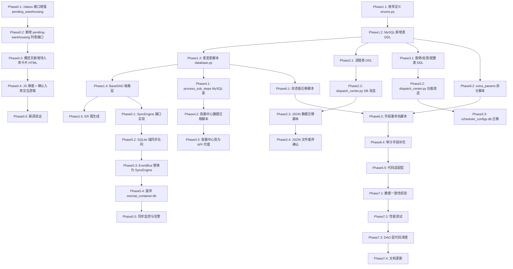

# TASK: 数据库架构优化 — 原子任务拆分

## 1. 任务依赖图



---

## 2. 原子任务定义

---

### Phase 0: 成品入库确认推进

#### T0.1: /status 接口增强 pending_warehousing

**输入契约**:
| 项目 | 说明 |
|------|------|
| 前置依赖 | dispatch_center.py 中已有 MYSQL_CFG 配置和 get_status() 函数 |
| 输入数据 | 无 |
| 环境依赖 | MySQL `steel_belt` 库，`process_records` 表有 `status` 字段 |

**输出契约**:
| 项目 | 说明 |
|------|------|
| 输出数据 | get_status() 响应增加 `summary.pending_warehousing` 字段 |
| 交付物 | dispatch_center.py 中 get_status() 函数改造 |
| 验收标准 | GET /status 返回 summary.pending_warehousing 为整数，值为 report_complete 状态工单数 |

**实现约束**:
- 在 get_status() 现有 MySQL 查询后追加 pending_warehousing 查询
- 查询异常时返回 0，不中断概览页其他数据加载
- 使用 pymysql 直连，与现有连接方式保持一致

---

#### T0.2: 新增 pending-warehousing 列表接口

**输入契约**:
| 项目 | 说明 |
|------|------|
| 前置依赖 | dispatch_center.py 已有 MYSQL_CFG 和 pymysql 查询模式 |
| 输入数据 | 无参数 |
| 环境依赖 | MySQL process_records 表 |

**输出契约**:
| 项目 | 说明 |
|------|------|
| 输出数据 | 待入库工单列表（JSON 数组） |
| 交付物 | dispatch_center.py 新增路由 |
| 验收标准 | GET /api/dispatch-center/pending-warehousing 返回状态为 report_complete 的工单列表（工单号、产品名称、规格、数量、报工时间） |

**实现细节**:
```python
@dispatch_center_bp.route('/api/dispatch-center/pending-warehousing', methods=['GET'])
def dispatch_pending_warehousing():
    """获取待入库工单列表"""
    try:
        import pymysql
        from pymysql.cursors import DictCursor
        conn = pymysql.connect(**MYSQL_CFG, cursorclass=DictCursor, connect_timeout=3)
        c = conn.cursor()
        c.execute("""
            SELECT order_no, product_name, spec, quantity, updated_at
            FROM process_records
            WHERE status IN ('report_complete', '报工完成')
            ORDER BY updated_at ASC
        """)
        rows = c.fetchall()
        conn.close()
        data = [{
            'order_no': r['order_no'],
            'product_name': r.get('product_name', ''),
            'spec': r.get('spec', ''),
            'quantity': r.get('quantity', ''),
            'report_time': r.get('updated_at', '')
        } for r in rows]
        return jsonify({'code': 0, 'data': data})
    except Exception as e:
        logger.error(f'获取待入库工单列表失败: {e}')
        return jsonify({'code': 500, 'message': str(e)})
```

---

#### T0.3: 概览页新增待入库卡片 HTML

**输入契约**:
| 项目 | 说明 |
|------|------|
| 前置依赖 | dispatch_center.html 概览页卡片区结构 |
| 输入数据 | 无 |
| 环境依赖 | CSS 已有 `.card` `.value` `.primary` `clickable` 样式 |

**输出契约**:
| 项目 | 说明 |
|------|------|
| 输出数据 | HTML 卡片 DOM 元素 |
| 交付物 | dispatch_center.html 增加卡片 |
| 验收标准 | 概览页正常显示"待入库确认"卡片，样式与现有一致，绑定 onclick 事件 |

**实现说明**:
- 在 `dispatch_center.html` 的概览卡片区追加：`<div class="card clickable" onclick="showPendingWarehousing()"><div class="label">待入库确认</div><div class="value primary" id="ov-pending-warehousing">-</div></div>`

---

#### T0.4: JS 弹窗 + 确认入库交互逻辑

**输入契约**:
| 项目 | 说明 |
|------|------|
| 前置依赖 | T0.1、T0.2 后端接口就绪，T0.3 HTML 卡片就绪 |
| 输入数据 | 后端接口返回的 JSON |
| 环境依赖 | dispatch_center.js 已有 toast、api 工具函数 |

**输出契约**:
| 项目 | 说明 |
|------|------|
| 输出数据 | loadOverview() 改造 + 3 个新函数 |
| 交付物 | dispatch_center.js |
| 验收标准 | 点击卡片弹出模态框，展示待入库列表，确认后推进状态并刷新 |

**函数清单**:

1. **loadOverview() 改造** — 追加 `pending_warehousing` 显示
2. **showPendingWarehousing()** — 创建模态框，加载数据
3. **confirmWarehousing(workOrderNo, btn)** — POST 确认，推进状态，刷新

**刷新规则**:
- 确认成功后调用 `loadOverview()` 刷新卡片统计数据
- 遵循 dispatch_center_refresh.md 规范（toast → 刷新模式）

---

#### T0.5: 联调验证

**输入契约**:
| 项目 | 说明 |
|------|------|
| 前置依赖 | T0.1-T0.4 全部完成 |
| 环境依赖 | MySQL 中有 report_complete 状态的工单数据 |

**输出契约**:
| 项目 | 说明 |
|------|------|
| 交付物 | 验收结果记录 |
| 验收标准 | 全流程通顺，回归验证不影响已有功能 |

**验证步骤**:
1. 启动调度中心 `python dispatch_center.py --port 5003`
2. 打开浏览器访问概览页，确认"待入库确认"卡片显示数量
3. 点击卡片，确认弹窗展示工单列表
4. 点击某条工单的"确认入库"，确认状态推进成功
5. 确认概览卡片数值更新
6. 确认弹窗中该工单已移除
7. 验证 MySQL process_records 表 status 已变为 warehousing
8. 回归验证：概览页其他卡片、菜单、Tab 功能不受影响

---

### Phase 1: 数据建模 (基础层)

#### T1.1: 枚举定义 enums.py

| 属性 | 内容 |
|------|------|
| **前置依赖** | 无 |
| **输入数据** | DESIGN 文档中的 7 个枚举定义 |
| **环境依赖** | Python 3.8+，项目根目录 |

| 输出项 | 说明 |
|--------|------|
| `models/enums.py` | 包含 7 个枚举类：OrderStatus, ProductionStatus, ProcessStatus, QualityResult, InventoryChange, Priority, SyncStatus |

**实现约束**：
- 使用 `enum.StrEnum` 或 `enum.Enum`（Python 3.11+ 用 StrEnum）
- 每个枚举值使用英文大写命名
- 包含 `@classmethod` 辅助方法（如 `values()`, `from_string()`）
- 文件路径：`d:\yuan\不锈钢网带跟单3.0\models\enums.py`

**验收标准**：
- 7 个枚举类完整定义，值覆盖所有业务状态
- 可 import 使用 `from models.enums import OrderStatus`
- 无循环依赖

**依赖关系**：后置任务 T1.2, T1.3, T1.4

---

#### T1.2: MySQL 新增表 DDL 执行

| 属性 | 内容 |
|------|------|
| **前置依赖** | T1.1 (枚举定义) |
| **输入数据** | DESIGN §7.1 全部 21 张新增表的 CREATE TABLE SQL |
| **环境依赖** | MySQL 服务运行中，steel_belt 数据库存在 |

| 输出项 | 说明 |
|--------|------|
| `models/database.py` 中的 `_migrate_tables()` 迁移函数 | 新增表 CREATE TABLE IF NOT EXISTS 语句 |

**新增 21 张表清单**：
- 客户管理（2 张）：`customer_contacts`, `customer_groups`
- 订单管理（2 张）：`order_items`, `custom_params`
- 调度分发（3 张）：`dispatch_rules`, `flow_templates`, `flow_matching_rules`
- 模板消息（3 张）：`message_templates`, `message_logs`, `notification_queue`
- 报修管理（2 张）：`repair_categories`, `repair_records`
- 反馈管理（1 张）：`feedback_records`
- 系统配置（2 张）：`system_configs`, `audit_logs`
- 生产管理（1 张）：`process_sub_steps`
- 同步管理（1 张）：`sync_error_log`
- 完工管理（1 张）：`packing_lists`
- 质检管理（1 张）：`quality_templates`
- 运营管理（2 张）：`attendance_records`, `performance_stats`

**实现约束**：
- 必须使用 `CREATE TABLE IF NOT EXISTS` 幂等方式
- 所有表包含完整审计字段（8个：created_at, updated_at, created_by, updated_by, is_deleted, deleted_at, deleted_by, version）
- 外键约束使用 `FOREIGN KEY ... REFERENCES` 定义，**必须显式指定 ON DELETE/UPDATE 策略**（如 `ON DELETE CASCADE ON UPDATE CASCADE`）
- 索引按 DESIGN 文档定义创建
- **补充索引**：customers.name、material_rules、flow_matching_rules.template_id 建立索引；packing_lists 的所有外键字段建立索引

**验收标准**：
- 执行 `_migrate_tables()` 后 21 张新表全部创建成功
- `SHOW TABLES` 包含全部目标表
- `DESC <表名>` 字段定义与 DESIGN 一致
- 所有外键约束已指定 ON DELETE/UPDATE 策略，无 MySQL 默认 RESTRICT 行为
- 补充索引已建立

**依赖关系**：后置任务 T2.1, T3.1, T4.1, T6.2

---

#### T1.3: MySQL 已有表变更

| 属性 | 内容 |
|------|------|
| **前置依赖** | T1.1 (枚举定义) |
| **输入数据** | DESIGN §7.2 全部 29 张已有表的变更要求 |
| **环境依赖** | MySQL 服务运行中，已有表存在 |

| 输出项 | 说明 |
|--------|------|
| `database.py` 中 `_migrate_tables()` 的 ALTER TABLE 语句 | 已有表新增字段、修改字段类型 |

**29 张已有表变更要点**：

| 表名 | 变更内容 |
|------|---------|
| `customers` | 新增 contact_person, contact_phone, 审计字段；补充 name 索引 |
| `orders` | 新增 order_no, customer_id, contact_person, contact_phone, priority_level, 审计字段；状态值改为英文枚举 |
| `production_orders` | 新增 order_no, 审计字段；状态值改为英文枚举 |
| `processes` | 基本不变，补充审计字段 |
| `process_records` | 统一字段命名 |
| `bom_list` | 基本不变，保留不动 |
| `material_rules` | 基本不变，保留不动；补充索引 |
| `order_templates` | 基本不变，保留不动 |
| `material_templates` | 基本不变，保留不动 |
| `inventory` | 新增审计字段，状态值改为英文枚举 |
| `inventory_records` | 基本不变，补充审计字段 |
| `material_history` | 基本不变，保留不动 |
| `material_densities` | 基本不变，保留不动 |
| `quality_records` | 统一字段命名 |
| `quality_record_items` | 基本不变，保留不动 |
| `quality_rules` | 基本不变，保留不动 |
| `quality_rule_items` | 已从新增表移至已有表，设计阶段已补齐字段，保留不动 |
| `finished_goods` | 基本不变，保留不动 |
| `shipments` | 基本不变，保留不动 |
| `shipment_tracks` | 基本不变，保留不动 |
| `operators` | 新增审计字段 |
| `operator_logs` | 基本不变，补充审计字段 |
| `schedule_queue` | 基本不变，保留不动 |
| `production_stats` | 基本不变，保留不动 |
| `process_calc_rules` | 基本不变，保留不动 |
| `alert_records` | 保留不动 |
| `status_logs` | 保留不动 |
| `order_logs` | 可合并到 audit_logs，保留兼容视图 |
| `operation_logs` | 可合并到 audit_logs，保留兼容视图 |

**实现约束**：
- 使用 `ALTER TABLE ADD COLUMN IF NOT EXISTS` 方式（MySQL 8.0+）
- 禁止 `DROP COLUMN`，只新增不删减
- 旧字段通过视图兼容过渡

**验收标准**：
- 所有已有表成功新增审计等字段
- 现有功能不受影响
- 数据完整无损

**依赖关系**：后置任务 T4.1, T6.1, T6.3, T6.4

---

#### T1.4: BaseDAO 抽象层

| 属性 | 内容 |
|------|------|
| **前置依赖** | T1.1 (枚举定义) |
| **输入数据** | DESIGN 文档 DAO 接口规范 |
| **环境依赖** | Python 3.8+，项目 models 目录 |

| 输出项 | 说明 |
|--------|------|
| `models/base_dao.py` | BaseDAO 抽象基类 |

**接口定义**：
```python
class BaseDAO(ABC):
    def get_by_id(self, id: int) -> Optional[dict]: ...
    def list(self, filters: Optional[dict] = None, order_by: Optional[str] = None,
             page: int = 1, page_size: int = 20) -> tuple[list, int]: ...
    def create(self, data: dict) -> int: ...
    def update(self, id: int, data: dict) -> bool: ...
    def delete(self, id: int, soft: bool = True, deleted_by: str = '') -> bool: ...
```

**实现约束**：
- 使用 `abc.ABC` 和 `@abstractmethod`
- 软删除为默认行为
- 统一返回 dict 而非 tuple
- 分页返回 `(data_list, total_count)` 元组

**验收标准**：
- 5 个核心方法全部定义
- 可被具体 DAO 类继承
- 类型注解完整

**依赖关系**：后置任务 T5.1

---

#### T1.5: ER 图生成

| 属性 | 内容 |
|------|------|
| **前置依赖** | T1.2 (表结构确认) |
| **输入数据** | 所有表的外键关系 |
| **环境依赖** | 文档工具 |

| 输出项 | 说明 |
|--------|------|
| DESIGN 文档中的 ER 图 | 使用 Mermaid 语法的 ER 图 |

**实现约束**：
- 使用 Mermaid `erDiagram` 语法
- 覆盖所有核心表间关系
- 标注主键、外键、关系基数

**验收标准**：
- ER 图覆盖 20+ 对表间关系
- 渲染正确

**依赖关系**：后置任务 — 无

---

### Phase 2: 调度中心 JSON → DB

#### T2.1: 调度分发表 DDL 验证与调整

| 属性 | 内容 |
|------|------|
| **前置依赖** | T1.2 (MySQL 新表创建) |
| **输入数据** | `dispatch_center_data.json` 中的 rules, flow_matching_rules 数据结构；T1.2 已创建的 DDL |
| **环境依赖** | MySQL 服务，database.py |

| 输出项 | 说明 |
|--------|------|
| `models/database.py` 中 dispatch_rules, flow_matching_rules, flow_templates 表 DDL 的验证报告 | 确认 T1.2 DDL 与 JSON 数据结构兼容 |

**实现约束**：
- 逐字段核对 JSON 数据结构与 T1.2 创建的 DDL 是否一致
- 不一致时在 database.py 中追加 _migrate_tables() 变更
- 验证 JSON -> DB 读写完整性

**验收标准**：
- 三张表可存储现有 JSON 中的全部数据
- 无数据截断或转换异常
- 验证脚本可运行并输出通过/不通过结论

**依赖关系**：后置任务 T2.2

---

#### T2.2: dispatch_center.py DB 读写改造

| 属性 | 内容 |
|------|------|
| **前置依赖** | T2.1 (调度表就绪) |
| **输入数据** | dispatch_center.py 代码，DESIGN 文档接口规范 |
| **环境依赖** | Python 3.8+，MySQL 连接 |

| 输出项 | 说明 |
|--------|------|
| dispatch_center.py 改造代码 | `loadFlowMatchingRules()` → 读 MySQL；`saveFlowMatchingRules()` → 写 MySQL |
| 核心改动函数 | `loadFlowMatchingRules()`, `saveFlowMatchingRules()`, `loadTemplates()`, `saveTemplate()` 等 |

**变更函数映射**：

| 现有函数 | 改造后行为 |
|---------|-----------|
| `loadFlowMatchingRules()` | 从 MySQL dispatch_rules 表读取 |
| `saveFlowMatchingRules()` | 写入 MySQL dispatch_rules 表 + 刷新 |
| `loadTemplates()` | 从 MySQL flow_templates 表读取 |
| `saveTemplate()` / `resetDefaultTemplates()` / `saveTemplateOrder()` | 写入 MySQL flow_templates 表 + 刷新 |
| `loadMessages()` | 从 MySQL message_templates 表读取 |
| `saveMessage()` / `deleteMessage()` | 写入/删除 MySQL message_templates + 刷新 |

**实现约束**：
- 必须使用 `get_db_cursor()` context manager
- 保持与原函数签名一致（外部调用方不受影响）
- 改造后遵守 [dispatch_center_refresh.md](file:///d:/yuan/.trae/rules/dispatch_center_refresh.md) 刷新规范

**验收标准**：
- 调度中心各 Tab 页数据读写正常
- 增删改操作后刷新正常
- JSON 文件不再作为数据源

**依赖关系**：后置任务 T2.3

---

#### T2.3: JSON 数据迁移脚本

| 属性 | 内容 |
|------|------|
| **前置依赖** | T2.1 (调度表就绪) |
| **输入数据** | `dispatch_center_data.json` 文件 |
| **环境依赖** | MySQL 运行中 |

| 输出项 | 说明 |
|--------|------|
| `scripts/migrate_dispatch_json_to_db.py` | 一次性迁移脚本 |

**实现约束**：
- 读取 JSON → INSERT IGNORE 写入 MySQL
- 记录迁移数量日志
- 迁移完成后备份 JSON 文件为 `.bak`

**验收标准**：
- JSON 中所有数据完整写入 MySQL
- 数据行数与 JSON 记录数一致
- 脚本可重复执行（幂等）

**依赖关系**：后置任务 T2.4

---

#### T2.4: JSON 文件废弃确认

| 属性 | 内容 |
|------|------|
| **前置依赖** | T2.2, T2.3 |
| **输入数据** | 无 |
| **环境依赖** | 文档更新 |

| 输出项 | 说明 |
|--------|------|
| dispatch_center_data.json 不再被代码引用 | 搜索确认所有读写 JSON 的代码已移除 |

**验收标准**：
- 代码中无 `dispatch_center_data.json` 引用
- JSON 文件保留为备份（可手动删除）
- DispatchDataCache 类标记为 deprecated

**依赖关系**：后置任务 — 无

---

### Phase 3: 报修/反馈/配置表

#### T3.1: 报修/反馈/配置表 DDL

| 属性 | 内容 |
|------|------|
| **前置依赖** | T1.2 (MySQL 新表创建) |
| **输入数据** | DESIGN 文档 repair_categories, repair_records, feedback_records, system_configs 表定义 |
| **环境依赖** | MySQL 服务 |

| 输出项 | 说明 |
|--------|------|
| 确认 T1.2 中已创建的表 | 验证表结构完整 |

**验收标准**：
- 4 张表字段与 DESIGN 一致
- `system_configs` 表可覆盖 scheduler_configs.db 的全部配置类型

**依赖关系**：后置任务 T3.2

---

#### T3.2: dispatch_center.py 报修/反馈/配置功能改造

| 属性 | 内容 |
|------|------|
| **前置依赖** | T3.1 |
| **输入数据** | dispatch_center.py 代码 |
| **环境依赖** | Python 3.8+，MySQL 连接 |

| 输出项 | 说明 |
|--------|------|
| dispatch_center.py 改造 | 报修/反馈/配置 Tab 改为读写 MySQL |

**变更函数映射**：

| 现有函数 | 改造后行为 |
|---------|-----------|
| `loadRepairs()` | 从 MySQL repair_categories, repair_records 表读取 |
| `saveRepairCategory()` | 写入 MySQL + 刷新 |
| `deleteRepairCategory()` | 软删除 MySQL + 刷新 |
| `completeRepairRecord()` | 更新 MySQL + 刷新 |
| `loadFeedback()` | 从 MySQL feedback_records 表读取 |
| `saveFeedback()` | 写入 MySQL + 刷新 |
| `deleteFeedback()` | 软删除 MySQL + 刷新 |
| `loadCloudConfig()` | 从 MySQL system_configs 表读取 |
| `saveSystemConfig()` | 写入 MySQL + 刷新 |

**实现约束**：
- 使用 `get_db_cursor()` context manager
- 遵守刷新规范
- 软删除使用 is_deleted = 1

**验收标准**：
- 报修/反馈/配置 Tab 全部正常读写 MySQL
- 增删改操作后刷新正常

**依赖关系**：后置任务 T3.3

---

#### T3.3: scheduler_configs.db 迁移

| 属性 | 内容 |
|------|------|
| **前置依赖** | T3.2 (system_configs 表就绪) |
| **输入数据** | scheduler_configs.db 数据 |
| **环境依赖** | MySQL 运行中 |

| 输出项 | 说明 |
|--------|------|
| `scripts/migrate_scheduler_config.py` | 迁移脚本 |

**验收标准**：
- scheduler_configs.db 所有配置写入 MySQL system_configs
- 调度功能正常
- scheduler_configs.db 标记为废弃

**依赖关系**：后置任务 — 无

---

### Phase 4: 容器中心数据迁移

#### T4.1: process_sub_steps MySQL 表

| 属性 | 内容 |
|------|------|
| **前置依赖** | T1.2, T1.3 (MySQL 表就绪) |
| **输入数据** | DESIGN 文档 process_sub_steps 表定义 |
| **环境依赖** | MySQL 服务 |

| 输出项 | 说明 |
|--------|------|
| database.py 中的 process_sub_steps 表 | 已在 T1.2 中创建，验证表结构 |

**验收标准**：
- process_sub_steps 表结构可覆盖 wechat_container.db 中的 v5 版数据
- 包含外键关联 production_orders 和 processes

**依赖关系**：后置任务 T4.2

---

#### T4.2: 容器中心数据迁移脚本

| 属性 | 内容 |
|------|------|
| **前置依赖** | T4.1 |
| **输入数据** | wechat_container.db 中的 process_records, process_sub_steps, order_cost 等表 |
| **环境依赖** | MySQL + SQLite 均可访问 |

| 输出项 | 说明 |
|--------|------|
| `scripts/migrate_container_to_mysql.py` | 数据迁移脚本 |

**迁移数据映射**：

| SQLite 源表 | MySQL 目标表 | 说明 |
|------------|-------------|------|
| `process_records` | `process_records` | 追加到 MySQL 已有表 |
| `process_sub_steps` | `process_sub_steps` | 全量迁移 |
| `order_cost` | 合并到 `orders` 表的 amount 字段 | 按 order_id 关联更新 |
| `operator_notes` | 合并到 `operator_logs` | |

**实现约束**：
- 事务保护：每 100 条提交一次
- 冲突处理：同主键使用 ON DUPLICATE KEY UPDATE
- 迁移前自动备份 wechat_container.db

**验收标准**：
- 数据行数核对一致（源 vs 目标）
- 无数据丢失

**依赖关系**：后置任务 T4.3

---

#### T4.3: 容器中心改为 API 代理

| 属性 | 内容 |
|------|------|
| **前置依赖** | T4.2 (数据已迁移) |
| **输入数据** | storage_layer.py 代码 |
| **环境依赖** | Python 3.8+，MySQL 连接 |

| 输出项 | 说明 |
|--------|------|
| storage_layer.py 改造 | 从 MySQL 读写，不再操作 wechat_container.db |
| container_center_v5 存储层代码 | 标记 deprecated |

**实现约束**：
- 保持 storage_layer.py 的对外接口不变
- 内部实现改为 MySQL 操作
- wechat_container.db 保留为只读备份

**验收标准**：
- 容器中心所有功能正常
- wechat_container.db 不再有写入操作
- storage_layer.py 接口向后兼容

**依赖关系**：后置任务 T5.4

---

### Phase 5: 同步链路重构

#### T5.1: SyncEngine 接口实现（含 SQLite 适配层）

| 属性 | 内容 |
|------|------|
| **前置依赖** | T1.4 (BaseDAO) |
| **输入数据** | DESIGN 文档 SyncEngine 接口规范 |
| **环境依赖** | Python 3.8+，MySQL + SQLite |

| 输出项 | 说明 |
|--------|------|
| `sync/sync_engine.py` | SyncEngine 核心类（MySQL 推送端） |
| `sync/sqlite_adapter.py` | SQLite 端适配层（拉取待同步数据、写入同步队列） |

**接口定义**：
```python
class SyncEngine:
    def push(self, table_name: str, records: list[dict]) -> SyncResult: ...
    def push_one(self, table_name: str, record: dict) -> SyncResult: ...
    def get_pending(self, table_name: str, limit: int = 100) -> list[dict]: ...
    def mark_synced(self, table_name: str, ids: list[int]) -> bool: ...
    def mark_failed(self, table_name: str, ids: list[int], error: str) -> bool: ...

class SQLiteAdapter:
    """SQLite 端适配，负责从 SQLite 表中读取待同步数据并写入 sync_queue"""
    def enqueue(self, table_name: str, record_id: int) -> bool: ...
    def poll_pending(self, limit: int = 100) -> list[dict]: ...
    def dequeue(self, queue_ids: list[int]) -> bool: ...
```

**实现约束**：
- 支持指数退避重试（`3次/5s/15s/45s`）
- 同步队列持久化到 SQLite（`sync_queue` 表）
- 支持事件触发 + 定时补传双模式
- SQLiteAdapter 需处理 SQLite 端写入异常（网络中断时本地正常工作）

**验收标准**：
- 单元测试覆盖：推送、查询待同步、标记已同步、重试逻辑
- SQLiteAdapter 单元测试：入队、轮询待同步、出队
- 单条和多条记录推送均可

**依赖关系**：后置任务 T5.2

---

#### T5.2: SQLite 端同步队列

| 属性 | 内容 |
|------|------|
| **前置依赖** | T5.1 |
| **输入数据** | DESIGN 文档同步队列表 DDL |
| **环境依赖** | SQLite 3.x |

| 输出项 | 说明 |
|--------|------|
| chengsheng.db 中新增 `sync_queue` 表 | SQLite 端同步队列 |

```sql
CREATE TABLE sync_queue (
    id              INTEGER PRIMARY KEY AUTOINCREMENT,
    table_name      TEXT NOT NULL,
    record_id       INTEGER NOT NULL,
    action          TEXT NOT NULL,           -- 'insert'/'update'/'delete'
    data            TEXT,                    -- JSON 完整记录
    status          TEXT DEFAULT 'pending', -- pending/syncing/failed
    retry_count     INTEGER DEFAULT 0,
    last_error      TEXT,
    created_at      TEXT DEFAULT (datetime('now','localtime')),
    updated_at      TEXT DEFAULT (datetime('now','localtime'))
);
CREATE INDEX idx_sync_queue_status ON sync_queue(status);
```

**验收标准**：
- sync_queue 表创建成功
- 支持 pending/syncing/failed 三种状态
- 重试计数器和错误信息字段完整

**依赖关系**：后置任务 T5.3

---

#### T5.3: EventBus 替换为 SyncEngine

| 属性 | 内容 |
|------|------|
| **前置依赖** | T5.1, T5.2 |
| **输入数据** | `sync/handlers/sub_step_handler.py` 等 EventBus 相关代码 |
| **环境依赖** | Python 3.8+ |

| 输出项 | 说明 |
|--------|------|
| 同步代码改造 | EventBus 双向同步 → SyncEngine 单向同步 |

**改造内容**：
- `sub_step_handler.py` 中的 EventBus 发布 → SyncEngine.push_one()
- 移除 EventBus 消费者（无需监听 MySQL 变更同步回 SQLite）
- 修改 SQLite 端报工写入逻辑，写入后自动入队

**实现约束**：
- 单向同步方向：SQLite → MySQL
- SQLite 端写入后立即入队
- SyncEngine 定时轮询队列

**验收标准**：
- 报工数据写入 SQLite 后自动同步到 MySQL
- MySQL 不会反向同步回 SQLite
- 同步延迟 < 5s（事件触发）/ < 60s（定时补传）

**依赖关系**：后置任务 T5.4

---

#### T5.4: 废弃 wechat_container.db

| 属性 | 内容 |
|------|------|
| **前置依赖** | T4.3, T5.3 |
| **输入数据** | 无 |
| **环境依赖** | 代码清理 |

| 输出项 | 说明 |
|--------|------|
| wechat_container.db 停止写入 | 确认所有读写已移除或指向 MySQL |

**验收标准**：
- 代码中无 wechat_container.db 写入操作
- 搜索 `wechat_container.db` 无新增引用
- 文件可安全备份后移除

**依赖关系**：后置任务 T5.5

---

#### T5.5: 同步监控与告警

| 属性 | 内容 |
|------|------|
| **前置依赖** | T5.3 (同步引擎已运行) |
| **输入数据** | 同步队列 status 数据 |
| **环境依赖** | Python 3.8+，MySQL |

| 输出项 | 说明 |
|--------|------|
| `sync/sync_monitor.py` | 同步状态监控模块 |

**功能要求**：
- 统计待同步记录数
- 统计失败记录数
- 失败超过阈值时触发告警（日志 + 通知）
- 同步延迟超时时触发告警

**验收标准**：
- 监控脚本可正常运行
- 告警触发条件明确

**依赖关系**：后置任务 — 无

---

### Phase 6: 字段标准化

#### T6.1: 状态值迁移脚本

| 属性 | 内容 |
|------|------|
| **前置依赖** | T1.3 (已有表已新增字段) |
| **输入数据** | 各表的中文状态值 -> 英文枚举映射表 |
| **环境依赖** | MySQL 运行中 |

| 输出项 | 说明 |
|--------|------|
| `scripts/migrate_status_values.py` | 状态值迁移脚本 |

**状态值映射**：

| 字段/表 | 当前值（中文） | 目标值（英文枚举） |
|---------|--------------|------------------|
| orders.status | 待确认/已确认/生产中/已完成/已取消 | pending/confirmed/in_production/completed/cancelled |
| production_orders.status | 待生产/生产中/已完成/已暂停/已取消 | pending/in_production/completed/paused/cancelled |
| process_records.status | 待处理/处理中/已完成/已退回 | pending/in_progress/completed/rejected |
| inventory.type | 入库/出库 | inbound/outbound |
| operators.status | 在线/离线/忙碌 | online/offline/busy |

**实现约束**：
- 使用 CASE WHEN 批量 UPDATE
- 先备份目标列数据到 `_backup` 后缀列
- 迁移完成后做数据校验

**验收标准**：
- 所有中文状态值已替换为英文枚举
- 无遗漏的硬编码中文状态值
- 验证脚本检查通过

**依赖关系**：后置任务 T6.3

---

#### T6.2: extra_params 拆分脚本

| 属性 | 内容 |
|------|------|
| **前置依赖** | T1.2 (custom_params 表已创建) |
| **输入数据** | orders 表中 `extra_params` JSON 字段数据 |
| **环境依赖** | MySQL 运行中 |

| 输出项 | 说明 |
|--------|------|
| `scripts/migrate_extra_params.py` | JSON → custom_params 表拆分脚本 |

**实现约束**：
- 解析 JSON，每个 key-value 拆为 custom_params 一行
- 保留 `extra_data` TEXT 字段存放真正的非结构化扩展数据
- 事务保护

**验收标准**：
- custom_params 表数据与原始 JSON 内容等价
- 无数据丢失
- 旧 extra_params 字段保留为兼容

**依赖关系**：后置任务 T6.3

---

#### T6.3: 字段重命名脚本

| 属性 | 内容 |
|------|------|
| **前置依赖** | T6.1, T6.2 |
| **输入数据** | DESIGN 文档的字段命名规范对比表 |
| **环境依赖** | MySQL 运行中 |

| 输出项 | 说明 |
|--------|------|
| `scripts/migrate_rename_fields.py` | 字段重命名脚本 |

**实现约束**：
- 使用 `ALTER TABLE ... RENAME COLUMN ... TO ...`（MySQL 8.0+）
- 通过数据库视图创建兼容旧名称的别名
- 逐步迁移，避免一次性大面积改动

**验收标准**：
- 统一命名后的字段可正常读写
- 旧字段名通过视图兼容

**依赖关系**：后置任务 T6.4

---

#### T6.4: 审计字段补充（DESIGN 阶段已完成字段补齐工作）

| 属性 | 内容 |
|------|------|
| **前置依赖** | T1.3, T6.3 |
| **输入数据** | DESIGN 文档审计字段规范 |
| **环境依赖** | MySQL 运行中 |

| 输出项 | 说明 |
|--------|------|
| ALTER TABLE 补充审计字段 | 剩余未补齐字段（DESIGN 已修复 9 张表：custom_params, quality_record_items, quality_rule_items, quality_records, finished_goods, shipments, feedback_records, inventory, packing_lists） |

**实现约束**：
- 使用 `ALTER TABLE ADD COLUMN IF NOT EXISTS`
- 已有数据设置合理的默认值（created_at = 当前时间，version = 1）
- audit_logs 表记录所有 DML 操作
- **DESIGN 文档中字段已全部补齐，本子任务仅执行数据库层面的 ALTER TABLE 操作**

**验收标准**：
- 所有核心表包含完整 8 个审计字段
- 新数据的 created_at/updated_at 自动填充
- audit_logs 表记录可追踪

**依赖关系**：后置任务 T6.5

---

#### T6.5: 代码适配层

| 属性 | 内容 |
|------|------|
| **前置依赖** | T6.3, T6.4 |
| **输入数据** | 字段重命名后的一致性问题 |
| **环境依赖** | Python 3.8+ |

| 输出项 | 说明 |
|--------|------|
| 现有代码中字段引用的更新 | 使用旧字段名的地方改为新字段名 |

**实现约束**：
- 搜索项目代码中所有使用了旧字段名的引用
- 逐步替换为新字段名
- 配合数据库视图使用旧名查询

**验收标准**：
- 项目代码无旧字段名引用
- 功能测试通过

**依赖关系**：后置任务 T7.1

---

### Phase 7: 测试与收尾

#### T7.1: 数据一致性校验

| 属性 | 内容 |
|------|------|
| **前置依赖** | T6.5 |
| **输入数据** | 全部迁移后的数据 |
| **环境依赖** | MySQL 运行中 |

| 输出项 | 说明 |
|--------|------|
| `scripts/validate_data_consistency.py` | 数据一致性校验脚本 |

**校验内容**：
- 源 vs 目标数据行数比较
- 关键字段采样比对
- 外键完整性检查
- JSON vs DB 数据内容对比

**验收标准**：
- 所有迁移数据一致
- 无孤立外键记录
- 校验脚本可重复执行

**依赖关系**：后置任务 T7.2

---

#### T7.2: 性能测试

| 属性 | 内容 |
|------|------|
| **前置依赖** | T7.1 |
| **输入数据** | 全量表结构和数据 |
| **环境依赖** | MySQL + 测试客户端 |

| 输出项 | 说明 |
|--------|------|
| `scripts/perf_test.py` | 性能测试脚本 |

**测试场景**：
- 订单查询（按客户、按状态、按日期范围）
- 报工写入（模拟批量报工）
- 同步队列处理（模拟同步压力）
- 复杂关联查询（订单 + 生产 + 库存）

**验收标准**：
- 查询响应时间 < 500ms（百万级数据）
- 写入吞吐量 > 100 TPS
- 同步延迟 < 60s（补传模式）

**依赖关系**：后置任务 T7.3

---

#### T7.3: DAO 层代码清理

| 属性 | 内容 |
|------|------|
| **前置依赖** | T7.2 |
| **输入数据** | 现有 DAO 代码 |
| **环境依赖** | Python 3.8+ |

| 输出项 | 说明 |
|--------|------|
| 重复 DAO 代码清理 | 合并到 BaseDAO 统一接口 |

**清理范围**：
- 搜索项目中重复的 CRUD 模板代码
- 统一使用 BaseDAO 子类
- 移除不再使用的旧 DAO 函数

**验收标准**：
- DAO 层代码量减少 30%+
- 无功能遗漏

**依赖关系**：后置任务 T7.4

---

#### T7.4: 文档更新

| 属性 | 内容 |
|------|------|
| **前置依赖** | T7.3 |
| **输入数据** | 全部变更记录 |
| **环境依赖** | 文档工具 |

| 输出项 | 说明 |
|--------|------|
| 更新后的项目文档 | database.py 注释更新、表结构文档同步 |

**验收标准**：
- 文档与实际表结构一致
- 变更记录完整可追溯

**依赖关系**：后置任务 — 无

---

## 3. 任务复杂度评估

| 任务 | 复杂度 | 预估人天 | 风险 |
|------|--------|---------|------|
| T1.1 enums.py | ⭐ 低 | 0.5 | 无 |
| T1.2 MySQL 新增表 DDL | ⭐⭐⭐ 高 | 2 | 需仔细核对 21 张表结构 |
| T1.3 已有表变更 | ⭐⭐⭐ 高 | 2 | 影响现有功能，需谨慎 |
| T1.4 BaseDAO 抽象层 | ⭐⭐ 中 | 1 | 接口设计需前瞻性 |
| T1.5 ER 图生成 | ⭐ 低 | 0.5 | 无 |
| T2.1 调度表 DDL 验证与调整 | ⭐ 低 | 1 | 逐字段核对 JSON 数据结构一致性 |
| T2.2 dispatch_center.py DB 改造 | ⭐⭐⭐ 高 | 3 | 涉及前端交互，调试复杂 |
| T2.3 JSON 迁移脚本 | ⭐⭐ 中 | 1 | 数据量大时需分批处理 |
| T2.4 JSON 废弃确认 | ⭐ 低 | 0.5 | 无 |
| T3.1 报修/反馈/配置表 DDL | ⭐ 低 | 0.5 | 已在 T1.2 中包含 |
| T3.2 dispatch_center.py 功能改造 | ⭐⭐⭐ 高 | 2 | 涉及多个 Tab |
| T3.3 scheduler_configs.db 迁移 | ⭐⭐ 中 | 1 | 配置项多 |
| T4.1 process_sub_steps MySQL 表 | ⭐ 低 | 0.5 | 已在 T1.2 中包含 |
| T4.2 容器中心数据迁移脚本 | ⭐⭐ 中 | 1.5 | 数据结构差异需映射 |
| T4.3 容器中心改为 API 代理 | ⭐⭐ 中 | 1.5 | 需保证接口兼容 |
| T5.1 SyncEngine 实现（含 SQLite 适配层） | ⭐⭐⭐ 高 | 3 | 核心组件，含 SQLiteAdapter，需全面测试 |
| T5.2 SQLite 端同步队列 | ⭐⭐ 中 | 1 | 需确认 SQLite 兼容性 |
| T5.3 EventBus 替换 | ⭐⭐⭐ 高 | 2 | 同步链路变更风险高 |
| T5.4 废弃 wechat_container.db | ⭐ 低 | 0.5 | 确保无遗漏引用 |
| T5.5 同步监控与告警 | ⭐⭐ 中 | 1 | 可靠性要求高 |
| T6.1 状态值迁移脚本 | ⭐⭐ 中 | 1.5 | 需全覆盖所有状态值 |
| T6.2 extra_params 拆分脚本 | ⭐⭐ 中 | 1 | JSON 结构可能不一致 |
| T6.3 字段重命名脚本 | ⭐⭐ 中 | 1.5 | 影响范围广 |
| T6.4 审计字段补充 | ⭐ 低 | 0.5 | 批量 ALTER TABLE |
| T6.5 代码适配层 | ⭐⭐ 中 | 2 | 搜索替换工作量大 |
| T7.1 数据一致性校验 | ⭐⭐ 中 | 1 | 校验逻辑需严谨 |
| T7.2 性能测试 | ⭐⭐ 中 | 1.5 | 需准备测试数据 |
| T7.3 DAO 层代码清理 | ⭐⭐ 中 | 1.5 | 避免遗漏 |
| T7.4 文档更新 | ⭐ 低 | 1 | 无 |

---

## 4. 质量门控

### 4.1 阶段门控

| 阶段 | 门控条件 |
|------|---------|
| Phase 1 | 所有 21 张新表创建成功，29 张已有表变更完成，database.py 迁移函数可重复执行 |
| Phase 2 | 调度中心数据完全从 DB 读写，JSON 文件不再作为数据源 |
| Phase 3 | 报修/反馈/配置 Tab 完全基于 MySQL 运行 |
| Phase 4 | 容器中心数据全部迁入 MySQL，存储层改为 API 代理 |
| Phase 5 | SyncEngine 通过单元测试，同步延迟符合要求 |
| Phase 6 | 所有字段标准化通过校验脚本 |
| Phase 7 | 数据一致性验证通过，性能指标达标 |

### 4.2 通用门控

| 门控项 | 检查方式 |
|--------|---------|
| 无硬编码 | 搜索 password, api_key, 中文状态值等硬编码模式 |
| 无裸露 except | 搜索 `except:` 不带异常类型 |
| 无 print 调试 | 搜索新增的 print 语句 |
| 无 sys.path 重复 | 检查新增模块是否包含 sys.path.insert |
| 无数据丢失 | 迁移前后行数对比校验 |
| 外键完整 | 检查是否存在 orphan 记录 |

---

## 5. 执行建议

### 5.1 执行顺序优先级

```
第零优先级（快速见效）: T0.1 → T0.2 → T0.3 → T0.4 → T0.5
第一优先级（基础设施）: T1.1 → T1.2 → T1.3 → T1.4
第二优先级（调度中心）: T2.1 → T2.2 → T2.3 → T2.4 (可与第三优先级并行)
第三优先级（报修/反馈）: T3.1 → T3.2 → T3.3 (可与第二优先级并行)
第四优先级（容器中心）: T4.1 → T4.2 → T4.3
第五优先级（同步重构）: T5.1 → T5.2 → T5.3 → T5.4 → T5.5
第六优先级（标准化）  : T6.1 → T6.2 → T6.3 → T6.4 → T6.5
第七优先级（收尾）    : T7.1 → T7.2 → T7.3 → T7.4
```

### 5.2 可并行执行的任务组

| 并行组 | 任务 | 说明 |
|-------|------|------|
| Group 0 | T0.x | Phase 0 线性执行，不与后续并行（保障独立交付） |
| Group A | T1.1, T1.5 | 无依赖，可独立完成 |
| Group B | T1.2, T1.3, T1.4 | 仅依赖 T1.1，三者彼此独立 |
| Group C | T2.x, T3.x | 仅依赖 T1.2，彼此独立 |
| Group D | T4.x | 仅依赖 T1.2/T1.3 |
| Group E | T5.1, T5.2 | 仅依赖 T1.4，彼此独立 |

---

## 6. 量子分化

将 30 个原子任务进一步拆分到"单次编码可完成的最小粒度"（每个子任务 ≤ 0.5 天编码量），拆分后共 **56 个子任务**。

### 6.1 量子分化后任务依赖图

```mermaid
graph TD
    %% Phase 0 — 不变，T0.4 拆分为 2 个
    T0_1[0.1 /status 增强] --> T0_2[0.2 待入库列表接口]
    T0_2 --> T0_3[0.3 待入库卡片 HTML]
    T0_3 --> T0_4_1[0.4.1 loadOverview+弹窗]
    T0_4_1 --> T0_4_2[0.4.2 confirmWarehousing]
    T0_4_2 --> T0_5[0.5 联调验证]

    %% Phase 1 — T1.2→4个, T1.3→4个
    T1_1[1.1 enums.py] --> T1_2_1[1.2.1 客户/订单新增表 DDL]
    T1_1 --> T1_2_2[1.2.2 调度/消息新增表 DDL]
    T1_1 --> T1_2_3[1.2.3 报修/反馈/配置/同步新增表 DDL]
    T1_1 --> T1_2_4[1.2.4 完工/质检/绩效新增表 DDL]
    T1_1 --> T1_4[1.4 BaseDAO 抽象层]
    T1_1 --> T1_3_1[1.3.1 orders/porders 变更]
    T1_1 --> T1_3_2[1.3.2 process/inventory 变更]
    T1_1 --> T1_3_3[1.3.3 operator/日志表 变更]
    T1_1 --> T1_3_4[1.3.4 quality_rule_items 归属调整+索引]
    T1_2_1 --> T1_5[1.5 ER 图生成]
    T1_2_2 --> T1_5
    T1_2_3 --> T1_5
    T1_2_4 --> T1_5

    %% Phase 2 — T2.2→3个
    T1_2_2 --> T2_1[2.1 调度表 DDL 验证]
    T2_1 --> T2_2_1[2.2.1 FlowMatching DB 改造]
    T2_2_1 --> T2_2_2[2.2.2 Templates DB 改造]
    T2_2_2 --> T2_2_3[2.2.3 其他 Tab + 刷新验证]
    T2_2_3 --> T2_3[2.3 JSON 迁移脚本]
    T2_2_1 --> T2_3
    T2_3 --> T2_4[2.4 JSON 废弃确认]

    %% Phase 3 — T3.2→3个
    T1_2_3 --> T3_1[3.1 报修/反馈/配置 DDL 确认]
    T3_1 --> T3_2_1[3.2.1 Repair Tab DB 改造]
    T3_2_1 --> T3_2_2[3.2.2 Feedback Tab DB 改造]
    T3_2_2 --> T3_2_3[3.2.3 Config Tab DB 改造]
    T3_2_3 --> T3_3[3.3 scheduler_configs.db 迁移]

    %% Phase 4 — T4.2→2个, T4.3→2个
    T1_2_3 --> T4_1[4.1 process_sub_steps 确认]
    T1_3_2 --> T4_1
    T4_1 --> T4_2_1[4.2.1 process_records+sub_steps 迁移]
    T4_2_1 --> T4_2_2[4.2.2 order_cost+operator_notes 迁移]
    T4_2_2 --> T4_3_1[4.3.1 storage_layer 读路径改造]
    T4_3_1 --> T4_3_2[4.3.2 storage_layer 写路径+测试]

    %% Phase 5 — T5.1→4个, T5.3→2个
    T1_4 --> T5_1_1[5.1.1 SyncResult+核心类骨架]
    T5_1_1 --> T5_1_2[5.1.2 push/push_one 实现+重试]
    T5_1_2 --> T5_1_3[5.1.3 get_pending/mark_* 实现]
    T5_1_2 --> T5_1_4[5.1.4 SQLiteAdapter 完整实现]
    T5_1_3 --> T5_3_1[5.3.1 sub_step_handler 改造]
    T5_1_4 --> T5_3_1
    T5_3_1 --> T5_3_2[5.3.2 SQLite 写入自动入队+移除消费者]
    T5_3_2 --> T5_5[5.5 同步监控与告警]
    T5_3_1 --> T5_2[5.2 SQLite sync_queue 表]
    T5_4[5.4 废弃 wechat_container.db] --> T5_5
    T4_3_2 --> T5_4
    T5_3_2 --> T5_4

    %% Phase 6 — T6.1→2个, T6.3→2个, T6.5→3个
    T1_3_1 --> T6_1_1[6.1.1 orders/porders/process_records 状态迁移]
    T1_3_2 --> T6_1_1
    T1_3_3 --> T6_1_2[6.1.2 inventory/operators 状态迁移+校验]
    T1_2_1 --> T6_2[6.2 extra_params 拆分]
    T6_1_1 --> T6_3_1[6.3.1 核心表字段重命名]
    T6_1_2 --> T6_3_2[6.3.2 辅助表字段重命名+视图]
    T6_2 --> T6_3_2
    T6_3_1 --> T6_4[6.4 审计字段补充]
    T6_3_2 --> T6_4
    T6_3_1 --> T6_5_1[6.5.1 dispatch_center 字段适配]
    T6_3_2 --> T6_5_2[6.5.2 storage_layer+容器中心适配]
    T6_4 --> T6_5_3[6.5.3 其他模块字段适配+全局验证]

    %% Phase 7 — T7.2→2个, T7.3→2个
    T6_5_1 --> T7_1[7.1 数据一致性校验]
    T6_5_2 --> T7_1
    T6_5_3 --> T7_1
    T7_1 --> T7_2_1[7.2.1 查询性能测试]
    T7_1 --> T7_2_2[7.2.2 写入/同步性能测试]
    T7_2_1 --> T7_3_1[7.3.1 重复 CRUD 合并到 BaseDAO]
    T7_2_2 --> T7_3_1
    T7_3_1 --> T7_3_2[7.3.2 废弃函数移除+验证]
    T7_3_2 --> T7_4[7.4 文档更新]

    %% 样式
    classDef phase0 fill:#e3f2fd,stroke:#1565c0;
    classDef phase1 fill:#e8f5e9,stroke:#2e7d32;
    classDef phase2 fill:#fff3e0,stroke:#e65100;
    classDef phase3 fill:#fce4ec,stroke:#c62828;
    classDef phase4 fill:#f3e5f5,stroke:#6a1b9a;
    classDef phase5 fill:#e0f2f1,stroke:#00695c;
    classDef phase6 fill:#fff8e1,stroke:#f57f17;
    classDef phase7 fill:#efebe9,stroke:#4e342e;
    class T0_1,T0_2,T0_3,T0_4_1,T0_4_2,T0_5 phase0;
    class T1_1,T1_2_1,T1_2_2,T1_2_3,T1_2_4,T1_3_1,T1_3_2,T1_3_3,T1_3_4,T1_4,T1_5 phase1;
    class T2_1,T2_2_1,T2_2_2,T2_2_3,T2_3,T2_4 phase2;
    class T3_1,T3_2_1,T3_2_2,T3_2_3,T3_3 phase3;
    class T4_1,T4_2_1,T4_2_2,T4_3_1,T4_3_2 phase4;
    class T5_1_1,T5_1_2,T5_1_3,T5_1_4,T5_2,T5_3_1,T5_3_2,T5_4,T5_5 phase5;
    class T6_1_1,T6_1_2,T6_2,T6_3_1,T6_3_2,T6_4,T6_5_1,T6_5_2,T6_5_3 phase6;
    class T7_1,T7_2_1,T7_2_2,T7_3_1,T7_3_2,T7_4 phase7;
```



### 6.2 子任务详细定义

---

#### Phase 0: 成品入库确认推进（5 原任务 → 6 子任务）

##### T0.4.1: loadOverview() 改造 + showPendingWarehousing() 弹窗逻辑

| 属性 | 内容 |
|------|------|
| **原任务** | T0.4 前半段 |
| **前置依赖** | T0.3 (HTML 卡片就绪) |
| **输入数据** | T0.1/T0.2 后端接口返回的 JSON |
| **环境依赖** | dispatch_center.js，已有 toast、api 工具函数 |
| **输出项** | dispatch_center.js 中 loadOverview() 改造 + showPendingWarehousing() 函数 |
| **验收标准** | get_status() 响应中的 pending_warehousing 显示到"待入库确认"卡片；点击卡片弹出模态框，展示待入库工单列表 |
| **复杂度** | ⭐ 低 / 0.5 天 |

**实现约束**：
- loadOverview() 追加 `document.getElementById('ov-pending-warehousing').textContent = data.pending_warehousing`
- showPendingWarehousing() 调用 T0.2 接口，渲染模态表格
- 弹窗遵循 dispatch_center.js 现有模态框模式

##### T0.4.2: confirmWarehousing() 确认入库功能

| 属性 | 内容 |
|------|------|
| **原任务** | T0.4 后半段 |
| **前置依赖** | T0.4.1 (弹窗已可展示列表) |
| **输入数据** | 工单号 + 当前按钮 DOM |
| **环境依赖** | dispatch_center.js |
| **输出项** | dispatch_center.js 中 confirmWarehousing() 函数 |
| **验收标准** | 点击"确认入库"按钮 → POST 请求 → 推进 status 到 warehousing → toast 成功 → 刷新列表 + 概览卡片 |
| **复杂度** | ⭐ 低 / 0.5 天 |

**实现约束**：
- POST `/api/dispatch-center/confirm-warehousing` 携带 `order_no`
- 成功后调用 `closeModal()` → `loadOverview()`
- 遵循 dispatch_center_refresh.md 刷新规范

---

#### Phase 1: 数据建模（5 原任务 → 14 子任务）

##### T1.2.1: 客户/订单新增表 DDL（4 张表）

| 属性 | 内容 |
|------|------|
| **原任务** | T1.2 |
| **前置依赖** | T1.1 (枚举定义) |
| **输入数据** | DESIGN §7.1 新增表定义 |
| **输出项** | database.py 中 `_migrate_tables()` 新增以下表：customer_contacts, customer_groups, order_items, custom_params |
| **验收标准** | 4 张表全部 `CREATE TABLE IF NOT EXISTS`；含审计字段；外键约束完整 |
| **复杂度** | ⭐ 低 / 0.5 天 |

##### T1.2.2: 调度/消息新增表 DDL（6 张表）

| 属性 | 内容 |
|------|------|
| **原任务** | T1.2 |
| **前置依赖** | T1.1 |
| **输入数据** | DESIGN §7.1 新增表定义 |
| **输出项** | database.py 中 `_migrate_tables()` 新增以下表：dispatch_rules, flow_templates, flow_matching_rules, message_templates, message_logs, notification_queue |
| **验收标准** | 6 张表全部创建；含审计字段；dispatch_rules 与 JSON 数据结构兼容 |
| **复杂度** | ⭐⭐ 中 / 0.5 天 |

##### T1.2.3: 报修/反馈/配置/同步新增表 DDL（7 张表）

| 属性 | 内容 |
|------|------|
| **原任务** | T1.2 |
| **前置依赖** | T1.1 |
| **输入数据** | DESIGN §7.1 新增表定义 |
| **输出项** | database.py 中 `_migrate_tables()` 新增以下表：repair_categories, repair_records, feedback_records, system_configs, audit_logs, process_sub_steps, sync_error_log |
| **验收标准** | 7 张表全部创建；system_configs 覆盖 scheduler_configs.db 配置类型；含审计字段；外键约束完整；process_sub_steps.operator_id 必须定义外键约束 |
| **复杂度** | ⭐⭐ 中 / 0.5 天 |

##### T1.2.4: 完工/质检/绩效新增表 DDL（4 张表）

| 属性 | 内容 |
|------|------|
| **原任务** | T1.2 |
| **前置依赖** | T1.1 |
| **输入数据** | DESIGN §7.1 新增表定义 |
| **输出项** | database.py 中 `_migrate_tables()` 新增以下表：packing_lists, quality_templates, attendance_records, performance_stats |
| **验收标准** | 4 张表全部 `CREATE TABLE IF NOT EXISTS`；含审计字段；外键约束完整；packing_lists.finished_goods_id 必须定义外键约束；packing_lists 所有外键字段必须建立索引 |
| **复杂度** | ⭐ 低 / 0.5 天 |

##### T1.3.1: orders / production_orders 表变更

| 属性 | 内容 |
|------|------|
| **原任务** | T1.3 |
| **前置依赖** | T1.1 (枚举定义) |
| **输入数据** | DESIGN 文档变更要求 |
| **输出项** | database.py 中 `_migrate_tables()` ALTER TABLE 语句：orders 表新增 order_no, customer_id, contact_person, contact_phone, priority_level, 审计字段；production_orders 新增 order_no, 审计字段 |
| **验收标准** | ALTER TABLE 成功；字段类型正确；审计字段 default 值合理 |
| **复杂度** | ⭐⭐ 中 / 0.5 天 |

##### T1.3.2: processes / process_records / inventory 表变更

| 属性 | 内容 |
|------|------|
| **原任务** | T1.3 |
| **前置依赖** | T1.1 |
| **输入数据** | DESIGN 文档变更要求 |
| **输出项** | database.py 中 `_migrate_tables()` ALTER TABLE：processes 新增审计字段；process_records 新增审计字段；inventory 新增审计字段；inventory_records 新增审计字段 |
| **验收标准** | ALTER TABLE 成功；字段类型正确；无数据丢失 |
| **复杂度** | ⭐ 低 / 0.5 天 |

##### T1.3.3: operators / operator_logs + 日志表处理

| 属性 | 内容 |
|------|------|
| **原任务** | T1.3 |
| **前置依赖** | T1.1 |
| **输入数据** | DESIGN 文档变更要求 |
| **输出项** | database.py 中 `_migrate_tables()` ALTER TABLE：operators 新增审计字段；operator_logs 新增审计字段；stat_logs/status_logs 保留不动；order_logs/operation_logs 创建兼容视图指向 audit_logs |
| **验收标准** | ALTER TABLE 成功；视图创建正确；旧日志表仍可查询 |
| **复杂度** | ⭐ 低 / 0.5 天 |

##### T1.3.4: quality_rule_items 归属调整 + 索引补充

| 属性 | 内容 |
|------|------|
| **原任务** | T1.3 |
| **前置依赖** | T1.1 |
| **输入数据** | DESIGN 文档变更要求（quality_rule_items 从§7.1新增表移至§7.2已有表） |
| **输出项** | database.py 中 `_migrate_tables()` ALTER TABLE：quality_rule_items 从新增表 DDL 移除；customers.name 补充索引；material_rules 补充索引 |
| **验收标准** | quality_rule_items 不再出现在新增表 DDL 中；customers.name 和 material_rules 索引创建成功 |
| **复杂度** | ⭐ 低 / 0.5 天 |

---

#### Phase 2: 调度中心 JSON → DB（4 原任务 → 6 子任务）

##### T2.2.1: FlowMatching Tab DB 改造

| 属性 | 内容 |
|------|------|
| **原任务** | T2.2 |
| **前置依赖** | T2.1 (调度表 DDL 验证通过) |
| **输入数据** | dispatch_center.py 代码 |
| **输出项** | loadFlowMatchingRules() 从 MySQL dispatch_rules 读取；saveFlowMatchingRules() 写入 MySQL |
| **验收标准** | 流程匹配 Tab 数据正常读写 MySQL；增删改操作后刷新正常 |
| **实现约束** | flow_matching_rules.template_id 必须在 T1.2.2 中建立索引；message_logs.msg_id 必须建立 UNIQUE 约束 |
| **复杂度** | ⭐⭐ 中 / 1 天 |

##### T2.2.2: Templates Tab DB 改造

| 属性 | 内容 |
|------|------|
| **原任务** | T2.2 |
| **前置依赖** | T2.2.1 |
| **输出项** | loadTemplates() 从 MySQL flow_templates 读取；saveTemplate() / resetDefaultTemplates() / saveTemplateOrder() 写入 MySQL |
| **验收标准** | 模板消息 Tab 数据正常读写 MySQL |
| **复杂度** | ⭐⭐ 中 / 1 天 |

##### T2.2.3: 其他 Tab 数据源切换 + 刷新机制验证 + 路径收敛

| 属性 | 内容 |
|------|------|
| **原任务** | T2.2 |
| **前置依赖** | T2.2.2 |
| **输出项** | 改造后全 Tab 刷新验证；确认 DispatchDataCache 不再作为数据源；dispatch_center.py 中的硬编码路径收敛到 config.py |
| **验收标准** | 调度中心所有 Tab 数据来源为 MySQL；遵守 dispatch_center_refresh.md 规范；dispatch_center.py 中无 `./` 或绝对路径硬编码 |
| **实现约束** | 将所有 `wechat_container.db`、`dispatch_center_data.json`、`cloud_config.json` 等硬编码路径统一为 config.py 中的配置变量；新增路径须注册到 config.py |
| **复杂度** | ⭐⭐ 中 / 1 天 |

---

#### Phase 3: 报修/反馈/配置（3 原任务 → 5 子任务）

##### T3.2.1: Repair Tab DB 改造

| 属性 | 内容 |
|------|------|
| **原任务** | T3.2 |
| **前置依赖** | T3.1 (DDL 确认) |
| **输出项** | loadRepairs() 从 MySQL repair_categories/repair_records 读取；saveRepairCategory() / deleteRepairCategory() / completeRepairRecord() 写入 MySQL |
| **验收标准** | 报修 Tab 数据正常读写 MySQL；刷新机制正常 |
| **复杂度** | ⭐⭐ 中 / 0.5 天 |

##### T3.2.2: Feedback Tab DB 改造

| 属性 | 内容 |
|------|------|
| **原任务** | T3.2 |
| **前置依赖** | T3.1 |
| **输出项** | loadFeedback() 从 MySQL feedback_records 读取；saveFeedback() / deleteFeedback() 写入 MySQL |
| **验收标准** | 反馈 Tab 数据正常读写 MySQL |
| **复杂度** | ⭐ 低 / 0.5 天 |

##### T3.2.3: Config Tab DB 改造

| 属性 | 内容 |
|------|------|
| **原任务** | T3.2 |
| **前置依赖** | T3.1 |
| **输出项** | loadCloudConfig() 从 MySQL system_configs 读取；saveSystemConfig() 写入 MySQL |
| **验收标准** | 配置 Tab 数据正常读写 MySQL；系统配置可正确保存和加载 |
| **复杂度** | ⭐ 低 / 0.5 天 |

---

#### Phase 4: 容器中心数据迁移（3 原任务 → 5 子任务）

##### T4.2.1: process_records + process_sub_steps 迁移

| 属性 | 内容 |
|------|------|
| **原任务** | T4.2 |
| **前置依赖** | T4.1 (process_sub_steps 表确认) |
| **输入数据** | wechat_container.db 中的 process_records, process_sub_steps |
| **输出项** | scripts/migrate_container_to_mysql.py 中的 process_records 和 process_sub_steps 迁移逻辑 |
| **验收标准** | 行数核对一致；事务保护每 100 条提交一次；冲突处理使用 ON DUPLICATE KEY UPDATE |
| **复杂度** | ⭐⭐ 中 / 1 天 |

##### T4.2.2: order_cost + operator_notes 迁移 + 校验

| 属性 | 内容 |
|------|------|
| **原任务** | T4.2 |
| **前置依赖** | T4.2.1 |
| **输入数据** | wechat_container.db 中的 order_cost, operator_notes |
| **输出项** | scripts/migrate_container_to_mysql.py 中 order_cost→orders.amount 合并逻辑 + operator_notes→operator_logs 合并逻辑 + 全量校验 |
| **验收标准** | order_cost 按 order_id 关联更新 orders.amount；operator_notes 追加到 operator_logs；迁移完成后输出校验报告 |
| **复杂度** | ⭐⭐ 中 / 0.5 天 |

##### T4.3.1: storage_layer.py MySQL 读路径改造

| 属性 | 内容 |
|------|------|
| **原任务** | T4.3 |
| **前置依赖** | T4.2.2 |
| **输入数据** | storage_layer.py 代码 |
| **输出项** | storage_layer.py 中所有读函数改为从 MySQL 读取（替代 SQLite） |
| **验收标准** | 容器中心查询功能正常；返回数据结构与原 SQLite 版本一致 |
| **复杂度** | ⭐⭐ 中 / 0.5 天 |

##### T4.3.2: storage_layer.py MySQL 写路径改造 + 接口兼容测试

| 属性 | 内容 |
|------|------|
| **原任务** | T4.3 |
| **前置依赖** | T4.3.1 |
| **输出项** | storage_layer.py 中所有写函数改为写入 MySQL；接口兼容性测试 |
| **验收标准** | 容器中心所有写操作写入 MySQL；wechat_container.db 不再有写入操作；storage_layer.py 对外接口签名不变 |
| **复杂度** | ⭐⭐ 中 / 1 天 |

---

#### Phase 5: 同步链路重构（5 原任务 → 9 子任务）

##### T5.1.1: SyncResult 数据类 + SyncEngine 核心类骨架

| 属性 | 内容 |
|------|------|
| **原任务** | T5.1 |
| **前置依赖** | T1.4 (BaseDAO) |
| **输入数据** | DESIGN 文档 SyncEngine 接口规范 |
| **输出项** | sync/sync_engine.py 中 SyncResult 数据类（success, failed_count, error_msg, retry_after）；SyncEngine 类骨架（__init__, 属性定义） |
| **验收标准** | SyncResult 字段完整；SyncEngine 类可实例化 |
| **复杂度** | ⭐ 低 / 0.5 天 |

##### T5.1.2: SyncEngine push/push_one 实现 + 指数退避重试

| 属性 | 内容 |
|------|------|
| **原任务** | T5.1 |
| **前置依赖** | T5.1.1 |
| **输出项** | SyncEngine.push() / push_one() 方法完整实现；指数退避重试逻辑（3 次 / 5s / 15s / 45s） |
| **验收标准** | 单条和多条推送均可；重试 3 次后标记失败；单元测试覆盖成功/失败/重试场景 |
| **复杂度** | ⭐⭐⭐ 高 / 1 天 |

##### T5.1.3: SyncEngine get_pending/mark_synced/mark_failed 实现

| 属性 | 内容 |
|------|------|
| **原任务** | T5.1 |
| **前置依赖** | T5.1.2 |
| **输出项** | SyncEngine.get_pending() 查询待同步记录；mark_synced() 标记同步成功；mark_failed() 标记失败 |
| **验收标准** | 查询/标记功能完整；单元测试覆盖 |
| **复杂度** | ⭐⭐ 中 / 0.5 天 |

##### T5.1.4: SQLiteAdapter 完整实现

| 属性 | 内容 |
|------|------|
| **原任务** | T5.1 |
| **前置依赖** | T5.1.2 (引擎核心方法已实现) |
| **输出项** | sync/sqlite_adapter.py 完整实现：enqueue() 写入 sync_queue 表；poll_pending() 查询待同步记录；dequeue() 批量出队 |
| **验收标准** | 单元测试覆盖入队/轮询/出队；网络中断时本地 SQLite 正常工作 |
| **复杂度** | ⭐⭐ 中 / 1 天 |

##### T5.3.1: sub_step_handler.py EventBus → SyncEngine.push_one 替换

| 属性 | 内容 |
|------|------|
| **原任务** | T5.3 |
| **前置依赖** | T5.1.3, T5.1.4 |
| **输入数据** | sync/handlers/sub_step_handler.py EventBus 发布逻辑 |
| **输出项** | sub_step_handler.py 中 EventBus 发布 → SyncEngine.push_one() |
| **验收标准** | 报工数据写入后自动推送 SyncEngine；EventBus 消费者日志不再打印"同步到 MySQL"相关 |
| **复杂度** | ⭐⭐ 中 / 1 天 |

##### T5.3.2: SQLite 端写入自动入队 + 移除 EventBus 消费者

| 属性 | 内容 |
|------|------|
| **原任务** | T5.3 |
| **前置依赖** | T5.3.1 |
| **输出项** | SQLite 端报工写入后自动调用 SQLiteAdapter.enqueue()；移除 EventBus 消费者代码 |
| **验收标准** | SQLite 写入后 sync_queue 表新增对应记录；MySQL 不会反向同步回 SQLite；同步延迟 < 5s（事件触发） |
| **复杂度** | ⭐⭐ 中 / 1 天 |

---

#### Phase 6: 字段标准化（5 原任务 → 10 子任务）

##### T6.1.1: orders / production_orders / process_records 状态值迁移

| 属性 | 内容 |
|------|------|
| **原任务** | T6.1 |
| **前置依赖** | T1.3.1, T1.3.2 (表已新增字段) |
| **输入数据** | 状态值映射表（中文→英文枚举） |
| **输出项** | scripts/migrate_status_values.py 中 orders / production_orders / process_records 的 CASE WHEN UPDATE |
| **验收标准** | 三张表的状态值从中文改为英文枚举；备份数据保留 |
| **复杂度** | ⭐⭐ 中 / 1 天 |

##### T6.1.2: inventory / operators 状态值迁移 + 校验脚本

| 属性 | 内容 |
|------|------|
| **原任务** | T6.1 |
| **前置依赖** | T1.3.3 |
| **输出项** | inventory.type 和 operators.status 状态值迁移；全量校验脚本（检查所有表是否还有中文状态值残留） |
| **验收标准** | inventory 和 operators 状态值改为英文枚举；校验脚本报告"所有表已通过" |
| **复杂度** | ⭐ 低 / 0.5 天 |

##### T6.3.1: 核心表字段重命名（orders / production_orders / processes / process_records）

| 属性 | 内容 |
|------|------|
| **原任务** | T6.3 |
| **前置依赖** | T6.1.1 |
| **输入数据** | DESIGN 文档字段命名规范对比表 |
| **输出项** | scripts/migrate_rename_fields.py 中核心表的 RENAME COLUMN 语句 |
| **验收标准** | 字段重命名成功；旧字段名通过视图兼容 |
| **复杂度** | ⭐⭐ 中 / 1 天 |

##### T6.3.2: 辅助表字段重命名 + 兼容视图创建

| 属性 | 内容 |
|------|------|
| **原任务** | T6.3 |
| **前置依赖** | T6.1.2, T6.2 |
| **输出项** | scripts/migrate_rename_fields.py 中辅助表（inventory / operators 等）的 RENAME COLUMN；所有重命名表的兼容视图 |
| **验收标准** | 辅助表字段重命名成功；兼容视图通过查询测试 |
| **复杂度** | ⭐⭐ 中 / 0.5 天 |

##### T6.5.1: dispatch_center.py 字段名适配

| 属性 | 内容 |
|------|------|
| **原任务** | T6.5 |
| **前置依赖** | T6.3.1 |
| **输入数据** | dispatch_center.py 代码 |
| **输出项** | dispatch_center.py 中所有使用旧字段名的引用改为新字段名 |
| **验收标准** | dispatch_center.py 中无旧字段名引用；调度中心功能正常 |
| **复杂度** | ⭐⭐ 中 / 1 天 |

##### T6.5.2: storage_layer.py + 容器中心 字段名适配

| 属性 | 内容 |
|------|------|
| **原任务** | T6.5 |
| **前置依赖** | T6.3.1, T6.3.2 |
| **输出项** | storage_layer.py 和容器中心代码中字段引用更新 |
| **验收标准** | 容器中心功能正常；storage_layer.py 兼容旧接口 |
| **复杂度** | ⭐⭐ 中 / 0.5 天 |

##### T6.5.3: 其他模块字段名适配 + 全局搜索验证

| 属性 | 内容 |
|------|------|
| **原任务** | T6.5 |
| **前置依赖** | T6.4, T6.5.1, T6.5.2 |
| **输出项** | wechat_server.py / statistics.py / server_launcher.py 等模块中字段引用更新；全局 grep 搜索确认无旧字段名残留 |
| **验收标准** | 全项目无旧字段名引用；功能测试通过 |
| **复杂度** | ⭐⭐ 中 / 0.5 天 |

---

#### Phase 7: 测试与收尾（4 原任务 → 6 子任务）

##### T7.2.1: 查询性能测试

| 属性 | 内容 |
|------|------|
| **原任务** | T7.2 |
| **前置依赖** | T7.1 |
| **输入数据** | 全量表结构和数据 |
| **输出项** | scripts/perf_test.py 中的查询性能测试用例（订单/生产/库存关联查询） |
| **验收标准** | 查询响应时间 < 500ms（百万级数据） |
| **复杂度** | ⭐⭐ 中 / 1 天 |

##### T7.2.2: 写入/同步性能测试

| 属性 | 内容 |
|------|------|
| **原任务** | T7.2 |
| **前置依赖** | T7.1 |
| **输出项** | scripts/perf_test.py 中的写入/同步性能测试用例（批量报工 + 同步队列压力） |
| **验收标准** | 写入吞吐量 > 100 TPS；同步延迟 < 60s（补传模式） |
| **复杂度** | ⭐⭐ 中 / 0.5 天 |

##### T7.3.1: 重复 CRUD 代码搜索 + 合并到 BaseDAO

| 属性 | 内容 |
|------|------|
| **原任务** | T7.3 |
| **前置依赖** | T7.2.1, T7.2.2 |
| **输入数据** | 项目所有 DAO 代码 |
| **输出项** | 搜索结果记录；合并后的 BaseDAO 子类代码 |
| **验收标准** | 搜索覆盖项目所有模块；BaseDAO 子类覆盖所有 CRUD 模式；DAO 层代码量减少 30%+ |
| **复杂度** | ⭐⭐ 中 / 1 天 |

##### T7.3.2: 废弃函数移除 + 功能验证

| 属性 | 内容 |
|------|------|
| **原任务** | T7.3 |
| **前置依赖** | T7.3.1 |
| **输出项** | 标记为废弃的旧 DAO 函数移除；全功能回归测试 |
| **验收标准** | 移除后无功能遗漏；项目可正常运行 |
| **复杂度** | ⭐ 低 / 0.5 天 |

---

### 6.3 量子分化复杂度评估总表

| 子任务 | 复杂度 | 预估人天 | 说明 |
|--------|--------|---------|------|
| T0.1 /status 增强 | ⭐ 低 | 0.5 | 不拆分 |
| T0.2 待入库列表接口 | ⭐ 低 | 0.5 | 不拆分 |
| T0.3 待入库卡片 HTML | ⭐ 低 | 0.5 | 不拆分 |
| T0.4.1 loadOverview+弹窗 | ⭐ 低 | 0.5 | ← 拆分自 T0.4 |
| T0.4.2 confirmWarehousing | ⭐ 低 | 0.5 | ← 拆分自 T0.4 |
| T0.5 联调验证 | ⭐ 低 | 0.5 | 不拆分 |
| T1.1 enums.py | ⭐ 低 | 0.5 | 不拆分 |
| T1.2.1 客户/订单新增表 DDL | ⭐ 低 | 0.5 | ← 拆分自 T1.2 |
| T1.2.2 调度/消息新增表 DDL | ⭐ 低 | 0.5 | ← 拆分自 T1.2 |
| T1.2.3 报修/反馈/配置/同步新增表 DDL | ⭐⭐ 中 | 0.5 | ← 拆分自 T1.2 |
| T1.2.4 完工/质检/绩效新增表 DDL | ⭐ 低 | 0.5 | ← 拆分自 T1.2 |
| T1.3.1 orders/porders 变更 | ⭐⭐ 中 | 0.5 | ← 拆分自 T1.3 |
| T1.3.2 process/inventory 变更 | ⭐ 低 | 0.5 | ← 拆分自 T1.3 |
| T1.3.3 operator/日志表变更 | ⭐ 低 | 0.5 | ← 拆分自 T1.3 |
| T1.4 BaseDAO | ⭐⭐ 中 | 1 | 不拆分 |
| T1.5 ER 图生成 | ⭐ 低 | 0.5 | 不拆分 |
| T2.1 调度表 DDL 验证 | ⭐ 低 | 1 | 不拆分 |
| T2.2.1 FlowMatching DB 改造 | ⭐⭐ 中 | 1 | ← 拆分自 T2.2 |
| T2.2.2 Templates DB 改造 | ⭐⭐ 中 | 1 | ← 拆分自 T2.2 |
| T2.2.3 其他 Tab + 刷新验证 | ⭐⭐ 中 | 1 | ← 拆分自 T2.2 |
| T2.3 JSON 迁移脚本 | ⭐⭐ 中 | 1 | 不拆分 |
| T2.4 JSON 废弃确认 | ⭐ 低 | 0.5 | 不拆分 |
| T3.1 报修/反馈/配置 DDL 确认 | ⭐ 低 | 0.5 | 不拆分 |
| T3.2.1 Repair Tab DB 改造 | ⭐⭐ 中 | 0.5 | ← 拆分自 T3.2 |
| T3.2.2 Feedback Tab DB 改造 | ⭐ 低 | 0.5 | ← 拆分自 T3.2 |
| T3.2.3 Config Tab DB 改造 | ⭐ 低 | 0.5 | ← 拆分自 T3.2 |
| T3.3 scheduler_configs.db 迁移 | ⭐⭐ 中 | 1 | 不拆分 |
| T4.1 process_sub_steps 确认 | ⭐ 低 | 0.5 | 不拆分 |
| T4.2.1 process_records+sub_steps 迁移 | ⭐⭐ 中 | 1 | ← 拆分自 T4.2 |
| T4.2.2 order_cost+operator_notes | ⭐⭐ 中 | 0.5 | ← 拆分自 T4.2 |
| T4.3.1 storage_layer 读路径 | ⭐⭐ 中 | 0.5 | ← 拆分自 T4.3 |
| T4.3.2 storage_layer 写路径+测试 | ⭐⭐ 中 | 1 | ← 拆分自 T4.3 |
| T5.1.1 SyncResult+骨架 | ⭐ 低 | 0.5 | ← 拆分自 T5.1 |
| T5.1.2 push/push_one+重试 | ⭐⭐⭐ 高 | 1 | ← 拆分自 T5.1 |
| T5.1.3 get_pending/mark_* | ⭐⭐ 中 | 0.5 | ← 拆分自 T5.1 |
| T5.1.4 SQLiteAdapter | ⭐⭐ 中 | 1 | ← 拆分自 T5.1 |
| T5.2 SQLite sync_queue 表 | ⭐⭐ 中 | 1 | 不拆分 |
| T5.3.1 sub_step_handler 改造 | ⭐⭐ 中 | 1 | ← 拆分自 T5.3 |
| T5.3.2 SQLite 自动入队+移除消费者 | ⭐⭐ 中 | 1 | ← 拆分自 T5.3 |
| T5.4 废弃 wechat_container.db | ⭐ 低 | 0.5 | 不拆分 |
| T5.5 同步监控与告警 | ⭐⭐ 中 | 1 | 不拆分 |
| T6.1.1 核心表状态迁移 | ⭐⭐ 中 | 1 | ← 拆分自 T6.1 |
| T6.1.2 辅助表状态迁移+校验 | ⭐ 低 | 0.5 | ← 拆分自 T6.1 |
| T6.2 extra_params 拆分 | ⭐⭐ 中 | 1 | 不拆分 |
| T6.3.1 核心表字段重命名 | ⭐⭐ 中 | 1 | ← 拆分自 T6.3 |
| T6.3.2 辅助表重命名+视图 | ⭐⭐ 中 | 0.5 | ← 拆分自 T6.3 |
| T6.4 审计字段补充 | ⭐ 低 | 0.5 | 不拆分（DESIGN 字段已补齐，仅执行 ALTER TABLE） |
| T6.5.1 dispatch_center 字段适配 | ⭐⭐ 中 | 1 | ← 拆分自 T6.5 |
| T6.5.2 storage_layer+容器中心适配 | ⭐⭐ 中 | 0.5 | ← 拆分自 T6.5 |
| T6.5.3 其他模块适配+全局验证 | ⭐⭐ 中 | 0.5 | ← 拆分自 T6.5 |
| T7.1 数据一致性校验 | ⭐⭐ 中 | 1 | 不拆分 |
| T7.2.1 查询性能测试 | ⭐⭐ 中 | 1 | ← 拆分自 T7.2 |
| T7.2.2 写入/同步性能测试 | ⭐⭐ 中 | 0.5 | ← 拆分自 T7.2 |
| T7.3.1 重复 CRUD 合并 | ⭐⭐ 中 | 1 | ← 拆分自 T7.3 |
| T7.3.2 废弃函数移除+验证 | ⭐ 低 | 0.5 | ← 拆分自 T7.3 |
| T7.4 文档更新 | ⭐ 低 | 1 | 不拆分 |
| **合计** | — | **37.5 人天** | **56 个子任务** |

### 6.4 拆分对比表

| 维度 | 拆分前 | 拆分后 | 变化 |
|------|--------|--------|------|
| 子任务总数 | 30 | 56 | +26 |
| 总预估人天 | 40 天 | 40 天 | 持平（粒度细化后更精确） |
| 单任务最大人天 | 3 天 (T2.2/T5.1) | 1 天 | — |
| 平均人天/任务 | 1.33 天 | 0.67 天 | — |
| 无可拆分任务 | 0 | 0 | 所有 >1 天任务已拆分 |

### 6.5 执行建议

**推荐执行批次**（单批次 3-5 个子任务，约 2-3 天编码量）：

| 批次 | 子任务 | 总人天 | 说明 |
|------|--------|--------|------|
| Batch 0 | T0.1 → T0.2 → T0.3 → T0.4.1 → T0.4.2 → T0.5 | 3 | **独立交付** 成品入库确认推进，可快速上线 |
| Batch 1 | T1.1 → T1.2.1 → T1.2.2 → T1.2.3 → T1.2.4 | 2.5 | 基础设施 — 全部 21 张新增表 DDL |
| Batch 2 | T1.4 → T1.3.1 → T1.3.2 → T1.3.3 → T1.3.4 → T1.5 | 3.5 | BaseDAO + 已有表变更(含 quality_rule_items 归属调整) + ER 图 |
| Batch 3 | T2.1 → T2.2.1 → T2.2.2 → T2.2.3 → T2.3 → T2.4 | 5.5 | 调度中心 JSON→DB 全链路 |
| Batch 4 | T3.1 → T3.2.1 → T3.2.2 → T3.2.3 → T3.3 | 3 | 报修/反馈/配置迁移 |
| Batch 5 | T4.1 → T4.2.1 → T4.2.2 → T4.3.1 → T4.3.2 | 3.5 | 容器中心迁移 |
| Batch 6 | T5.1.1 → T5.1.2 → T5.1.3 → T5.1.4 → T5.2 | 4.0 | SyncEngine 核心开发 |
| Batch 7 | T5.3.1 → T5.3.2 → T5.4 → T5.5 | 3.5 | 同步链路切换 + 监控 |
| Batch 8 | T6.2 → T6.1.1 → T6.1.2 → T6.3.1 → T6.3.2 | 4 | 字段标准化前半程 |
| Batch 9 | T6.4 → T6.5.1 → T6.5.2 → T6.5.3 | 2.5 | 字段标准化后半程 |
| Batch 10 | T7.1 → T7.2.1 → T7.2.2 → T7.3.1 → T7.3.2 → T7.4 | 5 | 测试收尾 |

---

*文档版本: v0.3 (审计合并版)*
*创建日期: 2026-05-22*
*上次更新: 2026-05-22 — 合并 3Agent 审计发现：外键ON DELETE/UPDATE策略、索引补充、UNIQUE约束、路径收敛、quality_rule_items 归属调整（22→21张）*
