# TASK: 数据引用路径修复 — 原子任务拆分

**版本**：v2.1
**日期**：2026-05-23
**基于**：DESIGN_数据引用路径修复_v2.0.md（18 维度审计，~250 处问题）
**状态**：v2.1 — 深度审计修正（新增 2 任务，修正 4 处，总计 47 个原子任务）

---

## 任务依赖图

```mermaid
graph TD
    %% Phase 0
    P0_T1[P0-T1: core/config.py\n字典落地+dotenv迁移]
    P0_T2[P0-T2: .env 文件创建]
    
    P0_T1 --> P0_T2

    %% Batch 1 依赖 Phase 0
    P0_T1 --> B1_T01
    P0_T1 --> B1_T03
    P0_T1 --> B1_T04
    P0_T1 --> B1_T06
    P0_T1 --> B1_T07
    P0_T1 --> B1_T08
    P0_T1 --> B1_T09
    P0_T1 --> B1_T10
    P0_T1 --> B1_T11
    P0_T1 --> B1_T12
    P0_T1 --> B1_T13
    P0_T1 --> B1_T14
    P0_T1 --> B1_T15
    P0_T2 --> B1_T02
    
    %% Batch 1 → Batch 2
    P0_T1 --> B2_T01
    P0_T1 --> B2_T02
    P0_T1 --> B2_T03
    P0_T1 --> B2_T04
    P0_T1 --> B2_T05
    P0_T1 --> B2_T06
    P0_T1 --> B2_T07
    P0_T1 --> B2_T08
    P0_T1 --> B2_T09
    
    %% Batch 1 → Batch 3
    P0_T1 --> B3_T01
    P0_T1 --> B3_T02
    P0_T1 --> B3_T03
    P0_T1 --> B3_T04
    P0_T1 --> B3_T05
    P0_T1 --> B3_T06
    P0_T1 --> B3_T07
    P0_T1 --> B3_T08
    P0_T1 --> B3_T09
    P0_T1 --> B3_T10
    P0_T1 --> B3_T11
    P0_T1 --> B3_T12
    P0_T1 --> B3_T13
    P0_T1 --> B3_T14
    P0_T1 --> B3_T15
    P0_T1 --> B3_T16
    P0_T1 --> B3_T17
    
    %% Batch 4 与 B1-B3 无强依赖（可并行）
    P0_T1 -.-> B4_T01
    P0_T1 -.-> B4_T02
    P0_T1 -.-> B4_T03
    P0_T1 -.-> B4_T04
    P0_T1 -.-> B4_T05
    
    %% Batch 6 依赖 Phase 0
    P0_T1 --> B6_T01
    P0_T1 --> B6_T02
    P0_T1 --> B6_T03
    P0_T1 --> B6_T04
    P0_T1 --> B6_T05
    P0_T1 --> B6_T06
    P0_T1 --> B6_T07
    P0_T1 --> B6_T08
    P0_T1 --> B6_T09
    P0_T1 --> B6_T10
    
    %% Batch 5 依赖 Batch 2 + Batch 3
    B2_T04 --> B5_T01
    B2_T05 --> B5_T02
    B2_T06 --> B5_T03
    B2_T07 --> B5_T04
    B2_T08 --> B5_T05
    
    %% Batch 7 依赖前面所有批次
    B1_T03 --> B7_T01
    B1_T04 --> B7_T02
    B1_T04 --> B7_T09
    B3_T01 --> B7_T01
    B3_T02 --> B7_T02
    B3_T11 --> B7_T07
    B3_T12 --> B7_T08
    B6_T10 --> B7_T06

    subgraph "Phase 0 - 前置条件"
        P0_T1
        P0_T2
    end
    
    subgraph "Batch 1 - .env 统一加载"
        B1_T01[core/config.py]
        B1_T02[mobile_api_ai/config.py]
        B1_T03[dispatch_center.py]
        B1_T04[container_center_api.py]
        B1_T05[server_launcher.py 保留]
        B1_T06[main.py]
        B1_T07[app.py]
        B1_T08[confirm_schedule.py]
        B1_T09[wechat_cloud.py]
        B1_T10[cloud_relay.py]
        B1_T11[wechat_work_bot_v2.py]
        B1_T12[face_server.py]
        B1_T13[config_center.py]
        B1_T14[settings.py]
        B1_T15[models/database.py]
    end
    
    subgraph "Batch 2 - 路径收拢"
        B2_T01[dispatch_center.py]
        B2_T02[container_center_api.py]
        B2_T03[legacy_routes.py]
        B2_T04[order_handler.py]
        B2_T05[worker_handler.py]
        B2_T06[quality_handler.py]
        B2_T07[sub_step_handler.py]
        B2_T08[sync_log.py]
        B2_T09[mobile_api_ai/config.py]
    end
    
    subgraph "Batch 3 - 端口/URL 硬编码"
        B3_T01[dispatch_center.py]
        B3_T02[container_center_api.py]
        B3_T03[schedule_flow.py]
        B3_T04[wechat_work_bot_v2.py]
        B3_T05[wechat_cloud.py]
        B3_T06[sync_bridge.py]
        B3_T07[inventory_api_server.py]
        B3_T08[container_api_server.py]
        B3_T09[legacy_routes.py]
        B3_T10[app.py]
        B3_T11[confirm_schedule.py]
        B3_T12[main.py]
        B3_T13[cloud_relay.py]
        B3_T14[standalone_dispatch_server.py]
        B3_T15[face_checkin/__init__.py]
        B3_T16[face_server.py]
        B3_T17[wechat_app_bot.py]
    end
    
    subgraph "Batch 4 - 前端修复"
        B4_T01[dispatch_center.py API]
        B4_T02[dispatch_center.html]
        B4_T03[dispatch_center.js]
        B4_T04[inventory_config.html]
        B4_T05[inventory_api_server.py]
    end
    
    subgraph "Batch 5 - Sync Handlers 迁移"
        B5_T01[order_handler.py → MySQL]
        B5_T02[worker_handler.py → MySQL]
        B5_T03[quality_handler.py → MySQL]
        B5_T04[sub_step_handler.py → MySQL]
        B5_T05[sync_log.py → MySQL]
    end
    
    subgraph "Batch 6 - 杂项清理"
        B6_T01[dispatch_center.py 日志]
        B6_T02[container_center_api.py 日志]
        B6_T03[inventory_api_server.py 日志]
        B6_T04[app.py 日志]
        B6_T05[dispatch_center.py 超时]
        B6_T06[container_center_api.py 超时]
        B6_T07[wechat_work_bot_v2.py + wechat_app_bot.py 超时]
        B6_T08[schedule_flow.py 超时]
        B6_T09[sync handlers 超时]
        B6_T10[测试文件清理]
    end
    
    subgraph "Batch 7 - 废弃代码清理"
        B7_T01[dispatch_center.py v5]
        B7_T02[container_center_api.py v5]
        B7_T03[legacy_routes.py 删除]
        B7_T04[container_api_server.py v5]
        B7_T05[api/scan.py 替换]
        B7_T06[container_dashboard.py 替换]
        B7_T07[data_collector_api.py 替换]
        B7_T08[desktop_container_integration.py 删除]
        B7_T09[wechat_work_bot_v2.py 替换]
        B7_T10[extra_params 替换]
        B7_T11[app.py 解除注册]
    end
```

---

## Phase 0 — 前置条件（2 任务）

### P0-T1: core/config.py 字典落地 + python-dotenv 迁移

| 字段 | 内容 |
|------|------|
| **输入契约** | — 当前 `core/config.py` 代码；— 已安装 `python-dotenv` 库 |
| **操作内容** | ① 新增 `DB_PATHS` 字典（5 活跃 + 5 DEPRECATED_ 路径）；② 新增 `DIR_PATHS` 字典（7 目录）；③ 新增 `SERVICE_URLS` 字典（6 服务，默认值为空）；④ 新增 `EXTERNAL_URLS` 字典；⑤ 新增 `SERVICE_TIMEOUTS` 字典（4 级别）；⑥ 将自定义 `load_env()` 改为 `load_dotenv()` |
| **验收标准** | 5 个字典全部就绪且可导入；`from core.config import DB_PATHS` 正常工作；`load_dotenv` 仅加载 `.env` 不存在时给出警告 |
| **输出契约** | 修改后 `core/config.py`，可通过 `from core.config import *` 验证 |
| **后置依赖** | 所有 Batch 的后续任务 |

### P0-T2: .env 文件创建

| 字段 | 内容 |
|------|------|
| **输入契约** | P0-T1 完成；确定所有环境变量键名 |
| **操作内容** | 在项目根目录创建 `.env` 文件，包含：6 个 SERVICE_URL、5 个 DB_PATH、4 个 TIMEOUT、CORS 配置。参照 DESIGN §2.2.2 模板 |
| **验收标准** | `.env` 文件存在，内容完整，格式正确（`KEY=VALUE`），注释清晰 |
| **输出契约** | `.env` 文件 |
| **后置依赖** | `mobile_api_ai/config.py` 简化（B1-T02） |

---

## Batch 1 — .env 加载统一化（13 任务 + 1 保留确认）

### B1-T01: core/config.py — load_env() → load_dotenv()

| 字段 | 内容 |
|------|------|
| **输入契约** | P0-T1 已包含此变更，本任务为验收确认 |
| **操作内容** | 确认：自定义 `load_env()` 被移除；替换为 `from dotenv import load_dotenv` + `load_dotenv(ENV_FILE)` |
| **验收标准** | 无 `def load_env` 定义；仅使用 `python-dotenv` 库加载 |
| **输出契约** | 已验证的 `core/config.py` |

### B1-T02: mobile_api_ai/config.py — 简化为从 core.config 导入

| 字段 | 内容 |
|------|------|
| **输入契约** | P0-T1 完成；P0-T2 完成（`.env` 就绪） |
| **操作内容** | 删除当前文件的 `load_dotenv()` 调用；改为从 `core.config` 导入需要的字典；只保留 `DISPATCH_DATA_FILE` 相关逻辑（后续 B2-T09 清理） |
| **验收标准** | `from mobile_api_ai.config import xx` 仍然可用；不再有独立 `load_dotenv()` |
| **输出契约** | 修改后 `mobile_api_ai/config.py` |

### B1-T03: dispatch_center.py — 删除独立 load_dotenv()

| 字段 | 内容 |
|------|------|
| **输入契约** | P0-T1 完成 |
| **操作内容** | 定位 L58-61 附近 `load_dotenv()` 调用，直接删除 |
| **验收标准** | `dispatch_center.py` 中无 `load_dotenv()` 调用 |
| **输出契约** | 修改后 `dispatch_center.py` |

### B1-T04: container_center_api.py — 删除 2 处 load_dotenv()

| 字段 | 内容 |
|------|------|
| **输入契约** | P0-T1 完成 |
| **操作内容** | 定位 L13-16 和 L36-45 附近 2 处 `load_dotenv()`，全部删除 |
| **验收标准** | `container_center_api.py` 中无 `load_dotenv()` 调用 |
| **输出契约** | 修改后 `container_center_api.py` |

### B1-T05: server_launcher.py — 确认保留（不修改）

| 字段 | 内容 |
|------|------|
| **输入契约** | — |
| **操作内容** | 确认该文件 L21-24 的 `load_dotenv()` 保留（子进程入口，需独立加载） |
| **验收标准** | 文件不修改，仅在 TASK 文档标记为"已确认保留" |
| **输出契约** | 无需修改 |

### B1-T06: main.py — 删除独立 load_dotenv()

| 字段 | 内容 |
|------|------|
| **输入契约** | P0-T1 完成 |
| **操作内容** | 定位 L50-51 附近 `load_dotenv()` 调用，直接删除 |
| **验收标准** | `main.py` 中无 `load_dotenv()` 调用 |
| **输出契约** | 修改后 `main.py` |

### B1-T07: app.py — 删除独立 load_dotenv()

| 字段 | 内容 |
|------|------|
| **输入契约** | P0-T1 完成 |
| **操作内容** | 定位 L10-13 附近 `load_dotenv()` 调用，直接删除 |
| **验收标准** | `app.py` 中无 `load_dotenv()` 调用 |
| **输出契约** | 修改后 `app.py` |

### B1-T08: confirm_schedule.py — 删除独立 load_dotenv()

| 字段 | 内容 |
|------|------|
| **输入契约** | P0-T1 完成 |
| **操作内容** | 定位 L6-16 附近 `load_dotenv()` 调用，直接删除 |
| **验收标准** | `confirm_schedule.py` 中无 `load_dotenv()` 调用 |
| **输出契约** | 修改后 `confirm_schedule.py` |

### B1-T09: wechat_cloud.py — 删除独立 load_dotenv()

| 字段 | 内容 |
|------|------|
| **输入契约** | P0-T1 完成 |
| **操作内容** | 定位 L37-42 附近 `load_dotenv()` 调用，直接删除 |
| **验收标准** | `wechat_cloud.py` 中无 `load_dotenv()` 调用 |
| **输出契约** | 修改后 `wechat_cloud.py` |

### B1-T10: cloud_relay.py — 删除独立 load_dotenv()

| 字段 | 内容 |
|------|------|
| **输入契约** | P0-T1 完成 |
| **操作内容** | 定位 L24-26 附近 `load_dotenv()` 调用，直接删除 |
| **验收标准** | `cloud_relay.py` 中无 `load_dotenv()` 调用 |
| **输出契约** | 修改后 `cloud_relay.py` |

### B1-T11: wechat_work_bot_v2.py — 删除独立 load_dotenv()

| 字段 | 内容 |
|------|------|
| **输入契约** | P0-T1 完成 |
| **操作内容** | 定位 L229-240 附近 `load_dotenv()` 调用，直接删除 |
| **验收标准** | `wechat_work_bot_v2.py` 中无 `load_dotenv()` 调用 |
| **输出契约** | 修改后 `wechat_work_bot_v2.py` |

### B1-T12: face_server.py — 删除独立 load_dotenv()

| 字段 | 内容 |
|------|------|
| **输入契约** | P0-T1 完成 |
| **操作内容** | 定位 L14-17 附近 `load_dotenv()` 调用，直接删除 |
| **验收标准** | `face_server.py` 中无 `load_dotenv()` 调用 |
| **输出契约** | 修改后 `face_server.py` |

### B1-T13: config_center.py — 删除 2 处 load_dotenv()

| 字段 | 内容 |
|------|------|
| **输入契约** | P0-T1 完成 |
| **操作内容** | 定位 L14-43 和 L171 附近 2 处 `load_dotenv()` 调用，全部删除 |
| **验收标准** | `config_center.py` 中无 `load_dotenv()` 调用 |
| **输出契约** | 修改后 `config_center.py` |

### B1-T14: settings.py — 删除独立 load_dotenv()

| 字段 | 内容 |
|------|------|
| **输入契约** | P0-T1 完成 |
| **操作内容** | 定位 L28-42 附近 `load_dotenv()` 调用，直接删除 |
| **验收标准** | `settings.py` 中无 `load_dotenv()` 调用 |
| **输出契约** | 修改后 `settings.py` |

### B1-T15: models/database.py — 统一 load_dotenv()

| 字段 | 内容 |
|------|------|
| **输入契约** | P0-T1 完成（`load_dotenv()` 全局入口就绪） |
| **操作内容** | L59-63 删除 `from dotenv import load_dotenv` + `load_dotenv(env_path)` 调用；该文件的 .env 加载由 `core/config.py` 的全局 `load_dotenv()` 统一负责 |
| **验收标准** | `models/database.py` 中无 `load_dotenv()` 调用；`reload_db_config()` 函数移除后仍正常通过 `os.environ` 读取环境变量 |
| **输出契约** | 修改后 `models/database.py`；`grep -rn "load_dotenv" models/ --include="*.py"` 返回空 |
| **后置依赖** | — |

**Batch 1 批量验收**：全部 15 个文件检查完成；项目 `grep -rn "load_dotenv" mobile_api_ai/ models/ core/ --include="*.py"` 仅出现于 `server_launcher.py`（保留项）和 `wechat_server.py`（云端标记不修改）

---

## Batch 2 — 路径收拢（9 任务）

### B2-T01: dispatch_center.py — 废弃数据库路径替换（4 处 + 1 处）

| 字段 | 内容 |
|------|------|
| **输入契约** | P0-T1 完成（`DB_PATHS` 字典就绪）；确认文件当前硬编码路径位置 |
| **操作内容** | ① L213+ 附近 4 处 `wechat_container.db` → `DB_PATHS['DEPRECATED_wechat_container']`；② L2716-2717 `enterprise_structure.json` → `DB_PATHS['DEPRECATED_enterprise_structure']` |
| **验收标准** | 5 处路径全部引用 `DB_PATHS` 字典；文件无裸 `'wechat_container.db'` 字符串 |
| **输出契约** | 修改后 `dispatch_center.py` |

### B2-T02: container_center_api.py — 废弃路径替换（2 处）

| 字段 | 内容 |
|------|------|
| **输入契约** | P0-T1 完成 |
| **操作内容** | ① L306-307 `enterprise_structure.json` → `DB_PATHS['DEPRECATED_enterprise_structure']`；② L685 `_CHENGSHENG_DB_PATH` 硬编码 → `DB_PATHS['DEPRECATED_chengsheng']` |
| **验收标准** | 2 处路径全部引用 `DB_PATHS` 字典 |
| **输出契约** | 修改后 `container_center_api.py` |

### B2-T03: legacy_routes.py — 废弃路径替换（1 处）

| 字段 | 内容 |
|------|------|
| **输入契约** | P0-T1 完成 |
| **操作内容** | L113 `'wechat_container.db'` → `DB_PATHS['DEPRECATED_wechat_container']` |
| **验收标准** | 路径引用改为字典方式 |
| **输出契约** | 修改后 `api/legacy_routes.py` |

### B2-T04: order_handler.py — 废弃路径替换（1 处）

| 字段 | 内容 |
|------|------|
| **输入契约** | P0-T1 完成 |
| **操作内容** | L14-18 `_get_cs_db_path()` 函数体：硬编码 `chengsheng.db` → `DB_PATHS['DEPRECATED_chengsheng']` |
| **验收标准** | `os.path.join(BASE_DIR, 'chengsheng.db')` 替换为字典引用 |
| **输出契约** | 修改后 `sync/handlers/order_handler.py` |

### B2-T05: worker_handler.py — 废弃路径替换（1 处）

| 字段 | 内容 |
|------|------|
| **输入契约** | P0-T1 完成 |
| **操作内容** | `_get_cs_db_path()` 函数体：硬编码 `chengsheng.db` → `DB_PATHS['DEPRECATED_chengsheng']` |
| **验收标准** | 同上 |
| **输出契约** | 修改后 `sync/handlers/worker_handler.py` |

### B2-T06: quality_handler.py — 废弃路径替换（1 处）

| 字段 | 内容 |
|------|------|
| **输入契约** | P0-T1 完成 |
| **操作内容** | `_get_cs_db_path()` 函数体：硬编码 `chengsheng.db` → `DB_PATHS['DEPRECATED_chengsheng']` |
| **验收标准** | 同上 |
| **输出契约** | 修改后 `sync/handlers/quality_handler.py` |

### B2-T07: sub_step_handler.py — 废弃路径替换（2 处）

| 字段 | 内容 |
|------|------|
| **输入契约** | P0-T1 完成 |
| **操作内容** | ① L16-19 `_get_cs_db_path()` → `DB_PATHS['DEPRECATED_chengsheng']`；② L24 `CONTAINER_DB_PATH` / `wechat_container.db` → `DB_PATHS['DEPRECATED_wechat_container']` |
| **验收标准** | 2 条路径全部替换 |
| **输出契约** | 修改后 `sync/handlers/sub_step_handler.py` |

### B2-T08: sync_log.py — 废弃路径替换（1 处）

| 字段 | 内容 |
|------|------|
| **输入契约** | P0-T1 完成 |
| **操作内容** | L15-17 `_get_db_path()` 函数体：`os.getenv('CONTAINER_DB_PATH', 'wechat_container.db')` → `DB_PATHS['DEPRECATED_wechat_container']` |
| **验收标准** | 路径引用改为字典方式 |
| **输出契约** | 修改后 `sync/sync_log.py` |

### B2-T09: mobile_api_ai/config.py — DISPATCH_DATA_FILE 治理

| 字段 | 内容 |
|------|------|
| **输入契约** | P0-T1 完成 |
| **操作内容** | 删除 `DISPATCH_DATA_FILE` 硬编码定义，改为引用 `DB_PATHS['DEPRECATED_dispatch_data']` |
| **验收标准** | `mobile_api_ai/config.py` 中无 `dispatch_center_data.json` 硬编码 |
| **输出契约** | 修改后 `mobile_api_ai/config.py` |

---

## Batch 3 — 端口/URL 硬编码（17 任务）

### B3-T01: dispatch_center.py — 4 处端口替换

| 字段 | 内容 |
|------|------|
| **输入契约** | P0-T1 完成（`SERVICE_URLS` 字典就绪） |
| **操作内容** | 4 处 `http://127.0.0.1:5002` / `http://127.0.0.1:5003` → `SERVICE_URLS['container_center']` / `SERVICE_URLS['dispatch_center']` |
| **验收标准** | 无 `127.0.0.1:500X` 字面量 |
| **输出契约** | 修改后 `dispatch_center.py` |

### B3-T02: container_center_api.py — 7 处端口替换

| 字段 | 内容 |
|------|------|
| **输入契约** | P0-T1 完成 |
| **操作内容** | 7 处端口硬编码（5002/5003/5008）→ `SERVICE_URLS` 字典引用 |
| **验收标准** | 无 `127.0.0.1:500X` 字面量 |
| **输出契约** | 修改后 `container_center_api.py` |

### B3-T03: schedule_flow.py — 4 处端口替换

| 字段 | 内容 |
|------|------|
| **输入契约** | P0-T1 完成 |
| **操作内容** | 3 处 `http://127.0.0.1:5003` + 1 处 `http://127.0.0.1:5008` → `SERVICE_URLS` |
| **验收标准** | 无端口字面量 |
| **输出契约** | 修改后 `schedule_flow.py` |

### B3-T04: wechat_work_bot_v2.py — 4 处端口替换

| 字段 | 内容 |
|------|------|
| **输入契约** | P0-T1 完成 |
| **操作内容** | 1 处 dispatch + 3 处 mobile_server → `SERVICE_URLS` |
| **验收标准** | 无硬编码回退 |
| **输出契约** | 修改后 `wechat_work_bot_v2.py` |

### B3-T05: wechat_cloud.py — 端口替换（4 处）

| 字段 | 内容 |
|------|------|
| **输入契约** | P0-T1 完成 |
| **操作内容** | 当前文件 4 处 `127.0.0.1:500X` 替换为 `SERVICE_URLS` 字典引用（云端更新包版本另有 4 处，但云端部署版本标记为不修改） |
| **验收标准** | 无硬编码回退（默认值为空） |
| **输出契约** | 修改后 `wechat_cloud.py` |

### B3-T06: sync_bridge.py — 1 处端口替换

| 字段 | 内容 |
|------|------|
| **输入契约** | P0-T1 完成 |
| **操作内容** | L38 `SYNC_BRIDGE_SELF_URL` 默认值 → `SERVICE_URLS['sync_bridge']` |
| **验收标准** | `'http://127.0.0.1:5008'` 从默认值移除 |
| **输出契约** | 修改后 `sync_bridge.py` |

### B3-T07: inventory_api_server.py — 2 处端口替换

| 字段 | 内容 |
|------|------|
| **输入契约** | P0-T1 完成 |
| **操作内容** | dispatch_center + sync_bridge 硬编码 → `SERVICE_URLS` |
| **验收标准** | 无回退默认值 |
| **输出契约** | 修改后 `inventory_api_server.py` |

### B3-T08: container_api_server.py — 2 处端口替换

| 字段 | 内容 |
|------|------|
| **输入契约** | P0-T1 完成 |
| **操作内容** | dispatch_center + CORS 默认值 → `SERVICE_URLS` |
| **验收标准** | 无回退默认值 |
| **输出契约** | 修改后 `container_api_server.py` |

### B3-T09: legacy_routes.py — 2 处端口替换

| 字段 | 内容 |
|------|------|
| **输入契约** | P0-T1 完成 |
| **操作内容** | CONTAINER_CENTER + DISPATCH_CENTER 硬编码 → `SERVICE_URLS` |
| **验收标准** | 无硬编码 |
| **输出契约** | 修改后 `api/legacy_routes.py` |

### B3-T10: app.py — 2 处端口替换

| 字段 | 内容 |
|------|------|
| **输入契约** | P0-T1 完成 |
| **操作内容** | CORS 默认值 + FLASK_PORT 默认值 → 从 `.env` 读取 |
| **验收标准** | 无回退端口值 |
| **输出契约** | 修改后 `app.py` |

### B3-T11: confirm_schedule.py — 1 处端口替换

| 字段 | 内容 |
|------|------|
| **输入契约** | P0-T1 完成 |
| **操作内容** | DISPATCH_CENTER 硬编码 → `SERVICE_URLS['dispatch_center']` |
| **验收标准** | 无硬编码 |
| **输出契约** | 修改后 `confirm_schedule.py` |

### B3-T12: main.py — 1 处端口替换

| 字段 | 内容 |
|------|------|
| **输入契约** | P0-T1 完成 |
| **操作内容** | DISPATCH_CENTER 硬编码 → `SERVICE_URLS['dispatch_center']` |
| **验收标准** | 无硬编码 |
| **输出契约** | 修改后 `main.py` |

### B3-T13: cloud_relay.py — 1 处端口替换

| 字段 | 内容 |
|------|------|
| **输入契约** | P0-T1 完成 |
| **操作内容** | CLOUD_RELAY 硬编码 → `SERVICE_URLS['cloud_relay']` |
| **验收标准** | 无硬编码 |
| **输出契约** | 修改后 `cloud_relay.py` |

### B3-T14: standalone_dispatch_server.py — 2 处端口替换

| 字段 | 内容 |
|------|------|
| **输入契约** | P0-T1 完成 |
| **操作内容** | DISPATCH_CENTER + CLOUD_RELAY 硬编码 → `SERVICE_URLS` |
| **验收标准** | 无硬编码 |
| **输出契约** | 修改后 `standalone_dispatch_server.py` |

### B3-T15: face_checkin/__init__.py — 2 处端口替换

| 字段 | 内容 |
|------|------|
| **输入契约** | P0-T1 完成 |
| **操作内容** | FACE_PORT + DISPATCH_CENTER 硬编码 → `SERVICE_URLS` |
| **验收标准** | 无硬编码 |
| **输出契约** | 修改后 `face_checkin/__init__.py` |

### B3-T16: face_server.py — 1 处端口替换

| 字段 | 内容 |
|------|------|
| **输入契约** | P0-T1 完成 |
| **操作内容** | DISPATCH_CENTER 硬编码 → `SERVICE_URLS` |
| **验收标准** | 无硬编码 |
| **输出契约** | 修改后 `face_server.py` |

### B3-T17: wechat_app_bot.py — 端口替换（1 处）

| 字段 | 内容 |
|------|------|
| **输入契约** | P0-T1 完成 |
| **操作内容** | L415 `os.environ.get('WECHAT_SERVER_URL', 'http://127.0.0.1:5003')` → `os.environ.get('WECHAT_SERVER_URL')` 或 `SERVICE_URLS['dispatch_center']`；删除 `'http://127.0.0.1:5003'` 默认值 |
| **验收标准** | `wechat_app_bot.py` 中无 `127.0.0.1:5003` 字面量 |
| **输出契约** | 修改后 `wechat_app_bot.py` |

**Batch 3 批量验收**：全部 17 个文件完成；`grep -rn "127.0.0.1:500" mobile_api_ai/ --include="*.py"` 仅 `wechat_server.py`（云端标记不修改）

---

## Batch 4 — 前端修复（5 任务）

### B4-T01: dispatch_center.py — 新增 /api/config 端点

| 字段 | 内容 |
|------|------|
| **输入契约** | P0-T1 完成（`SERVICE_URLS` 就绪） |
| **操作内容** | 新增 `@app.route('/api/config')` 端点，返回 `container_center_url` 和 `dispatch_center_url` |
| **验收标准** | `GET /api/config` 返回 `{"container_center_url": "...", "dispatch_center_url": "..."}`；值为空时不返回硬编码回退 |
| **输出契约** | 修改后 `dispatch_center.py` |
| **后置依赖** | B4-T02, B4-T03 |

### B4-T02: dispatch_center.html — 移除 CONTAINER_CENTER_BASE 硬编码

| 字段 | 内容 |
|------|------|
| **输入契约** | B4-T01 完成 |
| **操作内容** | L720 附近移除 `window.CONTAINER_CENTER_BASE = window.CONTAINER_CENTER_BASE || "http://127.0.0.1:5002"`；改为从 `/api/config` 获取 |
| **验收标准** | 无 `127.0.0.1:5002` 字面量；页面打开无默认值也能运行 |
| **输出契约** | 修改后 `templates/dispatch_center.html` |

### B4-T03: dispatch_center.js — 双重回退修复 + 两阶段初始化

| 字段 | 内容 |
|------|------|
| **输入契约** | B4-T01 完成 |
| **操作内容** | ① L4 `var CONTAINER_CENTER_BASE = ''`（移除 `|| 'http://127.0.0.1:5002'`）；② 实现 `async function initApp()` 从 `/api/config` 获取 URL；③ 页面启动改为 `initApp()` |
| **验收标准** | JS 文件中无 `127.0.0.1:5002` 回退；获取配置失败时 `CONTAINER_CENTER_BASE` 为空字符串而非硬编码值 |
| **输出契约** | 修改后 `static/js/dispatch_center.js` |

### B4-T04: inventory_config.html — 移除默认值

| 字段 | 内容 |
|------|------|
| **输入契约** | P0-T1 完成 |
| **操作内容** | L83 `<input>` 移除 `value="http://localhost:5000"`；L166 改为 `config.apiUrl || ''`（无回退默认值） |
| **验收标准** | 无 `localhost:5000` 硬编码 |
| **输出契约** | 修改后 `templates/inventory_config.html` |

### B4-T05: inventory_api_server.py — 移除后端默认值

| 字段 | 内容 |
|------|------|
| **输入契约** | P0-T1 完成 |
| **操作内容** | L32 `'apiUrl': 'http://localhost:5000'` → `'apiUrl': os.getenv('MOBILE_API_URL', '')` |
| **验收标准** | `apiUrl` 不再有硬编码回退值 |
| **输出契约** | 修改后 `inventory_api_server.py` |

---

## Batch 5 — 废弃 Sync Handlers 写路径迁移（5 任务）

### B5-T01: order_handler.py — 新增 MySQL 写路径（双写模式）

| 字段 | 内容 |
|------|------|
| **输入契约** | B2-T04 完成（路径已收敛到 `DB_PATHS`）；MySQL `orders` 表结构就绪 |
| **操作内容** | 新增 `_sync_to_mysql(data)` 函数，使用 `get_db_cursor()` 上下文管理器写入 MySQL `orders` 表；不删除旧库写逻辑（双写过渡） |
| **验收标准** | sync 时同时写入 MySQL 和 chengsheng.db；MySQL 写入失败日志记录但不中断旧库写入 |
| **输出契约** | 修改后 `sync/handlers/order_handler.py` |

### B5-T02: worker_handler.py — 新增 MySQL 写路径

| 字段 | 内容 |
|------|------|
| **输入契约** | B2-T05 完成；MySQL `workers` 表结构就绪 |
| **操作内容** | 新增 `_sync_to_mysql(data)`，写入 MySQL `workers` 表 |
| **验收标准** | 同 B5-T01 |
| **输出契约** | 修改后 `sync/handlers/worker_handler.py` |

### B5-T03: quality_handler.py — 新增 MySQL 写路径

| 字段 | 内容 |
|------|------|
| **输入契约** | B2-T06 完成；MySQL `quality_records` 表结构就绪 |
| **操作内容** | 新增 `_sync_to_mysql(data)`，写入 MySQL `quality_records` 表 |
| **验收标准** | 同 B5-T01 |
| **输出契约** | 修改后 `sync/handlers/quality_handler.py` |

### B5-T04: sub_step_handler.py — 新增 MySQL 写路径（双写）

| 字段 | 内容 |
|------|------|
| **输入契约** | B2-T07 完成；MySQL `process_sub_steps` 表结构就绪 |
| **操作内容** | 新增 `_sync_to_mysql(data)`，写入 MySQL `process_sub_steps` 表；保留旧双写逻辑（chengsheng.db + wechat_container.db） |
| **验收标准** | 三写模式运行正常（MySQL + 2 个旧库）；任一写入失败不影响其他库 |
| **输出契约** | 修改后 `sync/handlers/sub_step_handler.py` |

### B5-T05: sync_log.py — 新增 MySQL 写路径

| 字段 | 内容 |
|------|------|
| **输入契约** | B2-T08 完成；MySQL `sync_logs` 表结构就绪 |
| **操作内容** | 新增 MySQL 写入路径，保留旧库写入 |
| **验收标准** | 双写正常 |
| **输出契约** | 修改后 `sync/sync_log.py` |

---

## Batch 6 — 杂项清理（10 任务）

### 6.1 日志统一

### B6-T01: dispatch_center.py — 日志 basicConfig 移除

| 字段 | 内容 |
|------|------|
| **输入契约** | P0-T1 完成 |
| **操作内容** | L62 附近移除 `basicConfig(level=INFO)` |
| **验收标准** | `dispatch_center.py` 中无 `basicConfig()` 调用 |
| **输出契约** | 修改后 `dispatch_center.py` |

### B6-T02: container_center_api.py — 日志路径统一

| 字段 | 内容 |
|------|------|
| **输入契约** | P0-T1 完成（`DIR_PATHS` 就绪） |
| **操作内容** | L2529 附近 `basicConfig(filename=Config.LOG_DIR / 'cc_center.log')` → `basicConfig(filename=DIR_PATHS['logs'] + '/cc_center.log')` |
| **验收标准** | 日志路径使用 `DIR_PATHS['logs']` |
| **输出契约** | 修改后 `container_center_api.py` |

### B6-T03: inventory_api_server.py — 日志 basicConfig 移除

| 字段 | 内容 |
|------|------|
| **输入契约** | P0-T1 完成 |
| **操作内容** | L14 附近移除 `basicConfig(level=INFO)` |
| **验收标准** | 无 `basicConfig()` |
| **输出契约** | 修改后 `inventory_api_server.py` |

### B6-T04: app.py — 日志配置统一

| 字段 | 内容 |
|------|------|
| **输入契约** | P0-T1 完成 |
| **操作内容** | L15 附近 `basicConfig(...)` 使用 `DIR_PATHS['logs']` |
| **验收标准** | 日志路径使用 `DIR_PATHS['logs']` |
| **输出契约** | 修改后 `app.py` |

### 6.2 超时参数统一

### B6-T05: dispatch_center.py — timeout 替换

| 字段 | 内容 |
|------|------|
| **输入契约** | P0-T1 完成（`SERVICE_TIMEOUTS` 就绪） |
| **操作内容** | `timeout=10` → `timeout=SERVICE_TIMEOUTS['medium']` |
| **验收标准** | 无 `timeout=10` 字面量（除有意保留外） |
| **输出契约** | 修改后 `dispatch_center.py` |

### B6-T06: container_center_api.py — timeout 替换

| 字段 | 内容 |
|------|------|
| **输入契约** | P0-T1 完成 |
| **操作内容** | `timeout=5` → `SERVICE_TIMEOUTS['short']`；`timeout=30` → `SERVICE_TIMEOUTS['default']` |
| **验收标准** | 无 timeout 字面量 |
| **输出契约** | 修改后 `container_center_api.py` |

### B6-T07: wechat_work_bot_v2.py + wechat_app_bot.py — timeout 替换

| 字段 | 内容 |
|------|------|
| **输入契约** | P0-T1 完成（`SERVICE_TIMEOUTS` 就绪） |
| **操作内容** | ① `wechat_work_bot_v2.py`：`timeout=10` → `SERVICE_TIMEOUTS['medium']`；② `wechat_app_bot.py` L422 `timeout=10` → `SERVICE_TIMEOUTS['medium']`（其他 9 处 `timeout=int(os.environ.get(...))` 模式删除默认值回退） |
| **验收标准** | 两个文件中无 `timeout=10` 字面量 |
| **输出契约** | 修改后 `wechat_work_bot_v2.py`、`wechat_app_bot.py` |

### B6-T08: schedule_flow.py — timeout 替换

| 字段 | 内容 |
|------|------|
| **输入契约** | P0-T1 完成 |
| **操作内容** | `timeout=15` → `SERVICE_TIMEOUTS['medium']` |
| **验收标准** | 无 timeout 字面量 |
| **输出契约** | 修改后 `schedule_flow.py` |

### B6-T09: sync handlers — timeout 批量替换

| 字段 | 内容 |
|------|------|
| **输入契约** | P0-T1 完成 |
| **操作内容** | 5 个 handler 中 `timeout=10` → `SERVICE_TIMEOUTS['medium']`（逐个文件确认） |
| **验收标准** | sync 全部 5 个 handler 无 timeout 字面量 |
| **输出契约** | 修改后 `sync/handlers/*.py`（5 个文件） |

### 6.3 测试文件清理

### B6-T10: 测试文件废弃引用批量修复

| 字段 | 内容 |
|------|------|
| **输入契约** | — |
| **操作内容** | ① `tests/test_collect.py` L8 `from container_center_v5` → Mock 或删除；② `tests/test_cost_module.py` L665 `from container_center_v5 import DataCollector` → Mock 或删除；③ `tests/test_publish_dispatch.py` L15 `extra_params` → `custom_params`；④ `tests/test_auto_publish.py` L16 `extra_params` → `custom_params`；⑤ `tests/test_api_internal.py` L25 `extra_params` → `custom_params`；⑥ `tests/test_api_internal2.py` L25 `extra_params` → `custom_params` |
| **验收标准** | 6 个测试文件全部清理；`pytest tests/` 通过（或至少无 import 错误） |
| **输出契约** | 修改后 6 个测试文件 |

---

## Batch 7 — 废弃代码清理（11 任务）

### B7-T01: dispatch_center.py — 删除 container_center_v5 import

| 字段 | 内容 |
|------|------|
| **输入契约** | Batch 1-6 全部完成；确认 `ContainerCenter` 在文件中不再被调用 |
| **操作内容** | L305 删除 `from container_center_v5 import ContainerCenter`；如有其他引用该 import 的代码也需移除 |
| **验收标准** | 文件启动无 `ImportError` |
| **输出契约** | 修改后 `dispatch_center.py` |

### B7-T02: container_center_api.py — 删除 container_center_v5 import

| 字段 | 内容 |
|------|------|
| **输入契约** | Batch 1-6 全部完成；确认 `ContainerCenter, DataStatus` 不再被使用 |
| **操作内容** | L47 删除 `from container_center_v5 import ContainerCenter, DataStatus` |
| **验收标准** | 文件启动无 ImportError |
| **输出契约** | 修改后 `container_center_api.py` |

### B7-T03: api/legacy_routes.py — 废弃保护

| 字段 | 内容 |
|------|------|
| **输入契约** | B7-T11 先执行（app.py 解除注册） |
| **操作内容** | L110 删除 `from container_center_v5 import ContainerCenter`；文件首加 `raise NotImplementedError('Deprecated module')` 或直接删除 |
| **验收标准** | 文件不再被任何代码 import 调用 |
| **输出契约** | 修改后 `api/legacy_routes.py` |

### B7-T04: container_api_server.py — 删除 container_center_v5 import

| 字段 | 内容 |
|------|------|
| **输入契约** | Batch 1-6 全部完成 |
| **操作内容** | L28 和 L511 删除 2 处 `from container_center_v5 import ...` |
| **验收标准** | 文件启动无 ImportError |
| **输出契约** | 修改后 `container_api_server.py` |

### B7-T05: api/scan.py — container_center_v5 替换为 MySQL 查询

| 字段 | 内容 |
|------|------|
| **输入契约** | Batch 1-6 全部完成；MySQL 对应表结构就绪 |
| **操作内容** | L23 `from container_center_v5 import ContainerCenter` → 改为使用 `get_db_cursor()` 直接查询 MySQL |
| **验收标准** | scan 功能正常运行，数据来源为 MySQL |
| **输出契约** | 修改后 `api/scan.py` |

### B7-T06: container_dashboard.py — v5 替换为 MySQL 查询

| 字段 | 内容 |
|------|------|
| **输入契约** | Batch 1-6 全部完成 |
| **操作内容** | L83 `from container_center_v5 import ContainerCenter` → MySQL 查询 |
| **验收标准** | Dashboard 功能正常运行 |
| **输出契约** | 修改后 `container_dashboard.py` |

### B7-T07: data_collector_api.py — v5 替换为 MySQL DAO

| 字段 | 内容 |
|------|------|
| **输入契约** | Batch 1-6 全部完成 |
| **操作内容** | L162,542,621 三处 `from container_center_v5 import DataPackage` → MySQL DAO |
| **验收标准** | 数据收集功能正常运行 |
| **输出契约** | 修改后 `data_collector_api.py` |

### B7-T08: desktop_container_integration.py — 删除 v5 import

| 字段 | 内容 |
|------|------|
| **输入契约** | Batch 1-6 全部完成 |
| **操作内容** | L128 删除 `from container_center_v5 import ContainerCenter` |
| **验收标准** | 文件启动无 ImportError |
| **输出契约** | 修改后 `desktop_container_integration.py` |

### B7-T09: wechat_work_bot_v2.py — v5 替换为 MySQL 查询

| 字段 | 内容 |
|------|------|
| **输入契约** | Batch 1-6 全部完成 |
| **操作内容** | L179 `from container_center_v5 import ContainerCenter` → MySQL 查询 |
| **验收标准** | 机器人功能正常运行 |
| **输出契约** | 修改后 `wechat_work_bot_v2.py` |

### B7-T10: extra_params 全量替换

| 字段 | 内容 |
|------|------|
| **输入契约** | Batch 1-6 全部完成 |
| **操作内容** | ① `container_center_api.py` L1272 `'extra_params'` → `'custom_params'`；② `container_api_server.py` L494 `'extra_params'` → `'custom_params'`；③ 确认 MySQL `process_sub_steps` 表有 `custom_params` 字段（若无则先加字段） |
| **验收标准** | `extra_params` 在 2 个业务文件中不再出现；数据库表字段对应 |
| **输出契约** | 修改后 2 个文件 + 可能的数据库迁移 |

### B7-T11: app.py — 解除 legacy_routes.py 注册

| 字段 | 内容 |
|------|------|
| **输入契约** | 先执行 `grep -rn "legacy_routes\." mobile_api_ai/ --include="*.py"` 确认无其他引用 |
| **操作内容** | 删除 `app.register_blueprint(legacy_routes.bp)`；删除 `from api import legacy_routes` |
| **验收标准** | 服务启动正常，无 `legacy_routes` 相关路由暴露 |
| **输出契约** | 修改后 `app.py` |

---

## 执行顺序建议

| 执行阶段 | 包含任务 | 说明 |
|---------|---------|------|
| **Step 1** | P0-T1, P0-T2 | 基础环境搭建 |
| **Step 2** | B1-T01~T15 | 全量替换 load_dotenv，可并行执行 |
| **Step 3** | B2-T01~T09 | 路径收拢，可并行执行 |
| **Step 4** | B3-T01~T17 | 端口/URL 替换，可并行执行 |
| **Step 5** | B4-T01~T05 | 前端修复，与 Step 2-4 可交叉 |
| **Step 6** | B6-T01~T10 | 杂项清理，可并行 |
| **Step 7** | B5-T01~T05 | Sync 迁移（需 Step 3-4 先完成路径和端口） |
| **Step 8** | B7-T01~T11 | 收尾清理（需前面全部完成） |

---

## 质量门控

- [ ] 每个任务执行前须确认输入契约满足
- [ ] 每个任务实施中须同时启动校验 Agent 并行核查
- [ ] 每个文件修改后运行 `python -c "import ast; ast.parse(open('filename').read())"` 检查语法
- [ ] 执行完每个 Step 后运行主服务，确认启动无异常
- [ ] 全部完成后运行全量 grep 核查（见 DESIGN §6 验收清单）
