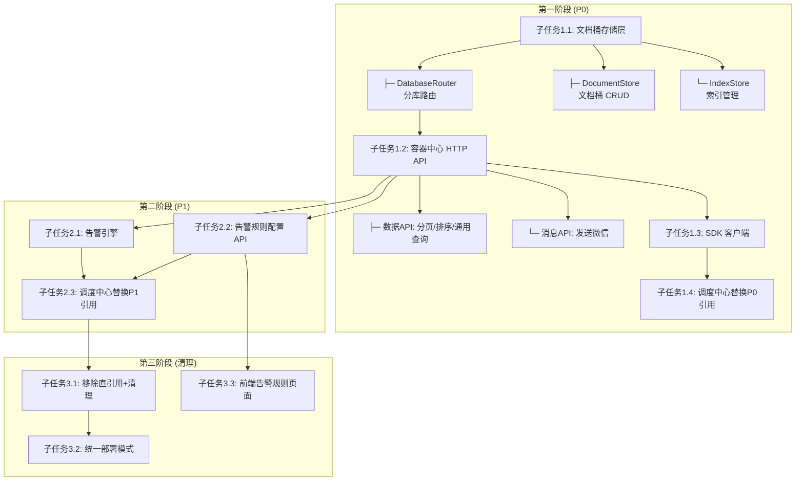

# 第四代文档桶存储 + 容器中心/调度中心解耦合方案

## 一、目标架构总览

```

---

### 2.4 制造业全业务域分库路由设计

每个业务域一个独立的 SQLite 文件，内部 4 张表结构完全一致（tbl_documents / tbl_indexes / tbl_configs / tbl_alerts）。

```
data/
│
├── orders.db              ← 订单/任务域
│   └── tbl_documents (doc_type: sale_order, work_order, outsource_order)
│
├── production.db          ← 生产执行域
│   └── tbl_documents (doc_type: production_plan, production_schedule,
│                       work_report, process_route, bom)
│
├── equipment.db           ← 设备域
│   └── tbl_documents (doc_type: equipment, equipment_param,
│                       equipment_status, inspection_record, energy_consumption)
│
├── maintenance.db         ← 维修/保养域
│   └── tbl_documents (doc_type: maintenance_plan, maintenance_record,
│                       repair_ticket, repair_record, spare_part)
│
├── inventory.db           ← 仓储库存域
│   └── tbl_documents (doc_type: material, warehouse, inventory_stock,
│                       inbound_order, outbound_order, inventory_check, stock_transfer)
│
├── procurement.db         ← 采购域
│   └── tbl_documents (doc_type: purchase_order, purchase_request,
│                       purchase_receipt, contract)
│
├── quality.db             ← 质量域
│   └── tbl_documents (doc_type: inspection_plan, inspection_result,
│                       non_conforming, quality_defect, quality_report)
│
├── settlement.db          ← 结算/财务域
│   └── tbl_documents (doc_type: settlement_sheet, invoice,
│                       payment_record, cost_center)
│
├── customer.db            ← 客户域
│   └── tbl_documents (doc_type: customer, contract, customer_feedback, after_sale)
│
├── supplier.db            ← 供应商域
│   └── tbl_documents (doc_type: supplier, supplier_quote, supplier_eval)
│
├── hr.db                  ← 人员域
│   └── tbl_documents (doc_type: employee, operator, attendance, skill_cert, shift_schedule)
│
└── system.db              ← 系统配置域
    └── tbl_documents (doc_type: alert_config, system_config, audit_log,
                        message_template, department, code_table)
```

#### 2.4.1 doc_type → 数据库完整路由表

```yaml
doc_type_routing:
  # ===== orders.db =====
  sale_order: orders
  work_order: orders
  outsource_order: orders

  # ===== production.db =====
  production_plan: production
  production_schedule: production
  work_report: production
  process_route: production
  bom: production

  # ===== equipment.db =====
  equipment: equipment
  equipment_param: equipment
  equipment_status: equipment
  inspection_record: equipment
  energy_consumption: equipment

  # ===== maintenance.db =====
  maintenance_plan: maintenance
  maintenance_record: maintenance
  repair_ticket: maintenance
  repair_record: maintenance
  spare_part: maintenance

  # ===== inventory.db =====
  material: inventory
  warehouse: inventory
  inventory_stock: inventory
  inbound_order: inventory
  outbound_order: inventory
  inventory_check: inventory
  stock_transfer: inventory

  # ===== procurement.db =====
  purchase_order: procurement
  purchase_request: procurement
  purchase_receipt: procurement
  contract: procurement  # 采购合同

  # ===== quality.db =====
  inspection_plan: quality
  inspection_result: quality
  non_conforming: quality
  quality_defect: quality
  quality_report: quality

  # ===== settlement.db =====
  settlement_sheet: settlement
  invoice: settlement
  payment_record: settlement
  cost_center: settlement

  # ===== customer.db =====
  customer: customer
  contract: customer  # 销售合同（注意：与采购合同同名不同库）
  customer_feedback: customer
  after_sale: customer

  # ===== supplier.db =====
  supplier: supplier
  supplier_quote: supplier
  supplier_eval: supplier

  # ===== hr.db =====
  employee: hr
  operator: hr
  attendance: hr
  skill_cert: hr
  shift_schedule: hr

  # ===== system.db =====
  alert_config: system
  system_config: system
  audit_log: system
  message_template: system
  department: system
  code_table: system
```

#### 2.4.2 DatabaseRouter 实现

```python
# container_center/storage/router.py

import os
import sqlite3
from threading import Lock
from contextlib import contextmanager

DATA_DIR = os.getenv('CC_DATA_DIR', 'data')

# doc_type → 数据库文件映射
DB_FILE_MAP = {
    'orders':       'orders.db',
    'production':   'production.db',
    'equipment':    'equipment.db',
    'maintenance':  'maintenance.db',
    'inventory':    'inventory.db',
    'procurement':  'procurement.db',
    'quality':      'quality.db',
    'settlement':   'settlement.db',
    'customer':     'customer.db',
    'supplier':     'supplier.db',
    'hr':           'hr.db',
    'system':       'system.db',
}

# 完整 doc_type → db_name 路由
ROUTING_TABLE = {
    # orders
    'sale_order': 'orders',
    'work_order': 'orders',
    'outsource_order': 'orders',
    # production
    'production_plan': 'production',
    'production_schedule': 'production',
    'work_report': 'production',
    'process_route': 'production',
    'bom': 'production',
    # equipment
    'equipment': 'equipment',
    'equipment_param': 'equipment',
    'equipment_status': 'equipment',
    'inspection_record': 'equipment',
    'energy_consumption': 'equipment',
    # maintenance
    'maintenance_plan': 'maintenance',
    'maintenance_record': 'maintenance',
    'repair_ticket': 'maintenance',
    'repair_record': 'maintenance',
    'spare_part': 'maintenance',
    # inventory
    'material': 'inventory',
    'warehouse': 'inventory',
    'inventory_stock': 'inventory',
    'inbound_order': 'inventory',
    'outbound_order': 'inventory',
    'inventory_check': 'inventory',
    'stock_transfer': 'inventory',
    # procurement
    'purchase_order': 'procurement',
    'purchase_request': 'procurement',
    'purchase_receipt': 'procurement',
    # quality
    'inspection_plan': 'quality',
    'inspection_result': 'quality',
    'non_conforming': 'quality',
    'quality_defect': 'quality',
    'quality_report': 'quality',
    # settlement
    'settlement_sheet': 'settlement',
    'invoice': 'settlement',
    'payment_record': 'settlement',
    'cost_center': 'settlement',
    # customer
    'customer': 'customer',
    'customer_feedback': 'customer',
    'after_sale': 'customer',
    # supplier
    'supplier': 'supplier',
    'supplier_quote': 'supplier',
    'supplier_eval': 'supplier',
    # hr
    'employee': 'hr',
    'operator': 'hr',
    'attendance': 'hr',
    'skill_cert': 'hr',
    'shift_schedule': 'hr',
    # system
    'alert_config': 'system',
    'system_config': 'system',
    'audit_log': 'system',
    'message_template': 'system',
    'department': 'system',
    'code_table': 'system',
}

class DatabaseRouter:
    """根据 doc_type 路由到对应的 SQLite 文件"""

    def __init__(self, data_dir=DATA_DIR):
        self.data_dir = data_dir
        os.makedirs(data_dir, exist_ok=True)
        self._connections = {}
        self._locks = {}

    def resolve_db_name(self, doc_type: str) -> str:
        """根据 doc_type 返回 db_name"""
        return ROUTING_TABLE.get(doc_type, 'system')

    def resolve_db_path(self, doc_type: str) -> str:
        """根据 doc_type 返回完整 .db 文件路径"""
        db_name = self.resolve_db_name(doc_type)
        filename = DB_FILE_MAP.get(db_name, 'system.db')
        return os.path.join(self.data_dir, filename)

    def get_connection(self, doc_type: str):
        """获取对应库的 SQLite 连接（懒加载，复用连接）"""
        db_path = self.resolve_db_path(doc_type)
        if db_path not in self._connections:
            conn = sqlite3.connect(db_path, check_same_thread=False)
            conn.row_factory = sqlite3.Row
            conn.execute("PRAGMA journal_mode=WAL")
            conn.execute("PRAGMA foreign_keys=ON")
            self._connections[db_path] = conn
            self._locks[db_path] = Lock()
        return self._connections[db_path]

    def get_lock(self, doc_type: str):
        """获取对应库的写锁"""
        db_path = self.resolve_db_path(doc_type)
        return self._locks.setdefault(db_path, Lock())

    def get_all_db_names(self) -> list:
        """列出所有数据库名称（用于跨库查询）"""
        return list(DB_FILE_MAP.keys())

    @contextmanager
    def get_db_cursor(self, doc_type: str):
        """获取带写锁的 cursor（context manager）"""
        conn = self.get_connection(doc_type)
        lock = self.get_lock(doc_type)
        with lock:
            cursor = conn.cursor()
            try:
                yield cursor
                conn.commit()
            except Exception:
                conn.rollback()
                raise
            finally:
                cursor.close()

    def close_all(self):
        """关闭所有连接（应用退出时调用）"""
        for conn in self._connections.values():
            conn.close()
        self._connections.clear()
```

#### 2.4.3 隔离与性能保障

| 特性 | 实现方式 |
|------|---------|
| 读写隔离 | 每个库独立 SQLite 连接，独立写锁 |
| 故障隔离 | 一个库损坏不影响其他库 |
| 连接复用 | 懒加载 + 缓存连接，不反复开关文件 |
| 写安全 | 每个库一把 Lock，context manager 自动提交/回滚 |
| 存储位置 | 通过 `CC_DATA_DIR` 环境变量配置，默认 `data/` |
| 跨库查询 | 遍历所有库合并结果（见 2.5） |

#### 2.4.4 当前系统已有数据归属

| 现有数据 | 归入库 | doc_type |
|---------|--------|---------|
| 工单任务 | orders.db | `work_order` |
| 外协单 | orders.db | `outsource_order` |
| 操作员 | hr.db | `operator` |
| 告警记录 | orders.db | —（tbl_alerts 在 orders 库里） |
| 告警规则 | system.db | `alert_config` |
| 质检记录 | quality.db | `inspection_result` |
| 消息模板 | system.db | `message_template` |

### 2.5 跨库查询策略

API 层提供两种查询模式：

```
# 单库查询（默认）
GET /api/container/data?doc_type=work_order&status=pending
    → 只查 orders.db，速度最快

# 跨库查询（加 all=true）
GET /api/container/data?all=true&q=keyword
    → 遍历所有库，合并结果，按时间排序
    → 适用于全局搜索场景
```

```python
def query_documents(doc_type=None, all=False, filters=None):
    if all:
        # 跨库查询：遍历所有库
        results = []
        for db_name in router.get_all_db_names():
            # 通过 doc_type 前缀过滤对应库
            # 实际路由根据各库的业务 doc_type 范围
            pass
        # 合并、去重、排序
        return sorted(results, key=lambda r: r['updated_at'], reverse=True)
    else:
        # 单库查询：直接路由到对应库
        db = router.get_connection(doc_type)
        return db.query(...)
```
                         ┌────────────────────────────────────────┐
                         │           企业微信云端                  │
                         │         wechat_cloud:5006              │
                         └────────────────┬───────────────────────┘
                                          │ POST/GET
                                          ▼
┌─────────────────────────────────────────────────────────────────────────┐
│                    容器中心 (container_center_api:5002)                  │
│                                                                         │
│  ┌─────────────────┐  ┌──────────────────┐  ┌───────────────────────┐  │
│  │ CloudPoller      │  │ 告警引擎           │  │ ★ 第四代文档存储+分库  │  │
│  │  ├─ 轮询云端     │  │  ├─ 超时检测       │  │  ├─ data/             │  │
│  │  └─ 发送消息     │  │  ├─ 外协催单       │  │  │  ├─ orders.db      │  │
│  └─────────────────┘  │  └─ 发送告警通知    │  │  │  ├─ equipment.db   │  │
│                        └──────────────────┘  │  │  ├─ inventory.db    │  │
│                                               │  │  ├─ quality.db      │  │
│  ┌────────────────────────────────────────┐  │  │  ├─ settlement.db   │  │
│  │ 容器中心 HTTP API (按业务域分组)         │  │  │  ├─ maintenance.db │  │
│  │  ┌──────┐┌──────┐┌──────┐┌────────┐  │  │  │  ├─ ... (12个库)   │  │
│  │  │消息API││数据API││告警API││配置API  │  │  │  └─ system.db       │  │
│  │  │/send ││/data ││/alert││/config │  │  │  └───────────────────│  │
│  │  └──────┘└──────┘└──────┘└────────┘  │  │                      │  │
│  └────────────────────────────────────────┘  │                      │  │
└─────────┬──────────┬──────────┬───────────────┬──────────────────────┘
          │          │          │               │
    ┌─────▼──┐ ┌─────▼──┐ ┌─────▼──┐     ┌─────▼──────────┐
    │调度中心  │ │设备检测  │ │库存管理  │     │结算中心平台      │
    │:5003   │ │系统     │ │系统     │     │                │
    │纯流程编排│ │SDK调用 │ │SDK调用 │     │SDK调用         │
    └────────┘ └────────┘ └────────┘     └────────────────┘
                                                            
    ┌──────────┐  ┌────────────┐  ┌────────────┐
    │采购系统   │  │质量管理系统 │  │其他未来系统  │
    │SDK调用   │  │SDK调用     │  │SDK调用      │
    └──────────┘  └────────────┘  └────────────┘

注：未来新增系统只需在容器中心注册 doc_type，零代码改造
    每个系统通过 ContainerCenterClient SDK 与容器中心通信
```

---

## 二、第四代文档桶存储设计

### 2.1 表结构

```sql
-- ============ 主表：文档桶 ============
CREATE TABLE tbl_documents (
    id          TEXT PRIMARY KEY,          -- UUID v4
    doc_type    TEXT NOT NULL,             -- 文档类型: 'work_order' / 'outsource' / 'inspection' / 'repair' / 'alert_config' / 'operator' / ...
    doc_data    TEXT NOT NULL,             -- 完整 JSON 数据（业务数据全部在此）
    status      TEXT DEFAULT 'pending',    -- 冗余索引字段（高频过滤用）
    created_at  TEXT NOT NULL,             -- ISO 8601
    updated_at  TEXT NOT NULL              -- ISO 8601
);

-- ============ 索引表：按需建立高频查询索引 ============
CREATE TABLE tbl_indexes (
    id          INTEGER PRIMARY KEY AUTOINCREMENT,
    doc_type    TEXT NOT NULL,             -- 文档类型
    doc_id      TEXT NOT NULL REFERENCES tbl_documents(id),
    key_name    TEXT NOT NULL,             -- 索引字段名（如 'order_no' / 'operator_id' / 'promised_date'）
    key_value   TEXT NOT NULL              -- 索引字段值
);
CREATE INDEX idx_indexes_lookup ON tbl_indexes(doc_type, key_name, key_value);

-- ============ 配置表：告警规则、全局配置 ============
CREATE TABLE tbl_configs (
    config_name TEXT PRIMARY KEY,          -- 配置名称（如 'alert_overdue_rules' / 'outsource_remind_config' / 'operators'）
    config_data TEXT NOT NULL,             -- JSON 配置内容
    version     INTEGER DEFAULT 1,
    updated_at  TEXT NOT NULL
);

-- ============ 告警记录表 ============
CREATE TABLE tbl_alerts (
    id          TEXT PRIMARY KEY,          -- UUID v4
    alert_type  TEXT NOT NULL,             -- 'overdue' / 'outsource_overdue' / 'outsource_remind'
    doc_id      TEXT,                      -- 关联的文档ID
    title       TEXT NOT NULL,             -- 告警标题
    content     TEXT NOT NULL,             -- 告警内容
    level       TEXT NOT NULL DEFAULT 'WARNING',  -- INFO / WARNING / CRITICAL
    dismissed   INTEGER DEFAULT 0,         -- 0=未处理 1=已忽略
    created_at  TEXT NOT NULL
);
```

### 2.2 零运维保障

| 业务变化场景 | 需要做的操作 |
|-------------|------------|
| 主软件新增字段 | **0 操作**，自动写入 doc_data JSON |
| 主软件删除字段 | **0 操作**，旧数据不变，新数据不写 |
| 主软件改字段名 | **0 操作**，JSON 自然携带新名称 |
| 新增一种业务类型 | **0 操作**，新 doc_type 自动入库 |
| 需要按新字段快速查询 | 插入一条索引配置（运维后台点一下，或 API 自动注册） |

### 2.3 存储层代码结构

```
container_center/
├── __init__.py
├── app.py                    # Flask 应用入口
├── config.py                 # 配置管理
├── storage/
│   ├── __init__.py
│   ├── base.py               # BaseStorage 抽象类
│   ├── router.py             # ⭐ 分库路由：doc_type → SQLite 文件映射
│   ├── document_store.py     # 文档桶 (tbl_documents CRUD)
│   ├── index_store.py        # 索引管理 (tbl_indexes)
│   ├── config_store.py       # 配置存储 (tbl_configs)
│   ├── alert_store.py        # 告警记录 (tbl_alerts)
│   └── sqlite_storage.py     # SQLite 实现
├── services/
│   ├── __init__.py
│   ├── cloud_poller.py       # 云端轮询（从 container_center 管理）
│   ├── alert_engine.py       # 告警引擎（超时检测+外协催单）
│   └── message_service.py    # 消息发送服务（包装 CloudPoller）
├── api/
│   ├── __init__.py
│   ├── data_api.py           # /api/container/data/* 数据CRUD
│   ├── alert_api.py          # /api/container/alert/* 告警记录查询+规则配置
│   ├── config_api.py         # /api/container/config/* 配置读写
│   ├── message_api.py        # /api/container/message/* 发送消息
│   └── distribute_api.py     # /api/container/distribute/* 分配接口
├── client/
│   └── container_client.py   # SDK 客户端（调度中心等外部模块使用）
└── models.py                 # DataPackage 等数据模型
```

---

## 三、直引用 → API 调用改造映射表

### 3.1 调度中心当前引用映射

当前 `_get_container_center()` 获取 cc 后，通过 cc.storage/cc.distributor 等直接操作，全部替换为 HTTP API：

| 当前直引用 | 出现次数 | 替换为容器中心 API | 优先级 |
|-----------|:-------:|------------------|:------:|
| `cc.storage.get_packages(limit=N)` | 6处 | `GET /api/container/data?doc_type=&limit=N` | P0 |
| `cc.storage.get_package(id)` | 3处 | `GET /api/container/data/<id>` | P0 |
| `cc.storage.save_package(pkg)` | 2处 | `POST /api/container/data` | P0 |
| `cc.storage.update_package(id, fields)` | 3处 | `PUT /api/container/data/<id>` | P0 |
| `cc.storage.update_package_status(id, status)` | 2处 | `PUT /api/container/data/<id>/status` | P0 |
| `cc.distributor.distribute(task_id, operator_id)` | 4处 | `POST /api/container/distribute` | P1 |
| `cc.config.get_all_operators()` | 1处 | `GET /api/container/config/operators` | P1 |
| `cc.config.get_operators_by_department(dept)` | 1处 | `GET /api/container/config/operators?department=xxx` | P1 |
| `cc.collect_outsource(...)` | 1处 | `POST /api/container/data` (以新 doc_type 写入) | P1 |
| `_send_wechat_via_cloud(...)` | 3处直接+~15处间接 | `POST /api/container/message/send` | P0 |
| `_check_overdue_tasks()` | 定时器调用 | 移到容器中心告警引擎 | P1 |
| `_check_outsource_reminders()` | 定时器调用 | 移到容器中心告警引擎 | P1 |
| 告警规则配置管理 | N/A | `GET/PUT /api/container/config/alert_rules` | P1 |
| 告警列表查询 | 1处 | `GET /api/container/alert/list` | P1 |
| 告警忽略 | 1处 | `POST /api/container/alert/<id>/dismiss` | P1 |

### 3.2 优先级的含义

- **P0（第一阶段）**：数据读写 + 消息发送，替换后调度中心可以独立运行
- **P1（第二阶段）**：分发/配置/告警引擎迁移，完成全部解耦

---

## 四、分阶段实施计划

### 第一阶段：存储改造 + 核心 API（2-3天）

#### 子任务 1.1：实现第四代文档桶存储层（含分库路由）

**输入**：`container_center_v5.py` / `storage_layer.py` 的现有存储逻辑  
**输出**：`container_center/storage/` 下的文档桶存储实现

需要保留的兼容性：
- `get_packages(**filters)` 返回格式兼容现有 dict 格式
- `get_package(id)` 返回统一格式
- `save_package(pkg)` / `update_package(id, fields)` 等操作语义一致

核心实现文件：

| 文件 | 职责 | 说明 |
|------|------|------|
| `router.py` | 分库路由 | doc_type → db 映射，连接池管理，写锁控制 |
| `document_store.py` | 文档桶 CRUD | 调 router.get_db_cursor() 操作 tbl_documents |
| `index_store.py` | 索引管理 | tbl_indexes 自动维护高频索引 |
| `config_store.py` | 配置读写 | tbl_configs 的 CRUD |
| `alert_store.py` | 告警记录 | tbl_alerts 的写入和查询 |

分库路由要点：
- `DatabaseRouter` 根据 doc_type 自动路由到对应 .db 文件
- 每个库独立连接 + 独立 Lock，实现读写隔离
- `@contextmanager get_db_cursor(doc_type)` 统一管理事务
- 通过 `CC_DATA_DIR` 环境变量配置数据目录

#### 子任务 1.2：实现容器中心 HTTP API

**输入**：映射表中 P0 级的 API 需求  
**输出**：`container_center/api/` 下的数据API + 消息API

核心端点：

```
# ──────── 文档 CRUD（带分页/排序/通用过滤）────────
POST   /api/container/data                            # 创建文档
GET    /api/container/data                            # ⭐ 通用查询（支持分页/排序/文档类型过滤）
       ?doc_type=work_order                           #   (必选)文档类型
       &status=pending                                #   (可选)按状态过滤
       &q=keyword                                     #   (可选)全文搜索 doc_data JSON
       &page=1&size=50                                #   (可选)分页，默认 size=50
       &sort=-updated_at                              #   (可选)排序字段，-前缀=倒序
       &all=true                                      #   (可选)跨库搜索，遍历所有库
GET    /api/container/data/<id>                       # 查询单个文档
PUT    /api/container/data/<id>                       # 更新文档字段（局部更新，合并到 doc_data）
PUT    /api/container/data/<id>/status                # 更新文档状态
DELETE /api/container/data/<id>                       # 删除文档

# ──────── 消息发送 ────────
POST   /api/container/message/send                    # 发送微信消息
```

通用查询 API 响应格式：

```json
{
    "data": [...],
    "page": 1,
    "size": 50,
    "total": 1280,
    "total_pages": 26
}
```

#### 子任务 1.3：实现 SDK 客户端

**输入**：P0 级 API 定义  
**输出**：`container_center/client/container_client.py`

```python
class ContainerCenterClient:
    """容器中心 HTTP API 的 Python SDK 客户端"""
    
    def __init__(self, base_url: str, secret: str):
        self.base_url = base_url.rstrip('/')
        self.secret = secret
    
    # ─── 通用文档 CRUD（适用于所有 doc_type）───
    def query_documents(self, doc_type: str, status=None, q=None,
                        page=1, size=50, sort='-updated_at',
                        all=False) -> Dict:
        """通用查询，支持分页/排序/全文搜索
           返回: {"data": [...], "page": 1, "size": 50, "total": N, "total_pages": N}
        """
        ...
    
    def get_document(self, doc_id: str) -> Dict: ...
    def create_document(self, doc_type: str, data: Dict) -> Dict: ...
    def update_document(self, doc_id: str, fields: Dict) -> Dict: ...
    def update_document_status(self, doc_id: str, status: str) -> Dict: ...
    def delete_document(self, doc_id: str) -> bool: ...
    
    # ─── 兼容方法（调度中心原有调用不改名）───
    def get_packages(self, doc_type='work_order', status=None, limit=100) -> List[Dict]:
        """兼容旧接口，内部调 query_documents"""
        result = self.query_documents(doc_type=doc_type, status=status, size=limit)
        return result['data']
    
    def get_package(self, pkg_id: str) -> Dict:
        return self.get_document(pkg_id)
    
    def save_package(self, data: Dict) -> Dict:
        return self.create_document(doc_type='work_order', data=data)
    
    # ─── 消息发送 ───
    def send_message(self, content: str, to: str, msg_type: str = 'markdown') -> Dict: ...
```

#### 子任务 1.4：调度中心替换 P0 级直引用

将 `dispatch_center.py` 中所有 `cc.storage.xxx()` 替换为 `ContainerCenterClient` 调用。

---

### 第二阶段：解耦告警引擎 + 配置API（1-2天）

#### 子任务 2.1：实现告警引擎

将 `dispatch_center.py` 中的 `_check_overdue_tasks()` 和 `_check_outsource_reminders()` 移到容器中心的 `alert_engine.py`

```python
class AlertEngine:
    def __init__(self, document_store, alert_store, message_service, config_store):
        ...
    
    def check_overdue_tasks(self) -> List[Dict]: ...
    def check_outsource_reminders(self) -> List[Dict]: ...
    def start(self, interval_seconds=60): ...   # 启动后台线程
    def stop(self): ...
```

#### 子任务 2.2：实现告警规则配置 API

```
GET    /api/container/config/alert_rules         # 获取告警规则
PUT    /api/container/config/alert_rules         # 配置告警规则
GET    /api/container/config/outsource_rules     # 获取外协催单规则
PUT    /api/container/config/outsource_rules     # 配置外协催单规则
GET    /api/container/alert/list                 # 获取告警记录列表
POST   /api/container/alert/<id>/dismiss         # 忽略告警
```

#### 子任务 2.3：调度中心替换 P1 级引用

分发、配置读取等替换为 SDK 客户端调用。

---

### 第三阶段：部署模式整合 + 配置CRUD + 清理（1天）

#### 子任务 3.1：调度中心移除直引用 + 清理代码

- 删除 `_get_container_center()` 函数
- 删除 `_send_wechat_via_cloud()` 函数（全部走消息API）
- 删除调度中心中的 `start_background_scheduler` 定时器（告警引擎已迁移）
- 删除 `integration/timeout_reminder.py`（功能已合并到告警引擎）

#### 子任务 3.2：统一部署模式

```
生产部署（目前）:
  container_center_api.py → 独立进程 :5002（数据+告警+消息）
  wechat_server.py        → 独立进程 :5003（仅调度流程）
  
开发/单机部署:
  app.py → 整合启动（容器中心 + 调度中心在同一个 Flask 进程，通过 SDK 内部路由）

部署配置:
  CONTAINER_CENTER_URL=http://localhost:5002  # 调度中心通过此 URL 连接容器中心
```

#### 子任务 3.3：前端告警规则配置页面

在调度中心页面增加「告警规则配置」页面，通过容器中心配置 API 读写规则。

---

## 五、数据迁移

### 5.1 迁移方案：就地迁移（不重建表）

```
当前: tbl_packages (固定DDL)
       ↓ 逐个读取，doc_data=现有pkg的完整dict
       ↓ doc_type='package'
       ↓ 写入 tbl_documents
       ↓ 同时在 tbl_indexes 建立高频索引
新:   tbl_documents (文档桶)
```

迁移脚本：`scripts/migrate_to_v4_storage.py`

### 5.2 读取时兼容

迁移期间，两个表同时存在。新增 API 优先读写 `tbl_documents`，读取时如果 `tbl_documents` 没有则回退到 `tbl_packages`。迁移完成确认无误后删除 `tbl_packages`。

---

## 六、安全与错误处理

### 6.1 API 鉴权

```python
# 容器中心 API 使用简单的内网鉴权
# 通过环境变量配置 SHARED_SECRET
# 调度中心每次请求在 Header 中携带 X-Auth-Token

headers = {
    'X-Auth-Token': hashlib.sha256(SHARED_SECRET.encode()).hexdigest(),
    'Content-Type': 'application/json'
}
```

### 6.2 错误处理

```python
# SDK 客户端统一错误处理
try:
    result = client.send_message(content, to)
except ContainerCenterConnectionError:
    logger.error("容器中心不可达，消息发送失败")
except ContainerCenterAuthError:
    logger.error("容器中心鉴权失败，检查 SHARED_SECRET")
except ContainerCenterAPIError as e:
    logger.error(f"容器中心API异常: {e}")
```

---

## 七、前后端影响清单

### 7.1 调度中心页面需要改的地方

| 页面功能 | 是否需要改 | 原因 |
|---------|:---------:|------|
| 任务列表 | 否 | 通过 SDK 获取数据，返回格式与原来一致 |
| 派单/转派 | 是 | 需要改成调容器中心分发API |
| 外协管理 | 是 | 外协催单配置移到容器中心告警规则配置 |
| 告警列表 | 否 | 通过 SDK 读取告警记录，格式不变 |
| **新增: 告警规则配置页** | **新增** | 调度中心页面增加规则配置区域 |
| 操作员管理 | 否 | 通过 SDK 读容器中心配置，格式不变 |
| 消息模板 | 否 | 模板库在 dispatch_center 本地，不受影响 |
| 消息发送 | 否 | SDK 包装了发送接口 |
| 流程管理 | 否 | 流程引擎在 dispatch_center 本地 |

### 7.2 需要新增的前端页面

在调度中心页面中增加「告警配置」入口，包含：

```
告警规则配置
├── 超时告警
│   ├── 启用/禁用开关
│   ├── 超时时间阈值（分钟）
│   ├── 提醒间隔（分钟）
│   └── 最大提醒次数
├── 外协催单
│   ├── 启用/禁用开关
│   ├── 提醒天数（逗号分隔，如 3,2,1）
│   └── 提醒时间点（逗号分隔，如 08:00,13:30）
└── 告警列表
    ├── 告警级别筛选
    ├── 告警类型筛选
    └── 忽略操作
```

---

## 八、依赖图



---

## 九、多系统架构接入总览

```
┌──────────────────────────────────────────────────────────────────┐
│                    容器中心 (数据中台)                              │
│  port:5002                                                       │
│                                                                   │
│  ┌──────────── HTTP API 层 ────────────┐                          │
│  │ POST/GET /api/container/data       │   ← 通用文档 CRUD         │
│  │ POST /api/container/message/send   │   ← 消息发送              │
│  │ GET/PUT /api/container/config/*    │   ← 配置读写              │
│  │ GET/POST /api/container/alert/*    │   ← 告警管理              │
│  └────────────────────────────────────┘                          │
│                                                                   │
│  ┌──────────── 存储层 (12个分库) ─────────┐                       │
│  │ Router → doc_type 自动路由               │                       │
│  │ data/                                   │                       │
│  │  ├─ orders.db       ← 调度中心使用       │                       │
│  │  ├─ equipment.db    ← 设备检测系统使用   │                       │
│  │  ├─ inventory.db    ← 库存管理系统使用   │                       │
│  │  ├─ settlement.db   ← 结算平台使用       │                       │
│  │  ├─ quality.db      ← 质量系统使用       │                       │
│  │  ├─ maintenance.db  ← 维修系统使用       │                       │
│  │  ├─ procurement.db  ← 采购系统使用       │                       │
│  │  ├─ customer.db     ← 客户系统使用       │                       │
│  │  ├─ supplier.db     ← 供应商系统使用     │                       │
│  │  ├─ production.db   ← 生产执行使用       │                       │
│  │  ├─ hr.db           ← 人员系统使用       │                       │
│  │  └─ system.db       ← 全局配置           │                       │
│  └────────────────────────────────────────┘                       │
└──────────────────────────────────────────────────────────────────┘
```

每个外部系统只需：
1. 在自己的项目里 `pip install requests`（或直接用）
2. 实例化 `ContainerCenterClient(url, secret)`
3. 按自己的 `doc_type` 读写数据
4. **新增业务类型时零运维——改一下 doc_type 参数就行**

---

## 十、总结：影响范围

| 文件 | 改动类型 | 改动量 |
|------|---------|:------:|
| `container_center_v5.py` | **大量修改** | 存储逻辑抽到新模块，保留方法签名兼容性 |
| `container_center/storage/router.py` | **新增** | DatabaseRouter 分库路由实现 |
| `container_center/storage/document_store.py` | **新增** | 文档桶 CRUD（调 router） |
| `container_center/storage/index_store.py` | **新增** | 索引管理（tbl_indexes） |
| `container_center/storage/config_store.py` | **新增** | 配置存储（tbl_configs） |
| `container_center/storage/alert_store.py` | **新增** | 告警记录（tbl_alerts） |
| `container_center/client/container_client.py` | **新增** | SDK 客户端 |
| `container_center/api/data_api.py` | **新增** | 数据 API 路由（分页/排序/通用过滤） |
| `container_center/api/message_api.py` | **新增** | 消息发送 API |
| `container_center/api/alert_api.py` | **新增** | 告警 API |
| `container_center/api/config_api.py` | **新增** | 配置 API |
| `container_center/services/alert_engine.py` | **新增** | 告警引擎 |
| `container_center_v5.py` | **中等重构** | 方法签名保留，内部调新存储层 |
| `container_center_api.py` | **中等修改** | 引入新 API 模块 |
| `dispatch_center.py` | **中等修改** | 替换直引用为 SDK 调用，移除定时器 |
| `wechat_server.py` | **少量修改** | 移除直引用（如果有） |
| `app.py` | **少量修改** | 可选的统一启动模式 |
| `integration/timeout_reminder.py` | **删除** | 功能合并到告警引擎 |
| `cloud_poller.py` | **移动** | 移到 container_center/services/ |
| 前端模板 | **部分修改+新增** | 增加告警规则配置页面 |

> 新增"★"标记的文件共 12 个（均为 container_center/ 子目录下的新模块），不会破坏现有代码结构。
> 改造的文件 5 个（container_center_v5.py / container_center_api.py / dispatch_center.py / wechat_server.py / app.py）。
