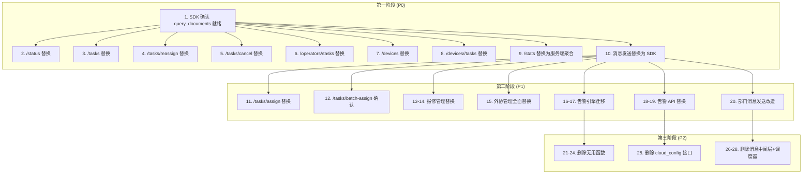

# 调度中心改造分析计划

> 依据: `DESIGN_第四代存储+解耦合.md`
> 目标文件: `dispatch_center.py` (2018行)

---

## 一、需要修改的功能

### 1.1 存储直引用 → SDK 客户端调用

所有 `_get_client().get_packages()`、`get_package()`、`save_package()` 等直引用容器中心存储层的方法，替换为 `ContainerCenterClient` 的 HTTP API 调用。

| # | 代码位置 | 当前方法 | 替换目标 | 优先级 |
|---|---------|---------|---------|:------:|
| 1 | `/status` L480 | `get_packages(limit=5000)` → 内存统计 | SDK `query_documents()` 带分页 | P0 |
| 2 | `/tasks` L629 | `get_packages(limit=5000)` → 内存分页 | `query_documents()` 服务端分页 | P0 |
| 3 | `/tasks/<id>/assign` L681 | `get_package(pkg_id=task_id)` | `get_document(task_id)` | P1 |
| 4 | `/tasks/<id>/reassign` L745-754 | `get_package()` + `save_package()` | `get_document()` + `update_document()` + `distribute()` | P0 |
| 5 | `/tasks/<id>/cancel` L790-795 | `get_package()` + `save_package()` | `get_document()` + `update_document_status()` | P0 |
| 6 | `/tasks/batch-assign` L818 | `distribute(task_id, operator_id)` | 保留（SDK 已有 distribute） | P1 |
| 7 | `/operators/<id>/tasks` L924 | `get_packages(limit=5000)` → 内存过滤 | `query_documents()` 服务端过滤 | P0 |
| 8 | `/devices` L1114 | `get_packages(limit=2000)` → 内存聚合 | `query_documents()` 服务端聚合 | P0 |
| 9 | `/devices/<id>/tasks` L1163 | `get_packages(limit=2000)` → 内存过滤 | `query_documents()` 服务端过滤 | P0 |
| 10 | `/processes` L1364 | `query_documents('schedule', all=True)` | **已有 SDK 写法，保留** | - |
| 11 | `/repair-records` L1596 | `get_packages(limit=1000)` → 内存过滤 | `query_documents(doc_type='repair')` | P1 |
| 12 | `/repair-records/<id>/complete` L1622 | `get_packages(limit=1000)` + `update_document_status()` | `update_document_status()` | P1 |
| 13 | `_get_outsource_records()` L1631 | `get_packages(limit=2000)` | `query_documents(doc_type='outsource')` | P1 |
| 14 | `/outsource-records/<id>` L1677 | `get_packages(limit=2000)` → 内存查找 | `get_document(record_id)` | P1 |
| 15 | `/outsource-records/<id>/assign` L1690 | `get_packages(limit=2000)` + `distribute()` | `distribute()` | P1 |
| 16 | `_update_outsource_extra()` L1699 | `get_packages(limit=2000)` + `update_document()` | `get_document()` + `update_document()` | P1 |
| 17 | `/stats` L1780 | `get_packages(limit=10000)` → **全量内存统计** | 改为服务端聚合查询 | P0 |
| 18 | `/alerts` L1837 | `get_packages(limit=5000)` → 内存超时检测 | `query_documents()` 服务端带条件查询 | P1 |
| 19 | `_check_overdue_tasks()` L1885 | `get_packages(limit=5000)` → 扫描全量 | **整体移到容器中心告警引擎** | P1 |
| 20 | `_check_outsource_reminders()` L1945 | `get_packages(limit=2000)` → 扫描外协 | **整体移到容器中心告警引擎** | P1 |

### 1.2 消息发送链路改造

所有通过本地 CloudPoller 直接发送消息的代码，改为调容器中心消息 API。

| # | 函数/路由 | 当前方式 | 替换目标 | 优先级 |
|---|----------|---------|---------|:------:|
| 1 | `_send_wechat_via_cloud()` L45-69 | 本地初始化 CloudPoller 直发 | `POST /api/container/message/send` | P0 |
| 2 | `_send_wechat_message()` L408-409 | 调 `_send_wechat_via_cloud` 发送全员 | 调客户端 `send_message()` | P0 |
| 3 | `_send_wechat_app_message()` L411-412 | 同上 | 同上 | P0 |
| 4 | `_send_to_department_members()` L414-452 | 先查部门成员，逐个发送 | 容器中心统一处理 | P1 |

### 1.3 配置管理改造

| # | 路由 | 当前方式 | 替换目标 | 优先级 |
|---|------|---------|---------|:------:|
| 1 | `/cloud/config` L530-576 | 读写本地 `cloud_config.json` | **容器中心统一配置管理**，去掉本地文件 | P2 |
| 2 | `/cloud/connection-test` L579-616 | 本地直接请求云端 | 通过容器中心配置 API 校验 | P2 |
| 3 | `/rules` save L1531-1552 | 写本地 JSON + `.env` | `POST /api/container/config/rules` | P2 |

### 1.4 告警管理改造

| # | 路由/函数 | 当前方式 | 替换目标 | 优先级 |
|---|----------|---------|---------|:------:|
| 1 | `/alerts` L1824-1858 | 读本地 JSON + 扫描全量任务 | 读容器中心告警记录 API | P1 |
| 2 | `/alerts/<id>/dismiss` L1861-1871 | 更新本地 JSON | 调容器中心告警忽略 API | P1 |

---

## 二、不需要的功能代码（可以删除）

### 2.1 可直接删除的函数

| # | 函数 | 行号 | 删除理由 |
|---|------|:----:|---------|
| 1 | `_get_container_center()` | L335-353 | 设计文档明确要求"移除直引用"，改为纯 SDK 调用 |
| 2 | `_get_message_hub()` | L355-360 | **从未被调用**（搜索全文零引用），遗留代码 |
| 3 | `_get_wechat_bot()` | L319-325 | 消息全部走容器中心，不再需要本地 bot 工厂 |
| 4 | `_get_wechat_app_bot()` | L327-332 | 同上 |
| 5 | `_get_schedule_storage()` | L389-390 | 仅返回 `_get_client()`，无实际用途 |

### 2.2 需迁移到容器中心的后台任务

| # | 函数 | 行号 | 迁移目标文件 |
|---|------|:----:|------------|
| 1 | `_check_overdue_tasks()` | L1882-1929 | `container_center/services/alert_engine.py` |
| 2 | `_check_outsource_reminders()` | L1932-1985 | `container_center/services/alert_engine.py` |
| 3 | `start_background_scheduler()` | L1991-2018 | `container_center/services/alert_engine.py` |

> 迁移后，调度中心不再包含定时告警逻辑，全部由容器中心统一管理。

### 2.3 不再需要的配置管理接口

| # | API 路由 | 行号 | 理由 |
|---|---------|:----:|------|
| 1 | `/cloud/config` (完整路由) | L530-576 | 本地云端配置→容器中心统一配置 API |
| 2 | `/cloud/connection-test` (完整路由) | L579-616 | 同上 |

### 2.4 不再需要的消息中间层

| # | 代码 | 位置 | 理由 |
|---|------|:----:|------|
| 1 | `_cloud_poller` 全局变量 | L43 | 消息发送全部走 SDK，不再需要本地 poller 实例 |
| 2 | `_send_wechat_via_cloud()` | L45-69 | 替换为 `client.send_message()` |
| 3 | 云端配置加载逻辑（cloud_config.json） | L52-61 | 配置统一由容器中心管理 |

---

## 三、不需要修改的功能（保留原样）

| # | 功能 | 代码区域 | 原因 |
|---|------|---------|------|
| 1 | **模板管理 CRUD** | `/messages/templates` L1190-1244 | 模板数据在调度中心本地 JSON 存储，不受分库影响 |
| 2 | **模板排序/偏好** | `/messages/templates/order` + `preference` L1247-1296 | 同上，纯本地操作 |
| 3 | **消息手动发送** | `/messages/send` L1299-1346 | 前端手动发送消息，通过 SDK 调容器中心（内部调 client）|
| 4 | **消息历史** | `/messages/history` L1349-1355 | 本地 JSON 记录，可保留 |
| 5 | **模板渲染引擎** | `_render_template()` L393-405 | 纯本地文本替换，无外部依赖 |
| 6 | **流程模板定义** | `PROCESS_FLOW_TEMPLATES` L233-266 | 本地定义，流程引擎在调度中心本地 |
| 7 | **流程编排逻辑** | `advance_process()` / `reject_process_step()` L1432-1512 | 流程推进/退回逻辑在调度中心，仅通知消息改为调 API |
| 8 | **操作员管理** | `/operators` CRUD L850-915 | 通过 SDK 调容器中心 config API，前端逻辑不变 |
| 9 | **报修类别管理** | `/repair-categories` L1555-1589 | 通过 `container_config` 管理，本地操作 |
| 10 | **外协配置** | `/outsource-config` L1748-1765 | 通过 `container_config` 管理，本地操作 |
| 11 | **分发日志** | `/dispatch-log` L1870-1879 | 本地 JSON 记录，可保留 |
| 12 | **前端页面** | `/` index L468-470 | 返回 HTML，无需修改 |
| 13 | **桌面回调** | `_send_desktop_callback()` L454-462 | 独立功能，不受影响 |
| 14 | **微信通讯录同步** | `/wechat/sync` L949-1053 | 直接请求云端 API，不经过容器中心 |
| 15 | **微信用户列表** | `/wechat/users` L1056-1105 | 同上，直接请求云端 |
| 16 | **操作员获取（`_get_operators`）** | L362-387 | 已在用 `_get_client().get_operators()`，保留 |
| 17 | **调度规则默认值** | `DISPATCH_RULES_DEFAULT` L74-84 | 本地默认值定义，不影响 |
| 18 | **消息模板默认值** | `MESSAGE_TEMPLATES_DEFAULT` L86-231 | 同上 |

---

## 四、分阶段实施计划

### 第一阶段（P0 — 必须先做的）

核心目标：调度中心可以脱离本地存储直引用，所有数据读写通过 SDK 走容器中心 HTTP API。

| 序号 | 改造项 | 涉及代码块 | 影响行数 | 估算工时 |
|:---:|-------|-----------|:-------:|:-------:|
| 1 | 确认 `_get_client()` SDK 已有 `query_documents()` 分页查询 | L35-41 | 5行 | 0.5h |
| 2 | `/status` L480: `get_packages()` → `query_documents()` | L473-527 | 15行 | 0.5h |
| 3 | `/tasks` L629: `get_packages()` → `query_documents()` 服务端分页 | L619-663 | 20行 | 0.5h |
| 4 | `/tasks/<id>/reassign` L745-754: `get_package+save_package` → SDK CRUD | L736-784 | 25行 | 0.5h |
| 5 | `/tasks/<id>/cancel` L790-795: 同上 | L787-804 | 15行 | 0.5h |
| 6 | `/operators/<id>/tasks` L924: `get_packages()` → `query_documents()` | L918-946 | 15行 | 0.5h |
| 7 | `/devices` L1114: `get_packages()` → `query_documents()` | L1108-1152 | 20行 | 0.5h |
| 8 | `/devices/<id>/tasks` L1163: 同上 | L1155-1187 | 20行 | 0.5h |
| 9 | `/stats` L1780: `get_packages(limit=10000)` → 服务端聚合 | L1768-1821 | 30行 | 1.0h |
| 10 | `_send_wechat_via_cloud()` L45-69: 本地 CloudPoller → SDK 消息 API | L45-69 | 25行 | 1.0h |

**第一阶段小计：10项，约190行，估算 6h**

### 第二阶段（P1 — 其次做）

核心目标：分发/外协/报修/告警管理全面切换，告警引擎迁移。

| 序号 | 改造项 | 涉及代码块 | 影响行数 | 估算工时 |
|:---:|-------|-----------|:-------:|:-------:|
| 1 | `/tasks/<id>/assign` L681: `get_package()` → SDK 调用 | L666-733 | 20行 | 0.5h |
| 2 | `/tasks/batch-assign` L818: 确认 SDK distribute 可用 | L807-847 | 15行 | 0.5h |
| 3 | `/repair-records` L1596: `get_packages()` → `query_documents()` | L1592-1617 | 20行 | 0.5h |
| 4 | `/repair-records/<id>/complete` L1622: 简化 | L1620-1627 | 10行 | 0.5h |
| 5 | `/outsource-records` 系列: 全部替换为 SDK CRUD | L1630-1745 | 80行 | 2.0h |
| 6 | 告警引擎 `_check_overdue_tasks()` 迁移 | L1882-1929 | 50行 | 2.0h |
| 7 | 外协催单 `_check_outsource_reminders()` 迁移 | L1932-1985 | 55行 | 2.0h |
| 8 | 告警列表 `/alerts` 改为读容器中心 API | L1824-1858 | 35行 | 1.0h |
| 9 | 告警忽略 `/alerts/<id>/dismiss` 改为调容器中心 | L1861-1871 | 15行 | 0.5h |
| 10 | `_send_to_department_members()` 通过容器中心发送 | L414-452 | 25行 | 0.5h |

**第二阶段小计：10项，约325行，估算 10h**

### 第三阶段（P2 — 最后清理）

核心目标：删除不再需要的代码，清理遗留逻辑。

| 序号 | 改造项 | 涉及代码 | 影响行数 | 估算工时 |
|:---:|-------|---------|:-------:|:-------:|
| 1 | 删除 `_get_container_center()` | L335-353 | 19行 | 0.2h |
| 2 | 删除 `_get_message_hub()` | L355-360 | 6行 | 0.1h |
| 3 | 删除 `_get_wechat_bot()` / `_get_wechat_app_bot()` | L319-332 | 14行 | 0.2h |
| 4 | 删除 `_get_schedule_storage()` | L389-390 | 2行 | 0.1h |
| 5 | 删除本地 cloud_config 接口（完整路由） | L530-616 | 87行 | 0.5h |
| 6 | 删除 `_cloud_poller` 全局变量和 `_send_wechat_via_cloud()` | L43-69 | 27行 | 0.3h |
| 7 | 删除 `start_background_scheduler()` | L1991-2018 | 28行 | 0.3h |
| 8 | 清理 `_alert_engine` 全局变量和相关 import | L1988-1989, L2001-2016 | ~20行 | 0.2h |

**第三阶段小计：8项，约203行，估算 2h**

---

## 五、汇总

| 分类 | 数量 | 行数估算 | 工时估算 |
|:----|:---:|:-------:|:--------:|
| 需要修改的调用点 | ~27 处 | ~515 行 | ~16h |
| 可以删除的代码 | ~12 处 | ~203 行 | ~2h |
| 保留不变的代码 | ~18 处 | ~500 行 | 0h |
| 需迁移到容器中心 | ~4 处 | ~135 行 | ~4h (含在修改中) |

**总计改造量：约 27 处代码改动 + 12 处删除，715 行受影响，估算 18 工时**

---

## 六、依赖关系

---

## 七、风险与注意事项

### 7.1 风险点
1. **SDK 方法就绪性**：部分方法（如 `distribute()`、`get_operators()`）是否已在 `ContainerCenterClient` 中实现，需在改造前确认
2. **`query_documents()` 服务端分页**：当前 SDK 的 `query_documents()` 是否支持 `page`/`size` 参数，如果支持则`/tasks` 路由可以大幅简化
3. **`/stats` 服务端聚合**：如果容器中心不提供聚合 API，需要评估是否在调度中心保持内存聚合，或新增容器中心聚合端点
4. **`_get_client()` vs `_get_container_center()`**：当前已有 `_get_client()` 返回 `ContainerCenterClient`，但某些地方仍用了旧方式，需统一

### 7.2 现有文件复用检查
- `ContainerCenterClient` 已存在 [container_center/client/container_client.py]
- `container_config.py` 操作员管理已存在，无需改动
- `cloud_poller.py` 消息发送功能将迁移到容器中心，不再通过调度中心初始化

### 7.3 安全注意事项
- 删除代码时注意不要误删仍然被引用的模块导入
- 消息发送改造后，确保 `SHARED_SECRET` 鉴权正确传递
- 外协/报修数据迁移到新 `doc_type` 时注意数据完整性
