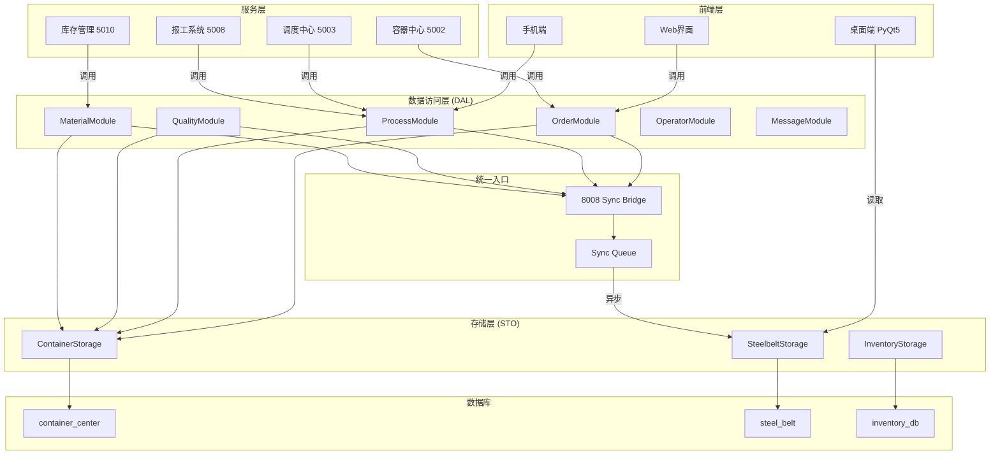
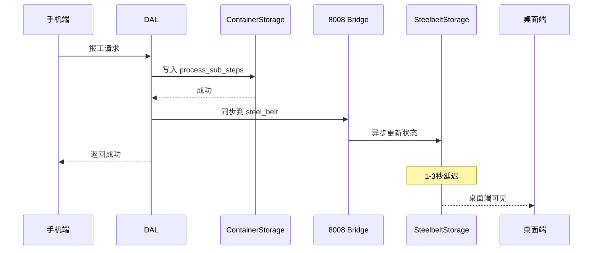
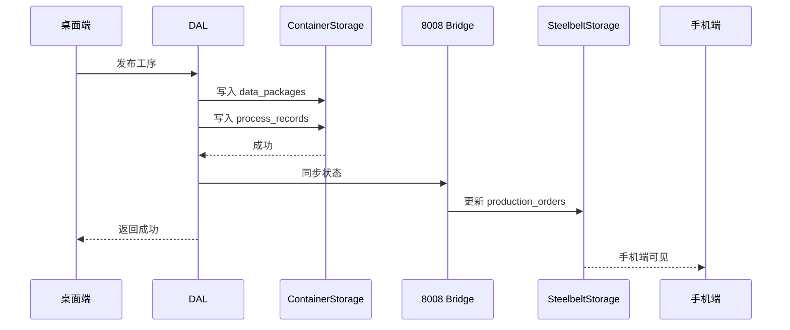

# ARCHITECT_全面模块化改造.md

> 文档版本：v1.2（2026-06-13 最终修正：5003 = 企业微信消息总线）
> 日期：2026-06-13

---

## 〇、改造约束

| 约束 | 说明 |
|------|------|
| 🚫 **不改名** | 现有函数、API、字段、URL 都不变 |
| 🚫 **不改前端** | HTML/JS/Vue/CSS 不变 |
| 🚫 **不改展示** | 前端展示页面不变 |
| ✅ **steel_belt 轻量** | 只存核心字段 |
| ✅ **不破坏功能** | 100% 兼容 |
| 🚫 **云端不调用 8008** | 云端服务（cloud_*.py）不直接调用 8008 桥接 |
| 🚫 **5003 = 企业微信消息总线** | **只有发送企业微信通知**必须经过 5003 |

**改造策略**：
- 新增模块/类
- 现有函数内部重写（签名不变）
- 前端零侵入

---

## 〇点五、统一调用路径（最终修正版）

### 5003 角色最终定义

**5003 调度中心 = 企业微信消息总线**

| 调用类型 | 路径 | 示例 |
|----------|------|------|
| **企业微信通知** | ✅ 必走 5003 | `notify.py:62` 必须改走 5003 |
| **报工同步** | 直调 8008 | `/api/sync/sub-step-report` |
| **状态变更** | 直调 8008 | `/api/sync/status-change` |
| **质检上报** | 直调 8008 | `/api/sync/quality-report` |
| **数据查询** | 直连本地表 | `orders_local` 等 |
| **库存管理** | 直连 inventory_db | 独立服务 |

### 服务间调用关系（最终版）

```
┌─────────────────────────────────────────────────────────────────────────┐
│                        服务间调用关系（最终版）                          │
├─────────────────────────────────────────────────────────────────────────┤
│                                                                         │
│   ┌─────────────┐                                                       │
│   │  桌面端 5000 │ → 读取 steel_belt（只读直连）                        │
│   └─────────────┘                                                       │
│                                                                         │
│   ┌─────────────┐  ┌─ 报工 → 直调 8008                                  │
│   │  手机端 5008 │ ─┤ 状态 → 直调 8008                                  │
│   └─────────────┘  └─ 查询 → 直连 container_center                      │
│                                                                         │
│   ┌─────────────┐  ┌─ 报工同步 → 直调 8008                              │
│   │  容器中心 5002│ ─┤ 状态同步 → 直调 8008                              │
│   └─────────────┘  └─ 查询 → 直连 container_center                      │
│                                                                         │
│   ┌─────────────┐  ── 独立管理 inventory_db                              │
│   │  库存管理 5010│                                                     │
│   └─────────────┘                                                       │
│                                                                         │
│   ┌─────────────┐  ┌─ 消息 → 5003 调度中心                              │
│   │  云端 5006   │ ─┤  （不允许调用 8008）                              │
│   └─────────────┘  └─ 独立服务                                          │
│                                                                         │
│   ┌─────────────────────────────────────────────────────────────┐     │
│   │  Sync Bridge 8008 (内部桥接)                                  │     │
│   │  - 5008/5002/5010 等服务直调                                  │     │
│   │  - 写入 steel_belt                                           │     │
│   └─────────────────────────────────────────────────────────────┘     │
│                              ↓                                         │
│   ┌─────────────────────────────────────────────────────────────┐     │
│   │  调度中心 5003 (企业微信消息总线)                            │     │
│   │  - 接收 notify.py 等微信通知请求                              │     │
│   │  - 调用企业微信 API                                           │     │
│   │  - 通知手机端 5008 / 桌面端 5000                              │     │
│   └─────────────────────────────────────────────────────────────┘     │
│                                                                         │
└─────────────────────────────────────────────────────────────────────────┘
```

### 约束规则（最终）

| 调用方 | 调用类型 | 调用目标 | 是否允许 |
|--------|----------|----------|----------|
| 桌面端 5000 | 数据读取 | steel_belt | ✅ |
| 手机端 5008 | 报工同步 | 8008 直调 | ✅ |
| 手机端 5008 | 状态同步 | 8008 直调 | ✅ |
| 手机端 5008 | 数据查询 | container_center | ✅ |
| 手机端 5008 | 微信通知 | 5003 | ✅ |
| 容器中心 5002 | 报工同步 | 8008 直调 | ✅ |
| 容器中心 5002 | 状态同步 | 8008 直调 | ✅ |
| 容器中心 5002 | 数据查询 | container_center | ✅ |
| 容器中心 5002 | 微信通知 | 5003 | ✅ |
| 库存管理 5010 | 库存 | inventory_db | ✅（独立） |
| 云端 5006 | 消息 | 5003 | ✅ |
| 云端 5006 | 云端通信 | 5006 自身 | ✅ |
| 云端 5006 | 8008 | ❌ 禁止 |
| 调度中心 5003 | 企业微信 API | 直连 | ✅ |

### 关键澄清（最终）

> **5003 = 企业微信消息总线**，不是所有消息入口。  
> **报工、状态等数据同步**直接调 8008 是允许的。  
> **只有发送企业微信通知**必须走 5003。  
> **库存管理**完全独立，不走 5003。  
> **数据查询**直接查本地表，不走 5003。

---

## 一、整体架构



---

## 二、模块详细设计

### 2.1 数据访问层 (DAL)

#### 目录结构

```
mobile_api_ai/
├── dal/                          # 数据访问层
│   ├── __init__.py              # 统一导出
│   ├── base.py                  # 模块基类
│   ├── order_module.py          # 订单模块
│   ├── process_module.py        # 工序模块
│   ├── quality_module.py        # 质检模块
│   ├── material_module.py       # 物料模块
│   ├── operator_module.py       # 人员模块
│   └── message_module.py        # 消息模块
```

#### 基类设计

```python
# dal/base.py
class BaseModule:
    """模块基类，所有业务模块继承"""

    def __init__(self):
        self.container_storage = ContainerStorage()
        self.steelbelt_storage = SteelbeltStorage()

    def _sync_to_steelbelt(self, data: dict):
        """统一同步到 steel_belt"""
        return sync_to_steelbelt_api(data)

    def _publish_event(self, event_type: str, data: dict):
        """发布事件"""
        EventBus.publish(event_type, data)
```

#### 模块接口

| 模块 | 方法 | 说明 |
|------|------|------|
| **OrderModule** | `create()`, `update()`, `get()`, `list()`, `archive()` | 订单管理 |
| **ProcessModule** | `publish()`, `report()`, `recall()`, `get_progress()` | 工序管理 |
| **QualityModule** | `create_task()`, `report()`, `get_result()` | 质检管理 |
| **MaterialModule** | `request()`, `confirm()`, `arrive()`, `deliver()` | 物料管理 |
| **OperatorModule** | `create()`, `get()`, `sign_in()`, `sign_out()` | 人员管理 |
| **MessageModule** | `send()`, `template()`, `broadcast()` | 消息管理 |

---

## 三、存储层设计 (STO)

### 3.1 ContainerStorage

```python
class ContainerStorage:
    """container_center 数据库存储"""

    def __init__(self):
        self.db = 'container_center'

    # 通用 CRUD
    def insert(self, table, data) -> int
    def update(self, table, data, where, params) -> int
    def delete(self, table, where, params) -> int
    def get(self, table, where, params) -> dict
    def list(self, table, where, params, order, limit) -> list

    # 专用方法
    def get_process_record(self, order_no) -> dict
    def save_process_record(self, data) -> bool
    def get_sub_steps(self, order_no) -> list
    def save_sub_step(self, data) -> bool
    def get_data_packages(self, data_type, order_no) -> list
```

### 3.2 SteelbeltStorage

```python
class SteelbeltStorage:
    """steel_belt 数据库存储（只通过 8008 写入）"""

    def __init__(self):
        self._api_base = 'http://localhost:8008/api/dal'

    # 只读方法（直接查询）
    def get_order(self, order_no) -> dict
    def get_production_order(self, order_no) -> dict
    def list_orders(self, filters) -> list

    # 写入方法（统一走 8008）
    def sync_order(self, data) -> bool
    def sync_production_status(self, data) -> bool
    def sync_operator(self, data) -> bool
```

### 3.3 InventoryStorage

```python
class InventoryStorage:
    """inventory_db 数据库存储"""

    def __init__(self):
        self.db = 'inventory_db'

    def get_inventory(self, material_code) -> dict
    def list_inventory(self, filters) -> list
    def inbound(self, data) -> bool
    def outbound(self, data) -> bool
    def get_logs(self, material_code) -> list
```

---

## 四、统一入口设计

### 4.1 8008 API 接口

```python
# /api/dal/sync-to-steelbelt
@dal_bp.route('/sync-to-steelbelt', methods=['POST'])
def api_sync_to_steelbelt():
    """
    统一同步到 steel_belt
    {
        "target": "production_orders" | "orders" | "operators",
        "data": {...},
        "sync_mode": "realtime" | "queue"
    }
    """
    # 1. 写入 container_center（本地）
    # 2. 写入 steel_belt（异步队列）
    # 3. 返回结果
```

### 4.2 同步队列

```python
# SyncQueue 队列结构
{
    "id": 1,
    "target": "production_orders",
    "data": {
        "order_no": "ORD-202606130001",
        "status": "in_production"
    },
    "status": "pending",
    "retry_count": 0,
    "created_at": "2026-06-13 10:00:00"
}
```

---

## 五、数据流向

### 5.1 报工流程



### 5.2 工序发布流程



---

## 六、模块化优势

| 优势 | 说明 |
|------|------|
| **可维护** | 每个模块职责单一，易于理解和修改 |
| **可测试** | 模块可独立测试，保证质量 |
| **可扩展** | 新增模块只需实现基类接口 |
| **可复用** | 模块可在不同服务间复用 |
| **解耦合** | 服务间通过模块交互，不直接依赖数据库 |
| **统一入口** | 所有写入走统一入口，数据一致 |

---

## 七、改造计划

### Phase 1: 基础层（已部分完成）

| 任务 | 状态 | 说明 |
|------|------|------|
| SSOT 本地表创建 | ✅ | orders_local 等 |
| 存储层封装 | ⬜ | ContainerStorage, SteelbeltStorage |
| 模块基类 | ⬜ | BaseModule |

### Phase 2: 核心模块

| 任务 | 模块 | 说明 |
|------|------|------|
| T1 | OrderModule | 订单管理模块 |
| T2 | ProcessModule | 工序管理模块 |
| T3 | QualityModule | 质检管理模块 |
| T4 | MaterialModule | 物料管理模块 |

### Phase 3: 支撑模块

| 任务 | 模块 | 说明 |
|------|------|------|
| T5 | OperatorModule | 人员管理模块 |
| T6 | MessageModule | 消息管理模块 |

### Phase 4: 统一入口

| 任务 | 说明 |
|------|------|
| T7 | 8008 统一 API |
| T8 | 同步队列优化 |
| T9 | 事件总线集成 |

---

## 八、文件结构

```
mobile_api_ai/
├── dal/                          # 数据访问层（新建）
│   ├── __init__.py
│   ├── base.py
│   ├── order_module.py
│   ├── process_module.py
│   ├── quality_module.py
│   ├── material_module.py
│   ├── operator_module.py
│   └── message_module.py
│
├── storage/                      # 存储层（改造）
│   ├── __init__.py
│   ├── base_storage.py          # 存储基类
│   ├── container_storage.py      # container_center 存储
│   ├── steelbelt_storage.py      # steel_belt 存储
│   ├── inventory_storage.py      # inventory 存储
│   └── mysql_storage.py          # 现有 MySQL 存储（兼容）
│
├── sync_bridge_server.py         # 8008 服务（改造）
│   ├── dal_bp.py                # DAL 统一入口蓝图
│   └── sync_queue.py            # 同步队列
│
├── dispatch_center/              # 调度中心（改造）
│   └── _core.py                 # 调用 DAL
│
├── app.py                        # 报工系统（改造）
│
├── container_center_api.py       # 容器中心（改造）
│
└── container_center_v5.py       # 核心逻辑（改造）
```
