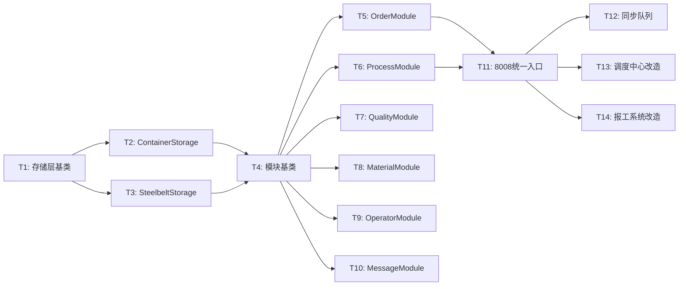

# TASK_全面模块化改造.md

> 文档版本：v1.0
> 日期：2026-06-13

---

## 〇、改造约束（必读）

| 约束 | 说明 |
|------|------|
| 🚫 **不改名** | 函数名、API 名、字段名、URL 都不变 |
| 🚫 **不改前端** | HTML/JS/Vue/CSS 都不变 |
| 🚫 **不改展示** | 工序、报工、质检等页面不变 |
| ✅ **steel_belt 轻量** | 只存核心字段，避免大字段 |
| ✅ **不破坏功能** | 100% 兼容现有 API |
| 🚫 **云端不调用 8008** | 云端服务（cloud_*.py）必须通过 5003 消息入口 |
| 🚫 **5003 消息入口** | **所有消息类调用**必须经过 5003 调度中心 |

**改造方式**：新增模块 + 内部重构 + 前端零侵入 + 5003 消息入口

---

## 一、任务总览

| 阶段 | 任务 | 模块 | 优先级 | 状态 |
|------|------|------|--------|------|
| **Phase 1** | T1 | 存储层基类 | HIGH | 待开始 |
| **Phase 1** | T2 | ContainerStorage | HIGH | 待开始 |
| **Phase 1** | T3 | SteelbeltStorage | HIGH | 待开始 |
| **Phase 1** | T4 | 模块基类 BaseModule | HIGH | 待开始 |
| **Phase 1** | T19 | 线程生命周期管理 | HIGH | 待开始 |
| **Phase 1** | T20 | 迁移脚本统一 | HIGH | 待开始 |
| **Phase 1** | T21 | 错误码/日志统一 | HIGH | 待开始 |
| **Phase 2** | T5 | OrderModule | HIGH | 待开始 |
| **Phase 2** | T6 | ProcessModule | HIGH | 待开始 |
| **Phase 2** | T7 | QualityModule | MEDIUM | 待开始 |
| **Phase 2** | T8 | MaterialModule | MEDIUM | 待开始 |
| **Phase 3** | T9 | OperatorModule | MEDIUM | 待开始 |
| **Phase 3** | T10 | MessageModule | LOW | 待开始 |
| **Phase 4** | T11 | 8008 统一入口（5003 消息入口） | HIGH | 待开始 |
| **Phase 4** | T12 | 同步队列优化 | MEDIUM | 待开始 |
| **Phase 5** | T13 | 调度中心改造（5003 消息入口） | HIGH | 待开始 |
| **Phase 5** | T14 | 报工系统改造 | HIGH | 待开始 |
| **Phase 5** | T15 | 容器中心改造 | HIGH | 待开始 |
| **Phase 5** | T16 | 库存管理改造 | MEDIUM | 待开始 |
| **Phase 5** | T17 | 云端服务改造（不调用 8008） | HIGH | 待开始 |
| **Phase 6** | T18 | 调用路径审计（确保 5003 消息入口） | HIGH | 待开始 |
| **Phase 6** | T22 | 测试用例新增（10+ 个） | HIGH | 待开始 |
| **Phase 6** | T23 | 调用路径审计脚本 | HIGH | 待开始 |
| **Phase 6** | T24 | 字段白名单验证 | HIGH | 待开始 |
| **Phase 6** | T25 | 回归测试 | MEDIUM | 待开始 |
| **Phase 7** | T26 | 灰度切换机制 | HIGH | 待开始 |
| **Phase 7** | T27 | 8008 降级方案 | HIGH | 待开始 |
| **Phase 7** | T28 | 监控告警点 | HIGH | 待开始 |
| **Phase 7** | T29 | 性能基准 | MEDIUM | 待开始 |
| **Phase 7** | T30 | 文档同步清单 | MEDIUM | 待开始 |

---

## 二、Phase 1: 基础层

### T1: 存储层基类

**文件**: `mobile_api_ai/storage/base_storage.py`

**功能**:
```python
class BaseStorage:
    """存储层基类"""

    def __init__(self, db_name: str):
        self.db_name = db_name
        self._conn = None

    def _get_connection(self):
        """获取数据库连接"""

    def _execute(self, sql: str, params: tuple) -> cursor:
        """执行 SQL"""

    def insert(self, table: str, data: dict) -> int:
        """插入数据"""

    def update(self, table: str, data: dict, where: str, params: tuple) -> int:
        """更新数据"""

    def delete(self, table: str, where: str, params: tuple) -> int:
        """删除数据"""

    def get(self, table: str, where: str, params: tuple) -> dict:
        """查询单条"""

    def list(self, table: str, where: str = None, params: tuple = None,
             order: str = None, limit: int = 100) -> list:
        """查询列表"""
```

**验收标准**:
- [ ] BaseStorage 可正常实例化
- [ ] insert/update/delete/get/list 方法正常工作
- [ ] 单元测试通过

---

### T2: ContainerStorage

**文件**: `mobile_api_ai/storage/container_storage.py`

**功能**:
```python
from .base_storage import BaseStorage

class ContainerStorage(BaseStorage):
    """container_center 数据库存储"""

    def __init__(self):
        super().__init__('container_center')

    # 流程记录
    def get_process_record(self, order_no: str) -> dict
    def save_process_record(self, data: dict) -> bool
    def update_process_status(self, order_no: str, status: str) -> int

    # 工序子步骤
    def get_sub_steps(self, order_no: str) -> list
    def save_sub_step(self, data: dict) -> bool
    def get_sub_step_by_order_step(self, order_no: str, step_name: str) -> dict

    # 任务包
    def get_data_packages(self, data_type: str = None, order_no: str = None) -> list
    def save_data_package(self, data: dict) -> bool
    def update_package_status(self, package_id: int, status: str) -> int

    # SSOT 本地表
    def get_order_local(self, order_no: str) -> dict
    def sync_order_to_local(self, data: dict) -> bool
    def get_production_order_local(self, order_no: str) -> dict

    # 质检
    def get_quality_records(self, order_no: str) -> list
    def save_quality_record(self, data: dict) -> bool

    # 人员
    def get_operator_local(self, name: str) -> dict
    def get_all_operators_local(self) -> list
```

**验收标准**:
- [ ] ContainerStorage 继承 BaseStorage
- [ ] 所有方法正常工作
- [ ] 单元测试通过

---

### T3: SteelbeltStorage

**文件**: `mobile_api_ai/storage/steelbelt_storage.py`

**功能**:
```python
import requests
from .base_storage import BaseStorage

class SteelbeltStorage(BaseStorage):
    """steel_belt 数据库存储（只读 + 统一写入）"""

    def __init__(self):
        super().__init__('steel_belt')
        self._api_base = 'http://localhost:8008/api/dal'

    # 只读方法（直接查询）
    def get_order(self, order_no: str) -> dict
    def list_orders(self, filters: dict = None) -> list
    def get_production_order(self, order_no: str) -> dict
    def list_production_orders(self, filters: dict = None) -> list

    # 写入方法（统一走 8008）
    def sync_order(self, data: dict) -> bool
    def sync_production_status(self, data: dict) -> bool
    def sync_operator(self, data: dict) -> bool

    # 内部方法
    def _call_api(self, endpoint: str, data: dict) -> dict
```

**验收标准**:
- [ ] 只读方法直接查询 steel_belt
- [ ] 写入方法统一走 8008 API
- [ ] 单元测试通过

---

### T4: 模块基类

**文件**: `mobile_api_ai/dal/base.py`

**功能**:
```python
import requests
from storage.container_storage import ContainerStorage
from storage.steelbelt_storage import SteelbeltStorage

class BaseModule:
    """模块基类"""

    def __init__(self):
        self.storage = ContainerStorage()
        self.steelbelt = SteelbeltStorage()
        self._api_base = 'http://localhost:8008/api/dal'

    def _sync_to_steelbelt(self, target: str, data: dict, sync_mode: str = 'queue') -> bool:
        """统一同步到 steel_belt"""
        try:
            resp = requests.post(
                f'{self._api_base}/sync-to-steelbelt',
                json={
                    'target': target,
                    'data': data,
                    'sync_mode': sync_mode
                },
                timeout=5
            )
            return resp.ok
        except Exception as e:
            logger.error(f'同步到 steel_belt 失败: {e}')
            return False

    def _publish_event(self, event_type: str, data: dict):
        """发布事件"""
        # TODO: 集成 EventBus
        pass
```

**验收标准**:
- [ ] BaseModule 可正常实例化
- [ ] _sync_to_steelbelt 方法正常工作
- [ ] 可被其他模块继承

---

## 三、Phase 2: 核心模块

### T5: OrderModule

**文件**: `mobile_api_ai/dal/order_module.py`

**功能**:
```python
from .base import BaseModule

class OrderModule(BaseModule):
    """订单管理模块"""

    def create(self, data: dict) -> dict:
        """创建订单"""
        # 1. 保存到 container_center
        # 2. 同步到 steel_belt
        # 3. 发布事件
        pass

    def update(self, order_no: str, data: dict) -> bool:
        """更新订单"""
        pass

    def get(self, order_no: str) -> dict:
        """获取订单"""
        return self.storage.get_order_local(order_no)

    def list(self, filters: dict = None) -> list:
        """订单列表"""
        return self.storage.get_all_orders_local()

    def archive(self, order_no: str) -> bool:
        """归档订单"""
        pass

    def update_status(self, order_no: str, status: str) -> bool:
        """更新订单状态"""
        pass
```

**验收标准**:
- [ ] create/update/get/list/archive/update_status 方法正常
- [ ] 数据正确保存到 container_center
- [ ] 状态同步到 steel_belt
- [ ] 单元测试通过

---

### T6: ProcessModule

**文件**: `mobile_api_ai/dal/process_module.py`

**功能**:
```python
from .base import BaseModule

class ProcessModule(BaseModule):
    """工序管理模块"""

    def publish(self, data: dict) -> dict:
        """发布工序任务"""
        # 1. 保存到 data_packages
        # 2. 保存到 process_records
        # 3. 同步状态到 steel_belt
        pass

    def report(self, data: dict) -> bool:
        """报工"""
        # 1. 保存到 process_sub_steps
        # 2. 更新 process_records 进度
        # 3. 同步状态到 steel_belt
        pass

    def recall(self, sub_step_id: int) -> bool:
        """撤回报工"""
        pass

    def get_progress(self, order_no: str) -> dict:
        """获取工序进度"""
        pass

    def get_tasks(self, order_no: str = None) -> list:
        """获取工序任务列表"""
        pass
```

**验收标准**:
- [ ] publish/report/recall/get_progress/get_tasks 方法正常
- [ ] 报工后 < 3秒 同步到 steel_belt
- [ ] 单元测试通过

---

### T7: QualityModule

**文件**: `mobile_api_ai/dal/quality_module.py`

**功能**:
```python
from .base import BaseModule

class QualityModule(BaseModule):
    """质检管理模块"""

    def create_task(self, data: dict) -> dict:
        """创建质检任务"""
        pass

    def report(self, data: dict) -> bool:
        """质检上报"""
        pass

    def get_result(self, order_no: str) -> dict:
        """获取质检结果"""
        pass

    def get_tasks(self, order_no: str = None) -> list:
        """获取质检任务列表"""
        pass
```

**验收标准**:
- [ ] 所有方法正常
- [ ] 单元测试通过

---

### T8: MaterialModule

**文件**: `mobile_api_ai/dal/material_module.py`

**功能**:
```python
from .base import BaseModule

class MaterialModule(BaseModule):
    """物料管理模块"""

    def request(self, data: dict) -> dict:
        """物料申请"""
        pass

    def confirm(self, package_id: int, data: dict) -> bool:
        """确认物料"""
        pass

    def arrive(self, package_id: int, data: dict) -> bool:
        """物料到达"""
        pass

    def deliver(self, package_id: int, data: dict) -> bool:
        """物料出库"""
        pass
```

**验收标准**:
- [ ] 所有方法正常
- [ ] 单元测试通过

---

## 四、Phase 3: 支撑模块

### T9: OperatorModule

**文件**: `mobile_api_ai/dal/operator_module.py`

**功能**:
```python
from .base import BaseModule

class OperatorModule(BaseModule):
    """人员管理模块"""

    def create(self, data: dict) -> dict:
        """创建人员"""
        pass

    def get(self, name: str) -> dict:
        """获取人员"""
        return self.storage.get_operator_local(name)

    def list(self) -> list:
        """人员列表"""
        return self.storage.get_all_operators_local()

    def sign_in(self, name: str) -> bool:
        """签到"""
        pass

    def sign_out(self, name: str) -> bool:
        """签退"""
        pass
```

**验收标准**:
- [ ] 所有方法正常
- [ ] 单元测试通过

---

### T10: MessageModule

**文件**: `mobile_api_ai/dal/message_module.py`

**功能**:
```python
from .base import BaseModule

class MessageModule(BaseModule):
    """消息管理模块"""

    def send(self, data: dict) -> bool:
        """发送消息"""
        pass

    def get_template(self, template_id: str) -> dict:
        """获取消息模板"""
        pass

    def broadcast(self, event_type: str, data: dict) -> bool:
        """广播事件"""
        pass
```

**验收标准**:
- [ ] 所有方法正常
- [ ] 单元测试通过

---

## 五、Phase 4: 统一入口

### T11: 8008 统一入口 API

**文件**: `mobile_api_ai/sync_bridge_server.py` (新增 dal_bp.py)

**功能**:
```python
from flask import Blueprint

dal_bp = Blueprint('dal', __name__, url_prefix='/api/dal')

@dal_bp.route('/sync-to-steelbelt', methods=['POST'])
def api_sync_to_steelbelt():
    """
    统一同步到 steel_belt
    {
        "target": "production_orders" | "orders" | "operators",
        "data": {...},
        "sync_mode": "realtime" | "queue"
    }
    """
    # 1. 写入 container_center
    # 2. 写入 steel_belt
    # 3. 返回结果
    pass

@dal_bp.route('/order/create', methods=['POST'])
def api_order_create():
    """创建订单"""
    pass

@dal_bp.route('/process/report', methods=['POST'])
def api_process_report():
    """报工"""
    pass
```

**验收标准**:
- [ ] API 正常响应
- [ ] 数据正确写入
- [ ] 单元测试通过

---

### T12: 同步队列优化

**文件**: `mobile_api_ai/sync_bridge_server.py` (新增 sync_queue.py)

**功能**:
```python
class SyncQueue:
    """同步队列"""

    def enqueue(self, target: str, data: dict) -> int:
        """入队"""

    def dequeue(self, limit: int = 10) -> list:
        """出队"""

    def process(self, item: dict) -> bool:
        """处理同步项"""

    def retry(self, item_id: int):
        """重试"""
```

**验收标准**:
- [ ] 队列正常工作
- [ ] 重试机制正常
- [ ] 单元测试通过

---

## 六、Phase 5: 服务改造

### T13: 调度中心改造

**文件**: `mobile_api_ai/dispatch_center/_core.py`

**改造内容**:
```python
# 改造前
def _sync_to_mysql(order_no, status, ...):
    conn = get_steelbelt_cursor()
    c.execute("UPDATE production_orders ...")

# 改造后
from dal import ProcessModule

def _sync_to_mysql(order_no, status, ...):
    ProcessModule().update_status(order_no, status)
```

**验收标准**:
- [ ] 功能不退化
- [ ] 数据正确同步

---

### T14: 报工系统改造

**文件**: `mobile_api_ai/app.py`

**改造内容**:
```python
# 改造前
def save_report():
    storage.save_sub_step(...)
    sync_bridge()

# 改造后
from dal import ProcessModule

def save_report():
    ProcessModule().report(...)
```

**验收标准**:
- [ ] 功能不退化
- [ ] 性能不下降

---

## 七、任务依赖图



---

## 八、验收检查清单

### Phase 1
- [ ] T1: 存储层基类单元测试通过
- [ ] T2: ContainerStorage 单元测试通过
- [ ] T3: SteelbeltStorage 单元测试通过
- [ ] T4: 模块基类可被继承

### Phase 2
- [ ] T5: OrderModule 单元测试通过
- [ ] T6: ProcessModule 单元测试通过，< 3秒同步
- [ ] T7: QualityModule 单元测试通过
- [ ] T8: MaterialModule 单元测试通过

### Phase 3
- [ ] T9: OperatorModule 单元测试通过
- [ ] T10: MessageModule 单元测试通过

### Phase 4
- [ ] T11: 8008 统一入口 API 响应正常
- [ ] T12: 同步队列正常工作

### Phase 5
- [ ] T13: 调度中心功能不退化
- [ ] T14: 报工系统功能不退化，性能不下降
