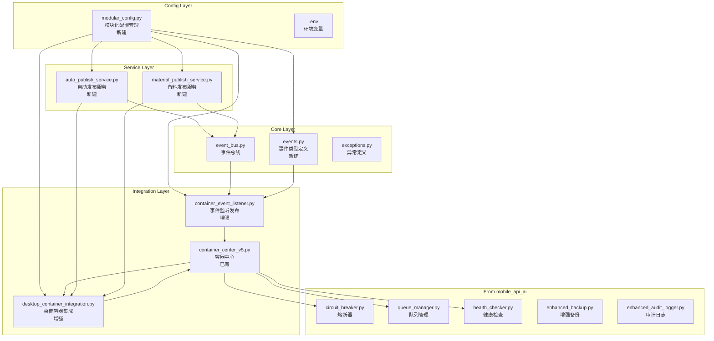
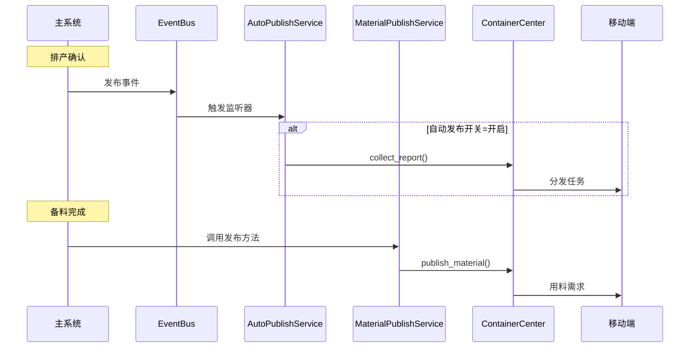

# DESIGN_模块化重构_不锈钢网带跟单系统3.1.md

> 文档版本：v1.0
> 编制日期：2026-05-07
> 状态：进行中
> 依据：ALIGNMENT_模块化重构.md

---

## 一、整体架构图

### 1.1 模块架构



### 1.2 数据流向图



---

## 二、分层设计和核心组件

### 2.1 核心组件职责

| 组件 | 层级 | 职责 | 文件位置 |
|------|------|------|----------|
| EventBus | 核心层 | 事件订阅/发布，单例模式 | `core/event_bus.py` |
| Events | 核心层 | 事件类型常量定义 | `core/events.py`（新建） |
| ModularConfig | 配置层 | 统一配置管理，支持.env | `modular_config.py`（新建） |
| ContainerEventListener | 集成层 | 监听事件并触发容器发布 | `container_event_listener.py`（增强） |
| DesktopContainerIntegration | 集成层 | 桌面端与容器中心交互 | `desktop_container_integration.py`（增强） |
| AutoPublishService | 服务层 | 自动发布逻辑（读开关） | `auto_publish_service.py`（新建） |
| MaterialPublishService | 服务层 | 备料发布逻辑 | `material_publish_service.py`（新建） |

### 2.2 模块依赖关系

```
modular_config.py (配置)
    ↑
    │
events.py (事件常量)
    │
    ├──→ container_event_listener.py (监听事件)
    │
auto_publish_service.py
    ├──→ modular_config.py (读取开关)
    ├──→ event_bus.py (发布事件)
    └──→ desktop_container_integration.py (调用发布)

material_publish_service.py
    ├──→ modular_config.py (配置)
    ├──→ event_bus.py (发布事件)
    └──→ desktop_container_integration.py (调用发布)

desktop_container_integration.py
    └──→ container_center_v5.py (容器中心)
```

---

## 三、接口契约定义

### 3.1 ModularConfig 接口

```python
class ModularConfig:
    """模块化配置管理器"""

    @staticmethod
    def get_auto_publish_enabled() -> bool:
        """获取自动发布开关状态"""

    @staticmethod
    def set_auto_publish_enabled(enabled: bool) -> bool:
        """设置自动发布开关状态"""

    @staticmethod
    def get_config(key: str, default: Any = None) -> Any:
        """获取配置项"""

    @staticmethod
    def reload() -> None:
        """重新加载配置"""
```

### 3.2 Events 接口

```python
class EventType:
    """事件类型常量"""
    ORDER_CREATED = 'order:created'
    ORDER_CONFIRMED = 'order:confirmed'
    ORDER_SHIPPED = 'order:shipped'
    PROCESS_STARTED = 'process:started'
    PROCESS_REPORTED = 'process:reported'
    PROCESS_COMPLETED = 'process:completed'
    PRODUCTION_CONFIRMED = 'production:confirmed'  # 排产确认
    MATERIAL_PREPARED = 'material:prepared'        # 备料完成
    QC_PASSED = 'qc:passed'
    QC_REJECTED = 'qc:rejected'
    INVENTORY_LOW = 'inventory:low'
```

### 3.3 AutoPublishService 接口

```python
class AutoPublishService:
    """自动发布服务"""

    def __init__(self, config: ModularConfig = None):
        """初始化"""

    def is_auto_publish_enabled(self) -> bool:
        """检查自动发布开关"""

    def should_auto_publish(self, event_type: str) -> bool:
        """判断是否应自动发布"""

    def publish_task(self, order_id: int, production_id: int,
                    process_id: int, **kwargs) -> Optional[str]:
        """发布任务到容器池"""

    def handle_production_confirmed(self, event: str, data: dict) -> None:
        """处理排产确认事件"""
```

### 3.4 MaterialPublishService 接口

```python
class MaterialPublishService:
    """备料发布服务"""

    def __init__(self, config: ModularConfig = None):
        """初始化"""

    def publish_requirements(self, order_id: int,
                           process_id: int) -> Dict[str, Any]:
        """发布用料需求到容器池"""

    def get_prepared_materials(self, order_id: int,
                              process_id: int) -> List[Dict]:
        """获取已备料物料列表"""

    def mark_material_selected(self, material_id: int,
                             selected: bool) -> bool:
        """标记物料勾选状态"""
```

### 3.5 DesktopContainerIntegration 接口

```python
class DesktopContainerIntegration:
    """桌面端容器集成"""

    def publish_report_task(self, order_no: str, order_no: str,
                           process_name: str, **kwargs) -> Optional[str]:
        """发布报工任务"""

    def publish_material_task(self, order_no: str, order_no: str,
                            materials: List[Dict], **kwargs) -> Optional[str]:
        """发布用料需求任务（新增）"""

    def get_task_status(self, task_id: str) -> Optional[Dict]:
        """获取任务状态"""
```

---

## 四、数据流向图

### 4.1 自动发布场景

```
┌─────────────────────────────────────────────────────────────────┐
│                        自动发布数据流                             │
├─────────────────────────────────────────────────────────────────┤
│                                                                  │
│  1. 主系统排产确认                                               │
│     └─→ EventBus.publish(PRODUCTION_CONFIRMED, data)           │
│                                                                  │
│  2. ContainerEventListener 收到事件                              │
│     └─→ 调用 AutoPublishService.handle_production_confirmed()   │
│                                                                  │
│  3. AutoPublishService 检查开关                                  │
│     └─→ ModularConfig.get_auto_publish_enabled()                │
│                                                                  │
│  4. 若开关开启，调用发布                                          │
│     └─→ DesktopContainerIntegration.publish_report_task()      │
│                                                                  │
│  5. 容器中心处理                                                  │
│     └─→ ContainerCenter.collect_report()                        │
│     └─→ 分发到移动端                                             │
│                                                                  │
│  6. 返回发布结果                                                  │
│     └─→ TaskID 或 None                                          │
│                                                                  │
└─────────────────────────────────────────────────────────────────┘
```

### 4.2 备料发布场景

```
┌─────────────────────────────────────────────────────────────────┐
│                        备料发布数据流                             │
├─────────────────────────────────────────────────────────────────┤
│                                                                  │
│  1. 仓管点击「发布用料需求」                                      │
│     └─→ MaterialPublishService.publish_requirements()           │
│                                                                  │
│  2. 收集已勾选备料项                                             │
│     └─→ SELECT * FROM production_material                       │
│         WHERE order_id=? AND process_id=? AND is_selected=1     │
│                                                                  │
│  3. 构建发布数据                                                 │
│     └─→ 格式化为容器中心所需格式                                  │
│                                                                  │
│  4. 调用容器中心                                                  │
│     └─→ DesktopContainerIntegration.publish_material_task()    │
│                                                                  │
│  5. 更新发布状态                                                  │
│     └─→ UPDATE production_material SET published=1             │
│                                                                  │
│  6. 返回发布结果                                                  │
│     └─→ {"success": true, "count": 3}                          │
│                                                                  │
└─────────────────────────────────────────────────────────────────┘
```

---

## 五、异常处理策略

### 5.1 异常类型定义

| 异常类 | 异常码 | 说明 | 处理方式 |
|--------|--------|------|----------|
| ConfigNotFoundError | E1001 | 配置文件不存在 | 创建默认配置 |
| ConfigReadError | E1002 | 配置读取失败 | 返回默认值，记录日志 |
| PublishFailedError | E2001 | 任务发布失败 | 重试3次，记录日志 |
| ContainerUnavailableError | E2002 | 容器中心不可用 | 记录日志，跳过发布 |
| MaterialNotFoundError | E3001 | 备料记录不存在 | 返回空列表 |
| DatabaseError | E4001 | 数据库操作失败 | 回滚事务，记录日志 |

### 5.2 异常处理流程

```python
try:
    # 发布任务
    task_id = integration.publish_report_task(...)
except ContainerUnavailableError as e:
    logger.warning(f"容器中心不可用: {e}")
    # 记录到待发布队列，稍后重试
    queue_manager.enqueue('pending_publish', task_data)
except PublishFailedError as e:
    logger.error(f"发布失败: {e}")
    # 重试机制
    for i in range(3):
        time.sleep(1)
        try:
            task_id = integration.publish_report_task(...)
            break
        except Exception:
            continue
else:
    logger.info(f"任务发布成功: {task_id}")
```

---

## 六、数据库扩展（如需要）

### 6.1 新增字段

| 表名 | 字段 | 类型 | 说明 |
|------|------|------|------|
| production_material | is_selected | BOOLEAN | 备料勾选状态 |
| production_material | published | BOOLEAN | 是否已发布 |
| production_material | published_at | DATETIME | 发布时间 |

### 6.2 SQL 变更

```sql
ALTER TABLE production_material
ADD COLUMN is_selected BOOLEAN DEFAULT FALSE;

ALTER TABLE production_material
ADD COLUMN published BOOLEAN DEFAULT FALSE;

ALTER TABLE production_material
ADD COLUMN published_at DATETIME;
```

> **注意**：此变更需要主系统配合执行，本次模块开发阶段仅提供 SQL 脚本。

---

## 七、配置管理设计

### 7.1 modular_config.json 结构

```json
{
    "auto_publish": {
        "enabled": false,
        "retry_count": 3,
        "retry_interval": 1
    },
    "material_publish": {
        "enabled": true,
        "auto_sync": false
    },
    "container": {
        "db_path": "mobile_api_ai/wechat_container.db",
        "sync_interval": 60
    },
    "circuit_breaker": {
        "enabled": true,
        "failure_threshold": 50,
        "open_timeout": 30
    }
}
```

### 7.2 .env 配置项

```bash
# 模块化配置
AUTO_PUBLISH_ENABLED=false
CONTAINER_DB_PATH=mobile_api_ai/wechat_container.db

# 熔断器配置
CIRCUIT_BREAKER_ENABLED=true
FAILURE_THRESHOLD=50
OPEN_TIMEOUT=30

# 队列配置
QUEUE_MAX_SIZE=1000
QUEUE_RETRY_COUNT=3
```

---

## 八、模块文件清单

| # | 文件名 | 类型 | 位置 | 说明 |
|---|--------|------|------|------|
| 1 | `events.py` | 新建 | `core/` | 事件类型定义 |
| 2 | `modular_config.py` | 新建 | 根目录 | 统一配置管理 |
| 3 | `auto_publish_service.py` | 新建 | 根目录 | 自动发布服务 |
| 4 | `material_publish_service.py` | 新建 | 根目录 | 备料发布服务 |
| 5 | `container_event_listener.py` | 增强 | 根目录 | 事件监听发布 |
| 6 | `desktop_container_integration.py` | 增强 | 根目录 | 桌面容器集成 |
| 7 | `modular_config.json` | 新建 | `data/` | 模块配置文件 |
| 8 | `requirements_modular.txt` | 新建 | 根目录 | 模块依赖清单 |

---

## 九、测试策略

### 9.1 单元测试覆盖

| 模块 | 测试类 | 覆盖方法 |
|------|--------|----------|
| ModularConfig | TestModularConfig | get/set_config, reload |
| AutoPublishService | TestAutoPublishService | is_enabled, should_publish, publish_task |
| MaterialPublishService | TestMaterialPublishService | publish_requirements, get_materials |
| ContainerEventListener | TestContainerEventListener | on_production_confirmed |
| DesktopContainerIntegration | TestDesktopIntegration | publish_report_task, publish_material_task |

### 9.2 测试用例优先级

| 优先级 | 用例 | 说明 |
|--------|------|------|
| P0 | 配置读写 | 验证配置正确读取和保存 |
| P0 | 开关逻辑 | 验证开关状态控制发布行为 |
| P0 | 发布接口 | 验证调用容器中心接口 |
| P1 | 事件监听 | 验证事件正确触发发布 |
| P1 | 异常处理 | 验证异常情况正确处理 |

---

## 十、集成计划

### 10.1 模块独立测试阶段

此阶段完成后，模块应能独立运行测试：
```bash
python -m pytest tests/modular/
```

### 10.2 主系统集成阶段（后续）

主系统 views 集成时，只需：
1. 导入模块
2. 初始化服务
3. 绑定事件监听

```python
# 主系统中集成示例
from auto_publish_service import AutoPublishService
from container_event_listener import init_container_listener

# 初始化
auto_publish = AutoPublishService()
init_container_listener()

# 排产确认时
EventBus.publish(EventType.PRODUCTION_CONFIRMED, {...})
```

---

**文档状态**：待审批后进入阶段3