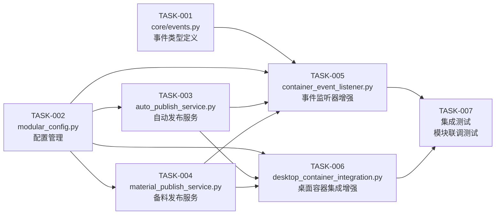

# TASK_模块化重构_不锈钢网带跟单系统3.1.md

> 文档版本：v1.0
> 编制日期：2026-05-07
> 状态：进行中
> 依据：DESIGN_模块化重构.md

---

## 一、任务拆分概览

本任务将模块化重构拆分为 **7 个原子任务**，每个任务独立可测试。

### 1.1 任务依赖图



### 1.2 任务清单

| 任务ID | 任务名称 | 优先级 | 预计工时 | 依赖任务 |
|--------|----------|--------|----------|----------|
| TASK-001 | core/events.py 事件类型定义 | P0 | 1h | 无 |
| TASK-002 | modular_config.py 配置管理 | P0 | 2h | 无 |
| TASK-003 | auto_publish_service.py 自动发布服务 | P0 | 3h | TASK-001, TASK-002 |
| TASK-004 | material_publish_service.py 备料发布服务 | P0 | 3h | TASK-001, TASK-002 |
| TASK-005 | container_event_listener.py 事件监听器增强 | P1 | 2h | TASK-001, TASK-002 |
| TASK-006 | desktop_container_integration.py 桌面容器集成增强 | P1 | 2h | TASK-001, TASK-002 |
| TASK-007 | 集成测试 模块联调测试 | P0 | 2h | TASK-003, TASK-004, TASK-005, TASK-006 |

---

## 二、原子任务详情

---

### TASK-001: core/events.py 事件类型定义

**任务描述**：创建 `core/events.py`，定义所有事件类型常量

#### 输入契约

| 前置依赖 | 输入数据 | 环境依赖 |
|----------|----------|----------|
| 无 | 无 | Python 3.x |

#### 输出契约

| 输出数据 | 交付物 | 验收标准 |
|----------|--------|----------|
| `core/events.py` | 事件类型常量定义文件 | 可通过 `from core.events import EventType` 导入 |

#### 实现约束

```python
# 技术栈：Python 3.x
# 接口规范：定义 EventType 类，包含所有事件常量
# 质量要求：常量命名清晰，与改进计划文档一致

class EventType:
    """事件类型常量"""
    # 订单相关
    ORDER_CREATED = 'order:created'
    ORDER_CONFIRMED = 'order:confirmed'
    ORDER_SHIPPED = 'order:shipped'

    # 工序相关
    PROCESS_STARTED = 'process:started'
    PROCESS_REPORTED = 'process:reported'
    PROCESS_COMPLETED = 'process:completed'

    # 排产相关
    PRODUCTION_CONFIRMED = 'production:confirmed'

    # 备料相关
    MATERIAL_PREPARED = 'material:prepared'

    # 质检相关
    QC_PASSED = 'qc:passed'
    QC_REJECTED = 'qc:rejected'

    # 库存相关
    INVENTORY_LOW = 'inventory:low'
```

#### 验收标准

- [ ] 文件位于 `d:\yuan\不锈钢网带跟单3.0\core\events.py`
- [ ] 可独立导入：`python -c "from core.events import EventType; print(EventType.ORDER_CREATED)"`
- [ ] 包含所有改进计划中定义的事件类型

---

### TASK-002: modular_config.py 配置管理

**任务描述**：创建 `modular_config.py`，统一管理模块配置

#### 输入契约

| 前置依赖 | 输入数据 | 环境依赖 |
|----------|----------|----------|
| 无 | 无 | Python 3.x, `data/window_config.json` |

#### 输出契约

| 输出数据 | 交付物 | 验收标准 |
|----------|--------|----------|
| `modular_config.py` | 配置管理模块 | 配置读取/保存正常 |
| `data/modular_config.json` | 模块配置文件 | 配置文件存在 |

#### 实现约束

```python
# 技术栈：Python 3.x, json, os, logging
# 接口规范：
#   - ModularConfig.get_auto_publish_enabled() -> bool
#   - ModularConfig.set_auto_publish_enabled(bool) -> bool
#   - ModularConfig.get_config(key, default) -> Any
#   - ModularConfig.reload() -> None
# 质量要求：
#   - 禁止硬编码，使用 .env 管理敏感配置
#   - 配置项参考 DESIGN 文档
#   - 日志使用 logger 而非 print
```

#### 核心配置项

```json
{
    "auto_publish": {
        "enabled": false,
        "retry_count": 3,
        "retry_interval": 1
    },
    "material_publish": {
        "enabled": true,
        "auto_sync": false
    }
}
```

#### 验收标准

- [ ] 文件位于 `d:\yuan\不锈钢网带跟单3.0\modular_config.py`
- [ ] 可独立导入：`python -c "from modular_config import ModularConfig; print(ModularConfig.get_auto_publish_enabled())"`
- [ ] 配置文件位于 `d:\yuan\不锈钢网带跟单3.0\data\modular_config.json`
- [ ] 遵循 CODING_STANDARDS.md 规范（无硬编码、无裸 except）

---

### TASK-003: auto_publish_service.py 自动发布服务

**任务描述**：创建 `auto_publish_service.py`，实现自动发布逻辑

#### 输入契约

| 前置依赖 | 输入数据 | 环境依赖 |
|----------|----------|----------|
| TASK-001, TASK-002 | 订单数据、工单数据 | ModularConfig, EventBus |

#### 输出契约

| 输出数据 | 交付物 | 验收标准 |
|----------|--------|----------|
| `auto_publish_service.py` | 自动发布服务模块 | 开关控制发布行为正确 |

#### 实现约束

```python
# 技术栈：Python 3.x, logging
# 接口规范：
#   - class AutoPublishService
#   - def is_auto_publish_enabled(self) -> bool
#   - def should_auto_publish(self, event_type: str) -> bool
#   - def publish_task(self, order_id, production_id, process_id, **kwargs) -> Optional[str]
#   - def handle_production_confirmed(self, event, data) -> None
# 质量要求：
#   - 依赖 DesktopContainerIntegration 发布任务
#   - 异常处理使用 try/except Exception as e
#   - 日志使用 logger
```

#### 核心逻辑

```python
class AutoPublishService:
    def __init__(self, config: ModularConfig = None):
        self.config = config or ModularConfig()
        self.integration = DesktopContainerIntegration()

    def handle_production_confirmed(self, event: str, data: dict) -> None:
        """处理排产确认事件"""
        if not self.is_auto_publish_enabled():
            logger.info("自动发布开关未开启，跳过发布")
            return

        order_id = data.get('order_id')
        production_id = data.get('production_id')
        process_id = data.get('process_id')

        task_id = self.publish_task(order_id, production_id, process_id, **data)
        if task_id:
            logger.info(f"自动发布成功: {task_id}")
        else:
            logger.warning(f"自动发布失败")
```

#### 验收标准

- [ ] 文件位于 `d:\yuan\不锈钢网带跟单3.0\auto_publish_service.py`
- [ ] 开关关闭时不发布任务
- [ ] 开关开启时正确调用 DesktopContainerIntegration
- [ ] 遵循 CODING_STANDARDS.md 规范

---

### TASK-004: material_publish_service.py 备料发布服务

**任务描述**：创建 `material_publish_service.py`，实现备料发布逻辑

#### 输入契约

| 前置依赖 | 输入数据 | 环境依赖 |
|----------|----------|----------|
| TASK-001, TASK-002 | 备料数据（物料名称、数量） | ModularConfig, EventBus |

#### 输出契约

| 输出数据 | 交付物 | 验收标准 |
|----------|--------|----------|
| `material_publish_service.py` | 备料发布服务模块 | 可收集并发布备料需求 |

#### 实现约束

```python
# 技术栈：Python 3.x, logging, database
# 接口规范：
#   - class MaterialPublishService
#   - def publish_requirements(self, order_id, process_id) -> Dict[str, Any]
#   - def get_prepared_materials(self, order_id, process_id) -> List[Dict]
#   - def mark_material_selected(self, material_id, selected) -> bool
# 质量要求：
#   - 使用 context manager 访问数据库
#   - 异常处理使用 try/except Exception as e
#   - 日志使用 logger
```

#### 核心逻辑

```python
class MaterialPublishService:
    def __init__(self, config: ModularConfig = None):
        self.config = config or ModularConfig()
        self.integration = DesktopContainerIntegration()

    def publish_requirements(self, order_id: int, process_id: int) -> Dict[str, Any]:
        """发布用料需求到容器池"""
        materials = self.get_prepared_materials(order_id, process_id)
        selected = [m for m in materials if m.get('is_selected')]

        if not selected:
            return {"success": False, "message": "没有已勾选的备料项"}

        task_id = self.integration.publish_material_task(
            order_id=order_id,
            process_id=process_id,
            materials=selected
        )

        return {"success": True, "count": len(selected), "task_id": task_id}
```

#### 验收标准

- [ ] 文件位于 `d:\yuan\不锈钢网带跟单3.0\material_publish_service.py`
- [ ] 可收集已勾选备料项
- [ ] 可调用容器中心发布用料需求
- [ ] 遵循 CODING_STANDARDS.md 规范

---

### TASK-005: container_event_listener.py 事件监听器增强

**任务描述**：增强 `container_event_listener.py`，完善事件监听与发布逻辑

#### 输入契约

| 前置依赖 | 输入数据 | 环境依赖 |
|----------|----------|----------|
| TASK-001, TASK-002, TASK-003, TASK-004 | EventBus, ContainerCenter | modular_config |

#### 输出契约

| 输出数据 | 交付物 | 验收标准 |
|----------|--------|----------|
| `container_event_listener.py`（增强版） | 事件监听器 | 正确订阅和处理事件 |

#### 实现约束

```python
# 技术栈：Python 3.x, logging
# 增强内容：
#   - 订阅 PRODUCTION_CONFIRMED 事件
#   - 订阅 MATERIAL_PREPARED 事件
#   - 自动调用对应 Service 发布任务
# 质量要求：
#   - 事件订阅使用 EventBus.subscribe()
#   - 异常处理使用 try/except Exception as e
#   - 日志使用 logger
```

#### 核心逻辑

```python
class ContainerEventListener:
    def __init__(self):
        self.auto_publish = AutoPublishService()
        self.material_publish = MaterialPublishService()
        self._register_handlers()

    def _register_handlers(self):
        """注册事件处理器"""
        EventBus.subscribe(EventType.PRODUCTION_CONFIRMED,
                          self.auto_publish.handle_production_confirmed)
        EventBus.subscribe(EventType.MATERIAL_PREPARED,
                          self.on_material_prepared)

    def on_material_prepared(self, event: str, data: dict) -> None:
        """处理备料完成事件"""
        if not self.material_publish.is_enabled():
            return

        result = self.material_publish.publish_requirements(
            order_id=data.get('order_id'),
            process_id=data.get('process_id')
        )
        logger.info(f"备料发布结果: {result}")
```

#### 验收标准

- [ ] 文件位于 `d:\yuan\不锈钢网带跟单3.0\container_event_listener.py`
- [ ] 正确订阅 PRODUCTION_CONFIRMED 和 MATERIAL_PREPARED 事件
- [ ] 可被主系统初始化调用

---

### TASK-006: desktop_container_integration.py 桌面容器集成增强

**任务描述**：增强 `desktop_container_integration.py`，完善发布接口

#### 输入契约

| 前置依赖 | 输入数据 | 环境依赖 |
|----------|----------|----------|
| TASK-001, TASK-002 | ContainerCenter | container_center_v5 |

#### 输出契约

| 输出数据 | 交付物 | 验收标准 |
|----------|--------|----------|
| `desktop_container_integration.py`（增强版） | 桌面容器集成 | 新增 publish_material_task 方法 |

#### 实现约束

```python
# 技术栈：Python 3.x, logging
# 增强内容：
#   - 完善 publish_report_task() 方法
#   - 新增 publish_material_task() 方法
#   - 异常处理增强
# 质量要求：
#   - 异常处理使用 try/except Exception as e
#   - 日志使用 logger
```

#### 核心逻辑

```python
class DesktopContainerIntegration:
    # ... 已有方法 ...

    def publish_material_task(self,
                              order_no: str,
                              order_no: str,
                              materials: List[Dict],
                              **kwargs) -> Optional[str]:
        """发布用料需求任务到容器池"""
        if not self.is_available():
            logger.warning("[容器集成] 不可用，跳过用料需求发布")
            return None

        try:
            pkg = self._container_center.create_package(
                data_type='material',
                title=f"用料需求 - {order_no}",
                content={
                    'order_no': order_no,
                    'order_no': order_no,
                    'materials': materials,
                    **kwargs
                }
            )

            self._container_center.storage.save_package(pkg.to_dict())
            return pkg.id
        except Exception as e:
            logger.error(f"发布用料需求失败: {e}")
            return None
```

#### 验收标准

- [ ] 文件位于 `d:\yuan\不锈钢网带跟单3.0\desktop_container_integration.py`
- [ ] 新增 `publish_material_task()` 方法
- [ ] 异常处理正确
- [ ] 遵循 CODING_STANDARDS.md 规范

---

### TASK-007: 集成测试 模块联调测试

**任务描述**：编写单元测试，验证模块独立性和集成正确性

#### 输入契约

| 前置依赖 | 输入数据 | 环境依赖 |
|----------|----------|----------|
| TASK-001~TASK-006 全部完成 | 各模块代码 | pytest |

#### 输出契约

| 输出数据 | 交付物 | 验收标准 |
|----------|--------|----------|
| `tests/modular/` 目录 | 单元测试文件 | 所有测试通过 |

#### 测试用例清单

| 测试文件 | 测试方法 | 覆盖功能 |
|----------|----------|----------|
| `test_events.py` | test_event_type_constants | 验证事件常量定义 |
| `test_modular_config.py` | test_get_config, test_set_config, test_reload | 验证配置读写 |
| `test_auto_publish.py` | test_auto_publish_disabled, test_auto_publish_enabled, test_publish_task | 验证自动发布逻辑 |
| `test_material_publish.py` | test_get_materials, test_publish_requirements | 验证备料发布逻辑 |
| `test_container_listener.py` | test_event_subscription, test_event_handler | 验证事件监听 |
| `test_desktop_integration.py` | test_publish_report_task, test_publish_material_task | 验证集成接口 |

#### 验收标准

- [ ] 测试文件位于 `d:\yuan\不锈钢网带跟单3.0\tests\modular\`
- [ ] 所有测试用例可独立运行：`python -m pytest tests/modular/ -v`
- [ ] 测试覆盖率 > 70%

---

## 三、质量门控

### 3.1 任务完成检查清单

| 检查项 | 说明 |
|--------|------|
| 代码规范 | 遵循 CODING_STANDARDS.md（无硬编码、无裸 except、无 print） |
| 接口契约 | 与 DESIGN 文档定义一致 |
| 单元测试 | 每个任务至少有一个测试用例 |
| 文档更新 | 同步更新相关文档 |

### 3.2 任务依赖关系无循环

验证：TASK-001 → TASK-002 → TASK-003/TASK-004/TASK-005/TASK-006 → TASK-007

---

**文档状态**：待审批后进入阶段5（执行）