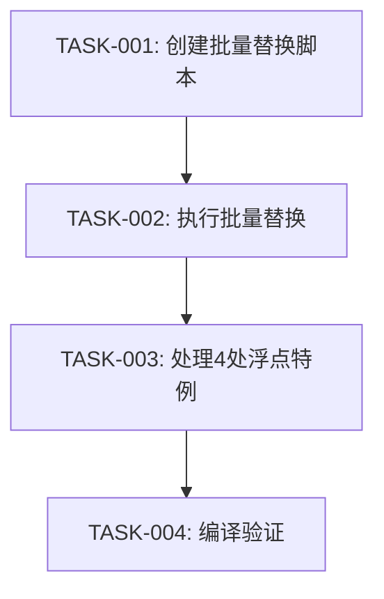

# TASK_消除裸except.md — 子任务拆分

> 编制日期：2026-05-21

## 任务依赖图

## 原子任务

### TASK-001: 创建批量替换脚本

- **输入契约**：无（从头创建）
- **输出契约**：`scripts/fix_bare_except.py`，可自动替换核心文件中的 `except:` → `except Exception:`
- **实现要求**：
  - 读取 27 个核心文件的绝对路径列表
  - 用正则 `^\s*except:` 匹配裸 except
  - 替换为 `except Exception:`
  - 输出每个文件的修改行数和行号预览
- **验收标准**：脚本可运行，输出替换预览

### TASK-002: 执行批量替换

- **输入契约**：TASK-001 的脚本就绪
- **输出契约**：27 个核心文件中的 `except:` 全部替换为 `except Exception:`
- **验收标准**：重新运行脚本，替换数量显示为 0（即无新替换）

### TASK-003: 处理 4 处浮点特例

- **输入契约**：TASK-002 执行完毕
- **输出契约**：4 处 float 解析改为 `except (ValueError, TypeError):`
  - `process_view.py` — float(data.get(...))
  - `models/quality_rule.py` — float(measured_str)
  - `models/process_calc_rule.py` ×2 — float(val)
- **验收标准**：手动确认 4 处已修改

### TASK-004: 编译验证

- **输入契约**：TASK-003 执行完毕
- **输出契约**：所有 27 个修改文件编译通过
- **验收标准**：`python -m py_compile <file>` 全部返回 exit code 0
