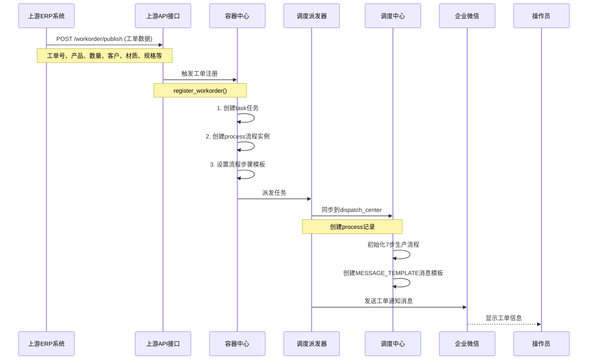
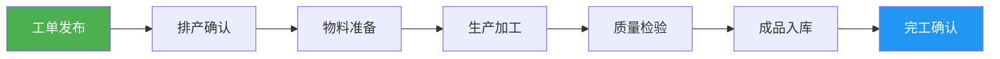
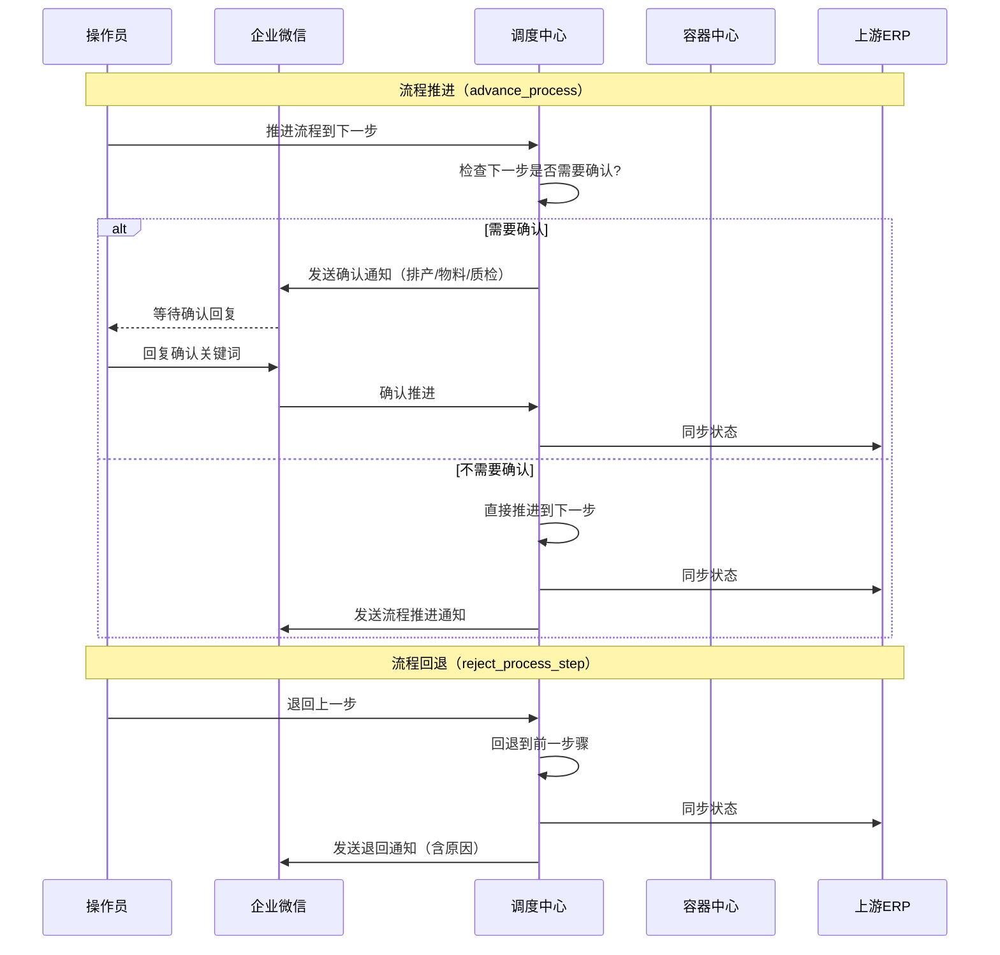
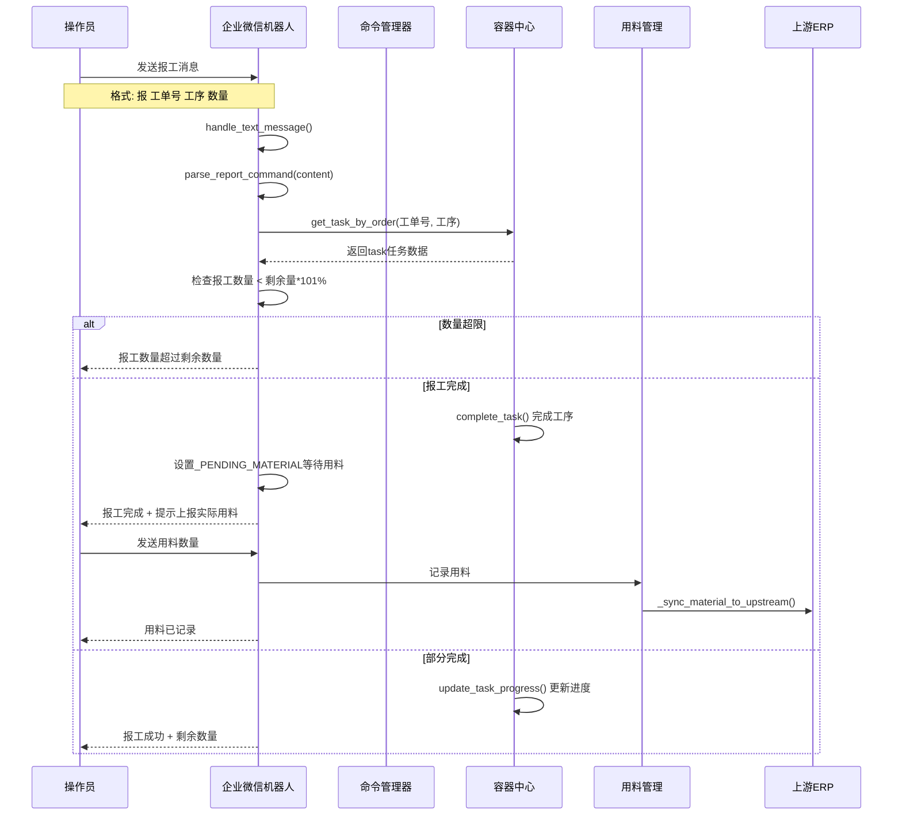
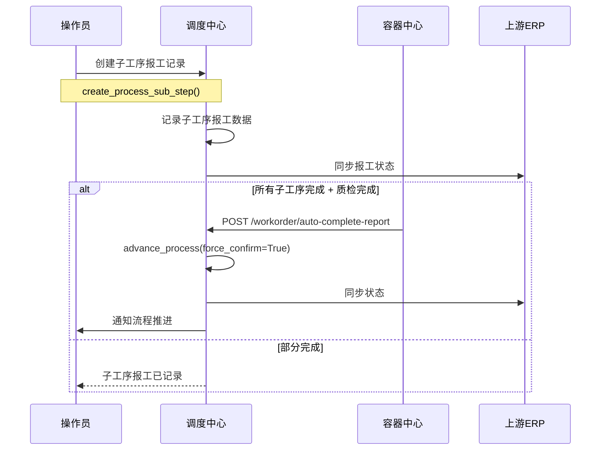
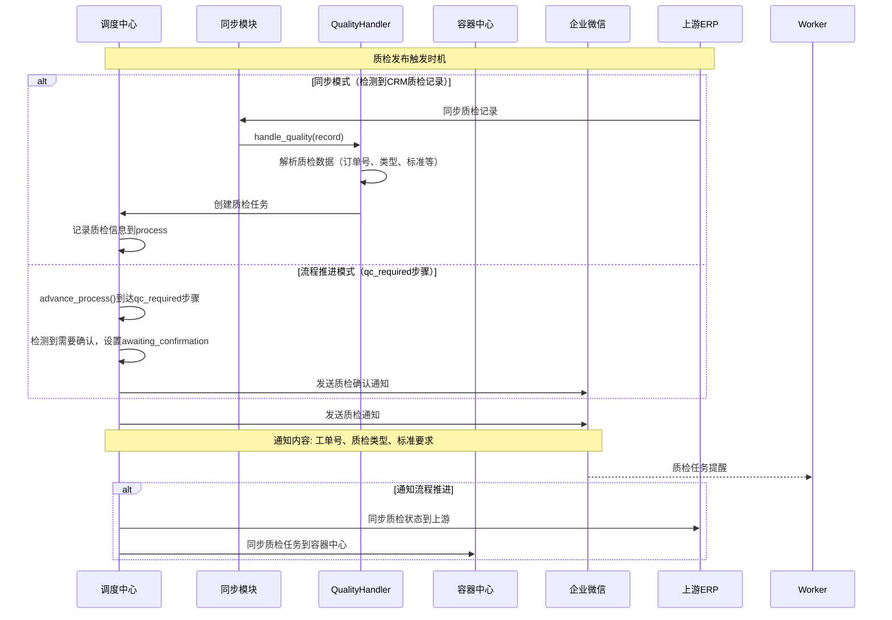
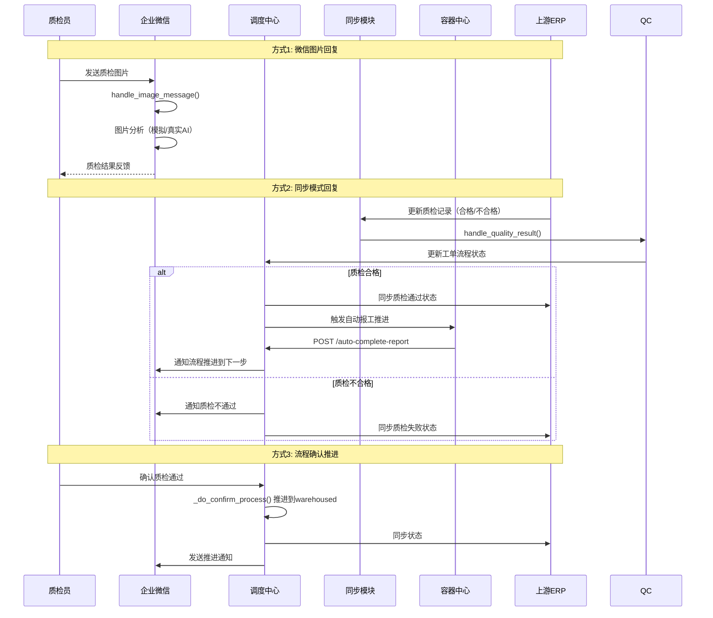
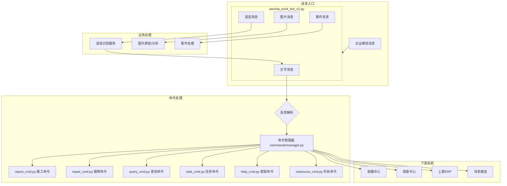
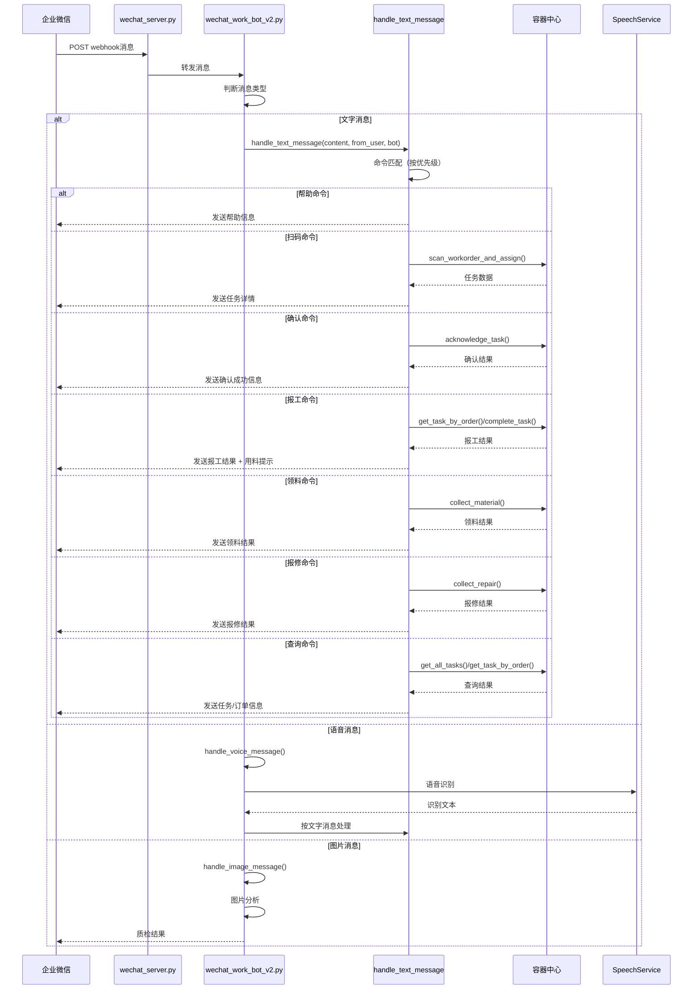
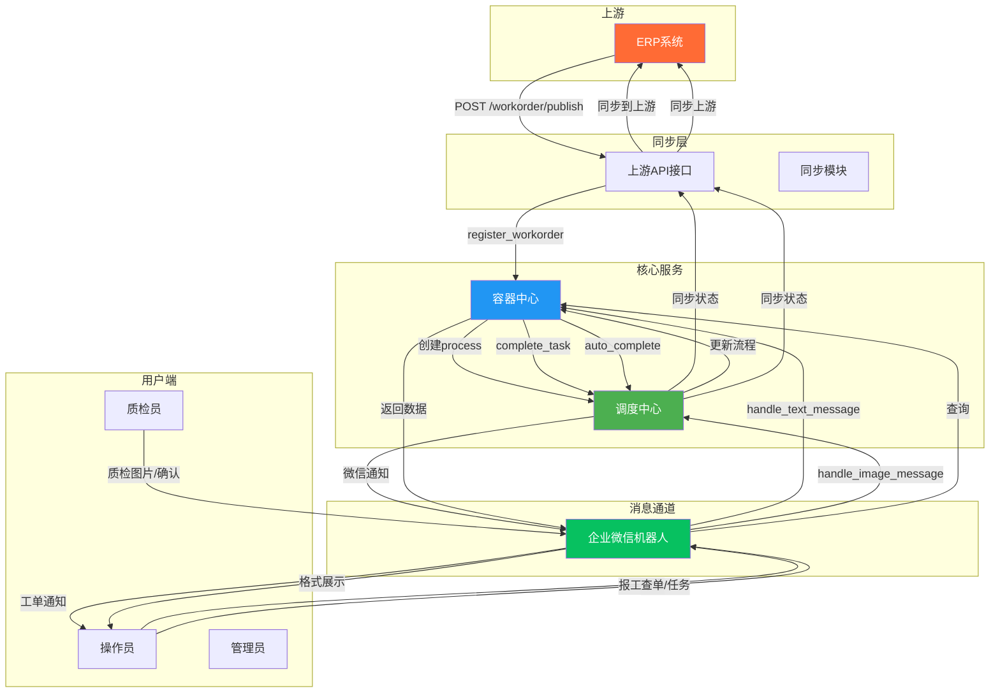

# 系统业务流程图

> 本文档完整描述不锈钢网带跟单系统的各项业务流程，涵盖工单生命周期、消息流转、质检流程等核心业务。

---

## 目录

1. [工单发布流程](#1-工单发布流程)
2. [工单生产流程](#2-工单生产流程)
3. [报工流程（微信报工）](#3-报工流程微信报工)
4. [工序报工流程](#4-工序报工流程)
5. [质检发布流程](#5-质检发布流程)
6. [质检回复流程](#6-质检回复流程)
7. [微信消息流程](#7-微信消息流程)
8. [各类消息/指令流程](#8-各类消息指令流程)

---

## 1. 工单发布流程

### 流程图



### 流程说明

| 步骤 | 动作 | 说明 |
|------|------|------|
| 1 | ERP发布工单 | 上游ERP系统调用 `POST /workorder/publish` 接口发布工单 |
| 2 | 数据接收 | 上游API接收工单数据（工单号、产品名称、数量、客户、材质、规格、生产工艺等） |
| 3 | 容器中心注册 | `container_center_v5.py` 调用 `register_workorder()` 进行注册 |
| 4 | 创建任务 | 在容器中心创建task任务，包含工单信息和计划数量 |
| 5 | 创建流程 | 创建process流程实例，绑定流程模板（默认production模板） |
| 6 | 派发任务 | `container_center.distributor.distribute(pkg.id)` 派发任务到操作员 |
| 7 | 同步调度中心 | 流程数据和状态同步到 `dispatch_center` |
| 8 | 微信通知 | 企业微信机器人发送工单通知给对应操作员 |

### 核心接口

```python
# dispatch_center.py - 工单注册
@dispatch_center_bp.route('/workorder/register', methods=['POST'])
def register_workorder():
    """注册工单并创建生产流程"""
    data = request.get_json(force=True, silent=True) or {}
    order_no = data.get('order_no', '').strip()
    # 验证、匹配流程模板、创建process、写入dispatch数据
```

---

## 2. 工单生产流程

### 7步生产流程（默认production模板）



### 各步骤详情

| 步骤 | 名称 | status_key | 说明 | 需确认 |
|------|------|-----------|------|--------|
| 第1步 | 工单发布 | `published` | 工单已发布到车间 | - |
| 第2步 | 排产确认 | `scheduled` | 排产计划已确认 | ✅ |
| 第3步 | 物料准备 | `material_ready` | 物料已准备就绪 | ✅ |
| 第4步 | 生产加工 | `in_production` | 正在生产加工中 | - |
| 第5步 | 质量检验 | `qc_required` | 需要质量检验 | ✅ |
| 第6步 | 成品入库 | `warehoused` | 成品已入库 | - |
| 第7步 | 完工确认 | `completed` | 工单全部完成 | - |

### 需要确认的步骤

`CONFIRMATION_REQUIRED_STEPS` 定义：

```python
CONFIRMATION_REQUIRED_STEPS = {
    'scheduled': 'tmpl_confirm_schedule',       # 排产确认
    'material_ready': 'tmpl_confirm_material',   # 物料准备
    'qc_required': 'tmpl_confirm_qc',            # 质量检验
}
```

### 流程推进机制



### 核心函数

| 函数 | 功能 |
|------|------|
| `advance_process(process_id)` | 推进流程到下一步，如需要确认则先发送通知 |
| `confirm_process_step(process_id)` | 确认推进（排产确认时可选工期） |
| `reject_process_step(process_id)` | 退回上一步（需提供原因） |
| `_do_confirm_process(process_id, operator_name)` | 执行确认逻辑，推进到等待的步骤 |
| `_notify_process_event(process_id, event_type, variables)` | 发送流程事件通知 |
| `confirm_by_wechat_reply()` | 微信回复确认 |

### 流程状态流转

```
pending → published → scheduled → material_ready → in_production → qc_required → warehoused → completed
                                                      ↑              |
                                                      └── 退回 ─────┘
```

---

## 3. 报工流程（微信报工）

### 流程图



### 报工命令格式

| 格式 | 示例 | 说明 |
|------|------|------|
| `报 工单号 工序 数量` | `报 ORD001 编织 500` | 标准报工格式 |
| `报工 工单号 工序 数量` | `报工 ORD001 编织 500` | 同上 |
| `完成 工单号 工序 数量` | `完成 ORD001 编织 500` | 标记该工序完成 |
| `报 工单尾号 工序 数量` | `报 0001 编织 500` | 使用工单号尾号匹配 |

### 报工完成后的用料上报

报工完成后，系统自动进入**等待用料**状态（`_PENDING_MATERIAL`），操作员需发送实际用料数量：

```
200kg    → 记录200千克
3米      → 记录3米
500个    → 记录500个
```

用料数据通过 `_sync_material_to_upstream()` 同步到上游ERP。

---

## 4. 工序报工流程

### 流程图



### 核心函数

```python
# 创建子工序报工
@dispatch_center_bp.route('/processes/sub_step', methods=['POST'])
def create_process_sub_step():
    """创建工序报工记录"""
    body = request.get_json(force=True, silent=True) or {}
    process_id = body.get('process_id')
    step_index = body.get('step_index')
    sub_step_name = body.get('sub_step_name', '')
    # 记录子工序报工数据 + 同步上游

# 自动完成报工
@dispatch_center_bp.route('/workorder/auto-complete-report', methods=['POST'])
def auto_complete_report():
    """自动推进到报工完成（由容器中心在所有子步骤及质检完成后触发）"""
```

---

## 5. 质检发布流程

### 流程图



### 核心组件

| 组件 | 功能 |
|------|------|
| `quality_handler.py` | 同步模块，解析上游质检记录并创建质检任务 |
| `api/quality.py` | 质检API接口，提供质检记录的增删改查 |
| `dispatch_center.py` | 流程管理，在qc_required步骤触发质检通知 |
| `wechat_work_bot_v2.py` | 发送质检通知到企业微信 |

### 质检发布方式

| 方式 | 触发条件 | 说明 |
|------|---------|------|
| 同步触发 | 上游ERP同步质检记录 | `quality_handler.handle_quality()` 创建质检任务 |
| 流程推进 | 流程到达 `qc_required` 步骤 | `advance_process()` 触发质检确认通知 |
| API调用 | 手动/系统调用质检接口 | `api/quality.py` 直接创建质检记录 |

---

## 6. 质检回复流程

### 流程图



### 质检回复方式对比

| 方式 | 入口 | 适用场景 |
|------|------|---------|
| 微信图片 | `handle_image_message()` | 现场质检拍照上报 |
| 上游同步 | `quality_handler.handle_quality_result()` | ERP系统质检完成 |
| 流程确认 | `confirm_process_step()` / `confirm_by_wechat_reply()` | 调度中心手动确认 |

---

## 7. 微信消息流程

### 消息处理总架构



### 消息接收与分发流程



### 命令优先级

消息处理按以下优先级依次匹配：

```
1. 帮助命令（"帮助"/"help"）
2. 扫码命令（二维码扫码）
3. 用料回复（_PENDING_MATERIAL状态）
4. 确认任务（acknowledge）
5. 待确认任务查询（"待确认"）
6. 领料命令（"领料"）
7. 报修命令（"报修"）
8. 报工命令（"报工"/"报 "/"完成 "）
9. 全局命令（"W0" 查看所有任务）
10. 查询命令（"查单"/"订单"/ORD开头的单号）
11. 任务查询（"任务"/"我的任务"/"待处理"）
12. 问候语（"hi"/"hello"/"你好"）
13. 默认回复（未识别的命令）
```

---

## 8. 各类消息/指令流程

### 8.1 消息模板系统

系统使用 `MESSAGE_TEMPLATES_DEFAULT` 定义各类消息模板，通过模板变量替换实现消息定制。

```python
MESSAGE_TEMPLATES_DEFAULT = [
    {
        'key': 'tmpl_workorder_published',
        'name': '工单发布通知',
        'template': '📋 **新工单通知**\n\n工单号：{order_no}\n产品名称：{product_name}\n计划数量：{planned_qty}\n客户：{customer}\n...'
    },
    {
        'key': 'tmpl_sub_step_created',
        'name': '工序报工通知',
        'template': '📝 工序报工通知\n\n工单号: {order_no}\n报工工序: {sub_step}\n操作人: {operator_name}\n...'
    },
    # ... 更多模板
]
```

### 8.2 完整消息类型列表

| 模板Key | 名称 | 触发时机 |
|---------|------|---------|
| `tmpl_workorder_published` | 工单发布通知 | 新工单发布到车间 |
| `tmpl_workorder_updated` | 工单变更通知 | 工单信息变更 |
| `tmpl_workorder_completed` | 工单完成通知 | 工单全部完成 |
| `tmpl_workorder_cancelled` | 工单取消通知 | 工单被取消 |
| `tmpl_task_assigned` | 任务分配通知 | 任务分配给操作员 |
| `tmpl_task_reassign` | 任务转派通知 | 任务转派给其他操作员 |
| `tmpl_process_advance` | 流程推进通知 | 流程推进到下一步 |
| `tmpl_process_reject` | 流程退回通知 | 流程被退回上一步 |
| `tmpl_confirm_schedule` | 确认排产通知 | 需要排产确认时 |
| `tmpl_confirm_material` | 确认物料通知 | 需要物料确认时 |
| `tmpl_confirm_qc` | 确认质检通知 | 需要质检确认时 |
| `tmpl_sub_step_created` | 工序报工通知 | 子工序报工完成 |
| `tmpl_quality_required` | 质检需求通知 | 需要质检介入 |
| `tmpl_quality_passed` | 质检通过通知 | 质检合格 |
| `tmpl_quality_failed` | 质检失败通知 | 质检不合格 |
| `tmpl_material_shortage` | 缺料告警通知 | 物料不足 |
| `tmpl_overdue_reminder` | 逾期提醒通知 | 工单超期 |

### 8.3 微信命令/指令完整列表

| 命令 | 格式 | 功能 | 对应函数 |
|------|------|------|---------|
| `帮助` | `帮助` | 显示全部帮助信息 | `format_help()` |
| `扫码` | 二维码扫码 | 查询并领取任务 | `parse_scan_command()` |
| `确认` | `确认 任务ID` | 确认接受任务 | `parse_acknowledge_command()` |
| `待确认` | `待确认` | 查询待确认任务列表 | `_match_operator_by_wechat_name()` |
| `报工` | `报 工单号 工序 数量` | 完成工序报工 | `parse_report_command()` |
| `完成` | `完成 工单号 工序 数量` | 完成工序报工 | `parse_report_command()` |
| `用料` | 数字+单位 | 上报实际用料 | `parse_material_input()` |
| `领料` | `领料 工单号 物品 规格 数量 [单位]` | 提交领料申请 | `parse_material_requisition_command()` |
| `报修` | `报修 种类 描述` | 提交报修申请 | `parse_repair_command()` |
| `W0` | `W0` | 查看所有进行中任务 | 直接查询容器中心 |
| `查单` | `查单 工单号` | 查询工单进度 | `find_order_in_text()` |
| `任务` | `任务/我的任务/待处理` | 查看个人待处理任务 | `get_pending_tasks()` |
| `问候` | `你好/hi/hello` | 打招呼 | 直接回复 |

### 8.4 语音命令

语音消息自动识别后按文字命令处理：

```
"报 ORD001 编织 500"      → 报工
"工单ORD001完成了"         → 完成报工
"查单ORD001"               → 查询工单
```

### 8.5 系统间消息流总览



---

## 附录

### A. 核心文件索引

| 文件 | 功能 |
|------|------|
| `mobile_api_ai/dispatch_center.py` | 调度中心 - 流程管理、工单注册、报工管理 |
| `mobile_api_ai/wechat_work_bot_v2.py` | 企业微信机器人V2 - 消息处理、命令路由 |
| `mobile_api_ai/wechat_server_handlers.py` | 微信服务器消息处理器 |
| `mobile_api_ai/commands/manager.py` | 命令管理器 - 注册和调度所有命令 |
| `mobile_api_ai/commands/report_cmd.py` | 报工命令解析 |
| `mobile_api_ai/commands/repair_cmd.py` | 报修命令解析 |
| `mobile_api_ai/commands/query_cmd.py` | 查询命令解析 |
| `mobile_api_ai/commands/task_cmd.py` | 任务命令解析 |
| `mobile_api_ai/commands/help_cmd.py` | 帮助命令 |
| `mobile_api_ai/commands/outsource_cmd.py` | 外协命令解析 |
| `mobile_api_ai/commands/repair_complete_cmd.py` | 报修完成命令 |
| `mobile_api_ai/container_center_v5.py` | 容器中心V5 - 核心业务引擎 |
| `mobile_api_ai/container/dispatcher.py` | 任务分发器 |
| `mobile_api_ai/container_center_api.py` | 容器中心API接口 |
| `mobile_api_ai/schedule_flow.py` | 排产流程管理 |
| `mobile_api_ai/upstream_api.py` | 上游ERP系统对接API |
| `mobile_api_ai/sync/handlers/quality_handler.py` | 质检数据同步处理器 |
| `mobile_api_ai/api/quality.py` | 质检API接口 |

### B. 流程模板定义

```python
PROCESS_FLOW_TEMPLATES = {
    'production': {  # 默认生产流程
        'name': '标准生产流程',
        'steps': [
            {'name': '工单发布', 'status_key': 'published'},
            {'name': '排产确认', 'status_key': 'scheduled'},
            {'name': '物料准备', 'status_key': 'material_ready'},
            {'name': '生产加工', 'status_key': 'in_production'},
            {'name': '质量检验', 'status_key': 'qc_required'},
            {'name': '成品入库', 'status_key': 'warehoused'},
            {'name': '完工确认', 'status_key': 'completed'},
        ]
    },
    # 可扩展其他流程模板
}
```

### C. 消息通知事件类型

| 事件类型 | 说明 | 触发函数 |
|---------|------|---------|
| `process_advance` | 流程推进通知 | `_notify_process_event()` |
| `process_reject` | 流程退回通知 | `_notify_process_event()` |
| `task_assigned` | 任务分配通知 | `assign_task()` |
| `task_reassign` | 任务转派通知 | `reassign_task()` |
| `sub_step_created` | 工序报工通知 | `create_process_sub_step()` |
