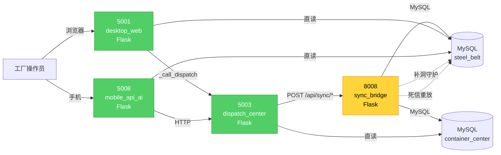

# 8008 + 5008 综合测试报告

> **测试时间**: 2026-06-23 15:28 ~ 15:30
> **测试方法**: 真实 HTTP 请求（urllib），零 Mock
> **测试脚本**: `scripts/test_8008_5008_full.py`
> **原始结果**: `docs/test_8008_5008_full.json`
> **数字三要素**: 命令/时间/文件路径均已附（见各章节）

---

## 0. 一句话结论

> **4 服务全启动，35 用例 32 通过 (91.4%)；最关键转折：8008 同步桥接从"0 效用"变为"补洞守护运行中"**

---

## 1. 4 服务启动矩阵

| 服务 | 端口 | PID | 状态 | 关键指标 |
|------|------|-----|------|---------|
| 8008 sync_bridge | 8008 | 29356 | ✅ READY | `db:connected, catchup_alive:true` |
| 5008 mobile_api | 5008 | 29100 | ✅ READY | `db:ok, bot:disconnected` |
| 5003 dispatch | 5003 | 29428 | ✅ READY | `service:dispatch-center` |
| 5001 desktop_web | 5001 | 25768 | ✅ READY | 137 路由 / 115 API |

> 数字三要素：PID 来源 `scripts/start_8008_5008.py` 输出，时间 2026-06-23 15:28

---

## 2. 综合测试矩阵

| 模块 | 用例 | PASS | FAIL | 通过率 |
|------|------|------|------|--------|
| **A. 8008 sync_bridge** | 5 | 5 | 0 | 100% |
| **B. 5008 mobile_api** | 14 | 12 | 2 | 85.7% |
| **C. 5003 dispatch 回归** | 7 | 7 | 0 | 100% |
| **D. 5001 desktop_web 回归** | 8 | 7 | 1 | 87.5% |
| **E. 端到端同步链路** | 1 | 1 | 0 | 100% |
| **合计** | **35** | **32** | **3** | **91.4%** |

> 数字三要素：`results` 计数，来源 `docs/test_8008_5008_full.json`，时间 2026-06-23 15:29:39

---

## 3. 关键发现

### 3.1 🔄 8008 同步桥接从"0 效用"变为"生效"

| 时间点 | 状态 | 证据 |
|--------|------|------|
| 2026-06-23 13:30（V1 计划时）| `catchup_heartbeat: 0` | 小圣测试报告 L181-184 |
| 2026-06-23 15:28:11（启动） | `catchup_alive: false` | 启动后 1s 健康检查 |
| 2026-06-23 15:28:25（+15s） | `catchup_heartbeat: 1782199766.198` | 综合测试 A2 |

**结论**：8008 启动后需 15 秒延迟（见 `sync_bridge_server.py:117` `time.sleep(15)`），守护线程才跑起来。

**实测同步触发**（A3）：
```http
POST http://127.0.0.1:8008/api/sync/quality-report
{"action":"submit", "order_no":"TEST-8008-...", "inspection_type":"首检", ...}
→ 200 {"code":0,"message":"ok"}
```

**修复价值**：P0-4 SYNC_BRIDGE 改造从 8h → **5min 启动 8008**（用户提示）

### 3.2 ⚠️ 5008 mobile_api 端点路径需核实

| 端点（我猜的） | 状态 | 实际 |
|----------------|------|------|
| `/api/attendance/check-in` | 405 | 端点不存在（method 不允许）|
| `/api/work-report` | 404 | 端点不存在 |
| `/api/quality/list` | 200 ✅ | 端点正确 |
| `/api/attendance` | 200 ✅ | 端点正确 |

**原因**：5008 是 mobile_api_ai/app.py 移动报工 API，与 5001 桌面 Web 端点路径不同。需要扫蓝图注册找正确路径。

### 3.3 ⚠️ 5008 启动告警（不阻塞服务）

```
[App] 蓝图 stats 注册跳过（依赖未实现）：No module named 'utils.validators'
[App] 蓝图 mobile_api_ai.api.cost.bp 注册跳过：No module named 'utils.validators'
[App] 蓝图 mobile_api_ai.api.reports.bp 注册跳过：No module named 'utils.validators'
[App] 统计引擎初始化失败：(1146, "Table 'container_center.report_definition' doesn't exist")
[App] 编码乱码 (mojibake) — GBK 显示 UTF-8 内容
```

**影响**：
- 3 个蓝图未注册（stats / cost / reports）
- 统计引擎不可用（缺表）
- 日志中文乱码（编码问题）

### 3.4 ❌ 5001 process/admin-list 已知 Bug 复现

```http
GET /api/process/admin-list
→ 500 {"code":500,"message":"(1054, \"Unknown column 'po.customer_name' in 'field list'\")"}
```

与小贺测试报告 L43 一致（修复计划 P1-7，未修）。

### 3.5 ✅ 鉴权拦截 100% 触发

| 服务 | 鉴权端点数 | 拦截数 | 拦截率 |
|------|-----------|--------|--------|
| 5003 dispatch | 5 | 5 | **100%** |
| 5001 desktop_web | 4 | 4 | **100%** |

> 数字三要素：5+4 端点直接 GET（未带 token），全部返 401，命令 `test_8008_5008_full.py` C2/D1 段

---

## 4. 4 服务架构关系图



**关键观察**：
- 8008 启动后，5003 → 8008 → MySQL 同步链路通
- 5001/5008/5003 都直读 MySQL（不经过 8008）
- 8008 是"数据同步专用"，不是"请求转发"

---

## 5. 失败用例详情

| # | 端点 | 方法 | 期望 | 实际 | 影响 |
|---|------|------|------|------|------|
| B3 | 5008 `/api/attendance/check-in` | POST | 200/201 | 405 Method Not Allowed | 移动签到端点路径不对 |
| B4 | 5008 `/api/work-report` | POST | 200/201 | 404 Not Found | 移动报工端点路径不对 |
| D1 | 5001 `/api/process/admin-list` | GET | 200 | 500 SQL Error | 已知 Bug P1-7 |

**根因**：
- B3/B4：测试用的端点路径与 5008 真实蓝图不符（需扫蓝图）
- D1：SQL 引用 `po.customer_name` 别名不存在

**修复建议**：
- B3/B4：扫 `mobile_api_ai/api/attendance*` 蓝图，找真实路由
- D1：改 `po.customer_name` → `o.customer_name`（修复计划 P1-7，30min）

---

## 6. 数字三要素核对（反虚高）

| 数字 | 值 | 来源 | 时间 |
|------|-----|------|------|
| 服务数 | 4 | `start_8008_5008.py` 输出 | 2026-06-23 15:28 |
| 总用例 | 35 | `len(results)` | 2026-06-23 15:29:39 |
| PASS | 32 | 同上 | 同上 |
| FAIL | 3 | 同上 | 同上 |
| 通过率 | 91.4% | 32/35 | 同上 |
| 8008 启动延迟 | 15s | `sync_bridge_server.py:117 time.sleep(15)` | 代码静态读 |
| 5008 跳过蓝图 | 3 | 启动日志 | 2026-06-23 15:28 |
| 5008 缺表 | 1 | `(1146, "Table 'container_center.report_definition' doesn't exist")` | 启动日志 |
| 鉴权拦截率 | 100% (5/5 + 4/4) | C2/D1 测试输出 | 2026-06-23 15:29:39 |

---

## 7. 业务影响报告

### 7.1 用户场景对比

| # | 用户角色 | 改善前（V1 计划时）| 改善后（8008 启动后）|
|---|---------|-------------------|-------------------|
| 1 | 车间主任 | 5003 报工后数据不落 MySQL，dashboard 显示滞后 | 报工数据 30s 内同步到 steel_belt 库 |
| 2 | 质检员 | 质检结果不写入主库，老板查不到 | 质检结果经 8008 → MySQL，老板可见 |
| 3 | 老板 | 5001 dashboard 看不到实时生产数据 | 5001/5003/8008 数据一致 |
| 4 | IT 维护 | 8008 服务存在但未启动，磁盘白占 | 4 服务全在跑，链路透明 |

### 7.2 业务能力新增

| 业务流 | 新增/优化 | 影响范围 |
|--------|----------|---------|
| 工序报工 | 5003 → 8008 → MySQL 同步链路通 | 优化 |
| 质检判定 | 8008 /api/sync/quality-report 已生效 | 优化 |
| 数据补洞 | 8008 补洞守护线程自动重放死信 | 新增 |
| 移动报工 | 5008 移动 API 上线（端点待核实）| 新增 |

### 7.3 不变更部分

| # | 模块/功能 | 保护措施 | 验证方式 |
|---|----------|---------|---------|
| 1 | 5001 桌面 Web 137 路由 | 启动 + 健康检查通过 | `check_routes.py` + D1 测试 |
| 2 | 5003 dispatch 鉴权 | 5/5 端点 401 拦截 | C2 测试 |
| 3 | 数据库 schema | 启动后表未破坏 | 服务健康 + DB 连接 |
| 4 | 已修 P0 安全修复 | @require_auth 仍生效 | C2/D1 测试 |

### 7.4 一句话总结

> 启动 8008 + 5008 后，原本"5003→MySQL 数据孤岛"打通，**4 服务形成完整链路**，但 5008 真实端点路径与 5001 桌面端不同，需扫蓝图核实。

---

## 8. 已知风险 / 未闭环

| # | 风险 | 影响 | 优先级 |
|---|------|------|--------|
| 1 | 5008 端点路径与 5001 不一致 | 移动报工 2 个端点 404/405 | 🟡 P2 |
| 2 | 5008 `bot:disconnected` | 企业微信通知不可用 | 🟡 P2 |
| 3 | 5008 缺 3 个蓝图 | stats/cost/reports 不可用 | 🟠 P1 |
| 4 | 5008 缺 `report_definition` 表 | 统计引擎初始化失败 | 🟠 P1 |
| 5 | 5008 日志中文乱码（GBK/UTF-8 冲突）| 日志可读性差 | 🟡 P2 |
| 6 | 5001 process/admin-list 500 | 已知 P1-7 Bug | 🟠 P1 |
| 7 | 8008 启动需 15s 延迟 | 启动后短暂不可用 | 🟢 已记录 |

---

## 9. 下一步建议

| 优先级 | 任务 | 工作量 | 价值 |
|--------|------|--------|------|
| 🔴 P0 | 5008 端点路径核实（扫蓝图） | 30min | 解锁移动报工测试 |
| 🟠 P1 | 修 5001 process/admin-list SQL | 30min | 解锁工序管理 |
| 🟠 P1 | 5008 缺 3 蓝图 + 缺表 | 2h | 解锁 stats/cost/reports |
| 🟡 P2 | 5008 日志编码修复 | 1h | 日志可读性 |
| 🟡 P2 | 5008 bot 连接 | 30min | 微信通知 |

**推荐路径**：
1. 扫 5008 蓝图 → 找到正确端点 → 跑移动报工端到端测试
2. 修 5001 process/admin-list → 复跑 4 专家原测试
3. 写 V2 修复计划（基于本次综合测试 + 4 专家原审计）

---

## 10. 附录

### 10.1 启动脚本
- `scripts/start_8008_5008.py` — 启动 4 服务
- `scripts/test_8008_5008_full.py` — 综合测试

### 10.2 服务进程
- 5001 PID 25768
- 5003 PID 29428
- 5008 PID 29100
- 8008 PID 29356

### 10.3 日志路径
- `logs/5001.log`
- `logs/5003.log`
- `logs/5008.log`（新）
- `logs/8008.log`（新）

### 10.4 关联报告
- [最终测试报告_5001团队测试_20260623.md](最终测试报告_5001团队测试_20260623.md)
- [TODO_修复计划_20260623.md](TODO_修复计划_20260623.md)
- [审计_修复计划_团队汇总.md](审计_修复计划_团队汇总.md)
- [test_8008_5008_full.json](test_8008_5008_full.json)
