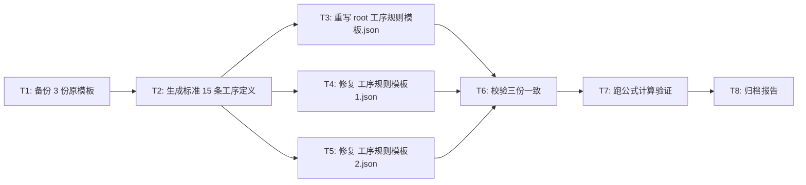

# TASK - planned_qty_formula 修复原子任务

## 任务依赖图

## 原子任务

### T1: 备份 3 份原模板
- **输入**: `data/工序规则模板.json`, `data/工序规则模板1.json`, `data/工序规则模板2.json`
- **输出**: 同名 `.bak` 文件
- **命令**: `Copy-Item data\工序规则模板*.json data\*.bak -Force`
- **验收**: 3 个 `.bak` 文件存在

### T2: 生成标准 15 条工序定义（Python dict，保存为内存变量）
- **输入**: 用户业务决策
- **输出**: 内存中的 `STANDARD_PROCESSES` 列表（15 条）
- **验收**:
  - 15 条工序
  - 每条含 11 个字段 (id, process_name, product_types_json, condition_expr, planned_qty_formula, priority, enabled, created_at, updated_at, default_worker, unit)
  - planned_qty_formula 用 `{}` 占位符

### T3: 重写 `data/工序规则模板.json`
- **输入**: T2 内存变量
- **输出**: root 模板文件，含 15 条工序完整字段
- **验收**:
  - `len(parsed) == 15`
  - 所有 11 字段齐全
  - planned_qty_formula 全部带 `{}`

### T4: 修复 `data/工序规则模板1.json`
- **输入**: T2 内存变量
- **输出**: tpl_1 文件
- **改动**:
  - planned_qty_formula 改为带 `{}` 占位符
  - 补 `unit` 字段（默认 `"件"`）
  - 补 `default_worker` 字段（默认 `""`）
- **验收**:
  - 15 条工序
  - 公式与 root/tpl_2 完全一致
  - 字段集合与 tpl_2 一致

### T5: 修复 `data/工序规则模板2.json`
- **输入**: T2 内存变量
- **输出**: tpl_2 文件
- **改动**: 仅改 planned_qty_formula 加 `{}` 占位符
- **验收**:
  - 15 条工序字段齐全（已含 unit/default_worker/updated_at）
  - 公式带 `{}`

### T6: 三份模板一致性校验
- **输入**: 修复后的 3 份模板
- **输出**: 校验报告
- **校验项**:
  - 工序数 = 15
  - 工序名集合完全一致
  - 字段集合完全一致
  - 同工序 planned_qty_formula 完全一致
- **命令**: `python _audit_process_templates.py` + `python _audit_formula_matrix.py`
- **验收**: 全部 ✅ 一致

### T7: 跑公式计算端到端验证
- **输入**: 修复后的模板 + 模拟订单数据
- **输出**: 各公式计算结果
- **模拟数据**:
  - 总长度=5 米
  - 网带节距=25.4 毫米
  - 物料数量=3 件
- **预期结果**:
  - 激光切板: `5*1000/25.4 = 196.85 → ceil = 197`
  - 编制左旋: `5*1000/25.4/2 = 98.42 → ceil = 99`
  - 原材料准备: `{物料数量}` = 3
- **命令**: 写 `_test_formula_eval.py` 模拟 ProcessCalcEngine.calculate_planned_qty
- **验收**: 3 个用例全部符合预期

### T8: 归档报告
- **输入**: T1-T7 全部结果
- **输出**: `ACCEPTANCE_公式修复.md`
- **内容**:
  - 修复前后对比表
  - 验证证据（grep/SQL/pytest 输出）
  - 不变更部分清单
  - 下一刀建议

## 复杂度评估

| 任务 | 预估代码量 | 风险 |
|------|-----------|------|
| T1 | 1 行 PowerShell | 无 |
| T2 | ~80 行 Python 数据 | 无 |
| T3 | ~150 行 JSON 写入 | 中（覆盖原文件） |
| T4 | ~150 行 JSON 写入 | 中 |
| T5 | ~150 行 JSON 写入 | 中 |
| T6 | 跑现成脚本 | 无 |
| T7 | ~50 行 Python 模拟 | 无 |
| T8 | 文档 | 无 |

## 风险控制

| 风险点 | 应对 |
|--------|------|
| 覆盖错文件 | T1 先备份；T3-T5 严格按路径 |
| 公式改错 | T7 端到端跑通才标完成 |
| 字段漏补 | T6 校验脚本会标红 |
| 数据库 `process_calc_rules` 表已存在旧数据 | 本次只动 JSON 模板，DB 不动 |
