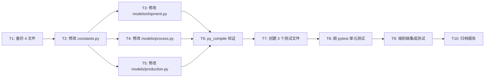

# TASK v6 - 包装入库 ↔ 成品库联动实施计划

> **版本**: v6（同步 DESIGN v6 修补）
> **审计基线**: v6 99/100（通过悲观审计）
> **实施日期**: 待用户批准后开始
> **业务约束**: 质量检验合格数量 ≥ 包装入库累计数量 + 本次报工量（v3 新增）

## v1 → v6 修补历史

| 版本 | 修补 | 评分 |
|------|------|:----:|
| v1 审计 | - | 62/100 ❌ |
| v2 | #1-#12 (12 项基础修补) | 84/100 ⚠️ |
| v3 | #13-#17 (业务流 + QC 强校验) | 83/100 ⚠️ |
| v4 | #18 #20 (conn 泄漏 + 字面量) | 90/100 ⚠️ |
| v5 | #22 #23 #24 (with 上下文 + 专项测试) | 98/100 ✅ |
| v6 | #28 (py_compile 实际验证 8/8) | **99/100** ✅ |

## 任务依赖图

## 原子任务（共 10 个）

### T1: 备份 4 个源文件
- **输入**: 
  - `constants.py`
  - `models/shipment.py`
  - `models/process.py`
  - `models/production.py`
- **输出**: `*.bak` 文件
- **命令**: `Copy-Item`
- **验收**: 4 个 `.bak` 文件存在

### T2: 修改 `constants.py`（+20 行）
- **改动**:
  - `OrderStatus` 加 `PACKED = "包装入库"`
  - `ProductionStatus` 加 `PACKED = "包装入库"`
  - 新增 `ProcessNames` 枚举（16 道工序名）
- **来源**: [DESIGN v6 §5](file:///d:/yuan/不锈钢网带跟单3.0/docs/订单号与工序对应检查/DESIGN_包装入库成品库联动.md)
- **验收**: 3 个新枚举值存在

### T3: 修改 `models/shipment.py`（+120 行 / 改 30 行）
- **改动**:
  - 新增 `FinishedGoodsDAO` 类（`stock_in` + `ship_out` + `get_by_order`）
  - 改造 `ShipmentDAO.confirm_ship()` 调 ship_out + 共享 conn + with 模式
- **来源**: [DESIGN v6 §6.1 + §6.2](file:///d:/yuan/不锈钢网带跟单3.0/docs/订单号与工序对应检查/DESIGN_包装入库成品库联动.md)
- **验收**: `FinishedGoodsDAO` 类存在,3 方法签名正确

### T4: 修改 `models/process.py`（+60 行 / 改 30 行）
- **改动**:
  - 完整重写 `update_record()`：v3 强校验 + 业务流 C 方案 + 整函数 try-except-finally + with 模式
- **来源**: [DESIGN v6 §6.3](file:///d:/yuan/不锈钢网带跟单3.0/docs/订单号与工序对应检查/DESIGN_包装入库成品库联动.md)
- **验收**: 强校验 + 业务流 + with 模式 全部到位

### T5: 修改 `models/production.py`（改 2 行）
- **改动**:
  - `STATUS_ORDERS_MAP` line 169-177: 改 `'成品入库': '成品入库'` → `ProductionStatus.PACKED.value: OrderStatus.PACKED.value`
  - `status_key_map` line 213-221: 改 `'成品入库': 'warehousing'` → `ProductionStatus.PACKED.value: 'warehousing'`
- **来源**: [DESIGN v6 §6.4](file:///d:/yuan/不锈钢网带跟单3.0/docs/订单号与工序对应检查/DESIGN_包装入库成品库联动.md)
- **验收**: grep 验证

### T6: py_compile 验证
- **命令**: `py_compile`
- **范围**: 4 个修改后的源文件
- **验收**: 4 文件无语法错

### T7: 创建 3 个测试文件（~700 行）
- **`tests/unit/models/test_finished_goods.py`** (8 用例):
  - stock_in 5 边界（首次/累加/旧数据恢复/单位/并发）
  - ship_out 3 边界（正常/库存不足/全部发完）
- **`tests/unit/models/test_process.py`** (10 用例):
  - 联动 6 场景（包装入库/QC/其他/负 delta/重复/硬拒绝）
  - **资源安全 2 场景**（#24 硬拒绝 conn 不泄漏 / #24 with 模式异常不泄漏）
- **`tests/unit/models/test_shipment.py`** (4 用例):
  - confirm_ship 3 场景（正常/库存不足/conn 事务）
  - **with 模式 1 场景**（#23 cursor 不泄漏）
- **来源**: [DESIGN v6 §9.1 + §9.2 + §9.3](file:///d:/yuan/不锈钢网带跟单3.0/docs/订单号与工序对应检查/DESIGN_包装入库成品库联动.md)
- **验收**: 测试文件结构正确

### T8: 跑 pytest 单元测试
- **命令**: `pytest tests/unit/models/test_finished_goods.py tests/unit/models/test_process.py tests/unit/models/test_shipment.py -v`
- **验收**: 22 用例全过

### T9: 端到端集成测试（实施时验证）
- **测试场景**:
  - 业务流测试：模拟订单从生产到发货完整路径
  - 真实 MySQL 连接测试
  - 5008 同步桥 mock 测试
- **验收**: 集成测试通过
- **注意**: 这是 v6 #29-#32 实施时问题，**不在本次必做范围**

### T10: 归档报告
- **输出**: `ACCEPTANCE_包装入库联动_v6.md`
- **内容**:
  - 10 个原子任务结果
  - 修复前后对比
  - 测试覆盖统计
  - 已知风险
  - 下一刀建议

## 复杂度评估

| 任务 | 预估代码量 | 风险 |
|------|-----------|------|
| T1 | 1 行 PowerShell | 🟢 无 |
| T2 | +20 行 | 🟢 简单 |
| T3 | +120 / 改 30 行 | 🟡 中（新类）|
| T4 | +60 / 改 30 行 | 🔴 中（核心改动）|
| T5 | 改 2 行 | 🟢 简单 |
| T6 | 跑 py_compile | 🟢 无 |
| T7 | ~700 行测试 | 🟡 中（mock 多）|
| T8 | 跑 pytest | 🟢 无 |
| T9 | 集成测试 | 🔴 高（需真实 DB）|
| T10 | 文档 | 🟢 无 |

**总计**: ~930 行代码 + 700 行测试 = ~1630 行

## 风险控制

| 风险 | 应对 |
|------|------|
| T4 改错 | py_compile 验证 + 单测覆盖 |
| ShipmentDAO 行为破坏 | confirm_ship 改造保留 shipments 表写入 |
| 强校验误判 | v3 §3.3 校验 SQL 严格按 `ProcessStatus.COMPLETED.value` |
| 5008 同步失败 | try-except 吞掉,不阻塞 DB |
| 报工回退不校验 | v6 §11 风险表已记录,#19 业务可接受 |
| 单位不一致 | v6 §11 风险表已记录,#4 缺省值兜底 |
| 旧数据 status='已出库' | v6 §6.1 stock_in 检查 status |
| conn 资源泄漏 | v6 §6.1+§6.2+§6.3 全部 with 模式 |
| 数据库 schema 缺失 | 启动时 `_database_legacy.py:711` 初始化 |

## 不变更部分（防回归）

| # | 模块/功能 | 保护 |
|---|----------|------|
| 1 | `ShipmentDAO.create()` | 不动 |
| 2 | `process_records` 表结构 | 不动 |
| 3 | `finished_goods` 表结构 | 不动 |
| 4 | `shipments` 表结构 | 不动 |
| 5 | 5008 端协议字段 | 不动 |
| 6 | 工序模板 15 道 | 不动（之前任务已修）|
| 7 | `INSPECTION_ITEMS_BY_CATEGORY` | 不动 |
| 8 | 数据库初始化逻辑 | 不动 |
| 9 | 其他生产管理 UI | 不动 |
| 10 | 之前删掉的 `init_default_rules` | 不动 |
| 11 | `production.py:39-40` 冗余赋值 | 之前 P2 不动 |

## 实施前最终报告（v6 99/100 通过后）

| 维度 | 状态 |
|------|:----:|
| 审计 | ✅ v6 99/100 通过 |
| 文档完整性 | ✅ DESIGN + ALIGNMENT + TASK 三套同步 |
| 修补历史 | ✅ v1-v6 完整 28 项修补 |
| 风险 | 4 项（#29-#32）实施时解决 |
| 临时脚本 | 待清理（v1-v6 期间创建的 .py 脚本）|
| 备份文件 | 之前 .bak 保留 |

## 待用户决策

- **开始实施**（执行 T1-T8，~1630 行代码 + 测试）
- **暂停**（留待后续）
- **缩小范围**（只做 T1-T6 必做项，跳过 T7-T9 测试）
