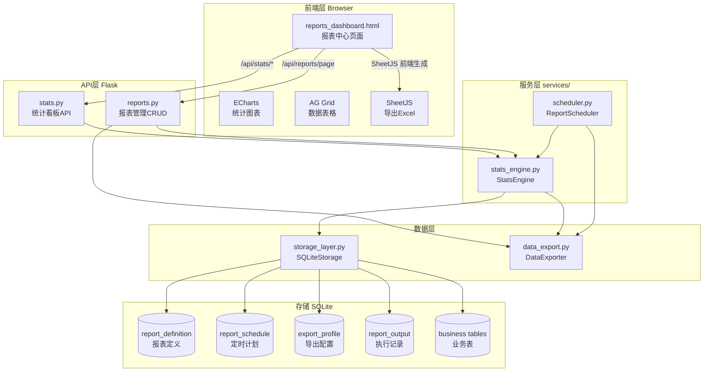
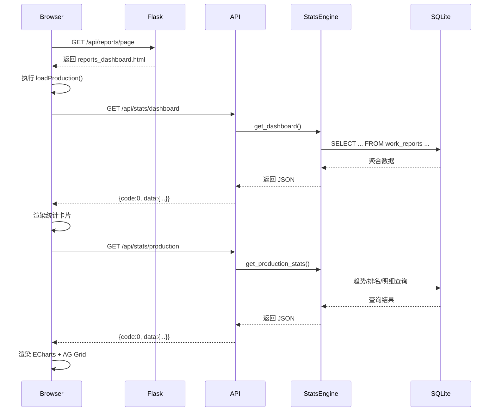
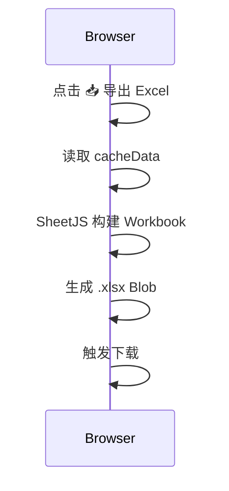
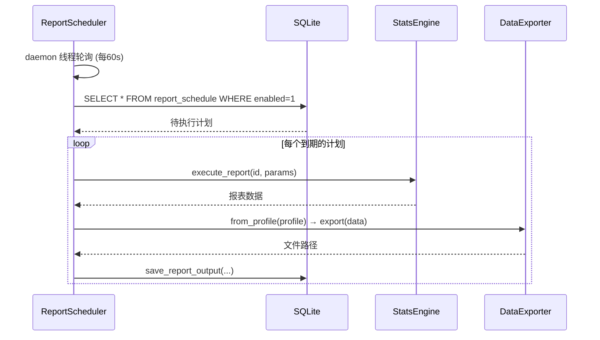

# DESIGN_专业报表引擎

## 项目名称
专业报表引擎

---

## 一、整体架构

### 1.1 架构图



### 1.2 分层设计

| 层级 | 技术 | 职责 |
|------|------|------|
| **前端** | Jinja2 + ECharts + AG Grid + SheetJS | 数据可视化、表格操作、Excel导出 |
| **API** | Flask Blueprint | 看板数据、报表CRUD、导出配置、定时计划 |
| **服务层** | StatsEngine / ReportScheduler | 统计计算、SQL模板渲染、定时任务调度 |
| **数据层** | SQLiteStorage (StorageFactory) | 报表元数据存储、业务数据查询 |
| **导出** | DataExporter (OpenPyXL) | 按模板生成 Excel/CSV |

---

## 二、模块设计

### 2.1 统计看板 API (api/stats.py)

| 端点 | 方法 | 功能 |
|------|------|------|
| `/api/stats/dashboard` | GET | 看板统计概览（今日报工、完成率、待审批、异常） |
| `/api/stats/production` | GET | 生产数据（趋势 trend、排名 product_ranking、明细 overview） |
| `/api/stats/cost` | GET | 成本数据（概览 overview、构成 breakdown、损耗 loss_analysis） |
| `/api/stats/worker` | GET | 人员数据（效率 efficiency、产出 output） |
| `/api/stats/report/<id>` | POST | 执行自定义报表（SQL模板渲染） |
| `/api/stats/report/<id>/export` | GET | 导出报表为文件 |

### 2.2 报表管理 API (api/reports.py)

| 端点 | 方法 | 功能 |
|------|------|------|
| `/api/reports/page` | GET | 渲染报表中心页面 |
| `/api/reports/definitions` | GET/POST | 报表定义列表/新建 |
| `/api/reports/definitions/<id>` | GET/PUT/DELETE | 报表定义详情/编辑/删除 |
| `/api/reports/profiles` | GET/POST | 导出配置列表/新建 |
| `/api/reports/profiles/<id>` | GET/PUT/DELETE | 导出配置详情/编辑/删除 |
| `/api/reports/schedules` | GET/POST | 定时计划列表/新建 |
| `/api/reports/schedules/<id>` | GET/PUT/DELETE | 定时计划详情/编辑/删除 |
| `/api/reports/scheduler/status` | GET | 调度器状态 |
| `/api/reports/scheduler/start` | POST | 启动调度器 |
| `/api/reports/scheduler/stop` | POST | 停止调度器 |
| `/api/reports/outputs` | GET | 执行记录列表 |

### 2.3 StatsEngine (services/stats_engine.py)

核心服务类，提供：

- **内置报表播种** `seed_builtin_reports()` — 9个预置报表（dashboard、production_overview/trend/ranking、cost_overview/breakdown/loss、worker_efficiency/output）
- **SQL模板引擎** `_render_sql(template, params)` — 支持 `{{param}}` 语法 + 安全值映射
- **看板数据** `get_dashboard()` / `get_production_stats()` / `get_cost_stats()` / `get_worker_stats()` — 聚合业务表数据
- **报表CRUD** `list_reports()` / `save_report()` / `delete_report()` / `execute_report()`
- **导出配置** `list_export_profiles()` / `save_export_profile()` / `delete_export_profile()`
- **定时计划** `list_schedules()` / `save_schedule()` / `delete_schedule()`
- **执行输出** `save_report_output()` / `list_report_outputs()`

### 2.4 ReportScheduler (services/scheduler.py)

- 基于后台 daemon 线程的定时调度器
- 支持 5 种频率：`daily` / `weekly` / `monthly` / `hourly` / `every_30min`
- 检查 `report_schedule` 表中启用的计划
- 到期自动执行报表 → 导出文件 → 保存输出记录

### 2.5 DataExporter (data_export.py)

| 方法 | 功能 |
|------|------|
| `DataExporter()` | 构造函数，设置基础配置 |
| `add_column(header, field, formatter)` | 添加列映射 |
| `export(data, format)` | 导出为 Excel/CSV 文件 |
| `from_profile(profile_data)` | 从导出配置模板创建导出器 |

### 2.6 存储层扩展 (storage_layer.py)

新增 4 张表 + 14 个方法：

| 表名 | 用途 | 关键字段 |
|------|------|----------|
| `report_definition` | 报表定义 | name, category, sql_template, chart_config |
| `report_schedule` | 定时计划 | report_id, cron_expression, enabled, export_format |
| `export_profile` | 导出配置 | name, format, sheet_name, columns_config |
| `report_output` | 执行记录 | report_name, format, status, file_path, error_message |

---

## 三、前端页面设计

### 3.1 布局

```
┌─────────────────────────────────────────────────────────┐
│  Header: [R] 报表中心  Report Center    ⏰ 14:30:25 🔄  │
├──────────┬──────────────────────────────────────────────┤
│ 侧边栏   │  主内容区                                     │
│          │                                               │
│ 📊 数据看板 │  📈 生产看板  [📥 导出 Excel]              │
│   📈 生产   │  ┌───┬───┬───┬───┐                        │
│   💰 成本   │  │今日│完成│待审│异常│                        │
│   👤 人员   │  └───┴───┴───┴───┘                        │
│   📋 综合   │  ┌────────┐ ┌────────┐                     │
│              │  │趋势图  │ │排名图  │                     │
│ ⚙️ 报表管理 │  └────────┘ └────────┘                     │
│   📄 定义   │  ┌─────────────────────────┐              │
│   📎 导出   │  │ AG Grid 生产明细表       │              │
│   ⏱ 计划   │  │ (排序/过滤/分页)         │              │
│   📁 记录   │  └─────────────────────────┘              │
└──────────┴──────────────────────────────────────────────┘
```

### 3.2 设计风格

- **主题**: 浅色金蝶/用友 ERP 风格
- **背景色**: `#f0f2f5`
- **主色**: `#1890ff` (Ant Design 蓝)
- **卡片**: `#ffffff` 白底 + `1px solid #e8e8e8` 边框 + 6px 圆角
- **表格**: AG Grid Alpine 主题，行高 38px，斑马纹，hover 高亮
- **图表**: ECharts 5，支持饼图/柱状图/趋势线/仪表盘
- **弹窗**: 居中 Modal，640px 宽，表单双列布局
- **通知**: 右上角 Toast，2.5s 自动消失

### 3.3 Tab 结构

| Tab | 内容 | 数据来源 |
|-----|------|----------|
| 生产看板 | 4统计卡片 + 趋势图 + 排名图 + AG Grid 明细 | `/api/stats/dashboard` + `/api/stats/production` |
| 成本看板 | 4统计卡片 + 成本构成饼图 + 损耗柱状图 | `/api/stats/cost` |
| 人员效率 | 2统计卡片 + 效率排行 + 产出对比 | `/api/stats/worker` |
| 综合看板 | 6统计卡片 + 趋势图 + 仪表盘 | `/api/stats/dashboard` + `/api/stats/production` |
| 报表定义 | AG Grid 列表 + 新建/编辑/删除/执行 Modal | `/api/reports/definitions` |
| 导出配置 | AG Grid 列表 + 新建/编辑/删除 Modal | `/api/reports/profiles` |
| 定时计划 | AG Grid 列表 + 新建/编辑/删除 Modal | `/api/reports/schedules` |
| 执行记录 | AG Grid 列表（只读） | `/api/reports/outputs` |

### 3.4 导出功能

每个看板页面顶部有 `📥 导出 Excel` 按钮，点击后 SheetJS 前端直接生成 .xlsx：

| 看板 | 导出的工作表 |
|------|------------|
| 生产看板 | 统计概览 + 生产明细 + 生产趋势 |
| 成本看板 | 成本概览 + 成本构成 + 损耗分析 |
| 人员效率 | 效率排行 + 产出对比 |
| 综合看板 | 综合概览 + 综合趋势 |

---

## 四、数据流

### 4.1 看板加载流程



### 4.2 报表导出流程



### 4.3 定时报表流程



---

## 五、依赖关系

### 5.1 包依赖

| 包 | 用途 | 引入方式 |
|----|------|----------|
| Flask | Web 框架 | 已有 |
| openpyxl | Excel 生成 | 已有 (data_export.py) |
| ECharts 5.4.3 | 图表 | CDN |
| AG Grid 31.3.1 | 数据表格 | CDN |
| SheetJS 0.18.5 | 前端 Excel 导出 | CDN |

### 5.2 模块依赖

```
reports_dashboard.html
  ├── ECharts (CDN)
  ├── AG Grid (CDN)
  └── SheetJS (CDN)

api/stats.py → services/stats_engine.py → storage_layer.py
api/reports.py → services/stats_engine.py, data_export.py
services/scheduler.py → services/stats_engine.py, data_export.py
```

---

## 六、内置报表列表

| ID | 名称 | 分类 | SQL 模板 |
|----|------|------|----------|
| builtin_dashboard | 看板概览 | overview | 聚合 work_reports 的今日/完成/待审/异常统计 |
| builtin_production_overview | 生产概览 | production | 按工序分组统计报工/合格/不合格数 |
| builtin_production_trend | 生产趋势 | production | 按日期统计报工数趋势 |
| builtin_production_ranking | 产品排名 | production | 按产品类型统计完成量排行 |
| builtin_cost_overview | 成本概览 | cost | 统计总成本/材料/人工/损耗 |
| builtin_cost_breakdown | 成本构成 | cost | 按成本类别分组统计 |
| builtin_cost_loss | 损耗分析 | cost | 统计损耗金额和损耗率 |
| builtin_worker_efficiency | 人员效率 | worker | 按操作员统计任务完成情况 |
| builtin_worker_output | 人员产出 | worker | 按操作员统计产出量 |

---

## 七、异常处理策略

| 场景 | 处理方式 |
|------|----------|
| API 返回 code !== 0 | toast 显示错误信息 |
| 看板暂无数据 | ECharts 显示"暂无数据"占位 |
| AG Grid 空数据 | 显示空行（自动） |
| SQL 模板渲染错误 | 记录日志，返回错误信息 |
| 定时器线程异常 | 捕获日志，不中断主进程 |
| 导出失败 | toast 提示 + 记录到 report_output.error_message |
| 网络中断 | fetch 超时，toast 提示 |

---

## 八、质量门控

- [x] 后端所有 API 返回统一格式 `{code, message, data}`
- [x] 看板数据有缓存，切换 Tab 不重复请求
- [x] 前端零语法错误（VS Code diagnostics 通过）
- [x] 所有 CRUD 操作完成后自动刷新列表
- [x] 定时任务异常不影响主流程
- [x] 导出按钮在无数据时给出明确提示
- [x] 遵循项目现有代码规范（Flask Blueprint、StorageFactory、@success/@fail 装饰器）
