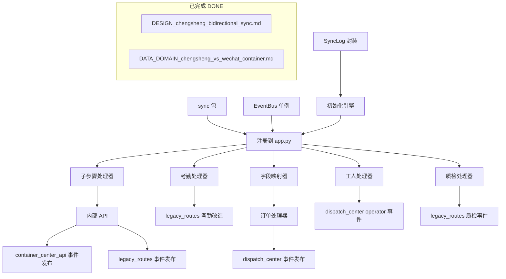

# TASK - 晨圣报工双向同步事件驱动实现

## 前置说明

- **项目根目录**: `d:\yuan\不锈钢网带跟单3.0\mobile_api_ai\`
- **设计文档**: `docs/chengsheng_sync/DESIGN_chengsheng_bidirectional_sync.md`
- **数据域文档**: `docs/chengsheng_sync/DATA_DOMAIN_chengsheng_vs_wechat_container.md`
- **Python 版本**: 3.9+
- **数据库**: SQLite（本地）/ MySQL（云端）
- **日志**: `import logging; logger = logging.getLogger(__name__)`

## 环境依赖

```
pip install flask requests
```

已有依赖（项目已安装）：flask, requests, python-dotenv, pymysql, pyjwt, flask-cors

---

## 第一阶段：事件基础设施（P0）

### 任务 1.1 — 创建 sync 包

**文件**: `sync/__init__.py`

```python
# -*- coding: utf-8 -*-
```

**文件**: `sync/handlers/__init__.py`

```python
# -*- coding: utf-8 -*-
```

### 任务 1.2 — EventBus 单例

**文件**: `sync/event_bus.py`

**契约**:
- 发布者: EventBus 单例类，支持 on/off 注册和 publish 发布
- 线程安全: 使用 threading.Lock
- 日志: 发布和订阅操作记录日志

**核心 API**:
```python
class EventBus:
    _instance = None
    _lock = threading.Lock()

    @classmethod
    def get(cls) -> 'EventBus'

    def subscribe(self, event_type: str, handler: callable)
    def unsubscribe(self, event_type: str, handler: callable)
    def publish(self, event_type: str, data: dict)
```

### 任务 1.3 — SyncLog 封装

**文件**: `sync/sync_log.py`

**契约**:
- 操作 sync_log 表（建表 DDL 内联在类中）
- 表结构: id, event_type, direction, record_id, status, error_msg, created_at
- 写入成功/失败日志

**核心 API**:
```python
class SyncLog:
    TABLE_NAME = 'sync_log'
    
    @classmethod
    def ensure_table(cls)
    @classmethod
    def write(cls, event_type, direction, record_id, status='success', error_msg='')
```

### 任务 1.4 — 初始化引擎

**文件**: `sync/init.py`

**契约**:
- `init_sync_engine()` 函数，在 app 启动时调用
- 注册所有 12 个事件订阅
- 确保 sync_log 表存在
- 记录初始化日志

```python
def init_sync_engine():
    SyncLog.ensure_table()
    EventBus.get().subscribe(...)
    ...
```

### 任务 1.5 — 注册到 app.py

**修改文件**: `app.py`

**变更**:
- 在 `create_app()` 末尾，return app 之前，调用 `init_sync_engine()`
- 新增 `from sync.init import init_sync_engine` 导入

---

## 第二阶段：报工子步骤事件同步 + 内部 API（P0）

### 任务 2.1 — 创建子步骤同步处理器

**文件**: `sync/handlers/sub_step_handler.py`

**契约**:
- 接收 `sub_step.created` 事件
- 查询 chengsheng.db 获取最新数据
- 写入 wechat_container.db（调用 container_center API 或直接 SQLite）
- 记录 sync_log
- 调用内部 API `POST /api/internal/check-advance` 触发推进+推送

```python
def sync_sub_step_handler(data: dict):
    # 1. 同步到 wechat_container.db
    # 2. 调用内部 API 触发推进
```

### 任务 2.2 — 添加内部 API check-advance

**修改文件**: `container_center_api.py`

**新增路由**:
```python
@app.route('/api/internal/check-advance', methods=['POST'])
def api_internal_check_advance():
    # 复用推进判断逻辑
    # 调用 push_to_report_system() + _sync_status_to_all_systems()
```

### 任务 2.3 — container_center_api.py 添加事件发布

**修改文件**: `container_center_api.py`

**变更**:
- `api_create_sub_step()` 末尾: 替换 `_sync_sub_step_to_chengsheng(record)` 为 `EventBus.get().publish('sub_step.created', record)`
- 新增导入: `from sync.event_bus import EventBus`

### 任务 2.4 — legacy_routes.py 添加事件发布

**修改文件**: `api/legacy_routes.py`

**变更**:
- `_insert_sub_step(record)` 末尾: 新增 `EventBus.get().publish('sub_step.created', record)`
- `api_create_sub_step()` 末尾: 在返回前调用 `EventBus.get().publish('sub_step.created', record)`
- 新增导入: `from sync.event_bus import EventBus`

---

## 第三阶段：考勤持久化（P0）

### 任务 3.1 — 创建考勤同步处理器

**文件**: `sync/handlers/attendance_handler.py`

**契约**:
- 接收 `attendance.created` / `attendance.updated` 事件
- 同步考勤数据到 wechat_container.db（可选，如果调度中心需要）
- 记录 sync_log

### 任务 3.2 — legacy_routes.py 考勤改造

**修改文件**: `api/legacy_routes.py`

**变更**:
- `api_get_attendance()`: 从 chengsheng.db 的 attendance 表读取
- `api_post_attendance()`: 写入 chengsheng.db 的 attendance 表 + 发布事件

**DDL（已存在于 chengsheng.db）**:
```sql
CREATE TABLE IF NOT EXISTS attendance (
    id INTEGER PRIMARY KEY AUTOINCREMENT,
    worker TEXT NOT NULL,
    date TEXT NOT NULL,
    sign_in TEXT,
    sign_out TEXT,
    status TEXT DEFAULT 'present',
    remark TEXT,
    created_at TEXT DEFAULT (datetime('now', 'localtime'))
);
```

---

## 第四阶段：订单/排产事件同步（P1）

### 任务 4.1 — 创建字段映射器

**文件**: `sync/mappers/__init__.py`
**文件**: `sync/mappers/field_mapper.py`

**契约**:
- 状态值转换（chengsheng ↔ wechat_container 的状态枚举映射）
- 字段名映射（两个库的字段差异）

### 任务 4.2 — 创建订单/排产同步处理器

**文件**: `sync/handlers/order_handler.py`

**契约**:
- 接收 `process.created` 事件
- 接收 `process.updated` 事件
- 同步 process_records ↔ orders 表
- 使用 field_mapper 转换字段

### 任务 4.3 — dispatch_center.py 添加事件发布

**修改文件**: `dispatch_center.py`

**变更**:
- `createProcess()`: 发布 `process.created` 事件
- `assignProcess()`: 发布 `process.updated` 事件
- `advanceProcess()`: 发布 `process.updated` 事件
- `rejectProcess()`: 发布 `process.updated` 事件

---

## 第五阶段：工人/质检事件同步（P1）

### 任务 5.1 — 创建工人同步处理器

**文件**: `sync/handlers/worker_handler.py`

**契约**:
- 接收 `operator.created` / `operator.deleted` 事件
- 同步 chengsheng.db.workers ↔ dispatch_center 操作员

### 任务 5.2 — 创建质检同步处理器

**文件**: `sync/handlers/quality_handler.py`

**契约**:
- 接收 `quality.created` 事件
- 同步质检数据到 chengsheng.db

### 任务 5.3 — dispatch_center.py 添加 operator 事件

**修改文件**: `dispatch_center.py`

**变更**:
- `saveOperator()`: 发布 `operator.created` 事件
- `deleteOperator()`: 发布 `operator.deleted` 事件
- `toggleOperator()`: 发布 `operator.updated` 事件

### 任务 5.4 — legacy_routes.py 添加质检事件

**修改文件**: `api/legacy_routes.py`

**变更**:
- `api_submit_quality()`: 末尾发布 `quality.created` 事件

---

## 依赖关系图



---

## 验收标准

### 阶段1 验收
- [ ] `EventBus.get()` 返回单例对象
- [ ] 订阅和发布稳定运行
- [ ] sync_log 表在 wechat_container.db 中存在
- [ ] 应用启动时 init_sync_engine() 被调用，无报错

### 阶段2 验收
- [ ] 子步骤写入后，自动同步到对方数据库
- [ ] sync_log 记录同步成功/失败
- [ ] `POST /api/internal/check-advance` 正确触发推进+推送
- [ ] 报工完成后企业微信收到通知

### 阶段3 验收
- [ ] 考勤数据写入 chengsheng.db.attendance 表
- [ ] 考勤数据可查询/持久化（重启后不丢失）

### 阶段4 验收
- [ ] 排产创建时，订单数据同步到 chengsheng.db
- [ ] 推进/驳回时状态同步

### 阶段5 验收
- [ ] 操作员增删改同步到 chengsheng.db
- [ ] 质检提交同步到 chengsheng.db
